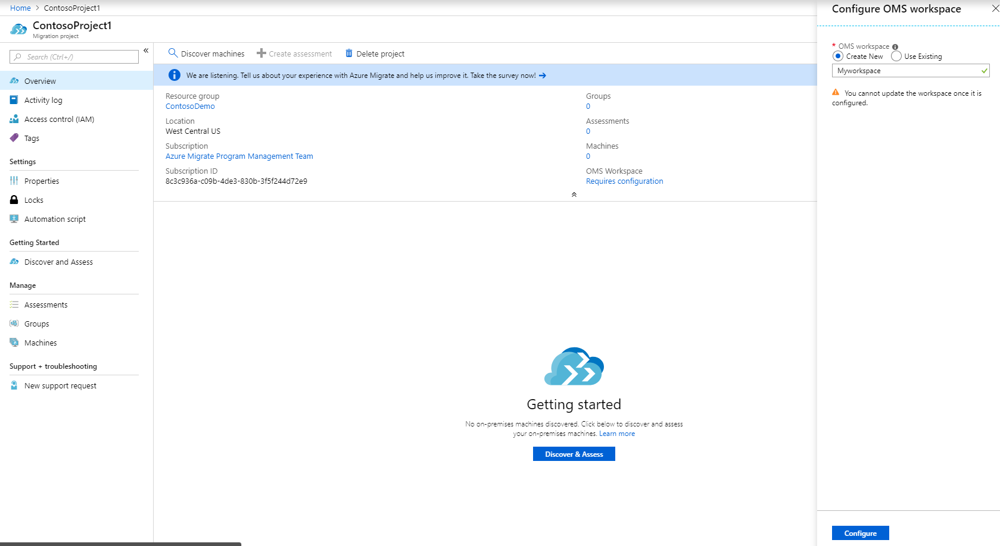
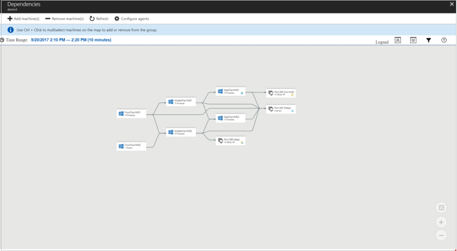

# Refine a group using group dependency mapping

This article describes how to refine a group by visualizing dependencies of all machines in the group. You typically use this method when you want to refine membership for an existing group, by cross-checking group dependencies, before you run an assessment. Refining a group using dependency visualization can help you effectively plan your migration to Azure. You can discover all interdependent systems that need to migrate together. It helps you ensure that nothing is left behind and surprise outages do not occur when you are migrating to Azure.


> [!NOTE]
> Groups for which you want to visualize dependencies shouldn't contain more than 10 machines. If you have more than 10 machines in the group, we recommend you to split it into smaller groups to leverage the dependency visualization functionality.


## Prepare for dependency visualization
Azure Migrate leverages Service Map solution in Log Analytics to enable dependency visualization of machines.

### Associate a Log Analytics workspace
To leverage dependency visualization, you need to associate a Log Analytics workspace, either new or existing, with an Azure Migrate project. You can only create or attach a workspace in the same subscription where the migration project is created.

- To attach a Log Analytics workspace to a project, in **Overview**, go to **Essentials** section of the project click **Requires configuration**

    

- When you create a new workspace, you need to specify a name for the workspace. The workspace is then created in the same subscription as the migration project and in a region in the same [Azure geography](https://azure.microsoft.com/global-infrastructure/geographies/) as the migration project.
- The **Use existing** option lists only those workspaces that are created in regions where Service Map is available. If you have a workspace in a region where Service Map is not available, it will not be listed in the drop-down.

> [!NOTE]
> You cannot change the workspace associated to a migration project.

### Download and install the VM agents
To view dependencies of a group, you need to download and install agents on each on-premises machine that is part of the group. In addition, if you have machines with no internet connectivity, you need to download and install [OMS gateway](../log-analytics/log-analytics-oms-gateway.md) on them.

1. In **Overview**, click **Manage** > **Groups**, go to the required group.
2. In the list of machines, in the **Dependency agent** column, click **Requires installation** to see instructions regarding how to download and install the agents.
3. On the **Dependencies** page, download and install the Microsoft Monitoring Agent (MMA), and the Dependency agent on each VM that is part of the group.
4. Copy the workspace ID and key. You need these when you install the MMA on the on-premises machines.

### Install the MMA

To install the agent on a Windows machine:

1. Double-click the downloaded agent.
2. On the **Welcome** page, click **Next**. On the **License Terms** page, click **I Agree** to accept the license.
3. In **Destination Folder**, keep or modify the default installation folder > **Next**.
4. In **Agent Setup Options**, select **Azure Log Analytics** > **Next**.
5. Click **Add** to add a new Log Analytics workspace. Paste in the workspace ID and key that you copied from the portal. Click **Next**.


To install the agent on a Linux machine:

1. Transfer the appropriate bundle (x86 or x64) to your Linux computer using scp/sftp.
2. Install the bundle by using the --install argument.

    ```sudo sh ./omsagent-<version>.universal.x64.sh --install -w <workspace id> -s <workspace key>```


### Install the Dependency agent
1. To install the Dependency agent on a Windows machine, double-click the setup file and follow the wizard.
2. To install the Dependency agent on a Linux machine, install as root using the following command:

    ```sh InstallDependencyAgent-Linux64.bin```

Learn more about the Dependency agent support for the [Windows](../monitoring/monitoring-service-map-configure.md#supported-windows-operating-systems) and [Linux](../monitoring/monitoring-service-map-configure.md#supported-linux-operating-systems) operating systems.

## Refine the group based on dependency visualization
Once you have installed agents on all the machines of the group, you can visualize the dependencies of the group and refine it by following the below steps.

1. In the Azure Migrate project, under **Manage**, click **Groups**, and select the group.
2. On the group page, click **View Dependencies**, to open the group dependency map.
3. The dependency map for the group shows the following details:
    - Inbound (Clients) and outbound (Servers) TCP connections to/from all the machines that are part of the group
        - The dependent machines that do not have the MMA and dependency agent installed are grouped by port numbers
        - The dependent machines that have the MMA and the dependency agent installed are shown as separate boxes
    - Processes running inside the machine, you can expand each machine box to view the processes
    - Properties like Fully Qualified Domain Name, Operating System, MAC Address etc. of each machine, you can click on each machine box to view these details

     

3. To view more granular dependencies, click the time range to modify it. By default, the range is an hour. You can modify the time range, or specify start and end dates, and duration.
4. Verify the dependent machines, the process running inside each machine and identify the machines that should be added or removed from the group.
5. Use Ctrl+Click to select machines on the map to add or remove them from the group.
    - You can only add machines that have been discovered.
    - Adding and removing machines from a group invalidates past assessments for it.
    - You can optionally create a new assessment when you modify the group.
5. Click **OK** to save the group.

    

If you want to check the dependencies of a specific machine that appears in the group dependency map, [set up machine dependency mapping](how-to-create-group-machine-dependencies.md).


## Next steps
- [Learn more](https://docs.microsoft.com/azure/migrate/resources-faq#dependency-visualization) about the FAQs on dependency visualization.
- [Learn more](concepts-assessment-calculation.md) about how assessments are calculated.
