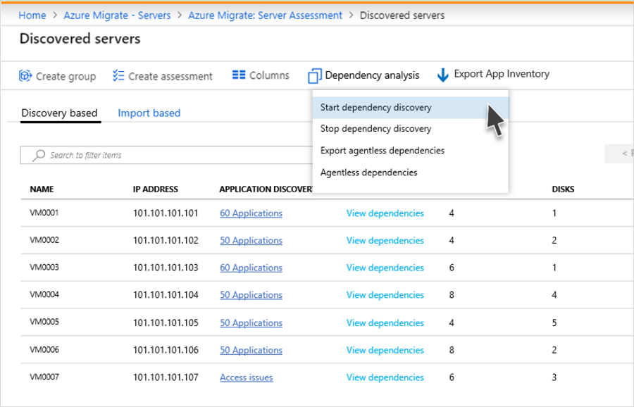
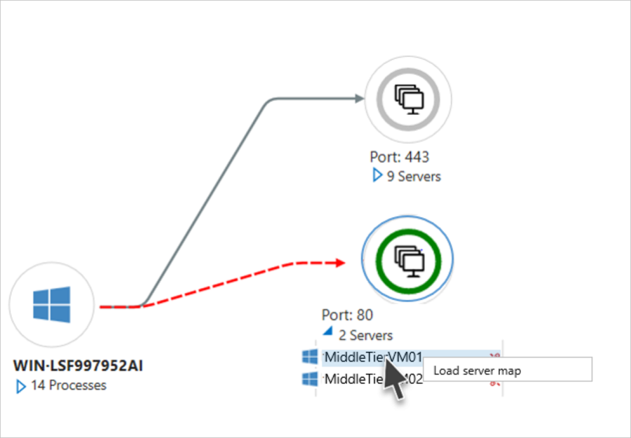
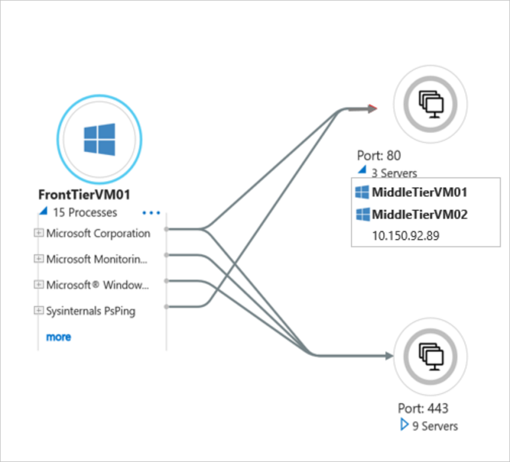
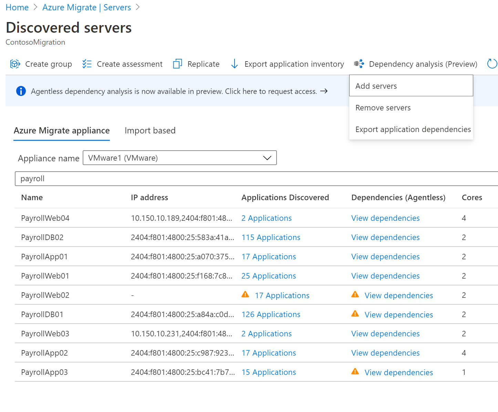

# Analyze machine dependencies (agentless)

This article describes how to set up agentless dependency analysis in Azure Migrate:Server Assessment. [Dependency analysis](concepts-dependency-visualization.md) helps you to identify and understand dependencies across machines for assessment and migration to Azure.

> [!IMPORTANT]
> Agentless dependency visualization is currently in preview for VMware VMs discovered with the Azure Migrate:Server Assessment tool.
> Features might be limited or incomplete.
> This preview is covered by customer support and can be used for production workloads.
> For more information, see [Supplemental Terms of Use for Microsoft Azure Previews](https://azure.microsoft.com/support/legal/preview-supplemental-terms/).

## Current limitations

- In the dependency analysis view, you can't currently add or remove a server from a group.
- A dependency map for a group of servers isn't currently available.
- The dependency data can't be downloaded in tabular format.

## Before you start

- [Review](migrate-support-matrix-vmware.md#dependency-analysis-requirements-agentless) supported operating systems, and required permissions.
- Make sure you:
    - Have an Azure Migrate project. If you don't, [create](how-to-add-tool-first-time.md) one now.
    - Check that you've [added](how-to-assess.md) the Azure Migrate:Server Assessment tool to the project.
    - Set up an [Azure Migrate appliance](migrate-appliance.md) to discover on-premises machines. [Set up an appliance](how-to-set-up-appliance-vmware.md) for VMware VMs. The appliance discovers on-premises machines, and sends metadata and performance data to Azure Migrate:Server Assessment.
- Check that VMware Tools (later than 10.2) is installed on each VM you want to analyze.

## Create a user account for discovery

Set up a user account so that Server Assessment can access the VM to discover dependencies. [Learn](migrate-support-matrix-vmware.md#dependency-analysis-requirements-agentless) about account requirements for Windows and Linux VMs.

## Add the user account to the appliance

Add the user account to the appliance.

1. Open the appliance management app. 
2. Navigate to the **Provide vCenter details** panel.
3. In **Discover application and dependencies on VMs**, click **Add credentials**
3. Choose the **Operating system**, provide a friendly name for the account, and the **User name**/**Password**
6. Click **Save**.
7. Click **Save and start discovery**.

    

## Start dependency discovery

Choose the machines on which you want to enable dependency discovery.

1. In **Azure Migrate: Server Assessment**, click **Discovered servers**.
2. Click the **Dependency analysis** icon.
3. Click **Add servers**.
4. In the **Add servers** page, choose the appliance that's discovering the relevant machines.
5. From the machine list, select the machines.
6. Click **Add servers**.

    

You can visualize dependencies around six hours after starting dependency discovery.

## Visualize dependencies

1. In **Azure Migrate: Server Assessment**, click **Discovered servers**.
2. Search for the machine you want to view.
3. In the **Dependencies** column, click **View dependencies**
4. Change the time period for which you want to view the map using the **Time duration** dropdown.
5. Expand the **Client** group to list the machines with a dependency on the selected machine.
6. Expand the **Port** group to list the machines that have a dependency from the selected machine.
7. To navigate to the map view of any of the dependent machines, click on the machine name > **Load server map**

    

    

8. Expand the selected machine to view process-level details for each dependency.

    

> [!NOTE]
> Process information for a dependency is not always available. If it's not available, the dependency is depicted with the process marked as "Unknown process".

## Export dependency data

1. In **Azure Migrate: Server Assessment**, click **Discovered servers**.
2. Click the **Dependency analysis** icon.
3. Click **Export Application Dependencies**.
4. In the **Export Application Dependencies** page, choose the appliance that's discovering the relevant machines.
5. Select the start time and end time. Note that you can download the data only for the last 30 days.
6. Click **Export dependency**.

The dependency data is exported and downloaded in a CSV format. The downloaded file contains the dependency data across all machines enabled for dependency analysis. 

### Dependency information

Each row in the exported CSV corresponds to a dependency observed in the specified time slot. 

The following table summarizes the fields in the exported CSV. Note that server name, application and process fields are populated only for servers that have agentless dependency analysis enabled.

**Field name** | **Details**
--- | --- 
Timeslot | The timeslot during which the dependency was observed.   Dependency data is captured over 6-hour slots currently.
Source server name | Name of the source machine 
Source application | Name of the application on the source machine 
Source process | Name of the process on the source machine 
Destination server name | Name of the destination machine
Destination IP | IP address of the destination machine
Destination application | Name of the application on the destination machine
Destination process | Name of the process on the destination machine 
Destination port | Port number on the destination machine

## Stop dependency discovery

Choose the machines on which you want to stop dependency discovery.

1. In **Azure Migrate: Server Assessment**, click **Discovered servers**.
2. Click the **Dependency analysis** icon.
3. Click **Remove servers**.
3. In the **Remove servers** page, choose the **appliance** that is discovering the VMs on which you look to stop dependency discovery.
4. From the machine list, select the machines.
5. Click **Remove servers**.

## Next steps

[Group machines](how-to-create-a-group.md) for assessment.
