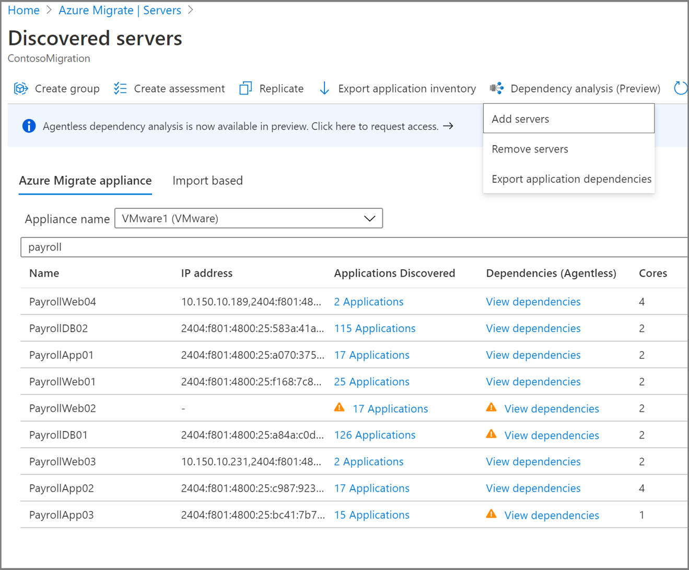

# Analyze machine dependencies (agentless)

This article describes how to set up agentless dependency analysis in Azure Migrate:Server Assessment. [Dependency analysis](concepts-dependency-visualization.md) helps you to identify and understand dependencies across machines for assessment and migration to Azure.


> [!IMPORTANT]
> Agentless dependency visualization is currently in preview for VMware VMs discovered with the Azure Migrate:Server Assessment tool.
> Features might be limited or incomplete.
> This preview is covered by customer support and can be used for production workloads.
> For more information, see [Supplemental Terms of Use for Microsoft Azure Previews](https://azure.microsoft.com/support/legal/preview-supplemental-terms/).

## Current limitations

- In the dependency analysis view, you can't currently add or remove a server from a group.
- A dependency map for a group of servers isn't currently available.
- In an Azure Migrate project, dependency data collection can be set up concurrently for 1000 servers. You can analyze a higher number of servers by sequencing in batches of 1000.

## Before you start

- [Review](migrate-support-matrix-vmware.md#dependency-analysis-requirements-agentless) supported operating systems, and required permissions.
- Make sure you:
    - Have an Azure Migrate project. If you don't, [create](how-to-add-tool-first-time.md) one now.
    - Check that you've [added](how-to-assess.md) the Azure Migrate:Server Assessment tool to the project.
    - Set up an [Azure Migrate appliance](migrate-appliance.md) to discover on-premises machines. [Set up an appliance](how-to-set-up-appliance-vmware.md) for VMware VMs. The appliance discovers on-premises machines, and sends metadata and performance data to Azure Migrate:Server Assessment.
- Check that VMware Tools (later than 10.2) is installed on each VM you want to analyze.


## Create a user account for discovery

Set up a user account so that Server Assessment can access the VM to discover dependencies. [Learn](migrate-support-matrix-vmware.md#dependency-analysis-requirements-agentless) about account requirements for Windows and Linux VMs.


## Add the user account to the appliance

Add the user account to the appliance.

1. Open the appliance management app. 
2. Navigate to the **Provide vCenter details** panel.
3. In **Discover application and dependencies on VMs**, click **Add credentials**
3. Choose the **Operating system**, provide a friendly name for the account, and the **User name**/**Password**
6. Click **Save**.
7. Click **Save and start discovery**.

    

## Start dependency discovery

Choose the machines on which you want to enable dependency discovery. 

1. In **Azure Migrate: Server Assessment**, click **Discovered servers**.
2. Click the **Dependency analysis** icon.
3. Click **Add servers**.
4. In the **Add servers** page, choose the appliance that's discovering the relevant machines.
5. From the machine list, select the machines.
6. Click **Add servers**.

    

You can visualize dependencies around six hours after starting dependency discovery. If you want to enable several machines, you may use [PowerShell](#start-or-stop-dependency-discovery-using-powershell) to do so.

## Visualize dependencies

1. In **Azure Migrate: Server Assessment**, click **Discovered servers**.
2. Search for the machine you want to view.
3. In the **Dependencies** column, click **View dependencies**
4. Change the time period for which you want to view the map using the **Time duration** dropdown.
5. Expand the **Client** group to list the machines with a dependency on the selected machine.
6. Expand the **Port** group to list the machines that have a dependency from the selected machine.
7. To navigate to the map view of any of the dependent machines, click on the machine name > **Load server map**

    

    

8. Expand the selected machine to view process-level details for each dependency.

    

> [!NOTE]
> Process information for a dependency is not always available. If it's not available, the dependency is depicted with the process marked as "Unknown process".

## Export dependency data

1. In **Azure Migrate: Server Assessment**, click **Discovered servers**.
2. Click the **Dependency analysis** icon.
3. Click **Export Application Dependencies**.
4. In the **Export Application Dependencies** page, choose the appliance that's discovering the relevant machines.
5. Select the start time and end time. Note that you can download the data only for the last 30 days.
6. Click **Export dependency**.

The dependency data is exported and downloaded in a CSV format. The downloaded file contains the dependency data across all machines enabled for dependency analysis. 



### Dependency information

Each row in the exported CSV corresponds to a dependency observed in the specified time slot. 

The following table summarizes the fields in the exported CSV. Note that server name, application and process fields are populated only for servers that have agentless dependency analysis enabled.

**Field name** | **Details**
--- | --- 
Timeslot | The timeslot during which the dependency was observed. <br/> Dependency data is captured over 6-hour slots currently.
Source server name | Name of the source machine 
Source application | Name of the application on the source machine 
Source process | Name of the process on the source machine 
Destination server name | Name of the destination machine
Destination IP | IP address of the destination machine
Destination application | Name of the application on the destination machine
Destination process | Name of the process on the destination machine 
Destination port | Port number on the destination machine


## Stop dependency discovery

Choose the machines on which you want to stop dependency discovery. 

1. In **Azure Migrate: Server Assessment**, click **Discovered servers**.
2. Click the **Dependency analysis** icon.
3. Click **Remove servers**.
3. In the **Remove servers** page, choose the **appliance** that is discovering the VMs on which you look to stop dependency discovery.
4. From the machine list, select the machines.
5. Click **Remove servers**.

If you want to stop dependency on several machines, you may use [PowerShell](#start-or-stop-dependency-discovery-using-powershell) to do so.


## Start or stop dependency discovery using PowerShell

Download the PowerShell module from [Azure PowerShell Samples](https://github.com/Azure/azure-docs-powershell-samples/tree/master/azure-migrate/dependencies-at-scale) repo on GitHub.


### Log in to Azure

1. Log into your Azure subscription using the Connect-AzAccount cmdlet.

    ```PowerShell
    Connect-AzAccount
    ```
    If using Azure Government, use the following command.
    ```PowerShell
    Connect-AzAccount -EnvironmentName AzureUSGovernment
    ```

2. Select the subscription in which you have created the Azure Migrate project 

    ```PowerShell
    select-azsubscription -subscription "Fabrikam Demo Subscription"
    ```

3. Import the downloaded AzMig_Dependencies PowerShell module

    ```PowerShell
    Import-Module .\AzMig_Dependencies.psm1
    ```

### Enable or disable dependency data collection

1. Get the list of discovered VMware VMs in your Azure Migrate project using the following commands. In the example below, the project name is FabrikamDemoProject, and the resource group it belongs to is FabrikamDemoRG. The list of machines will be saved in FabrikamDemo_VMs.csv

    ```PowerShell
    Get-AzMigDiscoveredVMwareVMs -ResourceGroupName "FabrikamDemoRG" -ProjectName "FabrikamDemoProject" -OutputCsvFile "FabrikamDemo_VMs.csv"
    ```

    In the file, you can see the VM display name, current status of dependency collection and the ARM ID of all discovered VMs. 

2. To enable or disable dependencies, create an input CSV file. The file is required to have a column with header "ARM ID". Any additional headers in the CSV file will be ignored. You can create the CSV using the file generated in the previous step. Create a copy of the file retaining the VMs you want to enable or  disable dependencies on. 

    In the following example, dependency analysis is being enabled on the list of VMs in the input file FabrikamDemo_VMs_Enable.csv.

    ```PowerShell
    Set-AzMigDependencyMappingAgentless -InputCsvFile .\FabrikamDemo_VMs_Enable.csv -Enable
    ```

    In the following example, dependency analysis is being disabled on the list of VMs in the input file FabrikamDemo_VMs_Disable.csv.

    ```PowerShell
    Set-AzMigDependencyMappingAgentless -InputCsvFile .\FabrikamDemo_VMs_Disable.csv -Disable
    ```

## Visualize network connections in Power BI

Azure Migrate offers a Power BI template that you can use to visualize network connections of many servers at once, and filter by process and server. To visualize, load the Power BI with dependency data as per the below instructions.

1. Download the PowerShell module and the Power BI template from [Azure PowerShell Samples](https://github.com/Azure/azure-docs-powershell-samples/tree/master/azure-migrate/dependencies-at-scale) repo on GitHub.

2. Log in to Azure using the below instructions: 
- Log into your Azure subscription using the Connect-AzAccount cmdlet.

    ```PowerShell
    Connect-AzAccount
    ```

- If using Azure Government, use the following command.

    ```PowerShell
    Connect-AzAccount -EnvironmentName AzureUSGovernment
    ```

- Select the subscription in which you have created the Azure Migrate project 

    ```PowerShell
    select-azsubscription -subscription "Fabrikam Demo Subscription"
    ```

3. Import the downloaded AzMig_Dependencies PowerShell module

    ```PowerShell
    Import-Module .\AzMig_Dependencies.psm1
    ```

4. Run the following command. This command downloads the dependencies data in a CSV and processes it to generate a list of unique dependencies that can be used for visualization in Power BI. In the example below the project name is FabrikamDemoProject, and the resource group it belongs to is FabrikamDemoRG. The dependencies will be downloaded for machines discovered by FabrikamAppliance. The unique dependencies will be saved in FabrikamDemo_Dependencies.csv

    ```PowerShell
    Get-AzMigDependenciesAgentless -ResourceGroup FabrikamDemoRG -Appliance FabrikamAppliance -ProjectName FabrikamDemoProject -OutputCsvFile "FabrikamDemo_Dependencies.csv"
    ```

5. Open the downloaded Power BI template

6. Load the downloaded dependency data in Power BI.
    - Open the template in Power BI.
    - Click on **Get Data** on the tool bar. 
    - Choose **Text/CSV** from Common data sources.
    - Choose the dependencies file downloaded.
    - Click **Load**.
    - You will see a table is imported with the name of the CSV file. You can see the table in the fields bar on the right. Rename it to AzMig_Dependencies
    - Click on refresh from the tool bar.

    The Network Connections chart and the Source server name, Destination server name, Source process name, Destination process name slicers should light up with the imported data.

7. Visualize the map of network connections filtering by servers and processes. Save your file.


## Next steps

[Group machines](how-to-create-a-group.md) for assessment.
