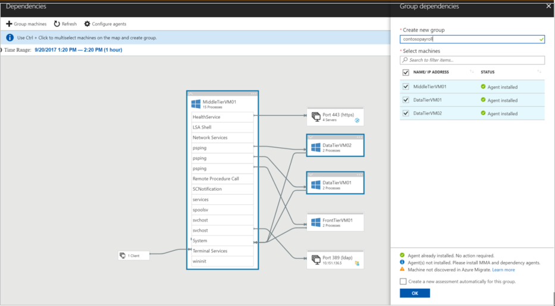

# Assess a group using machine dependency mapping

This article describes how to create a group of machines for [Azure Migrate](migrate-overview.md) assessment using machine dependency mapping. You typically use this method when you want to assess groups of VMs with higher levels of confidence by cross-checking machine dependencies, before you run an assessment.


## Prepare machines for dependency mapping
To include machines in dependency mapping, you need to download and install agents on each on-premises machine that you want to evaluate. In addition, if you have machines with no internet connectivity, you need to download and install [OMS gateway](../log-analytics/log-analytics-oms-gateway.md) on them.

### Download and install the VM agents
1. In **Overview**, click **Manage** > **Machines**, and select the required machine.
2. In the **Dependencies** column, click **Install agents**. 
3. On the **Dependencies** page, download and install the Microsoft Monitoring Agent (MMA), and the Dependency agent on each VM you want to evaluate.
4. Copy the workspace ID and key. You need these when you install the MMA on the on-premises machine.

### Install the MMA

To install the agent on a Windows machine:

1. Double-click the downloaded agent.
2. On the **Welcome** page, click **Next**. On the **License Terms** page, click **I Agree** to accept the license.
3. In **Destination Folder**, keep or modify the default installation folder > **Next**. 
4. In **Agent Setup Options**, select **Azure Log Analytics (OMS)** > **Next**. 
5. Click **Add** to add a new OMS workspace. Paste in the workspace ID and key that you copied from the portal. Click **Next**.


To install the agent on a Linux machine:

1. Transfer the appropriate bundle (x86 or x64) to your Linux computer using scp/sftp.
2. Install the bundle by using the --install argument.

    ```sudo sh ./omsagent-<version>.universal.x64.sh --install -w <workspace id> -s <workspace key>```


### Install the Dependency agent
1. To install the Dependency agent on a Windows machine, double-click the setup file and follow the wizard.
2. To install the Dependency agent on a Linux machine, install as root using the following command:

    ```sh InstallDependencyAgent-Linux64.bin```

[Learn more](../operations-management-suite/operations-management-suite-service-map-configure.md#supported-operating-systems) about operating systems supported by the Dependency agent. 

## Create a group

1. After you install the agents, go to the portal and click **Manage** > **Machines**.
2. The **Dependencies** column should now show as **View Dependencies**. Click the column to view the dependencies.
3. For each machine, you can verify:
    - Whether the MMA and the dependency agent are installed, and whether the machine has been discovered.
    - The guest operating system running on the machine.
    - Incoming and outbound IP connections and ports.
    - Processes running on machines.
    - Dependencies between machines.

4. For more granular dependencies, click the time range to modify it. By default the range is an hour. You can modify the time range, or specify start and end dates, and duration.
5. After you've identified dependent machines that you want to group together, select the machines on the map, and click **Group machines**.
6. Specify a group name. Verify that the machine is discovered by Azure Migrate. If it isn’t run the discovery process on-premises again. You can run an assessment immediately if you want to.
7. Click **OK** to save the group.

    

## Next steps

- [Learn how](how-to-create-group-dependencies.md) to refine the group by checking group dependencies
- [Learn more](concepts-assessment-calculation.md) about how assessments are calculated.
