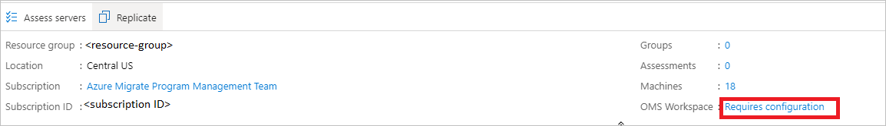
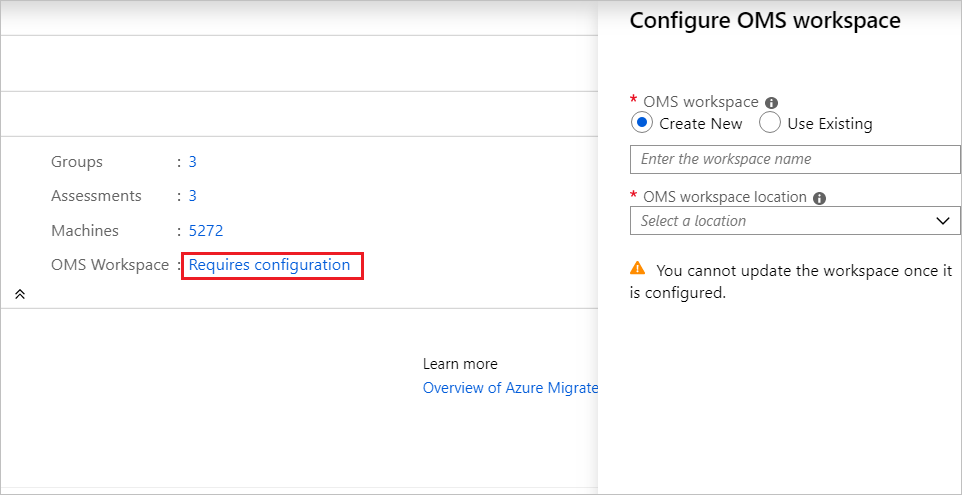
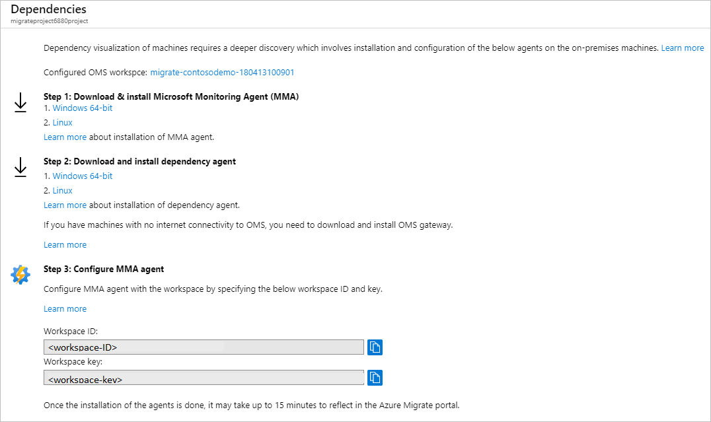

# Set up dependency visualization

This article describes how to set up agent-based dependency analysis in Azure Migrate: Discovery and assessment. [Dependency analysis](concepts-dependency-visualization.md) helps you to identify and understand dependencies across servers you want to assess and migrate to Azure.

## Before you start

- Review the support and deployment requirements for agent-based dependency analysis for:
    - [Servers in VMware environment](migrate-support-matrix-vmware.md#dependency-analysis-requirements-agent-based)
    - [Physical servers](migrate-support-matrix-physical.md#agent-based-dependency-analysis-requirements)
    - [Servers in Hyper-V environment](migrate-support-matrix-hyper-v.md#agent-based-dependency-analysis-requirements)
- Make sure you:
    - Have an Azure Migrate project. If you don't, [create](./create-manage-projects.md) one now.
    - Check that you've [added](how-to-assess.md) the Azure Migrate: Discovery and assessment tool to the project.
    - Set up an [Azure Migrate appliance](migrate-appliance.md) to discover on-premises servers. The appliance discovers on-premises servers, and sends metadata and performance data to Azure Migrate: Discovery and assessment. Set up an appliance for:
        - [Servers in VMware environment](how-to-set-up-appliance-vmware.md)
        - [Servers in Hyper-V environment](how-to-set-up-appliance-hyper-v.md)
        - [Physical servers](how-to-set-up-appliance-physical.md)
- To use dependency visualization, you associate a [Log Analytics workspace](../azure-monitor/logs/manage-access.md) with an Azure Migrate project:
    - You can attach a workspace only after setting up the Azure Migrate appliance, and discovering servers in the Azure Migrate project.
    - Make sure you have a workspace in the subscription that contains the Azure Migrate project.
    - The workspace must reside in the East US, Southeast Asia, or West Europe regions. Workspaces in other regions can't be associated with a project.
    - The workspace must be in a region in which [Service Map is supported](../azure-monitor/vm/vminsights-configure-workspace.md#supported-regions).
    - You can associate a new or existing Log Analytics workspace with an Azure Migrate project.
    - You attach the workspace the first time that you set up dependency visualization for a server. The workspace for an Azure Migrate project can't be modified after it's added.
    - In Log Analytics, the workspace associated with Azure Migrate is tagged with the Migration Project key, and the project name.

## Associate a workspace

1. After you've discovered servers for assessment, in **Servers** > **Azure Migrate: Discovery and assessment**, click **Overview**.  
2. In **Azure Migrate: Discovery and assessment**, click **Essentials**.
3. In **OMS Workspace**, click **Requires configuration**.

        

4. In **Configure OMS workspace**, specify whether you want to create a new workspace, or use an existing one.
    - You can select an existing workspace from all the workspaces in the project subscription.
    - You need Reader access to the workspace to associate it.
5. If you create a new workspace, select a location for it.

    

> [!Note]
> [Learn how](../azure-monitor/logs/private-link-security.md) to configure the OMS workspace for private endpoint connectivity.  

## Download and install the VM agents

On each server you want to analyze, install the agents.

> [!NOTE]
> For servers monitored by System Center Operations Manager 2012 R2 or later, you don't need to install the MMA agent. Service Map integrates with Operations Manager. [Follow](/previous-versions/azure/azure-monitor/vm/service-map-scom#prerequisites) integration guidance.

1. In **Azure Migrate: Discovery and assessment**, click **Discovered servers**.
1. Click **Columns** to select **Dependencies (Agent-based)** to see the column on the Discovered servers page.

    :::image type="content" source="./media/how-to-create-group-machine-dependencies/columns-inline.png" alt-text="Screenshot showing the result after clicking columns." lightbox="./media/how-to-create-group-machine-dependencies/columns-expanded.png":::

1. For each server you want to analyze with dependency visualization, in the **Dependencies** column, click **Requires agent installation**.
1. In the **Dependencies** page, download the MMA and Dependency agent for Windows or Linux.
1. Under **Configure MMA agent**, copy the workspace ID and key. You need these when you install the MMA agent.

    


## Install the MMA

Install the MMA on each Windows or Linux server you want to analyze.

### Install MMA on a Windows server

To install the agent on a Windows server:

1. Double-click the downloaded agent.
2. On the **Welcome** page, click **Next**. On the **License Terms** page, click **I Agree** to accept the license.
3. In **Destination Folder**, keep or modify the default installation folder > **Next**.
4. In **Agent Setup Options**, select **Azure Log Analytics** > **Next**.
5. Click **Add** to add a new Log Analytics workspace. Paste in the workspace ID and key that you copied from the portal. Click **Next**.

You can install the agent from the command line or using an automated method such as Configuration Manager or Intigua.
- [Learn more](../azure-monitor/agents/log-analytics-agent.md#installation-options) about using these methods to install the MMA agent.
- The MMA agent can also be installed using this [script](https://github.com/brianbar-MSFT/Install-MMA).
- [Learn more](../azure-monitor/agents/agents-overview.md#supported-operating-systems) about the Windows operating systems supported by MMA.

### Install MMA on a Linux server

To install the MMA on a Linux server:

1. Transfer the appropriate bundle (x86 or x64) to your Linux computer using scp/sftp.

2. Install the bundle by using the --install argument.

   `sudo sh ./omsagent-<version>.universal.x64.sh --install -w <workspace id> -s <workspace key>`

[Learn more](../azure-monitor/agents/agents-overview.md#supported-operating-systems) about the list of Linux operating systems support by MMA. 

## Install the Dependency agent

1. To install the Dependency agent on a Windows server, double-click the setup file and follow the wizard.

2. To install the Dependency agent on a Linux server, install as root using the following command:

   `sh InstallDependencyAgent-Linux64.bin`

- [Learn more](../azure-monitor/vm/vminsights-enable-hybrid.md#dependency-agent) about how you can use scripts to install the Dependency agent.
- [Learn more](../azure-monitor/vm/vminsights-enable-overview.md#supported-operating-systems) about the operating systems supported by the Dependency agent.


## Create a group using dependency visualization

Now create a group for assessment. 


> [!NOTE]
> Groups for which you want to visualize dependencies shouldn't contain more than 10 servers. If you have more than 10 servers, split them into smaller groups.

1. In **Azure Migrate: Discovery and assessment**, click **Discovered servers**.
2. In the **Dependencies** column, click **View dependencies** for each server you want to review.
3. On the dependency map, you can see the following:
    - Inbound (clients) and outbound (servers) TCP connections, to and from the server.
    - Dependent servers that don't have the dependency agents installed are grouped by port numbers.
    - Dependent servers with dependency agents installed are shown as separate boxes.
    - Processes running inside the server. Expand each server box to view the processes.
    - Server properties (including FQDN, operating system, MAC address). Click on each server box to view the details.

4. You can look at dependencies for different time durations by clicking on the time duration in the time range label.
    - By default the range is an hour. 
    - You can modify the time range, or specify start and end dates, and duration.
    - Time range can be up to an hour. If you need a longer range, use Azure Monitor to query dependent data for a longer period.

5. After you've identified the dependent servers that you want to group together, use Ctrl+Click to select multiple servers on the map, and click **Group machines**.
6. Specify a group name.
7. Verify that the dependent servers are discovered by Azure Migrate.

    - If a dependent server isn't discovered by Azure Migrate: Discovery and assessment, you can't add it to the group.
    - To add a server, run discovery again, and verify that the server is discovered.

8. If you want to create an assessment for this group, select the checkbox to create a new assessment for the group.
8. Click **OK** to save the group.

After creating the group, we recommend that you install agents on all the servers in the group, and then visualize dependencies for the entire group.

## Query dependency data in Azure Monitor

You can query dependency data captured by Service Map in the Log Analytics workspace associated with the Azure Migrate project. Log Analytics is used to write and run Azure Monitor log queries.

- [Learn how to](/previous-versions/azure/azure-monitor/vm/service-map#log-analytics-records) search for Service Map data in Log Analytics.
- [Get an overview](../azure-monitor/logs/get-started-queries.md)  of writing log queries in [Log Analytics](../azure-monitor/logs/log-analytics-tutorial.md).

Run a query for dependency data as follows:

1. After you install the agents, go to the portal and click **Overview**.
2. In **Azure Migrate: Discovery and assessment**, click **Overview**. Click the down arrow to expand **Essentials**.
3. In **OMS Workspace**, click the workspace name.
3. On the Log Analytics workspace page > **General**, click **Logs**.
4. Write your query, and click **Run**.

### Sample queries

Here are a few sample queries that you can use to extract dependency data.

- You can modify the queries to extract your preferred data points.
- [Review](/previous-versions/azure/azure-monitor/vm/service-map#log-analytics-records) a complete list of dependency data records.
- [Review](/previous-versions/azure/azure-monitor/vm/service-map#sample-log-searches) additional sample queries.

#### Sample: Review inbound connections

Review inbound connections for a set of servers.

- The records in the table for connection metrics (VMConnection) don't represent individual physical network connections.
- Multiple physical network connections are grouped into a logical connection.
- [Learn more](/previous-versions/azure/azure-monitor/vm/service-map#connections) about how physical network connection data is aggregated in VMConnection.

```
// the servers of interest
let ips=materialize(ServiceMapComputer_CL
| summarize ips=makeset(todynamic(Ipv4Addresses_s)) by MonitoredMachine=ResourceName_s
| mvexpand ips to typeof(string));
let StartDateTime = datetime(2019-03-25T00:00:00Z);
let EndDateTime = datetime(2019-03-30T01:00:00Z);
VMConnection
| where Direction == 'inbound'
| where TimeGenerated > StartDateTime and TimeGenerated  < EndDateTime
| join kind=inner (ips) on $left.DestinationIp == $right.ips
| summarize sum(LinksEstablished) by Computer, Direction, SourceIp, DestinationIp, DestinationPort
```

#### Sample: Summarize sent and received data

This sample summarizes the volume of data sent and received on inbound connections between a set of servers.

```
// the servers of interest
let ips=materialize(ServiceMapComputer_CL
| summarize ips=makeset(todynamic(Ipv4Addresses_s)) by MonitoredMachine=ResourceName_s
| mvexpand ips to typeof(string));
let StartDateTime = datetime(2019-03-25T00:00:00Z);
let EndDateTime = datetime(2019-03-30T01:00:00Z);
VMConnection
| where Direction == 'inbound'
| where TimeGenerated > StartDateTime and TimeGenerated  < EndDateTime
| join kind=inner (ips) on $left.DestinationIp == $right.ips
| summarize sum(BytesSent), sum(BytesReceived) by Computer, Direction, SourceIp, DestinationIp, DestinationPort
```

## Next steps

[Create an assessment](how-to-create-assessment.md) for a group.
