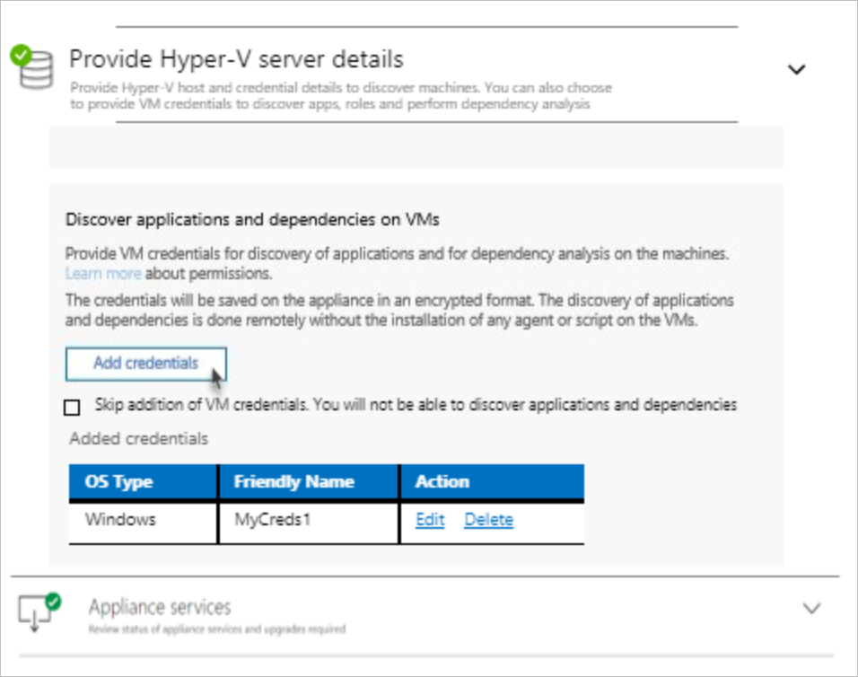

# Discover machine apps, roles, and features

This article describes how to discover applications, roles, and features on on-premises servers, using Azure Migrate:Server Assessment.

Discovering the inventory of apps, roles, and features running on on-premises machines helps identify and tailor a migration path to Azure for your workloads. App-discovery uses the Azure Migrate appliance to perform discovery, using VM guest credentials. App-discovery is agentless. Nothing is installed on VMs.

> [!NOTE]
> App discovery is currently in preview for VMware VMs only, and is limited to discovery only. We don't yet offer app-based assessment. 

## Before you start

- Make sure you've:
    - [Created](how-to-add-tool-first-time.md) an Azure Migrate project.
    - [Added](how-to-assess.md) the Azure Migrate:Server Assessment tool to a project.
- Review [app-discovery support and requirements](migrate-support-matrix-vmware.md#vmware-requirements).
- Make sure VMs where you're running app-discovery have PowerShell version 2.0 or later installed, and VMware Tools (later than 10.2.0) is installed.
- Check the [requirements](migrate-appliance.md) for deploying the Azure Migrate appliance.

## Deploy the Azure Migrate appliance

1. [Review](migrate-appliance.md#appliance---vmware) the requirements for deploying the Azure Migrate appliance.
2. Review the Azure URLs that the appliance will need to access in the [public](migrate-appliance.md#public-cloud-urls) and [government clouds](migrate-appliance.md#government-cloud-urls).
3. [Review data](migrate-appliance.md#collected-data---vmware) that the appliance collects during discovery and assessment.
4. [Note](migrate-support-matrix-vmware.md#port-access-requirements) port access requirements for the appliance.
5. [Deploy the Azure Migrate appliance](how-to-set-up-appliance-vmware.md) to start discovery. To deploy the appliance, you download and import an OVA template into VMware to create the appliance as a VMware VM. You configure the appliance and then register it with Azure Migrate.
6. As you deploy the appliance, to start continuous discovery you specify the following:
    - The name of the vCenter Server to which you want to connect.
    - Credentials that you created for the appliance to connect to vCenter Server.
    - The account credentials you created for the appliance to connect to Windows/Linux VMs.

After the appliance is deployed and you've provided credentials, the appliance starts continuous discovery of VM metadata and performance data, along with and discovery of apps, features, and roles.  The duration of app discovery depends on how many VMs you have. It typically takes an hour for app-discovery of 500 VMs.

## Verify permissions

You [created a vCenter Server read-only account](tutorial-prepare-vmware.md#set-up-permissions-for-assessment) for discovery and assessment. The read-only account needs privileges enabled for **Virtual Machines** > **Guest Operations**, in order to interact with the VM for app discovery.

### Add the user account to the appliance

Add the user account as follows:

1. Open the appliance management app. 
2. Navigate to the **Provide vCenter details** panel.
3. In **Discover application and dependencies on VMs**, click **Add credentials**
3. Choose the **Operating system**, provide a friendly name for the account, and the **User name**/**Password**
6. Click **Save**.
7. Click **Save and start discovery**.

    

## Review and export the inventory

After discovery ends, if you provided credentials for app discovery, you can review and export the app inventory in the Azure portal.

1. In **Azure Migrate - Servers** > **Azure Migrate: Server Assessment**, click the displayed count to open the **Discovered servers** page.

    > [!NOTE]
    > At this stage you can also optionally set up dependency analysis for discovered machines, so that you can visualize dependencies across machines you want to assess. [Learn more](concepts-dependency-visualization.md) about dependency analysis.

2. In **Applications discovered**, click the displayed count.
3. In **Application inventory**, you can review the discovered apps, roles, and features.
4. To export the inventory, in **Discovered Servers**, click **Export app inventory**.

The app inventory is exported and downloaded in Excel format. The **Application Inventory** sheet displays all the apps discovered across all the machines.

## Next steps

- [Create an assessment](how-to-create-assessment.md) for discovered servers.
- Assess SQL Server databases using [Azure Migrate:Database Assessment](https://docs.microsoft.com/sql/dma/dma-assess-sql-data-estate-to-sqldb?view=sql-server-2017).
