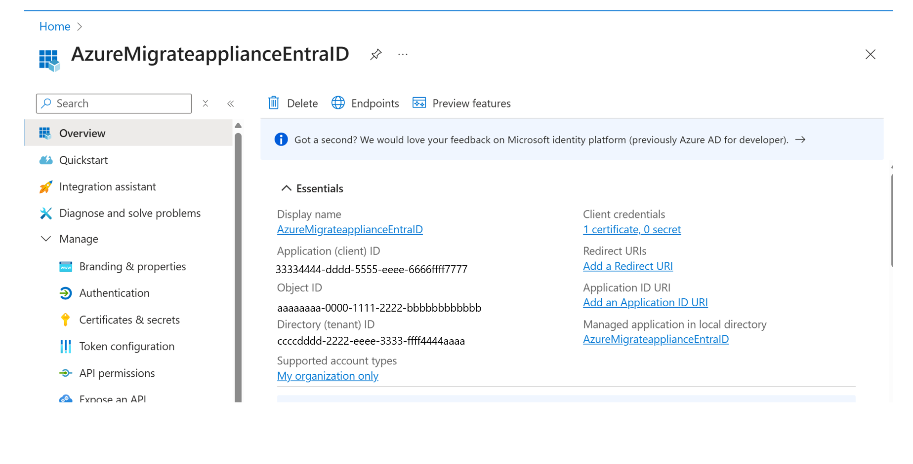

# Register Azure Migrate appliance using a preconfigured Microsoft Entra ID application


After setting up Azure Migrate appliance prerequisite, users sign in to Azure to register the appliance with an Azure Migrate project. The common challenges in the Azure sign in  step include:
-	**Insufficient permissions at tenant level**: The user deploying the appliance might lack tenant-level permissions required to register applications in Microsoft Entra ID. 
-	**Device Code Flow (DCF) restrictions**: Some organizations disable Device Code Flow (DCF) in Microsoft Entra ID, which blocks appliance registration.
-	**Use of Pre-Approved Microsoft Entra ID Applications**: Enterprises might prefer to use existing, preapproved Microsoft Entra ID applications that align with internal naming conventions and compliance policies, rather than allowing the appliance to create a new Microsoft Entra ID app automatically.

To avoid registering the appliance under a user's context and to address the above challenges, you can use a preconfigured Microsoft Entra ID application for appliance registration.


## 1.	Register a Microsoft Entra ID application and assign permissions

1. 	Follow these [steps](/entra/identity-platform/howto-create-service-principal-portal#register-an-application-with-microsoft-entra-id-and-create-a-service-principal) to register a new application (or use an existing application) in Microsoft Entra ID. A service principal is automatically created for the app registration.
2.	Assign the Contributor role to the registered Microsoft Entra ID application in the Resource Group, where the Azure Migrate project is deployed. 


## 2. To authenticate the application generate certificates

1. To authenticate the Microsoft Entra ID application, use either a Certificate Authority (CA)-signed certificate (recommended) or a self-signed certificate. You can generate certificates using tools like PowerShell, OpenSSL, mkcert, or Azure Key Vault.
2. The following is a PowerShell command to generate a self-signed certificate. 
Replace `{certificateName}` with the name that you wish to give to your certificate.

```powershell
$certname = "{certificateName}"    ## Replace {certificateName}
$cert = New-SelfSignedCertificate -Subject "CN=$certname" -CertStoreLocation "Cert:\CurrentUser\My" -KeyExportPolicy Exportable -KeySpec Signature -KeyLength 2048 -KeyAlgorithm RSA -HashAlgorithm SHA256

```

## 3. Export the public and private certificates
**Public certificate:**
The command below exports the certificate in *.cer* format. You can also export it in other formats supported on the Azure portal including *.pem* and *.crt*.

```powershell

Export-Certificate -Cert $cert -FilePath "C:\Users\admin\Desktop\$certname.cer"   ## Specify your preferred location

```

The certificate is ready to be uploaded to Microsoft Entra ID application.

**Private certificate:**
Create a password to protect the certificate’s private key and store it in a variable. Replace {myPassword} with your preferred password.

```powershell

$mypwd = ConvertTo-SecureString -String "{myPassword}" -Force -AsPlainText  ## Replace {myPassword}

```

Using the password you stored in the `$mypwd` variable, secure and export your private key using the command;

```powershell

Export-PfxCertificate -Cert $cert -FilePath "C:\Users\admin\Desktop\$certname.pfx" -Password $mypwd   ## Specify your preferred location

```

Save the private certificated(_.pfx file) in Azure Migrate appliance machine.

## 4.	Upload the public certificate to Microsoft Entra ID application
1. Navigate to Microsoft Entra ID > App registrations and select the application you registered earlier.
2. In the left pane, select Certificates & secrets.
3. Under the Certificates section, select Upload certificate.
4. Browse to the folder and select the .cer file containing your public certificate.
5. Select Add to complete the upload.


-	Note down the Microsoft Entra ID app details that will be later required when configuring appliance.  
 ```
Display name: 
Application(client) ID:
Object ID: 
Tenant ID: 
Certificates & secrets ->Thumbprint: 
Service principal Object ID: 
   ```

-	Navigate to Microsoft Entra ID -> Enterprise applications -> Manage all applications and copy the service principal object ID.


## 5.	Install the private certificate in Appliance machine
1. Sign in to the appliance machine and go to the folder where private certificate is saved. Double select on the certificate file to start the installation. 


2. Choose store location as Local machine. 
3. Select next and specify the file path of the certificate. 


4. Enter the password created while exporting the private key.
5. Select Personal as the certificate store location and select Finish to complete the installation.


## 7.	Update the registry values in Appliance machine
1. Run the following PowerShell script in Appliance machine to update the registry values. 
```powershell

# Function to check if the last command was successful, otherwise exit the script
function Check-Error {
    if (!$?) {
        Write-Output "Error encountered. Exiting script."
        exit 1
    }
}

$tenantId = Read-Host "Please enter the Entra app tenant id: "
$agentServiceCommAadAppClientId = Read-Host "Please enter the Entra app client id: "
$agentServiceCommAadAppObjectId = Read-Host "Please enter the Entra app object id: "
$agentServiceCommAadAppName = Read-Host "Please enter the Entra app display name: "
$agentServiceCommAadAppSpnObjectId = Read-Host "Please enter the Entra app SPN object id: "
$localCertThumbprint = Read-Host "Please enter the Entra app cert thumbprint: "

$registryEntries = @{
    "LocalCertThumbprint"                       = $localCertThumbprint
    "AzureMigrateApplianceAadAppCertThumbPrint" = $localCertThumbprint
    "AgentServiceCommAadAppClientId"            = $agentServiceCommAadAppClientId
    "AzureMigrateApplianceAadAppClientId"       = $agentServiceCommAadAppClientId
    "AgentServiceCommAadAppObjectId"            = $agentServiceCommAadAppObjectId
    "AgentServiceCommAadAppName"                = $agentServiceCommAadAppName
    "AgentServiceCommAadAppSpnObjectId"         = $agentServiceCommAadAppSpnObjectId
    "AzureMigrateApplianceAadAppTenantId"       = $tenantId
}

# Define the registry path
$registryPath = "HKLM:\SOFTWARE\Microsoft\AzureAppliance"

# Create registry entries
Write-Output "Creating registry entries under '$registryPath'..."

# Set each registry entry
foreach ($entry in $registryEntries.GetEnumerator()) {
    Write-Output "Creating registry key '$($entry.Key)' with value '$($entry.Value)'..."
    New-ItemProperty -Path $registryPath -Name $entry.Key -Value $entry.Value -PropertyType String -Force
    Check-Error
}

Write-Output "All registry entries created successfully!"


```
2. Open Registry Editor and select AzureAppliance in the left pane.
3. Verify that the registry values are updated correctly. If needed, you can manually update any misconfigured values. 


## 8.	Complete appliance registration using Microsoft Entra ID app
1.	After updating the registry values, clear the browser cache and reload the page to start Entra ID App Authentication flow from the config manager.
2.	Appliance registration is completed and the Entra ID app name is displayed in the config manager. 


## Limitations

-	An Entra ID application registered for appliance authentication is limited to one Azure Migrate appliance. You can't reuse the same Microsoft Entra application to register multiple appliances, even if they're part of the same Azure Migrate project or a different one.
To deploy another appliance, you must register a new application in Microsoft Entra ID, ensure a new service principal is created, and assign the required Azure role (such as Contributor) to the new application in the appropriate resource group.
-	The approach can be used to set up [VMware](how-to-set-up-appliance-vmware.md), [Hyper-V](how-to-set-up-appliance-hyper-v.md) and [physical](how-to-set-up-appliance-physical.md) stack of Azure Migrate appliance. This approach can't be used to set up [Azure Site Recovery replication appliance](tutorial-migrate-physical-virtual-machines.md#set-up-the-replication-appliance). 


## Next steps

- Discover [VMware](how-to-set-up-appliance-vmware.md) estate.
- Discover [Hyper-V](how-to-set-up-appliance-hyper-v.md) estate.
- Discover [physical](how-to-set-up-appliance-physical.md)  servers or servers running in public cloud. 