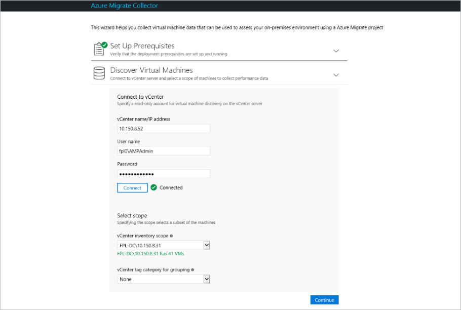

# Scale assessment with Azure Migrate

This article describes how to assess large numbers of on-premises machines with [Azure Migrate](migrate-overview.md). Azure Migrate assesses machines to check whether they're suitable for migration to Azure, and provides sizing and cost estimations for running the machine in Azure.

## Prerequisites

- **VMware**: You need at least one VMware VM located on an ESXi host or cluster running version 5.0 or higher. The host or cluster must be managed by a vCenter server running version 5.5 or 6.0.
- **vCenter account**: You need a read-only account with administrator credentials for the vCenter server. Azure Migrate uses this account to discover VMs.
- **Permissions**: On the vCenter server, you need permissions to create a VM by importing a file in .OVA format.
- **Statistics settings**: The statistics settings for the vCenter server should be set to level 2 or higher, before you start deployment.

## Plan Azure Migrate projects

An Azure Migrate project can assess up to 1500 machines. A single discovery in a project can discover up to 1000 machines.

- If you have less than 1000 machines to discover, you need a single project with a single discovery.
- If you have between 1000 and 1500 machines, you need a single project with two discoveries in it.
- If you have more than 1500 machines, you need to create multiple projects, and perform multiple discoveries, according to your requirements. For example:
    - If you have 3000 machines,  you could set up two projects with two discoveries, or three projects with a single discovery.
    - If you have 5000 machines, you could set up 4 projects. Two with a discovery of 1500 machines, and one with a discovery of 500 machines. Alternatively, you could set up 5 projects with a single discovery in each one. 
- When you do a discovery in Azure Migrate, you can set the discovery scope to a VMware folder, datacenter or cluster.
- If you need to do more than one discovery, in vCenter, make sure that VMs you want to discover are placed into folders, datacenters or clusters that support the limitation of 1000 machines.
- We recommend that for assessment purposes, you keep machines with inter-dependencies within the same project and assessment. So in vCenter, make sure that dependent machines are in the same folder, datacenter, or cluster for the purposes of assessment.


## Create a project

Create an Azure Migrate project in accordance with your requirements.

1. In the Azure Portal, click **New**.
2. Search for **Azure Migrate**, and select the service (**Azure Migrate (preview)** in the search results. Then click **Create**.
3. Specify a project name, and the Azure subscription for the project.
4. Create a new resource group.
5. Specify the region in which to create the project, then click **Create**. Metadata gathered from on-premises VMs will be stored in this region.

## Set up the collector appliance

Azure Migrate creates an on-premises VM known as the collector appliance. This VM discovers on-premises VMware VMs, and sends metadata about them to the Azure Migrate service. To set up the collector appliance, you download an .OVA file, and import it to the on-premises vCenter server to create the VM.

### Download the collector appliance

If you have multiple projects, you only need to download the collector appliance once to the vCenter server. After downloading and setting up the appliance, you run it for each project, and specify the unique project ID and key.

1. In the Azure Migrate project, click **Getting Started** > **Discover & Assess** > **Discover Machines**.
2. In **Discover machines**, click **Download**, to download the .OVA file.
3. In **Copy project credentials**, copy the ID and key for the project. You need these when you configure the collector.

   
### Verify the collector appliance

Check that the .OVA file is secure, before you deploy it.

1. On the machine to which you downloaded the file, open an administrator command window.
2. Run the following command to generate the hash for the OVA:
    - ```C:\>CertUtil -HashFile <file_location> [Hashing Algorithm]```
    - Example usage: ```C:\>CertUtil -HashFile C:\AzureMigrate\AzureMigrate.ova SHA256```
3. The generated hash should match these settings.

    **Algorithm** | **Hash value**
    --- | ---
    MD5 | c283f00f46484bf673dc8383b01d0741 
    SHA1 | 8f49b47f53d051af1780bbc725659ce64e717ed4
    SHA256 | 7aecdbdb2aea712efe99d0c1444503f52d16de5768e783465e226fbbca71501d

## Create the collector VM

Import the downloaded file to the vCenter server.

1. In the vSphere Client console, click **File** > **Deploy OVF Template**.

    

2. In the Deploy OVF Template Wizard > **Source**, specify the location of the .ova file.
3. In **Name** and **Location**, specify a friendly name for the collector VM, and the inventory object in which the VM
will be hosted.
5. In **Host/Cluster**, specify the host or cluster on which the collector VM will run.
7. In storage, specify the storage destination for the collector VM.
8. In **Disk Format**, specify the disk type and size.
9. In **Network Mapping**, specify the network to which the collector VM will connect. The network needs internet connectivity, to send metadata to Azure. 
10. Review and confirm the settings, then click **Finish**.

## Identify the key and ID for each project

If you have multiple projects, make sure you identify the ID and key for each one. You need the key when you run the collector to discover the VMs.

1. In the project, click **Getting Started** > **Discover & Assess** > **Discover Machines**.
2. In **Copy project credentials**, copy the ID and key for the project. 
    


## Run the collector to discover VMs

For each discovery you need to perform, you run the collector to discovery VMs in the required scope. You need to run the discoveries one after the other. Concurrent discoveries aren't supported, and each discovery must have a different scope.

1. In the vSphere Client console, right-click the VM > **Open Console**.
2. Provide the language, time zone and password preferences for the appliance.
3. In the Azure Migrate Collector, open **Set Up Prequisites**.
    - Accept the license terms, and read the third-party information.
    - The collector checks that the VM has internet access.
    - If the VM accesses the internet via a proxy, click **Proxy settings**, and specify the proxy address and listening port. Specify credentials if the proxy needs authentication.
    - The collector checks that the Windows profiler service is running. The service is installed by default on the collector VM.
    - Download and install the VMware PowerCLI.
. In **Discover Machines**, do the following:
    - Specify the name (FQDN) or IP address of the vCenter server.
    - Specify the read-only account that the collector will use to discover VMs on the vCenter server.
    - Select a scope for VM discovery. The collector can only discover VMs within the specified scope. Scope can be set to a specific folder, datacenter, or cluster. It shouldn't contain more than 1000 VMs. 

        

1. In **Select Project**, specify the ID and key for the project. If didn't copy them, open the Azure portal from the collector VM. In the project **Overview** page, click **Discover Machines**, and copy the values.  
In **Complete Discovery**, monitor the discovery process, and check that metadata collected from the VMs is in scope. The collector provides an approximate discovery time.


### Verify VMs in the portal

Discovery time depends on how many VMs you are discovering. Typically, for 100 VMs, after the collector finishes running it takes around an hour for discovery to finish. 

1. In the Migration Planner project, click **Manage** > **Machines**.
2. Check that the VMs you want to discover appear in the portal.


## Next steps

- Learn how to [create a group](how-to-create-a-group.md) for assessment.
- [Learn more](concepts-assessment-calculation.md) about how assessments are calculated.
