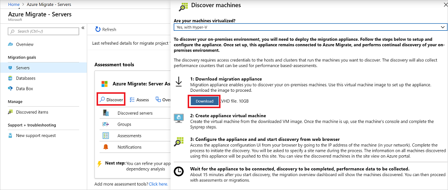

# Set up an appliance for Hyper-V VMs

This article describes how to set up the Azure Migrate appliance if you're assessing Hyper-V VMs with the Azure Migrate Server Assessment tool, or migrating VMware VMs to Azure using the Azure Migrate Server Migration tool.

The Hyper-V VM appliance is a lightweight appliance used by Azure Migrate Server Assessment/Migration to do the following:

- Discover on-premises Hyper-V VMs.
- Send metadata and performance data for discovered VMs to Azure Migrate Server Assessment/Migration.

[Learn more](migrate-appliance.md) about the Azure Migrate appliance.


## Appliance deployment steps

To set up the appliance you:
- Download a compressed Hyper-V VHD from the Azure portal.
- Create the appliance, and check that it can connect to Azure Migrate Server Assessment.
- Configure the appliance for the first time, and register it with the Azure Migrate project.

## Download the VHD

Download the zipped VHD template for the appliance.

1. In **Migration Goals** > **Servers** > **Azure Migrate: Server Assessment**, click **Discover**.
2. In **Discover machines** > **Are your machines virtualized?**, click **Yes, with Hyper-V**.
3. Click **Download** to download the VHD file.

    


### Verify security

Check that the zipped file is secure, before you deploy it.

1. On the machine to which you downloaded the file, open an administrator command window.
2. Run the following command to generate the hash for the VHD
    - ```C:\>CertUtil -HashFile <file_location> [Hashing Algorithm]```
    - Example usage: ```C:\>CertUtil -HashFile C:\AzureMigrate\AzureMigrate.vhd SHA256```
3.  For appliance version 2.19.11.12, the generated hash should match these settings.

  **Algorithm** | **Hash value**
  --- | ---
  MD5 | 29a7531f32bcf69f32d964fa5ae950bc
  SHA256 | 37b3f27bc44f475872e355f04fcb8f38606c84534c117d1609f2d12444569b31


## Create the appliance VM

Import the downloaded file, and create the VM.

1. Extract the zipped VHD file to a folder on the Hyper-V host that will host the appliance VM. Three folders are extracted.
2. Open Hyper-V Manager. In **Actions**, click **Import Virtual Machine**.

    

2. In the Import Virtual Machine Wizard > **Before you begin**, click **Next**.
3. In **Locate Folder**, specify the folder containing the extracted VHD. Then click **Next**.
1. In **Select Virtual Machine**, click **Next**.
2. In **Choose Import Type**, click **Copy the virtual machine (create a new unique ID)**. Then click **Next**.
3. In **Choose Destination**, leave the default setting. Click **Next**.
4. In **Storage Folders**, leave the default setting. Click **Next**.
5. In **Choose Network**, specify the virtual switch that the VM will use. The switch needs internet connectivity to send data to Azure.
6. In **Summary**, review the settings. Then click **Finish**.
7. In Hyper-V Manager > **Virtual Machines**, start the VM.


### Verify appliance access to Azure

Make sure that the appliance VM can connect to [Azure URLs](migrate-appliance.md#url-access).

## Configure the appliance

Set up the appliance for the first time.

1. In Hyper-V Manager > **Virtual Machines**, right-click the VM > **Connect**.
2. Provide the language, time zone, and password for the appliance.
3. Open a browser on any machine that can connect to the VM, and open the URL of the appliance web app: **https://*appliance name or IP address*: 44368**.

   Alternately, you can open the app from the appliance desktop by clicking the app shortcut.
1. In the web app > **Set up prerequisites**, do the following:
    - **License**: Accept the license terms, and read the third-party information.
    - **Connectivity**: The app checks that the VM has internet access. If the VM uses a proxy:
        - Click **Proxy settings**, and specify the proxy address and listening port, in the form http://ProxyIPAddress or http://ProxyFQDN.
        - Specify credentials if the proxy needs authentication.
        - Only HTTP proxy is supported.
    - **Time sync**: Time is verified. The time on the appliance should be in sync with internet time for VM discovery to work properly.
    - **Install updates**: Azure Migrate Server Assessment checks that the appliance has the latest updates installed.

### Register the appliance with Azure Migrate

1. Click **Log In**. If it doesn't appear, make sure you've disabled the pop-up blocker in the browser.
2. On the new tab, sign in using your Azure credentials.
    - Sign in with your username and password.
    - Sign-in with a PIN isn't supported.
3. After successfully signing in, go back to the web app.
4. Select the subscription in which the Azure Migrate project was created. Then select the project.
5. Specify a name for the appliance. The name should be alphanumeric with 14 characters or less.
6. Click **Register**.


### Delegate credentials for SMB VHDs

If you're running VHDs on SMBs, you must enable delegation of credentials from the appliance to the Hyper-V hosts. To do this from the appliance:

1. On the appliance VM, run this command. HyperVHost1/HyperVHost2 are example host names.

    ```
    Enable-WSManCredSSP -Role Client -DelegateComputer HyperVHost1.contoso.com HyperVHost2.contoso.com -Force
    ```

2. Alternatively, do this in the Local Group Policy Editor on the appliance:
    - In **Local Computer Policy** > **Computer Configuration**, click **Administrative Templates** > **System** > **Credentials Delegation**.
    - Double-click **Allow delegating fresh credentials**, and select **Enabled**.
    - In **Options**, click **Show**, and add each Hyper-V host you want to discover to the list, with **wsman/** as a prefix.
    - In  **Credentials Delegation**, double-click **Allow delegating fresh credentials with NTLM-only server authentication**. Again, add each Hyper-V host you want to discover to the list, with **wsman/** as a prefix.

## Start continuous discovery

Connect from the appliance to Hyper-V hosts or clusters, and start VM discovery.

1. In **User name** and **Password**, specify the account credentials that the appliance will use to discover VMs. Specify a friendly name for the credentials, and click **Save details**.
2. Click **Add host**, and specify Hyper-V host/cluster details.
3. Click **Validate**. After validation, the number of VMs that can be discovered on each host/cluster is shown.
    - If validation fails for a host, review the error by hovering over the icon in the **Status** column. Fix issues, and validate again.
    - To remove hosts or clusters, select > **Delete**.
    - You can't remove a specific host from a cluster. You can only remove the entire cluster.
    - You can add a cluster, even if there are issues with specific hosts in the cluster.
4. After validation, click **Save and start discovery** to start the discovery process.

This starts discovery. It takes around 15 minutes for metadata of discovered VMs to appear in the Azure portal.

## Verify VMs in the portal

After discovery finishes, you can verify that the VMs appear in the portal.

1. Open the Azure Migrate dashboard.
2. In **Azure Migrate - Servers** > **Azure Migrate: Server Assessment** page, click the icon that displays the count for **Discovered servers**.


## Next steps

Try out [Hyper-V assessment](tutorial-assess-hyper-v.md) with Azure Migrate Server Assessment.
