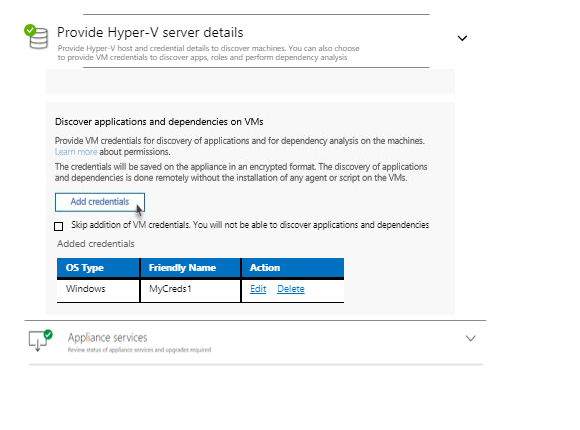
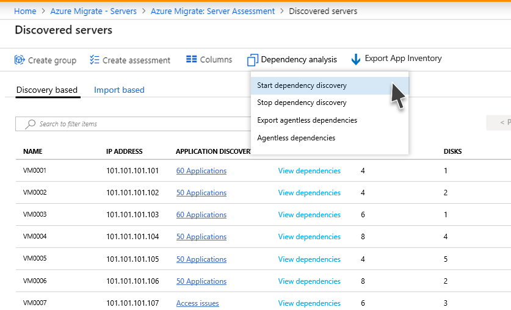
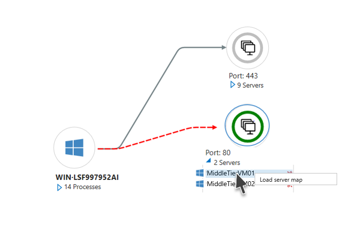
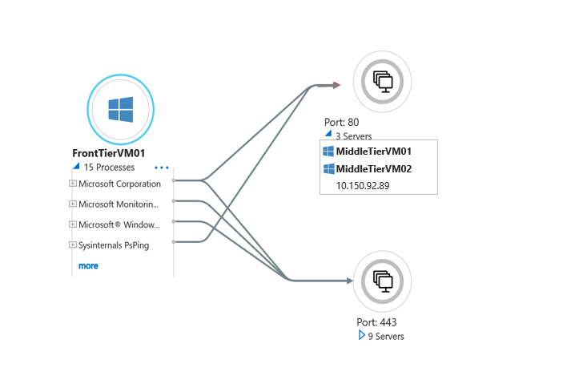

# Set up agentless dependency visualization for assessment

This article describes how to set up agentless dependency mapping in Azure Migrate: Server Assessment. This capability is currently available in preview for VMware machines discovered using an Azure Migrate appliance. 

Dependency mapping helps you to visualize dependencies across machines you want to assess and migrate.

- In Azure Migrate: Server Assessment, you gather machines together for assessment. Usually machines that you want to migrate together.
- You typically use dependency mapping when you want to assess groups with higher levels of confidence.
- Dependency mapping helps you to cross-check machine dependencies, before you run an assessment and migration.
- Mapping and visualizing dependencies helps to effectively plan your migration to Azure. It helps ensure that nothing is left behind, avoiding surprise outages during migration.
- Using mapping, you can discover interdependent systems that need to migrate together. You can also identify whether a running system is still serving users, or is a candidate for decommissioning instead of migration.

## How it works

Dependency information is gathered by capturing TCP connection data. After dependency discovery is started, the appliance gathers this data from the VMs at a polling interval of 5 minutes.

### Collected data
The following data is collected from a machine enabled for dependency discovery.

- TCP connections
- Names of processes that have active connections
- Names of installed applications that run the above processes
- No. of connections detected at every polling interval

## Before you start

- Make sure you've [created](how-to-add-tool-first-time.md) an Azure Migrate project.
- The agentless dependency analysis is currently available only for VMware machines.
- If you've already created a project, make sure you've [added](how-to-assess.md) the Azure Migrate: Server Assessment tool.
- Make sure you have discovered your VMware machines in Azure Migrate; you can do this by setting up an Azure Migrate appliance for [VMware](how-to-set-up-appliance-vmware.md). The appliance discovers on-premises machines, and sends metadata and performance data to Azure Migrate: Server Assessment. [Learn more](migrate-appliance.md).
- Make sure you have credentials for the VMware VMs on which you want to conduct dependency analysis.
- Make sure the VMware VMs are of the supported operating systems.

### Supported operating systems
 
Use the limits summarized in this table for planning.

**Operating system type** | **Supported operating systems**
--- | --- 
**Windows** | Microsoft Windows Server 2016   Microsoft Windows Server 2012 R2   Microsoft Windows Server 2012   Microsoft Windows Server 2008 (64-bit)   Microsoft Windows Server 2008 (32-bit)
**Linux** | Red Hat Enterprise Linux 7, 6, 5  Ubuntu Linux 12.04, 14.04, 16.04     

## Create a VM user account for dependency discovery

Set up a user account that has the required permissions. Only one user account can be provided.

- **Required permission on Windows VMs**: The user account requires 'Guest' access.
- **Required permission on Linux VMs**: The root privilege is required on the account. Alternately, the user account requires these two capabilities on /bin/netstat and /bin/ls files: CAP_DAC_READ_SEARCH and CAP_SYS_PTRACE.

## Provide VM user account details

To use agentless dependency visualization, you need to provide VM credentials on the appliance that is set up to discover the VMs.

Add the VM credentials as follows:

1. Open the appliance management app. Navigate to the **Provide vCenter details** panel.
2. In the **Discover application and dependencies on VMs** section, click **Add credentials**
3. Choose the **Operating system**. 
4. Provide a friendly name for the credential.
5. Provide the **User name** and **Password**
6. Click **Save**.
7. Click **Save and start discovery**.

    

## Start dependency discovery

Choose the machines on which you would like to enable dependency discovery.

1. In **Azure Migrate: Server Assessment**, click **Discovered servers**.
2. Click the **Dependency analysis** icon.
3. Click **Start dependency discovery**.
3. In the **Start dependency discovery** page, choose the **appliance** that is discovering the VMs for which you look to analyze dependencies.
4. From the machine list, select the machines.
5. Click **Start dependency discovery**

    

## Visualize dependencies

1. In **Azure Migrate: Server Assessment**, click **Discovered servers**.
2. Search for the machine for which you would like to view the dependency map
3. Click **View dependencies** in the **Dependencies** column.
4. To change the time period over which you would like to view the map, use the **Time duration** dropdown.
5. Expand the Client group to list the machines that have a dependency on the selected machine. 
6. Expand the Server port group to list the machines that have a dependency from the selected machine. 
7. To navigate to the map view of any of the dependent machines, click on the machine name and click **Load server map**

    

    

8. Expand the selected machine to view process-level details for each dependency.

    

> [!NOTE]
> Process information for a dependency is not always available. In the event it is not available, the dependency is depicted with the process marked as "Unknown process"

## Stop dependency discovery

Choose the machines on which you would like to enable dependency discovery.

1. In **Azure Migrate: Server Assessment**, click **Discovered servers**.
2. Click the **Dependency analysis** icon.
3. Click **Stop dependency discovery**.
3. In the **Stop dependency discovery** page, choose the **appliance** that is discovering the VMs on which you look to stop dependency discovery.
4. From the machine list, select the machines.
5. Click **Stop dependency discovery**

## Limitations

- Currently, you cannot add or remove a server from a group from the dependency analysis view. 
- Dependency map of a group of servers is currently not available.
- Currently, the dependency data cannot be downloaded in tabular format.

## Next steps

[Group the machines](how-to-create-group.md) you would like to migrate together.
