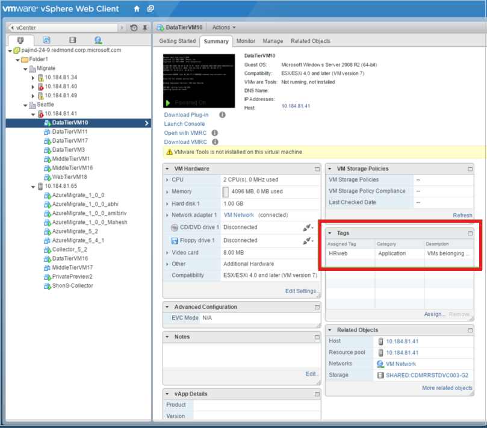

# Create a group with vCenter tagging

This article describes how to create a group of machines for [Azure Migrate](migrate-overview.md) assessment using tagging in VMware vCenter. If you set up tagging, when you set up groups, you can select the tags on which to base the group. 

## Set up tagging

During Azure Migrate deployment, you set up an on-premises Azure Migrate collector VM which discovers on-premises virtual machines (VMs) on ESXi hosts managed by a vCenter server. You need to set up vCenter tagging before discovery.

1. In the VMware vSphere Web Client, navigate to the vCenter server.
2. Click **Tags**, to review any current tags.
3. To tag a VM, select **Related Objects** > **Virtual Machines**, and then select the VM you want to tag.
4. In **Summary** > **Tags**, click **Assign**. 
5. Click **New Tag**, and specify a tag name and description.
6. To crate a category for the tag, select **New Category** in the drop-down list.
7. Specify a category name and description, and the cardinality. Then click **OK**.

    

## Use tagging to create groups

After you set up tagging on the vCenter server, you can select tag categories to use to create groups.

1. Set up discovery of on-premises machines as described in the [VMware assessment tutorial](tutorial-assessment-vmware.md#run-the-collector-to-discover-vms).
2. In **Tag category for grouping**, select the vCenter tag category on which the assessment group should be based. Azure Migrate automatically creates a group for the selected category.

    

## Next steps

[Learn more](concepts-assessment-calculation.md) about how assessments are calculated.
