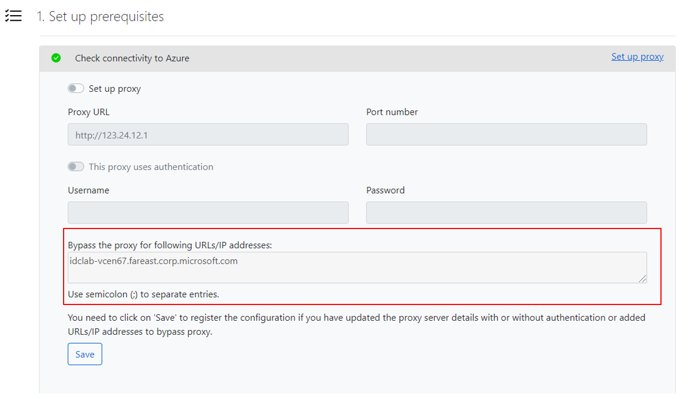

# Use Azure Migrate with private endpoints

This article describes how to use Azure Migrate to discover, assess, and migrate servers over a private network by using [Azure Private Link](../private-link/private-endpoint-overview.md).

You can use the [Azure Migrate: Discovery and assessment](./migrate-services-overview.md#azure-migrate-discovery-and-assessment-tool) and [Azure Migrate: Server Migration](./migrate-services-overview.md#azure-migrate-server-migration-tool) tools to connect privately and securely to Azure Migrate over an Azure ExpressRoute private peering or a site-to-site (S2S) VPN connection by using Private Link.

We recommend the private endpoint connectivity method when there's an organizational requirement to access Azure Migrate and other Azure resources without traversing public networks. By using Private Link, you can use your existing ExpressRoute private peering circuits for better bandwidth or latency requirements.

## Support requirements

Review the following required permissions and the supported scenarios and tools.

### Supported geographies

The functionality is now in preview in all [public cloud regions.](/azure/migrate/migrate-support-matrix#supported-geographies-public-cloud)

### Required permissions

You must have Contributor + User Access Administrator or Owner permissions on the subscription.

### Supported scenarios and tools

**Deployment** | **Details** | **Tools**
--- | --- | ---
**Discovery and assessment** | Perform an agentless, at-scale discovery and assessment of your servers running on any platform. Examples include hypervisor platforms such as [VMware vSphere](./tutorial-discover-vmware.md) or [Microsoft Hyper-V](./tutorial-discover-hyper-v.md), public clouds such as [AWS](./tutorial-discover-aws.md) or [GCP](./tutorial-discover-gcp.md), or even [bare metal servers](./tutorial-discover-physical.md). | Azure Migrate: Discovery and assessment <br/>
**Software inventory** | Discover apps, roles, and features running on VMware VMs. | Azure Migrate: Discovery and assessment
**Dependency visualization** | Use the dependency analysis capability to identify and understand dependencies across servers. <br/> [Agentless dependency visualization](./how-to-create-group-machine-dependencies-agentless.md) is supported natively with Azure Migrate private link support. <br/>[Agent-based dependency visualization](./how-to-create-group-machine-dependencies.md) requires internet connectivity. Learn how to use [private endpoints for agent-based dependency visualization](../azure-monitor/logs/private-link-security.md). | Azure Migrate: Discovery and assessment |
**Migration** | Perform [agentless Hyper-V migrations](./tutorial-migrate-hyper-v.md) or use the agent-based approach to migrate your [VMware VMs](./tutorial-migrate-vmware-agent.md), [Hyper-V VMs](./tutorial-migrate-physical-virtual-machines.md), [physical servers](./tutorial-migrate-physical-virtual-machines.md), [VMs running on AWS](./tutorial-migrate-aws-virtual-machines.md), [VMs running on GCP](./tutorial-migrate-gcp-virtual-machines.md), or VMs running on a different virtualization provider. | Azure Migrate: Server Migration

>[!Note]
> [Agentless VMware migrations](./tutorial-migrate-vmware.md) require internet access or connectivity via ExpressRoute Microsoft peering. Learn how to use [private endpoints to perform replications over ExpressRoute private peering or a S2S VPN connection](./replicate-using-expressroute.md).

#### Other integrated tools

Other migration tools might not be able to upload usage data to the Azure Migrate project if the public network access is disabled. The Azure Migrate project should be configured to allow traffic from all networks to receive data from other Microsoft or external [independent software vendor (ISV)](./migrate-services-overview.md#isv-integration) offerings.

To enable public network access for the Azure Migrate project, sign in to the Azure portal, go to the **Azure Migrate Properties** page in the portal, and select **No** > **Save**.


### Other considerations

**Considerations** | **Details**
--- | ---
**Pricing** | For pricing information, see [Azure Page Blobs pricing](https://azure.microsoft.com/pricing/details/storage/page-blobs/) and [Private Link pricing](https://azure.microsoft.com/pricing/details/private-link/).
**Virtual network requirements** | The ExpressRoute/VPN gateway endpoint should reside in the selected virtual network or a virtual network connected to it. You might need about 15 IP addresses in the virtual network.

## Create a project with private endpoint connectivity

To set up a new Azure Migrate project, see [Create and manage projects](./create-manage-projects.md#create-a-project-for-the-first-time).

> [!Note]
> You can't change the connectivity method to private endpoint connectivity for existing Azure Migrate projects.

In the **Advanced** configuration section, provide the following details to create a private endpoint for your Azure Migrate project.
1. In **Connectivity method**, choose **Private endpoint**.
1. In **Disable public endpoint access**, keep the default setting **No**. Some migration tools might not be able to upload usage data to the Azure Migrate project if public network access is disabled. Learn more about [other integrated tools](#other-integrated-tools).
1. In **Virtual network subscription**, select the subscription for the private endpoint virtual network.
1. In **Virtual network**, select the virtual network for the private endpoint. The Azure Migrate appliance and other software components that need to connect to the Azure Migrate project must be on this network or a connected virtual network.
1. In **Subnet**, select the subnet for the private endpoint.

   

1. Select **Create** to create a migration project and attach a private endpoint to it. Wait a few minutes for the Azure Migrate project to deploy. Don't close this page while the project creation is in progress.

## Discover and assess servers for migration by using Private Link

This section describes how to set up the Azure Migrate appliance. Then you'll use it to discover and assess servers for migration.

### Set up the Azure Migrate appliance

1. In **Discover machines** > **Are your machines virtualized?**, select the server type.
1. In **Generate Azure Migrate project key**, provide a name for the Azure Migrate appliance.
1. Select **Generate key** to create the required Azure resources.

    > [!Important]
    > Don't close the **Discover machines** page during the creation of resources.
    - At this step, Azure Migrate creates a key vault, a storage account, a Recovery Services vault (only for agentless VMware migrations), and a few internal resources. Azure Migrate attaches a private endpoint to each resource. The private endpoints are created in the virtual network selected during the project creation.
    - After the private endpoints are created, the DNS CNAME resource records for the Azure Migrate resources are updated to an alias in a subdomain with the prefix *privatelink*. By default, Azure Migrate also creates a private DNS zone corresponding to the *privatelink* subdomain for each resource type and inserts DNS A records for the associated private endpoints. This action enables the Azure Migrate appliance and other software components that reside in the source network to reach the Azure Migrate resource endpoints on private IP addresses.
    - Azure Migrate also enables a [managed identity](../active-directory/managed-identities-azure-resources/overview.md) for the migrate project and grants permissions to the managed identity to securely access the storage account.

1. After the key is successfully generated, copy the key details to configure and register the appliance.

#### Download the appliance installer file

Azure Migrate: Discovery and assessment use a lightweight Azure Migrate appliance. The appliance performs server discovery and sends server configuration and performance metadata to Azure Migrate.

> [!Note]
> The option to deploy an appliance by using a template (OVA for servers on a VMware environment and VHD Hyper-V environment) isn't supported for Azure Migrate projects with private endpoint connectivity.

To set up the appliance:
  1. Download the zipped file that contains the installer script from the portal.
  1. Copy the zipped file on the server that will host the appliance.
  1. After you download the zipped file, verify the file security.
  1. Run the installer script to deploy the appliance.

#### Verify security

Check that the zipped file is secure, before you deploy it.

1. On the server to which you downloaded the file, open an administrator command window.
2. Run the following command to generate the hash for the zipped file:
    - ```C:\>CertUtil -HashFile <file_location> [Hashing Algorithm]```
    - Example usage: ```C:\>CertUtil -HashFile C:\Users\administrator\Desktop\AzureMigrateInstaller.zip SHA256 ```
3.  Verify the latest appliance version and hash value:

    **Download** | **Hash value**
    --- | ---
    [Latest version](https://go.microsoft.com/fwlink/?linkid=2160648) | b4668be44c05836bf0f2ac1c8b1f48b7a9538afcf416c5212c7190629e3683b2

> [!NOTE]
> The same script can be used to set up an appliance with private endpoint connectivity for any of the chosen scenarios, such as VMware, Hyper-V, physical or other to deploy an appliance with the desired configuration.

Make sure the server meets the [hardware requirements](./migrate-appliance.md) for the chosen scenario, such as VMware, Hyper-V, physical or other, and can connect to the [required URLs](./migrate-appliance.md#public-cloud-urls-for-private-link-connectivity).

#### Run the Azure Migrate installer script

1. Extract the zipped file to a folder on the server that will host the appliance.  Make sure you don't run the script on a server with an existing Azure Migrate appliance.
2. Launch PowerShell on the above server with administrative (elevated) privilege.
3. Change the PowerShell directory to the folder where the contents have been extracted from the downloaded zipped file.
4. Run the script named **AzureMigrateInstaller.ps1** by running the following command:

    
    ``` PS C:\Users\administrator\Desktop\AzureMigrateInstaller> .\AzureMigrateInstaller.ps1 ```

5. Select from the scenario, cloud and connectivity options to deploy an appliance with the desired configuration. For instance, the selection shown below sets up an appliance to discover and assess **servers running in your VMware environment** to an Azure Migrate project with **private endpoint connectivity** on **Azure public cloud**.

    :::image type="content" source="./media/how-to-use-azure-migrate-with-private-endpoints/script-vmware-private-inline.png" alt-text="Screenshot that shows how to set up appliance with desired configuration for private endpoint." lightbox="./media/how-to-use-azure-migrate-with-private-endpoints/script-vmware-private-expanded.png":::

After the script has executed successfully, the appliance configuration manager will be launched automatically.

> [!NOTE]
> If you come across any issues, you can access the script logs at C:\ProgramData\Microsoft Azure\Logs\AzureMigrateScenarioInstaller_<em>Timestamp</em>.log for troubleshooting.

### Configure the appliance and start continuous discovery

Open a browser on any machine that can connect to the appliance server. Open the URL of the appliance configuration manager, `https://appliance name or IP address: 44368`. Or, you can open the configuration manager from the appliance server desktop by selecting the shortcut for the configuration manager.

#### Set up prerequisites

1. Read the third-party information, and accept the **license terms**.

1. In the configuration manager under **Set up prerequisites**, do the following:
   - **Connectivity**: The appliance checks for access to the required URLs. If the server uses a proxy:
     - Select **Set up proxy** to specify the proxy address `http://ProxyIPAddress` or `http://ProxyFQDN` and listening port.
     - Specify credentials if the proxy needs authentication. Only HTTP proxy is supported.
     - You can add a list of URLs or IP addresses that should bypass the proxy server.
        
     - Select **Save** to register the configuration if you've updated the proxy server details or added URLs or IP addresses to bypass proxy.

        > [!Note]
        > If you get an error with the aka.ms/* link during the connectivity check and you don't want the appliance to access this URL over the internet, disable the auto-update service on the appliance. Follow the steps in [Turn off auto-update](./migrate-appliance.md#turn-off-auto-update). After you've disabled auto-update, the aka.ms/* URL connectivity check will be skipped.

   - **Time sync**: The time on the appliance should be in sync with internet time for discovery to work properly.
   - **Install updates**: The appliance ensures that the latest updates are installed. After the check completes, select **View appliance services** to see the status and versions of the services running on the appliance server.
        > [!Note]
        > If you disabled auto-update on the appliance, you can update the appliance services manually to get the latest versions of the services. Follow the steps in [Manually update an older version](./migrate-appliance.md#manually-update-an-older-version).
   - **Install VDDK**: _(Needed only for VMware appliance.)_ The appliance checks that the VMware vSphere Virtual Disk Development Kit (VDDK) is installed. If it isn't installed, download VDDK 6.7 from VMware. Extract the downloaded zipped contents to the specified location on the appliance, as provided in the installation instructions.

#### Register the appliance and start continuous discovery

After the prerequisites check has completed, follow the steps to register the appliance and start continuous discovery for the respective scenarios:
- [VMware VMs](./tutorial-discover-vmware.md#register-the-appliance-with-azure-migrate)
- [Hyper-V VMs](./tutorial-discover-hyper-v.md#register-the-appliance-with-azure-migrate)
- [Physical servers](./tutorial-discover-physical.md#register-the-appliance-with-azure-migrate)
- [AWS VMs](./tutorial-discover-aws.md#register-the-appliance-with-azure-migrate)
- [GCP VMs](./tutorial-discover-gcp.md#register-the-appliance-with-azure-migrate)

>[!Note]
> If you get DNS resolution issues during appliance registration or at the time of starting discovery, ensure that Azure Migrate resources created during the **Generate key** step in the portal are reachable from the on-premises server that hosts the Azure Migrate appliance. Learn more about how to verify [network connectivity](./troubleshoot-network-connectivity.md).

### Assess your servers for migration to Azure
After the discovery is complete, assess your servers, such as [VMware VMs](./tutorial-assess-vmware-azure-vm.md), [Hyper-V VMs](./tutorial-assess-hyper-v.md), [physical servers](./tutorial-assess-vmware-azure-vm.md), [AWS VMs](./tutorial-assess-aws.md), and [GCP VMs](./tutorial-assess-gcp.md), for migration to Azure VMs or Azure VMware Solution by using the Azure Migrate: Discovery and assessment tool.

You can also [assess your on-premises machines](./tutorial-discover-import.md#prepare-the-csv) with the Azure Migrate: Discovery and assessment tool by using an imported CSV file.

## Migrate servers to Azure by using Private Link

The following sections describe the steps required to use Azure Migrate with [private endpoints](../private-link/private-endpoint-overview.md) for migrations by using ExpressRoute private peering or VPN connections.

This article shows a proof-of-concept deployment path for agent-based replications to migrate your [VMware VMs](./tutorial-migrate-vmware-agent.md), [Hyper-V VMs](./tutorial-migrate-physical-virtual-machines.md), [physical servers](./tutorial-migrate-physical-virtual-machines.md), [VMs running on AWS](./tutorial-migrate-aws-virtual-machines.md), [VMs running on GCP](./tutorial-migrate-gcp-virtual-machines.md), or VMs running on a different virtualization provider by using Azure private endpoints. You can use a similar approach for performing [agentless Hyper-V migrations](./tutorial-migrate-hyper-v.md) by using Private Link.

>[!Note]
>[Agentless VMware migrations](./tutorial-assess-physical.md) require internet access or connectivity via ExpressRoute Microsoft peering.

### Set up a replication appliance for migration

The following diagram illustrates the agent-based replication workflow with private endpoints by using the Azure Migrate: Server Migration tool.


The tool uses a replication appliance to replicate your servers to Azure. Learn more about how to [prepare and set up a machine for the replication appliance](./tutorial-migrate-physical-virtual-machines.md#prepare-a-machine-for-the-replication-appliance).

After you set up the replication appliance, follow these steps to create the required resources for migration.

1. In **Discover machines** > **Are your machines virtualized?**, select **Not virtualized/Other**.
1. In **Target region**, select and confirm the Azure region to which you want to migrate the machines.
1. Select **Create resources** to create the required Azure resources. Don't close the page during the creation of resources.
    - This step creates a Recovery Services vault in the background and enables a managed identity for the vault. A Recovery Services vault is an entity that contains the replication information of servers and is used to trigger replication operations.
    - If the Azure Migrate project has private endpoint connectivity, a private endpoint is created for the Recovery Services vault. This step adds five fully qualified domain names (FQDNs) to the private endpoint, one for each microservice linked to the Recovery Services vault.
    - The five domain names are formatted in this pattern: <br/> _{Vault-ID}-asr-pod01-{type}-.{target-geo-code}_.privatelink.siterecovery.windowsazure.com
    - By default, Azure Migrate automatically creates a private DNS zone and adds DNS A records for the Recovery Services vault microservices. The private DNS is then linked to the private endpoint virtual network.

1. Before you register the replication appliance, ensure that the vault's private link FQDNs are reachable from the machine that hosts the replication appliance. Additional DNS configuration may be required for the on-premises replication appliance to resolve the private link FQDNs to their private IP addresses. Learn more about [how to verify network connectivity](./troubleshoot-network-connectivity.md#verify-dns-resolution).

1. After you verify the connectivity, download the appliance setup and key file, run the installation process, and register the appliance to Azure Migrate. Learn more about how to [set up the replication appliance](./tutorial-migrate-physical-virtual-machines.md#set-up-the-replication-appliance). After you set up the replication appliance, follow these instructions to [install the mobility service](./tutorial-migrate-physical-virtual-machines.md#install-the-mobility-service) on the machines you want to migrate.

### Replicate servers to Azure by using Private Link

Follow [these steps](./tutorial-migrate-physical-virtual-machines.md#replicate-machines) to select servers for replication.

In **Replicate** > **Target settings** > **Cache/Replication storage account**, use the dropdown list to select a storage account to replicate over a private link.

If your Azure Migrate project has private endpoint connectivity, you must [grant permissions to the Recovery Services vault managed identity](#grant-access-permissions-to-the-recovery-services-vault) to access the storage account required by Azure Migrate.

To enable replications over a private link, [create a private endpoint for the storage account](#create-a-private-endpoint-for-the-storage-account-optional).

#### Grant access permissions to the Recovery Services vault

You must grant the permissions to the Recovery Services vault for authenticated access to the cache/replication storage account.

To identify the Recovery Services vault created by Azure Migrate and grant the required permissions, follow these steps.

**Identify the Recovery Services vault and the managed identity object ID**

You can find the details of the Recovery Services vault on the Azure Migrate: Server Migration **Properties** page.

1. Go to the **Azure Migrate** hub, and on the **Azure Migrate: Server Migration** tile, select **Overview**.

    

1. In the left pane, select **Properties**. Make a note of the Recovery Services vault name and managed identity ID. The vault will have **Private endpoint** as the **Connectivity type** and **Other** as the **Replication type**. You'll need this information when you provide access to the vault.

    

**Permissions to access the storage account**

 To the managed identity of the vault, you must grant the following role permissions on the storage account required for replication. In this case, you must create the storage account in advance.

>[!Note]
> When you migrate Hyper-V VMs to Azure by using Private Link, you must grant access to both the replication storage account and the cache storage account.

The role permissions for the Azure Resource Manager vary depending on the type of storage account.

|**Storage account type** | **Role permissions**|
|--- | ---|
|Standard type | [Contributor](../role-based-access-control/built-in-roles.md#contributor)<br>[Storage Blob Data Contributor](../role-based-access-control/built-in-roles.md#storage-blob-data-contributor)|
|Premium type | [Contributor](../role-based-access-control/built-in-roles.md#contributor)<br>[Storage Blob Data Owner](../role-based-access-control/built-in-roles.md#storage-blob-data-owner)

1. Go to the replication/cache storage account selected for replication. In the left pane, select **Access control (IAM)**.

1. Select **+ Add**, and select **Add role assignment**.

   

1. On the **Add role assignment** page in the **Role** box, select the appropriate role from the permissions list previously mentioned. Enter the name of the vault noted previously, and select **Save**.

    

1. In addition to these permissions, you must also allow access to Microsoft trusted services. If your network access is restricted to selected networks, on the **Networking** tab in the **Exceptions** section, select **Allow trusted Microsoft services to access this storage account**.

   

### Create a private endpoint for the storage account (optional)

To replicate by using ExpressRoute with private peering, [create a private endpoint](../private-link/tutorial-private-endpoint-storage-portal.md#create-storage-account-with-a-private-endpoint) for the cache/replication storage accounts (target subresource: _blob_).

>[!Note]
> You can create private endpoints only on a general-purpose v2 storage account. For pricing information, see [Azure Page Blobs pricing](https://azure.microsoft.com/pricing/details/storage/page-blobs/) and [Azure Private Link pricing](https://azure.microsoft.com/pricing/details/private-link/).

Create the private endpoint for the storage account in the same virtual network as the Azure Migrate project private endpoint or another virtual network connected to this network.

Select **Yes**, and integrate with a private DNS zone. The private DNS zone helps in routing the connections from the virtual network to the storage account over a private link. Selecting **Yes** automatically links the DNS zone to the virtual network. It also adds the DNS records for the resolution of new IPs and FQDNs that are created. Learn more about [private DNS zones](../dns/private-dns-overview.md).

If the user who created the private endpoint is also the storage account owner, the private endpoint creation will be auto-approved. Otherwise, the owner of the storage account must approve the private endpoint for use. To approve or reject a requested private endpoint connection, on the storage account page under **Networking**, go to **Private endpoint connections**.

Review the status of the private endpoint connection state before you continue.


After you've created the private endpoint, use the dropdown list in **Replicate** > **Target settings** > **Cache storage account** to select the storage account for replicating over a private link.

Ensure that the on-premises replication appliance has network connectivity to the storage account on its private endpoint. Learn more about how to verify [network connectivity](./troubleshoot-network-connectivity.md).

>[!Note]
> For Hyper-V VM migrations to Azure, if the replication storage account is of _Premium_ type, you must select another storage account of _Standard_ type for the cache storage account. In this case, you must create private endpoints for both the replication and cache storage account.

Next, follow the instructions to [review and start replication](./tutorial-migrate-physical-virtual-machines.md#replicate-machines) and [perform migrations](./tutorial-migrate-physical-virtual-machines.md#run-a-test-migration).


## Next steps
- Complete the [migration process](./tutorial-migrate-physical-virtual-machines.md#complete-the-migration).
- Review the [post-migration best practices](./tutorial-migrate-physical-virtual-machines.md#post-migration-best-practices).
