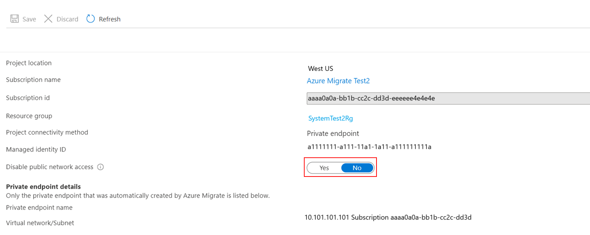

# Support requirements and considerations for Private endpoint connectivity

The article series describes how to use Azure Migrate to discover, assess, and migrate servers over a private network by using [Azure Private Link](../private-link/private-endpoint-overview.md). You can use the [Azure Migrate: Discovery and assessment](migrate-services-overview.md#azure-migrate-discovery-and-assessment-tool) and [Migration and modernization](migrate-services-overview.md#migration-and-modernization-tool) tools to connect privately and securely to Azure Migrate over an Azure ExpressRoute private peering or a site-to-site (S2S) VPN connection by using Private Link.  

We recommend the private endpoint connectivity method when there's an organizational requirement to access Azure Migrate and other Azure resources without traversing public networks. By using Private Link, you can use your existing ExpressRoute private peering circuits for better bandwidth or latency requirements.  

Before you get started, review the required permissions and the supported scenarios and tools. 

## Support requirements

Review the following required permissions and the supported scenarios and tools.

### Supported geographies

The functionality is now in GA in supported [public cloud](./migrate-support-matrix.md#public-cloud) and [government cloud geographies.](./migrate-support-matrix.md#azure-government)

### Required permissions

You must have Contributor + User Access Administrator or Owner permissions on the subscription.

### Supported scenarios and tools

**Deployment** | **Details** | **Tools**
--- | --- | ---
**Discovery and assessment** | Perform an agentless, at-scale discovery and assessment of your servers running on any platform. Examples include hypervisor platforms such as [VMware vSphere](./tutorial-discover-vmware.md) or [Microsoft Hyper-V](./tutorial-discover-hyper-v.md), public clouds such as [AWS](./tutorial-discover-aws.md) or [GCP](./tutorial-discover-gcp.md), or even [bare metal servers](./tutorial-discover-physical.md). | Azure Migrate: Discovery and assessment  
**Software inventory** | Discover apps, roles, and features running on VMware VMs. | Azure Migrate: Discovery and assessment
**Dependency visualization** | Use the dependency analysis capability to identify and understand dependencies across servers.   [Agentless dependency visualization](./how-to-create-group-machine-dependencies-agentless.md) is supported natively with Azure Migrate private link support.  [Agent-based dependency visualization](./how-to-create-group-machine-dependencies.md) requires internet connectivity. Learn how to use [private endpoints for agent-based dependency visualization](../azure-monitor/logs/private-link-security.md). | Azure Migrate: Discovery and assessment |
**Migration** | Perform [agentless VMware migrations](./tutorial-migrate-vmware.md), [agentless Hyper-V migrations](./tutorial-migrate-hyper-v.md), or use the agent-based approach to migrate your [VMware VMs](./tutorial-migrate-vmware-agent.md), [Hyper-V VMs](./tutorial-migrate-physical-virtual-machines.md), [physical servers](./tutorial-migrate-physical-virtual-machines.md), [VMs running on AWS](./tutorial-migrate-aws-virtual-machines.md), [VMs running on GCP](./tutorial-migrate-gcp-virtual-machines.md), or VMs running on a different virtualization provider. | Migration and modernization

#### Other integrated tools

Other migration tools might not be able to upload usage data to the Azure Migrate project if the public network access is disabled. The Azure Migrate project should be configured to allow traffic from all networks to receive data from other Microsoft or external [independent software vendor (ISV)](./migrate-services-overview.md#isv-integration) offerings.

To enable public network access for the Azure Migrate project, sign in to the Azure portal, go to the **Azure Migrate Properties** page in the portal, and select **No** > **Save**.

### Other considerations

**Considerations** | **Details**
--- | ---
**Pricing** | For pricing information, see [Azure Page Blobs pricing](https://azure.microsoft.com/pricing/details/storage/page-blobs/) and [Private Link pricing](https://azure.microsoft.com/pricing/details/private-link/).
**Virtual network requirements** | The ExpressRoute/VPN gateway endpoint should reside in the selected virtual network or a virtual network connected to it. You might need about 15 IP addresses in the virtual network.
**PowerShell support** | PowerShell isn't supported. We recommend using the Azure portal or REST APIs for leveraging Azure Migrate Private Link support. 

## Next steps

- [Discover and assess servers for migration using Private Link](discover-and-assess-using-private-endpoints.md)
- [Migrate servers to Azure using Private Link](migrate-servers-to-azure-using-private-link.md)  
- [Troubleshoot common issues with private endpoint connectivity](troubleshoot-network-connectivity.md)