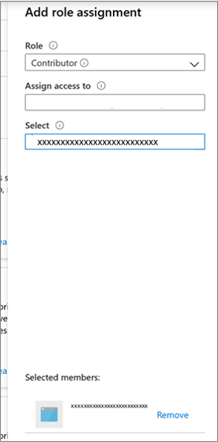

# Using Azure Migrate with private endpoints  

This article describes how to use Azure Migrate to discover, assess, and migrate servers over a private network using [Azure private link](https://docs.microsoft.com/azure/private-link/private-endpoint-overview). 

You can use the [Azure Migrate: Discovery and Assessment](https://docs.microsoft.com/azure/migrate/migrate-services-overview#azure-migrate-discovery-and-assessment-tool) and [Azure Migrate: Server Migration](https://docs.microsoft.com/azure/migrate/migrate-services-overview#azure-migrate-server-migration-tool) tools to connect privately and securely to the Azure Migrate service over an ExpressRoute private peering or a site to site VPN connection, using Azure private link. 

The private endpoint connectivity method is recommended when there is an organizational requirement to access the Azure Migrate service and other Azure resources without traversing public networks. You can also use the private link support to use your existing ExpressRoute private peering circuits for better bandwidth or latency requirements. 

## Support requirements 

### Required permissions

**Contributor + User Access Administrator** or **Owner** permissions on the subscription. 

### Supported scenarios and tools

**Deployment** | **Details** | **Tools** 
--- | --- | ---
**Discovery and Assessment** | Perform an agentless, at-scale discovery and assessment of your servers running on any platform – hypervisor platforms such as [VMware vSphere](https://docs.microsoft.com/azure/migrate/tutorial-discover-vmware) or [Microsoft Hyper-V](https://docs.microsoft.com/azure/migrate/tutorial-discover-hyper-v), public clouds such as [AWS](https://docs.microsoft.com/azure/migrate/tutorial-discover-aws) or [GCP](https://docs.microsoft.com/azure/migrate/tutorial-discover-gcp), or even [bare metal servers](https://docs.microsoft.com/azure/migrate/tutorial-discover-physical). | Azure Migrate: Discovery and Assessment  <br/> 
**Software inventory** | Discover apps, roles, and features running on VMware VMs. | Azure Migrate: Discovery and Assessment  
**Dependency visualization** | Use the dependency analysis capability to identify and understand dependencies across servers. <br/> [Agentless dependency visualization](https://docs.microsoft.com/azure/migrate/how-to-create-group-machine-dependencies-agentless) is supported natively with Azure Migrate private link support. <br/>[Agent-based dependency visualization](https://docs.microsoft.com/azure/migrate/how-to-create-group-machine-dependencies) requires Internet connectivity. [learn how](https://docs.microsoft.com/azure/azure-monitor/logs/private-link-security) to  to use private endpoints for agent-based dependency visualization. | Azure Migrate: Discovery and Assessment |
**Migration** | Perform [agentless Hyper-V migrations](https://docs.microsoft.com/azure/migrate/tutorial-migrate-hyper-v) or use the agent-based approach to migrate your [VMware VMs](./tutorial-migrate-vmware-agent.md), [Hyper-V VMs](./tutorial-migrate-physical-virtual-machines.md), [physical servers](./tutorial-migrate-physical-virtual-machines.md), [VMs running on AWS](./tutorial-migrate-aws-virtual-machines.md), [VMs running on GCP](https://docs.microsoft.com/azure/migrate/tutorial-migrate-gcp-virtual-machines), or VMs running on a different virtualization provider. | Azure Migrate: Server Migration
 
>[!Note]
>
> [Agentless VMware migrations](https://docs.microsoft.com/azure/migrate/tutorial-migrate-vmware) require Internet access or connectivity via ExperessRoute Microsoft peering. <br/> [Learn how](https://docs.microsoft.com/azure/migrate/replicate-using-expressroute) to use private endpoints to perform replications over ExpressRoute private peering or a site-to-site (S2S) VPN connection.  <br/><br/> 
   
#### Other integrated tools

Some migration tools may not be able to upload usage data to the Azure Migrate project if public network access is disabled. The Azure Migrate project should be configured to allow traffic from all networks to receive data from other Microsoft or external [independent software vendor (ISV)](https://docs.microsoft.com/azure/migrate/migrate-services-overview#isv-integration) offerings. 


To enable public network access for the Azure Migrate project, go to the Azure Migrate **properties page** on the Azure portal, select **No**, and select **Save**.


### Other considerations   

**Considerations** | **Details**
--- | --- 
**Pricing** | For pricing information, see [Azure blob pricing](https://azure.microsoft.com/pricing/details/storage/page-blobs/) and [Azure private link pricing](https://azure.microsoft.com/pricing/details/private-link/).  
**Virtual network requirements** | The ExpressRoute/VPN gateway endpoint should reside in the selected virtual network or a virtual network connected to it. You may need ~15 IP addresses in the virtual network.  

## Create a project with private endpoint connectivity

Use this [article](https://docs.microsoft.com/azure/migrate/create-manage-projects#create-a-project-for-the-first-time) to set up a new Azure Migrate project. 

> [!Note]
> You cannot change the connectivity method to private endpoint connectivity for existing Azure Migrate projects.

In the **Advanced** configuration section, provide the below details to create a private endpoint for your Azure Migrate project.
- In **Connectivity method**, choose **Private endpoint**. 
- In **Disable public endpoint access**, keep the default setting  **No**. Some migration tools may not be able to upload usage data to the Azure Migrate project if public network access is disabled. [Learn more.](#other-integrated-tools)
- In **Virtual network subscription**, select the subscription for the private endpoint virtual network. 
- In **Virtual network**, select the virtual network for the private endpoint. The Azure Migrate appliance and other software components that need to connect to the Azure Migrate project must be on this network or a connected virtual network.
- In **Subnet**, select the subnet for the private endpoint. 

Select **Create**. Wait a few minutes for the Azure Migrate project to deploy. Do not close this page while the project creation is in progress.


    
This creates a migrate project and attaches a private endpoint to it. 

## Discover and assess servers for migration using Azure private link 

### Set up the Azure Migrate appliance 

1. In **Discover machines** > **Are your machines virtualized?**, select the server type.
2. In **Generate Azure Migrate project key**, provide a name for the Azure Migrate appliance. 
3. Select **Generate key** to create the required Azure resources. 

    > [!Important]
    > Do not close the Discover machines page during the creation of resources.  
    - At this step, Azure Migrate creates a key vault, storage account, Recovery Services vault (only for agentless VMware migrations), and a few internal resources and attaches a private endpoint to each resource. The private endpoints are created in the virtual network selected during the project creation.  
    - Once the private endpoints are created, the DNS CNAME resource records for the Azure Migrate resources are updated to an alias in a subdomain with the prefix 'privatelink'. By default, Azure Migrate also creates a private DNS zone corresponding to the 'privatelink' subdomain for each resource type and inserts DNS A records for the associated private endpoints. This enables the Azure Migrate appliance and other software components residing in the source network to reach the Azure Migrate resource endpoints on private IP addresses.  
    - Azure Migrate also enables a [managed identity](https://docs.microsoft.com/azure/active-directory/managed-identities-azure-resources/overview) for the migrate project, and grants permissions to the managed identity to securely access the storage account.  

4. After the key is successfully generated, copy the key details to configure and register the appliance.   

#### Download the appliance installer file  

> [!Note]
> If you are facing issues downloading the appliance installer file, please create a support case.

Azure Migrate: Discovery and assessment use a lightweight Azure Migrate appliance. The appliance performs server discovery and sends server configuration and performance metadata to Azure Migrate.

To set up the appliance, download the zipped file containing the installer script from the portal. Copy the zipped file on the server that will host the appliance. 

Make sure the server meets the [hardware requirements](https://docs.microsoft.com/azure/migrate/migrate-appliance) for the chosen scenario (VMware/Hyper-V/Physical or other) and can connect to the required Azure URLs - [public](./migrate-appliance.md#public-cloud-urls-for-private-link-connectivity) and [government](./migrate-appliance.md#government-cloud-urls-for-private-link-connectivity) clouds.

After downloading the zipped file, run the installer script to deploy the appliance.

#### Run the script

1. Extract the zipped file to a folder on the server that will host the appliance. 
2. Launch PowerShell on the machine, with administrator (elevated) privileges.
3. Change the PowerShell directory to the folder containing the contents extracted from the downloaded zipped file.
4. Run the script **AzureMigrateInstaller.ps1**, as follows:

    ``` PS C:\Users\administrator\Desktop\AzureMigrateInstaller-Server-Public> .\AzureMigrateInstaller.ps1```
   
5. After the script runs successfully, it launches the appliance configuration manager so that you can configure the appliance. If you encounter any issues, review the script logs at C:\ProgramData\Microsoft Azure\Logs\AzureMigrateScenarioInstaller_<em>Timestamp</em>.log.

### Configure the appliance and start continuous discovery

Open a browser on any machine that can connect to the appliance server, and open the URL of the appliance configuration manager: `https://appliance name or IP address: 44368`. Alternately, you can open the configuration manager from the appliance server desktop by selecting the shortcut for the configuration manager.

#### Set up prerequisites

1. Read the third-party information and accept the **license terms**.    
 
2. In the configuration manager > **Set up prerequisites**, do the following:
   - **Connectivity**: The appliance checks for access to the required URLs. If the server uses a proxy:
     - Select **Set up proxy** to specify the proxy address `http://ProxyIPAddress` or `http://ProxyFQDN` and listening port.
     - Specify credentials if the proxy needs authentication. Only HTTP proxy is supported.
     - If you want, you can add a list of URLs/IP addresses that should bypass the proxy server. If you are using ExpressRoute private peering, ensure that you bypass these [URLs](https://docs.microsoft.com/azure/migrate/replicate-using-expressroute#configure-proxy-bypass-rules-on-the-azure-migrate-appliance-for-vmware-agentless-migrations).
     - You need to select **Save** to register the configuration if you have updated the proxy server details or added URLs/IP addresses to bypass proxy.
     
        > [!Note]
        > If you are getting an error with aka.ms/* link during connectivity check and you do not want the appliance to access this URL over the internet, you need to disable the auto update service on the appliance by following the steps [**here**](https://docs.microsoft.com/azure/migrate/migrate-appliance#turn-off-auto-update). After the auto-update has been disabled, the aka.ms/* URL connectivity check will be skipped. 

   - **Time sync**: The time on the appliance should be in sync with internet time for discovery to work properly.
   - **Install updates**: The appliance ensures that the latest updates are installed. After the check completes, you can select **View appliance services** to see the status and versions of the services running on the appliance server.
        > [!Note]
        > If you have chosen to disable auto update service on the appliance, you can update the appliance services manually to get the latest versions of the services by following the steps [**here**](https://docs.microsoft.com/azure/migrate/migrate-appliance#manually-update-an-older-version).
   - **Install VDDK**: (_Needed only for VMware appliance)_ The appliance checks that VMware vSphere Virtual Disk Development Kit (VDDK) is installed. If it isn't installed, download VDDK 6.7 from VMware, and extract the downloaded zip contents to the specified location on the appliance, as provided in the **Installation instructions**.

#### Register the appliance and start continuous discovery

After the prerequisites check has completed, follow these steps to register the appliance and start continuous discovery for respective scenarios:
[VMware VMs](https://docs.microsoft.com/azure/migrate/tutorial-discover-vmware#register-the-appliance-with-azure-migrate), 
[Hyper-V VMs](https://docs.microsoft.com/azure/migrate/tutorial-discover-hyper-v#register-the-appliance-with-azure-migrate), 
[Physical Servers](https://docs.microsoft.com/azure/migrate/tutorial-discover-physical#register-the-appliance-with-azure-migrate), 
[AWS VMs](https://docs.microsoft.com/azure/migrate/tutorial-discover-aws#register-the-appliance-with-azure-migrate), 
[GCP VMs](https://docs.microsoft.com/azure/migrate/tutorial-discover-gcp#register-the-appliance-with-azure-migrate).


>[!Note]
> If you are getting DNS resolution issues during appliance registration or at the time of starting discovery, ensure that Azure Migrate resources created during the **Generate key** step on portal are reachable from the on-premises server hosting the Azure Migrate appliance. [Learn more on how to verify network connectivity](#troubleshoot-network-connectivity).

### Assess your servers for migration to Azure
After the discovery is complete, assess your servers ([VMware VMs](https://docs.microsoft.com/azure/migrate/tutorial-assess-vmware-azure-vm), [Hyper-V VMs](https://docs.microsoft.com/azure/migrate/tutorial-assess-hyper-v), [physical servers](https://docs.microsoft.com/azure/migrate/tutorial-assess-vmware-azure-vm), [AWS VMs](https://docs.microsoft.com/azure/migrate/tutorial-assess-aws), [GCP VMs](https://docs.microsoft.com/azure/migrate/tutorial-assess-gcp)) for migration to Azure VMs or Azure VMware Solution (AVS), using the Azure Migrate: Discovery and Assessment tool. 

You can also [assess your on-premises machines](https://docs.microsoft.com/azure/migrate/tutorial-discover-import#prepare-the-csv) with the Azure Migrate: Discovery and Assessment tool using an imported comma-separated values (CSV) file.   

## Migrate servers to Azure using Azure private link

The following sections describe the steps required to use Azure Migrate with [private endpoints](https://docs.microsoft.com/azure/private-link/private-endpoint-overview) for migrations using ExpressRoute private peering or VPN connections.  

This article shows a proof-of-concept deployment path for agent-based replications to migrate your [VMware VMs](./tutorial-migrate-vmware-agent.md), [Hyper-V VMs](./tutorial-migrate-physical-virtual-machines.md), [physical servers](./tutorial-migrate-physical-virtual-machines.md), [VMs running on AWS](./tutorial-migrate-aws-virtual-machines.md), [VMs running on GCP](https://docs.microsoft.com/azure/migrate/tutorial-migrate-gcp-virtual-machines), or VMs running on a different virtualization provider using Azure private endpoints. You can use a similar approach for performing [agentless Hyper-V migrations](https://docs.microsoft.com/azure/migrate/tutorial-migrate-hyper-v) using private link.

>[!Note]
>[Agentless VMware migrations](https://docs.microsoft.com/azure/migrate/tutorial-assess-physical) require Internet access or connectivity via ExperessRoute Microsoft peering. 

### Set up a replication appliance for migration 

The following diagram illustrates the agent-based replication workflow with private endpoints using the Azure Migrate: Server Migration tool.  


The tool uses a replication appliance to replicate your servers to Azure. Use this article to [prepare and set up a machine for the replication appliance. ](https://docs.microsoft.com/azure/migrate/tutorial-migrate-physical-virtual-machines#prepare-a-machine-for-the-replication-appliance)

After you set up the replication appliance, use the following instructions to create the required resources for migration. 

1. In **Discover machines** > **Are your machines virtualized?**, select **Not virtualized/Other**.
2. In **Target region**, select and confirm the Azure region to which you want to migrate the machines.
3. Select **Create resources** to create the required Azure resources. Do not close the page during the creation of resources.   
    - This creates a Recovery Services vault in the background and enables a managed identity for the vault. A Recovery Services vault is an entity that contains the replication information of servers and is used to trigger replication operations.  
    - If the Azure Migrate project has private endpoint connectivity, a private endpoint is created for the Recovery Services vault. This adds five fully qualified private names (FQDNs) to the private endpoint, one for each microservice linked to the Recovery Services vault.   
    - The five domain names are formatted in this pattern: <br/> _{Vault-ID}-asr-pod01-{type}-.{target-geo-code}_.privatelink.siterecovery.windowsazure.com  
    - By default, Azure Migrate automatically creates a private DNS zone and adds DNS A records for the Recovery Services vault microservices. The private DNS zone is then linked to the private endpoint virtual network. This allows the on-premises replication appliance to resolve the fully qualified domain names to their private IP addresses.

4. Before you register the replication appliance, ensure that the vault's private link FQDNs are reachable from the machine hosting the replication appliance. [Learn more on how to verify network connectivity.](#troubleshoot-network-connectivity) 

5. Once you verify the connectivity, download the appliance setup and key file, run the installation process, and register the appliance to Azure Migrate. Review the [detailed steps here](https://docs.microsoft.com/azure/migrate/tutorial-migrate-physical-virtual-machines#set-up-the-replication-appliance). After you set up the replication appliance, follow these instructions to [install the mobility service](https://docs.microsoft.com/azure/migrate/tutorial-migrate-physical-virtual-machines#install-the-mobility-service) on the machines you want to migrate. 

### Replicate servers to Azure using Azure private link 

Now, follow [these steps](https://docs.microsoft.com/azure/migrate/tutorial-migrate-physical-virtual-machines#replicate-machines) to select servers for replication.  

In **Replicate** > **Target settings** > **Cache/Replication storage account**, use the drop-down to select a storage account to replicate over a private link.  

If your Azure Migrate project has private endpoint connectivity, you must  [grant permissions to the Recovery Services vault managed identity](#grant-access-permissions-to-the-recovery-services-vault) to access the storage account required by Azure Migrate.   

Additionally, to enable replications over a private link, [create a private endpoint for the storage account.](#create-a-private-endpoint-for-the-storage-account-optional)

#### Grant access permissions to the Recovery Services vault

The Recovery Services vault managed identity requires permissions for authenticated access to the cache/replication storage account. 

Use the guidance below to identify the Recovery Services vault created by Azure Migrate and grant the required permissions. 

**_Identify the recovery services vault and the managed identity object ID_**

You can find the details of the Recovery Services vault on the Azure Migrate: Server Migration **properties** page. 

1. Go to the **Azure Migrate hub**, select **Overview** on the Azure Migrate: Server Migration tile.

    

2. On the left pane, select **Properties**. Make note of the Recovery Services vault name and managed identity ID. The vault will have _Private endpoint_ as the **connectivity type** and _Other_ as the **replication type**. You will need this information while providing access to the vault.
      
    

**_Grant the required permissions to access the storage account_**

 The managed identity of the vault must be granted the following role permissions on the storage account required for replication.  In this case, you must create the storage account in advance.

>[!Note]
> For migrating Hyper-V VMs to Azure using private link, you must grant access to both the replication storage account and cache storage account. 

The role permissions vary depending on the type of the storage account.

- Resource Manager-based storage accounts (Standard type):
  - [Contributor](../role-based-access-control/built-in-roles.md#contributor) _and_
  - [Storage Blob Data Contributor](../role-based-access-control/built-in-roles.md#storage-blob-data-contributor)
- Resource Manager-based storage accounts (Premium type):
  - [Contributor](../role-based-access-control/built-in-roles.md#contributor) _and_
  - [Storage Blob Data Owner](../role-based-access-control/built-in-roles.md#storage-blob-data-owner)

1. Go to the replication/cache storage account selected for replication. Select **Access control (IAM)** in the left pane. 

1. In the **Add a role assignment** section, select **Add**:

   


1. On the **Add role assignment** page, in the **Role**
   field, select the appropriate role from the permissions list mentioned above. Enter the name of the vault noted previously and select **Save**.

    

4. In addition to these permissions, you must also allow access to Microsoft trusted services. If your network access is restricted to selected networks, select **Allow trusted Microsoft services to access this storage account** in **Exceptions** section in the **Networking** tab. 


### Create a private endpoint for the storage account (optional)

To replicate using ExpressRoute with private peering, [create a private endpoint](https://docs.microsoft.com/azure/private-link/tutorial-private-endpoint-storage-portal#create-storage-account-with-a-private-endpoint) for the cache/replication storage accounts (target subresource: **_blob_**). 

>[!Note]
>
> - You can create private endpoints only on a General Purpose v2 (GPv2) storage account. For pricing information, see [Azure Page Blobs pricing](https://azure.microsoft.com/pricing/details/storage/page-blobs/) and [Azure private link pricing](https://azure.microsoft.com/pricing/details/private-link/)

The private endpoint for the storage account should be created in the same virtual network as the Azure Migrate project private endpoint or another virtual network connected to this network. 

Select **Yes** and integrate with a private DNS zone. The private DNS zone helps in routing the connections from the virtual network to the storage account over a private link. Selecting **Yes** automatically links the DNS zone to the  virtual network and adds the DNS records for the resolution of new IPs and fully qualified domain names created. Learn more about [private DNS zones.](https://docs.microsoft.com/azure/dns/private-dns-overview)

If the user creating the private endpoint is also the owner of the storage account, the private endpoint will be auto-approved. Otherwise, the owner of the storage account must approve the private endpoint for usage. To approve or reject a requested private endpoint connection, go to **Private endpoint connections** under **Networking** on the storage account page.

Review the status of the private endpoint connection state before proceeding. 


After you've created the private endpoint, use the drop-down in **Replicate** > **Target settings** > **Cache storage account**  to select the storage account for replicating over a private link.  

Ensure that the on-premises replication appliance has network connectivity to the storage account on its private endpoint. [Learn more on how to verify network connectivity.](#troubleshoot-network-connectivity)

>[!Note]
>
> - For Hyper-V VM migrations to Azure, if the replication storage account is of _Premium_ type, you must select another storage account of _Standard_ type for the cache storage account. In this case, you must create private endpoints for both the replication and cache storage account.  

Next, follow these instructions to [review and start replication](https://docs.microsoft.com/azure/migrate/tutorial-migrate-physical-virtual-machines#replicate-machines) and [perform migrations](https://docs.microsoft.com/azure/migrate/tutorial-migrate-physical-virtual-machines#run-a-test-migration).  

## Troubleshoot network connectivity 

### Validate private endpoints configuration 

Make sure the private endpoint is an approved state.  

1. Go to Azure Migrate: Discovery and Assessment and Server Migration properties page.
2. The properties page contains the list of private endpoints and private link FQDNs that were automatically created by Azure Migrate.  

3. Select the private endpoint you want to diagnose.  
    1. Validate that the connection state is Approved.
    2. If the connection is in a Pending state, you need to get it approved.
    3. You may also navigate to the private endpoint resource and review if the virtual network matches the Migrate project private endpoint virtual network. 

    

### Verify DNS resolution 

The on-premises appliance (or replication provider) will access the Azure Migrate resources using their fully qualified private link domain names (FQDNs). You may require additional DNS settings to resolve the private IP address of the private endpoints from the source environment. [Use this article](https://docs.microsoft.com/azure/private-link/private-endpoint-dns#on-premises-workloads-using-a-dns-forwarder) to understand the DNS configuration scenarios that can help troubleshoot any network connectivity issues.  

To validate the private link connection, perform a DNS resolution of the Azure Migrate resource endpoints (private link resource FQDNs) from the on-premises server hosting the Migrate appliance and ensure that it resolves to a private IP address. 
The private endpoint details and private link resource FQDNs' information is available in the Discovery and Assessment and Server Migration properties pages. Select **Download DNS settings** to view the list.   

 

 

An illustrative example for DNS resolution of the storage account private link FQDN.  

- Enter _nslookup<storage-account-name>_.blob.core.windows.net.  Replace <storage-account-name> with the name of the storage account used for Azure Migrate.  

    You'll receive a message like this:  

   

- A private IP address of 10.1.0.5 is returned for the storage account. This address belongs to the private endpoint virtual network subnet.   

You can verify the DNS resolution for other Azure Migrate artifacts using a similar approach.   

If the DNS resolution is incorrect, follow these steps:  

- If you use a custom DNS, review your custom DNS settings, and validate that the DNS configuration is correct. For guidance, see [private endpoint overview: DNS configuration](https://docs.microsoft.com/azure/private-link/private-endpoint-overview#dns-configuration).
- If you use Azure-provided DNS servers, refer to the below section for further troubleshooting.  

> [!Tip]
> You can manually update your source environment DNS records by editing the DNS hosts file on your on-premises appliance with the private link resource FQDNs and their associated private IP addresses. This option is recommended only for testing. <br/>  


### Validate the Private DNS Zone   
If the DNS resolution is not working as described in the previous section, there might be an issue with your Private DNS Zone.  

#### Confirm that the required Private DNS Zone resource exists  
By default, Azure Migrate also creates a private DNS zone corresponding to the 'privatelink' subdomain for each resource type. The private DNS zone will be created in the same Azure resource group as the private endpoint resource group. The Azure resource group should contain private DNS zone resources with the following format:
- privatelink.vaultcore.azure.net for the key vault 
- privatelink.blob.core.windows.net for the storage account
- privatelink.siterecovery.windowsazure.com for the recovery services vault (for Hyper-V and agent-based replications)
- privatelink.prod.migration.windowsazure.com - migrate project, assessment project, and discovery site.   

The private DNS zone will be automatically created by Azure Migrate (except for the cache/replication storage account selected by the user). You can locate the linked private DNS zone by navigating to the private endpoint page and selecting DNS configurations. You should see the private DNS zone under the private DNS integration section. 

  

If the DNS zone is not present (as shown below), [create a new Private DNS Zone resource.](https://docs.microsoft.com/azure/dns/private-dns-getstarted-portal)  

 

#### Confirm that the Private DNS Zone is linked to the virtual network  
The private DNS zone should be linked to the virtual network that contains the private endpoint for the DNS query to resolve the private IP address of the resource endpoint. If the private DNS zone is not linked to the correct Virtual Network, any DNS resolution from that virtual network will ignore the private DNS zone.   

Navigate to the private DNS zone resource in the Azure portal and select the virtual network links from the left menu. You should see the virtual networks linked.

 

This will show a list of links, each with the name of a virtual network in your subscription. The virtual network that contains the Private Endpoint resource must be listed here. Else, [follow this article](https://docs.microsoft.com/azure/dns/private-dns-getstarted-portal#link-the-virtual-network) to link the private DNS zone to a virtual network.    

Once the private DNS zone is linked to the virtual network, DNS requests originating from the virtual network will look for DNS records in the private DNS zone. This is required for correct address resolution to the virtual network where the private endpoint was created.   

#### Confirm that the private DNS zone contains the right A records 

Go to the private DNS zone you want to troubleshoot. The Overview page shows all DNS records for that private DNS zone. Verify that a DNS A record exists for the resource. The value of the A record (the IP address) must be the resources’ private IP address. If you find the A record with the wrong IP address, you must remove the wrong IP address and add a new one. It's recommended that you remove the entire A record and add a new one, and do a DNS flush on the on-premises source appliance.   

An illustrative example for the storage account DNS A record in the private DNS zone:

   

An illustrative example for the Recovery Services vault microservices DNS A records in the private DNS zone: 

   

>[!Note]
> When you remove or modify an A record, the machine may still resolve to the old IP address because the TTL (Time To Live) value might not have expired yet.  

#### Other things that may affect private link connectivity  

This is a non-exhaustive list of items that can be found in advanced or complex scenarios: 

- Firewall settings, either the Azure Firewall connected to the Virtual network or a custom firewall solution deploying in the appliance machine.  
- Network peering, which may impact which DNS servers are used and how traffic is routed.  
- Custom gateway (NAT) solutions may impact how traffic is routed, including traffic from DNS queries.

For more information, review the [troubleshooting guide for Private Endpoint connectivity problems.](https://docs.microsoft.com/azure/private-link/troubleshoot-private-endpoint-connectivity)  

## Next steps 
- [Complete the migration process](https://docs.microsoft.com/azure/migrate/tutorial-migrate-physical-virtual-machines#complete-the-migration) and review the [post-migration best practices](https://docs.microsoft.com/azure/migrate/tutorial-migrate-physical-virtual-machines#post-migration-best-practices).