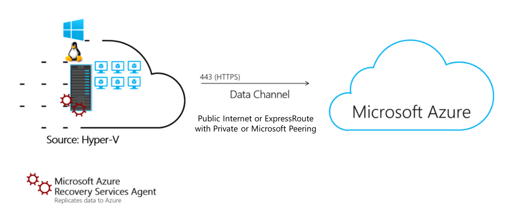

# How does Hyper-V replication work?

This article provides an overview of the architecture and processes used when you migrate Hyper-V VMs with the Migration and modernization tool.

[Azure Migrate](migrate-services-overview.md) provides a central hub to track discovery, assessment, and migration of your on-premises apps and workloads, and private/public cloud VMs, to Azure. The hub provides Azure Migrate tools for assessment and migration, as well as third-party independent software vendor (ISV) offerings.

## Agentless migration

The Migration and modernization tool provides agentless replication for on-premises Hyper-V VMs, using a migration workflow that's optimized for Hyper-V. You install a software agent only on Hyper-V hosts or cluster nodes. Nothing needs to be installed on Hyper-V VMs.

## Migration and modernization and Azure Site Recovery

Migration and modernization is a tool for migrating on-premises workloads, and cloud-based VMs, to Azure. Site Recovery is a disaster recovery tool. The tools share some common technology components used for data replication, but serve different purposes. 

## Architectural components

**Component** | **Deployment** | 
--- | --- 
**Replication provider** | The Microsoft Azure Site Recovery provider is installed on Hyper-V hosts, and registered with the Migration and modernization tool.  The provider orchestrates replication for Hyper-V VMs.
**Recovery Services agent** | The Microsoft Azure Recovery Service agent handles data replication. It works with the provider to replicate data from Hyper-V VMs to Azure.  The replicated data is uploaded to a storage account in your Azure subscription. The Migration and modernization tool the processes the replicated data, and applies it to replica disks in the subscription. The replica disks are used to create the Azure VMs when you migrate.

- Components are installed by a single setup file, downloaded from the Migration and modernization tool in the portal.
- The provider and appliance use outbound HTTPS port 443 connections to communicate with the Migration and modernization tool.
- Communications from the provider and agent are secure and encrypted.

## Replication process

1. When you enable replication for a Hyper-V VM, initial replication begins.
2. A Hyper-V VM snapshot is taken.
3. VHDs on the VM are replicated one-by-one, until they're all copied to Azure. Initial replication time depends on the VM size, and network bandwidth.
4. Disk changes that occur during initial replication are tracked using Hyper-V Replica, and stored in log files (hrl files).
    - Log files are in the same folder as the disks.
    - Each disk has an associated hrl file that's sent to secondary storage.
    - The snapshot and log files consume disk resources while initial replication is in progress.
4. After initial replication finishes, the VM snapshot is deleted, and delta replication begins.
5. Incremental disk changes are tracked in hrl files. Replication logs are periodically uploaded to an Azure storage account by the Recovery Services agent.

## Performance and scaling

Replication performance for Hyper-V is influenced by factors that include VM size, the data change rate (churn) of the VMs, available space on the Hyper-V host for log file storage,  upload bandwidth for replication data, and target storage in Azure.

- If you're replicating multiple machines at the same time, use the [Azure Site Recovery Deployment Planner](../site-recovery/hyper-v-deployment-planner-overview.md) for Hyper-V, to help optimize replication.
- Plan your Hyper-V replication, and distribute replication over Azure storage accounts, in accordance with capacity.

### Control upload throughput

You can limit the amount of bandwidth used to upload data to Azure on each Hyper-V host. Be careful. If you set the values too low it will adversely impact replication, and delay migration.

1. Sign in to the Hyper-V host or cluster node.
2. Run **C:\Program Files\Microsoft Azure Recovery Services Agent\bin\wabadmin.msc**, to open the Windows Azure Backup MMC snap-in.
3. In the snap-in, select **Change Properties**.
4. In **Throttling**, select **Enable internet bandwidth usage throttling for backup operations**. Set the limits for work and non-work hours. Valid ranges are from 512 Kbps to 1,023 Mbps.

### Influence upload efficiency

If you have spare bandwidth for replication, and want to increase uploads, you can increase the number of threads allocated for the upload task, as follows:

1. Open the registry with Regedit.
2. Navigate to key HKEY_LOCAL_MACHINE\SOFTWARE\Microsoft\Windows Azure Backup\Replication\UploadThreadsPerVM
3. Increase the value for the number of threads used for data upload for each replicating VM. The default value is 4 and the max value is 32. 

## Next steps

Try out [Hyper-V migration](tutorial-migrate-hyper-v.md) using the Migration and modernization tool.
