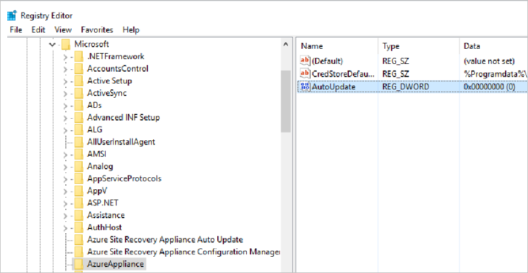

# Azure Migrate appliance

This article summarizes the prerequisites and support requirements for the Azure Migrate appliance. 

## Deployment scenarios

The Azure Migrate appliance is used in the following scenarios.

**Scenario** | **Tool** | **Used for** 
--- | --- | ---
**VMware VM assessment** | Azure Migrate:Server Assessment | Discover VMware VMs   Discover machine apps and dependencies   Collect machine metadata and performance metadata for assessments.
**VMware VM agentless migration** | Azure Migrate:Server Migration | Discover VMware VMs    Replicate VMware VMs with agentless migration.
**Hyper-V VM assessment** | Azure Migrate:Server Assessment | Discover Hyper-V VMs   Collect machine metadata and performance metadata for assessments.
**Physical machine assessment** |  Azure Migrate:Server Assessment |  Discover physical servers (or VMs you treat as physical servers).   Collect machine metadata and performance metadata for assessments.

## Appliance - VMware 

The following table summarizes the Azure Migrate appliance requirements for VMware.

**Requirement** | **VMware** 
--- | ---
**Appliance components** | The appliance has the following components:   - **Management app**: This is a web app for user input during appliance deployment. Used when assessing machines for migration to Azure.  - **Discovery agent**: The agent gathers machine configuration data. Used when assessing machines for migration to Azure. - **Assessment agent**: The agent collects performance data. Used when assessing machines for migration to Azure. - **Auto update service**: Updates appliance components (runs every 24 hours). - **DRA agent**: Orchestrates VM replication, and coordinates communication between replicated machines and Azure. Used only when replicating VMware VMs to Azure using agentless migration. - **Gateway**: Sends replicated data to Azure. Used only when replicating VMware VMs to Azure using agentless migration.
**Supported deployment** | Deploy as VMware VM using OVA template.   Deploy as a VMware VM or physical machine using PowerShell installation script.
**Project support** |  An appliance can be associated with a single project.   Any number of appliances can be associated with a single project.  
**Discovery limits** | An appliance can discover up to 10,000 VMware VMs on a vCenter Server.  An appliance can connect to a single vCenter Server.
**OVA template** | Download from portal or from https://aka.ms/migrate/appliance/vmware.   Download size is 11.2 GB.   The downloaded appliance template comes with a Windows Server 2016 evaluation license, which is valid for 180 days. If the evaluation period is close to expiry, we recommend that you download and deploy a new appliance, or that you activate the operating system license of the appliance VM.
**PowerShell script** | Script [download](https://go.microsoft.com/fwlink/?linkid=2105112).   
**Software/hardware** |  The appliance should run on machine with Windows Server 2016, 32-GB RAM, 8 vCPUs, around 80 GB of disk storage, and an external virtual switch.  The appliance requires internet access, either directly or through a proxy.   If you run the appliance on a VMware VM, you need enough resources on the vCenter Server to allocate a VM that meets the requirements.   If you run the appliance on a physical machine, make sure that it's running Windows Server 2016, and meets hardware requirements. 
**VMware requirements** | If you deploy the appliance as a VMware VM, it  must be deployed on an ESXi host running version 5.5 or later.   vCenter Server running 5.5, 6.0, 6.5, or 6.7.
**VDDK (agentless migration)** | If you deploy the appliance as a VMware VM, and you're running an agentless migration, the VMware vSphere VDDK must be installed on the appliance VM.
**Hash value-OVA** | [Verify](tutorial-assess-vmware.md#verify-security) the OVA template hash values.
**Hash value-PowerShell script** | [Verify](deploy-appliance-script.md#verify-file-security) the PowerShell script hash values.

## Appliance - Hyper-V

**Requirement** | **Hyper-V** 
--- | ---
**Appliance components** | The appliance has the following components:  - **Management app**: This is a web app for user input during appliance deployment. Used when assessing machines for migration to Azure.  - **Discovery agent**: The agent gathers machine configuration data. Used when assessing machines for migration to Azure. - **Assessment agent**: The agent collects performance data. Used when assessing machines for migration to Azure. - **Auto update service**: Updates appliance components (runs every 24 hours).
**Supported deployment** | Deploy as Hyper-V VM using a VHD template.   Deploy as a Hyper-V VM or physical machine using a PowerShell installation script.
**Project support** |  An appliance can be associated with a single project.   Any number of appliances can be associated with a single project.  
**Discovery limits** | An appliance can discover up to 5000 Hyper-V VMs.  An appliance can connect to up to 300 Hyper-V hosts.
**VHD template** | Zipped folder including VHD. Download from portal or from https://aka.ms/migrate/appliance/hyperv.   Download size is 10 GB.   The downloaded appliance template comes with a Windows Server 2016 evaluation license, which is valid for 180 days. If the evaluation period is close to expiry, we recommend that you download and deploy a new appliance, or that you activate the operating system license of the appliance VM.
**PowerShell script** | Script [download](https://go.microsoft.com/fwlink/?linkid=2105112).   
**Software/hardware***   |  The appliance should run on machine with Windows Server 2016, 32-GB RAM, 8 vCPUs, around 80 GB of disk storage, and an external virtual switch.  The appliance needs a static or dynamic IP address, and requires internet access, either directly or through a proxy.   If you run the appliance as a Hyper-V VM, you need enough resources on the Hyper-V host to allocate 16-GB RAM, 8 vCPUs, around 80 GB of storage space, and an external switch for the appliance VM.   If you run the appliance on a physical machine, make sure that it's running Windows Server 2016, and meets hardware requirements. 
**Hyper-V requirements** | If you deploy the appliance with the VHD template, the appliance VM provided by Azure Migrate is Hyper-V VM version 5.0.   The Hyper-V host must be running Windows Server 2012 R2 or later. 
**Hash value-VHD** | [Verify](tutorial-assess-hyper-v.md#verify-security) the VHD template hash values.
**Hash value-PowerShell script** | [Verify](deploy-appliance-script.md#verify-file-security) the PowerShell script hash values.

## Appliance - Physical

**Requirement** | **Physical** 
--- | ---
**Appliance components** | The appliance has the following components:    - **Management app**: This is a web app for user input during appliance deployment. Used when assessing machines for migration to Azure.  - **Discovery agent**: The agent gathers machine configuration data. Used when assessing machines for migration to Azure. - **Assessment agent**: The agent collects performance data. Used when assessing machines for migration to Azure. - **Auto update service**: Updates appliance components (runs every 24 hours).
**Supported deployment** | Deploy as a dedicated physical machine, or a VM, using a PowerShell installation script.
**Project support** |  An appliance can be associated with a single project.   Any number of appliances can be associated with a single project.  
**Discovery limits** | An appliance can discover up to 250 physical servers.
**PowerShell script** | Download the script (AzureMigrateInstaller.ps1) in a zipped folder from the portal. [Learn more](tutorial-assess-physical.md#set-up-the-appliance). Alternatively, [download directly](https://go.microsoft.com/fwlink/?linkid=2105112).   Download size is 59.7 MB.
**Software/hardware** |  The appliance should run on machine with Windows Server 2016, 32-GB RAM, 8 vCPUs, around 80 GB of disk storage, and an external virtual switch.  The appliance needs a static or dynamic IP address, and requires internet access, either directly or through a proxy.   If you run the appliance on a physical machine, make sure that it's running Windows Server 2016, and meets hardware requirements. 
**Hash value** | [Verify](deploy-appliance-script.md#verify-file-security) the PowerShell script hash values.

## URL access

The Azure Migrate appliance needs connectivity to the internet.

- When you deploy the appliance, Azure Migrate does a connectivity check to the URLs summarized in the table below.
- If you're using a URL-based proxy to connect to the internet, you need to allow access to these URLs, making sure that the proxy resolves any CNAME records received while looking up the URLs.

**URL** | **Details**  
--- | --- |
*.portal.azure.com  | Navigate to the Azure portal.
*.windows.net   *.msftauth.net   *.msauth.net   *.microsoft.com   *.live.com | Sign in to your Azure subscription.
*.microsoftonline.com   *.microsoftonline-p.com | Create Azure Active Directory (AD) apps for the appliance to communicate with Azure Migrate.
management.azure.com | Create Azure AD apps for the appliance to communicate with the Azure Migrate service.
dc.services.visualstudio.com | Upload app logs used for internal monitoring.
*.vault.azure.net | Manage secrets in the Azure Key Vault.
aka.ms/* | Allow access to aka links. Used for Azure Migrate appliance updates.
download.microsoft.com/download | Allow downloads from Microsoft download.
*.servicebus.windows.net | Communication between the appliance and the Azure Migrate service.
*.discoverysrv.windowsazure.com   *.migration.windowsazure.com | Connect to Azure Migrate service URLs.
*.hypervrecoverymanager.windowsazure.com | **Used for VMware agentless migration**   Connect to Azure Migrate service URLs.
*.blob.core.windows.net |  **Used for VMware agentless migration**  Upload data to storage for migration.

## Collected data - VMware

The appliance collects metadata, performance data, and dependency analysis data (if agentless [dependency analysis](concepts-dependency-visualization.md) is used).

### Metadata

Metadata discovered by the Azure Migrate appliance helps you to figure out whether machines and apps are ready for migration to Azure, right-size machines and apps, plans costs, and analyze application dependencies. Microsoft doesn't use this data in any license compliance audit.

Here's the full list of VMware VM metadata that the appliance collects and sends to Azure.

**DATA** | **COUNTER**
--- | --- 
**Machine details** | 
VM ID | vm.Config.InstanceUuid 
VM name | vm.Config.Name
vCenter Server ID | VMwareClient.Instance.Uuid
VM description | vm.Summary.Config.Annotation
License product name | vm.Client.ServiceContent.About.LicenseProductName
Operating system type | vm.SummaryConfig.GuestFullName
Boot type | vm.Config.Firmware
Number of cores | vm.Config.Hardware.NumCPU
Memory (MB) | vm.Config.Hardware.MemoryMB
Number of disks | vm.Config.Hardware.Device.ToList().FindAll(x => is VirtualDisk).count
Disk size list | vm.Config.Hardware.Device.ToList().FindAll(x => is VirtualDisk)
Network adapters list | vm.Config.Hardware.Device.ToList().FindAll(x => is VirtualEthernet).count
CPU utilization | cpu.usage.average
Memory utilization |mem.usage.average
**Per disk details** | 
Disk key value | disk.Key
Dikunit number | disk.UnitNumber
Disk controller key value | disk.ControllerKey.Value
Gigabytes provisioned | virtualDisk.DeviceInfo.Summary
Disk name | Value generated using disk.UnitNumber, disk.Key, disk.ControllerKey.VAlue
Read operations per second | virtualDisk.numberReadAveraged.average
Write operations per second | virtualDisk.numberWriteAveraged.average
Read throughput (MB per second) | virtualDisk.read.average
Write throughput (MB per second) | virtualDisk.write.average
**Per NIC details** | 
Network adapter name | nic.Key
MAC address | ((VirtualEthernetCard)nic).MacAddress
IPv4 addresses | vm.Guest.Net
IPv6 addresses | vm.Guest.Net
Read throughput (MB per second) | net.received.average
Write throughput (MB per second) | net.transmitted.average
**Inventory path details** | 
Name | container.GetType().Name
Type of child object | container.ChildType
Reference details | container.MoRef
Parent details | Container.Parent
Folder details per VM | ((Folder)container).ChildEntity.Type
Datacenter details per VM | ((Datacenter)container).VmFolder
Datacenter details per host folder | ((Datacenter)container).HostFolder
Cluster details per host | ((ClusterComputeResource)container).Host
Host details per VM | ((HostSystem)container).VM

### Performance data

Here's the VMware VM performance data that the appliance collects and sends to Azure.

**Data** | **Counter** | **Assessment impact**
--- | --- | ---
CPU utilization | cpu.usage.average | Recommended VM size/cost
Memory utilization | mem.usage.average | Recommended VM size/cost
Disk read throughput (MB per second) | virtualDisk.read.average | Calculation for disk size, storage cost, VM size
Disk writes throughput (MB per second) | virtualDisk.write.average | Calculation for disk size, storage cost, VM size
Disk read operations per second | virtualDisk.numberReadAveraged.average | Calculation for disk size, storage cost, VM size
Disk writes operations per second | virtualDisk.numberWriteAveraged.average  | Calculation for disk size, storage cost, VM size
NIC read throughput (MB per second) | net.received.average | Calculation for VM size
NIC writes throughput (MB per second) | net.transmitted.average  |Calculation for VM size

### App dependencies metadata

Agentless dependency analysis collects connection and process data.

#### Connection data

Here's the connection data that the appliance collects from each VM enabled for agentless dependency analysis. This data is sent to Azure.

**Data** | **Command used** 
--- | --- 
Local port | netstat
Local IP address | netstat
Remote port | netstat
Remote IP address | netstat
TCP connection state | netstat
Process ID | netstat
No. of active connections | netstat

#### Process data
Here's the process data that the appliance collects from each VM enabled for agentless dependency analysis. This data is sent to Azure.

**Data** | **WMI class** | **WMI class property**
--- | --- | ---
Process name | Win32_Process | ExecutablePath
Process arguments | Win32_Process | CommandLine
Application name | Win32_Process | VersionInfo.ProductName parameter of ExecutablePath property

#### Linux VM data

Here's the connection and process data that the appliance collects from each Linux VM enabled for agentless dependency analysis. This data is sent to Azure.

**Data** | **Command used** 
--- | ---
Local port | netstat 
Local IP address | netstat 
Remote port | netstat 
Remote IP address | netstat 
TCP connection state | netstat 
No. of active connections | netstat
Process ID  | netstat 
Process name | ps
Process arguments | ps
Application name | dpkg or rpm

## Collected data - Hyper-V

The appliance collects metadata, performance data, and dependency analysis data (if agentless [dependency analysis](concepts-dependency-visualization.md) is used).

### Metadata
Metadata discovered by the Azure Migrate appliance helps you to figure out whether machines and apps are ready for migration to Azure, right-size machines and apps, plans costs, and analyze application dependencies. Microsoft doesn't use this data in any license compliance audit.

Here's the full list of Hyper-V VM metadata that the appliance collects and sends to Azure.

**DATA* | **WMI CLASS** | **WMI CLASS PROPERTY**
--- | --- | ---
**Machine details** | 
Serial number of BIOS _ Msvm_BIOSElement | BIOSSerialNumber
VM type (Gen 1 or 2) | Msvm_VirtualSystemSettingData | VirtualSystemSubType
VM display name | Msvm_VirtualSystemSettingData | ElementName
VM version | Msvm_ProcessorSettingData | VirtualQuantity
Memory (bytes) | Msvm_MemorySettingData | VirtualQuantity
Maximum memory that can be consumed by VM | Msvm_MemorySettingData | Limit
Dynamic memory enabled | Msvm_MemorySettingData | DynamicMemoryEnabled
Operating system name/version/FQDN | Msvm_KvpExchangeComponent | GuestIntrinsicExchangeItems Name Data
VM power status | Msvm_ComputerSystem | EnabledState
**Per disk details** | 
Disk identifier | Msvm_VirtualHardDiskSettingData | VirtualDiskId
Virtual hard disk type | Msvm_VirtualHardDiskSettingData | Type
Virtual hard disk size | Msvm_VirtualHardDiskSettingData | MaxInternalSize
Virtual hard disk parent | Msvm_VirtualHardDiskSettingData | ParentPath
**Per NIC details** | 
IP addresses (synthetic NICs) | Msvm_GuestNetworkAdapterConfiguration | IPAddresses
DHCP enabled (synthetic NICs) | Msvm_GuestNetworkAdapterConfiguration | DHCPEnabled
NIC ID (synthetic NICs) | Msvm_SyntheticEthernetPortSettingData | InstanceID
NIC MAC address (synthetic NICs) | Msvm_SyntheticEthernetPortSettingData | Address
NIC ID (legacy NICs) | MsvmEmulatedEthernetPortSetting Data | InstanceID
NIC MAC ID (legacy NICs) | MsvmEmulatedEthernetPortSetting Data | Address

### Performance data

Here's the Hyper VM performance data that the appliance collects and sends to Azure.

**Performance counter class** | **Counter** | **Assessment impact**
--- | --- | ---
Hyper-V Hypervisor Virtual Processor | % Guest Run Time | Recommended VM size/cost
Hyper-V Dynamic Memory VM | Current Pressure (%)  Guest Visible Physical Memory (MB) | Recommended VM size/cost
Hyper-V Virtual Storage Device | Read Bytes/Second | Calculation for disk size, storage cost, VM size
Hyper-V Virtual Storage Device | Write Bytes/Second | Calculation for disk size, storage cost, VM size
Hyper-V Virtual Network Adapter | Bytes Received/Second | Calculation for VM size
Hyper-V Virtual Network Adapter | Bytes Sent/Second | Calculation for VM size

- CPU utilization is the sum of all usage, for all virtual processors attached to a VM.
- Memory utilization is (Current Pressure * Guest Visible Physical Memory) / 100.
- Disk and network utilization values are collected from the listed Hyper-V performance counters.

## Appliance upgrades

The appliance is upgraded as the Azure Migrate agents running on the appliance are updated. This happens automatically because auto-update is enabled on the appliance by default. You can change this default setting to update the agents manually.

- **Turn off auto-update**: You turn off auto-update in the registry by setting HKEY_LOCAL_MACHINE\SOFTWARE\Microsoft\AzureAppliance "AutoUpdate" key to 0 (DWORD). If you decide to use manual updates, it's important to update all agents on the appliance at the same time, using the  **Update** button for each outdated agent on the appliance.
- **Update manually**: For manual updates, make sure that you update all the agents on the appliance, using the **Update** button for each outdated agent on the appliance. You can switch the update setting back to automatic updates at any time.

## Next steps

- [Learn how](how-to-set-up-appliance-vmware.md) to set up the appliance for VMware.
- [Learn how](how-to-set-up-appliance-hyper-v.md) to set up the appliance for Hyper-V.
- [Learn how](how-to-set-up-appliance-physical.md) to set up the appliance for physical servers.

