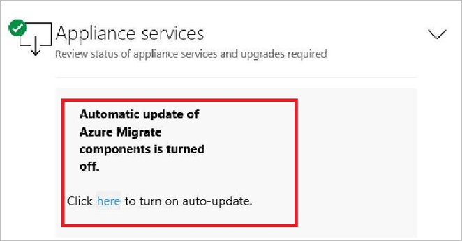
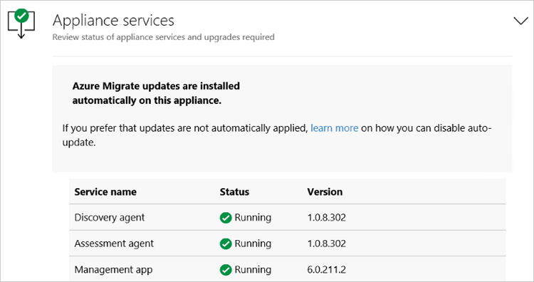

# Azure Migrate appliance

This article summarizes the prerequisites and support requirements for the Azure Migrate appliance. 

## Deployment scenarios

The Azure Migrate appliance is used in the following scenarios.

**Scenario** | **Tool** | **Used for** 
--- | --- | ---
**VMware VM assessment** | Azure Migrate:Server Assessment | Discover VMware VMs<br/><br/> Discover machine apps and dependencies<br/><br/> Collect machine metadata and performance metadata for assessments.
**VMware VM agentless migration** | Azure Migrate:Server Migration | Discover VMware VMs <br/><br/> Replicate VMware VMs with agentless migration.
**Hyper-V VM assessment** | Azure Migrate:Server Assessment | Discover Hyper-V VMs<br/><br/> Collect machine metadata and performance metadata for assessments.
**Physical machine assessment** |  Azure Migrate:Server Assessment |  Discover physical servers (or VMs you treat as physical servers).<br/><br/> Collect machine metadata and performance metadata for assessments.

## Deployment methods

The appliance can be deployed using a couple of methods:

- The appliance can be deployed using a template for VMware VMs and Hyper-V VMs (OVA template for VMware or VHD for Hyper-V).
- If you don't want to use a template, you can deploy the appliance for VMware or Hyper-V using a PowerShell script.
- In Azure Government, you should deploy the appliance using a script.
- For physical servers, you always deploy the appliance using a script.
- Download links are available in the tables below.


## Appliance - VMware 

The following table summarizes the Azure Migrate appliance requirements for VMware.

**Requirement** | **VMware** 
--- | ---
**Permissions** | To access the appliance web app locally or remotely, you need to be a domain admin, or local admin on the appliance machine.
**Appliance components** | The appliance has the following components:<br/><br/> - **Management app**: This is a web app for user input during appliance deployment. Used when assessing machines for migration to Azure.<br/> - **Discovery agent**: The agent gathers machine configuration data. Used when assessing machines for migration to Azure.<br/>- **Assessment agent**: The agent collects performance data. Used when assessing machines for migration to Azure.<br/>- **Auto update service**: Updates appliance components (runs every 24 hours).<br/>- **DRA agent**: Orchestrates VM replication, and coordinates communication between replicated machines and Azure. Used only when replicating VMware VMs to Azure using agentless migration.<br/>- **Gateway**: Sends replicated data to Azure. Used only when replicating VMware VMs to Azure using agentless migration.
**Supported deployment** | Deploy as VMware VM using OVA template.<br/><br/> Deploy as a VMware VM or physical machine using PowerShell installation script.
**Project support** |  An appliance can be associated with a single project. <br/> Any number of appliances can be associated with a single project.<br/> 
**Discovery limits** | An appliance can discover up to 10,000 VMware VMs on a vCenter Server.<br/> An appliance can connect to a single vCenter Server.
**OVA template** | Download from portal or from https://aka.ms/migrate/appliance/vmware.<br/><br/> Download size is 11.2 GB.<br/><br/> The downloaded appliance template comes with a Windows Server 2016 evaluation license, which is valid for 180 days. If the evaluation period is close to expiry, we recommend that you download and deploy a new appliance, or that you activate the operating system license of the appliance VM.
**PowerShell script** | Script [download](https://go.microsoft.com/fwlink/?linkid=2105112).<br/><br/> 
**Software/hardware** |  The appliance should run on machine with Windows Server 2016, 32-GB RAM, 8 vCPUs, around 80 GB of disk storage, and an external virtual switch.<br/> The appliance requires internet access, either directly or through a proxy.<br/><br/> If you run the appliance on a VMware VM, you need enough resources on the vCenter Server to allocate a VM that meets the requirements.<br/><br/> If you run the appliance on a physical machine, make sure that it's running Windows Server 2016, and meets hardware requirements.
**VMware requirements** | If you deploy the appliance as a VMware VM, it  must be deployed on an ESXi host running version 5.5 or later.<br/><br/> vCenter Server running 5.5, 6.0, 6.5, or 6.7.
**VDDK (agentless migration)** | If you deploy the appliance as a VMware VM, and you're running an agentless migration, the VMware vSphere VDDK must be installed on the appliance VM.
**Hash value-OVA** | [Verify](tutorial-assess-vmware.md#verify-security) the OVA template hash values.
**Hash value-PowerShell script** | [Verify](deploy-appliance-script.md#verify-file-security) the PowerShell script hash values.


## Appliance - Hyper-V

**Requirement** | **Hyper-V** 
--- | ---
**Permissions** | To access the appliance web app locally or remotely, you need to be a domain admin, or local admin on the appliance machine.
**Appliance components** | The appliance has the following components:<br/><br/>- **Management app**: This is a web app for user input during appliance deployment. Used when assessing machines for migration to Azure.<br/> - **Discovery agent**: The agent gathers machine configuration data. Used when assessing machines for migration to Azure.<br/>- **Assessment agent**: The agent collects performance data. Used when assessing machines for migration to Azure.<br/>- **Auto update service**: Updates appliance components (runs every 24 hours).
**Supported deployment** | Deploy as Hyper-V VM using a VHD template.<br/><br/> Deploy as a Hyper-V VM or physical machine using a PowerShell installation script.
**Project support** |  An appliance can be associated with a single project. <br/> Any number of appliances can be associated with a single project.<br/> 
**Discovery limits** | An appliance can discover up to 5000 Hyper-V VMs.<br/> An appliance can connect to up to 300 Hyper-V hosts.
**VHD template** | Zipped folder including VHD. Download from portal or from https://aka.ms/migrate/appliance/hyperv.<br/><br/> Download size is 10 GB.<br/><br/> The downloaded appliance template comes with a Windows Server 2016 evaluation license, which is valid for 180 days. If the evaluation period is close to expiry, we recommend that you download and deploy a new appliance, or that you activate the operating system license of the appliance VM.
**PowerShell script** | Script [download](https://go.microsoft.com/fwlink/?linkid=2105112).<br/><br/> 
**Software/hardware***   |  The appliance should run on machine with Windows Server 2016, 32-GB RAM, 8 vCPUs, around 80 GB of disk storage, and an external virtual switch.<br/> The appliance needs a static or dynamic IP address, and requires internet access, either directly or through a proxy.<br/><br/> If you run the appliance as a Hyper-V VM, you need enough resources on the Hyper-V host to allocate 16-GB RAM, 8 vCPUs, around 80 GB of storage space, and an external switch for the appliance VM.<br/><br/> If you run the appliance on a physical machine, make sure that it's running Windows Server 2016, and meets hardware requirements. 
**Hyper-V requirements** | If you deploy the appliance with the VHD template, the appliance VM provided by Azure Migrate is Hyper-V VM version 5.0.<br/><br/> The Hyper-V host must be running Windows Server 2012 R2 or later. 
**Hash value-VHD** | [Verify](tutorial-assess-hyper-v.md#verify-security) the VHD template hash values.
**Hash value-PowerShell script** | [Verify](deploy-appliance-script.md#verify-file-security) the PowerShell script hash values.


## Appliance - Physical

**Requirement** | **Physical** 
--- | ---
**Permissions** | To access the appliance web app locally or remotely, you need to be a domain admin, or local admin on the appliance machine.
**Appliance components** | The appliance has the following components: <br/><br/> - **Management app**: This is a web app for user input during appliance deployment. Used when assessing machines for migration to Azure.<br/> - **Discovery agent**: The agent gathers machine configuration data. Used when assessing machines for migration to Azure.<br/>- **Assessment agent**: The agent collects performance data. Used when assessing machines for migration to Azure.<br/>- **Auto update service**: Updates appliance components (runs every 24 hours).
**Supported deployment** | Deploy as a dedicated physical machine, or a VM, using a PowerShell installation script. The script is available for download from the portal.
**Project support** |  An appliance can be associated with a single project. <br/> Any number of appliances can be associated with a single project.<br/> 
**Discovery limits** | An appliance can discover up to 250 physical servers.
**PowerShell script** | Download the script (AzureMigrateInstaller.ps1) in a zipped folder from the portal. [Learn more](tutorial-assess-physical.md#set-up-the-appliance). Alternatively, [download directly](https://go.microsoft.com/fwlink/?linkid=2105112).<br/><br/> Download size is 59.7 MB.
**Software/hardware** |  The appliance should run on machine with Windows Server 2016, 32-GB RAM, 8 vCPUs, around 80 GB of disk storage, and an external virtual switch.<br/> The appliance needs a static or dynamic IP address, and requires internet access, either directly or through a proxy.<br/><br/> If you run the appliance on a physical machine, make sure that it's running Windows Server 2016, and meets hardware requirements.<br/> Running the appliance on a machine with Windows Server 2019 isn't supported.
**Hash value** | [Verify](deploy-appliance-script.md#verify-file-security) the PowerShell script hash values.

## URL access

The Azure Migrate appliance needs connectivity to the internet.

- When you deploy the appliance, Azure Migrate does a connectivity check to the required URLs.
- You need to allow access to all URLs in the list. If you're doing assessment only, you can skip the URLs that are marked as required for VMware agentless migration only.
-  If you're using a URL-based proxy to connect to the internet, make sure that the proxy resolves any CNAME records received while looking up the URLs.

### Public cloud URLs

**URL** | **Details**  
--- | --- |
*.portal.azure.com  | Navigate to the Azure portal.
*.windows.net <br/> *.msftauth.net <br/> *.msauth.net <br/> *.microsoft.com <br/> *.live.com | Sign in to your Azure subscription.
*.microsoftonline.com <br/> *.microsoftonline-p.com | Create Azure Active Directory (AD) apps for the appliance to communicate with Azure Migrate.
management.azure.com | Create Azure AD apps for the appliance to communicate with the Azure Migrate service.
*.services.visualstudio.com | Upload app logs used for internal monitoring.
*.vault.azure.net | Manage secrets in the Azure Key Vault. Note: Ensure machines to replicate have access to this.
aka.ms/* | Allow access to aka links. Used for Azure Migrate appliance updates.
download.microsoft.com/download | Allow downloads from Microsoft download.
*.servicebus.windows.net | Communication between the appliance and the Azure Migrate service.
*.discoverysrv.windowsazure.com <br/> *.migration.windowsazure.com | Connect to Azure Migrate service URLs.
*.hypervrecoverymanager.windowsazure.com | **Used for VMware agentless migration**<br/><br/> Connect to Azure Migrate service URLs.
*.blob.core.windows.net |  **Used for VMware agentless migration**<br/><br/>Upload data to storage for migration.

### Government cloud URLs

**URL** | **Details**  
--- | --- |
*.portal.azure.us  | Navigate to the Azure portal.
graph.windows.net | Sign in to your Azure subscription.
login.microsoftonline.us  | Create Azure Active Directory (AD) apps for the appliance to communicate with Azure Migrate.
management.usgovcloudapi.net | Create Azure AD apps for the appliance to communicate with the Azure Migrate service.
dc.services.visualstudio.com | Upload app logs used for internal monitoring.
*.vault.usgovcloudapi.net | Manage secrets in the Azure Key Vault.
aka.ms/* | Allow access to aka links. Used for Azure Migrate appliance updates.
download.microsoft.com/download | Allow downloads from Microsoft download.
*.servicebus.usgovcloudapi.net  | Communication between the appliance and the Azure Migrate service.
*.discoverysrv.windowsazure.us <br/> *.migration.windowsazure.us | Connect to Azure Migrate service URLs.
*.hypervrecoverymanager.windowsazure.us | **Used for VMware agentless migration**<br/><br/> Connect to Azure Migrate service URLs.
*.blob.core.usgovcloudapi.net  |  **Used for VMware agentless migration**<br/><br/>Upload data to storage for migration.
*.applicationinsights.us | Upload app logs used for internal monitoring.


## Collected data - VMware

The appliance collects metadata, performance data, and dependency analysis data (if agentless [dependency analysis](concepts-dependency-visualization.md) is used).

### Metadata

Metadata discovered by the Azure Migrate appliance helps you to figure out whether machines and apps are ready for migration to Azure, right-size machines and apps, plans costs, and analyze application dependencies. Microsoft doesn't use this data in any license compliance audit.

Here's the full list of VMware VM metadata that the appliance collects and sends to Azure.

**DATA** | **COUNTER**
--- | --- 
**Machine details** | 
VM ID | vm.Config.InstanceUuid 
VM name | vm.Config.Name
vCenter Server ID | VMwareClient.Instance.Uuid
VM description | vm.Summary.Config.Annotation
License product name | vm.Client.ServiceContent.About.LicenseProductName
Operating system type | vm.SummaryConfig.GuestFullName
Boot type | vm.Config.Firmware
Number of cores | vm.Config.Hardware.NumCPU
Memory (MB) | vm.Config.Hardware.MemoryMB
Number of disks | vm.Config.Hardware.Device.ToList().FindAll(x => is VirtualDisk).count
Disk size list | vm.Config.Hardware.Device.ToList().FindAll(x => is VirtualDisk)
Network adapters list | vm.Config.Hardware.Device.ToList().FindAll(x => is VirtualEthernet).count
CPU utilization | cpu.usage.average
Memory utilization |mem.usage.average
**Per disk details** | 
Disk key value | disk.Key
Dikunit number | disk.UnitNumber
Disk controller key value | disk.ControllerKey.Value
Gigabytes provisioned | virtualDisk.DeviceInfo.Summary
Disk name | Value generated using disk.UnitNumber, disk.Key, disk.ControllerKey.VAlue
Read operations per second | virtualDisk.numberReadAveraged.average
Write operations per second | virtualDisk.numberWriteAveraged.average
Read throughput (MB per second) | virtualDisk.read.average
Write throughput (MB per second) | virtualDisk.write.average
**Per NIC details** | 
Network adapter name | nic.Key
MAC address | ((VirtualEthernetCard)nic).MacAddress
IPv4 addresses | vm.Guest.Net
IPv6 addresses | vm.Guest.Net
Read throughput (MB per second) | net.received.average
Write throughput (MB per second) | net.transmitted.average
**Inventory path details** | 
Name | container.GetType().Name
Type of child object | container.ChildType
Reference details | container.MoRef
Parent details | Container.Parent
Folder details per VM | ((Folder)container).ChildEntity.Type
Datacenter details per VM | ((Datacenter)container).VmFolder
Datacenter details per host folder | ((Datacenter)container).HostFolder
Cluster details per host | ((ClusterComputeResource)container).Host
Host details per VM | ((HostSystem)container).VM

### Performance data


Here's the VMware VM performance data that the appliance collects and sends to Azure.

**Data** | **Counter** | **Assessment impact**
--- | --- | ---
CPU utilization | cpu.usage.average | Recommended VM size/cost
Memory utilization | mem.usage.average | Recommended VM size/cost
Disk read throughput (MB per second) | virtualDisk.read.average | Calculation for disk size, storage cost, VM size
Disk writes throughput (MB per second) | virtualDisk.write.average | Calculation for disk size, storage cost, VM size
Disk read operations per second | virtualDisk.numberReadAveraged.average | Calculation for disk size, storage cost, VM size
Disk writes operations per second | virtualDisk.numberWriteAveraged.average  | Calculation for disk size, storage cost, VM size
NIC read throughput (MB per second) | net.received.average | Calculation for VM size
NIC writes throughput (MB per second) | net.transmitted.average  |Calculation for VM size


### Installed apps metadata

Application discovery collects installed applications and operating system data.

#### Windows VM apps data

Here's the installed application data that the appliance collects from each VM enabled for application discovery. This data is sent to Azure.

**Data** | **Registry Location** | **Key**
--- | --- | ---
Application Name  | HKLM:\Software\Microsoft\Windows\CurrentVersion\Uninstall\* <br/> HKLM:\Software\Wow6432Node\Microsoft\Windows\CurrentVersion\Uninstall\*  | DisplayName
Version  | HKLM:\Software\Microsoft\Windows\CurrentVersion\Uninstall\*  <br/> HKLM:\Software\Wow6432Node\Microsoft\Windows\CurrentVersion\Uninstall\*  | DisplayVersion 
Provider  | HKLM:\Software\Microsoft\Windows\CurrentVersion\Uninstall\*  <br/> HKLM:\Software\Wow6432Node\Microsoft\Windows\CurrentVersion\Uninstall\*  | Publisher

#### Windows VM features data

Here's the features data that the appliance collects from each VM enabled for application discovery. This data is sent to Azure.

**Data**  | **PowerShell cmdlet** | **Property**
--- | --- | ---
Name  | Get-WindowsFeature  | Name
Feature Type | Get-WindowsFeature  | FeatureType
Parent  | Get-WindowsFeature  | Parent

#### Windows VM SQL Server metadata

Here's the SQL server metadata that the appliance collects from VMs running Microsoft SQL server enabled for application discovery. This data is sent to Azure.

**Data**  | **Registry Location**  | **Key**
--- | --- | ---
Name  | HKLM:\SOFTWARE\Microsoft\Microsoft SQL Server\Instance Names\SQL  | installedInstance
Edition  | HKLM:\SOFTWARE\Microsoft\Microsoft SQL Server\\\<InstanceName>\Setup  | Edition 
Service Pack  | HKLM:\SOFTWARE\Microsoft\Microsoft SQL Server\\\<InstanceName>\Setup  | SP
Version  | HKLM:\SOFTWARE\Microsoft\Microsoft SQL Server\\\<InstanceName>\Setup  | Version 

#### Windows VM operating system data

Here's the operating system data that the appliance collects each VM enabled for application discovery. This data is sent to Azure.

Data  | WMI class  | WMI Class Property
--- | --- | ---
Name  | Win32_operatingsystem  | Caption
Version  | Win32_operatingsystem  | Version
Architecture  | Win32_operatingsystem  | OSArchitecture

#### Linux VM apps data

Here's the installed application data that the appliance collects from each VM enabled for application discovery. Based on the operating system of the VM, one or more of the commands are run . This data is sent to Azure.

Data  | Command
--- | --- 
Name | rpm, dpkg-query, snap
Version | rpm, dpkg-query, snap
Provider | rpm, dpkg-query, snap

#### Linux VM operating system data

Here's the operating system data that the appliance collects each VM enabled for application discovery. This data is sent to Azure.

**Data**  | **Command** 
--- | --- | ---
Name <br/> version | Gathered from one or more of the following files:<br/> <br/>/etc/os-release  <br> /usr/lib/os-release  <br> /etc/enterprise-release  <br> /etc/redhat-release  <br> /etc/oracle-release  <br> /etc/SuSE-release  <br> /etc/lsb-release  <br> /etc/debian_version 
Architecture | uname


### App dependencies metadata

Agentless dependency analysis collects connection and process data.

#### Windows VM app dependencies data

Here's the connection data that the appliance collects from each VM enabled for agentless dependency analysis. This data is sent to Azure.

**Data** | **Command used** 
--- | --- 
Local port | netstat
Local IP address | netstat
Remote port | netstat
Remote IP address | netstat
TCP connection state | netstat
Process ID | netstat
Number of active connections | netstat


Here's the process data that the appliance collects from each VM enabled for agentless dependency analysis. This data is sent to Azure.

**Data** | **WMI class** | **WMI class property**
--- | --- | ---
Process name | Win32_Process | ExecutablePath
Process arguments | Win32_Process | CommandLine
Application name | Win32_Process | VersionInfo.ProductName parameter of ExecutablePath property

#### Linux VM app dependencies data

Here's the connection and process data that the appliance collects from each Linux VM enabled for agentless dependency analysis. This data is sent to Azure.

**Data** | **Command used** 
--- | ---
Local port | netstat 
Local IP address | netstat 
Remote port | netstat 
Remote IP address | netstat 
TCP connection state | netstat 
Number of active connections | netstat
Process ID  | netstat 
Process name | ps
Process arguments | ps
Application name | dpkg or rpm


## Collected data - Hyper-V

The appliance collects metadata, performance data, and dependency analysis data (if agentless [dependency analysis](concepts-dependency-visualization.md) is used).

### Metadata
Metadata discovered by the Azure Migrate appliance helps you to figure out whether machines and apps are ready for migration to Azure, right-size machines and apps, plans costs, and analyze application dependencies. Microsoft doesn't use this data in any license compliance audit.

Here's the full list of Hyper-V VM metadata that the appliance collects and sends to Azure.

**DATA** | **WMI CLASS** | **WMI CLASS PROPERTY**
--- | --- | ---
**Machine details** | 
Serial number of BIOS _ Msvm_BIOSElement | BIOSSerialNumber
VM type (Gen 1 or 2) | Msvm_VirtualSystemSettingData | VirtualSystemSubType
VM display name | Msvm_VirtualSystemSettingData | ElementName
VM version | Msvm_ProcessorSettingData | VirtualQuantity
Memory (bytes) | Msvm_MemorySettingData | VirtualQuantity
Maximum memory that can be consumed by VM | Msvm_MemorySettingData | Limit
Dynamic memory enabled | Msvm_MemorySettingData | DynamicMemoryEnabled
Operating system name/version/FQDN | Msvm_KvpExchangeComponent | GuestIntrinsicExchangeItems Name Data
VM power status | Msvm_ComputerSystem | EnabledState
**Per disk details** | 
Disk identifier | Msvm_VirtualHardDiskSettingData | VirtualDiskId
Virtual hard disk type | Msvm_VirtualHardDiskSettingData | Type
Virtual hard disk size | Msvm_VirtualHardDiskSettingData | MaxInternalSize
Virtual hard disk parent | Msvm_VirtualHardDiskSettingData | ParentPath
**Per NIC details** | 
IP addresses (synthetic NICs) | Msvm_GuestNetworkAdapterConfiguration | IPAddresses
DHCP enabled (synthetic NICs) | Msvm_GuestNetworkAdapterConfiguration | DHCPEnabled
NIC ID (synthetic NICs) | Msvm_SyntheticEthernetPortSettingData | InstanceID
NIC MAC address (synthetic NICs) | Msvm_SyntheticEthernetPortSettingData | Address
NIC ID (legacy NICs) | MsvmEmulatedEthernetPortSetting Data | InstanceID
NIC MAC ID (legacy NICs) | MsvmEmulatedEthernetPortSetting Data | Address

### Performance data

Here's the Hyper VM performance data that the appliance collects and sends to Azure.

**Performance counter class** | **Counter** | **Assessment impact**
--- | --- | ---
Hyper-V Hypervisor Virtual Processor | % Guest Run Time | Recommended VM size/cost
Hyper-V Dynamic Memory VM | Current Pressure (%)<br/> Guest Visible Physical Memory (MB) | Recommended VM size/cost
Hyper-V Virtual Storage Device | Read Bytes/Second | Calculation for disk size, storage cost, VM size
Hyper-V Virtual Storage Device | Write Bytes/Second | Calculation for disk size, storage cost, VM size
Hyper-V Virtual Network Adapter | Bytes Received/Second | Calculation for VM size
Hyper-V Virtual Network Adapter | Bytes Sent/Second | Calculation for VM size

- CPU utilization is the sum of all usage, for all virtual processors attached to a VM.
- Memory utilization is (Current Pressure * Guest Visible Physical Memory) / 100.
- Disk and network utilization values are collected from the listed Hyper-V performance counters.


## Collected data - Physical

The appliance collects metadata, performance data, and dependency analysis data (if agentless [dependency analysis](concepts-dependency-visualization.md) is used).

### Windows metadata

Metadata discovered by the Azure Migrate appliance helps you to figure out whether machines and apps are ready for migration to Azure, right-size machines and apps, plans costs, and analyze application dependencies. Microsoft doesn't use this data in any license compliance audit.

Here's the full list of Windows server metadata that the appliance collects and sends to Azure.

**DATA** | **WMI CLASS** | **WMI CLASS PROPERTY**
--- | --- | ---
FQDN | Win32_ComputerSystem | Domain, Name, PartOfDomain
Processor core count | Win32_PRocessor | NumberOfCores
Memory allocated | Win32_ComputerSystem | TotalPhysicalMemory
BIOS serial number | Win32_ComputerSystemProduct | IdentifyingNumber
BIOS GUID | Win32_ComputerSystemProduct | UUID
Boot type | Win32_DiskPartition | Check for partition with Type = **GPT:System** for EFI/BIOS
OS name | Win32_OperatingSystem | Caption
OS version |Win32_OperatingSystem | Version
OS architecture | Win32_OperatingSystem | OSArchitecture
Disk count | Win32_DiskDrive | Model, Size, DeviceID, MediaType, Name
Disk size | Win32_DiskDrive | Size
NIC list | Win32_NetworkAdapterConfiguration | Description, Index
NIC IP address | Win32_NetworkAdapterConfiguration | IPAddress
NIC MAC address | Win32_NetworkAdapterConfiguration | MACAddress

### Linux metadata

Here's the full list of Linux server metadata that the appliance collects and sends to Azure.

**DATA** | **LINUX** 
--- | --- 
FQDN | cat /proc/sys/kernel/hostname, hostname -f
Processor core count |  /proc/cpuinfo \| awk '/^processor/{print $3}' \| wc -l
Memory allocated | cat /proc/meminfo \| grep MemTotal \| awk '{printf "%.0f", $2/1024}'
BIOS serial number | lshw \| grep "serial:" \| head -n1 \| awk '{print $2}' <br/> /usr/sbin/dmidecode -t 1 \| grep 'Serial' \| awk '{ $1="" ; $2=""; print}'
BIOS GUID | cat /sys/class/dmi/id/product_uuid
Boot type | [ -d /sys/firmware/efi ] && echo EFI \|\| echo BIOS
OS name/version | We access these files for the OS version and name:<br/><br/> /etc/os-release<br/> /usr/lib/os-release <br/> /etc/enterprise-release <br/> /etc/redhat-release<br/> /etc/oracle-release<br/>  /etc/SuSE-release<br/>  /etc/lsb-release  <br/> /etc/debian_version
OS architecture | Uname -m
Disk count | fdisk -l \| egrep 'Disk.*bytes' \| awk '{print $2}' \| cut -f1 -d ':'
Boot disk | df /boot \| sed -n 2p \| awk '{print $1}'
Disk size | fdisk -l \| egrep 'Disk.*bytes' \| egrep $disk: \| awk '{print $5}'
NIC list | ip -o -4 addr show \| awk '{print $2}'
NIC IP address | ip addr show $nic \| grep inet \| awk '{print $2}' \| cut -f1 -d "/" 
NIC MAC address | ip addr show $nic \| grep ether  \| awk '{print $2}'

### Windows performance data

Here's the Windows server performance data that the appliance collects and sends to Azure.

**Data** | **WMI class** | **WMI class property**
--- | --- | ---
CPU usage | Win32_PerfFormattedData_PerfOS_Processor | PercentIdleTime
Memory usage | Win32_PerfFormattedData_PerfOS_Memory | AvailableMBytes
NIC count | Win32_PerfFormattedData_Tcpip_NetworkInterface | Get the network device count.
Data received per NIC | Win32_PerfFormattedData_Tcpip_NetworkInterface  | BytesReceivedPerSec
Data transmitted per NIC | BWin32_PerfFormattedData_Tcpip_NetworkInterface | BytesSentPersec
Disk count | BWin32_PerfFormattedData_PerfDisk_PhysicalDisk | Count of disks
Disk details | Win32_PerfFormattedData_PerfDisk_PhysicalDisk | DiskWritesPerSec, DiskWriteBytesPerSec, DiskReadsPerSec, DiskReadBytesPerSec.

### Linux performance data

Here's the Linux server performance data that the appliance collects and sends to Azure.

**Data** | **Linux** 
--- | --- 
CPU usage | cat /proc/stat/| grep 'cpu' /proc/stat
Memory usage | free \| grep Mem \| awk '{print $3/$2 * 100.0}'
NIC count | lshw -class network \| grep eth[0-60] \| wc -l
Data received per NIC | cat /sys/class/net/eth$nic/statistics/rx_bytes
Data transmitted per NIC | cat /sys/class/net/eth$nic/statistics/tx_bytes
Disk count | fdisk -l \| egrep 'Disk.*bytes' \| awk '{print $2}' \| cut -f1 -d ':'
Disk details | cat /proc/diskstats


## Appliance upgrades

The appliance is upgraded as the Azure Migrate agents running on the appliance are updated. This happens automatically, because auto-update is enabled on the appliance by default. You can change this default setting, to update the appliance services manually.

### Turn off auto-update

1. On the machine running the appliance, open the Registry Editor.
2. Navigate to **HKEY_LOCAL_MACHINE\SOFTWARE\Microsoft\AzureAppliance**.
3. To turn off auto-update, create a registry key **AutoUpdate** key with DWORD value of 0.

    


### Turn on auto-update

You can turn on auto-update using either of these methods:

- By deleting the AutoUpdate registry key from HKEY_LOCAL_MACHINE\SOFTWARE\Microsoft\AzureAppliance.
- After discovery is complete, in the Appliance Configuration Manager.

To delete the registry key:

1. On the machine running the appliance, open the Registry Editor.
2. Navigate to **HKEY_LOCAL_MACHINE\SOFTWARE\Microsoft\AzureAppliance**.
3. Delete the registry key **AutoUpdate**, that was previously created to turn off auto-update.

To turn on from Appliance Configuration Manager, after discovery is complete:

1. On the appliance machine, open the Appliance Configuration Manager.
2. In **Appliance services** > **Automatic update of Azure Migrate components is turned off**, click to turn on auto-update.

    

### Check the appliance services version

You can check the appliance services version using either of these methods:

- In Appliance Configuration Manager, after discovery is complete.
- On the appliance machine, in the **Control Panel** > **Programs and Features**.

To check in the Appliance Configuration Manager:

1. After discovery is complete, open Appliance Configuration Manager (in the appliance web app).
2. In **Appliance services**, verify the appliance services versions.

    

To check in the Control Panel:

1. On the appliance, click **Start** > **Control Panel** > **Programs and Features**
2. Check the appliance services versions in the list.

    

### Manually update an older version

If you are running an older version for any of the components, you must uninstall the service, and manually update to the latest version.

1. To check for the latest appliance service versions, [download](https://aka.ms/latestapplianceservices) the LatestComponents.json file.
2.    After downloading, open the LatestComponents.json file in Notepad.
3. Find the latest service version in the file, and the download link for it. For example:

    "Name": "ASRMigrationWebApp", "DownloadLink": "https://download.microsoft.com/download/f/3/4/f34b2eb9-cc8d-4978-9ffb-17321ad9b7ed/MicrosoftAzureApplianceConfigurationManager.msi", "Version": "6.0.211.2", "Md5Hash": "e00a742acc35e78a64a6a81e75469b84"

4.    Download the latest version of an outdated service, using the download link in the file.
5. After downloading, run the following command in an administrator command window, to verify the integrity of the downloaded MSI.

    ``` C:\>Get-FileHash -Path <file_location> -Algorithm [Hashing Algorithm] ```
    For example:
    C:\>CertUtil -HashFile C:\Users\public\downloads\MicrosoftAzureApplianceConfigurationManager.MSI MD5

5. Check that the command output matches the hash value entry for the service in the file (for example, the MD5 hash value above).
6. Now, run the MSI to install the service. It's a silent install, and the installation window closes after it's done.
7. After installation is complete, check the version of the service in **Control panel** > **Programs and Features**. The service version should now be upgraded to the latest shown in the json file.


## Next steps

- [Learn how](how-to-set-up-appliance-vmware.md) to set up the appliance for VMware.
- [Learn how](how-to-set-up-appliance-hyper-v.md) to set up the appliance for Hyper-V.
- [Learn how](how-to-set-up-appliance-physical.md) to set up the appliance for physical servers.

