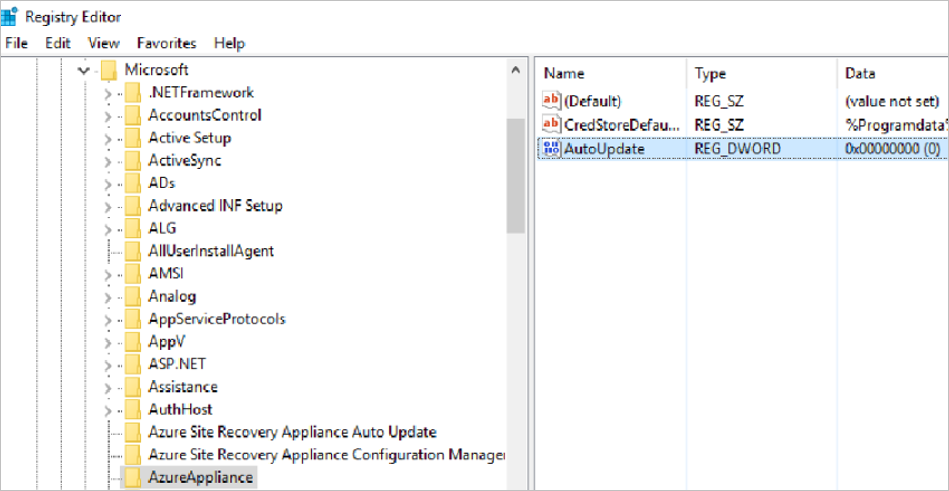
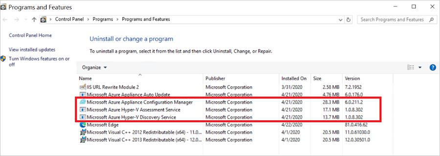

 
# Azure Migrate appliance

This article summarizes the prerequisites and support requirements for the Azure Migrate appliance.

## Deployment scenarios

The Azure Migrate appliance is used in the following scenarios.

**Scenario** | **Tool** | **Used to**
--- | --- | ---
**Discovery and assessment of servers running in VMware environment** | Azure Migrate: Discovery and assessment | Discover servers running in your VMware environment   Perform discovery of installed software inventory, ASP.NET web apps, SQL Server instances and databases, and agentless dependency analysis.   Collect server configuration and performance metadata for assessments.
**Agentless migration of servers running in VMware environment** | Migration and modernization | Discover servers running in your VMware environment.    Replicate servers without installing any agents on them.
**Discovery and assessment of servers running in Hyper-V environment** | Azure Migrate: Discovery and assessment | Discover servers running in your Hyper-V environment.   Perform discovery of installed software inventory, SQL Server instances and databases, and agentless dependency analysis.   Collect server configuration and performance metadata for assessments.
**Discovery and assessment of physical or virtualized servers on-premises** |  Azure Migrate: Discovery and assessment |  Discover physical or virtualized servers on-premises.   Perform discovery of installed software inventory, ASP.NET web apps, SQL Server instances and databases, and agentless dependency analysis.   Collect server configuration and performance metadata for assessments.

## Deployment methods

The appliance can be deployed using a couple of methods:

- The appliance can be deployed using a template for servers running in VMware or Hyper-V environment ([OVA template for VMware](how-to-set-up-appliance-vmware.md) or [VHD for Hyper-V](how-to-set-up-appliance-hyper-v.md)).
- If you don't want to use a template, you can deploy the appliance for VMware or Hyper-V environment using a [PowerShell installer script](deploy-appliance-script.md).
- In Azure Government, you should deploy the appliance using a PowerShell installer script. Refer to the steps of deployment [here](deploy-appliance-script-government.md).
- For physical or virtualized servers on-premises or any other cloud, you always deploy the appliance using a PowerShell installer script.Refer to the steps of deployment [here](how-to-set-up-appliance-physical.md).
- Download links are available in the tables below.

> [!Note]
> Don't install any other components, such as the **Microsoft Monitoring Agent (MMA)** or **Replication appliance**, on the same server hosting the Azure Migrate appliance. If you install the MMA agent, you can face problems like **"Multiple custom attributes of the same type found"**. It's recommended to have a dedicated server to deploy the appliance.

## Appliance services

The appliance has the following services:

- **Appliance configuration manager**: This is a web application, which can be configured with source details to start the discovery and assessment of servers.
- **Discovery agent**: The agent collects server configuration metadata, which can be used to create as on-premises assessments.
- **Assessment agent**: The agent collects server performance metadata, which can be used to create performance-based assessments.
- **Auto update service**: The service keeps all the agents running on the appliance up-to-date. It automatically runs once every 24 hours.
- **SQL discovery and assessment agent**: sends the configuration and performance metadata of SQL Server instances and databases to Azure.
- **DRA agent**: Orchestrates server replication, and coordinates communication between replicated servers and Azure. Used only when replicating servers to Azure using agentless migration.
- **Gateway**: Sends replicated data to Azure. Used only when replicating servers to Azure using agentless migration.
- **Web apps discovery and assessment agent**: sends the web apps configuration data to Azure.

> [!Note]
> The last 3 services are available in the appliance used for discovery and assessment of servers running in your VMware VMs, Hyper-V VMs, bare-metal servers, and servers running on other public clouds like AWS, GCP etc.

## Appliance - VMware

The following table summarizes the Azure Migrate appliance requirements for VMware.

**Requirement** | **VMware**
--- | ---
**Permissions** | To access the appliance configuration manager locally or remotely, you need to have a local or domain user account with administrative privileges on the appliance server.
**Appliance services** | The appliance has the following services:   - **Appliance configuration manager**: This is a web application that can be configured with source details to start the discovery and assessment of servers.  - **VMware discovery agent**: The agent collects server configuration metadata that can be used to create as on-premises assessments. - **VMware assessment agent**: The agent collects server performance metadata that can be used to create performance-based assessments. - **Auto update service**: The service keeps all the agents running on the appliance up to date. It automatically runs once every 24 hours. - **DRA agent**: Orchestrates server replication, and coordinates communication between replicated servers and Azure. Used only when replicating servers to Azure using agentless migration. - **Gateway**: Sends replicated data to Azure. Used only when replicating servers to Azure using agentless migration. - **SQL discovery and assessment agent**: sends the configuration and performance metadata of SQL Server instances and databases to Azure. - **Web apps discovery and assessment agent**: sends the web apps configuration data to Azure.
**Project limits** |  An appliance can only be registered with a single project.  A single project can have multiple registered appliances.
**Discovery limits** | An appliance can discover up to 10,000 severs running across multiple vCenter Servers. A single appliance can connect to up to 10 vCenter Servers.
**Supported deployment** | Deploy as new server running on vCenter Server using OVA template.   Deploy on an existing server running Windows Server 2022 using PowerShell installer script.
**OVA template** | Download from project or from [here](https://go.microsoft.com/fwlink/?linkid=2140333)   Download size is 11.9 GB.   The downloaded appliance template comes with a Windows Server 2022 evaluation license, which is valid for 180 days. If the evaluation period is close to expiry, we recommend that you download and deploy a new appliance using OVA template, or you activate the operating system license of the appliance server.
**OVA verification** | [Verify](tutorial-discover-vmware.md#verify-security) the OVA template downloaded from project by checking the hash values.
**PowerShell script** | Refer to this [article](./deploy-appliance-script.md#set-up-the-appliance-for-vmware) on how to deploy an appliance using the PowerShell installer script.   
**Hardware and network requirements** |  The appliance should run on server with Windows Server 2022, 32-GB RAM, 8 vCPUs, around 80 GB of disk storage, and an external virtual switch.  The appliance requires internet access, either directly or through a proxy.   If you deploy the appliance using OVA template, you need enough resources on the vCenter Server to create a server that meets the hardware requirements.   If you run the appliance on an existing server, make sure that it is running Windows Server 2022, and meets hardware requirements. _(Currently the deployment of appliance is only supported on Windows Server 2022.)_
**VMware requirements** | If you deploy the appliance as a server on vCenter Server, it  must be deployed on a vCenter Server running 5.5, 6.0, 6.5, 6.7 or 7.0 and an ESXi host running version 5.5 or later.   
**VDDK (agentless migration)** | To use the appliance for agentless migration of servers, the VMware vSphere VDDK must be installed on the appliance server.

## Appliance - Hyper-V

**Requirement** | **Hyper-V**
--- | ---
**Permissions** | To access the appliance configuration manager locally or remotely, you need to have a local or domain user account with administrative privileges on the appliance server.
**Appliance services** | The appliance has the following services:   - **Appliance configuration manager**: This is a web application that can be configured with source details to start the discovery and assessment of servers.  - **Discovery agent**: The agent collects server configuration metadata that can be used to create as on-premises assessments. - **Assessment agent**: The agent collects server performance metadata that can be used to create performance-based assessments. - **Auto update service**: The service keeps all the agents running on the appliance up to date. It automatically runs once every 24 hours. - **SQL discovery and assessment agent**: sends the configuration and performance metadata of SQL Server instances and databases to Azure.
**Project limits** |  An appliance can only be registered with a single project.  A single project can have multiple registered appliances.
**Discovery limits** | An appliance can discover up to 5000 servers running in Hyper-V environment.  An appliance can connect to up to 300 Hyper-V hosts.
**Supported deployment** | Deploy as server running on a Hyper-V host using a VHD template.   Deploy on an existing server running Windows Server 2022 using PowerShell installer script.
**VHD template** | Zip file that includes a VHD. Download from project or from [here](https://go.microsoft.com/fwlink/?linkid=2140422).   Download size is 8.91 GB.   The downloaded appliance template comes with a Windows Server 2022 evaluation license, which is valid for 180 days. If the evaluation period is close to expiry, we recommend that you download and deploy a new appliance, or that you activate the operating system license of the appliance server.
**VHD verification** | [Verify](tutorial-discover-hyper-v.md#verify-security) the VHD template downloaded from project by checking the hash values.
**PowerShell script** | Refer to this [article](./deploy-appliance-script.md#set-up-the-appliance-for-hyper-v) on how to deploy an appliance using the PowerShell installer script. 
**Hardware and network requirements**  |  The appliance should run on server with Windows Server 2022, 16-GB RAM, 8 vCPUs, around 80 GB of disk storage, and an external virtual switch.  The appliance needs a static or dynamic IP address, and requires internet access, either directly or through a proxy.   If you run the appliance as a server running on a Hyper-V host, you need enough resources on the host to create a server that meets the hardware requirements.   If you run the appliance on an existing server, make sure that it is running Windows Server 2022, and meets hardware requirements. _(Currently the deployment of appliance is only supported on Windows Server 2022.)_
**Hyper-V requirements** | If you deploy the appliance with the VHD template, the appliance provided by Azure Migrate is Hyper-V VM version 5.0.   The Hyper-V host must be running Windows Server 2012 R2 or later.

## Appliance - Physical

**Requirement** | **Physical**
--- | ---
**Permissions** | To access the appliance configuration manager locally or remotely, you need to have a local or domain user account with administrative privileges on the appliance server.
**Appliance services** | The appliance has the following services:   - **Appliance configuration manager**: This is a web application that can be configured with source details to start the discovery and assessment of servers.  - **Discovery agent**: The agent collects server configuration metadata that can be used to create as on-premises assessments. - **Assessment agent**: The agent collects server performance metadata that can be used to create performance-based assessments. - **Auto update service**: The service keeps all the agents running on the appliance up to date. It automatically runs once every 24 hours. - **SQL discovery and assessment agent**: sends the configuration and performance metadata of SQL Server instances and databases to Azure.
**Project limits** |  An appliance can only be registered with a single project.  A single project can have multiple registered appliances. 
**Discovery limits** | An appliance can discover up to 1000 physical servers.
**Supported deployment** | Deploy on an existing server running Windows Server 2022 using PowerShell installer script.
**PowerShell script** | Download the script (AzureMigrateInstaller.ps1) in a zip file from the project or from [here](https://go.microsoft.com/fwlink/?linkid=2140334). [Learn more](tutorial-discover-physical.md).   Download size is 85.8 MB.
**Script verification** | [Verify](tutorial-discover-physical.md#verify-security) the PowerShell installer script downloaded from project by checking the hash values.
**Hardware and network requirements** |  The appliance should run on server with Windows Server 2022, 16-GB RAM, 8 vCPUs, around 80 GB of disk storage.  The appliance needs a static or dynamic IP address, and requires internet access, either directly or through a proxy.   If you run the appliance on an existing server, make sure that it is running Windows Server 2022, and meets hardware requirements. _(Currently the deployment of appliance is only supported on Windows Server 2022.)_

## URL access

The Azure Migrate appliance needs connectivity to the internet.

- When you deploy the appliance, Azure Migrate does a connectivity check to the required URLs.
- You need to allow access to all URLs in the list. If you're doing assessment only, you can skip the URLs that are marked as required for VMware agentless migration.
- If you're using a URL-based proxy to connect to the internet, make sure that the proxy resolves any CNAME records received while looking up the URLs.

### Public cloud URLs

**URL** | **Details**  
--- | --- |
*.portal.azure.com  | Navigate to the Azure portal.
*.windows.net   *.msftauth.net   *.msauth.net   *.microsoft.com   *.live.com   *.office.com   *.microsoftonline.com   *.microsoftonline-p.com    *.microsoftazuread-sso.com | Used for access control and identity management by Azure Active Directory
management.azure.com | Used for resource deployments and management operations
*.services.visualstudio.com | Upload appliance logs used for internal monitoring.
*.vault.azure.net | Manage secrets in the Azure Key Vault.  Note: Ensure servers to replicate have access to this.
aka.ms/* | Allow access to these links; used to download and install the latest updates for appliance services.
download.microsoft.com/download | Allow downloads from Microsoft download center.
*.servicebus.windows.net | Communication between the appliance and the Azure Migrate service.
*.discoverysrv.windowsazure.com   *.migration.windowsazure.com | Connect to Azure Migrate service URLs.
*.hypervrecoverymanager.windowsazure.com | **Used for VMware agentless migration**   Connect to Azure Migrate service URLs.
*.blob.core.windows.net |  **Used for VMware agentless migration**  Upload data to storage for migration.

### Government cloud URLs

**URL** | **Details**  
--- | --- |
*.portal.azure.us  | Navigate to the Azure portal.
graph.windows.net   graph.microsoftazure.us | Sign in to your Azure subscription.
login.microsoftonline.us  | Used for access control and identity management by Azure Active Directory.
management.usgovcloudapi.net |  Used for resource deployments and management operations.
*.services.visualstudio.com | Upload appliance logs used for internal monitoring.
*.vault.usgovcloudapi.net | Manage secrets in the Azure Key Vault.
aka.ms/* | Allow access to these links; used to download and install the latest updates for appliance services.
download.microsoft.com/download | Allow downloads from Microsoft download center.
*.servicebus.usgovcloudapi.net  | Communication between the appliance and the Azure Migrate service.
*.discoverysrv.windowsazure.us   *.migration.windowsazure.us | Connect to Azure Migrate service URLs.
*.hypervrecoverymanager.windowsazure.us | **Used for VMware agentless migration**   Connect to Azure Migrate service URLs.
*.blob.core.usgovcloudapi.net  |  **Used for VMware agentless migration**  Upload data to storage for migration.
*.applicationinsights.us | Upload appliance logs used for internal monitoring.  

### Public cloud URLs for private link connectivity

The appliance needs access to the following URLs (directly or via proxy) over and above private link access.

**URL** | **Details**  
--- | --- |
*.portal.azure.com  | Navigate to the Azure portal.
*.windows.net   *.msftauth.net   *.msauth.net   *.microsoft.com   *.live.com   *.office.com   *.microsoftonline.com   *.microsoftonline-p.com   *.microsoftazuread-sso.com  | Used for access control and identity management by Azure Active Directory
management.azure.com |  Used for resource deployments and management operations
*.services.visualstudio.com (optional) | Upload appliance logs used for internal monitoring.
aka.ms/* (optional) | Allow access to these links; used to download and install the latest updates for appliance services.
download.microsoft.com/download | Allow downloads from Microsoft download center.
*.blob.core.windows.net (optional) |  This is optional and is not required if the storage account has a private endpoint attached.

### Government cloud URLs for private link connectivity

**URL** | **Details**  
--- | --- |
*.portal.azure.us  | Navigate to the Azure portal.
graph.windows.net | Sign in to your Azure subscription.
login.microsoftonline.us  | Used for access control and identity management by Azure Active Directory.
management.usgovcloudapi.net |  Used for resource deployments and management operations.
*.services.visualstudio.com (optional)| Upload appliance logs used for internal monitoring.
aka.ms/* (optional)| Allow access to these links; used to download and install the latest updates for appliance services.
download.microsoft.com/download | Allow downloads from Microsoft download center.
*.blob.core.usgovcloudapi.net (optional)|  This is optional and is not required if the storage account has a private endpoint attached.
*.applicationinsights.us (optional)| Upload appliance logs used for internal monitoring.  

### Microsoft Azure operated by 21Vianet (Microsoft Azure operated by 21Vianet) URLs

**URL** | **Details**  
--- | --- |
*.portal.azure.cn  | Navigate to the Azure portal.
graph.chinacloudapi.cn | Sign in to your Azure subscription.
login.microsoftonline.cn  | Used for access control and identity management by Azure Active Directory.
management.chinacloudapi.cn |  Used for resource deployments and management operations
*.services.visualstudio.com | Upload appliance logs used for internal monitoring.
*.vault.chinacloudapi.cn | Manage secrets in the Azure Key Vault.
aka.ms/* | Allow access to these links; used to download and install the latest updates for appliance services.
download.microsoft.com/download | Allow downloads from Microsoft download center.
*.servicebus.chinacloudapi.cn  | Communication between the appliance and the Azure Migrate service.
*.discoverysrv.cn2.windowsazure.cn  *.cn2.prod.migration.windowsazure.cn | Connect to Azure Migrate service URLs.
*.cn2.hypervrecoverymanager.windowsazure.cn | **Used for VMware agentless migration.**    Connect to Azure Migrate service URLs.
*.blob.core.chinacloudapi.cn  |  **Used for VMware agentless migration.**  Upload data to storage for migration.
*.applicationinsights.azure.cn | Upload appliance logs used for internal monitoring.

### Microsoft Azure operated by 21Vianet URLs

**URL** | **Details**  
--- | --- |
*.portal.azure.cn  | Navigate to the Azure portal.
graph.chinacloudapi.cn | Sign in to your Azure subscription.
login.microsoftonline.cn  | Used for access control and identity management by Azure Active Directory.
management.chinacloudapi.cn |  Used for resource deployments and management operations
*.services.visualstudio.com | Upload appliance logs used for internal monitoring.
*.vault.chinacloudapi.cn | Manage secrets in the Azure Key Vault.
aka.ms/* | Allow access to these links; used to download and install the latest updates for appliance services.
download.microsoft.com/download | Allow downloads from Microsoft download center.
*.servicebus.chinacloudapi.cn  | Communication between the appliance and the Azure Migrate service.
*.discoverysrv.cn2.windowsazure.cn   *.cn2.prod.migration.windowsazure.cn | Connect to Azure Migrate service URLs.
*.cn2.hypervrecoverymanager.windowsazure.cn | **Used for VMware agentless migration.**   Connect to Azure Migrate service URLs.
*.blob.core.chinacloudapi.cn  |  **Used for VMware agentless migration.**  Upload data to storage for migration.
*.applicationinsights.azure.cn | Upload appliance logs used for internal monitoring.

## Discovery and collection process

:::image type="content" source="./media/migrate-appliance/architecture.png" alt-text="Diagram of Appliance architecture.":::

The appliance communicates with the discovery sources using the following process.

**Process** | **VMware appliance** | **Hyper-V appliance** | **Physical appliance**
---|---|---|---
**Start discovery** | The appliance communicates with the vCenter server on TCP port 443 by default. If the vCenter server listens on a different port, you can configure it in the appliance configuration manager. | The appliance communicates with the Hyper-V hosts on WinRM port 5985 (HTTP). | The appliance communicates with Windows servers over WinRM port 5985 (HTTP) with Linux servers over port 22 (TCP).
**Gather configuration and performance metadata** | The appliance collects the metadata of servers running on vCenter Server(s) using vSphere APIs by connecting on port 443 (default port) or any other port each vCenter Server listens on. | The appliance collects the metadata of servers running on Hyper-V hosts using a Common Information Model (CIM) session with hosts on port 5985.| The appliance collects metadata from Windows servers using Common Information Model (CIM) session with servers on port 5985 and from Linux servers using SSH connectivity on port 22.
**Send discovery data** | The appliance sends the collected data to Azure Migrate: Discovery and assessment and Migration and modernization over SSL port 443.    The appliance can connect to Azure over the internet or via ExpressRoute private peering or Microsoft peering circuits. | The appliance sends the collected data to Azure Migrate: Discovery and assessment over SSL port 443.   The appliance can connect to Azure over the internet or via ExpressRoute private peering or Microsoft peering circuits. | The appliance sends the collected data to Azure Migrate: Discovery and assessment over SSL port 443.   The appliance can connect to Azure over the internet or via ExpressRoute private peering or Microsoft peering circuits. 
**Data collection frequency** | Configuration metadata is collected and sent every 15 minutes.    Performance metadata is collected every 50 minutes to send a data point to Azure.    Software inventory data is sent to Azure once every 24 hours.    Agentless dependency data is collected every 5 minutes, aggregated on appliance and sent to Azure every 6 hours.    The SQL Server configuration data is updated once every 24 hours and the performance data is captured every 30 seconds.    The web apps configuration data is updated once every 24 hours. Performance data is not captured for web apps.| Configuration metadata is collected and sent every 30 minutes.    Performance metadata is collected every 30 seconds and is aggregated to send a data point to Azure every 15 minutes.   Software inventory data is sent to Azure once every 24 hours.    Agentless dependency data is collected every 5 minutes, aggregated on appliance and sent to Azure every 6 hours.   The SQL Server configuration data is updated once every 24 hours and the performance data is captured every 30 seconds.|  Configuration metadata is collected and sent every 3 hours.    Performance metadata is collected every 5 minutes to send a data point to Azure.   Software inventory data is sent to Azure once every 24 hours.    Agentless dependency data is collected every 5 minutes, aggregated on appliance and sent to Azure every 6 hours.   The SQL Server configuration data is updated once every 24 hours and the performance data is captured every 30 seconds.
**Assess and migrate** | You can create assessments from the metadata collected by the appliance using Azure Migrate: Discovery and assessment tool.  In addition, you can also start migrating servers running in your VMware environment using the Migration and modernization tool to orchestrate agentless server replication.| You can create assessments from the metadata collected by the appliance using Azure Migrate: Discovery and assessment tool. | You can create assessments from the metadata collected by the appliance using Azure Migrate: Discovery and assessment tool.

## Appliance upgrades

The appliance is upgraded as the Azure Migrate services running on the appliance are updated. This happens automatically, because auto-update is enabled on the appliance by default. You can change this default setting, to update the appliance services manually.

### Turn off auto-update

1. On the server running the appliance, open the Registry Editor.
2. Navigate to **HKEY_LOCAL_MACHINE\SOFTWARE\Microsoft\AzureAppliance**.
3. To turn off auto-update, create a registry key **AutoUpdate** key with DWORD value of 0.

    

### Turn on auto-update

You can turn on auto-update using either of these methods:

- By deleting the AutoUpdate registry key from HKEY_LOCAL_MACHINE\SOFTWARE\Microsoft\AzureAppliance.
- Click on **View appliance services** from the latest update checks in the **Set up prerequisites** panel to turn on auto-update.

To delete the registry key:

1. On the server running the appliance, open the Registry Editor.
2. Navigate to **HKEY_LOCAL_MACHINE\SOFTWARE\Microsoft\AzureAppliance**.
3. Delete the registry key **AutoUpdate**, that was previously created to turn off auto-update.

To turn on from Appliance Configuration Manager, after discovery is complete:

1. On the appliance configuration manager, go to **Set up prerequisites** panel
2. In the latest updates check, click on **View appliance services** and click on the link to turn on auto-update.

    

### Check the appliance services version

You can check the appliance services version using either of these methods:

- In Appliance configuration manager, go to **Set up prerequisites** panel.
- On the appliance, in the **Control Panel** > **Programs and Features**.

To check in the Appliance configuration manager:

1. On the appliance configuration manager, go to **Set up prerequisites** panel
2. In the latest updates check, click on **View appliance services**.

    

To check in the Control Panel:

1. On the appliance, click **Start** > **Control Panel** > **Programs and Features**
2. Check the appliance services versions in the list.

    

### Manually update an older version

If you are running an older version for any of the services, you must uninstall the service, and manually update to the latest version.

1. To check for the latest appliance service versions, [download](https://aka.ms/latestapplianceservices) the LatestComponents.json file.

2. After downloading, open the LatestComponents.json file in Notepad.

3. Find the latest service version in the file, and the download link for it. For example:

   `"Name": "ASRMigrationWebApp", "DownloadLink": "https://download.microsoft.com/download/f/3/4/f34b2eb9-cc8d-4978-9ffb-17321ad9b7ed/MicrosoftAzureApplianceConfigurationManager.msi", "Version": "6.0.211.2", "Md5Hash": "e00a742acc35e78a64a6a81e75469b84"`

4. Download the latest version of an outdated service, using the download link in the file.

5. After downloading, run the following command in an administrator command window, to verify the integrity of the downloaded MSI.

   `C:\> Get-FileHash -Path <file_location> -Algorithm [Hashing Algorithm]`

    For example:

    `C:\> CertUtil -HashFile C:\Users\public\downloads\MicrosoftAzureApplianceConfigurationManager.MSI MD5`

5. Check that the command output matches the hash value entry for the service in the file (for example, the MD5 hash value above).

6. Now, run the MSI to install the service. It's a silent install, and the installation window closes after it's done.

7. After installation is complete, check the version of the service in **Control panel** > **Programs and Features**. The service version should now be upgraded to the latest shown in the json file.

## Next steps

- [Learn how](how-to-set-up-appliance-vmware.md) to set up the appliance for VMware.
- [Learn how](how-to-set-up-appliance-hyper-v.md) to set up the appliance for Hyper-V.
- [Learn how](how-to-set-up-appliance-physical.md) to set up the appliance for physical servers.
