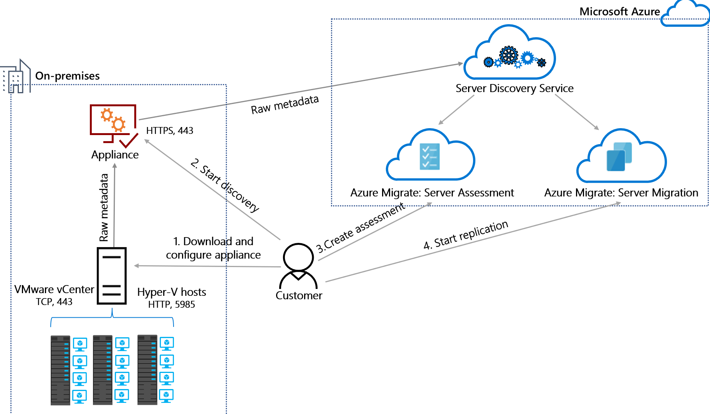

# Azure Migrate appliance

This article describes the Azure Migrate appliance. You deploy the appliance when you use Azure Migrate Assessment and Migration tools to discover, assess and migrate apps, infrastructure, and workloads to Microsoft Azure. 

[Azure Migrate](migrate-services-overview.md) provides a central hub to track discovery, assessment and migration of your on-premises apps and workloads, and private/public cloud VMs, to Azure. The hub provides Azure Migrate tools for assessment and migration, as well as third-party independent software vendor (ISV) offerings.


## Appliance overview

The Azure Migrate appliance types and usage are as follows.

**Deployed as** | **Used for** | **Details**
--- | --- |  ---
VMware VM | VMware VM assessment with the Azure Migrate Assessment tool.<br/><br/> VMware VM agentless migration with the Azure Migrate Server Migration tool | Download OVA template and import to vCenter Server to create the appliance VM.
Hyper-V VM | Hyper-V VM assessment with the Azure Migrate Assessment tool. | Download zipped VHD and import to Hyper-V to create the appliance VM.

## Appliance access

After you have configured the appliance, you can remotely access the appliance VM through TCP port 3389. You can also remotely access the web management app for the appliance, on port 44368 with URL: ``` https://<appliance-ip-or-name>:44368 ```.

## Appliance license
The appliance comes with a Windows Server 2016 evaluation license, which is valid for 180 days. If the evaluation period is close to expiry, we recommend that you download and deploy a new appliance, or that you activate the operating system license of the appliance VM.

## Appliance agents
The appliance has these agents installed.

**Agent** | **Details**
--- | ---
Discovery agent | Collects configuration data from on-premises VMs.
Assessment agent | Profiles the on-premises environment to collect VM performance data.
Migration adapter | Orchestrates VM replication, and coordinates communication between VMs and Azure.
Migration gateway | Sends replicated VM data to Azure.


## Appliance deployment requirements

- [Review](migrate-support-matrix-vmware.md#assessment-appliance-requirements) the deployment requirements for a VMware appliance, and the URLs that the appliance needs to access.
- [Review](migrate-support-matrix-hyper-v.md#assessment-appliance-requirements) the deployment requirements for a Hyper-V appliance, and the URLs that the appliance  needs to access.


## Collected performance data-VMware

Here's the VMware VM performance data that the appliance collects and sends to Azure.

**Data** | **Counter** | **Assessment impact**
--- | --- | ---
CPU utilization | cpu.usage.average | Recommended VM size/cost
Memory utilization | mem.usage.average | Recommended VM size/cost
Disk read throughput (MB per second) | virtualDisk.read.average | Calculation for disk size, storage cost, VM size
Disk write throughput (MB per second) | virtualDisk.write.average | Calculation for disk size, storage cost, VM size
Disk read operations per second | virtualDisk.numberReadAveraged.average | Calculation for disk size, storage cost, VM size
Disk write operations per second | virtualDisk.numberWriteAveraged.average  | Calculation for disk size, storage cost, VM size
NIC read throughput (MB per second) | net.received.average | Calculation for VM size
NIC write throughput (MB per second) | net.transmitted.average  |Calculation for VM size


## Collected metadata-VMware

Here's the full list of VMware VM metadata that the appliance collects and sends to Azure.

**Data** | **Counter**
--- | --- 
**Machine details** | 
VM ID | vm.Config.InstanceUuid 
VM name | vm.Config.Name
vCenter Server ID | VMwareClient.Instance.Uuid
VM description | vm.Summary.Config.Annotation
License product name | vm.Client.ServiceContent.About.LicenseProductName
Operating system type | vm.SummaryConfig.GuestFullName
Boot type | vm.Config.Firmware
Number of cores | vm.Config.Hardware.NumCPU
Memory (MB) | vm.Config.Hardware.MemoryMB
Number of disks | vm.Config.Hardware.Device.ToList().FindAll(x => is VirtualDisk).count
Disk size list | vm.Config.Hardware.Device.ToList().FindAll(x => is VirtualDisk)
Network adapters list | vm.Config.Hardware.Device.ToList().FindAll(x => is VirtualEthernet).count
CPU utilization | cpu.usage.average
Memory utilization |mem.usage.average
**Per disk details** | 
Disk key value | disk.Key
Dikunit number | disk.UnitNumber
Disk controller key value | disk.ControllerKey.Value
Gigabytes provisioned | virtualDisk.DeviceInfo.Summary
Disk name | Value generated using disk.UnitNumber, disk.Key, disk.ControllerKey.VAlue
Read operations per second | virtualDisk.numberReadAveraged.average
Write operations per second | virtualDisk.numberWriteAveraged.average
Read throughput (MB per second) | virtualDisk.read.average
Write throughput (MB per second) | virtualDisk.write.average
**Per NIC details** | 
Network adapter name | nic.Key
MAC address | ((VirtualEthernetCard)nic).MacAddress
IPv4 addresses | vm.Guest.Net
IPv6 addresses | vm.Guest.Net
Read throughput (MB per second) | net.received.average
Write throughput (MB per second) | net.transmitted.average
**Inventory path details** | 
Name | container.GetType().Name
Type of child object | container.ChildType
Reference details | container.MoRef
Parent details | Container.Parent
Folder details per VM | ((Folder)container).ChildEntity.Type
Datacenter details per VM | ((Datacenter)container).VmFolder
Datacenter details per host folder | ((Datacenter)container).HostFolder
Cluster details per host | ((ClusterComputeResource)container).Host
Host details per VM | ((HostSystem)container).VM


## Collected performance data-Hyper-V

Here's the VMware VM performance data that the appliance collects and sends to Azure.

**Performance counter class** | **Counter** | **Assessment impact**
--- | --- | ---
Hyper-V Hypervisor Virtual Processor | % Guest Run Time | Recommended VM size/cost
Hyper-V Dynamic Memory VM | Current Pressure (%)<br/> Guest Visible Physical Memory (MB) | Recommended VM size/cost
Hyper-V Virtual Storage Device | Read Bytes/Second | Calculation for disk size, storage cost, VM size
Hyper-V Virtual Storage Device | Write Bytes/Second | Calculation for disk size, storage cost, VM size
Hyper-V Virtual Network Adapter | Bytes Received/Second | Calculation for VM size
Hyper-V Virtual Network Adapter | Bytes Sent/Second | Calculation for VM size

- CPU utilization is the sum of all usage, for all virtual processors attached to a VM.
- Memory utilization is (Current Pressure * Guest Visible Physical Memory) / 100.
- Disk and network utilization values are collected from the listed Hyper-V performance counters.

## Collected metadata-Hyper-V

Here's the full list of Hyper-V VM metadata that the appliance collects and sends to Azure.

**Data** | **WMI class** | **WMI class property**
--- | --- | ---
**Machine details** | 
Serial number of BIOS _ Msvm_BIOSElement | BIOSSerialNumber
VM type (Gen 1 or 2) | Msvm_VirtualSystemSettingData | VirtualSystemSubType
VM display name | Msvm_VirtualSystemSettingData | ElementName
VM version | Msvm_ProcessorSettingData | VirtualQuantity
Memory (bytes) | Msvm_MemorySettingData | VirtualQuantity
Maximum memory that can be consumed by VM | Msvm_MemorySettingData | Limit
Dynamic memory enabled | Msvm_MemorySettingData | DynamicMemoryEnabled
Operating system name/version/FQDN | Msvm_KvpExchangeComponent | GuestIntrinsciExchangeItems Name Data
VM power status | Msvm_ComputerSystem | EnabledState
**Per disk details** | 
Disk identifier | Msvm_VirtualHardDiskSettingData | VirtualDiskId
Virtual hard disk type | Msvm_VirtualHardDiskSettingData | Type
Virtual hard disk size | Msvm_VirtualHardDiskSettingData | MaxInternalSize
Virtual hard disk parent | Msvm_VirtualHardDiskSettingData | ParentPath
**Per NIC details** | 
IP addresses (synthetic NICs) | Msvm_GuestNetworkAdapterConfiguration | IPAddresses
DHCP enabled (synthetic NICs) | Msvm_GuestNetworkAdapterConfiguration | DHCPEnabled
NIC ID (synthetic NICs) | Msvm_SyntheticEthernetPortSettingData | InstanceID
NIC MAC address (synthetic NICs) | Msvm_SyntheticEthernetPortSettingData | Address
NIC ID (legacy NICs) | MsvmEmulatedEthernetPortSetting Data | InstanceID
NIC MAC ID (legacy NICs) | MsvmEmulatedEthernetPortSetting Data | Address


## Discovery and collection process

The appliance communicates with vCenter Servers and Hyper-V hosts/cluster using the following process.


1. **Start discovery**:
    - When you start the discovery on the Hyper-V appliance, it communicates with the Hyper-V hosts on WinRM ports 5985 (HTTP) and 5986 (HTTPS).
    - When you start discovery on the VMware appliance, it communicates with the vCenter server on TCP port 443 by default. IF the vCenter server listens on a different port, you can configure it in the appliance web app.
2. **Gather metadata and performance data**:
    - The appliance uses a Common Information Model (CIM) session to gather Hyper-V VM data from the Hyper-V host on ports 5985 and 5986.
    - The appliance communicates with port 443 by default, to gather VMware VM data from the vCenter Server.
3. **Send data**: The appliance sends the collected data to Azure Migrate Server Assessment and Azure Migrate Server Migration over SSL port 443.
    - For performance data, the appliance collects real-time utilization data.
        - Performance data is collected every 20 seconds for VMware, and every 30 seconds for Hyper-V, for each performance metric.
        - The collected data is rolled up to create a single data point for ten minutes.
        - The peak utilization value is selected from all of the 20/30 second data points, and sent to Azure for assessment calculation.
        - Based on the percentile value specified in the assessment properties (50th/90th/95th/99th), the ten-minute points are sorted in ascending order, and the appropriate percentile value is used to compute the assessment
    - For Server Migration, the appliance starts collecting VM data, and replicates it to Azure.
4. **Assess and migrate**: You can now create assessments from the metadata collected by the appliance using Azure Migrate Server Assessment. In addition, you can also start migrating VMware VMs using Azure Migrate Server Migration to orchestrate agentless VM replication.





## Appliance upgrades

The appliance is upgraded as the Azure Migrate agents running on the appliance are updated.

- This happens automatically because the auto-update is enabled on the appliance by default.
- You can change this default setting to update the agents manually.
- To disable automatic updates, set registry key Appliance Auto Update, in HKLM\SOFTWAREMicrosoft\Azure.

### Set agent updates to manual

For manual updates, make sure that you update all the agents on the appliance at the same time, using the **Update** button for each outdated agent on the appliance. You can switch the update setting back to automatic updates at any time.

## Next steps

[Learn how](tutorial-assess-vmware.md#set-up-the-appliance-vm) to set up the appliance for VMware.
[Learn how](tutorial-assess-hyper-v.md#set-up-the-appliance-vm) to set up the appliance for Hyper-V.

