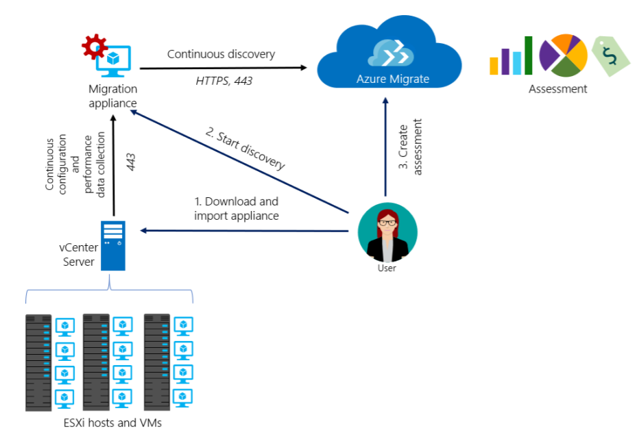

# Azure Migrate architecture and processes

[Azure Migrate](migrate-overview.md) provides a hub of tools that help you to discover, assess, and migrate apps, infrastructure, and workloads to Microsoft Azure. The hub includes Azure Migrate tools, and third-party independent software vendor (ISV) offerings. 

 This article summarizes the assessment and migration architecture and processes for Azure Migrate Server Assessment, and Azure Migrate Server Migration.

## Assessment with Azure Migrate Server Assessment

Azure Migrate Server Assessment can assess VMware VMs and Hyper-V VMs for migration to Azure. Assessment works as follows:

1. **Prepare for assessment**: On-premises, you set up a lightweight Azure Migrate appliance on-premises as a VMware VM or Hyper-V VM, and register the appliance with Azure Migrate.
2. **Discover VMs**: The Azure Migrate appliance runs to discover on-premises VMs. 
    - Nothing needs to be installed on discovered VMs.
    - VM metadata includes information about cores, memory, disks, disk sizes, and network adapters.
    - Performance data includes information about CPU and memory usage, disk IOPS, disk throughput (MBps) , and network output (MBps)
- **Gather and assess machines**: After discovery finishes, in the Azure portal you gather discovered VMs into groups that typically consist of VMs that you'd like to migrate together. You run an assessment on a group.

## VMware assessment 

The diagram summarizes how VMware VM assessment works using Azure Migrate Server Assessment.

The process is as follows:

1. **Deploy the Azure Migrate appliance**:

    a. Download the (OVA) template from the Azure portal.

    b. Import it to the vCenter Server machine to create the VM.

    c. Connect to this VM, configure basic settings for it, and register it with Azure Migrate.

2. **Initiate discovery**:

    a. Connect to the Collector app running on the appliance to initiate discovery.

    b. The appliance continually sends metadata and performance data from the VMs to Azure.

    - The appliance is always connected to the Azure Migrate service.
    - Environment changes during continuous discovery are captured. For example adding VMs in the discovery scope, or adding VM disks or NICs.

3. **Assess machines**:

    a. After discovery finishes, in the Azure portal you gather discovered VMs into groups.  A group typically consists of VMs that you'd like to migrate together.

    b. Run an assessment for each group.

4. **Review assessment**: 

    a. After the assessment finishes, view it in the portal.

    b. For further analysis, download the assessment in Excel format.

### VMware ports
Azure Migrate uses the following connection ports for VMware:

**Source** | **Target** | **Port** | **Details**
--- | --- | --- | ---
Azure Migrate appliance | Azure Migrate service | Target-TCP 443 | Send metadata and performance data to Azure Migrate.
Azure Migrate appliance | vCenter Server | Target-TCP 443 | Connect to vCenter Server for metadata and performance data. 443 is default but can be modified with vCenter listens on a different port. 
RDP client | Azure Migrate appliance | Target-TCP3389 | RDP connection to trigger discovery from the appliance.

### Collected VMware metadata

The appliance sends metadata and performance-related data from the VMs to Azure.

**Action** | **Details**
--- | ---
**Collected metadata** | vCenter VM name  vCenter VM path (host/cluster folder)  IP and MAC addresses  Operating system  Number of cores/disks/NICs  Memory and disk size.
**Collected performance data** | CPU/memory usage  Per disk data (disk read/write throughput; disk reads/writes per second)  NIC data (network in, network out).   Performance data is collected continually after the appliance connects to vCenter Server. Historical data isn't collected.

## Hyper-V assessment

The diagram summarizes how Hyper-V assessment works sing Azure Migrate Server Assessment.

The process is as follows:

1. **Create the Azure Migrate appliance**:

    a. Download the VM in compressed format from the Azure portal.

    b. Import it to a Hyper-V host.

    c. Connect to the appliance VM. Configure basic settings for it, and register it with Azure Migrate.

2. **Initiate discovery**:

    a. Connect to the Azure Migrate appliance to initiate discovery. Nothing needs to be installed on discovered VMs.

    b. The appliance continually sends VM metadata and performance data to Azure Migrate.

    - The appliance is always connected to the Azure Migrate service (using CIM sessions).
    - Environment changes during continuous discovery are captured. For example adding VMs in the discovery scope, or adding VM disks or NICs.

3. **Assess machines**:

    a. After discovery finishes, in the Azure portal you gather discovered VMs into groups.  A group typically consists of VMs that you'd like to migrate together.

    b. Run an assessment for each group.

4. **Review assessment**:

    a. After the assessment finishes, view it in the portal.

    b. For further analysis, download the assessment in Excel format.

### Hyper-V ports

Azure Migrate service uses the following connection ports for Hyper-V:

**Source** | **Target** | **Port** | **Details**
--- | --- | --- | ---
Azure Migrate appliance | Azure Migrate service | Target-TCP 443 | Send metadata and performance data to Azure Migrate.
Azure Migrate appliance | Hyper-V host/cluster | Target-Default WinRM ports-HTTP:5985; HTTPS:5986 | Connect to host for metadata and performance data. CIM session used for connection
RDP client | Azure Migrate appliance | Target-TCP3389 | RDP connection to trigger discovery from the appliance.

## Collected Hyper-V VM metadata

The appliance sends metadata and performance-related data from the VMs to Azure.

**Action** | **Details**
--- | ---
**Collected metadata** | VM name  vCenter VM path (host/cluster folder)  IP and MAC addresses  Operating system  Number of cores/disks/NICs  Memory and disk size  Disk IOPS, disk throughput (MBps), network output (MBps)
**Collected performance data** |  CPU/memory usage  Per disk data (disk read/write throughput; disk reads/writes per second)  NIC data (network in, network out).   Performance data is collected continually after the appliance connects to the Hyper-V host. Historical data isn't collected.

## Migration with Azure Migrate Server Migration

Using Azure Migrate Server Migration, you can migrate the following to Azure:

- On-premises VMware VMs
- On-premises Hyper-V VMs
- On-premises physical servers
- AWS Windows VM instances
- GCP Windows VM instances

The migration process differs slightly, depending on what you're migrating.

## Migrate VMware VMs

Azure Migrate Server Migration offers two methods for migrating on-premises VMware VMs:

- **Agentless replication**: Migrate VMs without needing to install anything on them.
- **Agent-based replication**. Install an agent on the VM for replication.

Although agentless replication is easier from a deployment perspective, it currently has a number of limitations. [Learn more](server-migrate-overview.md) about these limitations.
 

### Agent-based migration

Agent-based migration of VMware VMs requires a number of components to be deployed, as summarized in the table.

**Component** | **Requirement** | **Details**
--- | --- | ---
**Configuration server machine** | A single on-premises VMware VM that's deployed from a downloaded OVF template.   The machine runs all on-premises Site Recovery components, which include the configuration server and process server. | **Configuration server**: Coordinates communications between on-premises and Azure, and manages data replication.   **Process server**: Installed by default on the configuration server. It receives replication data; optimizes it with caching, compression, and encryption; and sends it to Azure. The process server also installs Azure Site Recovery Mobility Service on VMs, and performs automatic discovery of on-premises machines.
**Mobility service** | The Mobility Service must be installed on each VMware VM that you replicate. | We recommend that you allow automatic installation from the process server. Alternatively, you can install the service manually or use an automated deployment method, such as System Center Configuration Manager.

### Agent-based replication process

1. When you enable replication for a VM, initial replication to Azure begins. 
    - Replication is block-level, near-continuous, using the Mobility service agent running on the VM.
    - Replication policy settings are applied:
        - **RPO threshold**. This setting does not affect replication. It helps with monitoring. An event is raised, and optionally an email sent, if the current RPO exceeds the threshold limit that you specify.
        - **Recovery point retention**. This setting specifies how far back in time you want to go when a disruption occurs. Maximum retention on premium storage is 24 hours. On standard storage it's 72 hours. 
        - **App-consistent snapshots**. App-consistent snapshot can be take every 1 to 12 hours, depending on your app needs. Snapshots are standard Azure blob snapshots. The Mobility agent running on a VM requests a VSS snapshot in accordance with this setting, and bookmarks that point-in-time as an application consistent point in the replication stream.

2. Traffic replicates to Azure storage public endpoints over the internet.

    - Alternately, you can use Azure ExpressRoute with [Microsoft peering](../expressroute/expressroute-circuit-peerings.md#microsoftpeering).
    - Replicating traffic over a site-to-site virtual private network (VPN) from an on-premises site to Azure isn't supported.
3. After initial replication finishes, replication of delta changes to Azure begins. Tracked changes for a machine are sent to the process server.
2. Communication happens as follows:

    - VMs communicate with the on-premises configuration server on port HTTPS 443 inbound, for replication management.
    - The configuration server orchestrates replication with Azure over port HTTPS 443 outbound.
    - VMs send replication data to the process server (running on the configuration server machine) on port HTTPS 9443 inbound. This port can be modified.
    - The process server receives replication data, optimizes and encrypts it, and sends it to Azure storage over port 443 outbound.
5. The replication data logs first land in a cache storage account in Azure. These logs are processed and the data is stored in an Azure managed disk (the Azure Site Recovery seed disk). The recovery points are created on this disk.

## Migrate Hyper-V VMs

## Next steps

- [Review frequently asked questions](resources-faq.md) about Azure Migrate.
- For help from the community, visit the [Azure Migrate MSDN forum](https://social.msdn.microsoft.com/Forums/home?forum=AzureMigrate&filter=alltypes&sort=lastpostdesc) or [Stack Overflow](https://stackoverflow.com/search?q=azure+migrate).

