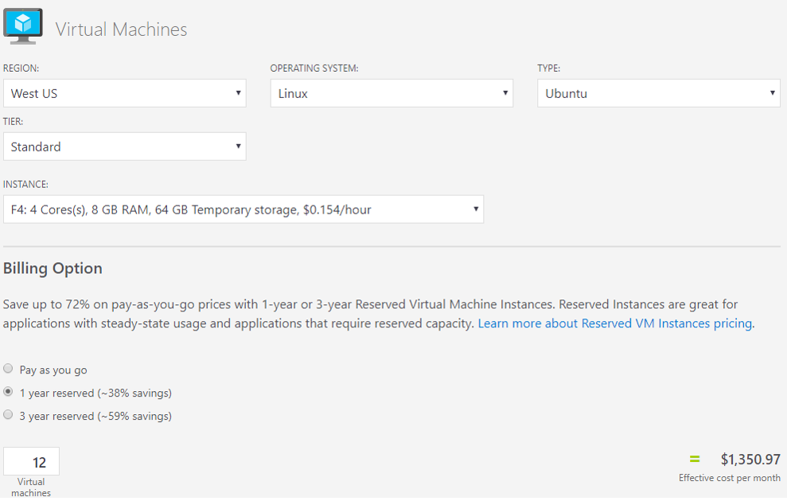
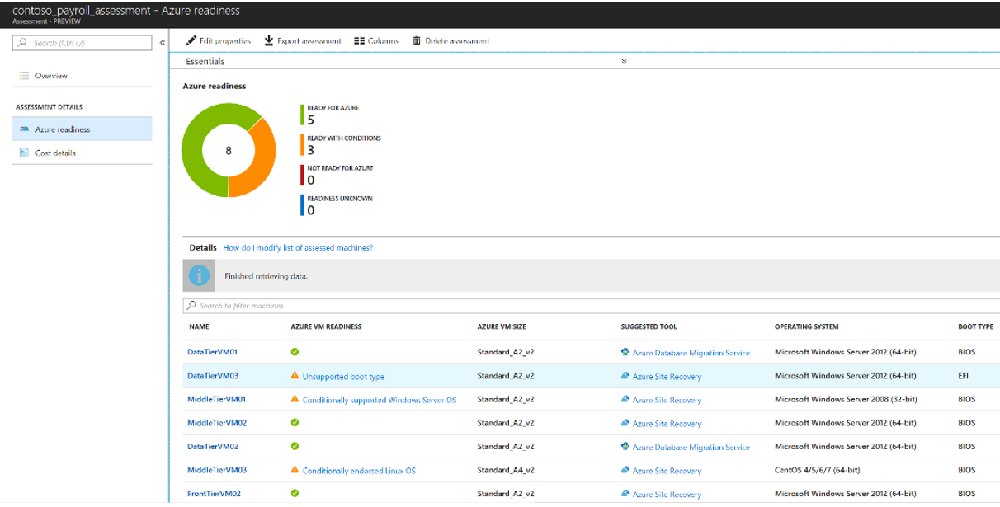
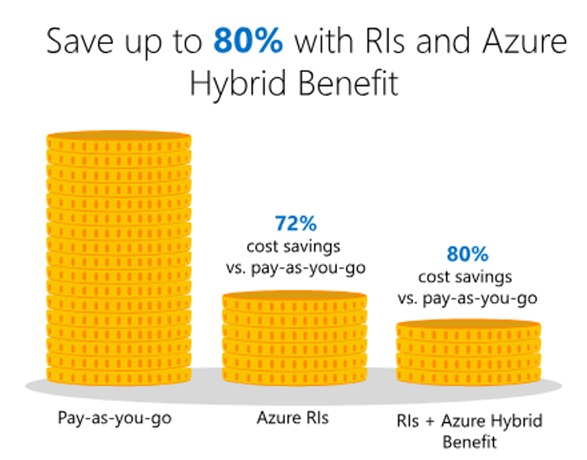
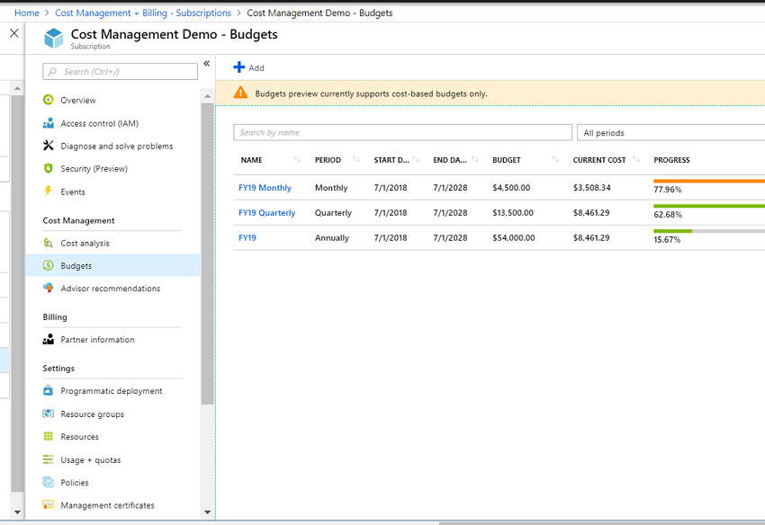
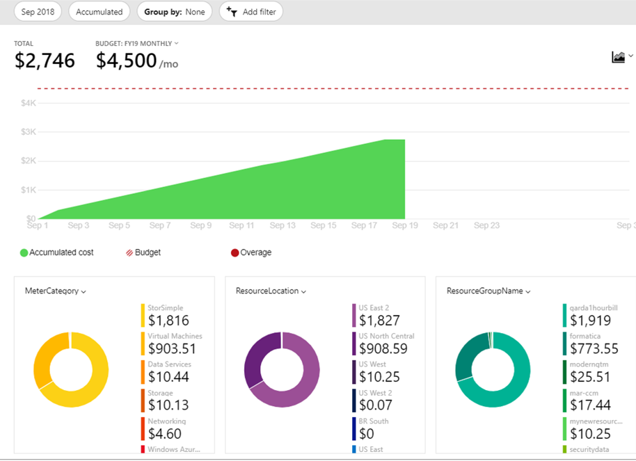

## Best practices for costing and sizing workloads migrated to Azure

As you plan and design for migration, focusing on costs ensures the long-term success of your Azure migration. During a migration project, it's critical that all teams (finance, management, app teams etc) understand associated costs. Before migration, estimating your migration spend, with a baseline for monthly, quarterly, and yearly budget targets is critical to success. After migration, you should optimize costs, continually monitor workloads, and plan for future usage patterns. Migrated resources might start out as one type of workload, but evolve into another type over time, based on usage, costs, and shifting business requirements.

This article describes best practices for costing and sizing before and after migration.  

> [!IMPORTANT]
> The best practices and opinions described in this article are based on Azure platform and service features available at the time of writing. Features and capabilities change over time. Not all recommendations might be applicable for your deployment, so select what works for you.

## Before migration 

Before you move your workloads to the cloud, estimate the monthly cost of running them in Azure. Proactively managing cloud costs helps you adhere to your operating expenses (OpEx) budget. If budget is limited, take this into account before migration.  Consider converting workloads to Azure serverless technologies, where appropriate, to reduce costs.

The best practices in this section help you to estimate costs, perform right-sizing for VMs and storage, leverage Azure Hybrid benefits, use reserved VMs, and estimate cloud spending across subscriptions.

## Best practice: Estimate monthly workload costs
 
To forecast your monthly bill for migrated workloads, there are a number of tools you can use.

- **Azure pricing calculator**: You select the products you want to estimate, for example VMs and storage. You input costs into the pricing calculator, to build an estimate.

 
    *Azure pricing calculator*

- **Azure Migrate**: To estimate costs, you need to review and account for all the resources required to run your workloads in Azure. To acquire this data, you create inventory of your assets, including servers, VMs, databases, and storage. You can use Azure Migrate to collect this information.

 - Azure Migrate discovers and assesses your on-premises environment to provide an inventory.
 - Azure Migrate can map and show you dependencies between VMs so that you have a complete picture.
 - An Azure Migrate assessment contains estimated cost.
    - Compute costs: Using the Azure VM size recommended when you create an assessment, Azure Migrate uses the Billing API to calculate estimated monthly VM costs. The estimation considers the operating system, software assurance, reserved instances, VM uptime, location, and currency settings. It aggregates the cost across all VMs in the assessment, and calculates a total monthly compute cost.
    - Storage cost: Azure Migrate calculates total monthly storage costs by aggregating the storage costs of all VMs in an assessment. You can calculate the monthly storage cost for a specific machine by aggregating the monthly cost of all disks attached to it. 

    
    *Azure Migrate assessment*

**Learn more:**
- [Use](https://azure.microsoft.com/pricing/calculator/) the Azure pricing calculator.
- [Get an overview](https://docs.microsoft.com/azure/migrate/migrate-overview) of Azure Migrate.
- [Read about](https://docs.microsoft.com/azure/migrate/concepts-assessment-calculation) Azure Migrate assessments.
- [Learn more](https://docs.microsoft.com/azure/dms/dms-overview) about the Database Migration Service (DMS).

## Best practice: Right-size VMs

You can choose a number of options when you deploy Azure VMs to support workloads. Each VM type has specific features and different combinations of CPU, memory, and disks. VMs are grouped as follows.

**Type** | **Details** | **Use**
--- | --- | ---
**General purpose** | Balanced CPU-to-memory. | Good for testing and development, small to medium databases, low to medium traffic web servers.
**Compute-optimized** | High CPU-to-memory. | Good for medium traffic web server, network appliances, batch processes, app servers.
**Memory-optimized** | High memory-to-CPU. | Good for relational databases, medium to large cache, in-memory analytics.
**Storage optimized** | High disk throughput and IO. | Good for big data, SQL and NoSQL databases.
**GPU optimized** | Specialized VMs. Single or multiple GPUs. | Heavy graphics and video editing.
**High performance** | Fastest and most powerful CPU. VMs with optional high-throughput network interfaces (RDMA) | Critical high-performance apps.

- It's important to understand the pricing differences between these VMs, and the long-term budget effects.
- Each type has a number of VM series within it.
- Additionally, when you select a VM within a series, you can only scale the VM up and down within that series. For example, a DSv2\_2 can scale up to DSv2\_4, but it can't be changed to a different series such as Fsv2\_2.

**Learn more:**
- [Learn more](https://docs.microsoft.com/azure/virtual-machines/windows/sizes) about VM types and sizing, and map sizes to types.
- [Plan](https://docs.microsoft.com/azure/cloud-services/cloud-services-sizes-specs) VM sizing.
- [Review](https://docs.microsoft.com/azure/migrate/contoso-migration-assessment) a sample assessment for the fictitious Contoso company.

## Best practice: Select the right storage

Tuning and maintaining on-premises storage (SAN or NAS), and the networks to support them, can be costly and time-consuming. File (storage) data is commonly migrated to the cloud to help alleviate operational and management headaches. Microsoft provides several options for moving data to Azure, and you need to make decisions about those options. Picking the right storage type for data can save your organization several thousands of dollars every month. A few considerations:

- Data that isn't accessed much, and isn't business-critical, doesn't need to be placed on the most expensive storage.
- Conversely, important business-critical data should be located on higher tier storage options.
- During migration planning, take an inventory of data and classify it by importance, in order to map it to the most suitable storage. Consider budget and costs, as well as performance. Cost shouldn't necessarily be the main decision-making factor. Picking the least expensive option could expose the workload to performance and availability risks. 

### Storage data types

Azure provides different types of storage data.

**Data type** | **Details** | **Usage** 
--- | --- |  ---
**Blobs** | Optimized to store massive amounts of unstructured objects, such as text or binary data   | Access data from everywhere over HTTP/HTTPS. | Use for streaming and random access scenarios. For example, to serve images and documents directly to a browser, stream video and audio, and store backup and disaster recovery data.
**Files** | Managed file shares accessed over SMB 3.0 | Use when migrating on-premises file shares, and to provide multiple access/connections to file data.
**Disks** | Based on page blobs.   Disk type (speed): Standard (HDD or SSD) or Premium (SSD).  Disk management: Unmanaged (you manage disk settings and storage) or Managed (you select the disk type and Azure manages the disk for you). | Use Premium disks for VMs. Use managed disks for simple management and scaling.
**Queues** | Store and retrieve large numbers of messages accessed via authenticated calls (HTTP or HTTPS) | Connect app components with asynchronous message queueing.
**Tables** | Store tables. | Now part of Azure Cosmos DB Table API.

### Access tiers
Azure storage provides different options for accessing block blob data. Selecting the right access tier helps ensure that you store block blob data in the most cost-effective manner.

**Type** | **Details** | **Usage**
--- | --- | ---
**Hot** | Higher storage cost than Cool. Lower access charges than Cool.  This is the default tier. | Use for data in active use that's accessed frequently.
**Cool** | Lower storage cost than Hot. Higher access charges than Hot.   Store for minimum of 30 days. | Store short-term, data is available but accessed infrequently.
**Archive** | Used for individual block blobs.   Most cost-effective option for storage. Data access is more expensive than hot and cold. | Use for data that can tolerate server hours of retrieval latency and will remain in the tier for at least 180 days. 

### Storage account types

Azure provides different types of storage accounts and performance tiers.

**Account type** | **Details** | **Usage**
--- | --- | ---
**General Purpose v2 Standard** | Supports blobs (block, page, append), files, disks, queues, and tables.   Supports Hot, Cool, and Archive access tiers. ZRS is supported. | Use for most scenarios and most types of data. Standard storage accounts can be HHD or SSD based.
**General Purpose v2 Premium** | Supports Blob storage data (page blobs). Supports Hot, Cool, and Archive access tiers. ZRS is supported.   Stored on SSD. | Microsoft recommends using for all VMs.
**General Purpose v1** | Access tiering isn't supported. Doesn't support ZRS | Use if apps need the Azure classic deployment model.
**Blob** | Specialized storage account for storing unstructured objects. Provides block blobs and append blobs only (no File, Queue, Table or Disk storage services). Provides the same durability, availability, scalability and performance as General Purpose v2. | you can't store page blobs in these accounts, and therefore can't store VHD files. You can set an access tier to Hot or Cool.

### Storage redundancy options

Storage accounts can use different types of redundancy for resilience and high availability.

**Type** | **Details** | **Usage**
--- | --- | ---
**Locally Redundant Storage (LRS)** | Protects against a local outage by replicating within a single storage unit to a separate fault domain and update domain. Keeps multiple copies of your data in one datacenter. Provides at least 99.999999999 % (11 9\'s) durability of objects over a given year. | Consider if your app stores data that can be easily reconstructed.
**Zone Redundant Storage (ZRS)** | Protects again a datacenter outage by replicating across three storage clusters in a single region. Each storage cluster is physically separated and located in its own availability zone. Provides at least 99.9999999999 % (12 9\'s) durability of objects over a given year by keeping multiple copies of your data across multiple data centers or regions. | Consider if you need consistency, durability, and high availability. Might not protect against a regional disaster when multiple zones are permenently affected.
**Geographically Redundant Storage (GRS)** | Protects against an entire region outage by replicating data to a secondary region hundreds of miles away from the primary. Provides at least 99.99999999999999 % (16 9\'s) durability of objects over a given year. | Replica data isn't available unless Microsoft initiates a failover to the secondary region. If failover occurs, read and write access is available.
**Read-Access Geographically Redundant Storage (RA-GRS)** | Similar to GRS. Provides at least 99.99999999999999 % (16 9\'s) durability of objects over a given year | Provides and 99.99 % read availability by allowing read access from the second region used for GRS.

**Learn more:**
- [Review](https://azure.microsoft.com/pricing/details/storage/) Azure Storage pricing.
- [Learn about](https://docs.microsoft.com/azure/storage/common/storage-import-export-service) Azure Import/Export for migration large amounts of data to the Azure blobs and files. 
- [Compare](https://docs.microsoft.com/azure/storage/common/storage-decide-blobs-files-disks?toc=%2fazure%2fstorage%2fblobs%2ftoc.json) blobs, files, and disk storage data types.
- [Learn more](https://docs.microsoft.com/azure/storage/blobs/storage-blob-storage-tiers) about access tiers.
- [Review](https://docs.microsoft.com/azure/storage/common/storage-account-overview?toc=%2fazure%2fstorage%2fblobs%2ftoc.json) different types of storage accounts.
- Learn about [storage redundancy](https://docs.microsoft.com/azure/storage/common/storage-redundancy), [LRS](https://docs.microsoft.com/azure/storage/common/storage-redundancy-lrs?toc=%2fazure%2fstorage%2fqueues%2ftoc.json), [ZRS](https://docs.microsoft.com/azure/storage/common/storage-redundancy-zrs?toc=%2fazure%2fstorage%2fqueues%2ftoc.json), [GRS](https://docs.microsoft.com/azure/storage/common/storage-redundancy-grs?toc=%2fazure%2fstorage%2fqueues%2ftoc.json), and [Read-access GRS](https://docs.microsoft.com/azure/storage/common/storage-redundancy-grs?toc=%2fazure%2fstorage%2fqueues%2ftoc.json#read-access-geo-redundant-storage).
- [Learn more](https://docs.microsoft.com/azure/storage/files/storage-files-introduction) about Azure Files.

## Best practice: Leverage Azure Hybrid benefits

Due to years of software investment in systems such as Windows Server and SQL Server, Microsoft is in a unique position to offer customers value in the cloud, with substantial discounts that other cloud providers can't necessarily provide. 

An integrated Microsoft on-premises/Azure product portfolio generates competitive and cost advantages. If you currently have an operating system or other software licensing through software assurance (SA), you can take those licenses with you to the cloud for with Azure Hybrid Benefit.

**Learn more:**

- [Take a look at](https://azure.microsoft.com/pricing/hybrid-benefit/) the Hybrid Benefit Savings Calculator.
- [Learn more](https://azure.microsoft.com/pricing/hybrid-benefit/) about Hybrid Benefit for Windows Server.
- [Review](https://docs.microsoft.com/azure/virtual-machines/windows/sql/virtual-machines-windows-sql-server-pricing-guidance#bring-your-own-license-byol) pricing guidance for SQL Server Azure VMs.

## Best practice: Use reserved VM instances

Most cloud platforms are set up as pay-as-you-go. This model presents disadvantages, since you don't necessarily know how dynamic workloads will be. When you specify clear intentions for a workload, you contribute to infrastructure planning.

Using Azure Reserved VM instances, you prepay for a one or three-year term VM instance. 

- Prepayment provides a discount on the resources you use.
- You can significantly reduce VM, SQL database compute, Azure Cosmos DB, or other resource costs by up to 72% on pay-as-you-go prices. 
- Reservations provide a billing discount, and don't affect the runtime state of your resources.
- You can cancel reserved instances.

*Azure reserved VMs*

**Learn more:**
- [Learn about](https://docs.microsoft.com/azure/billing/billing-save-compute-costs-reservations) Azure Reservations.
- [Read](https://azure.microsoft.com/pricing/reserved-vm-instances/#faq) the reserved instances FAQ.
- [Get pricing guidance](https://docs.microsoft.com/azure/virtual-machines/windows/sql/virtual-machines-windows-sql-server-pricing-guidance#bring-your-own-license-byol) for SQL Server Azure VMs.

## Best practice: Aggregate cloud spend across subscriptions

It's inevitable that eventually you'll have more than one Azure subscription. For example, you might need an additional subscription to separate development and production boundaries, or you might have a platform that requires a separate subscription for each client. Having the ability to aggregate data reporting across all the subscriptions into a single platform is a valuable feature.

To do this, you can use Azure Cost Management APIs. Then, after aggregating data into a single source such as Azure SQL, you can use tools like Power BI to surface the aggregated data. You can create aggregated subscription reports, and granular reports. For example,for users who need proactive insights into cost management, you can create specific views of costs, based on department, resource group etc. You don't need to provide them with full access to Azure billing data.

**Learn more:**

- [Get an overview](https://docs.microsoft.com/azure/billing/billing-consumption-api-overview) of the Azure Consumption API.
- [Learn about](https://docs.microsoft.com/power-bi/desktop-connect-azure-consumption-insights) connecting to Azure Consumption Insights in Power BI Desktop.
- [Learn how to](https://docs.microsoft.com/azure/billing/billing-manage-access) manage access to billing information for Azure using role-based access control (RBAC).
 
## After migration

After a successful migration of your workloads, and a few weeks of collecting consumption data, you'll have a clear idea of resources costs.
- As you analyze data, you can start to generate a budget baseline for Azure resource groups and resources.
- Then, as you understand where your cloud budget is being spent, you can analyze how to further reduce your costs.

Best practices in this section include using Azure Cost Management for cost budgeting and analysis, monitoring resources and implementing resource group budgets, and optimizing monitoring, storage, and VMs.

## Best practice: Use Azure Cost Management

Microsoft provides Azure Cost Management to help you track spending, as follows:

- Helps you to monitor and control Azure spending, and optimize use of resources.
- Reviews your entire subscription and all of its resources, and makes recommendations.
- Provides with a full API, to integrate external tools and financial systems for reporting.
- Tracks resource usage and manage cloud costs with a single, unified view.
- Provides rich operational and financial insights to help you make informed decisions.

In Cost Management, you can:

- **Create a budget**: Create a budget for financial accountability.
    - You can account for the services you consume or subscribe to for a specific period (monthly, quarterly, annually) and ascope (subscriptions/resource groups). For example, you can create an Azure subscription budget for a monthly, quarterly, or annual period.
    - After you create a budget, it's shown in cost analysis. Viewing your budget against current spending is one of the first steps needed when analyzing your costs and spending.
    - Email notifications can be sent when budget thresholds are reached.
    - You can export costs management data to Azure storage, for analysis.

    
    *Azure Cost Management budget*

- **Do a cost analysis**: Get a cost analysis to explore and analyze your organizational costs, to help you understand how costs are accrued, and identify spending trends.
    - Cost analysis is available to EA users.
    - You can view cost analysis data for a number of scopes, including by department, account, subscription or resource group.
    - You can get a cost analysis that shows total costs for the current month, and accumulated daily costs. 

    
    *Azure Cost Management analysis*
- **Get recommendations**: Get Advisor recommendations that show you how you can optimize and improve efficiency.

**Learn more:**

- [Get an overview](https://docs.microsoft.com/azure/cost-management/overview) of Azure Cost Management.
- [Learn how to](https://docs.microsoft.com/azure/cost-management/cost-mgt-best-practices) optimize your cloud investment with Azure Cost Management.
- [Learn how to](https://docs.microsoft.com/azure/cost-management/use-reports) use Azure Cost Management reports.
- [Get a tutorial](https://docs.microsoft.com/azure/cost-management/tutorial-acm-opt-recommendations?toc=/azure/billing/TOC.json) on optimizing costs from recommendations.
- [Review](https://docs.microsoft.com/rest/api/consumption/budgets) the Azure Consumption API.

## Best practice: Monitor resource utilization

In Azure you pay for what you use, when when resources are consumed, and you don't pay when they aren't. For VMs, billing occurs when a VM is allocated, and you aren't charged after a VM is deallocated. With this in mind you should monitor VMs in use, and verify VM sizing.

- Continually evaluate your VM workloads to determine baselines.
- For example, if your workload is used heavily Monday through Friday, 8am to 6pm, but hardly used outside those hours, you could downgrade VMs outside peak times. This might mean changing VM sizes, or using virtual machine scale sets to autoscale VMs up or down.
- Some companies "snooze", VMs by putting them on a calendar that specifies when they should be available, and when they're not needed. 
- In addition to VM monitoring, you should monitor other networking resources such as ExpressRoute and virtual network gateways for under and over use.
- You can monitor VM usage using a number of Microsoft tools including Azure Cost Management, Azure Monitor, and Azure Advisor. Third-party tools are also available.  

**Learn more:**
- Get an overview of [Azure Monitor](https://docs.microsoft.com/azure/azure-monitor/overview) and [Azure Advisor](https://docs.microsoft.com/azure/advisor/advisor-overview).
- [Get](https://docs.microsoft.com/azure/advisor/advisor-cost-recommendations) Advisor cost recommendations.
- [Learn how to [optimize costs from recommendations](https://docs.microsoft.com/azure/cost-management/tutorial-acm-opt-recommendations?toc=/azure/billing/TOC.json), and [prevent unexpected charges](https://docs.microsoft.com/en-us/azure/billing/billing-getting-started).
- [Learn about](https://github.com/Azure/azure-quickstart-templates/tree/master/azure-resource-optimization-toolkit/) the Azure Resource Optimization (ARO) Toolkit

## Best practice: Implement resource group budgets

Often, resource groups are used to represent cost boundaries. Together with this usage pattern, the Azure team continues to develop new and enhanced ways to track and analyze resource spending at different levels, including the ability to create budgets at the resource group and resources.  

- A resource group budget helps you track the costs associated with a resource group.
- You can trigger alerts and run a wide variety of playbooks as the budget is reached or exceeded. 

**Learn more:**

- [Learn how to](https://docs.microsoft.com/azure/billing/billing-cost-management-budget-scenario) manage costs with Azure Budgets.
- [Follow a tutorial](https://docs.microsoft.com/azure/cost-management/tutorial-acm-create-budgets?toc=/azure/billing/TOC.json) to create and manage an Azure budget.

## Best practice: Optimize Azure Monitor retention

As you move resources into Azure and enable diagnostic logging for them, you generate a lot of log data. Typically this log data is sent to a storage account that's mapped to a Log Analytics workspace.

- The longer the log data retention period, the more data you'll have.
- Not all log data is equal, and some resources will generate more log data than others.
- Due to regulations and compliance, it's likely that you'll need to retain log data for some resources longer than others.
- You should walk a careful line between optimizing your log storage costs, and keeping the log data you need.
- We recommend evaluating and setting up the logging immediately after completing a migration, so that you aren't spending money retaining logs of no importance.

**Learn more:**

- [Learn about](https://docs.microsoft.com/azure/monitoring-and-diagnostics/monitoring-usage-and-estimated-costs) monitoring usage and estimated costs.
 
## Best practice: Optimize storage

If you followed best practices for selecting storage before migration, you are probably reaping some benefits. However, there are probably additional storage costs that you can still optimize. Over time blobs and files become stale. Data might not be used anymore, but regulatory requirements might mean that you need to keep it for a certain period. As such, you might not need to store it on the high-performance storage that you used for the original migration.

Identifying and moving stale data to cheaper storage areas can have a huge impact on your monthly storage budget and cost savings. Azure provides many ways to help you identify and then store this stale data.

- Take advantage of access tiers for general-purpose v2 storage, moving less important data from Hot to Cool and Archived tiers.
- Use StorSimple to help move stale data based on customized policies. 

**Learn more:**
- [Learn more](https://docs.microsoft.com/azure/storage/blobs/storage-blob-storage-tiers) about access tiers.
- [Get an overview](https://docs.microsoft.com/azure/azure-monitor/overview) of StorSimple, and [StorSimple pricing](https://azure.microsoft.com/pricing/details/storsimple/).

## Best practice: Automate VM optimization

The ultimate goal of running a VM in the cloud is to maximize the CPU, memory, and disk that it uses. If you discover VMs that aren't optimized, or have frequent periods when VMs aren't used, it makes sense to either shut them down, or downscale them using VM scale sets.

You can optimize a VM with Azure Automation, VM scale sets, auto-shutdown, and scripted or 3rd party solutions. 

**Learn more:**

- [Learn how to](https://docs.microsoft.com/azure/virtual-machine-scale-sets/virtual-machine-scale-sets-vertical-scale-reprovision) use vertical autoscaling.
- [Schedule](https://azure.microsoft.com/updates/azure-devtest-labs-schedule-vm-auto-start/) a VM autostart.
- [Learn how to](https://docs.microsoft.com/azure/automation/automation-solution-vm-management) start or stop VMs off hours in Azure Automation.
- [Get more information] about [Azure Advisor](https://docs.microsoft.com/azure/advisor/advisor-overview), and the [Azure Resource Optimization (ARO) Toolkit](https://github.com/Azure/azure-quickstart-templates/tree/master/azure-resource-optimization-toolkit/).

## Best practices: Use Logic Apps and runbooks with Budgets API

Azure provides a REST API that has access to your tenant billing information.

- You can use the Budgets API to integrate external systems and workflows that are triggered by metrics that you build from the API data.
- You can pull usage and resource data into your preferred data analysis tools.
- The Azure Resource Usage and RateCard APIs can help you accurately predict and manage your costs.
- The APIs are implemented as a Resource Provider and are included in the APIs exposed by the Azure Resource Manager.
- The Budgets API can be integrated with Azure Logic Apps and Runbooks.

**Learn more:**

- [Learn more](https://docs.microsoft.com/rest/api/consumption/budgets) about the Budgets API.
- [Get insights](https://docs.microsoft.com/azure/billing/billing-usage-rate-card-overview) into Azure usage with the Billing API.

## Best practice: Implement serverless technologies

VM workloads are often migrated "as is" to avoid downtime. Often VMs may host tasks that are intermittent, taking a short period to run, or alternatively many hours. For example, VMs that run scheduled tasks such as Windows task scheduler or PowerShell scripts. When these tasks aren't running, you're nevertheless absorbing VM and disk storage costs.

After migration, after a thorough review of these types of tasks you might consider migrating them to serverless technologies such as Azure Functions or Azure Batch jobs. With this solution, you no longer need to manage and maintain the VMs, bringing an additional cost saving. 

**Learn more:**
- [Learn about](https://azure.microsoft.com/services/functions/) Azure Functions
- [Learn more about](https://azure.microsoft.com/en-us/services/batch/) Azure Batch
  
## Next steps 

Review other best practices:

- [Best practices](migrate-best-practices-security-management.md) for security and management after migration.
- [Best practices](migrate-best-practices-networking.md) for networking after migration.

