## Best practices for securing and managing workloads migrated to Azure

As you plan and design for migration, in addition to thinking about the migration itself, you need to plan for your security and management model in Azure after migration. This article describes planning and best practices for securing your Azure deployment after migrating, and for ongoing tasks to keep your deployment running at any optimal level. 

> [!IMPORTANT]
> The best practices and opinions described in this article are based on the Azure platform and service features vailable at the time of writing. Features and capabilities change over time.

## Secure migrated workloads

After migration, the most critical task is to secure migrated workloads from internal and external threats. Best practices include:

- Work with Azure Security Center: Learn how to work with the monitoring, assessments, and recommendations provided by Azure Security Center
- **Encrypt your data**: Get best practices for encrypting your data in Azure.
- **Set up antimalware**: Protect your VMs from malware and malicious attacks.
- **Secure web apps**: Keep sensitive information secure in migrated web apps.
- **Review subscriptions**: Verify who can access your Azure subscriptions and resources after migration.
- **Work with logs**: Review your Azure auditing and security logs on a regular basis.
- **Advanced security features**: Understand and evaluate other security features that Azure offers.

## Best practice: Follow Azure Security Center recommendations

Microsoft works hard to ensure that Azure tenant admins have the information needed to enable security features that protect workloads from attacks.  Azure Security Center provides unified security management. From the Security Center, you can apply security policies across workloads, limit threat exposure, and detect and respond to attacks. Security Center analyzes resources and configurations across Azure tenants and makes security recommendations, including:

- **Centralized policy management** – Ensure compliance with company or regulatory security requirements by centrally managing security policies across all your hybrid cloud workloads.
- **Continuous security assessment** – Monitor the security posture of machines, networks, storage and data services, and applications to discover potential security issues.
- **Actionable recommendations** – Remediate security vulnerabilities before they can be exploited by attackers with prioritized and actionable security recommendations.
- **Prioritized alerts and incidents** - Focus on the most critical threats first with prioritized security alerts and incidents.

In addition to assessments and recommendations, the Security Center provides a number of other security features that can be enabled for specific resources.

- **Just In Time (JIT) access**: Reduce your network attack surface with just in time, controlled access to management ports on Azure VMs.
    - Having VM RDP port 3389 open on the internet exposes VMs to continual bad actor activity. Azure IP addresses are well-known, and hackers continually probe them for attacks on open 3389 ports. 
    - Just in time uses network security groups (NSGs) and incoming rules that limit the amount of time that a specific port is open.
    - With just in time enabled. Security Center checks that a user has role-based access control (RBAC) write access permissions for a VM. In addition, specify rules for how users can connect to VMs. If permissions are OK, an access request is approved and Security Center configures NSGs to allow inbound traffic to the selected ports for the amount of time you specify. NSGs are return to their previous state when the time expires.
- **Adaptive application controls**: Keep software and malware off VMs by control which apps run on them.
    - with dynamic app whitelisting.
    - Adaptive application controls allow you to white list apps, and prevent rogue users or administrators from installing unapproved or vetting software apps on your VMs.
    - You can block or alert attempts to run malicious apps, avoid unwanted or malicious apps, and ensure compliance with your organization's app security policy.
- **File Integrity Monitoring**: Ensure the integrity of files running on VMs.
    - You don’t need to install software to cause VM issues.  Changing a system file can also cause VM failure or performance degradation.  File integrity Monitoring examines system files and registry settings for changes, and notifies you if something is updated.
    - Security Center recommends which files you should monitor.
Read more about Best Practice:
•	Manage virtual machine access using just in time
•	Adaptive application controls in Azure Security Center
•	File Integrity Monitoring in Azure Security Center

**Learn more:**

- [Learn more](https://docs.microsoft.com/azure/security-center/security-center-intro) about Azure Security Center.
- [Learn more](https://docs.microsoft.com/azure/security-center/security-center-just-in-time) about just in time VM access.
- [Learn about](https://docs.microsoft.com/azure/security-center/security-center-adaptive-application) applying adaptive application controls.
- [Get started](https://docs.microsoft.com/azure/security-center/security-center-file-integrity-monitoring) with File Integrity Monitoring.

## Best practice: Encrypt data 

Encryption's an important part of Azure security practices. Ensuring that encryption is enabled at all levels helps prevent unauthorized parties from gaining access to sensitive data, including data in transit and at rest. 

### Encryption for IaaS

- **VMs**: For VMs you can use Azure Disk Encryption to encrypt your Windows and Linux IaaS VM disks.
    - Disk encryption leverages Bitlocker for Windows, and DM-Crypt for Linux to provide volume encryption for the OS and data disks.
    - You can use an encryption key created by Azure, or you can supply your own encryption keys, safeguarded in Azure Key Vault. 
    - With Disk Encryption, IaaS VM data is secured at rest (on the disk) and during VM boot. 
    - Azure Security Center alerts you if you have VMs that aren't encrypted.
- **Storage**: Protect at rest data stored in Azure storage.
    - Data stored in Azure storage accounts can be encrypted using Microsoft-generated AES keys that are FIPS 140-2 compliant, or you can use your own keys.
    - Storage Service Encryption is enabled for all new and existing storage accounts and can't be disabled.

### Encryption for PaaS

Unlike IaaS where you manage your own VMs and infrastructure, in a PaaS model platform and infrastructure is managed by the provider, leaving you to focus on core app logic and capabilities. With so many different types of PaaS services, each service will be evaluated individually for security purposes. As an example, let's see how we might enable encryption for Azure SQL Database.

- **Always Encrypted**: Use the Always Encrypted Wizard in SQL Server Management Studio to protect data at rest.
    - You create Always Encrypted key to encrypt individual column data.
    - Always Encrypted keys can be stored as encrypted in database metadata, or stored in trusted key stores such as Azure Key Vault.
    - App changes will probably be needed to use this feature.
- **Transparent data encryption (TDE)**: Protect the Azure SQL Database with real-time encryption and decryption of the database, associated backups, and transaction log files at rest.
    - TDE allows encryption activities to take place without changes at the app layer.
    - TDE can use encryption keys provided by Microsoft, or you can provide your own keys using Bring Your Own Key support.

**Learn more:**
- [Learn about](https://docs.microsoft.com/azure/security/azure-security-disk-encryption-overview) Azure Disk Encryption for IaaS VMs.
- [Enable](https://docs.microsoft.com/azure/security/azure-security-disk-encryption-windows) encryption for IaaS Windows VMs.
- [Learn about](https://docs.microsoft.com/azure/storage/common/storage-service-encryption) Azure Storage Service Encryption for data at rest.
- [Read](https://docs.microsoft.com/azure/sql-database/sql-database-always-encrypted-azure-key-vault) an overview of Always Encrypted.
- [Read about](https://docs.microsoft.com/azure/sql-database/transparent-data-encryption-azure-sql?view=sql-server-2017) TDE for Azure SQL Database.
- [Learn about](https://docs.microsoft.com/azure/sql-database/transparent-data-encryption-byok-azure-sql) TDE with Bring Your Own Key.

## Best practice: Protect VMs with antimalware

In particular, older Azure migrated VMs may not have the appropriate level of antimalware installed.  Azure provides a free endpoint solution that helps protect VMs from viruses, spyware, and other malware.
- Microsoft Antimalware for Azure generates alerts when known malicious or unwanted software tries to install itself.
- It's a single agent solution that runs in the background without human intervention.
- In Azure Security Center, you can easily identify VMs that don't have endpoint protection running, and install Microsoft Antimalware as needed.

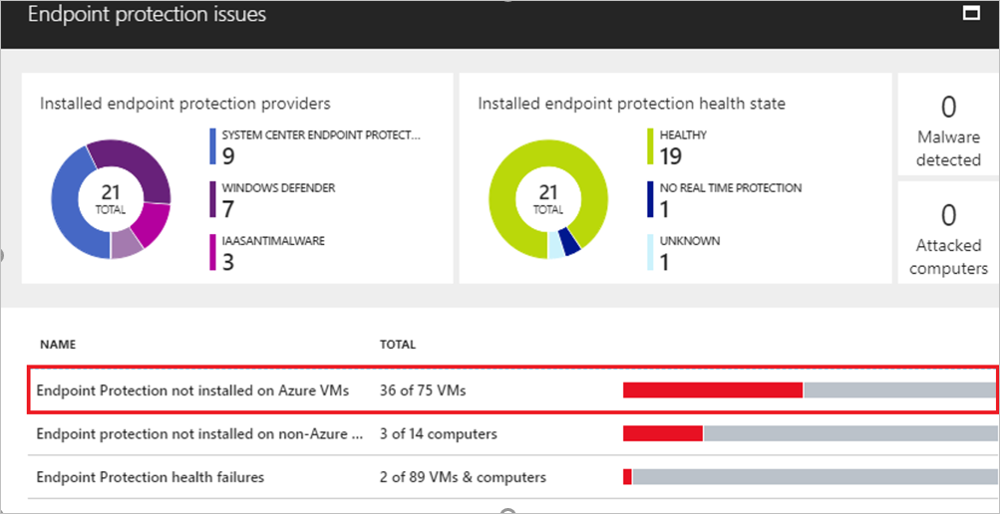

**Learn more:**

[Learn about](https://docs.microsoft.com/azure/security/azure-security-antimalware) Microsoft Antimalware.

## Best practice: Secure web apps

Migrated web apps face a couple of issues:

- Most legacy web applications tend to have sensitive information inside configuration files.  Files containing such information can present security issues when apps are backed up, or when app code is checked into or out of source control.
- In addition, when you migrate web apps residing in a VM, you are likely moving that machine from an on-premises network and firewall-protected environment to an environment facing the internet. You need to make sure that you set up a solution that does the same work as your on-premises protection resources.

Azure provides a couple of solutions:

- **Azure Key Vault**: Today web app developers are taking steps to ensure that sensitive information isn't leaked from these files. One method to secure information is to extract it from files and put it into an Azure Key Vault.
    - You can use Key Vault to centralize storage of app secrets, and control their distribution. It avoids the need to store security information in app files.
    - Apps can security access information in the vault using URIs, without needing custom code.
    - Azure Key Vault allows you to lock down access via Azure security controls and to seamlessly implement 'rolling keys'. Microsoft does not see or extract your data.
- **App Service Environment**: If an app you migrate needs extra protection, you can consider adding an App Service Environment and Web Application Firewall to protect the app resources.
    - The Azure App Service Environment provides a fully isolated and dedicated environment in which to running App Service apps such as Windows and Linux web apps, Docker containers, mobile apps, and functions.
    - It's useful for apps that are very high scale, require isolation and secure network access or have high memory utilization
- **Web Application Firewall**: A feature of Application Gateway that provides centralized protection for web apps.
    - It protects web apps without requiring backend code modifications.
    - It protects multiple web apps at the same time behind an application gateway.
    - Web application firewall can be monitored using Azure Monitor, and is integrated into Azure Security Center.

**Azure Key Vault**

**Learn more:**

- [Get an overview](https://docs.microsoft.com/azure/key-vault/key-vault-overview) of Azure Key Vault.
- [Learn about](https://docs.microsoft.com/azure/application-gateway/waf-overview) Web application firewall.
- [Get an introduction](https://docs.microsoft.com/azure/app-service/environment/intro) to App Service Environments.
- [Learn how to](https://docs.microsoft.com/azure/key-vault/tutorial-web-application-keyvault) configure a web app to read secrets from Key Vault.
- [Learn about](https://docs.microsoft.com/azure/application-gateway/waf-overview) Web Application Firewall

## Best practice: Review subscriptions and resource permissions

As you migrate your workloads and run them in Azure, staff with workload access move around. Your security team should review access to your Azure tenant and resource groups on a regular basis. Azure provides a number of offerings for identity management and access control security, including role-based access control (RBAC) to authorize permissions to access Azure resources.

- RBAC assigns access permissions for security principals. Security principals represent users, groups (a set of users), service principals (identity used by apps and services), and managed identities (an Azure Active Directory identity automatically managed by Azure).
- RBAC can assign roles to security principles, such as owner, contributor and reader, and role definitions (a collection of permissions) that define the operations that can be performed by the roles.
- RBAC can also set scopes that set the boundary for a role. Scope can be set at a number of levels, including a management group, subscription, resource group, or resource
- Ensure that admins with Azure access are only able to access resources  that you want to allow.  If the predefined roles in Azure aren't granular enough, you can create custom roles to separate and limit access permissions.

**Access control - IAM**
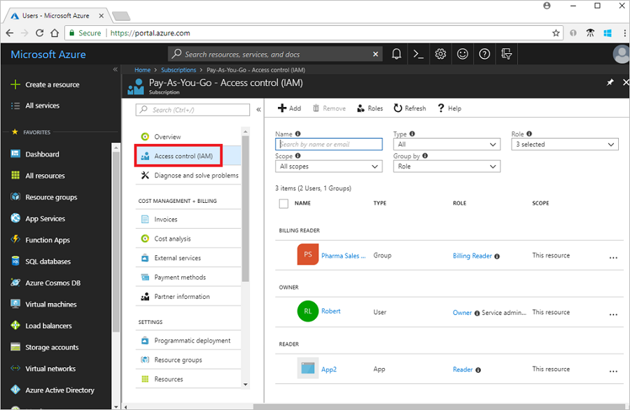

**Learn more:**

- [About](https://docs.microsoft.com/azure/role-based-access-control/overview) RBAC.
- [Learn](https://docs.microsoft.com/azure/role-based-access-control/role-assignments-portal) to manage access using RBAC and the Azure portal.
- [Learn about](https://docs.microsoft.com/azure/role-based-access-control/custom-roles) custom roles.

## Best practice: Review audit and security logs

Azure Active Directory (AD) provides activity logs that appear in Azure Monitor. The logs capture the operations performed in Azure tenancy, when they occurred, and who performed them. 

- Audit logs show the history of tasks in the tenant. Sign-ins activity logs show who carried out the tasks. 
- Access to security reports depends on your Azure AD license. In Free and Basic you get a list of risky users and sign-ins. In Premium 1 and Premium 2 editions you get underlying event information.
- You can route activity logs to a number of endpoints for long-term retention and data insights.
- Make it a common practice to review the logs or integrate your security information and event management (SIEM) tools to automatically review abnormalities.  If you're not using Premium 1 or 2, you'll need to do a lot of analysis yourself or using your SIEM system.  Analysis includes looking for risky sign-ins and events, and other user attack patterns.

**Azure AD Users and Groups**
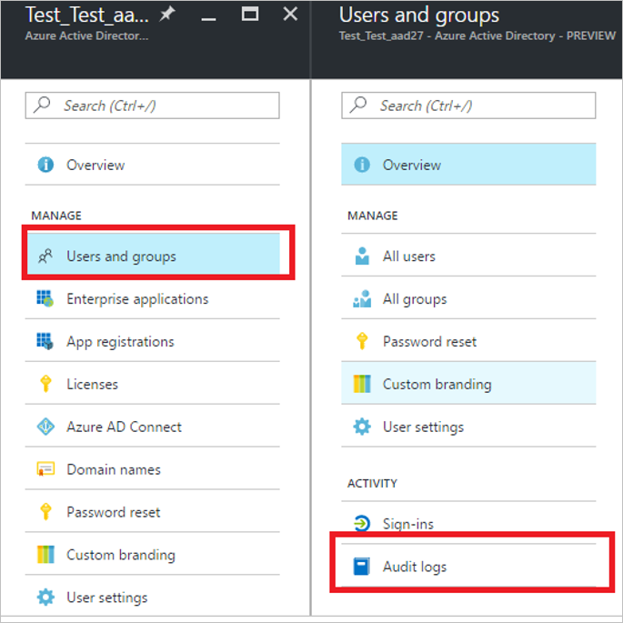

**Learn more:**

- [Learn about](https://docs.microsoft.com/azure/active-directory/reports-monitoring/concept-activity-logs-azure-monitor) Azure AD activity logs in Azure Monitor.
- [Learn how to](https://docs.microsoft.com/azure/active-directory/reports-monitoring/concept-audit-logs) audit activity reports in the Azure AD portal.

## Best practice: Evaluate other security features

Azure provides a number of other security features that provide advanced security options. Some of these best practices require add-on licenses and premium options.

- **Implement Azure AD administrative units (AU)**: Delegating administrative duties to support staff can be tricky with just basic Azure access control.  Giving support staff access to administer all the groups in Azure AD might not be the ideal approach for organizational security.  Using AU allows you to segregate Azure resources into containers in a similar way to on-premises organizational units (OU).  To use AU the AU admin must have a premium Azure AD license. [Learn more](https://docs.microsoft.com/azure/active-directory/users-groups-roles/directory-administrative-units).
- **Use multifactor authentication (MFA)**: If you have a premium Azure AD license you can enable and enforce MFA on your admin accounts. Phishing is the most common way that accounts credentials are compromised.  Once a bad actor has admin account credentials,there's no stopping them from far-reaching actions, such as deleting all your resource groups. You can set MFA up in a number of ways, including with email, authenticator app, and phone text messages. As an admin you can select the least intrusive option. MFA integrates with threat analytics and conditional access policies to randomly require an MFA challenge respond. Learn more about [security guidance](https://docs.microsoft.com/azure/active-directory/authentication/multi-factor-authentication-security-best-practices), and [how to set up](https://docs.microsoft.com/azure/active-directory/authentication/multi-factor-authentication-security-best-practices) MFA.
- **Implement conditional access**: In most small and medium size organizations, Azure admins and the support team are probably located in a single geography. In this case, most logins will come from the same areas. If the IP addresses of these locations are fairly static, it makes sense that you shouldn't see administrator logins from outside these areas. Even in an event in which a remote bad actor compromises an admin's credentials, you can implement security features like conditional access combined with MFA to prevent login from remote locations, or from spoofed locations from random IP addresses. [Learn more](https://docs.microsoft.com/azure/active-directory/conditional-access/overview) about conditional access, and [review best practices](https://docs.microsoft.com/azure/active-directory/conditional-access/best-practices) for conditional access in Azure AD.
- **Review Enterprise Application permissions**: Over time, admins click Microsoft and third-party links without knowing their impact on the organization. Links can present consent screens that assign permissions to Azure apps, and might allow access to read Azure AD data, or even full access to manage your entire Azure subscription. You should regularly review the apps to which your admins and users have allowed access to Azure resources. You should ensure that these apps have only the permissions that are necessary. Additionally, quarterly or semi-annually you can email users with a link to app pages so that they're aware of the apps to which they've allowed access to their organizational data. [Learn more](https://docs.microsoft.com/azure/active-directory/manage-apps/application-types) about application types, and [how to control](https://docs.microsoft.com/azure/active-directory/manage-apps/remove-user-or-group-access-portal) app assignments in Azure AD.

## Managed migrated workloads

In this section we'll recommend some best practices for Azure management, including:

- **Manage resources**: Best practices for Azure resource groups and resources, including smart naming, preventing accidental deletion, managing resource permissions, and effective resource tagging.
- **Use blueprints**: Get a quick overview on using blueprints for building and managing your deployment environments.
- **Review architectures**: Review sample Azure architectures to learn from as you build your post-migration deployments.
- **Set up management groups**: If you have multiple subscriptions, you can gather them into management groups, and apply governance settings to those groups.
- **Set up access policies**: Apply compliance policies to your Azure resources.
- **Implement a BCDR strategy**: Put together a business continuity and disaster recovery (BCDR) strategy to keep data safe, your environment resilient, and resources up and running when outages occur.
- **Manage VMs**: Group VMs into availability groups for resilience and high availability. Use managed disks for ease of VM disk and storage management.
- **Monitor resource usage**: Enable diagnostic logging for Azure resources, build alerts and playbooks for proactive troubleshooting, and use the Azure dashboard for a unified view of your deployment health and status.
- **Manage support and updates**: Understand your Azure support plan and how to implement it, get best practices for keeping VMs up-to-date, and put processes in place for change management.

## Best practice: Name resource groups

Ensuring that your resource groups have meaningful names that admins and support team members can easy recognize and navigate will drastically improve productivity and efficiency.
- We recommend following Azure naming conventions.
- If you're synchronizing your on-premises AD DS to Azure AD using AD Connect, consider matching the names of security groups on-premises to the names of resource groups in Azure.

**Resource group naming**
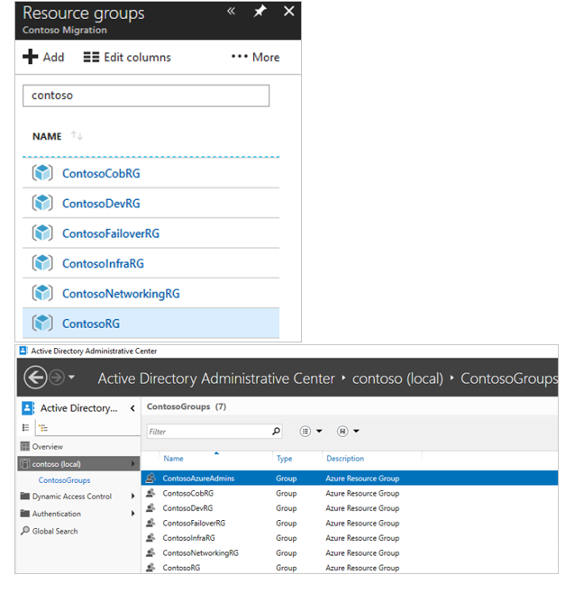

**Learn more:**

[Learn about](https://docs.microsoft.com/azure/architecture/best-practices/naming-conventions) naming conventions

## Best practice: Implement delete locks for resource groups

The last thing you need is for a resource group to disappear because it was deleted accidentally. We recommend that you implement delete locks so that this doesn't happen.

**Delete locks**

**Learn more:**

[Learn about](https://docs.microsoft.com/azure/azure-resource-manager/resource-group-lock-resources) locking resources to prevent unexpected changes.

## Best practice: Understand resource access permissions 

A subscription owner has access to all the resource groups and resources in your subscription.
- Add people sparingly to this valuable assignment. Understanding the ramifications of these types of permissions is important in keeping your environment secure and stable.
- Make sure you place resources in appropriate resources groups:
    - Match resources with a similar lifecycle together. Ideally, you shouldn't need to move a resource when you need to delete an entire resource group.
    - Resources that support a function or workload should be placed together for simplified management.

**Learn more:**

[Learn about](https://azure.microsoft.com/blog/organizing-subscriptions-and-resource-groups-within-the-enterprise/) organizing subscriptions and resource groups.

## Best practice: Tag resources effectively

Often, using only a resource group name related to resources won't provide enough metadata for effective implementation of mechanisms such as internal billing or management within a subscription.
- As a best practice, you should use Azure tags to add useful metadata that can be queried and reported on. 
- Tags provide a way to logically organize resources with properties that you define.  Tags can be applied to resource groups or resources directly.
- Tags can be applied on a resource group or on individual resources. Resource group tags aren't inherited by the resources in the group.
- You can automate tagging using Powershell or Azure Automation, or tag individual groups and resources. -tagging approach or a self-service one.  If you have a request and change management system in place, then you can easily utilize the information in the request to populate your company-specific resource tags.

**Tagging**
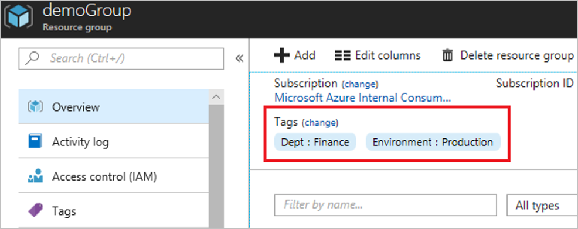

**Learn more:**

- [Learn about](https://docs.microsoft.com/azure/azure-resource-manager/resource-group-using-tags) tagging and tag limitations.
- [Review](https://docs.microsoft.com/azure/azure-resource-manager/resource-group-using-tags#powershell) PowerShell and CLI examples to set up tagging, and to apply tags from a resource group to its resources.
- [Read](http://www.azurefieldnotes.com/2016/07/18/azure-resource-tagging-best-practices/) Azure tagging best practices.

## Best practice: Implement blueprints

Just as blueprint allows engineers and architects to sketch a project's design parameters, Azure Blueprints enable cloud architects and central IT groups to define a repeatable set of Azure resources that implements and adheres to an organization's standards, patterns, and requirements. Using Azure blueprints development teams can rapidly build and create new environments that meet organizational compliance requirements, and that have a set of built-in components, such as networking, to speed up development and delivery.

- Use blueprints to orchestrate the deployment of resource groups, Azure Resource Manager templates, and policy and role assignments.
- Azure blueprints are stored in a globally distributed Azure Cosmos DB. Blueprint objects are replicated to multiple Azure regions. Replication provides low latency, high availability, and consistent access to blueprint, regardless of the region to which a blueprint deploys resources.

**Blueprints**
c

**Learn more:**

- [Read](https://docs.microsoft.com/azure/governance/blueprints/overview) about blueprints.
- [Review](https://azure.microsoft.com/blog/customizing-azure-blueprints-to-accelerate-ai-in-healthcare/) a blueprint example used to accelerate AI in healthcare.

## Best practice - Review Azure reference architectures

Building secure, scalable, and manageable workloads in Azure can be daunting.  With continual changes, it can be difficult to keep up with different features for an optimal environment. Having a reference to learn from can be helpful when designing and migrating your workloads.  Azure and Azure partners have built several sample reference architectures for various types of environments. These samples are designed to provide ideas that you can learn from and build on. 

Reference architectures are arranged by scenario. They contain recommend practices, and advice on management, availability, scalability, and security.

Learn more:

[Learn about](https://docs.microsoft.com/azure/architecture/reference-architectures/) Azure reference architectures.
[Review](https://docs.microsoft.com/azure/architecture/example-scenario/) Azure example scenarios.

## Best practice: Manage resources with Management Groups

If your organization has multiple subscriptions, you need to manage access, policies, and compliance for them. Azure management groups provide a level of scope above subscriptions.

- You organize subscriptions into containers called management groups, and apply governance conditions to them.
- All subscriptions in a management group automatically inherit the management group conditions.
- Management groups provide enterprise-grade management at a large scale, no matter what type of subscriptions you have.
- For example, you can apply a management group policy that limits the regions in which VMs can be created. This policy is then applied to all management groups, subscriptions, and resources  under that management group.
- You can build a flexible structure of management groups and subscriptions, to organize your resources into a hierarchy for unified policy and access management.

The following diagram shows an example of creating a hierarchy for governance using management groups.
**Management groups**
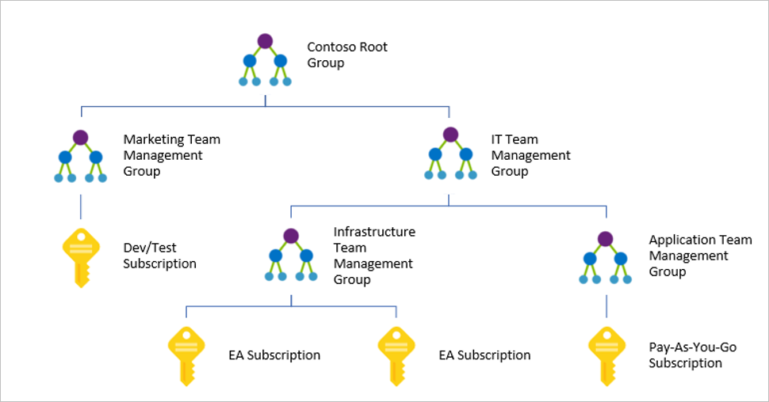

**Learn more:**
[Learn more](https://docs.microsoft.com/azure/governance/management-groups/index) about organizing resources into management groups.

## Best practice: Deploy Azure Policy

Azure Policy is a service in Azure that you use to create, assign and, manage policies.

- Policies enforce different rules and effects over your resources, so those resources stay compliant with your corporate standards and service level agreements.
- Azure Policy evaluates your resources, scanning for those not compliant with your policies.
- For example, you could create a policy that allows only a specific SKU size for VMs in your environment. Azure Policy will evaluate this setting when creating and updating resources, and when scanning existing resources. 
- Azure provides some built-in policies that you can assign, or you can create your own.

**Azure Policy**
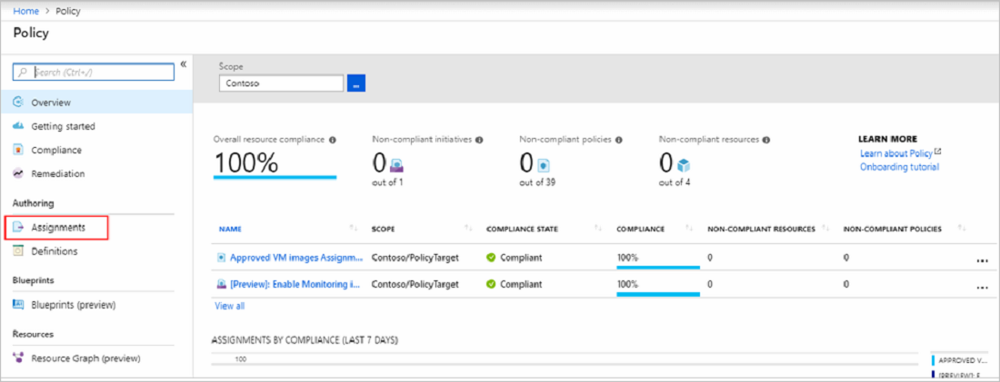

**Learn more:**
- [Get an overview](https://docs.microsoft.com/azure/governance/policy/overview) of Azure Policy.
- [Learn about](https://docs.microsoft.com/azure/governance/policy/tutorials/create-and-manage) creating and managing policies to enforce compliance.

## Best practice: Implement a BCDR strategy

Planning for business continuity and disaster recovery (BCDR), is a critical exercise that must be completed during planning for migration to Azure. In legal terms, your contract includes a force majeure clause that excuse obligations due to a greater force such as hurricanes or earthquakes. However, you also have obligations around an ability to ensure that services will continue to run, and recover where necessary, when disaster strike. Your ability to do this can make or break your company's future.

The Azure platform provides a number of resilience features:

- **Region pairing**: Azure pairs regions to provide regional protection within data residency boundaries. Azure ensures physical isolation between region pairs, prioritizes the recovery of one region in the pair in case of a broad outage, deploys system updates separately in each region, and allows features such as Azure geo-redundant storage to replicate across the regional pairs.
- **Availability zones**: Availability zones protect against failure of an entire Azure datacenter by establishing physical separate zones with an Azure region. Each zone has a distinctive power source, network infrastructure, and cooling mechanism.
- **Availability sets**: Availability sets protect against failures within a datacenter. You group VMs in availability sets to keep them highly available. Within each availability set, Azure implements multiple fault domains that group together underlying hardware with a common power source and network switch, and update domains that group together underlying hardware that can undergo maintenance, or be rebooted, at the same time. As an example, when a workload is spread across Azure VMs, you can put two or more VMs for each app tier into a set. For example, you can place frontend VMs in one set, and data tier VMs in another. Since only one update domain is every rebooted at a time in a set, and Azure ensures that VMs in a set are spread across fault domains, you ensure that not all VMs in a set will fail at the same time.

When migrating to Azure, it's important to understand that although the Azure platform provides these inbuilt capabilities and other BCDR services, you need to design your Azure deployment to take advantage of Azure resilience, high availability, disaster recovery, and backup services and features.
- Your BCDR solutions will depend your company objectives, and will be influenced by your Azure deployment. Infrastructure as a Service (IaaS) and Platform as a Service (PaaS) deployments present different challenges for BCDR.
- Once in place, your BCDR solutions should be tested regularly to check that your strategy remains viable.

## Best practice: Back up your deployment

In most cases an on-premises workload is retired after migration, and your on-premises strategy for backing up data must be extended or replaced. If you migrate your entire datacenter to Azure, you'll need to design and implement a full backup solution using Azure technologies, or third-party integrated solutions. Your selected backup solution will be different, depending on your Azure deployment. 

### Back up an IaaS deployment

For workloads running on Azure IaaS VMs you should consider using the following backup solutions:

- **Azure Backup**: Provides application-consistent backups for Azure Windows and Linux VMs.
- **Storage snapshots**: Take snapshots of blob storage.

#### Azure Backup

Azure Backup backs up creates data recovery points that are stored in Azure storage. Azure Backup can back up Azure VM disks, and Azure Files (preview). Azure Files provide file shares in the cloud, accessible via SMB.
   
- You can use Azure Backup to back up VMs in a couple of ways:

    - **Direct backup from VM settings**:
        - Azure Backup is integrated into VM options in the Azure portal.
        - You can back up the VM once a day, and restore the VM disk. 
        - Azure Backup takes app-aware data snapshots (VSS).
        - No agent is installed on the VM.
    - **Direct backup in a Recovery Services vault**:
        - You deploy an Azure Backup Recovery Services vault, and select VMs for backup.
        - This method provides a single location to track and manage backups, and additional backup and restore options. 
        - Azure Backup installs the Microsoft Azure Recovery Services (MARS) agent on the VM.
        - Backup is up to three times a day.
        - Backup is at the file or folder level, and isn't app-aware. Linux isn't supported.
    - **Azure Backup Server: Protect the VM to Azure Backup Server**:
        - Azure Backup Server is provided free with Azure Backup.
        - The VM is backed up to local Azure Backup Storage.
        - You then back up the Azure Backup Server to Azure in a Recovery Services vault.
        - Backup is app-aware, with full granularity over backup frequently and retention
        - You can back up at the app level. For example by backing up SQL Server or SharePoint.

Azure Backup automatically allocates and manages storage using a pay-as-you-go model for the storage you consume.
    - Storage can be assigned as LRS or GRS.
    - Azure Backup encrypts data in-flight using AES 256 and sends it over HTTPS to Azure. Backed-up data at-rest in Azure is encrypted using [Storage Service Encryption (SSE)](https://docs.microsoft.com/azure/storage/common/storage-service-encryption?toc=%2fazure%2fstorage%2fqueues%2ftoc.json), and  data for transmission and storage.

**Azure Backup**
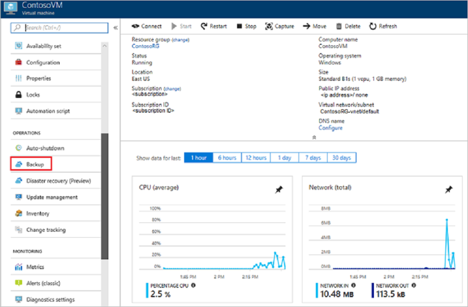

**Learn more:**

- [Learn about](https://docs.microsoft.com/azure/backup/backup-introduction-to-azure-backup) different types of backups.
- [Plan a backup infrastructure](https://docs.microsoft.com/azure/backup/backup-azure-vms-introduction) for Azure VMs.

#### Storage snapshots

Azure VMs are stored as page blobs in Azure Storage. 

- Snapshots capture the blob state at a specific point in time.
- As an alternative backup method for Azure VM disks, you can take a snapshot of storage blobs and copy them to another storage account. 
- You can copy an entire blob, or use an incremental snapshot copy to copy only delta changes and reduce storage space.
- As an extra precaution, you can enable soft delete for blob storage accounts. With this feature enabled, a blob that's deleted is marked for deletion but not immediately purged. During the interim period the blob can be restored.

**Learn more:**

- [Learn about](https://docs.microsoft.com/azure/storage/blobs/storage-blobs-introduction Azure blob storage.
- [Learn how to](https://docs.microsoft.com/azure/storage/blobs/storage-blob-snapshots) create a blob snapshot.
- Review a sample scenario](https://azure.microsoft.com/blog/microsoft-azure-block-blob-storage-backup/) for blob storage backup.
- [Read about](https://docs.microsoft.com/azure/storage/blobs/storage-blob-soft-delete) soft delete.
- [Review](https://docs.microsoft.com/azure/storage/common/storage-disaster-recovery-guidance?toc=%2fazure%2fstorage%2fblobs%2ftoc.json) What to do if an Azure Storage outage occurs?

#### Third-party backup

In addition, you can use third-party solutions to back up Azure VMs and storage containers to local storage or other cloud providers. [Learn more](https://azuremarketplace.microsoft.com/marketplace/apps?search=backup&page=1) about backup solutions in the Azure marketplace. 

### Back up a PaaS deployment

Unlike IaaS where you manage your own VMs and infrastructure, in a PaaS model platform and infrastructure is managed by the provider, leaving you to focus on core app logic and capabilities. With so many different types of PaaS services, each service will be evaluated individually for the purposes of backup. We'll look at two common Azure PaaS services - Azure SQL Database, and Azure Functions.

#### Back up Azure SQL Database

Azure SQL Database is a fully managed PaaS Database Engine. It provides a number of business continuity features, including automate backup.

- SQL Database automatically performs weekly full database backups, and differential backups every 12 hours. Transaction log backups are taken every five to ten minutes to protect the database from data loss.
- Backups are transparent and don't incur additional cost.
- Backups are stored in RA-GRS storage for geo-redundancy, and replicated to the paired geographical region.
- Backup retention depends on the purchasing model. DTU-based service tiers go from seven days for Basic tier to 35 days for other tiers.
- You can restore a database to a point-in-time within the retention period. You can also restore a deleted database, restore to a different geographical region, or restore from a long-term backup if the database has a long-term retention policy (LTR).

**Azure SQL backup**
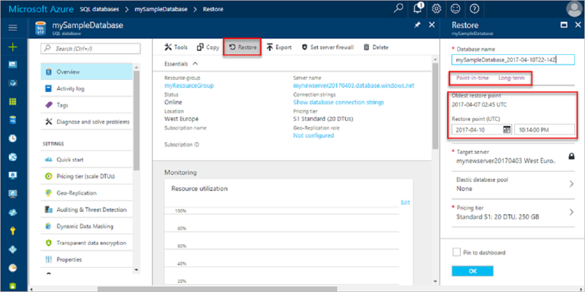

**Learn more:**
- [Automated backups](https://docs.microsoft.com/azure/sql-database/sql-database-automated-backups) for SQL Database.
- [Recover a database](https://docs.microsoft.com/azure/sql-database/sql-database-recovery-using-backups) using automated backups.

 
#### Back up Azure Functions

Since Azure Functions functions more or less as code, you should back them up using the same methods that you use to protect code such as source control in GitHub or Azure DevOps Services

**Learn more:**

[Data protection](https://docs.microsoft.com/azure/devops/articles/team-services-security-whitepaper?view=vsts) for Azure DevOps.

## Best practice: Set up a disaster recovery strategy

In addition to protecting data, BCDR  planning must consider how to keep apps and workloads available in case of disaster. 

### Set up disaster recovery for IaaS apps

For workloads running on Azure IaaS VMs and Azure storage consider these solutions:

- **Azure Site Recovery**: Orchestrates replication of Azure VMs in a primary to a secondary region. When outages occur, you fail over from the primary region to the secondary, and users can continue to access apps. When things are back to normal, you fail back to the primary region.
- **Azure storage**: Azure provides in-build resilience and high availability for different types of storage:

#### Azure Site Recovery 

Azure Site Recovery is the primary Azure service for ensuring that Azure VMs can be brought online and VM apps made available when outages occur. Site Recovery replicates VMs from a primary to secondary Azure region. When disaster strikes, you fail VMs over from the primary region, and continue accessing them as normal in the secondary region. When operations return to normal, you can fail back VMs to the primary region.

**Site Recovery**
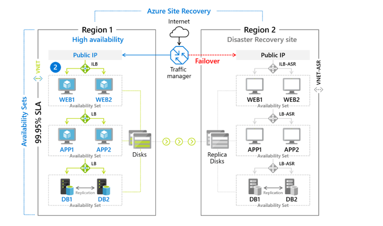

**Learn more:**
- [Review](https://docs.microsoft.com/azure/virtual-machines/virtual-machines-disaster-recovery-guidance) disaster recovery scenarios for Azure VMs.
- [Learn how to](https://docs.microsoft.com/azure/site-recovery/azure-to-azure-replicate-after-migration) set up disaster recovery for an Azure VM after migration.

#### Azure storage

Azure storage is replicated for built-in resilience and high availability.

-   **Geo-redundant storage (GRS)**: Protects against a region-wide outage, with at least 99.99999999999999% (16 9's) durability of objects over a given year.
    - Storage data replicates to the secondary region with which your primary region is paired.
    - If the primary region goes down, and Microsoft initiates a failover to the secondary region, you'll have read access to your data.
- **Read access geo-redundant storage (RA-GRS)**: Protects against a region-wide outage.
    - Storage data replicates to the secondary region.
    - You have guaranteed read access to replicated data in the secondary region, regardless of whether or not Microsoft initiates a failover. where two or more data centers in the same region might have an issue yet your data is still available in a geographically separated region.
-   **Zone redundant storage (ZRS)**:  Protects against datacenter failure.
    - ZRS replicates data synchronously across three storage clusters in a single region. Clusters and physically separated and each located in its own availability zone.
    - If disaster occurs, your storage will still be available. ZRS should be the minimum target for mission-critical workloads.

**Learn more:**

[Learn about](https://docs.microsoft.com/azure/storage/common/storage-redundancy) Azure storage replication.

### Set up disaster recovery for PaaS workloads

Let's consider disaster recovery options for our PaaS workload examples.

#### Disaster recovery of Azure SQL Server

There are a number of different options, each impacting data loss, recovery time, and cost.

You can use failover groups and active geo-replication to provide resilience against regional outages and catastrophic failures

- **Active geo-replication**: Deploy active geo-replication for quick disaster recovery if a datacenter outage occurs, or a connection can't be made to a primary database.
    - Geo-replication continually creates readable replicas of your database in up to four secondaries in the same or different regions.
    - In an outage, you fail over to one of the secondary regions, and bring your database back online.
- **Auto-failover groups**: Auto-failover groups extend active geo-replication with transparent failover of multiple databases.
    - An auto-failover group provides a powerful abstraction of active geo-replication with group level database replication and automatic failover.
    - You create a failover group that contains a primary server hosting one or more primary databases, a secondary server hosting read-only replicas of the primary databases, listeners that point to each server, and an automatic failover policy.
    - The specified listener endpoints remove the need to change the SQL connection string after failover.
- **Geo-restore**: 
    -   Geo-restore allows you to recover the database to a different region. The automated backup of all Azure databases will be replicated to a secondary region in the background. It will always restore the database from the copy of backup files stored in the secondary region.
-   **Zone-redundant databases** provide built-in support for Azure availability zones.
    - Zone-redundant databases enhance high availability for Azure SQL Server in the event of a data center failure.
    - With zone-redundancy, you can place redundant database replicas within different availability zones in a region. 

**Geo-replication**

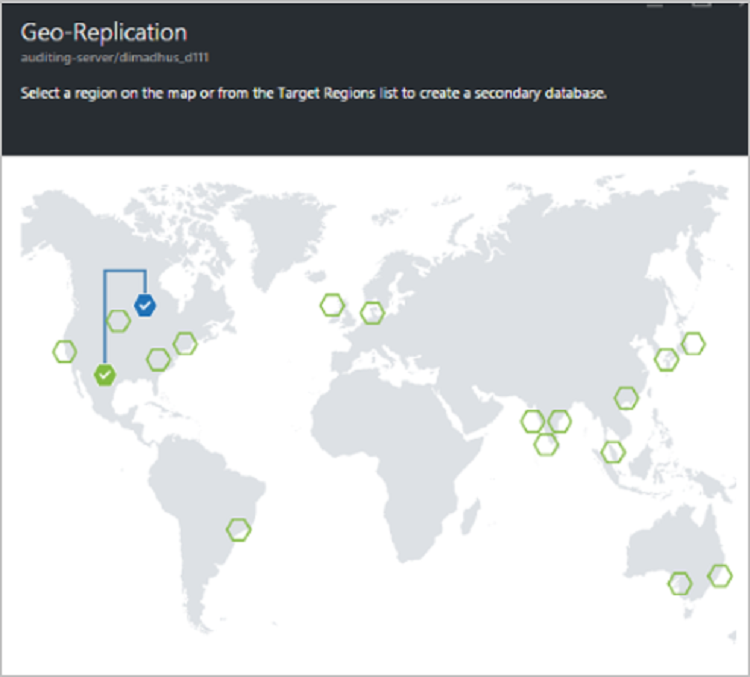

**Learn more:**
- [Learn about](https://docs.microsoft.com/azure/sql-database/sql-database-high-availability) high availability for Azure SQL Server.
- [Read](https://azure.microsoft.com/blog/azure-sql-databases-disaster-recovery-101/) Azure SQL Databases 101 for disaster recovery.
- [Get an overview](https://docs.microsoft.com/azure/sql-database/sql-database-geo-replication-overview) of active geo-replication and failover groups.
- [Learn about](https://docs.microsoft.com/azure/sql-database/sql-database-designing-cloud-solutions-for-disaster-recovery) designing for disaster recovery.
- [Get best practices](https://docs.microsoft.com/azure/sql-database/sql-database-geo-replication-overview#best-practices-of-using-failover-groups-for-business-continuity) for failover groups.
- [Get best practices](https://docs.microsoft.com/azure/sql-database/sql-database-geo-replication-security-config) for security after geo-restore or failover.
- [Learn about](https://docs.microsoft.com/azure/sql-database/sql-database-high-availability#zone-redundant-configuration) zone redundancy
- [Learn how to](https://docs.microsoft.com/azure/sql-database/sql-database-disaster-recovery-drills) perform a disaster recovery drill for SQL database.

### Disaster recovery for Azure Functions

If the compute infrastructure in Azure fails, an Azure function app might become unavailable.

- To minimize the possibility of such downtime, use two function apps deployed to different regions.
- Azure Traffic Manager can be configured to detect problems in the primary function app, and automatically redirect traffic to the function app in the secondary region
- Traffic Manager with geo-redundant storage allows you to have the same function in multiple regions, in case of regional failure

**Traffic Manager**
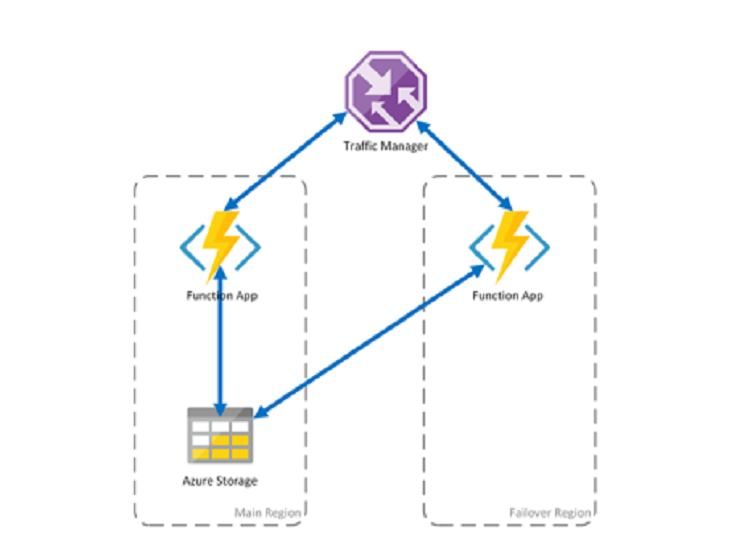

**Learn more:**

- [Learn about](https://docs.microsoft.com/azure/architecture/resiliency/disaster-recovery-azure-applications) disaster recovery for Azure apps.
- [Learn about](https://docs.microsoft.com/azure/azure-functions/durable/durable-functions-disaster-recovery-geo-distribution) disaster recovery and geo-distribution for durable Azure functions.

### Best Practice: Use managed disks and availability sets

Azure uses availability sets to logically group VMs together, and to isolate VMs in a set from other resources. VMs in an availability set are spread across multiple fault domains with separate subsystems, to protect against local failures, and are also spread across multiple update domains so that not all VMs in a set reboot at the same time.

Azure-Managed Disks simplify disk management for Azure IaaS VMs, by managing the storage accounts associated with the VM disks.

- We recommend that you use managed disks where possible. You only have to specify the type of storage you want to use and the size of disk you need, and Azure creates and manages the disk for you, behind the scenes.
- You can convert existing disks to managed.
- You should create VMs in availability sets for high resilience and availability. When planned or unplanned outages occur, availability sets ensure that at least one of your VMs in the set continues to be available.

**Managed disks**
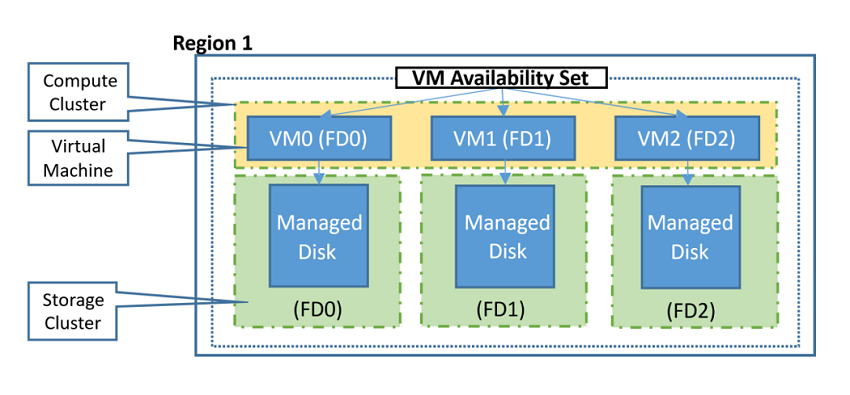

**Learn more:**
- [Get an overview](https://docs.microsoft.com/azure/virtual-machines/windows/managed-disks-overview) of managed disks.
- [Learn about](https://docs.microsoft.com/azure/virtual-machines/windows/convert-unmanaged-to-managed-disks) converting disks to managed.
- [Learn how to](https://docs.microsoft.com/azure/virtual-machines/windows/manage-availability) manage the availability of Windows VMs in Azure.

## Best Practice: Monitor resource usage and performance 

You might have moved your workloads to Azure for its immense scaling capabilities. However, moving your workload doesn't mean that Azure will automatically implement scaling without your input. As an example:

- If your marketing organization pushes a new TV advertisement that drives 300% more traffic, this could cause site availability issues. Your newly migrated workload might hit assigned limits and crash.
- Another example might be a distributed denial-of-service (DDoS) attack on your migrated workload. In this case you might not want to scale, but to prevent the source of the attacks from reaching your resources.

These two cases have different resolutions, but for both you need an insight into what's happening with usage and performance monitoring.

- Azure Monitor can help surface these metrics, and provide response with alerts, autoscaling, event hubs, logic apps and more.
- In addition to Azure monitoring, you can integrate your third-party SIEM application to monitor the Azure logs for auditing and performance events.

**Azure Monitor**
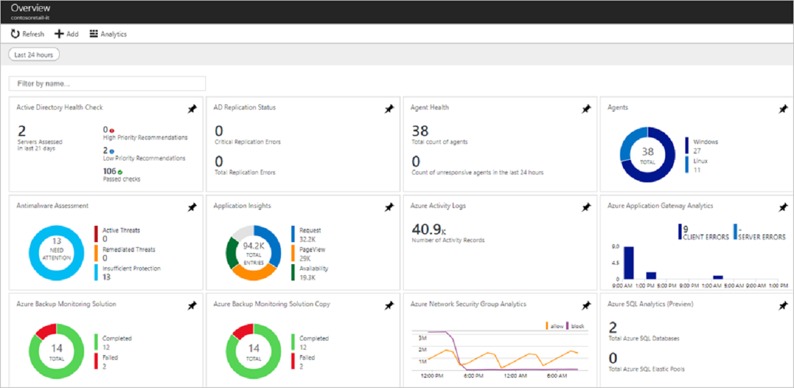

**Learn more:**

- [Learn about](https://docs.microsoft.com/azure/azure-monitor/overview) Azure Monitor.
- [Get best practices](https://docs.microsoft.com/azure/architecture/best-practices/monitoring) for monitoring and diagnostics.
- [Learn about](https://docs.microsoft.com/azure/architecture/best-practices/auto-scaling) autoscaling.
- [Learn how to](https://docs.microsoft.com/azure/security-center/security-center-export-data-to-siem) route Azure data to a SIEM tool.

## Best practice: Enable diagnostic logging

Azure resources generate a fair number of logging metrics and telemetry data.

- By default, most resource types don't have diagnostic logging enabled.
- By enabling diagnostic logging across your resources, you can query logging data, and build alerts and playbooks based on it.
- When you enable diagnostic logging, each resource will have a specific set of categories. You select one or more logging categories, and a location for the log data. Logs can be sent to a storage account, event hub, or to Log Analytics. 

**Diagnostic logging**
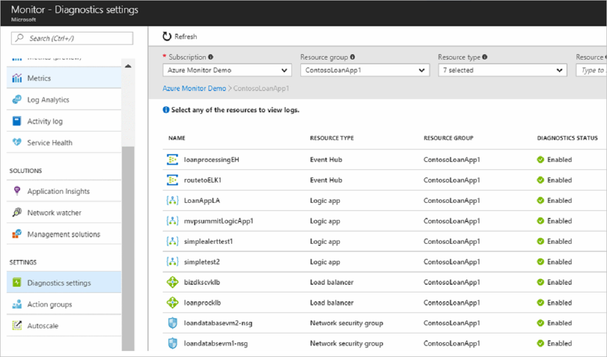

**Learn more:**

- [Learn about](https://docs.microsoft.com/azure/monitoring-and-diagnostics/monitoring-overview-of-diagnostic-logs) collecting and consuming log data.
- [Learn what's supported](https://docs.microsoft.com/azure/monitoring-and-diagnostics/monitoring-diagnostic-logs-schema) for diagnostic logging.

## Best practice: Set up alerts and playbooks

With diagnostic logging enabled for Azure resources, you can start to use logging data to create custom alerts.

- Alerts proactively notify you when conditions are found in your monitoring data. You can then address issues before system users notice them. You can alert on things like metric values, log search queries, activity log events, platform health, and website availability.
- When alerts are triggered, you can run a Logic App Playbook. A playbook helps you to automate and orchestrate a response to a specific alert. Playbooks are based on Azure Logic Apps. You can use Logic App templates to create playbooks, or create your own.
- As a simple example, you can create an alert that triggers when a port scan happens against a network security group.  You can set up a playbook that runs and locks down the IP address of the scan origin.
- Another example might be an app with a memory leak.  When the memory usage gets to a certain point, a playbook can recycle the process.

**Alerts**
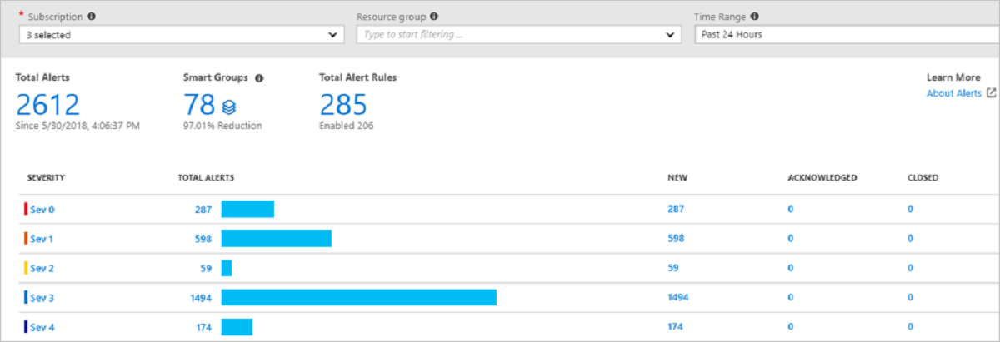

**Learn more:**
- [Learn about](https://docs.microsoft.com/azure/monitoring-and-diagnostics/monitoring-overview-alerts) alerts.
- [Learn about](https://docs.microsoft.com/azure/security-center/security-center-playbooks) security playbooks that respond to Security Center alerts.

## Best practice: Use the Azure dashboard

The Azure portal is a web-based unified console that allows you to build, manage, and monitor everything from simple web apps to complex cloud applications. It includes a customizable dashboard and accessibility options.
- You can create multiple dashboards and share them with others who have access to your Azure subscriptions.
- With this shared model, your team has visibility into the Azure environment, allowing them to be proactive when managing systems in the cloud.
- 
**Azure dashboard**
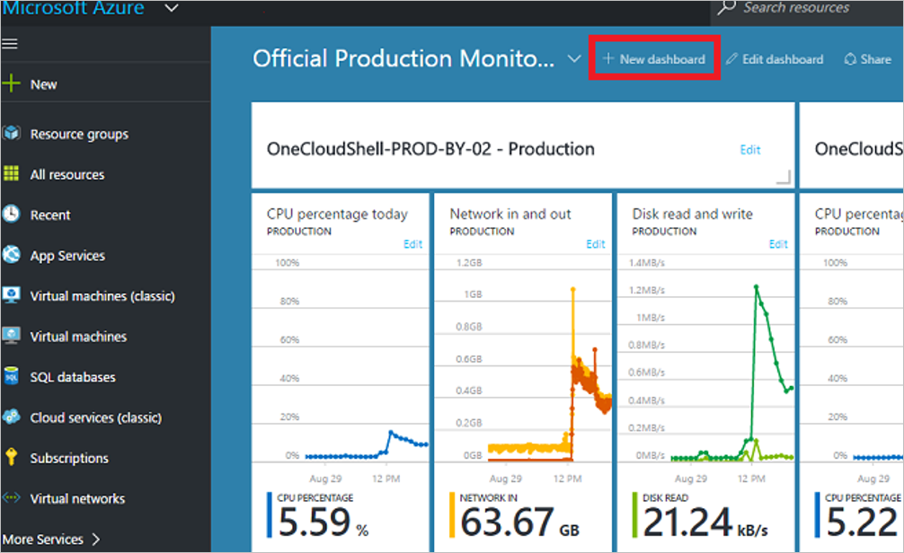

**Learn more:**

- [Learn how to](https://docs.microsoft.com/azure/azure-portal/azure-portal-dashboards) create a dashboard.
- [Learn about](https://docs.microsoft.com/azure/azure-portal/azure-portal-dashboards-structure) dashboard structure.

## Best Practice: Understand support plans

At some point you will need to collaborate with your support staff or Microsoft support staff. Having a set of policies and procedures for support during scenarios such as disaster recovery is vital. In addition your admins and support staff should be trained on implementing those policies.

- In the unlikely event that an Azure service issue impacts your workload, admins should know how to submit a support ticket to Microsoft in the most appropriate and efficient way.
- Familiarize yourself with the various support plans offered for Azure. They range from response times dedicated to Developer instances, to Premier support with a response time of less than 15 minutes.

**Support plans**
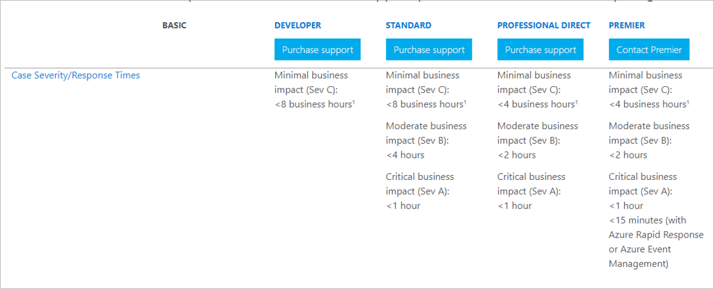

**Learn more:**
- [Get an overview](https://azure.microsoft.com/support/options/) of Azure support plans.
- [Learn about](https://azure.microsoft.com/support/legal/sla/) service level agreements (SLAs).

## Best practice - Manage updates

Keeping Azure VMs updated with the latest operating system and software updates is a massive chore. The ability to surface all VMs, to figure out which updates they need, and to automatically push those updates is extremely valuable.

- You can use Update Management in Azure Automation to manage operating system updates for machines running Windows and Linux computers that are deployed in Azure, on-premises, and in other cloud providers. 
- Use Update Management to quickly assess the status of available updates on all agent computers, and manage update installation.
- You can enable Update Management for VMs directly from an Azure Automation account. You can also update a single VM from the VM page in the Azure portal.
- In addition, Azure VMs can be registered with System Center Configuration Manager. You could then migrate the Configuration Manager workload to Azure, and do reporting and software updates from a single web interface.

**Updates**
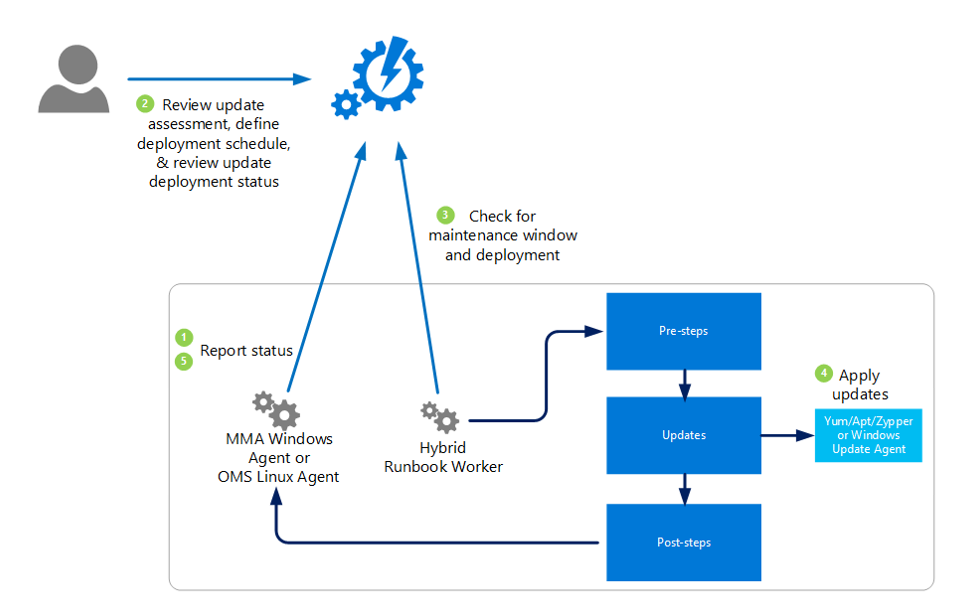

**Learn more:**

- [Learn about](https://docs.microsoft.com/azure/automation/automation-update-management) update management in Azure.
- [Learn how to](https://docs.microsoft.com/azure/automation/oms-solution-updatemgmt-sccmintegration) integrate Configuration Manager with update management.
- [Frequently asked questions](https://docs.microsoft.com/sccm/core/understand/configuration-manager-on-azure) about Configuration Manager in Azure.

## Implement a change management process

As with any production system, making any type of change can impact your environment. A change management process that requires requests to be submitted in order to make changes to production systems is a valuable addition in your migrated environment.

- You can build best practice frameworks for change management to raise awareness in administrators and support staff.
- You can use Azure Automation to help with configuration management and change tracking for your migrated workflows.
- When enforcing change management process, you can use audit logs to link Azure change logs to presumably (or not) existing change requests. So that if you see a change made without a corresponding change request, you can investigate what went wrong in the process.

Azure has a Change Tracking solution in Azure automation:

- The solution tracks changes to Windows and Linux software and files, Windows registry keys, Windows services, and Linux daemons.
- Changes on monitored servers are sent to the Log Analytics service in the cloud for processing.
- Logic is applied to the received data and the cloud service records the data.
- On the Change Tracking dashboard, you can easily see the changes that were made in your server infrastructure.

**Change management**
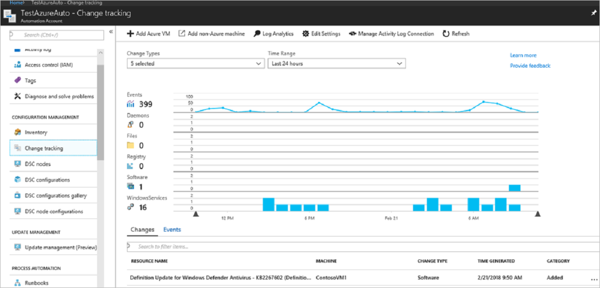

**Learn more:**

- [Learn about](https://docs.microsoft.com/azure/automation/automation-change-tracking) Change Tracking.
- [Learn about](https://docs.microsoft.com/azure/automation/automation-intro) Azure Automation capabilities.

## Next steps 

Review other best practices:

- [Best practices](migrate-best-practices-networking.md) for networking after migration.
- [Best practices](migrate-best-practices-costs.md) for cost management after migration.

