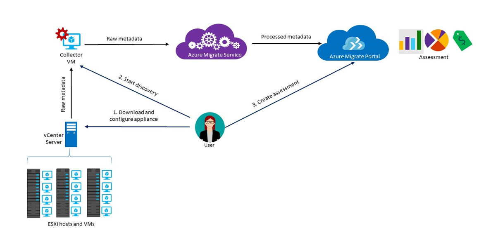

# About Azure Migrate

The Azure Migrate service assesses on-premises workloads for migration to Azure. The service assesses the migration suitability of on-premises machines, performs performance-based sizing, and provides cost estimations for running on-premises machines in Azure. If you're contemplating lift-and-shift migrations, or are in the early assessment stages of migration, this service is for you. After the assessment, you can use services such as [Azure Site Recovery](https://docs.microsoft.com/azure/site-recovery/site-recovery-overview) and [Azure Database Migration Service](https://docs.microsoft.com/azure/dms/dms-overview), to migrate the machines to Azure.

## Why use Azure Migrate?

Azure Migrate helps you to:

- **Assess Azure readiness**: Assess whether your on-premises machines are suitable for running in Azure.
- **Get size recommendations**: Get size recommendations for Azure VMs based on the performance history of on-premises VMs.
- **Estimate monthly costs**: Get estimated costs for running on-premises machines in Azure.  
- **Migrate with high confidence**: Visualize dependencies of on-premises machines to create groups of machines that you will assess and migrate together.

## Current limitations

- Currently, you can only assess on-premises VMware virtual machines (VMs) for migration to Azure VMs. The VMware VMs must be managed by vCenter Server (version 5.5, 6.0, or 6.5).
- If you want to assess Hyper-VMs and physical servers, use the [Azure Site Recovery Deployment Planner](http://aka.ms/asr-dp-hyperv-doc) for Hyper-V, and our [partner tools](https://azure.microsoft.com/migration/partners/) for physical machines.
- You can discover up to 1500 VMs in a single discovery and up to 1500 VMs in a single project. Additionally, you can assess up to 1500 VMs in a single assessment.
- If you want to discover a larger environment, you can split the discovery and create multiple projects. [Learn more](how-to-scale-assessment.md). Azure Migrate supports up to 20 projects per subscription.
- Azure Migrate only supports managed disks for migration assessment.
- You can only create an Azure Migrate project in the United States geography. This doesn't impact your ability to plan migration to any target Azure location. The geography of the migration project is used only to store metadata discovered from the on-premises environment. [Learn more](https://docs.microsoft.com/azure/migrate/resources-faq#discovery-and-assessment) about the metadata collected by Azure Migrate. The collected metadata is stored in one of the regions in the selected [Azure geography](https://azure.microsoft.com/global-infrastructure/geographies/):

**Geography** | **Regions**
--- | ---
United States | West Central US, East US

## What do I need to pay for?

[Learn more](https://azure.microsoft.com/pricing/details/azure-migrate/) about Azure Migrate pricing.

## What's in an assessment?

Assessment settings can be customized based on your needs. Assessment properties are summarized in the following table.

**Property** | **Details**
--- | ---
**Target location** | The Azure location to which you want to migrate.  Azure Migrate currently supports 30 regions. [Check regions](https://azure.microsoft.com/global-infrastructure/services/). By default, the target region is set to West US 2.
**Storage type** | the type of disks you want to allocate in Azure. This is applicable when the sizing criterion is **as on-premises**. You specify the target disk type either as premium (the default) or standard managed disks. For performance-based sizing, the disk sizing recommendation is automatically done based on the performance data of the VMs.
**Sizing criterion** | Sizing can be based on **performance history** of the on-premises VMs, or **as on-premises** (the default), without considering performance history.
**Azure offer** | The [Azure offer](https://azure.microsoft.com/support/legal/offer-details/) you're enrolled to. Azure Migrate estimates the cost accordingly.
**Azure Hybrid Benefit** | Whether you have software assurance and are eligible for [Azure Hybrid Benefit](https://azure.microsoft.com/pricing/hybrid-use-benefit/) with discounted costs.
**Reserved Instances** |  Whether you have [reserved instances](https://azure.microsoft.com/pricing/reserved-vm-instances/) in Azure. Azure Migrate estimates the cost accordingly.
**VM uptime** | The duration for which VMs will run in Azure. Cost estimations are done accordingly.
**Pricing tier** | The [pricing tier (basic/standard)](../virtual-machines/windows/sizes-general.md) for the target Azure VMs. For example, if you are planning to migrate a production environment, you might consider the standard tier, which provides VMs with low latency, but might cost more. On the other hand, in a test environment, you could use the basic tier with higher latency and lower costs. By default the [standard](../virtual-machines/windows/sizes-general.md) tier is used.
**Performance history** | By default, Azure Migrate evaluates the performance of on-premises machines using performance history for the last day, with a 95% percentile value.
**VM series** | The VM series used for size estimations. For example, if you have a production environment that you do not plan to migrate to A-series VMs in Azure, you can exclude A-series from the list or series. Sizing is based on the selected series only.   
**Comfort factor** | Azure Migrate considers a buffer (comfort factor) during assessment. This buffer is applied on top of machine utilization data for VMs (CPU, memory, disk, and network). The comfort factor accounts for issues such as seasonal usage, short performance history, and likely increases in future usage.   For example, a 10-core VM with 20% utilization normally results in a 2-core VM. However, with a comfort factor of 2.0x, the result is a 4-core VM instead. The default comfort setting is 1.3x.

## How does Azure Migrate work?

1.	You create an Azure Migrate project.
2.	Azure Migrate uses an on-premises VM called the collector appliance, to discover information about your on-premises machines. To create the appliance, you download a setup file in Open Virtualization Appliance (.ova) format, and import it as a VM on your on-premises vCenter Server.
3. You connect to the VM from the vCenter Server, and specify a new password for it while connecting.
4. You run the collector on the VM to initiate discovery.
5. The collector collects VM metadata using the VMware PowerCLI cmdlets. Discovery is agentless, and doesn't install anything on VMware hosts or VMs. The collected metadata includes VM information (cores, memory, disks, disk sizes, and network adapters). It also collects performance data for VMs, including CPU and memory usage, disk IOPS, disk throughput (MBps), and network output (MBps).
5.	The metadata is pushed to the Azure Migrate project. You can view it in the Azure portal.
6.	For the purposes of assessment, you gather the discovered VMs into groups. For example, you might group VMs that run the same application. For more precise grouping, you can use dependency visualization to view dependencies of a specific machine, or for all machines in a group and refine the group.
7.	After a group is defined, you create an assessment for it.
8.	After the assessment finishes, you can view it in the portal, or download it in Excel format.

  

## What are the port requirements?

The table summarizes the ports needed for Azure Migrate communications.

Component | Communicates with |  Details
--- | --- |---
Collector  | Azure Migrate service | The collector connects to the service over SSL port 443.
Collector | vCenter Server | By default the collector connects to the vCenter Server on port 443. If the server listens on a different port, configure it as an outgoing port on the collector VM.
On-premises VM | Log Analytics Workspace | [TCP 443] | [The Microsoft Monitoring Agent (MMA)](../log-analytics/log-analytics-windows-agent.md) uses TCP port 443 to connect to Log Analytics. You only need this port if you're using dependency visualization, that requires the MMA agent.

## What happens after assessment?

After you've assessed on-premises machines, you can use a couple of tools to perform the migration:

- **Azure Site Recovery**: You can use Azure Site Recovery to migrate to Azure. To do this, you [prepare the Azure components](../site-recovery/tutorial-prepare-azure.md) you need, including a storage account and virtual network. On-premises, you [prepare your VMware environment](../site-recovery/vmware-azure-tutorial-prepare-on-premises.md). When everything's prepared, you set up and enable replication to Azure, and migrate the VMs. [Learn more](../site-recovery/vmware-azure-tutorial.md).
- **Azure Database Migration**: If on-premises machines are running a database such as SQL Server, MySQL, or Oracle, you can use the [Azure Database Migration Service](../dms/dms-overview.md) to migrate them to Azure.

## Next steps

- [Follow the tutorial](tutorial-assessment-vmware.md) to create an assessment for an on-premises VMware VM.
- [Review frequently asked questions](resources-faq.md) about Azure Migrate.
