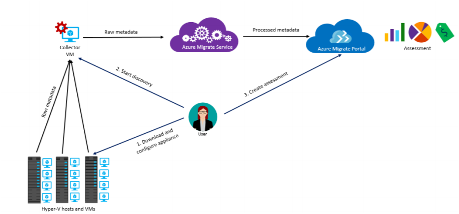

# About Azure Migrate

Azure Migrate discovers, assesses, and migrates machines and workloads to the Microsoft Azure cloud.

There are currently two versions of Azure Migrate:

- **Current version (in public preview)**: Using the current version of Azure Migrate, you can assess on-premises VMware VMs and Hyper-V VMs for migration to Azure, and migrate VMware VMs.
- **Classic version**: Using the classic version of Azure Migrate, you can assess on-premises VMware VMs for migration to Azure.

## Which version of the service should I use?

**Task** | **Recommendation**
--- | ---
**Assess VMware VMs in a production environment** | Use the current public preview version after reviewing the [support matrix](migrate-support-matrix.md).
**Assess Hyper-V VMs in a production environment** | Use the current public preview after reviewing the [support matrix](migrate-support-matrix.md)
**Migrate VMware VMs to Azure** | For small migrations, use the current public preview after reviewing the [support matrix](migrate-support-matrix.md)
**Migrate or automate large-scale VMware VMs** | Use [Azure Site Recovery](https://docs.microsoft.com/azure/site-recovery/migrate-tutorial-on-premises-azure) during public preview.

## Azure Migrate services public preview

The public preview provides a number of new features.

**Appliance**: A lightweight, easily-deployed appliance for discovery and assessment of on-premises VMware VMs and Hyper-V VMs.
**Improved user experience**: The deployment flow in the Azure portal is improved and streamlined.
**Continuous discovery of VMs**: There's no longer a need to trigger discovery when something changes on-premises.
**Improved performance data**: You no longer need to modify the vCenter Server statistics level to run performance-based assessment. The Azure Migrate appliance now measures performance data of the VMs.
**Migrate VMware VMs**:  Use Azure Migrate for the entire discovery, assessment, and migration process for VMware VMs. 
    - **Agentless migration**: You can migrate VMware VMs without installing anything on the VM.
    - **Unified appliance**: A single appliance nows handles discovery, assessment, and migration for VMware VMs. You don't need additional Azure Migrate components or agents.

## VMware architecture 

This section describes the architecture for VMware assessment and migration using the new public preview version of Azure Migrate.

The process is as follows:

1. You create an Azure Migrate appliance running as a VMware VM. You download a template file (OVA) from the Azure portal, and import it to vCenter Server to create the VM.
2. You connect to this VM, configure basic settings for it, and register it with Azure Migrate.
3. You connect to the Collector app running on the appliance to initiate discovery. 
4. After discovery finishes, in the Azure portal you gather discovered VMs into groups.  A group typically consists of VMs that you'd like to migrate together.
5. You run an assessment for each group.
1. After the assessment finishes, you can view it in the portal, or download it in Excel format.

### Discovery

The appliance is always connected to the Azure Migrate service, and continually sends metadata and performance-related data from the VMs to Azure.
    - Environment changes during discovery are captured. For example adding VMs in the discovery scope, or adding VM disks or NICs.
    - Nothing needs to be installed on discovered VMs.
    - Collected metadata: vCenter VM name; vCenter VM path (host/cluster folder); IP and MAC addresses; operating system; number of cores/disks/NICs; memory and disk size.
    - Collected performance data: CPU/memory usage; per disk data (disk read/write throughput; disk reads/writers per second), NIC data (network in, network out).   - - Performance data is collected from the day that the Collector app connects to vCenter Server. It doesn't collect historical data. 

### VMware ports
Azure Migrate uses the following connection ports for VMware:

**Source** | **Target** | **Port** | **Details**
--- | --- | --- | ---
Azure Migrate appliance | Azure Migrate service | Target-TCP 443 | Send metadata and performance data to Azure Migrate.
Azure Migrate appliance | vCenter Server | Target-TCP 443 | Connect to vCenter Server for metadata and performance data. 443 is default but can be modified with vCenter listens on a different port. 
RDP client | Azure Migrate appliance | Target-TCP3389 | RDP connection to trigger discovery from the appliance.

## Hyper-V architecture

This section describes the architecture for Hyper-V assessment using the new public preview version of Azure Migrate.

The process is as follows:

1. You create an Azure Migrate appliance running as a Hyper-V VM. To do this, you download the VM in a compressed format and import it onto a Hyper-V host.
2. You connect to this VM, and run the Collector app that's installed on it.
3. You specify a list of Hyper-V hosts/clusters running the VMs you want to discover.
4. The appliance is always connected to the Azure Migrate service, and continually sends metadata and performance-related data from the VMs to Azure. The appliance uses CIM sessions to connect and collect VM information.
    - Nothing needs to be installed on the VMs you're discovering.
    - VM metadata includes information about cores, memory, disks, disk sizes, and network adapters.
    - Performance data includes information about CPU and memory usage, disk IOPS, disk throughput (MBps) , and network output (MBps)
5. After discovery finishes, in the Azure portal you gather discovered VMs into groups.and run an assessment on each group. A group typically consists of VMs that you'd like to migrate together.
6. After the assessment finishes, you can view it in the portal, or download it in Excel format.

### Hyper-V ports

Azure Migrate service uses the following connection ports for Hyper-V:

**Source** | **Target** | **Port** | **Details**
--- | --- | --- | ---
Azure Migrate appliance | Azure Migrate service | Target-TCP 443 | Send metadata and performance data to Azure Migrate.
Azure Migrate appliance | Hyper-V host/cluster | Target-Default WinRM ports-HTTP:5985; HTTPS:5986 | Connect to host for metadata and performance data. CIM session used for connection
RDP client | Azure Migrate appliance | Target-TCP3389 | RDP connection to trigger discovery from the appliance.

## Azure Migrate classic version

The classic version of Azure Migrate provides the following:

- **VMware VM assessment**: Discover and assess on-premises VMware VMs as follows:
    - **Assess Azure readiness**: Assess whether your on-premises machines are suitable for running in Azure.
    - **Get size recommendations**: Get size recommendations for Azure VMs based on the performance history of on-premises VMs.
    - **Estimate monthly costs**: Get estimated costs for running on-premises machines in Azure.  
    - **Assess with higher confidence**: Visualize dependencies of on-premises machines to create groups of machines that you will assess and migrate together.
- **Migration**: Azure Migrate doesn't perform the migration. After the assessment, you can use services such as [Azure Site Recovery](https://docs.microsoft.com/azure/site-recovery/site-recovery-overview) and [Azure Database Migration Service](https://docs.microsoft.com/azure/dms/dms-overview), to migrate the machines to Azure.

[Learn more](https://azure.microsoft.com/pricing/details/azure-migrate/) about Azure Migrate pricing.

### How does it work? (classic version)

1. You create an Azure Migrate appliance running as a VMware VM. The appliance is created from an OVF template.
2. You connect to this VM, and run the Collector app that's installed on it.
3. You run the Collector app and trigger VM discovery. The appliance sends VM metadata and performance-related data from the VMs to Azure. Nothing needs to be installed on the VMs you're discovering.
    - VM metadata includes information about cores, memory, disks, disk sizes, and network adapters.
    - Performance data includes information about CPU and memory usage, disk IOPS, disk throughput (MBps) , and network output (MBps).
4. After discovery finishes, in the Azure portal you gather discovered VMs into groups and run an assessment on each group. A group typically consists of VMs that you'd like to migrate together. For more precise groups you can use the dependency visualization feature to view dependencies for a specific VM, or for all VMs in a group.
5. After the assessment finishes, you can view it in the portal, or download it in Excel format.

  

#### Connection ports

The following connection ports are used.

**Source** | **Target** | **Port** | **Details**
--- | --- | --- | ---
Collector  | Azure Migrate service | Target-TCP 443 | Send metadata and performance data to Azure Migrate.
Collector | vCenter Server | Target-TCP 443 | Connect to vCenter Server for metadata and performance data. 443 is default but can be modified with vCenter listens on a different port. 
On-premises VM | Log Analytics Workspace | [TCP 443] | [The Microsoft Monitoring Agent (MMA)](../log-analytics/log-analytics-windows-agent.md) uses TCP port 443 to connect to Log Analytics. You only need this port if you're using dependency visualization, that requires the MMA agent.

## What happens after assessment?

After you've assessed on-premises machines, you can a number of tools for migration:

- **Azure Migrate**: Use to migrate low numbers of VMware VMs to Azure.
- **Azure Site Recovery**: Use to migrate large number of VMware VMs, or Hyper-V VMs to Azure.
- **Database Migration Service**: If on-premises machines are running a database such as SQL Server, MySQL, or Oracle, you can use the [Azure Database Migration Service](../dms/dms-overview.md) to migrate them to Azure.

## Next steps

- [Review](migrate-support-matrix.md) support requirements and limitations for discovery, assessment, and migration
- [Review frequently asked questions](resources-faq.md) about Azure Migrate.
