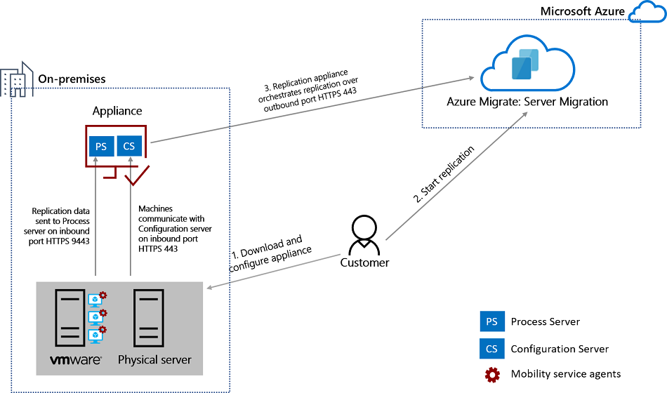

# Replication appliance

This article describes the replication appliance used by the [Migration and modernization](migrate-services-overview.md#migration-and-modernization-tool) tool when migrating VMware VMs, physical machines, and private/public cloud VMs to Azure, using agent-based migration. 

## Overview

The replication appliance is deployed when you set up agent-based migration of VMware VMs or physical servers. It's deployed as a single on-premises machine, either as a VMware VM or a physical server. It runs:

- **Replication appliance**: The replication appliance coordinates communications, and manages data replication, for on-premises VMware VMs and physical servers replicating to Azure.
- **Process server**: The process server, which is installed by default on the replication appliance, and does the following:
    - **Replication gateway**: It acts as a replication gateway. It receives replication data from machines enabled for replication. It optimizes replication data with caching, compression, and encryption, and sends it to Azure.
    - **Agent installer**: Performs a push installation of the Mobility Service. This service must be installed and running on each on-premises machine that you want to replicate for migration.

## Appliance deployment

**Used for** | **Details**
--- |  ---
**VMware VM agent-based migration** | You download OVA template from the Azure Migrate hub, and import to vCenter Server to create the appliance VM.
**Physical machine agent-based migration** | If you don't have a VMware infrastructure, or if you can't create a VMware VM using an OVA template, you download a software installer from the Azure Migrate hub, and run it to set up the appliance machine.

> [!NOTE]
> If you're deploying in Azure Government, use the installation file to deploy the replication appliance.

## Appliance requirements

When you set up the replication appliance using the OVA template provided in the Azure Migrate hub, the appliance runs Windows Server 2022 and complies with the support requirements. If you set up the replication appliance manually on a physical server, then make sure that it complies with the requirements.

**Component** | **Requirement**
--- | ---
 | **VMware VM appliance**
PowerCLI | [PowerCLI version 6.0](https://my.vmware.com/web/vmware/details?productId=491&downloadGroup=PCLI600R1) should be installed if the replication appliance is running on a VMware VM.
NIC type | VMXNET3 (if the appliance is a VMware VM)
 | **Hardware settings**
CPU cores | 8
RAM | 16 GB
Number of disks | Two: The OS disk and the process server cache disk.
Free disk space (cache) | 600 GB
**Software settings** |
Operating system | Windows Server 2022 or Windows Server 2012 R2
License | The appliance comes with a Windows Server 2022 evaluation license, which is valid for 180 days.  If the evaluation period is close to expiry, we recommend that you download and deploy a new appliance, or that you activate the operating system license of the appliance VM.
Operating system locale | English (en-us)
TLS | TLS 1.2 should be enabled.
.NET Framework | .NET Framework 4.6 or later should be installed on the machine (with strong cryptography enabled.
MySQL | MySQL should be installed on the appliance.   MySQL should be installed. You can install manually, or Azure Migrate can install it during appliance deployment.
Other apps | Don't run other apps on the replication appliance.
Windows Server roles | Don't enable these roles:   - Active Directory Domain Services  - Internet Information Services   - Hyper-V
Group policies | Don't enable these group policies:   - Prevent access to the command prompt.   - Prevent access to registry editing tools.   - Trust logic for file attachments.   - Turn on Script Execution.   [Learn more](/previous-versions/windows/it-pro/windows-7/gg176671(v=ws.10)).
IIS | - No pre-existing default website   - No pre-existing website/application listening on port 443  - Enable  [anonymous authentication](/previous-versions/windows/it-pro/windows-server-2008-R2-and-2008/cc731244(v=ws.10))   - Enable [FastCGI](/previous-versions/windows/it-pro/windows-server-2008-R2-and-2008/cc753077(v=ws.10)) setting
**Network settings** |
IP address type | Static
Ports | 443 (Control channel orchestration) 9443 (Data transport)
IP address | Make sure that configuration server and process server have a static IPv4 address, and don't have NAT configured.
NIC type | VMXNET3

## MySQL installation 

MySQL must be installed on the replication appliance machine. It can be installed using one of these methods.

**Method** | **Details**
--- | ---
Download and install manually | [Download](https://dev.mysql.com/get/Downloads/MySQLInstaller/mysql-installer-community-5.7.20.0.msi) the MySQL application & place it in the folder C:\Temp\ASRSetup, then install manually.  When you set up the appliance, MySQL shows as already installed.
Without online download | Place the MySQL installer application in the folder C:\Temp\ASRSetup. When you install the appliance and select download and install MySQL, setup uses the installer you added.
Download and install in Azure Migrate | When you install the appliance and are prompted for MySQL, select **Download and install**.

## URL access

The replication appliance needs access to these URLs in the Azure public cloud.

**URL** | **Details**
--- | ---
*.backup.windowsazure.com | Used for replicated data transfer and coordination
*.store.core.windows.net | Used for replicated data transfer and coordination
*.blob.core.windows.net | Used to access storage account that stores replicated data
*.hypervrecoverymanager.windowsazure.com | Used for replication management operations and coordination
https://management.azure.com | Used for replication management operations and coordination.
*.services.visualstudio.com | (Optional) Used for logging purposes. 
time.windows.com | Used to check time synchronization between system and global time.
https://login.microsoftonline.com   https://login.live.com   https://graph.windows.net   https://login.windows.net   https://www.live.com   https://www.microsoft.com  | Appliance setup needs access to these URLs. They're used for access control and identity management by Azure Active Directory.
https://dev.mysql.com/get/Downloads/MySQLInstaller/mysql-installer-community-5.7.20.0.msi | To complete MySQL download. In a few regions, the download might be redirected to the CDN URL. Ensure that the CDN URL is also allowed if  needed.

## Azure Government URL access

The replication appliance needs access to these URLs in Azure Government.

**URL** | **Details**
--- | ---
*.backup.windowsazure.us | Used for replicated data transfer and coordination
*.store.core.windows.net | Used for replicated data transfer and coordination
*.blob.core.windows.net | Used to access storage account that stores replicated data
*.hypervrecoverymanager.windowsazure.us | Used for replication management operations and coordination
https://management.usgovcloudapi.net | Used for replication management operations and coordination
*.services.visualstudio.com | (Optional) Used for logging purposes.
time.nist.gov | Used to check time synchronization between system and global time.
https://login.microsoftonline.com   https://login.live.com   https://graph.windows.net   https://login.windows.net   https://www.live.com   https://www.microsoft.com  | Appliance setup with OVA needs access to these URLs. They're used for access control and identity management by Azure Active Directory.
https://dev.mysql.com/get/Downloads/MySQLInstaller/mysql-installer-community-5.7.20.0.msi | To complete MySQL download. In a few regions, the download might be redirected to the CDN URL. Ensure that the CDN URL is also allowed if  needed.  

>[!Note]
>
> If your Migrate project has private endpoint connectivity, you will need access to the following URLs over and above private link access:   
> - *.blob.core.windows.com - To access storage account that stores replicated data. This is optional and is not required if the storage account has a private endpoint attached. 
> - https://management.azure.com for replication management operations and coordination. 
>- https://login.microsoftonline.com  https://login.windows.net   https://www.live.com and   https://www.microsoft.com for access control and identity management by Azure Active Directory

## Microsoft Azure operated by 21Vianet (Microsoft Azure operated by 21Vianet) URL access

The replication appliance needs access to these URLs.

**URL** | **Details**
--- | ---
*.backup.windowsazure.cn | Used for replicated data transfer and coordination.
*.store.core.chinacloudapi.cn | Used for replicated data transfer and coordination.
*.blob.core.chinacloudapi.cn | Used to access storage account that stores replicated data.
*.hypervrecoverymanager.windowsazure.cn | Used for replication management operations and coordination.
https://management.chinacloudapi.cn | Used for replication management operations and coordination.
*.services.visualstudio.com | (Optional) Used for logging purposes.
time.windows.cn | Used to check time synchronization between system and global time.
https:\//login.microsoftonline.cn   https:\//secure.aadcdn.microsoftonline-p.cn   https:\//login.live.com   https://graph.chinacloudapi.cn   https://login.chinacloudapi.cn   https://www.live.com   https://www.microsoft.com  | Appliance setup with OVA needs access to these URLs. They're used for access control and identity management by Azure Active Directory.
https://dev.mysql.com/get/Downloads/MySQLInstaller/mysql-installer-community-5.7.20.0.msi | To complete MySQL download. In a few regions, the download might be redirected to the CDN URL. Ensure that the CDN URL is also allowed if  needed.

## Port access

**Device** | **Connection**
--- | ---
VMs | The Mobility service running on VMs communicates with the on-premises replication appliance (configuration server) on port HTTPS 443 inbound, for replication management.   VMs send replication data to the process server (running on the configuration server machine) on port HTTPS 9443 inbound. This port can be modified.
Replication appliance | The replication appliance orchestrates replication with Azure over port HTTPS 443 outbound.
Process server | The process server receives replication data, optimizes, and encrypts it, and sends it to Azure storage over port 443 outbound.  By default the process server runs on the replication appliance.

## Replication process

1. When you enable replication for a VM, initial replication to Azure storage begins, using the specified replication policy. 
2. Traffic replicates to Azure storage public endpoints over the internet. Replicating traffic over a site-to-site virtual private network (VPN) from an on-premises site to Azure isn't supported.
3. After initial replication finishes, delta replication begins. Tracked changes for a machine are logged.
4. Communication happens as follows:
    - VMs communicate with the replication appliance on port HTTPS 443 inbound, for replication management.
    - The replication appliance orchestrates replication with Azure over port HTTPS 443 outbound.
    - VMs send replication data to the process server (running on the replication appliance) on port HTTPS 9443 inbound. This port can be modified.
    - The process server receives replication data, optimizes, and encrypts it, and sends it to Azure storage over port 443 outbound.
5. The replication data logs first land in a cache storage account in Azure. These logs are processed and the data is stored in an Azure managed disk.

## Appliance upgrades

The appliance is upgraded manually from the Azure Migrate hub. We recommend that you always run the latest version.

1. In Azure Migrate > Servers > Azure Migrate: Server Assessment, Infrastructure servers, select **Configuration servers**.
2. In **Configuration servers**, a link appears in **Agent Version** when a new version of the replication appliance is available. 
3. Download the installer to the replication appliance machine, and install the upgrade. The installer detects the version current running on the appliance.
 
## Next steps

- [Learn how](tutorial-migrate-vmware-agent.md#set-up-the-replication-appliance) to set up the replication appliance for agent-based VMware VM migration.
- [Learn how](tutorial-migrate-physical-virtual-machines.md#set-up-the-replication-appliance) to set up the replication appliance for physical servers.
