# Scenario 1: Assess on-premises workloads for migration to Azure

As they consider migration to Azure, Contoso company wants to run a technical and financial assessment to figure out whether their on-premises workloads are suitable for migration to the cloud. In particular, they want to assess machine and database compatibility for migration, and estimate capacity and costs for running their resources in Azure.

To get their feet wet and better understand the technologies involved, they're assessing and migrating a small on-premises travel app. It's a two-tier app, with a web app running on one VM, and a SQL Server database on the second VM. The application is deployed in VMware, and the environment is managed by a vCenter Server. They'll perform the assessment using the Data Migration Assistant (DMA), and the Azure Migrate service.

**Technology** | **Description** | **Cost**
--- | --- | ---
[DMA](https://docs.microsoft.com/sql/dma/dma-overview?view=ssdt-18vs2017) | DMA assesses and detects compatibility issues that can impact database functionality in Azure. In addition it assesses and feature parity between your SQL Server source and target, and recommends performance and reliability improvements for your target environment. | It's a downloadable tool free of charge. 
[Azure Migrate](https://docs.microsoft.com/azure/migrate/migrate-overview) | The  service helps you to assess on-premises machines for migration to Azure. It assesses the migration suitability of the machines, and provides sizing and cost estimations for running in Azure. Currently, the Azure Migrate service can assess on-premises VMware VMs for migration to Azure. | There's currently (April 2018) no charge for using this service.
[Service Map](https://docs.microsoft.com/azure/operations-management-suite/operations-management-suite-service-map) | Azure Migrate uses Service Map to show dependencies between machines you want to migrate. |  Service Map is part of Azure Log Analytics. It can currently be used for 180 days without incurring charges. 

In this scenario, we'll download and run the DMA to assess the on-premises SQL Server database for our travel app. We'll use Azure migrate with dependency mapping to assess the app VMs, before we migrate them to Azure.

> [!NOTE]
> For this scenario our assessment target for the database will be "SQL Server on an Azure VM". However, in our next scenario article, we will run the migration to an Azure SQL Managed Instance. We're using this approach since DMA doesn't currently support assessment to an Azure SQL Managed Instance target.

## Architecture


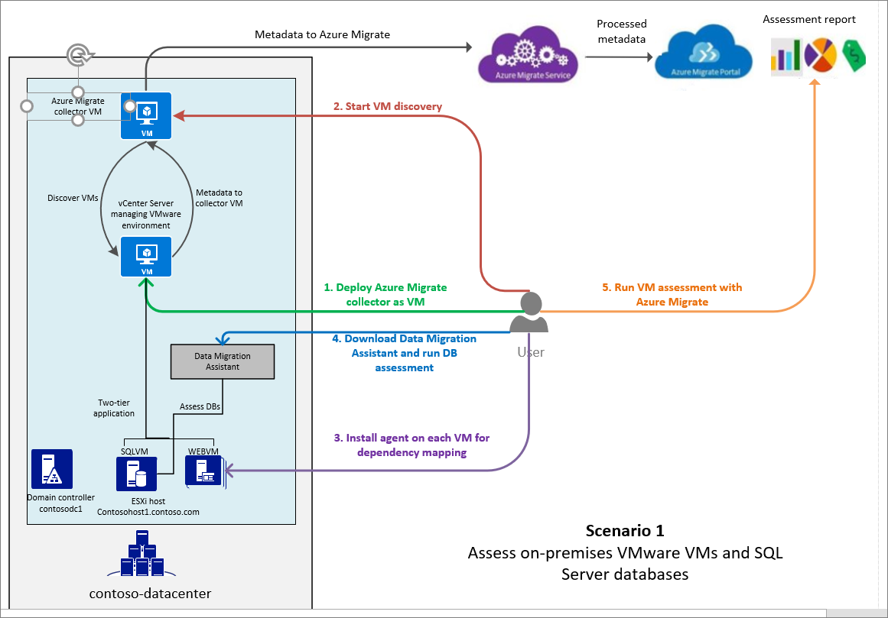

In this scenario:
- Contoso has an on-premises datacenter (**contoso-datacenter**), with an on-premises domain controller ( **contosodc1**).
- The internal travel app is tiered across two VMs, **WEBVM** and **SQLVM**, and located on VMware ESXi host **contosohost1.contoso.com**.
- The VMware environment is managed by vCenter Server (**vcenter.contoso.com**) running on a VM.


## Prerequisites

Here's what you need to deploy this scenario:

- An on-premises vCenter server running version 5.5, 6.0, or 6.5.
- A read-only account in vCenter server, or permissions to create one. 
- Permissions to create a VM on the vCenter server, using an .OVA template.
- At least one ESXi host running version 5.0 or higher.
- At least two on-premises VMware VMs, one running a SQL Server database.
- You should have permissions to install Azure Migrate agents on each VM.
- The VMs should have direct internet connectivity.
        - You can restrict internet access to the [required URLs](https://docs.microsoft.com/azure/migrate/concepts-collector#collector-pre-requisites).
        - If you have machines with no internet connectivity, you need to download and install [OMS gateway](../log-analytics/log-analytics-oms-gateway.md) on them.
- The FQDN of the VM running the SQL Server instance, for database assessment.
- Windows Firewall running on the SQL Server VM should allow external connections on TCP port 1433 (default), so that the DMA can connect.


## Scenario overview

Here's what we're going to do:


> [!div class="checklist"]
> * **Step 1: Prepare Azure**. All we need is an Azure subscription.
> * **Step 2: Download and install DMA**: Prepare DMA for assessment of the on-premises SQL Server database.
> * **Step 3: Assess the database**: Run and analyze the database assessment.
> * **Step 4: Prepare for VM assessment with Azure Migrate**: Set up on-premises accounts, and tweak VMware settings.
> * **Step 5: Discover on-premises VMs**: Create an Azure Migrate collector VM. Then, run the collector to discover VMs for assessment.
> * **Step 6: Prepare for dependency analysis**: Install Azure Migrate agents on the VMs, so that we can see the dependency mapping between VMs.
> * **Step 7: Assess the VMs**: Check dependencies, group the VMs, and run the assessment. After the assessment is ready, analyze it in preparation for migration.


## Step 1: Prepare Azure

If you don't have an Azure subscription, create a [free account](https://azure.microsoft.com/pricing/free-trial/).

- If you create a free account, you're the administrator of your subscription and can perform all actions.
- If you use an existing subscription and you're not the administrator, you need to work with the admin to assign you Owner or Contributor permissions for the subscription, or for the resource group you use for this scenario.


## Step 2: Download and install the DMA

1. Download the DMA from the [Microsoft Download Center](https://www.microsoft.com/download/details.aspx?id=53595).
    - You can install the Assistant on any machine that can connect to the SQL instance. You don't need to run it on the SQL Server machine.
    - You shouldn't run it on the SQL Server host machine.
2. Double-click the downloaded setup file (DownloadMigrationAssistant.msi) to start the installation.
3. On the **Finish** page, make sure that **Launch Microsoft Data Migration Assistant** is selected, and click **Finish**.

## Step 3: Run and analyze the database assessment

Run an assessment to analyze your source SQL Server instance, against a specified target.

1. In **New**, select **Assessment**, and give the assessment a project name.
2. In **Source server type**, select **SQL Server**. In **Target server type**, select **SQL Server on Azure Virtual Machines**.

    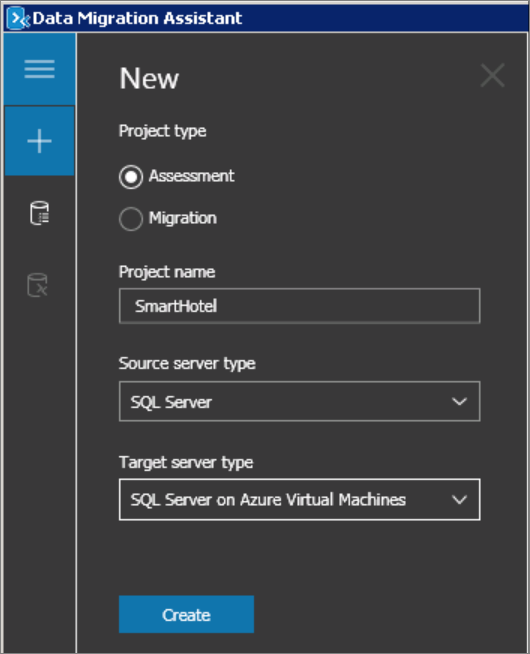

    > [!NOTE]
      At present DMA doesn't support assessment for migrating to a SQL Managed Instance. As a workaround, we're using SQL Server on Azure VM as our supposed target for the assessment.

1.  In **Select Target Version**, specify the target version of SQL Server that you want to run in Azure, and what you want to discover in the assessment:
    - **Compatibility Issues** tells you about changes that might break migration, or that require a minor adjustment before migration. It also tells you about any features you're currently using that have been deprecated. Issues are organized by compatibility level. 
    - **New features' recommendation** let's you know about new features in the target SQL Server platform that can be used for your database after migration. These are organized by Performance, Security, and Storage. 

    

2. In **Connect to a server**, specify the name of the machine running the SQL Server instance, the authentication type, and connection details. Then click **Connect**.

    
    
3. In **Add source**, select the database you want to assess, and click **Add**.
4. An assessment with the name you specified is created.

    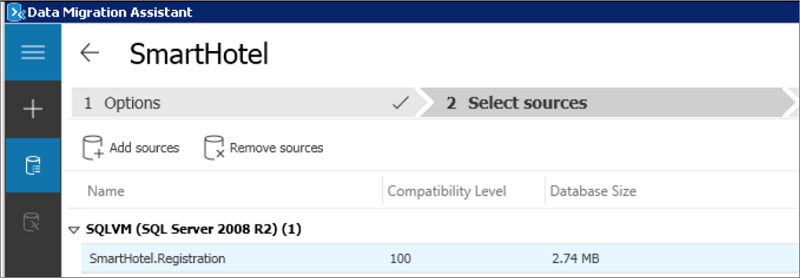

5.  **Next** to start the assessment.
6. In **Review Results**, you'll see results for the assessment tests you enabled.


### Analyze the database assessment

Results are displayed in the Assistant as soon as they're available. 

1. In the **Compatibility Issues** report, check whether your database has issues for each compatibility level, and if so,  how to fix them. Compatibility levels map to SQL Server versions as follows:
    - 100: SQL Server 2008/Azure SQL Database
    - 110: SQL Server 2012/Azure SQL Database
    - 120: SQL Server 2014/Azure SQL Database
    - 130: SQL Server 2016/Azure SQL Database
    - 140: SQL Server 2017/Azure SQL Database

    

2. In the **Feature recommendations** report, view performance, security, and storage features that the assessment recommends you should configure after migration. A variety of features are recommended, including In-Memory OLTP and Columnstore, Stretch Database, Always Encrypted, Dynamic Data Masking, and Transparent Data Encryption.

    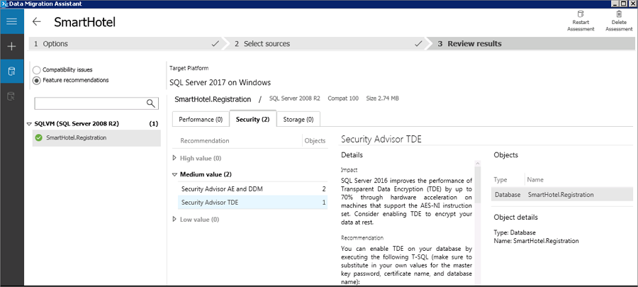

3. If fix any issues, click **Restart Assessment** to rerun it. 
4. Click **Export report** to get the assessment report in JSON or CSV format.

If you're running a larger scale assessment:

- You can run multiple assessments concurrently and view the state of the assessments by opening the **All Assessments** page.
- You can [consolidate assessments into a SQL Server database](https://docs.microsoft.com/sql/dma/dma-consolidatereports?view=ssdt-18vs2017#import-assessment-results-into-a-sql-server-database).
- You can [consolidate assessments into a PowerBI report](https://docs.microsoft.com/sql/dma/dma-powerbiassesreport?view=ssdt-18vs2017).


## Step 4: Prepare for VM assessment with Azure Migrate

Create a VMware account that Azure Migrate will use to automatically discover VMs for assessment, verify that you have permissions to create a VM, note the ports that must be open, and set the statistics settings level.

### Set up a VMware account

 You need a read-only account in vCenter. If you don't have one, create a VMware account with the following properties:

- User type: At least a read-only user.
- Permissions: Data Center object –> Propagate to Child Object, role=Read-only.
- Details: User assigned at datacenter level, and has access to all the objects in the datacenter.
- To restrict access, assign the **No access** role with the **Propagate to child** object, to the child objects (vSphere hosts, datastores, VMs and networks).

### Verify permissions to create a VM

Check you have permissions to create a VM by importing a file in .OVA format. [Learn more](https://kb.vmware.com/s/article/1023189?other.KM_Utility.getArticleLanguage=1&r=2&other.KM_Utility.getArticleData=1&other.KM_Utility.getArticle=1&ui-comm-runtime-components-aura-components-siteforce-qb.Quarterback.validateRoute=1&other.KM_Utility.getGUser=1).

### Verify ports

In this scenario we're going to configure dependency mapping. This feature requires an agent installed on the VMs you're assessing. That agent needs to be able to connect to Azure from TCP port 443 on each VM. [Learn more](https://docs.microsoft.com/azure/log-analytics/log-analytics-concept-hybrid)  about connection requirements.


### Set statistics settings

Before you start the deployment, the statistics settings for the vCenter Server should be set to level 3. Note that:
- After you set the level, you need to wait at least a day before you run the assessment. Otherwise it might not work as expected.
- If the level is higher than 3, the assessment will work, but:
    - Performance data for disks and networking won't be collected.
    - For storage, Azure Migrate recommends a standard disk in Azure, with the same size as the on-premises disk.
    - For networking, for each on-premises network adapter, a network adapter will be recommended in Azure.
    - For compute, Azure Migrate will look at the VM cores and memory size, and recommends an Azure VM with the same configuration. If there are multiple eligible Azure VM sizes, the one with the lowest cost is recommended.
   
    
[Learn more](https://docs.microsoft.com/azure/migrate/concepts-assessment-calculation#sizing) about sizing with level 3.

Set the level as follows:

1. In the vSphere Web Client, open the vCenter server instance.
2. Select the **Manage** tab, and under **Settings**, click **General**.
3. Click **Edit**, and in **Statistics**, set the statistic level settings to **Level 3**.

    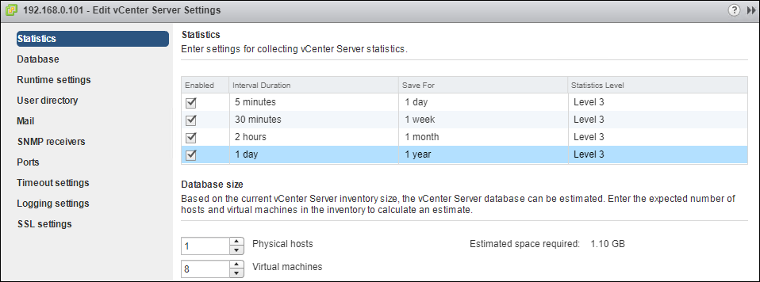


## Step 5: Discover VMs

Create an Azure Migrate project, download and set up the collector VM. Then, run the collector to discover your VMs.

### Create a project

1. Log in to the [Azure portal](https://portal.azure.com), and click **Create a resource**.
2. Search for **Azure Migrate**. Select **Azure Migrate** in the search results, and click **Create**.
3. Specify a project name, and the Azure subscription.
4. Create a new resource group.
5. Specify the location for the project, then click **Create**.

    - You can only create an Azure Migrate project in the West Central US or East US region.
    - You can plan a migration for any target location.
    - The project location is only used to store the metadata gathered from on-premises VMs.

    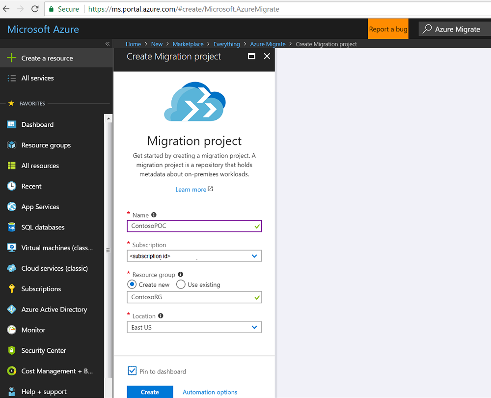


    

### Download the collector appliance

Azure Migrate creates an on-premises VM known as the collector appliance. This VM discovers on-premises VMware VMs, and sends metadata about them to the Azure Migrate service. To set up the collector appliance, you download an .OVA file, and import it to the on-premises vCenter server to create the VM.

1. In the Azure Migrate project, click **Getting Started** > **Discover & Assess** > **Discover Machines**.
2. In **Discover machines**, click **Download**, to download the .OVA file.
3. In **Copy project credentials**, copy the project ID and key. You need these when you configure the collector.

     

### Verify the collector appliance

Check that the .OVA file is secure, before you deploy it.

1. On the machine to which you downloaded the file, open an administrator command window.
2. Run the following command to generate the hash for the OVA:
    - ```C:\>CertUtil -HashFile <file_location> [Hashing Algorithm]```
    - Example usage: ```C:\>CertUtil -HashFile C:\AzureMigrate\AzureMigrate.ova SHA256```
3. The generated hash should match these settings (version 1.0.9.7)
	
    **Algorithm** | **Hash value**
    --- | ---
    MD5 | d5b6a03701203ff556fa78694d6d7c35
    SHA1 | f039feaa10dccd811c3d22d9a59fb83d0b01151e
    SHA256 | e5e997c003e29036f62bf3fdce96acd4a271799211a84b34b35dfd290e9bea9c
	

### Create the collector appliance

Import the downloaded file to the vCenter Server.

1. In the vSphere Client console, click **File** > **Deploy OVF Template**.

    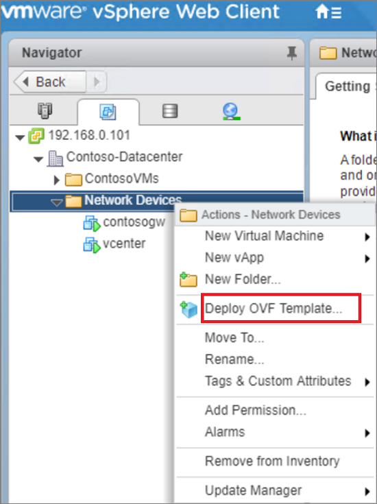 

2. In the Deploy OVF Template Wizard > **Source**, specify the location of the .OVA file, and click **Next**.
3. In **OVF Template Details**, click **Next**. In **End User License Agreement**, click **Accept** to accept the agreement, and click **Next**.
4. In **Name and Location**, specify a friendly name for the collector VM, and the inventory location in which the VM will be hosted, and click **Next**. Specify the host or cluster on which the collector appliance will run.
5. In **Storage**, specify where you want to store files for the appliance, and click **Next**.
6. In **Disk Format**, specify how you want to provision the storage.
7. In **Network Mapping**, specify the network to which the collector VM will connect. The network needs internet connectivity, to send metadata to Azure. 
8. In **Ready to Complete**, review the settings, select **Power on after deployment**, and then click **Finish**.

A message confirming successful completion is issued after the appliance is created.

### Run the collector to discover VMs

Before you start, note that the collector currently only supports "English (United States)" as the operating system language and the collector interface language.

1. In the vSphere Client console, right-click the VM > **Open Console**.
2. Provide the language, time zone, and password preferences for the appliance.
3. On the desktop, click the **Run collector** shortcut.

    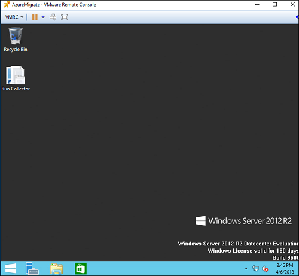 
    
4. In the Azure Migrate Collector, open **Set up prerequisites**.
    - Accept the license terms, and read the third-party information.
    - The collector checks that the VM has internet access, the time is synchronized, that the collector service is running (it's installed by default on the VM). It also installs VMWare PowerCLI is installed. 
    
    > [!NOTE]
    > We're presuming that the VM has direct access to the internet, without a proxy.

    
    

5. In **Specify vCenter Server details**, do the following:
    - Specify the name (FQDN) or IP address of the vCenter server.
    - In **Username** and **Password**, specify the read-only account credentials that the collector will use to discover VMs on the vCenter server.
    - In **Select scope**, select a scope for VM discovery. The collector can only discover VMs within the specified scope. Scope can be set to a specific folder, datacenter, or cluster. It shouldn't contain more than 1500 VMs. 

	

6. In **Specify migration project**, specify the Azure Migrate project ID and key that you copied from the portal. If didn't copy them, open the Azure portal from the collector VM. In the project **Overview** page, click **Discover Machines**, and copy the values.  

    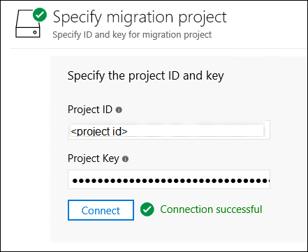

7. In **View collection progress**, monitor discovery, and check that metadata collected from the VMs is in scope. The collector provides an approximate discovery time.

    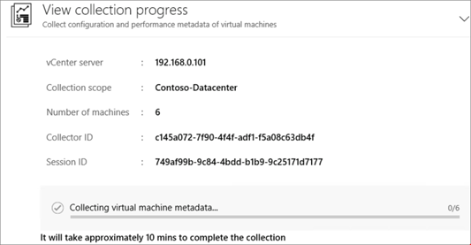
   


### Verify VMs in the portal

After collection completes, check that the VMs appear in the portal.

1. In the Azure Migrate project, click **Manage** > **Machines**.
2. Check that the VMs you want to discover appear in the page.

    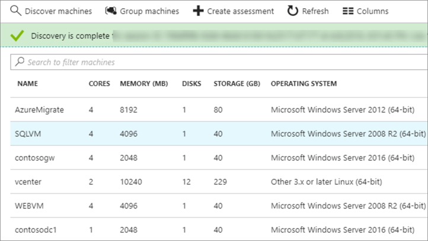

3. Note that the machines currently don't have the Azure Migrate agents installed. We need to install these so that we can view dependencies.
	
	


## Step 6: Prepare for dependency analysis

To view dependencies between VMs we want to assess, we download and install agents on the web app VMs – WEBVM and SQLVM.

### Take a snapshot

If you want to have a copy of your VM before modifying it, take a snapshot before you install the agents.

 


### Download and install the VM agents

1.	In the Azure Migrate project > **Machines** page, select the machine, and click **Requires installation** in the **Dependencies** column.
2.	On the **Discover Machines** page, for each VM, download and install the Microsoft Monitoring Agent (MMA), and the Dependency agent.
3.	Copy the workspace ID and key. You need these when you install the MMA.

    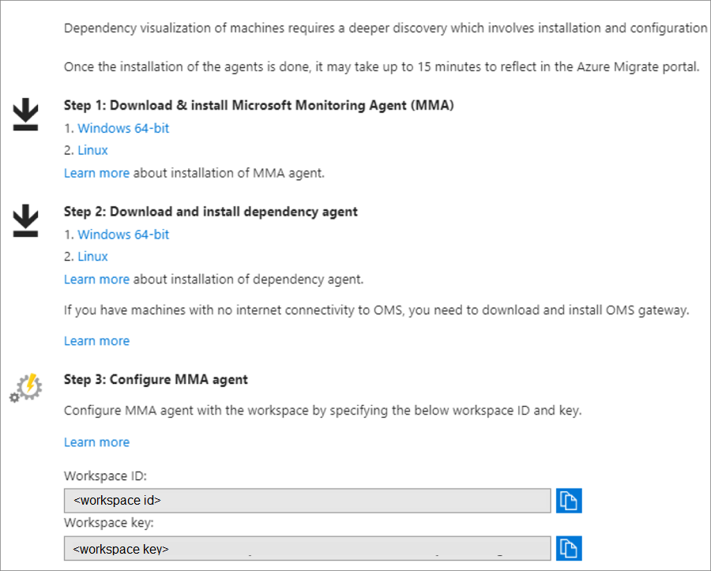 


#### Install the MMA

1. Double-click the downloaded agent.
2. On the **Welcome** page, click **Next**. On the **License Terms** page, click **I Agree** to accept the license.
3. In **Destination Folder**, keep the default installation folder > **Next**. 
4. In **Agent Setup Options**, select **Connect the agent to Azure Log Analytics** > **Next**. 

    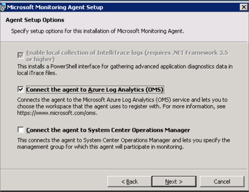 
5. In **Azure Log Analytics**, paste in the workspace ID and key that you copied from the portal. Click **Next**.
     

6. In **Ready to Install**, install the MMA.


#### Install the Dependency agent

1.	Double-click the downloaded Dependency agent.
2.	On the **License Terms** page, click **I Agree to accept the license**.
3.	In **Installing**, wait for the installation to finish. Then click **Next**.

    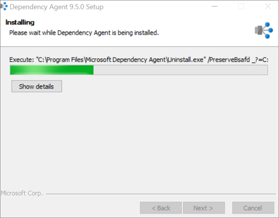 


       
## Step 7: Run and analyze the VM assessment

Verify machine dependencies and create a group. Then, run the assessment.

### Verify dependencies and create a group.

1.	On the **Machines** page, for the VMs you want to analyze, click **View Dependencies**.

     

2. For the SQLVM, the dependency map shows the following details:

    - Process groups/processes with active network connections running on SQLVM, during the specified time period (an hour by default)
    - Inbound (client) and outbound (server) TCP connections to and from all dependent machines.
    - Dependent machines with the Azure Migrate agents installed are shown as separate boxes
    - Machines without the agents installed show port and IP address information.
    
 3. For machines with the agent installed (WEBVM), click on the machine box to view more information, including FQDN, operating system, MAC address. 

    

4. Now, select the VMs you want to add to the group (SQLVM and WEBVM).  Use CTRL+click to select multiple VMs.
5. Click **Create Group**, and specify a name (smarthotelapp).

> [!NOTE]
    > To view more granular dependencies, you can expand the time range. You can select a specific duration, or start and end dates. 


### Run an assessment


1. On the **Groups** page, open the group (smarthotelapp)
2. Click **Create assessment**.

    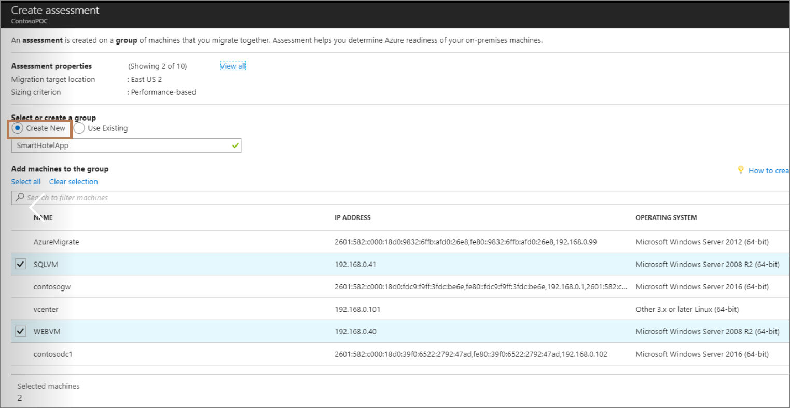

3. The assessment appears in the **Manage** > **Assessments** page.


### Modify assessment settings

For this tutorial we've used the default assessment settings, but you can customize settings, as follows:

1. In the **Assessments** page of the migration project, select the assessment, and click **Edit properties**.
2. Modify the properties in accordance with the following table:

    **Setting** | **Details** | **Default**
    --- | --- | ---
    **Target location** | The Azure location to which you want to migrate | No default.
    **Storage redundancy** | The type of storage redundancy that the Azure VMs will use after migration. | [Locally redundant storage (LRS)](../storage/common/storage-redundancy-lrs.md) is the default value. Azure Migrate only supports managed disks-based assessments and managed disks only support LRS, hence the LRS option. 
    **Sizing criterion** | The criterion to be used by Azure Migrate to right-size VMs for Azure. You can do either do *performance-based* sizing or size the VMs *as on-premises*, without considering the performance history. | Performance-based sizing is the default option.
    **Performance history** | The duration to consider for evaluating the performance of the VMs. This property is only applicable when sizing criterion is *performance-based sizing*. | Default is one day.
    **Percentile utilization** | The percentile value of the performance sample set to be considered for right-sizing. This property is only applicable when sizing criterion is *performance-based sizing*.  | Default is 95th percentile.
    **Pricing tier** | You can specify the [pricing tier (Basic/Standard)](../virtual-machines/windows/sizes-general.md) for the target Azure VMs. For example, if you are planning to migrate a production environment, you would like to consider the Standard tier, which provides VMs with low latency but may cost more. On the other hand, if you have a Dev-Test environment, you may want to consider the Basic tier that has VMs with higher latency and lower costs. | By default the [Standard](../virtual-machines/windows/sizes-general.md) tier is used.
    **Comfort factor** | Azure Migrate considers a buffer (comfort factor) during assessment. This buffer is applied on top of machine utilization data for VMs (CPU, memory, disk, and network). The comfort factor accounts for issues such as seasonal usage, short performance history, and likely increases in future usage.<br/><br/> For example, 10-core VM with 20% utilization normally results in a 2-core VM. However, with a comfort factor of 2.0x, the result is a 4-core VM instead. | Default setting is 1.3x.
    **Offer** | [Azure Offer](https://azure.microsoft.com/support/legal/offer-details/) that you are enrolled to. | [Pay-as-you-go](https://azure.microsoft.com/offers/ms-azr-0003p/) is the default.
    **Currency** | Billing currency. | Default is US dollars.
    **Discount (%)** | Any subscription-specific discount you receive on top of the Azure offer. | The default setting is 0%.
    **Azure Hybrid Benefit** | Specify if you have software assurance and are eligible for [Azure Hybrid Benefit](https://azure.microsoft.com/pricing/hybrid-use-benefit/). If set to Yes, non-Windows Azure prices are considered for Windows VMs. | Default is Yes.

3. Click **Save** to update the assessment settings.


### Analyze the VM assessment

An Azure Migrate assessment includes information about whether the on-premises VMs are compatible for Azure, suggested right-sizing for the Azure VM, and estimated monthly Azure costs. 


#### Review confidence rating

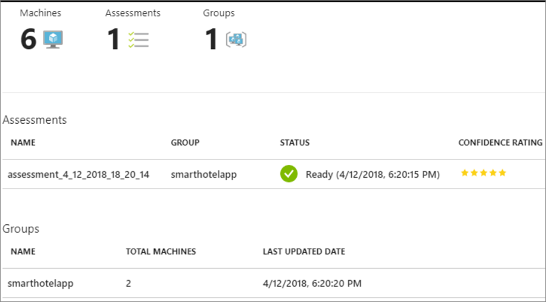

Your assessment gets a confidence rating from 1 star to 5 star (1 star being the lowest and 5 star being the highest).
- The confidence rating is assigned to an assessment based on the availability of data points needed to compute the assessment.
- The rating helps you to estimate the reliability of the size recommendations provided by Azure Migrate.
- Confidence rating is useful when you are doing *performance-based sizing* as Azure Migrate may not have sufficient data points to do utilization-based sizing. For *as on-premises sizing*, the confidence rating is always 5-star as Azure Migrate has all the data points it needs to size the VM.
- Depending on the percentage of data points available, the confidence rating for the assessment is provided:

   **Availability of data points** | **Confidence rating**
   --- | ---
   0%-20% | 1 Star
   21%-40% | 2 Star
   41%-60% | 3 Star
   61%-80% | 4 Star
   81%-100% | 5 Star

#### Verify readiness

  

The assessment report shows the information summarized in the table. Note that to show performance-based sizing, Azure Migrate needs the following information. If this information can't be collected, sizing assessment might not be accurate.

- Utilization data for CPU and memory.
- Read/write IOPS and throughput for each disk attached to the VM.
- Network in/out information for each network adapter attached to the VM.


**Setting** | **Indication** | **Details**
--- | --- | ---
**Azure VM readiness** | Indicates whether the VM is ready for migration | Possible states:</br><br/>- Ready for Azure<br/><br/>- Ready with conditions <br/><br/>- Not ready for Azure<br/><br/>- Readiness unknown<br/><br/> If a VM isn't ready, we'll show some remediation steps.
**Azure VM size** | For ready VMs, we recommend an Azure VM size. | Sizing recommendation depends on assessment properties:<br/><br/>- If you used performance-based sizing, sizing considers the performance history of the VMs.<br/><br/>-If you used 'as on-premises', sizing is based on the on-premises VM size, and utilization data isn't used.
**Suggested tool** | Since our machines are running the agents, Azure Migrate looks at the processes running inside the machine and identifies whether the machine is a database machine or not.
**VM information** | The report shows settings for the on-premises VM, including operating system, boot type, disk and storage information.


#### Review monthly cost estimates

This view shows the total compute and storage cost of running the VMs in Azure, along with the details for each machine. 

 

- Cost estimates are calculated using the size recommendations for a machine.
- Estimated monthly costs for compute and storage are aggregated for all VMs in the group. 


## Conclusion

In this scenario we've:

> [!div class="checklist"]
> * Assessed our on-premises database with the DMA tool.
> * Assessed our on-premises VMs, using dependency mapping, with the Azure Migrate service.
> * Reviewed the assessments to make sure our on-premises resources are ready for migration to Azure.

## Next steps

Let's continue with the next scenario, to do a [lift-and-shift migration](migrate-scenarios-lift-and-shift.md) of the on-premises VMs and database to Azure.


