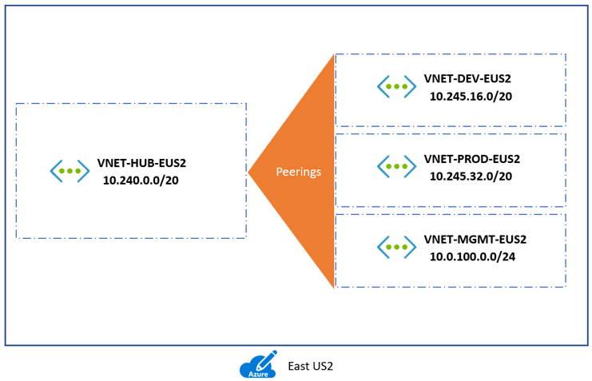
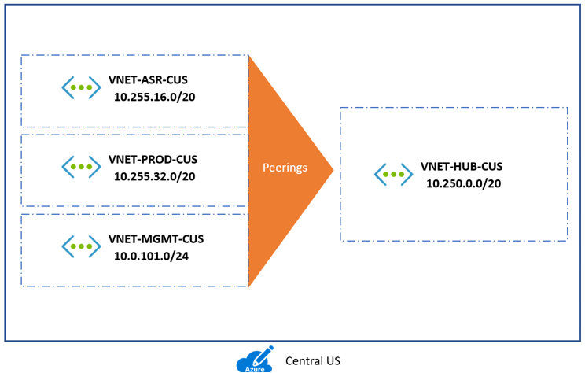
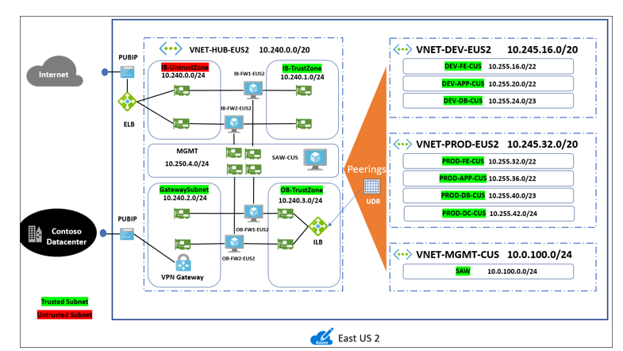

# Put together an infrastructure for migration to Azure

Before you try out migrations to Azure, read this article to help pin down an infrastructure strategy Azure. There are four broad areas you need to think about:

- **Azure subscriptions**: How will you purchase and manage interactions with services?
- **Hybrid identity**: How will you manage and control access to on-premises and Azure resources after migration? How will you extend or move identity management to the cloud?
- **Networking**: How will you design your networking infrastructure, and establish connectivity on-premises and in Azure?
- **Security and governance**: 

## Before you start

Before we describe how we're going to handle infrastructure in our Contoso migration examples, you might want to read up on Azure capabilities:

- There are a number of options available for purchasing Azure access, including Pay-As-You-Go, Enterprise Agreements (EA), or Open Licensing from Microsoft resellers, or from Microsoft Partners know as Cloud Solution Providers (CSPs). Learn about [purchase options](https://azure.microsoft.com/pricing/purchase-options/), and read about how [Azure subscriptions are organized](https://azure.microsoft.com/blog/organizing-subscriptions-and-resource-groups-within-the-enterprise/).
- Get an overview of Azure [identity and access management](https://www.microsoft.com/en-us/trustcenter/security/identity). In particular, learn about [Azure AD, and how on-premises Active Directory can be extended to the cloud](https://docs.microsoft.com/azure/active-directory/identity-fundamentals). There also a useful [downloadable e-book](https://azure.microsoft.com/resources/hybrid-cloud-identity/) about identity and access management (IAM) in a hybrid environment.
- Azure provides a robust networking infrastructure with options for hybrid connectivity. Get an [overview](https://docs.microsoft.com/azure/security/security-network-overview) of networking, and network access control.
- Get an [introduction to Azure Security](https://docs.microsoft.com/azure/security/azure-security), and read about creating a plan for [governance](https://docs.microsoft.com/azure/security/governance-in-azure).

## Current Contoso infrastructure

Here's a diagram showing the current Contoso on-premises infrastructure.

   

- Contoso has one main datacenter located in the city of Philadelphia in the Eastern United States.
- They have three additional local branches across the United States.
- The main datacenter is connected to the internet with a fiber metro ethernet connection (500 mbps).
- Each local branch is connected locally to the internet using business class connections, and they have IPSec VPN tunnels back to the main datacenter. This allows their entire network to be permanently connected, optimizes connections to the internet.
- Contoso uses Active Directory for identity management, and DNS servers on the internal network.
- The domain controllers in the datacenter run on VMware VMs. The domain controllers at local branches run on physical servers.

## Figure out how to buy and interact with Azure

Contoso needs to figure out how to buy Azure, how to architect its subscriptions, and how to license services and resources.

### Buy Azure

Contoso are going with an [Enterprise Agreement (EA)](https://azure.microsoft.com/pricing/enterprise-agreement/). This entails an upfront monetary commitment to Azure, entitling them to earn great benefits, including flexible billing options and optimized pricing.

- Contoso estimated what their Azure spend will be for the year. When they signed the agreement, they paid for the first year in full.
- Contoso needs to use all of their commitments before the year is over, or they'll lose the value for those dollars.
- If for some reason they exceed the commitment and spend more, then Microsoft will invoice them for the difference.
- Any cost incurred above the commitment will be at the same rates that are in their contract, as there are no penalties for going over.

### Manage subscriptions

After paying for Azure, Contoso need to figure out how to manage their subscriptions. They have an EA, and thus no limit to the number of Azure subscriptions they can set up.

1. An Enterprise Enrollment defines the shape and use of Azure services in a company, and defines the core governance structure. As a first step, Contoso determined a structure for their Azure Enterprise Enrollment, known as an enterprise scaffold. They used [this article](https://docs.microsoft.com/en-us/azure/azure-resource-manager/resource-manager-subscription-governance) to help them understand and design a scaffold. 
2. For now, Contoso has decide to use a functional approach to manage their subscriptions.
    - Inside their enterprise they'll have a single IT department that controls the Azure budget, and thus the only group that will have subscriptions.
    - They plan to extend this in future, to allow other corporate groups to join as departments in the Enterprise Enrollment.
    - Inside the IT department Contoso has structured two subscriptions, Production and Development. If Contoso requires additional subscriptions in the future, they'll need to manage access, policies and compliance for those subscriptions. They'll be able to do that by introducing [Azure Management Groups](https://docs.microsoft.com/azure/azure-resource-manager/management-groups-overview), as an additional layer above subscriptions.

### Examine licensing

Contoso is a long-term Microsoft ustomers, and has maintained on-premises EAs and Open Licenses with Software Assurance (SA). This might mean that they can use these licenses in Azure as they migrate.

#### Azure Hybrid Benefit

Azure Hybrid Benefit provides a cost-effective method for Contoso migration, by allowing them to save on Azure VMs and SQL Server workloads by converting or reusing Windows Server Datacenter and Standard edition licenses covered with Software Azzurance. This enable Contoso to pay a lower based compute rate for VMs and SQL Server. [Learn more](https://azure.microsoft.com/pricing/hybrid-benefit/).

#### License Mobility

License Mobility through Software Assurance gives Microsoft Volume Licensing customers like Contosol the flexibility to deploy eligible server apps with active Software Assurance on Azure. This eliminates the need to purchase new licenses, and with no associated mobility fees, existing licenses can easily be deployed in Azure. [Learn more](https://azure.microsoft.com/pricing/license-mobility/).

#### Reserve instances for predictable workloads

Predictable workloads are those that always need to be available with VMs running. For example, line of business apps such as a SAP ERP system.  On the other hand, unpredictable workloads are those that are variable. For example VMs that are on during high demand and off at non-peak times.

 

In exchange for using reserved instances for specific VM instances that they know need to be maintained for large durations of time, Console can get both a discount, and prioritized capacity. Using [Azure Reserved Instances](https://azure.microsoft.com/pricing/reserved-vm-instances/), together with Azure Hybrid Benefit, Contoso can save up to 82% off regular pay-as-you-go pricing (April 21, 2018).

### Set up resource groups

The Azure front end includes a service called Azure Resource Manager. Azure Resource Manager is responsible for the lifecycle of resources hosted in Azure from creation to deletion. Azure Resource Manager users resource groups as an identifier that groups resources together. Using a resource group ID allows Azure Resource Manager to perform operations on a group of resources that share this ID. A subscription can have multiple resource groups, but a resource group can only exist within a single subscription. In addition, a single resource group can have multiple resources, but a resource can only belong to a single group.

Contoso decided to set up their Azure resource groups as summarized in the following table.

**Resource group** | **Details**
--- | ---
**ContosoCobRG** | This group contains all resources related to continuity of business (COB).  It will include Recovery Services vaults for the Azure Site Recovery service, and the Azure Backup service. It will also include resources used for migration, including the Azure Migrate and Database Migration Services.
**ContosoDevRG** | The group contains development and test resources.
**ContosoFailoverRG** | This resource group will serve as a landing zone for failed over resources, either from on-premises or Azure.
**ContosoNetworkingRG** | This group contains all networking resources.
**ContosoRG** | This group contains resources related to production apps and databases.

Create resource groups as follows:

1. In the Azure portal, click **Resource groups**. In the **Resource groups** pane, click **Add**.
2. In **Resource group**, specify a group name, the subscription to which the group belongs, and the region.
3. Resource groups you create appear in the **Resource groups** list.

     

## Manage hybrid identity

Giving and controlling user access to Azure resources is an important step in pulling together your Azure infrastructure. Contoso have decided to extend their on-premises Active Directory into the cloud, rather than build a new separate system in Azure. They'll create an Azure-based Active Directory to do this. In the case of Contoso, they don't have Office 365 in place, so they'll need to provision a new Azure AD. Since Office 365 uses Azure AD to manage users, if they were using it they could use it as a tenet for Azure AD. [Learn more](https://support.office.com/article/understanding-office-365-identity-and-azure-active-directory-06a189e7-5ec6-4af2-94bf-a22ea225a7a9) about this option, and [how to add a subscription](https://docs.microsoft.com/azure/active-directory/active-directory-how-subscriptions-associated-directory) to an existing Azure AD.

### Create an Azure AD

Contoso are using the Azure AD Free edition that's included with an Azure subscription. Add a new AD directory as follows:

1. Browse to the [Azure portal](http://portal.azure.com/) and sign in with your subscription account.
2. Click **Create a resource** > **Identity** > **Azure Active Directory**.
3. In **Create Directory**, specify your organization name, initial domain name, and region in which the Azure AD directory should be created.

     

    > [!NOTE]
    > When you create a directory it always have a initial domain name in the form domainname.onmicrosoft.co. You can't change or delete this name, but your can add your registered domain name to your Azure AD, as described in the next procedure.

### Add the domain name

For Contoso to use their standard domain name, they need to add their custom name to Azure AD. This allows administrators to assign familiar user names, so that they can log in using their email address billg@contoso.com, rather than needing billg@contosomigration.onmicrosoft.com. You set up a custom name by adding the name to your directory, adding a DNS entry, and verifying the name in Azure AD.

1. In the Azure AD in the Azure portal, click **Custom domain names** > **Add custom domain**.
2. In **Custom Domain Name**, add your domain (in this case Contoso.com), and click **Add Domain**.
3. Now note the DNS information for the name, so that you can add a DNS entry for the name with your domain registrar. In the **Custom domain names** list, click the name and note the details. In this case we're using an MX entry.
4. To use a DNS entry in Azure you need to register it with your domain registrar. You'll need access to the name server to do this. In the case of Contoso, they logged into the Contoso.com domain, and created a new MX record for the DNS entry provided by Azure AD, using the details shown in the Azure portal. 
5. After the DNS records propage, in the details name for the domain, click **Verify**.

      

### Set up groups and users

Now that the Azure AD is up and running, we can add Contoso employees to on-premises AD groups that we'll sync to Azure AD. We recommend using on-premises group names that match the names of resource groups in Azure. This makes it easier to identify matches for synchronization purposes.

1. In your on-premises Active Directory, set up security groups with names that match the names of resource groups you created in Azure.
 
     

2. Create an additional group that will be added to all of the other groups. This group will have rights to all resource groups in Azure, and a limited number of Global Admins will be added to this group.

### Synchronize on-premises and Azure

You integrate your on-premises AD and Azure AD to provide a common identity for accessing both cloud and on-premises resources. With this model:

- Users and organizations can then take advantage of a single identity to access on-premises applications and cloud services such as Office 365, or thousands of other sites on the Internet.
- Admins can leverage the groups in AD to implement [Role Based Access Control (RBAC)](https://docs.microsoft.com/azure/role-based-access-control/role-assignments-portal) in Azure.
- To facilitate integration you can use the Azure AD Connect tool. When you install and configure the tool on a domain controller, it synchronizes the local on-premises AD identities to the 

### Download the tool

1. In the Azure portal, click **Azure Active Directory**.
2. Click **Azure AD Connect**, and download the latest version of the tool to the server you're using for sync.

     

3. Locate and double-click **AzureADConnect.msi**.
4. On the **Welcome** screen, agree to licensing terms > **Continue**.
5. In **Express Settings**, click **Use express settings**. This is the most common installation, and can be used when you have a single-forest topology and password hash synchronization for authentication.
     

6. In **Connect to Azure AD**, add your Azure AD credentials. Enter the name as CONTOSO\admin or contoso.com\admin. Contoso has a direct connection to Azure. If your on-premises AD is behind a proxy, read this [article](https://docs.microsoft.com/azure/active-directory/connect/active-directory-aadconnect-troubleshoot-connectivity).

      

7. If the **Azure AD sign-in configuration** page appears, this indicates that you didn't verify your domain in Azure.
8. In **Connect to AD DS**, specify credentials for  your on-premises AD.

      

9. In **Ready to configure**, click **Start the synchronization process when configuration completes** to start the sync immediately. Then click **Install**. Click **Exit** when the installation finishes.

After the first synchronization, on-premises AD objects can be seen in the Azure AD.

 

Inside each group employees in the Contoso IT team are represented, based on their role.

 

### Set up RBAC

Azure [Role-Based Access Control (RBAC)](https://docs.microsoft.com/azure/role-based-access-control/role-assignments-portal) enables fine-grained access management for Azure. Using RBAC, you can grant only the amount of access that users need to perform their jobs. You assign the appropriate RBAC role to users, groups, and applications at a certain scope. The scope of a role assignment can be a subscription, a resource group, or a single resource. 

Contoso are assigning roles to the AD groups synchronized from on-premises.

1. In the **ControlCobRG** resource group, click **Access control (IAM)**, and then click **Add**.
2. In **Add Permissions** > **Role**, select **Contributor**, and then select the**ContosoCobRG** AD group from the list. The group will appear below in the **Selected members** list. Click **Save**.
3. In **Add Permissions** > **Role**, select **Owner**, and then select the **ContosoAzureAdmins** AD group. The group will appear below in the **Selected members** list. Click **Save**.

         

4. Repeat in other resource groups. In the case of Contoso, for each resource group we assign Contributor permissions for the AD account with the same name as the resource group, and owner permissions for ContosoAzureAdmins.

     

## Set up networking

Networking should be set up to provide an accessible, secure, and scalable hybrid network. Here's what you need to think about:

- **Selecting an Azure region**: Azure regions are organized into geographies. This ensures that data residency, sovereignty, compliance and resiliency requirements are honored within geographical boundaries. A region is comprised of a set of datacenters. These datacenters are deployed within a latency-defined perimeter, and connected through a dedicated regional low-latency network. Each Azure region is paired with a different region for resiliency. Read about [Azure regions](https://azure.microsoft.com/global-infrastructure/regions/), and understand [how regions are paired](https://docs.microsoft.com/azure/best-practices-availability-paired-regions).
- **Designing a hybrid network**: There are a [number of architectures](https://docs.microsoft.com/azure/architecture/reference-architectures/hybrid-networking/) available for a hybrid network between Azure and your on-premises datacenters. [Read more](https://docs.microsoft.com/azure/architecture/reference-architectures/hybrid-networking/considerations) about comparing options.
- **Designing virtual networks in Azure**: Virtual networks are a critical part of your Azure infrastructure. Before you create virtual networks, think about how to design a secure and scalable virtual networks as part of your hybrid solution. [Learn more](https://docs.microsoft.com/azure/virtual-network/virtual-network-vnet-plan-design-arm) about virtual networks.

### Select an Azure region

Contoso have decided to go with the East US 2 region, located in Virginia, for a few reasons:

- The Contoso datacenter is located in New York, and they considered latency to the closest datacenter.
- The East US 2 region has all the service and products they need to use. Not all Azure regions are the same in terms of the products and services available. You can review [Azure products by region](https://azure.microsoft.com/global-infrastructure/services/).
- For resiliency purposes, the region pair for East US 2 is Central US. Generally each region is paired within the same geography.

### Design a hybrid network architecture

The Contoso network infrastructure currently consists of their datacenter in New York, and local branches in the eastern portion of the US.  All locations have a business class connection to the internet.  Each of the branches is then connected to the datacenter via a IPSec VPN tunnel over the internet.

 

Contoso are implementing their hybrid network architecture as follows:

1. Set up a site-to-site VPN connection between the Contoso datacenter in New York and the primary East US 2 region.
2. Set up a VPN connection between the datacenter and the paired Central US region. 
3. As they scale up their Azure deployment, they'll establish an ExpressRoute connection between their datacenter and the East US 2 and Central US regions. When this happens, they'll retain the VPN site-to-site connection for failover purposes only. [Learn more](https://docs.microsoft.com/azure/architecture/reference-architectures/hybrid-networking/considerations) about choosing between a VPN and ExpressRoute hybrid solution, and  about [ExpressRoute locations and support](https://docs.microsoft.com/azure/expressroute/expressroute-locations-providers).
4. Branch office taffic bound for Azure virtual networks will route through the main Contoso datacenter. 

**VPN only**

 

**VPN and ExpressRoute**

 

### Design virtual networks

Contoso has decided to implement a hub-to-hub network model:

- Contoso will deploy a a hub in the primary region, and a hub in the paired region. A hub is a virtual network (VNet) in Azure that acts as a central point of connectivity to your on-premises network.
- Within each region, Contoso will deploy VNets for different purposes, as spoke networks from the region hub.
- The hub VNets will connect to each other using global VNet peering. Global VNet peering connects VNets across Azure regions.
- Spoke VNets within a region use VNet peering to connect to their hub, and to each other.
- VNet peering, both global and local, provide a number of advantages:
    - Network traffic between peered VNets is private.
    - Traffic between the VNets is kept on the Microsoft backbone network. No public Internet, gateways, or encryption is required in the communication between the virtual networks.
    - Peering provides a default, low-latency, high-bandwidth connection between resources in different virtual networks.
- Contoso have decided that as a long-term approach, they will implement a Class A private network in Azure ( 0.0.0.0 to 127.255.255.255). This works, since on-premises they current have a Class B private address space 172.160.0/16 so they can be sure there won't be any overlap between address ranges.
- They will use a naming convention that includes the prefix **VNET** and the region abbreviation **EUS2** or **CUS**. For example, the hub networks will be named **VNET-HUB-EUS2** (East US 2), and **VNET-HUB-CUS** (Central US).

### East US 2 (primary region)

East US 2 is the primary region that Contoso will use to deploy resources and services. Here's how they're going to architect it:

- They're going to use a hub and spoke topology for VNets in the region. The hub in East US 2 is the central point of connectivity to their on-premises datacenter, and the spoke VNets in East US 2 can be used to isolate workloads if required, managed separately from other spokes.
- They will have spoke VNets for Development/test (DEV), Management (MGMT), and production (PROD). Each VNet will have its own address space, with no overlap. They intend to configure routing without requiring NAT.
- These VNets will use VNet peering (to connect to VNets within the same region). The production VNet will peer with the hub network and the management spoke network only.

**VNets in East US 2**

**VNet** | **Range** | **Peer**
--- | --- | ---
**VNET-HUB-EUS2** | 10.240.0.0/20 | VNET-HUB-CUS2 (global peering)   VNET-DEV-EUS2, VNET-PROD-EUS2, VNET-MGMG-EUS2
**VNET-DEV-EUS2** | 10.245.16.0/20 | VNET-HUB-EUS2, VNET-MGMG-EUS2
**VNET-PROD-EUS2** | 10.245.32.0/20 | VNET-HUB-EUS2, VNET-MGMT-EUS2
**VNET-MGMT-EUS2** | 10.0.100.0/24 |  VNET-HUB-EUS2, VNET-DEV-EUS2, VNET-PROD-EUS2

 

## Central US (paired region)

The Central US region is the paired region for East US 2 and is the failover region if there's an app outage, or a failure that affects the entire primary region. Here's how Contoso will architect it:

- They're going to use a hub and spoke topology for VNets in the region. The hub in Central US is connect to the primary hub in East US 2 by global peering.
-  Central US will have spoke VNets for replication and failover (ASR), Management (MGMT), and production (PROD). Each VNet will have its own address space, with no overlap. They intend to configure routing without requiring NAT.
- These VNets will use VNet peering (to connect to VNets within the same region). The management VNet will peer with the hub network and the ASR spoke network only.

**VNets in Central US**

**VNet** | **Range** | **Peer**
--- | --- | ---
**VNET-HUB-CUS** | 10.250.0.0/20 | VNET-HUB-EUS2 (global peering)   VNET-ASR-CUS, VNET-MGMG-CUS
**VNET-ASR-CUS** | 10.255.16.0/20 | VNET-HUB-CUS, VNET-MGMG-CUS
**VNET-PROD-CUS** | 10.255.32.0/20 | VNET-HUB-CUS, VNET-ASR-CUS, VNET-MGMT-CUS   
**VNET-MGMT-CUS** | 10.0.101.0/24 |  VNET-HUB-CUS, VNET-ASR-CUS

### Design the hub network

After networks are in place, we need to think about traffic within the networks. How is traffic isolated? How do we use subnets to design a multi-tier topology within our VNets? 

Here's what Contoso have decided to do for both the EUS2 and CUS hubs.

- They are designing a network with two boundaries, an untrusted front-end perimeter zone and a back-end trusted zone.
- A firewall will control access to trusted zones.
- From the internet:
    - Internet traffic will hit a load-balanced public IP address on the perimeter network.
    - This traffic is routed through the firewall, and subject to firewall rules.
    - After network access controls are implemented, traffic will be forwarded to the appropriate location in the trusted zone.
    - Outbound traffic from the VNet will be routed to the internet using user-defined routes (UDRs). The traffic is forced through the firewall, and inspected in line with Contoso policies.
- From the Contoso datacenter:
    - Incoming traffic over VPN site-to-site (or ExpressRoute) hits the public IP address of the Azure VPN gateway.
    - Traffic is routed through the firewall and subject to firewall rules.
    - After applying rules traffic is forwarded to an internal load balancer on the trusted internal zone subnet.
    - Outbound traffic from the trusted subnet to the on-premises datacenter over VPN is routed through the firewall, and rules applied, before going over the VPN site-to-site connection.

