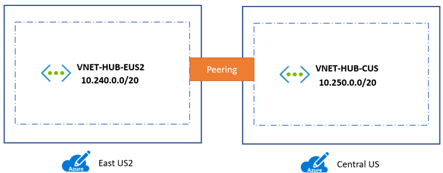
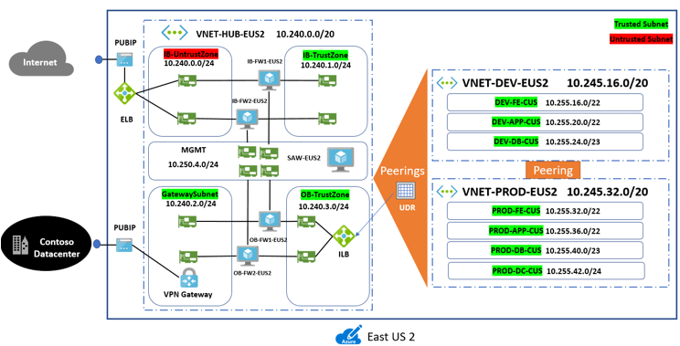
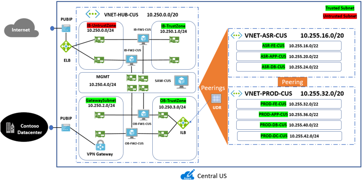
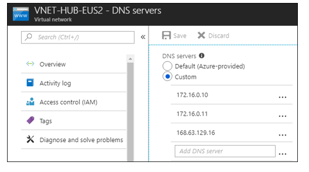

This series of articles documents how the fictitious company Contoso migrates their on-premises resources to the Microsoft Azure cloud. The series includes background information, and a series of walkthrough scenarios that show migrations with a growing degrees of complexity.

- Get an [overview](https://docs.microsoft.com/en-us/azure/migrate/migrate-scenarios-overview) of Contoso's migration strategy and scenarios.
- In this article, learn about the infrastructure decisions and tasks Contoso needs to put in place for migration. 
- Learn how Contoso performs a simple rehost (lift-and-shift) migration to Azure. A rehost allows Contoso to migrate apps quickly, without needing to redesign or modify code.
- Learn how Contoso performs a more sophisticated migration that entails refactoring resources and apps.
- With experience of lift-and-shift migration and refactoring, Contoso is ready to take things a step further. This article shows how Contoso rearchitects on-premises apps during migration, to optimize app architecture for cloud scalability.
- Lastly, Contoso try out rebuilding an app from the group up, with cloud-native technologies that take advantage of all Azure has to offer.

## Overview

Before you try out migrations to Azure, read this article to help pin down an infrastructure strategy for migration. Generally here are four broad infrastructure areas you need to think about:

- **Azure subscriptions**: How will you purchase and manage interactions with services?
- **Hybrid identity**: How will you manage and control access to on-premises and Azure resources after migration? How will you extend or move identity management to the cloud?
- **Networking**: How will you design your networking infrastructure, and establish connectivity on-premises and in Azure?
- **Security and governance**: How will you keep your hybrid/Azure deployment secure, and in line with your security and governance requirements?

## Before you start

Before we start breaking down infrastructure requirements, you might want to get some backgroun on the Azure capabilities we'll discuss in this article:

- There are a number of options available for purchasing Azure access, including Pay-As-You-Go, Enterprise Agreements (EA), or Open Licensing from Microsoft resellers, or from Microsoft Partners know as Cloud Solution Providers (CSPs). Learn about [purchase options](https://azure.microsoft.com/pricing/purchase-options/), and read about how [Azure subscriptions are organized](https://azure.microsoft.com/blog/organizing-subscriptions-and-resource-groups-within-the-enterprise/).
- Get an overview of Azure [identity and access management](https://www.microsoft.com/en-us/trustcenter/security/identity). In particular, learn about [Azure AD, and how on-premises Active Directory can be extended to the cloud](https://docs.microsoft.com/azure/active-directory/identity-fundamentals). There also a useful [downloadable e-book](https://azure.microsoft.com/resources/hybrid-cloud-identity/) about identity and access management (IAM) in a hybrid environment.
- Azure provides a robust networking infrastructure with options for hybrid connectivity. Get an [overview](https://docs.microsoft.com/azure/security/security-network-overview) of networking, and network access control.
- Get an [introduction to Azure Security](https://docs.microsoft.com/azure/security/azure-security), and read about creating a plan for [governance](https://docs.microsoft.com/azure/security/governance-in-azure).

## Current Contoso infrastructure

Here's a diagram showing the current Contoso on-premises infrastructure.

   

- Contoso has one main datacenter located in the city of New York in the Eastern United States.
- They have three additional local branches across the United States.
- The main datacenter is connected to the internet with a fibre metro ethernet connection (500 mbps).
- Each local branch is connected locally to the internet using business class connections, with IPSec VPN tunnels back to the main datacenter. This allows their entire network to be permanently connected, optimizes connections to the internet.
- The main datacenter is fully virtualized with VMware. They have two ESXi 6.5 virtualization hosts, managed by vCenter Server 6.5.
- Contoso uses Active Directory for identity management, and DNS servers on the internal network.
- The domain controllers in the datacenter run on VMware VMs. The domain controllers at local branches run on physical servers.

## Step 1: Figure out how to buy and subscribe to Azure

Contoso needs to figure out how to buy Azure, how to architect its subscriptions, and how to license services and resources.

### Buy Azure

Contoso are going with an [Enterprise Agreement (EA)](https://azure.microsoft.com/pricing/enterprise-agreement/). This entails an upfront monetary commitment to Azure, entitling them to earn great benefits, including flexible billing options and optimized pricing.

- Contoso estimated what their Azure spend will be for the year. When they signed the agreement, they paid for the first year in full.
- Contoso needs to use all of their commitments before the year is over, or they'll lose the value for those dollars.
- If for some reason they exceed the commitment and spend more, then Microsoft will invoice them for the difference.
- Any cost incurred above the commitment will be at the same rates that are in their contract, as there are no penalties for going over.

### Manage subscriptions

After paying for Azure, Contoso need to figure out how to manage their subscriptions. They have an EA, and thus no limit to the number of Azure subscriptions they can set up.

1. An Enterprise Enrollment defines the shape and use of Azure services in a company, and defines the core governance structure. As a first step, Contoso have determined a structure for their Azure Enterprise Enrollment, known as an enterprise scaffold. They used [this article](https://docs.microsoft.com/en-us/azure/azure-resource-manager/resource-manager-subscription-governance) to help them understand and design a scaffold. 
2. For now, Contoso has decide to use a functional approach to manage their subscriptions.
    - Inside their enterprise they'll have a single IT department that controls the Azure budget, and thus the only group that will have subscriptions.
    - They plan to extend this in future, to allow other corporate groups to join as departments in the Enterprise Enrollment.
    - Inside the IT department Contoso has structured two subscriptions, Production and Development. If Contoso requires additional subscriptions in the future, they'll need to manage access, policies and compliance for those subscriptions. They'll be able to do that by introducing [Azure Management Groups](https://docs.microsoft.com/azure/azure-resource-manager/management-groups-overview), as an additional layer above subscriptions.

     

### Examine licensing

Contoso is a long-term Microsoft customer, and has maintained on-premises EAs and Open Licenses with Software Assurance (SA). This might mean that they can use these licenses in Azure as they migrate.

#### Azure Hybrid Benefit

Azure Hybrid Benefit provides a cost-effective method for Contoso migration, by allowing them to save on Azure VMs and SQL Server workloads by converting or reusing Windows Server Datacenter and Standard edition licenses covered with Software Azzurance. This enable Contoso to pay a lower based compute rate for VMs and SQL Server. [Learn more](https://azure.microsoft.com/pricing/hybrid-benefit/).

#### License Mobility

License Mobility through Software Assurance gives Microsoft Volume Licensing customers like Contosol the flexibility to deploy eligible server apps with active Software Assurance on Azure. This eliminates the need to purchase new licenses, and with no associated mobility fees, existing licenses can easily be deployed in Azure. [Learn more](https://azure.microsoft.com/pricing/license-mobility/).

#### Reserve instances for predictable workloads

Predictable workloads are those that always need to be available with VMs running. For example, line of business apps such as a SAP ERP system.  On the other hand, unpredictable workloads are those that are variable. For example VMs that are on during high demand and off at non-peak times.

 

In exchange for using reserved instances for specific VM instances that they know need to be maintained for large durations of time, Console can get both a discount, and prioritized capacity. Using [Azure Reserved Instances](https://azure.microsoft.com/pricing/reserved-vm-instances/), together with Azure Hybrid Benefit, Contoso can save up to 82% off regular pay-as-you-go pricing (April 21, 2018).

### Set up resource groups

The Azure front end includes a service called Azure Resource Manager. Azure Resource Manager is responsible for the lifecycle of resources hosted in Azure from creation to deletion. Azure Resource Manager users resource groups as an identifier that groups resources together. Using a resource group ID allows Azure Resource Manager to perform operations on a group of resources that share this ID. A subscription can have multiple resource groups, but a resource group can only exist within a single subscription. In addition, a single resource group can have multiple resources, but a resource can only belong to a single group.

Contoso decided to set up their Azure resource groups as summarized in the following table.

**Resource group** | **Details**
--- | ---
**ContosoCobRG** | This group contains all resources related to continuity of business (COB).  It will include Recovery Services vaults for the Azure Site Recovery service, and the Azure Backup service. It will also include resources used for migration, including the Azure Migrate and Database Migration Services.
**ContosoDevRG** | The group contains development and test resources.
**ContosoFailoverRG** | This resource group will serve as a landing zone for failed over resources, either from on-premises or Azure.
**ContosoNetworkingRG** | This group contains all networking resources.
**ContosoRG** | This group contains resources related to production apps and databases.

Create resource groups as follows:

1. In the Azure portal, click **Resource groups**. In the **Resource groups** pane, click **Add**.
2. In **Resource group**, specify a group name, the subscription to which the group belongs, and the region.
3. Resource groups you create appear in the **Resource groups** list.

     

## Step 2: Manage hybrid identity

Giving and controlling user access to Azure resources is an important step in pulling together your Azure infrastructure. Contoso have decided to extend their on-premises Active Directory into the cloud, rather than build a new separate system in Azure. They'll create an Azure-based Active Directory to do this. In the case of Contoso, they don't have Office 365 in place, so they'll need to provision a new Azure AD. Since Office 365 uses Azure AD to manage users, if they were using it they could use it as a tenet for Azure AD. [Learn more](https://support.office.com/article/understanding-office-365-identity-and-azure-active-directory-06a189e7-5ec6-4af2-94bf-a22ea225a7a9) about this option, and [how to add a subscription](https://docs.microsoft.com/azure/active-directory/active-directory-how-subscriptions-associated-directory) to an existing Azure AD.

### Create an Azure AD

Contoso are using the Azure AD Free edition that's included with an Azure subscription. Add a new AD directory as follows:

1. Browse to the [Azure portal](http://portal.azure.com/) and sign in with your subscription account.
2. Click **Create a resource** > **Identity** > **Azure Active Directory**.
3. In **Create Directory**, specify your organization name, initial domain name, and region in which the Azure AD directory should be created.

     

    > [!NOTE]
    > When you create a directory it always have a initial domain name in the form domainname.onmicrosoft.com. You can't change or delete this name, but your can add your registered domain name to your Azure AD, as described in the next procedure.

### Add the domain name

For Contoso to use their standard domain name, they need to add their custom name to Azure AD. This allows administrators to assign familiar user names, so that they can log in using their email address billg@contoso.com, rather than needing billg@contosomigration.onmicrosoft.com. You set up a custom name by adding the name to your directory, adding a DNS entry, and verifying the name in Azure AD.

1. In the Azure AD in the Azure portal, click **Custom domain names** > **Add custom domain**.
2. In **Custom Domain Name**, add your domain (in this case Contoso.com), and click **Add Domain**.
3. Now note the DNS information for the name, so that you can add a DNS entry for the name with your domain registrar. In the **Custom domain names** list, click the name and note the details. In this case we're using an MX entry.
4. To use a DNS entry in Azure you need to register it with your domain registrar. You'll need access to the name server to do this. In the case of Contoso, they logged into the Contoso.com domain, and created a new MX record for the DNS entry provided by Azure AD, using the details shown in the Azure portal. 
5. After the DNS records propage, in the details name for the domain, click **Verify**.

      

### Set up groups and users

Now that the Azure AD is up and running, we can add Contoso employees to on-premises AD groups that we'll sync to Azure AD. We recommend using on-premises group names that match the names of resource groups in Azure. This makes it easier to identify matches for synchronization purposes.

1. In your on-premises Active Directory, set up security groups with names that match the names of resource groups you created in Azure.
 
     

2. Create an additional group that will be added to all of the other groups. This group will have rights to all resource groups in Azure, and a limited number of Global Admins will be added to this group.

### Synchronize on-premises and Azure

You integrate your on-premises AD and Azure AD to provide a common identity for accessing both cloud and on-premises resources. With this model:

- Users and organizations can then take advantage of a single identity to access on-premises applications and cloud services such as Office 365, or thousands of other sites on the Internet.
- Admins can leverage the groups in AD to implement [Role Based Access Control (RBAC)](https://docs.microsoft.com/azure/role-based-access-control/role-assignments-portal) in Azure.
- To facilitate integration you can use the Azure AD Connect tool. When you install and configure the tool on a domain controller, it synchronizes the local on-premises AD identities to the 

### Download the tool

1. In the Azure portal, click **Azure Active Directory**.
2. Click **Azure AD Connect**, and download the latest version of the tool to the server you're using for sync.

     

3. Locate and double-click **AzureADConnect.msi**.
4. On the **Welcome** screen, agree to licensing terms > **Continue**.
5. In **Express Settings**, click **Use express settings**. This is the most common installation, and can be used when you have a single-forest topology and password hash synchronization for authentication.
     

6. In **Connect to Azure AD**, add your Azure AD credentials. Enter the name as CONTOSO\admin or contoso.com\admin. Contoso has a direct connection to Azure. If your on-premises AD is behind a proxy, read this [article](https://docs.microsoft.com/azure/active-directory/connect/active-directory-aadconnect-troubleshoot-connectivity).

      

7. If the **Azure AD sign-in configuration** page appears, this indicates that you didn't verify your domain in Azure.
8. In **Connect to AD DS**, specify credentials for  your on-premises AD.

      

9. In **Ready to configure**, click **Start the synchronization process when configuration completes** to start the sync immediately. Then click **Install**. Click **Exit** when the installation finishes.

After the first synchronization, on-premises AD objects can be seen in the Azure AD.

 

Inside each group employees in the Contoso IT team are represented, based on their role.

 

### Set up RBAC

Azure [Role-Based Access Control (RBAC)](https://docs.microsoft.com/azure/role-based-access-control/role-assignments-portal) enables fine-grained access management for Azure. Using RBAC, you can grant only the amount of access that users need to perform their jobs. You assign the appropriate RBAC role to users, groups, and applications at a certain scope. The scope of a role assignment can be a subscription, a resource group, or a single resource. 

Contoso are assigning roles to the AD groups synchronized from on-premises.

1. In the **ControlCobRG** resource group, click **Access control (IAM)**, and then click **Add**.
2. In **Add Permissions** > **Role**, select **Contributor**, and then select the**ContosoCobRG** AD group from the list. The group will appear below in the **Selected members** list. Click **Save**.
3. In **Add Permissions** > **Role**, select **Owner**, and then select the **ContosoAzureAdmins** AD group. The group will appear below in the **Selected members** list. Click **Save**.

         

4. Repeat in other resource groups. In the case of Contoso, for each resource group we assign Contributor permissions for the AD account with the same name as the resource group, and owner permissions for ContosoAzureAdmins.

     

## Step 3: Design for resilience and disaster

Azure regions are organized into geographies. Data residency, sovereignty, compliance and resiliency requirements are honored within geographical boundaries. A region is comprised of a set of datacenters. These datacenters are deployed within a latency-defined perimeter, and connected through a dedicated regional low-latency network. Each Azure region is paired with a different region for resiliency. Read about [Azure regions](https://azure.microsoft.com/global-infrastructure/regions/), and understand [how regions are paired](https://docs.microsoft.com/azure/best-practices-availability-paired-regions).

As you think about your hybrid deployment strategy, consider how to build resilience and a disaster recovery strategy into your region design. Broadly, strategies range from a single-region deployment, which relies on Azure platform features such as fault domains and regional pairing for resilience, through to a full Active-Active model in which your cloud services and database are deployed and servicing users in two regions.

Contoso have decided to take a middle road. They'll deploy their apps and resources in a primary region, and keep a full infrastructure in the secondary region, so that it's ready to act as a full backup in case of complete app disaster, or region failure.

- Contoso have decided to go with the East US 2 region, located in Virginia, as their primary region, and Central US as their secondary region. There are a couple of reasons for this:
    - The Contoso datacenter is located in New York, and they considered latency to the closest datacenter.
    - The East US 2 region has all the service and products they need to use. Not all Azure regions are the same in terms of the products and services available. You can review [Azure products by region](https://azure.microsoft.com/global-infrastructure/services/).
    - Central US is the Azure paired region for East US 2.

## Step 4: Design your network infrastructure

As you design your network infrastructure you need to think about how your on-premises sites and Azure connect and communicate with each other, and how you're going to design your network infrastructure in Azure. Specifically you need to:

**Plan hybrid network connectivity**: Figure out how you're going to connect your on-premises networks to Azure.
**Design your Azure network infrastructure**: How are networks designed over regions? How will networks within the same region, or across regions, communicate?
**Design and set up Azure networks**: How will you set up networks and subnets? What will reside in those networks?

### Plan hybrid network connectivity

There are a [number of architectures](https://docs.microsoft.com/azure/architecture/reference-architectures/hybrid-networking/) available for a hybrid network between Azure and your on-premises datacenters. [Read more](https://docs.microsoft.com/azure/architecture/reference-architectures/hybrid-networking/considerations) about comparing options.

As a reminder, the Contoso on-premises network infrastructure currently consists of their datacenter in New York, and local branches in the eastern portion of the US.  All locations have a business class connection to the internet.  Each of the branches is then connected to the datacenter via a IPSec VPN tunnel over the internet.

 

Contoso have decided to implement their hybrid connectivity as follows:

1. Set up a new site-to-site VPN connection between the Contoso datacenter in New York and the two Azure regions.
2. This means that their branch office taffic bound for Azure virtual networks will route through the main Contoso datacenter. 
3. As they scale up their Azure deployment, they'll establish an ExpressRoute connection between their datacenter and the Azure regions. When this happens, they'll retain the VPN site-to-site connection for failover purposes only. [Learn more](https://docs.microsoft.com/azure/architecture/reference-architectures/hybrid-networking/considerations) about choosing between a VPN and ExpressRoute hybrid solution, and  about [ExpressRoute locations and support](https://docs.microsoft.com/azure/expressroute/expressroute-locations-providers).

**VPN only**

 

**VPN and ExpressRoute**

 

### Design the Azure network infrastructure

To connect their two regions, Contoso has decided to implement a hub-to-hub network model. Within each region, Contoso will use a hub-and-spoke model. To connect networks and  hubs, Contoso will use Azure network peering.

#### Network peering

Azure provides network peering to connect VNets and hubs. Global peering allows connections between VNets/hubs in different regions. Local peering connects VNets in the same region. VNet peering provide a number of advantages:

- Network traffic between peered VNets is private.
- Traffic between the VNets is kept on the Microsoft backbone network. No public Internet, gateways, or encryption is required in the communication between the virtual networks.
- Peering provides a default, low-latency, high-bandwidth connection between resources in different virtual networks.

[Learn more](https://docs.microsoft.com/azure/virtual-network/virtual-network-peering-overview) about network peering.

#### Hub-to-hub across regions

Contoso will deploy a a hub in each region. A hub is a virtual network (VNet) in Azure that acts as a central point of connectivity to your on-premises network. The hub VNets will connect to each other using global VNet peering. Global VNet peering connects VNets across Azure regions.

- The hub in each region is peered to its partner hub in the other region
- The hub is peered to every network in its region, and can connect to all network resources.

     

#### Hub-and-spoke within a region

Within each region, Contoso will deploy VNets for different purposes, as spoke networks from the region hub. VNets within a region use peering to connect to their hub, and to each other.

#### Design the hub network

Within the hub and spoke model than Contoso have chosen, they need to think about how traffic from their on-premises datacenter, and from the internet, will be routed. Here's how Contoso have decided to handle routing for both the EUS2 and CUS hubs.

- They're designing a network known as "reverse c", as this is the path that the packets follow from the inbound to outbound network.
- Their network architecture has two boundaries, an untrusted front-end perimeter zone and a back-end trusted zone.
- A firewall will have a network adapter in each zone, controlling access to trusted zones.
- From the internet:
    - Internet traffic will hit a load-balanced public IP address on the perimeter network.
    - This traffic is routed through the firewall, and subject to firewall rules.
    - After network access controls are implemented, traffic will be forwarded to the appropriate location in the trusted zone.
    - Outbound traffic from the VNet will be routed to the internet using user-defined routes (UDRs). The traffic is forced through the firewall, and inspected in line with Contoso policies.
- From the Contoso datacenter:
    - Incoming traffic over VPN site-to-site (or ExpressRoute) hits the public IP address of the Azure VPN gateway.
    - Traffic is routed through the firewall and subject to firewall rules.
    - After applying rules traffic is forwarded to an internal load balancer on the trusted internal zone subnet.
    - Outbound traffic from the trusted subnet to the on-premises datacenter over VPN is routed through the firewall, and rules applied, before going over the VPN site-to-site connection.

### Design and set up Azure networks

With a network and routing topology in place, Contoso are ready to set up their Azure networks and subnets.

Contoso have decided that as a long-term approach, and build an Azure network infrastructure that's enterprise-level and ready for production.

- Contoso will implement a Class A private network in Azure ( 0.0.0.0 to 127.255.255.255). This works, since on-premises they current have a Class B private address space 172.160.0/16 so they can be sure there won't be any overlap between address ranges.
- They're going to deploy VNets in their primary and secondary regions. They'll use a naming convention that includes the prefix **VNET** and the region abbreviation **EUS2** or **CUS**. For example, the hub networks will be named **VNET-HUB-EUS2** (East US 2), and **VNET-HUB-CUS** (Central US).
- Contoso don't have an [IPAM solution](https://docs.microsoft.com/windows-server/networking/technologies/ipam/ipam-top), so they need to plan for network routing without NAT.

#### Virtual networks in East US 2

East US 2 is the primary region that Contoso will use to deploy resources and services. Here's how they're going to architect networks within it:

-  **Hub**: The hub VNet in East US 2 is the central point of primary connectivity to their on-premises datacenter.
- **VNets**: Spoke VNets in East US 2 can be used to isolate workloads if required, managed separately from other spokes. They will have two VNets in East US2:
    - VNET-DEV-EUS2. This VNet will provide the development and test team will a fully functional network for dev projects. It will act as a production pilot area, and will rely on the production infrastructure to function.
    - VNET-PROD-EUS2: Azure IaaS production components will be located in this network. 
    -  Each VNet will have its own address space, with no overlap. They intend to configure routing without requiring NAT.
- **Subnets**: Each app tier will have its own subnet in the networks.
    - Each subnet in the production network will have a matching subnet in the dev VNet.
    - In addition, the production network has a subnet for domain controllers.

##### East US 2 VNets

**VNet** | **Range** | **Peer**
--- | --- | ---
**VNET-HUB-EUS2** | 10.240.0.0/20 | VNET-HUB-CUS2, VNET-DEV-EUS2, VNET-PROD-EUS2
**VNET-DEV-EUS2** | 10.245.16.0/20 | VNET-HUB-EUS2
**VNET-PROD-EUS2** | 10.245.32.0/20 | VNET-HUB-EUS2, VNET-PROD-CUS

 

#### Subnets in East US 2 

Contoso is designing subnets in the dev and production networks for app tiering.

##### Hub (VNET-HUB-EUS2) subnets**

**Subnet** | **CIDR** | **Usable IP addresses
--- | --- | ---
**IB-UntrustZone** | 10.250.0.0/24 | 251
**IB-TrustZone** | 10.250.1.0/24 | 251
**GatewaySubnet** | 10.250.2.0/24 | 251

##### Dev network (VNET-DEV-EUS2) subnets

**Subnet** | **CIDR** | **Addresses** | **In subnet**
--- | --- | --- | ---
**DEV-FE-EUS2** | 10.245.16.0/22 | 1019 | Frontends/web tier VMs
**DEV-APP-EUS2** | 10.245.20.0/22 | 1019 | App-tier VMs
**DEV-DB-EUS2** | 10.245.24.0/23 | 507 | Database VMs

##### Production network (VNET-PROD-EUS2) subnets

**Subnet** | **CIDR** | **Addresses** | **In subnet**
--- | --- | --- | ---
**PROD-FE-EUS2** | 10.245.32.0/22 | 1019 | Frontends/web tier VMs
**PROD-APP-EUS2** | 10.245.36.0/22 | 1019 | App-tier VMs
**PROD-DB-EUS2** | 10.245.40.0/23 | 507 | Database VMs
**PROD-DC-EUS2** | 10.245.42.0/23 | 251 | Domain controller VMs

#### Virtual networks in Central US (secondary region)

Central US is Contoso's secondary region. Here's how they're going to architect networks within it:

- **Hub**: The hub Vnet in East US 2 is the central point of connectivity to their on-premises datacenter, and the spoke VNets in East US 2 can be used to isolate workloads if required, managed separately from other spokes.
- **VNets**: They will have two VNets in Central US:
    - VNET-PROD-CUS. This VNet is a production network, similar to VNET-PROD_EUS2. 
    - VNET-ASR-CUS. This VNet will act as a location in which VMs are created after failover from on-premises, or as a location for Azure VMs that are failed over from the primary to the secondary region. This network is similar to the production networks, but without any domain controllers on it.
    -  Each VNet in the region will have its own address space, with no overlap. They intend to configure routing without requiring NAT.
- **Subnets**: The subnets will be architected in a similar way to those in East US 2. The exception is that they don't need a subnet for domain controllers.
- **Peering**: 

##### Central US VNets

**VNet** | **Range** | **Peer**
--- | --- | ---
**VNET-HUB-CUS** | 10.250.0.0/20 | VNET-HUB-EUS2 (global peering)   VNET-ASR-CUS, VNET-PROD-CUS
**VNET-ASR-CUS** | 10.255.16.0/20 | VNET-HUB-CUS, VNET-PROD-CUS
**VNET-PROD-CUS** | 10.255.32.0/20 | VNET-HUB-CUS, VNET-ASR-CUS, VNET-PROD-EUS2  

#### Subnets in Central US

##### Hub network (VNET-HUB-CUS) subnets

**Subnet** | **CIDR** | **Usable IP addresses**
--- | --- | ---
**IB-UntrustZone** | 10.250.0.0/24 | 251
**IB-TrustZone** | 10.250.1.0/24 | 251
**GatewaySubnet** | 10.250.2.0/24 | 251
**OB-TrustZone** | 10.250.3.0/24 | 251

##### Production network (VNET-PROD-CUS) subnets

**Subnet** | **CIDR** | **Addresses** | **In subnet**
--- | --- | --- | ---
**PROD-FE-CUS** | 10.255.32.0/22 | 1019 | Frontends/web tier VMs
**PROD-APP-CUS** | 10.255.36.0/22 | 1019 | App-tier VMs
**PROD-DB-CUS** | 10.255.40.0/23 | 507 | Database VMs
**PROD-DC-CUS** | 10.255.42.0/24 | 251 | Domain controller VMs

##### ASR network (VNET-ASR_CUS) subnets
--- | --- | --- | ---
**ASR-FE-CUS** | 10.255.16.0/22 | 1019 | Frontends/web tier VMs
**ASR-APP-CUS** | 10.255.20.0/22 | 1019 | App-tier VMs
**ASR-DB-CUS** | 10.255.24.0/23 | 507 | Database VMs

#### Configure peered connections

The hub in each region will be peered to the hub in the other region, and to all VNets within the hub region. This allows for hubs to communicate, and to view all VNets within a region.

There are a couple of considerations when setting up peering in a hybrid environment:

- Peering creates a two-sided connection. One from the initiating peer on the first VNet, and another one on the second VNet.
- In a hybrid deployment, traffic that passes between peers needs to be seen from the VPN connection between the on-premises datacenter and Azure. To enable this, there are some specific settings that must be set on peered connections.

In the case of the Contoso deployment, they specifically need to set the following:

For any connections from spoke VNets through the hub to the on-premises datacenter, Contoso needs to allow traffic to be forward, and transverse the VPN gateways.

**Domain controller network**
For example, for the domain controllers in the VNET-PROD-EUS2 network, Contoso wants traffic to flow both between the EUS2 hub/production network, and over the VPN connection to on-premises. To do this they need to allow the following:

-  **Allow forwarded traffic** and **Allow gateway transit configurations** on the peered connection. In our example this would be the VNET-HUB-EUS2 to VNET-PROD-EUS2 connection.

    

- **Allow forwarded traffic** and **Use remote gateways** on the other side of the peering, on the VNET-PROD-EUS2 to VNET-HUB-EUS2 connection.

    

- On-premises there would be a static route that directs the local traffic to route across the VPN tunnel to the VNet. The configuration would be completed on the gateway that provides the VPN tunnel from Contoso to Azure.

    

**Production networks**

A spoked peer network can't see a spoked peer network in another region via a hub. For Contoso's production networks in both regions to see each other, we need to create a direct peered connection that isn't via the hub network.

### Set up DNS

When you deploy resources in virtual networks, you have a couple of choices for domain name resolution. You can use name resolution provided by Azure, or provide DNS servers for resolution. The type of name resolution you use depends on how your resources need to communicate with each other. Get [more information](https://docs.microsoft.com/azure/virtual-network/virtual-networks-name-resolution-for-vms-and-role-instances#azure-provided-name-resolution) about the Azure DNS service.

Contoso have decided that the Azure DNS service isn't a good choice in their hybrid environment. Instead, they're going to leverage their on-premises DNS servers.

- Since this is a hybrid network all the VMs on-premises and in Azure need to be able to resolve names to function properly. This means that custom DNS settings must be applied to all the VNets.
- Contoso currently have DCs deployed in the Contoso datacenter and at the branch offices. Their primary DNS servers are CONTOSODC1(172.16.0.10) and CONTOSODC2(172.16.0.11)
- When the VNets are deployed, the on-premises domain controllers will be set to be used as DNS server in the networks. 
- To configure this, when using when using custom DNS on the VNet, Azure's recursive resolvers IP address (such as 168.63.129.16) must be added to the DNS list.  To do this,Contoso configure DNS server settings on each VNet. For example, the custom DNS settings for the VNET-HUB-EUS2 network would be as follows:
    
    

In addition to their on-premises domain controllers, Contoso are going to implement four more to support their Azure networks, two for each region. Here's what they'll deploy in Azure.

**Region** | **DC** | **VNet** | **Subnet** | **IP address**
--- | --- | --- | --- | ---
EUS2 | CONTOSODC3 | VNET-PROD-EUS2 | PROD-DC-EUS2 | 10.245.42.4
EUS2 | CONTOSODC4 | VNET-PROD-EUS2 | PROD-DC-EUS2 | 10.245.42.5
CUS | CONTOSODC5 | VNET-PROD-CUS | PROD-DC-CUS | 10.255.42.4
CUS | CONTOSODC6 | VNET-PROD-CUS | PROD-DC-CUS | 10.255.42.4

After deploying the on-premises domain controllers, Contoso need to update the DNS settings on networks on either region to include the new domain controllers in their DNS server list.

After updating network settings, Contoso are ready to build out their domain controllers in Azure.

#### Set up domain controllers in Azure

1.	In the Azure portal, deploy a new Windows Server VM to the appropriate VNet.
2. Create availability sets in each location for the VM. Availability sets do the following:
    - Ensure that the Azure fabric separates the VMs into different infrastructures in the Azure Region. 
    -  Allows Contoso to be eligible for the 99.95% SLA for VMs in Azure.  [Learn more](https://docs.microsoft.com/azure/virtual-machines/windows/regions-and-availability#availability-sets)

     
3. After the VM is deployed, open the network interface for the VM. Change the private IP address to static, and specify a valid address.

    

4. Attach a new data disk to the VM. This disk will contain the Active Directory database, and the SYSVOL share. 
    - The size of the disk will determine the number of IOPS that it supports.
    - Over time the disk size might need to increase as the environment grows.
    - The drive shouldn't be set to Read/Write for host caching. Active Directory databases don't support this.

     

5. After the disk is added, connect to the VM over Remote Desktop, and open Server Manager.
6. In **File and Storage Services**, run the New Volume Wizard. Make sure that the drive is given the letter F: or above on the local VM.

     

7. In Server Manager > **Manage**, click **Add Roles and Features**.
8. In the **Add Roles and Features Wizard**, add the **Active Directory Domain Services** role. Then configure the VM as a domain controller.

        
9. After the VM is configured as a DC and rebooted, open DNS Manager, and configure the Azure DNS resolver as a forwarder.  This allows the DC to forward DNS queries it can't resolve in the Azure DNS.

    

10. Now, update the custom DNS settings for each VNet with the appropriate DC for the VNet region. Include on-premises DCs in the list too.

### Set up Active Directory

Active Directory is a critical service in networking, and must be configured correctly. Contoso will build sites for the Contoso datacenter, and the EUS2 and CUS regions.  

They'll need to create two new sites (AZURE-EUS2, and AZURE-CUS) along with the datacenter site (ContosoDatacenter). After creating the sites, they need to create subnets in the sites, to match the VNets and datacenter.

 

Then, they'll create two site links to connect everything, and the DCs should be moved to their location.

 After everything is configured, the Active Directory replication topology is in place.

A list of the domain controllers and sites are shown in the on-premises Active Directory Administrative Center.

## Step 5: Security and governance

Azure provides a range of governance controls across services and the Azure platform. [Read about](https://docs.microsoft.com/azure/security/governance-in-azure) these for a basic understanding of options.

As they configured identity and access control, Contoso have already begun to put some aspects of governance and security in place. Broadly, there are three areas they need to consider:

- **Policy**: Policy in Azure applies and enforces rules and effects over your reosurces, so that resources stay compliant with corporate requirements and SLAs.
- **Locks**: Azure allows you to lock subscriptions, resources groups, and other resources, so that they can only be modified by those with authority to do so.
- **Tags**: Resources can be controlled, audited, and managed with tags. Tags attach metadata to resources, providing information about resources or owners.

### Set up policies

The Azure Policy service evaluates your resources, scanning for those not compliant with the policy definitions you have in place. For example, might have a policy that only allows only certain type of VMs, or requires resources to have a specific tag. 

Azure policies specify a policy definition, and policy assignment specify the scope in which a policy should be applied. The scope can range from a management group to a resource group. [Learn](https://docs.microsoft.com/azure/azure-policy/create-manage-policy) about creating and managing policies.

Contoso want to get started with a couple of policies:

1. They want a policy to ensure that resources can only be deployed in the EUS2 and CUS regions.
2. They want to limited VM SKUs to approved SKUs only. The intention is to ensure that expensive VM SKUs aren't used.

#### Limit resources to regions

Contoso use the the built-in policy definition **Allowed locations** to limit resource regions.

1. In the Azure portal, click **All Services**, and searh for **Policy**.
2. Select **Assignments** > **Assign Policy**.
3. In the policy list, select **Allowed locations**.
4. Set **Scope** to the name of the Azure subscription, and select the two regions in the allowed list.

    

5. By default the policy is set with **Deny**, meaning that if someone starts a deployment in the subscription that isn't in EUS2 or CUS, the deployment will fail. Here's what happens if someone in the Contoso subscription tries to set up a deployment in West US.

    

#### Allow specific VM SKUs

Contoso will use the built-in policy definition **Allow virtual machines SKUs** to limit the type of VMs that can be created in the subscription. 

#### Check policy compliance

Policies go into effect immediately, and Contoso can check resources for compliance. 

1. In the Azure Portal, click the **Compliance** link.
2. The compliance dashboard appears. You can drill down for further details.

    

### Set up locks

Contoso has long been using the ITIL framework for the management of their systems. One of the most important aspects of the framework is change control, and Contoso wants to make sure that change control is implemented in their Azure deployment.

Contoso are going to implement locks as follows:

- Any production or failover component must be in a resource group that has a ReadOnly lock.  This means that to modify or delete production items, the lock must be removed. 
- Non-production resource groups will have CanNotDelete locks. This means that authorized users can read or modify a resource, but can't delete it.

[Learn more](https://docs.microsoft.com/azure/azure-resource-manager/resource-group-lock-resources) about locks.

### Set up tagging

To track resources as they're added, it will be increasingly important for Contoso to associate resources with an appropriate department, customer, and environment. 

In addition to providing information about resources and owners, tags will enable Contoso to aggregate and group resources, and to use that data for chargeback purposes.

Contoso need to visualize their Azure assets in a way that makes sense for their business. For example but role or department. Note that resources don't need to reside in the same resource group to share a tag. To do this, Contoso will create a simple tag taxonomy so that everyone's using the same tags.

**Tag name** | **Value**
--- | ---
CostCenter | 12345: It must be a valid cost center from SAP.
BusinessUnit | Name of business unit (from SAP). Matches CostCenter.
ApplicationTeam | Email alias of the team that owns support for the app.
CatalogName | Name of the app or ShareServices, per the service catalog that the resource supports.
ServiceManager | Email alias of the ITIL Service Manager for the resource.
COBPriority | Priority set by the business for BCDR. Values of 1-5.
ENV | DEV, STG, PROD are the possible values. Representing developing, staging, and production.

For example: 

 

After creating the tag, Contoso will go back and create new Azure policy definitions and assignments, to enforce the use of the required tags across the organization.

## Step 6: Set up security

Security is crucial in the cloud, and Azure provides a wide array of security tools and capabilities. These help you to create secure solutions, on the secure Azure platform. Read [Confidence in the trusted cloud](https://azure.microsoft.com/overview/trusted-cloud/) to learn more about Azure security.

There a few main aspects for Contoso to consider

- **Azure Security Center**: Azure Security Center provides unified security management and advanced threat protection across hybrid cloud workloads. With Security Center, you can apply security policies across your workloads, limit your exposure to threats, and detect and respond to attacks.  To learn more, please review What is Azure Security Center?
- **Network Security Groups**
- **Data encryption**

### Work with the Azure Security Center

Contoso is looking for a quick view into the security posture of their new hybrid cloud and specifically their Azure workloads.  As a result, Contoso has decided to implement Azure Security Center starting with the following features: 

- Centralized policy management
- Continuous security assessment
- Actionable recommendations 

#### Centralized policy management

With centralized policy management, Contoso will ensure compliance with security requirements by centrally managing security policies across their entire environment. They can simply and quickly implement a policy which applies to all of their Azure resources.
