# Scenario 2: Lift and shift migration to Azure

The Contoso company are considering migration to Azure. To try this out, they want to assess and migrate a small on-premises travel app to Azure. It's a two-tier travel app, with a web app running on one VM, and a SQL Server database on the second VM. The application is deployed in VMware, and the environment is managed by a vCenter Server. 

In [Scenario 1: Assess migration to Azure](migrate-scenarios-assessment.md), they used the Data Migration Assistant (DMA) to assess the SQL Server database for the app. In addition, they used the Azure Migrate service to assess the app VMs. Now, in this scenario, after successfully completing the assessment, they want to migrate the database to an Azure SQL Managed instance using the Azure Database Migration Service (DMS), and on-premises machines to Azure VMs using the Azure Site Recovery service.

**Service** | **Description** | **Cost**
--- | --- | ---
[Database Management Service](https://docs.microsoft.com/azure/dms/dms-overview) | DMS enables seamless migrations from multiple database sources to Azure data platforms, with minimal downtime. | The service is currently in public preview (April 2018), and can be used free of charge during the preview. 
[Azure SQL Managed instance](https://docs.microsoft.com/azure/sql-database/sql-database-managed-instance) | Managed Instance is a managed database service that represents a fully-managed SQL Server Instance in the Azure cloud. It shares the same code with the latest version of SQL Server Database Engine and has the latest features, performance improvements, and security patches. | Using Azure SQL Database Managed Instances running in Azure incur charges based on capacity. [Learn more](https://azure.microsoft.com/pricing/details/sql-database/managed/). 
[Azure Site Recovery](https://docs.microsoft.com/azure/site-recovery/) | The service orchestrates and manages migration and disaster recovery for Azure VMs, and on-premises VMs and physical servers.  | During replication to Azure, Azure Storage charges are incurred.  Azure VMs are created, and incur charges, when failover occurs. [Learn more](https://azure.microsoft.com/pricing/details/site-recovery/) about charges and pricing.

In this scenario, we'll set up a site-to-site VPN so that DMS can connect to the on-premises database, create an Azure SQL Managed Instance in Azure, and migrate the database. For Site Recovery, we'll prepare the on-premises VMware environment, set up replication, and migrate the VMs to Azure.  

## Before you start

**IMPORTANT**: You need to be enrolled in the SQL Managed Instance Limited Public Preview. You need an Azure subscription in order to [sign up](https://portal.azure.com#create/Microsoft.SQLManagedInstance). Sign-up can take a few days to complete so make sure you do it before you start to deploy this scenario.

## Architecture

### Site Recovery

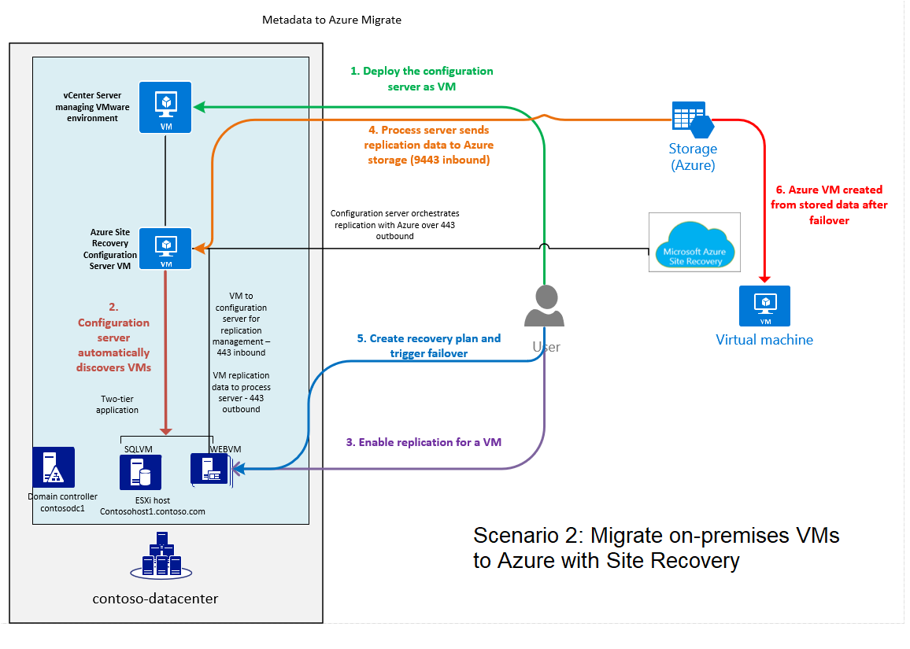  

### DMS
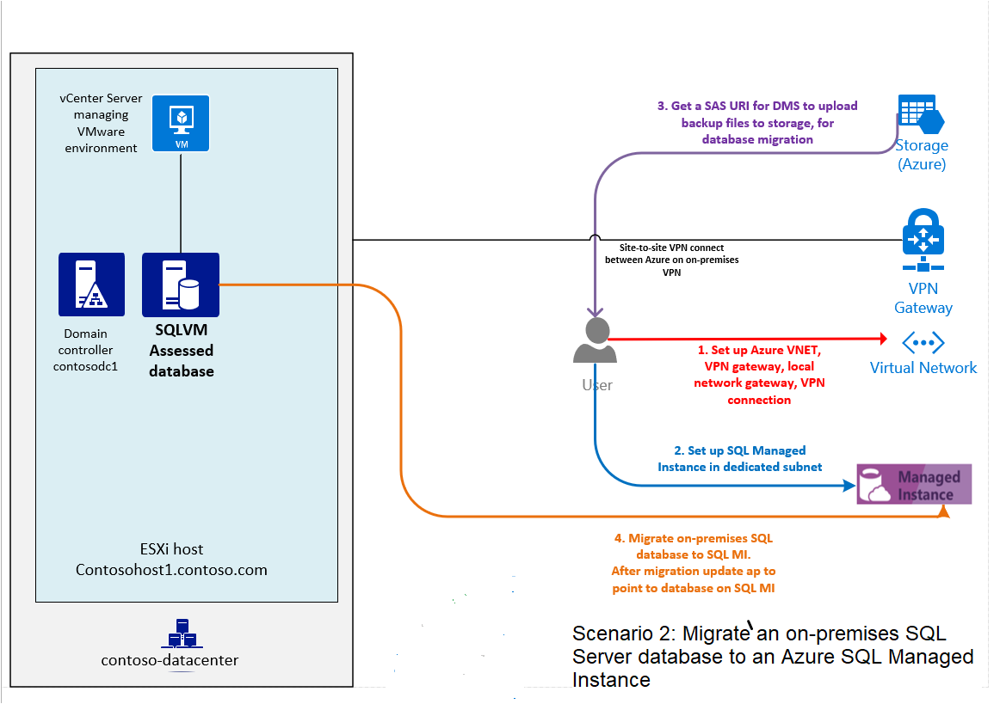  

In this scenario:

- Contoso has an on-premises datacenter (contoso-datacenter), with an on-premises domain controller (**contosodc1**).
- The internal travel app is tiered across two VMs, WEBVM and SQLVM, and located on VMware ESXi host (**contosohost1.contoso.com**).
- The VMware environment is managed by vCenter Server (**vcenter.contoso.com**) running on a VM.

## Prerequisites

If you want to run this scenario, here's what you should have.

Requirements | Details
--- | ---
**Azure subscription** | If you don't have an Azure subscription, create a [free account](https://azure.microsoft.com/pricing/free-trial/).   If you create a free account, you're the administrator of your subscription and can perform all actions.   If you use an existing subscription and you're not the administrator, you need to work with the admin to assign you Owner or Contributor permissions.   If you need more granular permissions, review [this article](../site-recovery/site-recovery-role-based-linked-access-control.md). 
**Site recovery (on-premises)** | An on-premises vCenter server running version 5.5, 6.0, or 6.5   An ESXi host running version 5.5, 6.0 or 6.5   One or more VMware VMs running on the ESXi host.   VMs must meet [Azure requirements](https://docs.microsoft.com/azure/site-recovery/vmware-physical-azure-support-matrix#azure-vm-requirements).   Supported [network](https://docs.microsoft.com/azure/site-recovery/vmware-physical-azure-support-matrix#network) and [storage](https://docs.microsoft.com/en-us/azure/site-recovery/vmware-physical-azure-support-matrix#storage) configuration.
**DMS** | For DMS you need a [compatible on-premises VPN device](https://docs.microsoft.com/azure/vpn-gateway/vpn-gateway-about-vpn-devices).   You must be able to configure the on-premises VPN device. It must have an externally facing public IPv4 address, and the address can't be located behind a NAT device.   Make sure you have access to your on-premises SQL Server database.   The Windows Firewall should be able to access the source database engine. [Learn more](https://docs.microsoft.com/sql/database-engine/configure-windows/configure-a-windows-firewall-for-database-engine-access).   If there's a firewall in front of your database machine, add rules to allow access to the database, and to files via SMB port 445.   The credentials used to connect to the source SQL Server and target Managed Instance must be members of the sysadmin server role.   You need a network share in your on-premises database that DMS can use to back up the source database.   Make sure that the service account running the source SQL Server instance has write privileges on the network share.   Make a note of a Windows user (and password) that has full control privilege on the network share. The Azure Database Migration Service impersonates these user credentials to upload backup files to the Azure storage container.   The SQL Server Express installation process sets the TCP/IP protocol to **Disabled** by default. Make sure that it's enabled.

# Scenario overview

Here's what we're going to do:

> [!div class="checklist"]
> * **Step 1: Set up a site-to-site VPN connection**: DMS connects to your on-premises database over a VPN site-to-site connection. We create a virtual network for the VPN connection and later, we reuse this network for Site Recovery. The network you create must be located in the region in which you create a Recovery Services vault.
> * **Step 2: Set up a SQL Azure Managed Instance**: You need a pre-created managed instance to which the on-premises SQL Server database will migrate.
> * **Step 3: Set up SA URI for DMS**: A shared access signature (SAS) Uniform Resource Identifier (URI) provides delegated access to resources in your storage account, so that you can grant limited permissions to storage objects. Set up a SAS URI so that the DMS can access the storage account container to which the service uploads the SQL Server back-up files.
> * **Step 4: Prepare DMS**: You register the Database Migration provider, create an instance, and then create a DMS project.
> * **Step 5: Prepare Azure for Site Recovery**: You create an Azure storage account to hold replicated data.
> * **Step 6: Prepare on-premises VMware for Site Recovery**: You prepare accounts for VM discovery and agent installation, and prepare to connect to Azure VMs after failover. 
> * **Step 7: Replicate VMs**: You configure the Site Recovery source and target environment, set up a replication policy, and start replicating VMs to Azure storage.
> * **Step 8: Migrate the database with DMS**: Run a database migration.
> * **Step 9: Migrate the VMs with Site Recovery**: Run a failover to migrate the VMs to Azure.

## Step 1: Set up site-to-site VPN connection

To prepare for the VPN site-to-site connection, you set up a virtual network and subnets, create a VPN gateway for the virtual network, and set up a local network gateway so that Azure knows how to connect to your on-premises VPN. Then, create and verify the site-to-site connection.

### Set up a virtual network

Create an Azure virtual network to provide DMS with site-to-site connectivity to your on-premises SQL Server.

1. In the [Azure portal](https://portal.azure.com), click **Create a resource**. Select **Networking** > **Virtual network**.
2. In **Virtual Network** > **Select a deployment model**, select **Resource Manager** > **Create**
3. In **Create virtual network** > **Name**, enter a unique network name. For our scenario, **ContosoVNET**.
4. In **Address space**, add the IP address range. The range mustn't overlap with your on-premises address space.
5. In **Resource group**, create a new group, or select an existing one. In this scenario we're using **ContosoRG**.
6. In **Location**, select the region in which to create the virtual network. We're using **East US 2**.
7. In **Subnet**, add the first subnet name and address range. We've created the **Apps** subnet.
8. Disable service endpoints.

    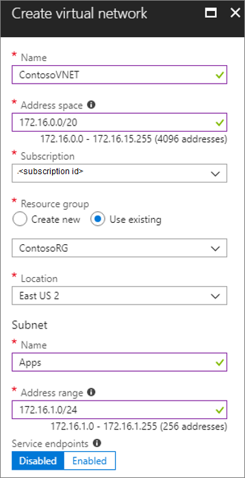

9. Select **Pin to dashboard** so that you can easily find your network in future, and then click **Create**.
10. The virtual network takes a few seconds to create. After it's created, verify it in the Azure portal dashboard.
11. Make sure that these communication ports are allowed in your virtual network: 443, 53, 9354, 445, 12000.

### Set up subnets

We will have four subnets in our Azure network:

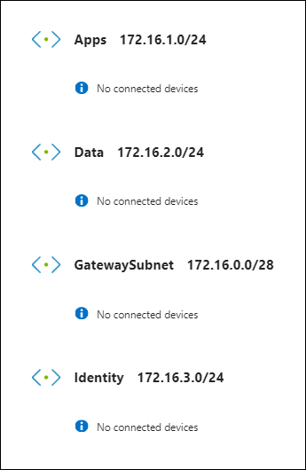

You set up the first subnet (Apps) when you created the network. Now, create the rest of the subnets. The gateway subnet is used by the VPN gateway connection, for Azure to send traffic over a VPN connection to your on-premises site.

1. In the virtual network, under **Settings**, click **Subnet** > **+Subnet**.
2. Set up a subnet **Datamigration**, with this address range, and then click **OK**.

    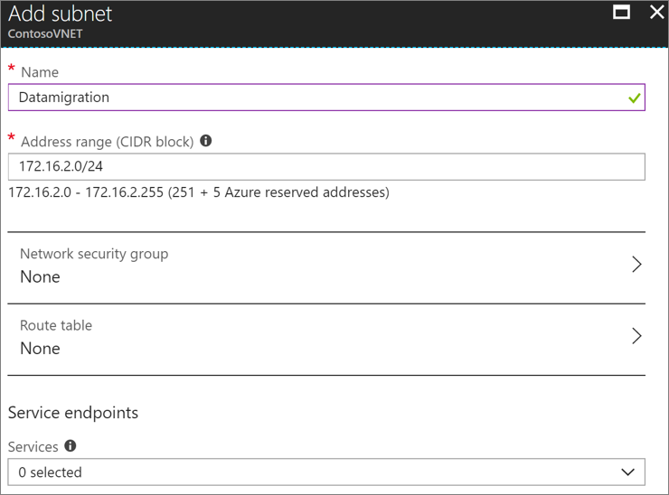  

3. In **+Subnet**, set up a subnet **Identity**, with this address range, and then click **OK**.
    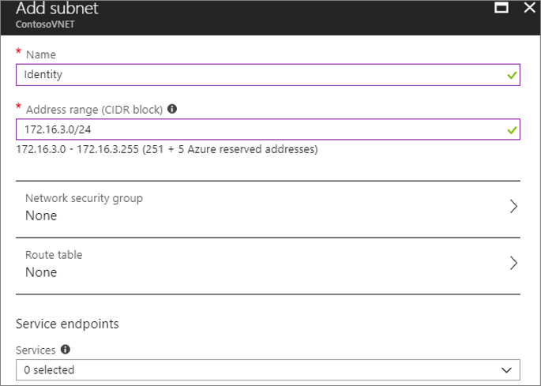

4. In **Subnet**, click **Gateway subnet**, and then click **OK**.
    - This subnet contains the IP addresses that your VPN gateway will use for VPN connections.
    - The name of this subnet is set automatically so that Azure can recognize it.
    - Adjust the auto-filled address range to match your on-premises subnet. 

    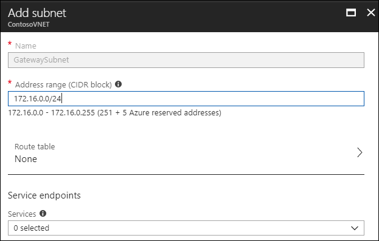
    
### Set up a virtual network gateway

1. On the left side of the portal page, click **+** and type 'Virtual Network Gateway' in search. In **Results**, click **Virtual network gateway**.
2. At the bottom of the 'Virtual network gateway' page, click **Create**.
3. In **Create virtual network gateway** >  **Name**, specify a name for the gateway object.
4. In **Gateway type**, select **VPN**.
5. In **VPN type**, select **Route-based**.
6. In **SKU**, select the gateway SKU from the dropdown. The SKUs listed in the dropdown depend on the VPN type you select. Don't enable active-active mode. [Learn more](https://docs.microsoft.com/azure/vpn-gateway/vpn-gateway-about-vpn-gateway-settings#gwsku) about SKUs.
7. In **Virtual network** > **Choose a virtual network**, add the network you created. The gateway will be added to this network.
8. In **First IP configuration**, specify a public IP address.  A VPN gateway must have a public IP address. This address is dynamically assigned to the resource when the VPN gateway is created. Only dynamic addresses are currently supported but the IP address doesn't change after it's assigned.
    - Click **Create gateway IP configuration**. In **Choose public IP address**, click **+Create new**.
    - In **Create public IP address**, specify a name for your public IP address (Contoso-Gateway). Leave the SKU as **Basic**, and click **OK** to save the changes.
        
    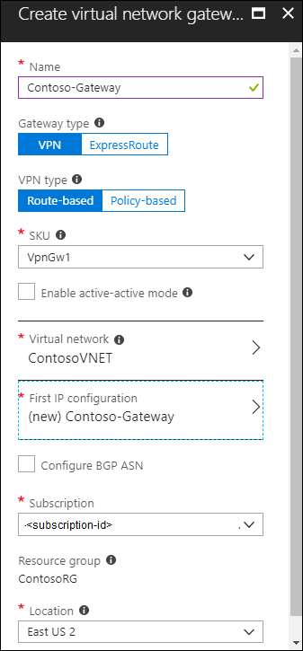 

9. Click **Create** to begin creating the VPN gateway. The settings are validated and "Deploying virtual network gateway" appears on the dashboard.

    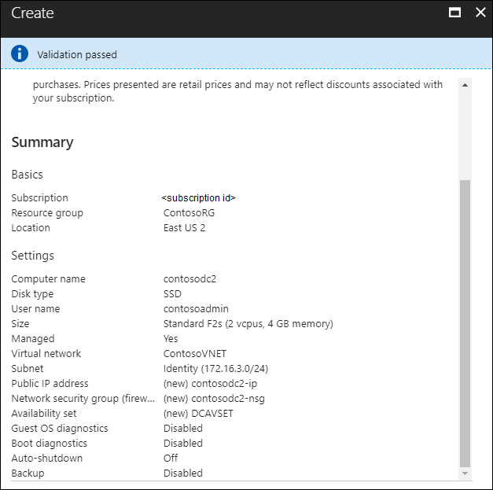
    
Creating a gateway can take up to 45 minutes. You might need to refresh your portal page to see the completed status.

### Set up a local network gateway

Set up a local network gateway in Azure, to represent your on-premises site.

1. In the portal, click **+Create a resource**.
2. In the search box, type **Local network gateway**, then press **Enter** to search. In the results, click **Local network gateway** > **Create**.
3. In **Create local network gateway** > **Name**, specify a name that Azure uses for your local network gateway object.
4. **IP address**, specify the public IP address of the on-premises VPN device to which Azure will connect. The IP address shouldn't be NAT'ed, and Azure must be able to reach it.
5. In **Address space**, type in the local network address ranges that will be routed through the VPN gateway to the on-premises device. Make sure they don't overlap with ranges on the Azure virtual network.
6. **Configure BGP settings** isn't relevant for this scenario.
7. In **Subscription**, verify that the subscription is correct.
8. In **Resource Group**: select the resource group you used to create the network (ContosoRG).
9. In **Location**, select the region in which you created the virtual network.

    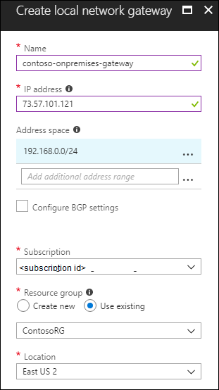

4. Click **Create** to create the local gateway.

### Configure your on-premises VPN device

Here's what you need to configure on your on-premises VPN device:
- The public IPv4 address of the Azure virtual network gateway that you just created.
- The preshared key (the key that you used when creating the VPN site-to-site connection).  

To help you set up your on-premises VPN device:

- Depending on the on-premises VPN device that you have, you might be able to download a VPN device configuration script. [Learn more](https://docs.microsoft.com/azure/vpn-gateway/vpn-gateway-download-vpndevicescript).
- Review [more helpful resources](https://docs.microsoft.com/azure/vpn-gateway/vpn-gateway-howto-site-to-site-resource-manager-portal#VPNDevice).

### Create the VPN connection

Now, create the site-to-site VPN connection between the virtual network gateway and your on-premises VPN device.

1. Open the virtual network page in **Virtual networks** > **Overview** > **Connected devices**. 
2. Click **Connections** > **+Add**.
3. In **Add connection** > **Name**, specify a name for the connection.
4. In **Connection type**, select **Site-to-site (IPSec)**.
5. The **Virtual network gateway** value is fixed because you're connecting from this gateway.
6. In **Local network gateway**, specify the local network gateway you created.
7. In **Shared Key**, specify the key that matches the value that you're using for your local on-premises VPN device. The example uses 'abc123', but you can (and should) use something more complex. The important thing is that the value you specify here must be the same value that you specified when configuring your VPN device.
8. The values for **Subscription**, **Resource Group**, and **Location** are fixed.

    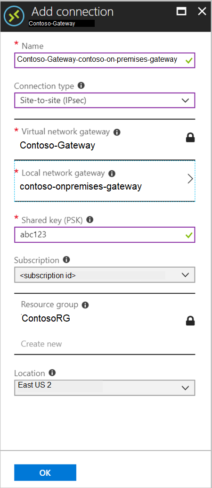 

4. Click **OK** to create the connection. You'll see "Creating connection" flash on the screen.
5. After the connection is created,  view it on the **Connections** page of the virtual network gateway. The status will go from Unknown > Connecting > Succeeded.

### Verify the VPN connection

In the Azure portal, you can view the connection status of a Resource Manager VPN Gateway by navigating to the connection. 

1. Click **All resources**, and navigate to your virtual network gateway.
2. In the virtual network gateway page, click **Connections**. You can see the status of each connection.
3. Click the name of the connection, and view more information in **Essentials**. The status is 'Succeeded' and 'Connected' when you have made a successful connection.

Now verify that you can connect to the SQL Server VM over VPN. Use a Remote Desktop connection and connect to the VM IP address.

## Step 2: Prepare an Azure SQL Managed Instance

### Set up a virtual network

For this scenario you will need to create another virtual network that's dedicated to the Azure SQL Managed Instance.  Note the following requirements:

- To create the managed instance you need a dedicated subnet.
- The subnet must be empty and not contain any other cloud service, and it mustn't be a gateway subnet. After the managed instance is created, you mustn't add resources to the subnet.
- The subnet mustn't have an NSG associated with it.
- The subnet must have a User Route Table (UDR) with 0.0.0.0/0 Next Hop Internet as the only route assigned to it. 
- Optional custom DNS: If custom DNS is specified on the VNet, Azure's recursive resolvers IP address (such as 168.63.129.16) must be added to the list. [Learn more](https://docs.microsoft.com/azure/sql-database/sql-database-managed-instance-custom-dns).
- The subnet mustn't have a service endpoint (storage or SQL) associated with it. Service endpoints should be disabled on the virtual network.
- The subnet must have minimum of 16 IP addresses. [Learn more](https://docs.microsoft.com/azure/sql-database/sql-database-managed-instance-vnet-configuration#determine-the-size-of-subnet-for-managed-instances) about sizing the managed instance subnet.

Set up the virtual network as follows:

1.	In the Azure portal, click **Create a resource**. 
2. Select **Networking** > **Virtual network**.
3. In **Virtual Network** > **Select a deployment model**, select **Resource Manager** > **Create**.
4. In **Create virtual network** > **Name**, enter a unique network name. For our scenario, **ContosoVNETSQLMI**.
5. In **Address space**, add the IP address range shown below. The range mustn't overlap with your on-premises and ContosoVNET address space.
6. In **Resource group**, create a new group, or select an existing one. In this scenario we're using **ContosoRG**.
7. In **Location**, select the region in which to create the virtual network. We're using **East US 2**.
8. In **Subnet**, add the first subnet name and address range. We created the **ManagedInstances** subnet.
9. Disable service endpoints.

    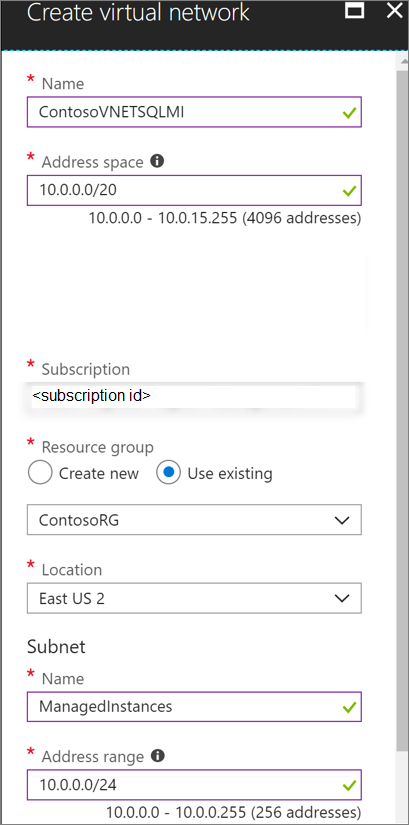

10. After the network is deployed, you need to change the DNS settings. In this scenario, the DNS first points to a domain controller in the Identity subnet using a static private IP address (172.16.3.4),  and then the Azure DNS resolver 168.63.129.16.

    

### Set up routing

1. Click **Create a resource** in the upper left-hand corner of the Azure portal. Click **Route table** > **Create on the Route table** page.
2. In **Create route table** > **Name**, specify a name for the table.
3. Select your subscription, resource group, and location. Leave BGP disabled, and click **Create**.
    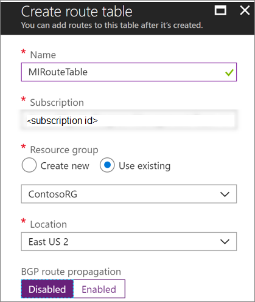

4. After the route table has been created, open it, and click **Routes** > **+Add**.
5. In **Add route** > **Name**, specify a route name.
6. In **Address prefix**, specify 0.0.0.0/0.
7. In **Next hop type**, select **Internet**. Then click **OK**.

     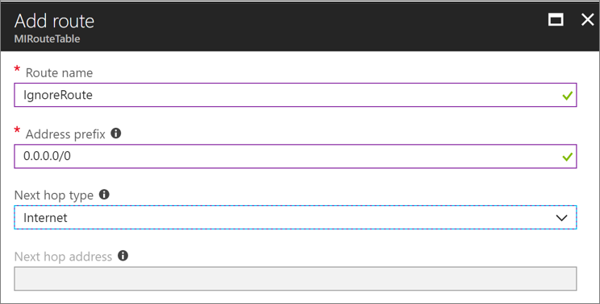

### Apply the route to the managed instance subnet

1. Open the virtual network you created. Click **Subnets** > your-subnet-name.
2. Click **Route table** > your-table-name. Then click **Save**.

     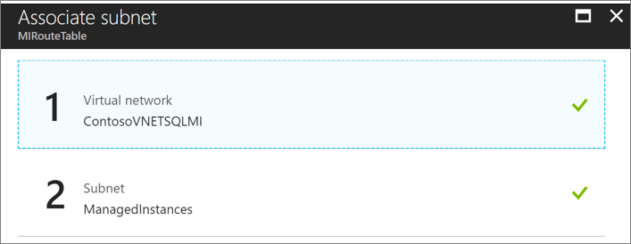

### Create a managed instance

1. Click **Create a resource**, locate **Managed Instance**, and select **Azure SQL Database Managed Instance (preview)**.
2. Click **Create**.
3. In **SQL Managed Instance**, select your subscription, and verify that **Preview terms** show **Accepted**.
4. In **Managed Instance name**, specify a name. 
5. Specify a username and password as admin for the instance.
6. Select your resource group, location, and the virtual network for the instance.
7. Click **Pricing tier** to size compute and storage. By default, the instance gets 32 GB of storage space free of charge (April 2018).
8. Specify the storage, and number of virtual cores.
9. Click **Apply** to save the settings, and **Create** to deploy the managed instance. To view deployment status, click **Notifications**, and **Deployment in progress**.

    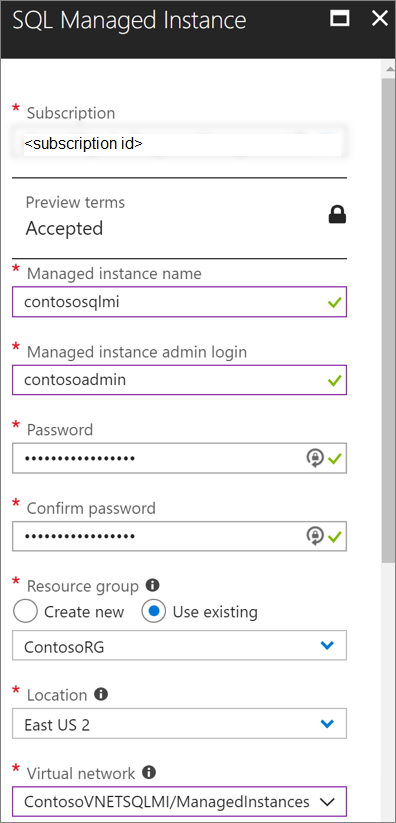

After the Managed Instance deployment finishes, two new resources appear in the ContosoRG resource group: Virtual Cluster for the Managed Instances, and the SQL Managed Instance. Both are in the East US 2 location.

    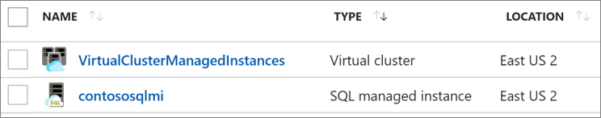

## Step 3: Get a SAS URI for DMS

Get an SAS URI so that DMS can access your storage account container, to upload the back-up files that are used to migrate databases to Azure SQL Database Managed Instance. 

1. Open Storage Explorer (Preview).
2. In the left pane, expand the storage account containing the blob container for which you want to get a SAS. Expand the storage account's **Blob Containers**.
3. Right-click the  container, and select **Get Shared Access Signature**.

     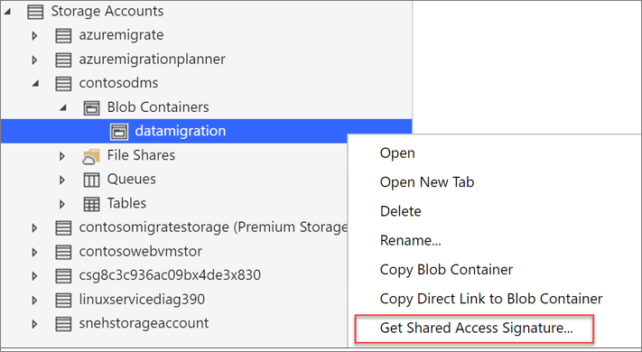

4. In **Shared Access Signature**, specify the policy, start and expiration dates, time zone, and access levels you want for the resource. Then click **Create**.

    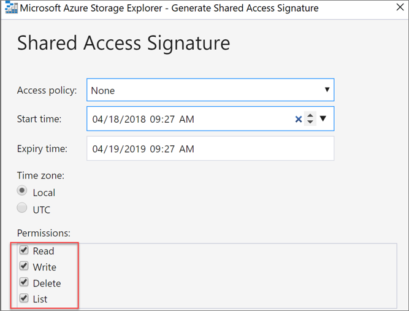

5. A second dialog displays the blob container, along with the URL and QueryStrings you can use to access the storage resource. Select **Copy** to copy the values. Keep them in a safe place. You need them when you set up DMS.

      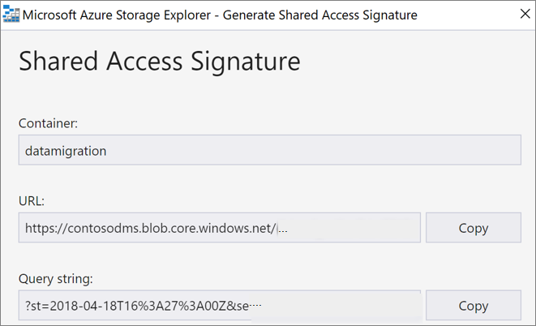  

## Step 4: Prepare DMS

You register the Database Migration provider, and create an instance.

### Register the Microsoft.DataMigration resource provider

1. In your subscription, select **Resource Providers**. 
2. Search for "migration", and then to the right of Microsoft.DataMigration, select **Register**. 

### Create an instance

1. Select **+ Create a resource**, search for 'Azure Database Migration Service', and then select **Azure Database Migration Service** from the drop-down list.
2. On the Azure Database Migration Service (preview) screen, select **Create**.
3. Specify a name for the service, the subscription, resource group, virtual network, and the pricing tier.
4. Select **Create** to create the service.

    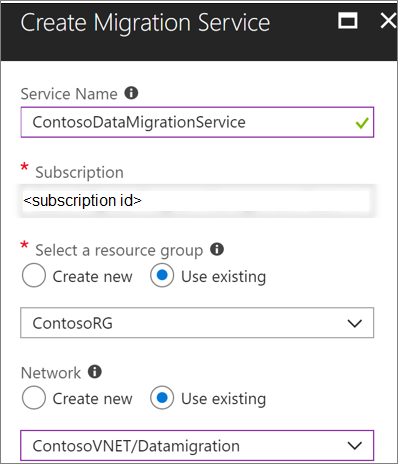  

## Step 5: Prepare Azure for the Site Recovery service

### Set up a virtual network

You need an Azure network in which the Azure VMs will be located when they're created after failover, and an Azure storage account in which replicated data is stored.

- For the purposes of this scenario, we'll use the Azure network that we created earlier, for DMS.
- Note that the network you use must be in the same region as the Site Recovery vault.

### Create an Azure storage account

Site Recovery replicates VM data to Azure storage. Azure VMs are created from the storage when you fail over from on-premises to Azure.

1. On the [Azure portal](https://portal.azure.com) menu, select **New** > **Storage** > **Storage account**.
2. On **Create storage account**, enter a name for the account. For these tutorials, use the name **contosovmsacct1910171607**. The name must be unique within Azure and be between 3 and 24 characters, with numbers and lowercase letters only.
3. In **Deployment model**, select **Resource Manager**.
4. In **Account kind**, select **General purpose**. In **Performance**, select **Standard**. Don't select blob storage.
5. In **Replication**, select the default **Read-access geo-redundant storage** for storage redundancy.
6. In **Subscription**, select the subscription in which you want to create the new storage account.
7. In **Resource group**, enter a new resource group. An Azure resource group is a logical container into which Azure resources are deployed and managed. For these tutorials, use the name **ContosoRG**.
8. In **Location**, select the geographic location for your storage account. The storage account must be in the same region as the Recovery Services vault. For this scenario, we're using the **East US 2** region.

   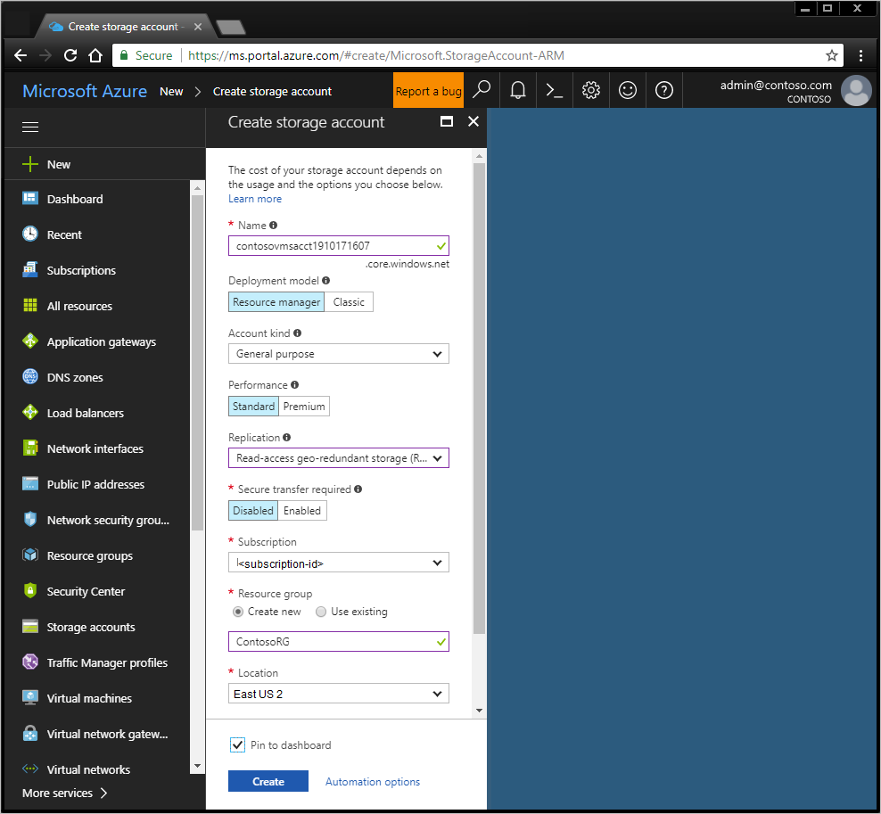

9. Select **Create** to create the storage account.

### Create a Recovery Services vault

1. In the Azure portal, select **Create a resource** > **Monitoring + Management** > **Backup and Site Recovery**.
2. In **Name**, enter a friendly name to identify the vault. For this tutorial, use **ContosoVMVault**.
3. In **Resource group**, select the existing resource group named **contosoRG**.
4. In **Location**, enter the Azure region **East US 2**.
5. To quickly access the vault from the dashboard, select **Pin to dashboard** > **Create**.
The new vault appears on **Dashboard** > **All resources**, and on the main **Recovery Services vaults** page.

## Step 6: Prepare on-premises VMware for Site Recovery

To prepare VMware for Site Recovery, here's what you need to do:

- Prepare an account on the vCenter server or vSphere ESXi host, to automate VM discovery
- Prepare an account for automatic installation of the Mobility service on VMware VMs
- Prepare on-premises VMs if you want to connect to Azure VMs after failover.

### Prepare an account for automatic discovery

Site Recovery needs access to VMware servers to:

- Automatically discover VMs. At least a read-only account is required.
- Orchestrate replication, failover, and failback. You need an account that can run operations such as creating and removing disks, and turning on VMs.

Create the account as follows:

1. To use a dedicated account, create a role at the vCenter level. Give the role a name such as **Azure_Site_Recovery**.
2. Assign the role the permissions summarized in the table below.
3. Create a user on the vCenter server or vSphere host. Assign the role to the user.

**Task** | **Role/Permissions** | **Details**
--- | --- | ---
**VM discovery** | At least a read-only user   Data Center object –> Propagate to Child Object, role=Read-only | User assigned at datacenter level, and has access to all the objects in the datacenter.   To restrict access, assign the **No access** role with the **Propagate to child** object, to the child objects (vSphere hosts, datastores, VMs and networks).
**Full replication, failover, failback** |  Create a role (Azure_Site_Recovery) with the required permissions, and then assign the role to a VMware user or group   Data Center object –> Propagate to Child Object, role=Azure_Site_Recovery   Datastore -> Allocate space, browse datastore, low-level file operations, remove file, update virtual machine files   Network -> Network assign   Resource -> Assign VM to resource pool, migrate powered off VM, migrate powered on VM   Tasks -> Create task, update task   Virtual machine -> Configuration   Virtual machine -> Interact -> answer question, device connection, configure CD media, configure floppy media, power off, power on, VMware tools install   Virtual machine -> Inventory -> Create, register, unregister   Virtual machine -> Provisioning -> Allow virtual machine download, allow virtual machine files upload   Virtual machine -> Snapshots -> Remove snapshots | User assigned at datacenter level, and has access to all the objects in the datacenter.   To restrict access, assign the **No access** role with the **Propagate to child** object, to the child objects (vSphere hosts, datastores, VMs and networks).

### Prepare an account for Mobility service installation

The Mobility service must be installed on the VM you want to replicate.

- Site Recovery can do an automatic push installation of this component when you enable replication for the VM.
- For automatic push installation, you need to prepare an account that Site Recovery will use to access the VM.
- You specify this account when you set up replication in the Azure console.
- You need a domain or local account with permissions to install on the VM.

### Prepare to connect to Azure VMs after failover

After failover to Azure you might want to connect to your replicated VMs in Azure from your on-premises network.

To connect to Windows VMs using RDP after failover, do the following:

1. To access over the internet, enable RDP on the on-premises VM before failover. Make sure that TCP and UDP rules are added for the **Public** profile, and that RDP is allowed in **Windows Firewall** > **Allowed Apps** for all profiles.
2. To access over site-to-site VPN, enable RDP on the on-premises machine. RDP should be allowed in the **Windows Firewall** -> **Allowed apps and features** for **Domain and Private** networks.
3. Check that the operating system's SAN policy is set to **OnlineAll**. [Learn more](https://support.microsoft.com/kb/3031135).
4. There should be no Windows updates pending on the VM when you trigger a failover. If there are, you won't be able to log in to the virtual machine until the update completes.
5. On the Windows Azure VM after failover, check **Boot diagnostics** to view a screenshot of the VM. If you can't connect, check that the VM is running and review these [troubleshooting tips](http://social.technet.microsoft.com/wiki/contents/articles/31666.troubleshooting-remote-desktop-connection-after-failover-using-asr.aspx).

## Step 7: Replicate VMs with Site Recovery

### Select a replication goal

1. In **Recovery Services vaults**, select the vault name, **ContosoVMVault**.
2. In **Getting Started**, select Site Recovery. Then select **Prepare Infrastructure**.
3. In **Protection goal** > **Where are your machines located**, select **On-premises**.
4. In **Where do you want to replicate your machines**, select **To Azure**.
5. In **Are your machines virtualized**, select **Yes, with VMware vSphere Hypervisor**. Then select **OK**.

    

### Confirm deployment planning

In **Deployment Planning**, click **Yes, I have done it**, in the dropdown list.

### Set up the source environment

To set up the source environment, you need a single, highly available, on-premises machine to host on-premises Site Recovery components. Components include the configuration server, and the process server.

- The configuration server coordinates communications between on-premises and Azure and manages data replication.
- The process server acts as a replication gateway. It receives replication data; optimizes it with caching, compression, and encryption; and sends it to Azure storage.
- The process server also installs Mobility Service on VMs you want to replicate and performs automatic discovery of on-premises VMware VMs.

To set up the configuration server as a highly available VMware VM:

- Download a prepared Open Virtualization Format (OVF) template.
- Import the template into VMware to create the VM.
- Set up the configuration server, and register it in the vault. 

After registration, Site Recovery discovers on-premises VMware VMs.

#### Download the VM template

1. In the vault, go to **Prepare Infrastructure** > **Source**.
2. In **Prepare source**, select **+Configuration server**.

    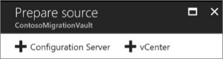

4. In **Add Server**, check that **Configuration server for VMware** appears in **Server type**.
2. Download the OVF template for the configuration server.

    

  > [!TIP]
  You can download the latest version of the configuration server template directly from the [Microsoft Download Center](https://aka.ms/asrconfigurationserver).

#### Import the template in VMware

1. Sign in to the VMware vCenter server using the VMWare vSphere Client.
2. On the **File** menu, select **Deploy OVF Template** to start the Deploy OVF Template wizard. 

     

3. On **Select source**, enter the location of the downloaded OVF.
4. On **Review details**, select **Next**.
5. On **Select name and folder** and **Select configuration**, accept the default settings.
6. On **Select storage**, for best performance select **Thick Provision Eager Zeroed** in **Select virtual disk format**.
7. On the rest of the wizard pages, accept the default settings.
8. On **Ready to complete**:

    * To set up the VM with the default settings, select **Power on after deployment** > **Finish**.

    * If you want to add an additional network interface, clear **Power on after deployment**. Then select **Finish**. By default, the configuration server template is deployed with a single NIC. You can add additional NICs after deployment.

#### Register the configuration server 

1. From the VMWare vSphere Client console, turn on the VM.
2. The VM boots up into a Windows Server 2016 installation experience. Accept the license agreement, and enter an administrator password.
3. After the installation finishes, sign in to the VM as the administrator.
4. The first time you sign in, the Azure Site Recovery Configuration Tool starts.
5. Enter a name that's used to register the configuration server with Site Recovery. Then select **Next**.

    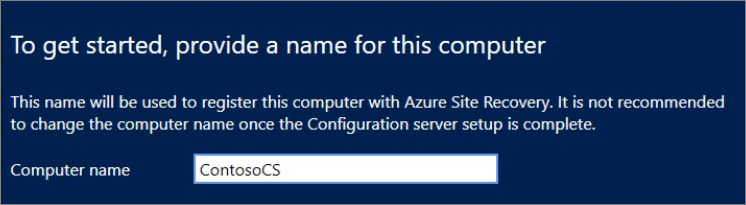

6. The tool checks that the VM can connect to Azure. After the connection is established, select **Sign in** to sign in to your Azure subscription. The credentials must have access to the vault in which you want to register the configuration server.

    

7. The tool performs some configuration tasks and then reboots.
8. Sign in to the machine again. The configuration server management wizard starts automatically.

#### Configure settings and add the VMware server

1. In the configuration server management wizard, select **Setup connectivity**, and then select the NIC to receive replication traffic. Then select **Save**. You can't change this setting after it's configured.
2. In **Select Recovery Services vault**, select your Azure subscription and the relevant resource group and vault.

    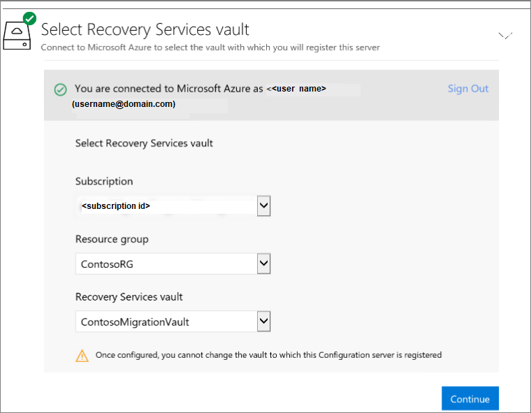 

3. In **Install third-party software**, accept the license agreement. Select **Download and Install** to install MySQL Server.
4. Select **Install VMware PowerCLI**. Make sure all browser windows are closed before you do this. Then select **Continue**.
5. In **Validate appliance configuration**, prerequisites are verified before you continue.
6. In **Configure vCenter Server/vSphere ESXi server**, enter the FQDN or IP address of the vCenter server, or vSphere host, where the VMs you want to replicate are located. Enter the port on which the server is listening. Enter a friendly name to be used for the VMware server in the vault.
7. Enter credentials to be used by the configuration server to connect to the VMware server. Site Recovery uses these credentials to automatically discover VMware VMs that are available for replication. Select **Add**, and then select **Continue**.

    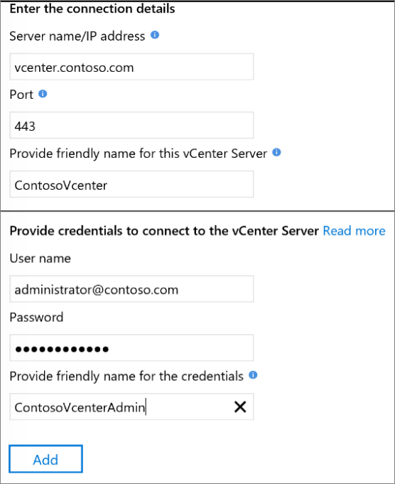

8. In **Configure virtual machine credentials**, enter the user name and password to be used to automatically install Mobility Service on machines, when replication is enabled. For Windows machines, the account needs local administrator privileges on the machines you want to replicate. 

    

7. Select **Finalize configuration** to complete registration. 
8. After registration finishes, in the Azure portal, verify that the configuration server and VMware server are listed on the **Source** page in the vault. Then select **OK** to configure target settings.
9. Site Recovery connects to VMware servers by using the specified settings and discovers VMs.

> [!NOTE]
> It can take 15 minutes or more for the account name to appear in the portal. To update immediately, select **Configuration Servers** > ***server name*** > **Refresh Server**.

### Set up the target environment

Select and verify target resources.

1. In **Prepare infrastructure** > **Target**, select the Azure subscription you want to use.
2. For the target deployment model, select **Azure Resource Manager**.

3. Site Recovery checks that you have one or more compatible Azure storage accounts and networks.

### Create a replication policy

1. In **Prepare infrastructure** > **Replication Settings** > **Replication Policy**, click **Create and Associate**.
1. In **Create replication policy**, enter the policy name **VMwareRepPolicy**.
2. In **RPO threshold**, use the default of 60 minutes. This value defines how often recovery points are created. An alert is generated if continuous replication exceeds this limit.
3. In **Recovery point retention**, use the default of 24 hours for how long the retention window is for each recovery point. For this tutorial, use 72 hours. Replicated VMs can be recovered to any point in a window.
4. In **App-consistent snapshot frequency**, use the default of 60 minutes for the frequency that application-consistent snapshots are created. Select **OK** to create the policy.

    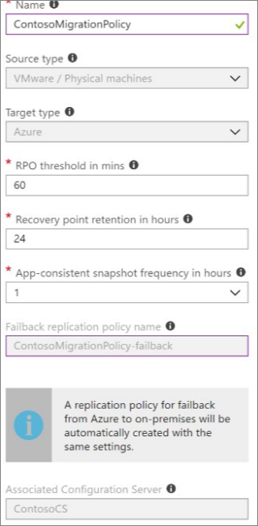

5. The policy is automatically associated with the configuration server. 

    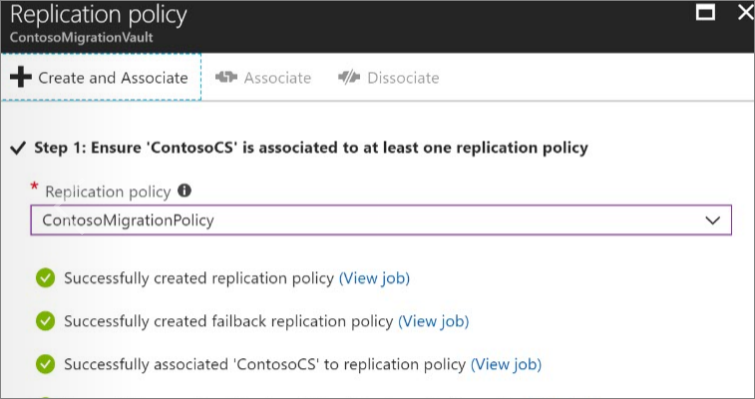

### Enable replication

Now start replicating the VMs. Site Recovery installs the Mobility Service on each VM when you enable replication for it. 

1. Select **Replicate application** > **Source**.
2. In **Source**, select the configuration server.
3. In **Machine type**, select **Virtual Machines**.
4. In **vCenter/vSphere Hypervisor**, select the vCenter server that manages the vSphere host, or select the host.
5. Select the process server (configuration server). Then select **OK**.

    

1. In **Target**, select the subscription and the resource group in which you want to create the failed-over VMs. Choose the deployment model that you want to use in Azure (classic or Resource Manager) for the failed-over VMs.
2. Select the Azure storage account you want to use to replicate data.
3. Select the Azure network and subnet to which Azure VMs connect when they're created after failover.
4. Select **Configure now for selected machines** to apply the network setting to all machines you select for protection. Select **Configure later** to select the Azure network per machine.
5. Select the subnet in the virtual network. Then select **OK**.

    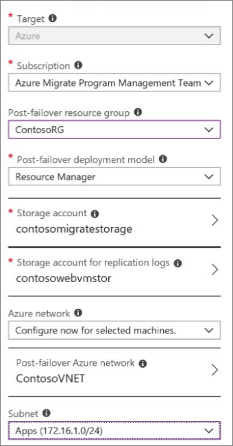

6. In **Virtual Machines** > **Select virtual machines**, select the VM (WEBVM) that you want. You can only select machines for which replication can be enabled. 

    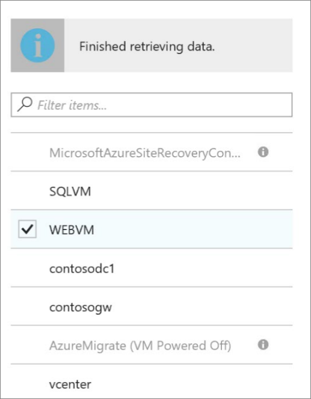

7. To monitor VMs you add, check the last discovered time for VMs in **Configuration Servers** > **Last Contact At**. To add VMs without waiting for the scheduled discovery, highlight the configuration server (don't select it) and select **Refresh**. It can take 15 minutes or longer for changes to take effect and appear in the portal.
8. In **Properties** > **Configure properties**, select the account to be used by the process server to automatically install Mobility Service on the machine. 

    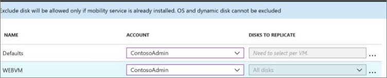

9. In **Replication settings** > **Configure replication settings**, verify that the correct replication policy is selected.
10. Select **Enable Replication**.

    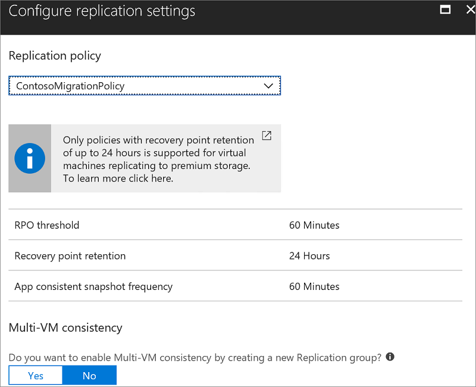

11. Track progress of the **Enable Protection** job in **Settings** > **Jobs** > **Site Recovery Jobs**. 
12. After the **Finalize Protection** job runs, the machine is ready for failover, and appears in **Overview** > **Essentials**.

    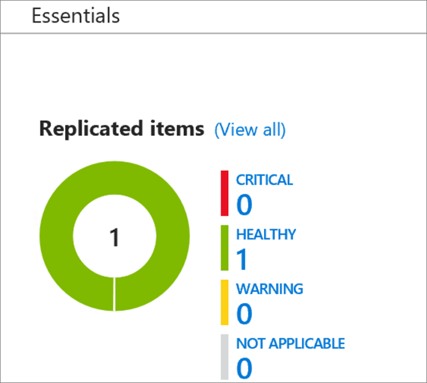

## Step 8: Migrate the database with DMS

Create a DMS project, and run the migration.

### Create a Database Migration project

1. Locate the DMS resource in the Azure portal, and open it.
2. Select **+ New Migration Project**.
3. In **New migration project**, specify a name for the project.
4. In **Source server type**, select **SQL Server**. In **Target server type**, select **Azure SQL Database Managed Instance**.
5. Click **Create** to create the project.
6. In **Source details**, specify the connection details for the on-premises source SQL Server. Click **Save**.
7. In **Target details**, specify the connection details for the target, which is the pre-provisioned Azure SQL Database Managed Instance to which the on-premises database will be migrated. Then click **Save**.
8. In **Project summary**, review and verify the details associated with the migration project.

    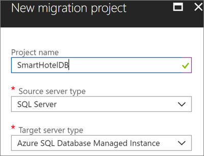

### Migrate the database

1. After creating the project, the Migration Wizard appears.
2. Specify the credentials for the source and target servers, and click **Save**. The wizard attempts to log in to your on-premises SQL Server.

    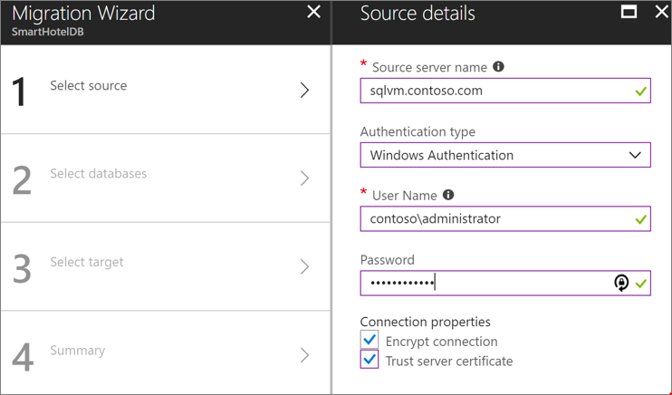

3. In **Map to target databases**, select the source database you want to migrate. Then click **Save**.

    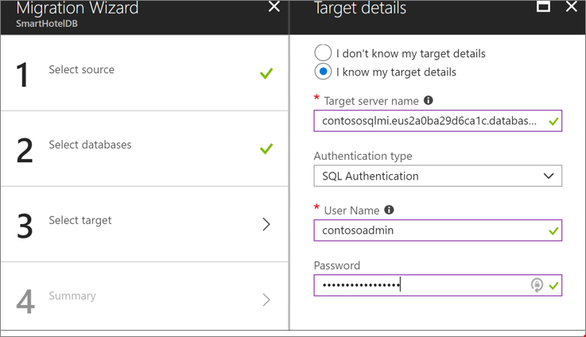

4. In **Target details**, select **I know my target details**. Provide the DNS name of your SQL Managed Instances, along with the credentials. Then click **Save**.

    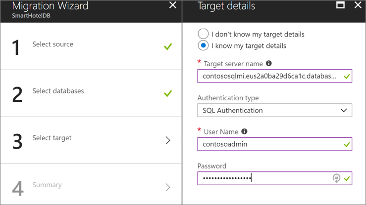

5. In the saved project, select **+New Activity**. Then select **Run Migration**.
6. When prompted, enter the credentials for the source and target servers. Then click **Save**.
7. In **Map to target databases**, select the source database that you want to migrate. Then click **Save**
8. In **Configure migration settings** > **Server backup location**, specify the network share you created on the on-premises machine. DMS takes source backups to this share.  Remember that the service account running the source SQL Server instance must have write privileges on this share.
9. Specify the user name and password that DMS can impersonate for uploading the backup files to the Azure storage container, for restore.
10. Specify the SAS URI that provides the DMS with access to your storage account container to which the service uploads the backup files, and which is used for migration to Azure SQL Database Managed Instance.  Then click **Save**.
11. In **Migration summary**, specify a name for the migration activity > **Run the migration**.
12. In the project > **Overview**, monitor the migration status. After migration completes, verify that the target databases exist on the managed instance.

## Step 9: Migrate VMs with Site Recovery

We suggest you run a test failover to make sure that everything's working as expected, before you run a full migration. When you run a test failover, the following happens:

1. A prerequisites check runs to make sure all of the conditions required for migration are in place.
2. Failover processes the data, so that an Azure VM can be created. If select the latest recovery point, a recovery point is created from the data.
3. An Azure VM is created using the data processed in the previous step.

### Run a test failover

1. In **Protected Items**, click **Replicated Items** > VM.
2. In the VM properties, click **+Test Failover**.

    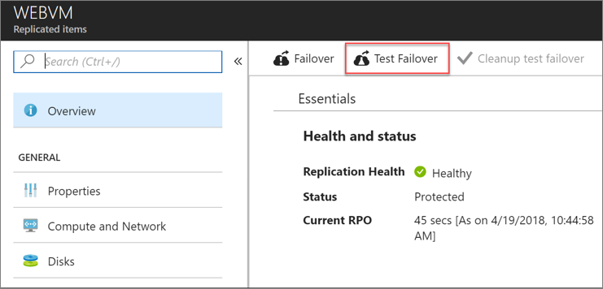

3. Select **Latest processed**, to fail over the VM to the latest available point in time. The time stamp is shown. With this option, no time is spent processing data, so it provides a low RTO (recovery time objective).
2. In **Test Failover**, select the target Azure network to which Azure VMs will be connected after failover occurs.
3. Click **OK** to begin the failover. You can track progress bin the vault  > **Settings** > **Jobs** > **Test Failover**.
4. After the failover finishes, the replica Azure VM appears in the Azure portal > **Virtual Machines**. Check that the VM is the appropriate size, that it's connected to the right network, and that it's running. You should now be able to connect to the replicated VM in Azure.
5. To delete Azure VMs created during the test failover, click **Cleanup test failover** on the
  VM. In **Notes**, record and save any observations associated with the test failover.

## Migrate the machines

After you've verified that the test failover works as expected, create a recovery plan to migrate to Azure.

### Create a recovery plan

1. In the Recovery Services vault, select **Recovery Plans (Site Recovery)** > **+Recovery Plan**.
2. In **Create recovery plan**, specify a name for the plan.
3. Choose the source configuration server, and Azure as the target. Select **Resource Manager** for the deployment model. The source location must have machines that are enabled for failover and recovery. 
4. In **Select items**, add the machines (WEBVM) to the plan. Then click **OK**.
5. Click **OK** to create the plan.

    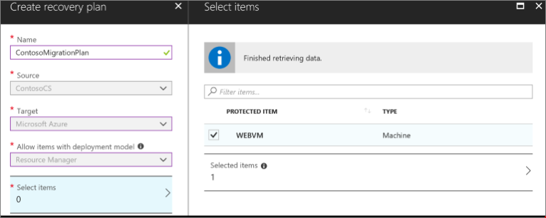

### Run a failover

1. In **Recovery Plans**, click the plan > **Failover**.
2. In **Failover** > **Recovery Point**, select the latest recovery point.
3. The encryption key setting isn't relevant for this scenario.
4. Select **Shut down machine before beginning failover**. Site Recovery will attempt to do a shutdown of source virtual machines before triggering the failover. Failover continues even if shutdown fails. You can follow the failover progress on the **Jobs** page.

    

5. Check that the Azure VM appears in Azure as expected.

    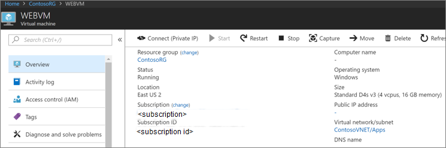

6. In **Replicated items**, right-click the VM > **Complete Migration**. This finishes the migration process, stops replication for the VM, and stops Site Recovery billing for the VM.

    

### Update the connection string

The final step in the migration process is to update the connection string of the application to point to the migrated database running on your SQL MI.

1. Find the new connection string in the Azure portal by clicking **Settings** > **Connection Strings**.

    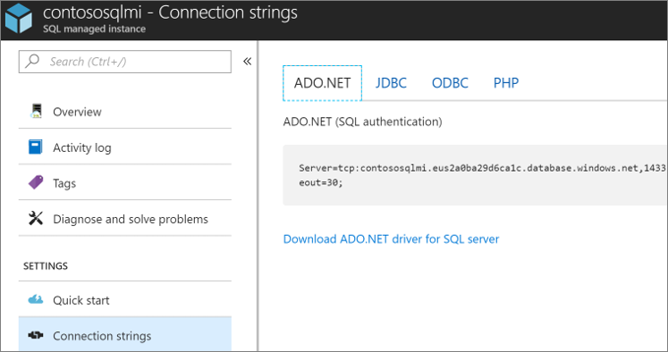  

2. You need to update this string with the user name and password for your SQL MI.
3. After the string is configured, you need to replace the current connection string in the web.config file of your application.
4. After updating the file and saving it, restart IIS on the WEBVM. This can be done using the IISRESET /RESTART from a cmd prompt.
5. After IIS has been restarted, your application will now be using the database running on your SQL MI.
6. At this point the SQLVM machine on-premises can be shut down, and the migration is complete.

- The new connection string can be located using in the Azure portal by clicking Settings > Connection Strings

## Conclusion

In this scenario we've:

> [!div class="checklist"]
> * Migrated our on-premises database to an Azure SQL Managed Instance with DMS.
> * Migrated our on-premises VMs to Azure VMs, with the Azure Site Recovery service.
