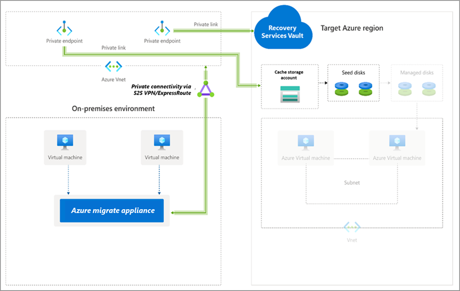
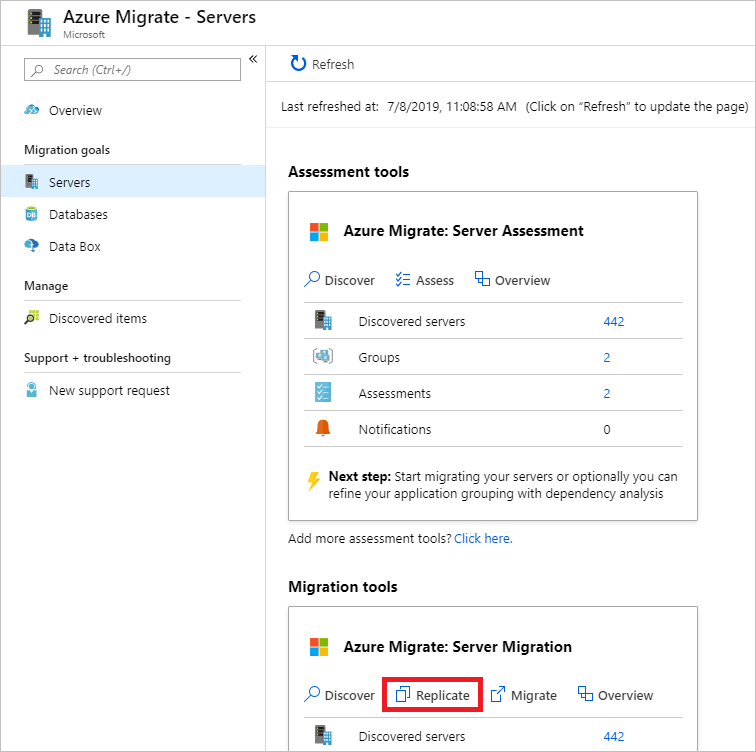
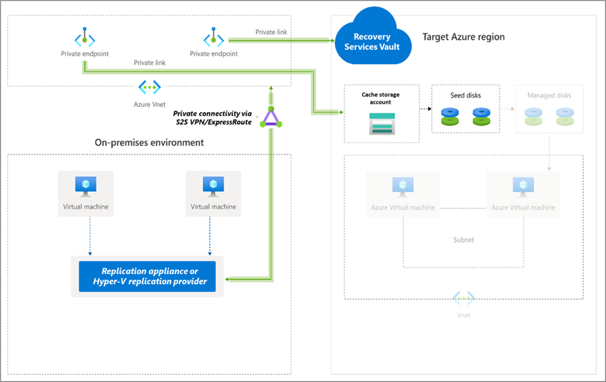
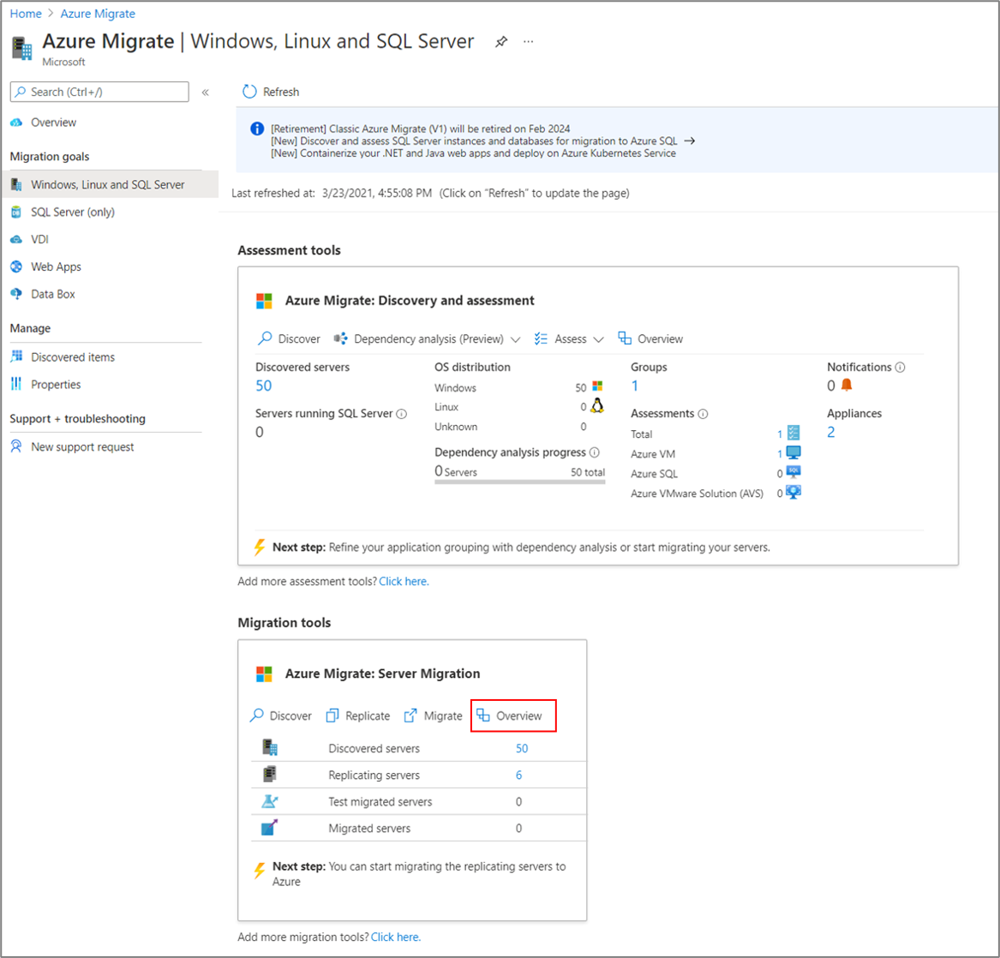
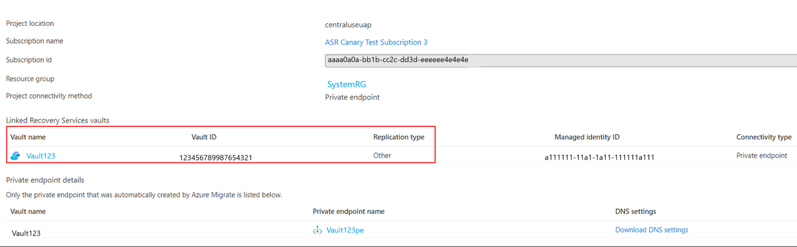
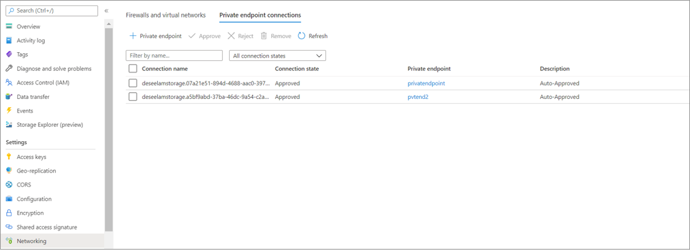
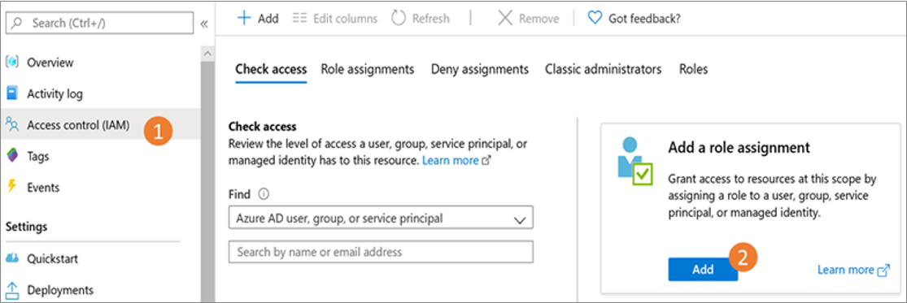
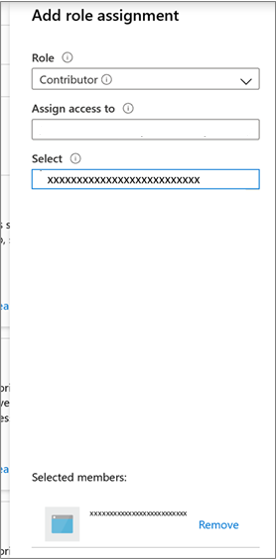

# Migrate servers to Azure using Private Link

This article describes how to use Azure Migrate to migrate servers over a private network by using [Azure Private Link](../private-link/private-endpoint-overview.md). You can use the [Migration and modernization](migrate-services-overview.md#migration-and-modernization-tool) tool to connect privately and securely to Azure Migrate over an Azure ExpressRoute private peering or a site-to-site (S2S) VPN connection by using Private Link. 

::: zone pivot="agentlessvmware"

This article shows how to migrate on-premises VMware VMs to Azure, using the [Migration and modernization tool](migrate-services-overview.md#migration-and-modernization-tool), with agentless migration.

## Set up the Azure Migrate appliance

The Migration and modernization tool runs a lightweight VMware VM appliance to enable the discovery, assessment, and agentless migration of VMware VMs. If you have followed the [Discovery and assessment tutorial](discover-and-assess-using-private-endpoints.md), you've already set the appliance up. If you didn't, [set up and configure the appliance](./discover-and-assess-using-private-endpoints.md#set-up-the-azure-migrate-appliance) before you proceed.

To use a private connection for replication, you can use the storage account created earlier during Azure Migrate project setup or create a new cache storage account and configure private endpoint. To create a new storage account with private endpoint, see [Private endpoint for storage account](../private-link/tutorial-private-endpoint-storage-portal.md#create-storage-account-with-a-private-endpoint).

 - The private endpoint allows the Azure Migrate appliance to connect to the cache storage account using a private connection like an ExpressRoute private peering or VPN. Data can then be transferred directly on the private IP address.

> [!Important]
> - In addition to replication data, the Azure Migrate appliance communicates with the Azure Migrate service for its control plane activities. These activities include orchestrating replication. Control plane communication between the Azure Migrate appliance and the Azure Migrate service continues to happen over the internet on the Azure Migrate service's public endpoint.
> - The private endpoint of the storage account should be accessible from the network where the Azure Migrate appliance is deployed.
> - DNS must be configured to resolve DNS queries by the Azure Migrate appliance for the cache storage account's blob service endpoint to the private IP address of the private endpoint attached to the cache storage account.
> - The cache storage account must be accessible on its public endpoint. Azure Migrate uses the cache storage account's public endpoint to move data from the storage account to replica-managed disks.

## Replicate VMs

After setting up the appliance and completing discovery, you can begin replicating VMware VMs to Azure.

The following diagram illustrates the agentless replication workflow with private endpoints by using the Migration and modernization tool.

Enable replication as follows:
1. In the Azure Migrate project > **Servers, databases and web apps** > **Migration and modernization** > **Migration tools**, select **Replicate**. 

    

1. In **Replicate** > **Basics** > **Are your machines virtualized?**, select **Yes, with VMware vSphere**.
1. In **On-premises appliance**, select the name of the Azure Migrate appliance. Select **OK**.

    :::image type="content" source="./media/how-to-use-azure-migrate-with-private-endpoints/source-settings-vmware.png" alt-text="Diagram that shows how to complete source settings.":::

1. In **Virtual machines**, select the machines you want to replicate. To apply VM sizing and disk type from an assessment, in **Import migration settings from an Azure Migrate assessment?**,
     - Select **Yes**, and select the VM group and assessment name.  
     - Select **No** if you aren't using assessment settings.

    :::image type="content" source="./media/how-to-use-azure-migrate-with-private-endpoints/migrate-machines-vmware.png" alt-text="Diagram that shows how to select the VMs.":::

1. In **Virtual machines**, select VMs you want to migrate. Then click **Next**. 

    :::image type="content" source="./media/how-to-use-azure-migrate-with-private-endpoints/select-vm-vmware.png" alt-text="Screenshot of selected VMs to be replicated.":::

1. In **Target settings**, select the **target region** in which the Azure VMs will reside after migration.  

    :::image type="content" source="./media/how-to-use-azure-migrate-with-private-endpoints/target-settings.png" alt-text="Screenshot of the Target settings screen.":::

1. In **Replication storage account**, use the dropdown list to select a storage account to replicate over a private link. 
    >[!NOTE] 
    > Only the storage accounts in the selected target region and Azure Migrate project subscription are listed.

1. Next, [**create a private endpoint for the storage account**](migrate-servers-to-azure-using-private-link.md#create-a-private-endpoint-for-the-storage-account) to enable replications over a private link. Ensure that the Azure Migrate appliance has network connectivity to the storage account on its private endpoint. Learn how to [verify network connectivity](./troubleshoot-network-connectivity.md#verify-dns-resolution).  
    >[!NOTE] 
    > - The storage account cannot be changed after you enable replication.  
    > - To orchestrate replications, Azure Migrate will grant the trusted Microsoft services and the Recovery Services vault managed identity access to the selected storage account. 

    >[!Tip] 
    > You can manually update the DNS records by editing the DNS hosts file on the Azure Migrate appliance with the private link FQDNs and  private IP address of the storage account. 

1. Select the **Subscription** and **Resource group** in which the Azure VMs reside after migration. 
1. In **Virtual network**, select the Azure VNet/subnet for the migrated  Azure VMs.  
1. In **Availability options**, select: 

    - Availability Zone to pin the migrated machine to a specific Availability Zone in the region. Use this option to distribute servers that form a multi-node application tier across Availability Zones. If you select this option, you'll need to specify the Availability Zone to use for each of the selected machine in the Compute tab. This option is only available if the target region selected for the migration supports Availability Zones 

    - Availability Set to place the migrated machine in an Availability Set. The target Resource Group that was selected must have one or more availability sets in order to use this option. 

    - No infrastructure redundancy required option if you don't need either of these availability configurations for the migrated machines. 
1. In **Disk encryption type**, select: 

    - Encryption-at-rest with platform-managed key 

    - Encryption-at-rest with customer-managed key 

    - Double encryption with platform-managed and customer-managed keys 

    >[!Note] 
    > To replicate VMs with CMK, you'll need to [create a disk encryption set](../virtual-machines/disks-enable-customer-managed-keys-portal.md#set-up-your-disk-encryption-set) under the target Resource Group. A disk encryption set object maps Managed Disks to a Key Vault that contains the CMK to use for SSE. 
1. In **Azure Hybrid Benefit**: 

    - Select **No** if you don't want to apply Azure Hybrid Benefit and click **Next**. 

    - Select **Yes** if you have Windows Server machines that are covered with active Software Assurance or Windows Server subscriptions, and you want to apply the benefit to the machines you're migrating and click **Next**. 

     :::image type="content" source="./media/how-to-use-azure-migrate-with-private-endpoints/azure-hybrid-benefit.png" alt-text="Screenshot shows the options in Azure Hybrid Benefit."::: 

1. In **Compute**, review the VM name, size, OS disk type, and availability configuration (if selected in the previous step). VMs must conform with [Azure requirements](migrate-support-matrix-vmware-migration.md#azure-vm-requirements). 

    - **VM size**: If you're using assessment recommendations, the VM size dropdown shows the recommended size. Otherwise, Azure Migrate picks a size based on the closest match in the Azure subscription. Alternatively, pick a manual size in **Azure VM size**. 

    - **OS disk**: Specify the OS (boot) disk for the VM. The OS disk is the disk that has the operating system bootloader and installer. 

    - **Availability Zone**: Specify the Availability Zone to use. 

    - **Availability Set**: Specify the Availability Set to use. 
    >[!Note] 
    > If you want to select a different availability option for a set of virtual machines, go to step 1 and repeat the steps by selecting different availability options after starting replication for one set of virtual machines. 
1. In **Disks**, specify whether the VM disks should be replicated to Azure, and select the disk type (standard SSD/HDD or premium-managed disks) in Azure. Then click **Next**. 

     :::image type="content" source="./media/how-to-use-azure-migrate-with-private-endpoints/disks-agentless-vmware.png" alt-text="Screenshot shows the Disks tab of the Replicate dialog box.":::

1. In **Tags**, add tags to your migrated virtual machines, disks, and NICs.

1. In **Review and start replication**, review the settings, and click **Replicate** to start the initial replication for the servers. 
    Next, follow the instructions to [perform migrations](tutorial-migrate-vmware.md#run-a-test-migration). 

#### Provisioning for the first time  

Azure Migrate does not create any additional resources for replications using Azure Private Link (Service Bus, Key Vault, and storage accounts are not created). Azure Migrate will make use of the selected storage account for uploading replication data, state data, and orchestration messages.

## Create a private endpoint for the storage account  

To replicate by using ExpressRoute with private peering, [**create a private endpoint**](../private-link/tutorial-private-endpoint-storage-portal.md#create-storage-account-with-a-private-endpoint) for the cache/replication storage account (target subresource: *blob*). 

>[!Note] 
> You can create private endpoints only on a general-purpose v2 storage account. For pricing information, see [Azure Page Blobs pricing](https://azure.microsoft.com/pricing/details/storage/page-blobs/) and [Azure Private Link pricing](https://azure.microsoft.com/pricing/details/private-link/). 

Create the private endpoint for the storage account in the same virtual network as the Azure Migrate project private endpoint or another virtual network connected to this network. 

Select **Yes** and integrate with a private DNS zone. The private DNS zone helps in routing the connections from the virtual network to the storage account over a private link. Selecting **Yes** automatically links the DNS zone to the virtual network. It also adds the DNS records for the resolution of new IPs and FQDNs that are created. Learn more about [private DNS zones](../dns/private-dns-overview.md). 

If the user who created the private endpoint is also the storage account owner, the private endpoint creation will be auto approved. Otherwise, the owner of the storage account must approve the private endpoint for use. To approve or reject a requested private endpoint connection, on the storage account page under **Networking**, go to **Private endpoint connections**. 

Review the status of the private endpoint connection state before you continue. 

:::image type="content" source="./media/how-to-use-azure-migrate-with-private-endpoints/private-endpoint-status-vmware.png" alt-text="Screenshot that shows the Private endpoint approval status.":::

Ensure that the on-premises appliance has network connectivity to the storage account via its private endpoint. To validate the private link connection, perform a DNS resolution of the storage account endpoint (private link resource FQDN) from the on-premises server hosting the Migrate appliance and ensure that it resolves to a private IP address. Learn how to verify [network connectivity.](./troubleshoot-network-connectivity.md#verify-dns-resolution)

## Next steps 

 - [Migrate VMs](tutorial-migrate-vmware.md#migrate-vms)
 - Complete the [migration process](tutorial-migrate-vmware.md#complete-the-migration).
 - Review the [post-migration best practices](tutorial-migrate-vmware.md#post-migration-best-practices). 

::: zone-end

::: zone pivot="hyperv"

This article shows you how to [migrate on-premises Hyper-V VMs to Azure](tutorial-migrate-hyper-v.md), using the [Migration and modernization](migrate-services-overview.md#migration-and-modernization-tool) tool, with agentless migration. You can also migrate using agent-based migration.  

## Set up the replication provider for migration 

The following diagram illustrates the agentless migration workflow with private endpoints by using the Migration and modernization tool. 

 

For migrating Hyper-V VMs, the Migration and modernization tool installs software providers (Microsoft Azure Site Recovery provider and Microsoft Azure Recovery Service agent) on Hyper-V Hosts or cluster nodes.  
1. In the Azure Migrate project > **Servers, databases and web apps** > **Migration and modernization**, select **Discover**. 
1. In **Discover machines** > **Are your machines virtualized?**, select **Yes, with Hyper-V**.
1. In **Target region**, select the Azure region to which you want to migrate the machines.
1. Select **Confirm that the target region for migration is region-name**. 
1. Select **Create resources**. This creates an Azure Site Recovery vault in the background. Don't close the page during the creation of resources. If you have already set up migration with the Migration and modernization tool, this option won't appear since resources were set up previously. 
    - This step creates a Recovery Services vault in the background and enables a managed identity for the vault. A Recovery Services vault is an entity that contains the replication information of servers and is used to trigger replication operations.
    - If the Azure Migrate project has private endpoint connectivity, a private endpoint is created for the Recovery Services vault. This step adds five fully qualified domain names (FQDNs) to the private endpoint, one for each microservice linked to the Recovery Services vault.
    - The five domain names are formatted in this pattern:  *{Vault-ID}-asr-pod01-{type}-.{target-geo-code}*.privatelink.siterecovery.windowsazure.com
    - By default, Azure Migrate automatically creates a private DNS zone and adds DNS A records for the Recovery Services vault microservices. The private DNS is then linked to the private endpoint virtual network.
1. In **Prepare Hyper-V host servers**, download the Hyper-V Replication provider, and the registration key file. 

    - The registration key is needed to register the Hyper-V host with the Migration and modernization tool. 

    - The key is valid for five days after you generate it. 

    
1. Copy the provider setup file and registration key file to each Hyper-V host (or cluster node) running VMs you want to replicate. 
> [!Note]
>Before you register the replication provider, ensure that the vault's private link FQDNs are reachable from the machine that hosts the replication provider. Additional DNS configuration may be required for the on-premises replication appliance to resolve the private link FQDNs to their private IP addresses. Learn more about [how to verify network connectivity](./troubleshoot-network-connectivity.md#verify-dns-resolution) 

Next, follow these instructions to [install and register the replication provider](tutorial-migrate-hyper-v.md#install-and-register-the-provider). 
  
## Replicate Hyper-V VMs

With discovery completed, you can begin replication of Hyper-V VMs to Azure.  

> [!Note] 
> You can replicate up to 10 machines together. If you need to replicate more, then replicate them simultaneously in batches of 10. 

1. In the Azure Migrate project > **Servers, databases and web apps** > **Migration and modernization** > **Migration tools**, select **Replicate**. 
1. In **Replicate** > **Basics** > **Are your machines virtualized?**, select **Yes, with Hyper-V**. Then click **Next: Virtual machines**.
1. In **Virtual machines**, select the machines you want to replicate. 
    - If you've run an assessment for the VMs, you can apply VM sizing and disk type (premium/standard) recommendations from the assessment results. To do this, in **Import migration settings from an Azure Migrate assessment?**, select the **Yes** option. 
    - If you didn't run an assessment, or you don't want to use the assessment settings, select the **No** option. 
    - If you selected to use the assessment, select the VM group, and assessment name. 

    :::image type="content" source="./media/how-to-use-azure-migrate-with-private-endpoints/migrate-machines-vmware.png" alt-text="Screenshot of migrate machines screen.":::

1. In **Virtual machines**, search for VMs as needed, and select each VM you want to migrate. Then click **Next:Target settings**. 

    :::image type="content" source="./media/how-to-use-azure-migrate-with-private-endpoints/select-vm.png" alt-text="Screenshot of selected VMs.":::

1. In **Target settings**, select the target region to which you'll migrate, the subscription, and the resource group in which the Azure VMs will reside after migration.  

    :::image type="content" source="./media/tutorial-migrate-hyper-v/target-settings.png" alt-text="Screenshot of target settings.":::

1. In **Replication storage account**, select the Azure storage account in which replicated data will be stored in Azure.  

1. Next, [**create a private endpoint for the storage account**](/azure/migrate/migrate-servers-to-azure-using-private-link?pivots=agentlessvmware#create-a-private-endpoint-for-the-storage-account) and [**grant permissions to the Recovery Services vault managed identity**](/azure/migrate/migrate-servers-to-azure-using-private-link?pivots=agentbased#grant-access-permissions-to-the-recovery-services-vault-1) to access the storage account required by Azure Migrate. This is mandatory before you proceed. 

    -  For Hyper-V VM migrations to Azure, if the replication storage account is of *Premium* type, you must select another storage account of *Standard* type for the cache storage account. In this case, you must create private endpoints for both the replication and cache storage account.

    - Ensure that the server hosting the replication provider has network connectivity to the storage accounts via the private endpoints before you proceed. Learn how to [verify network connectivity](./troubleshoot-network-connectivity.md#verify-dns-resolution).  
        >[!Tip] 
        > You can manually update the DNS records by editing the DNS hosts file on the Azure Migrate appliance with the private link FQDNs and private IP addresses of the storage account. 

1. In **Virtual network**, select the Azure VNet/subnet for the migrated Azure VMs.

1. In **Availability options**, select: 

    - Availability Zone to pin the migrated machine to a specific Availability Zone in the region. Use this option to distribute servers that form a multi-node application tier across Availability Zones. If you select this option, you'll need to specify the Availability Zone to use for each of the selected machine in the Compute tab. This option is only available if the target region selected for the migration supports Availability Zones. 

    - Availability Set to place the migrated machine in an Availability Set. The target Resource Group that was selected must have one or more availability sets in order to use this option. 

    - No infrastructure redundancy required option if you don't need either of these availability configurations for the migrated machines. 

1. In **Azure Hybrid Benefit**: 

    - Select **No** if you don't want to apply Azure Hybrid Benefit. Then, click **Next**. 

    - Select **Yes** if you have Windows Server machines that are covered with active Software Assurance or Windows Server subscriptions, and you want to apply the benefit to the machines you're migrating. Then click **Next**.

    :::image type="content" source="./media/how-to-use-azure-migrate-with-private-endpoints/azure-hybrid-benefit.png" alt-text="Screenshot of Azure Hybrid benefit selection.":::

1. In **Compute**, review the VM name, size, OS disk type, and availability configuration (if selected in the previous step). VMs must conform with [Azure requirements](migrate-support-matrix-hyper-v-migration.md#azure-vm-requirements). 

    - **VM size**: If you're using assessment recommendations, the VM size dropdown shows the recommended size. Otherwise, Azure Migrate picks a size based on the closest match in the Azure subscription. Alternatively, pick a manual size in **Azure VM size**. 

    - **OS disk**: Specify the OS (boot) disk for the VM. The OS disk is the disk that has the operating system bootloader and installer. 

    - **Availability Set**: If the VM should be in an Azure availability set after migration, specify the set. The set must be in the target resource group you specify for the migration.

1. In **Disks**, specify the VM disks that need to be replicated to Azure. Then click **Next**. 
    - You can exclude disks from replication. 
    - If you exclude disks, they won't be present on the Azure VM after migration. 

    :::image type="content" source="./media/how-to-use-azure-migrate-with-private-endpoints/disks.png" alt-text="Screenshot shows the Disks tab of the Replicate dialog box.":::

1. In **Tags**, add tags to your migrated virtual machines, disks, and NICs.

1. In **Review and start replication**, review the settings, and click **Replicate** to start the initial replication for the servers. 

    > [!Note]
    > You can update replication settings any time before replication starts, **Manage** > **Replicating machines**. Settings can't be changed after replication starts. 

    Next, follow the instructions to [perform migrations](tutorial-migrate-hyper-v.md#migrate-vms). 
]
### Grant access permissions to the Recovery Services vault

You must grant the permissions to the Recovery Services vault for authenticated access to the cache/replication storage account.

To identify the Recovery Services vault created by Azure Migrate and grant the required permissions, follow these steps.

**Identify the Recovery Services vault and the managed identity object ID**

You can find the details of the Recovery Services vault on the Migration and modernization tool **Properties** page.

1. Go to the **Azure Migrate** hub, and on the **Migration and modernization** tile, select **Overview**.

     

1. In the left pane, select **Properties**. Make a note of the Recovery Services vault name and managed identity ID. The vault will have **Private endpoint** as the **Connectivity type** and **Other** as the **Replication type**. You'll need this information when you provide access to the vault.

    

**Permissions to access the storage account**

 To the managed identity of the vault, you must grant the following role permissions on the storage account required for replication. In this case, you must create the storage account in advance.

The role permissions for the Azure Resource Manager vary depending on the type of storage account.

|**Storage account type** | **Role permissions**|
|--- | ---|
|Standard type | [Contributor](../role-based-access-control/built-in-roles.md#contributor) [Storage Blob Data Contributor](../role-based-access-control/built-in-roles.md#storage-blob-data-contributor)|
|Premium type | [Contributor](../role-based-access-control/built-in-roles.md#contributor) [Storage Blob Data Owner](../role-based-access-control/built-in-roles.md#storage-blob-data-owner)

1. Go to the replication/cache storage account selected for replication. In the left pane, select **Access control (IAM)**.

1. Select **+ Add**, and select **Add role assignment**.

   :::image type="content" source="./media/how-to-use-azure-migrate-with-private-endpoints/storage-role-assignment.png" alt-text="Screenshot that shows Add role assignment.":::

1. On the **Add role assignment** page in the **Role** box, select the appropriate role from the permissions list previously mentioned. Enter the name of the vault noted previously and select **Save**.

    :::image type="content" source="./media/how-to-use-azure-migrate-with-private-endpoints/storage-role-assignment-select-role.png" alt-text="Screenshot that shows the Add role assignment page.":::

1. In addition to these permissions, you must also allow access to Microsoft trusted services. If your network access is restricted to selected networks, on the **Networking** tab in the **Exceptions** section, select **Allow trusted Microsoft services to access this storage account**.

   :::image type="content" source="./media/how-to-use-azure-migrate-with-private-endpoints/exceptions.png" alt-text="Screenshot that shows the Allow trusted Microsoft services to access this storage account option.":::

## Create a private endpoint for the storage account 

To replicate by using ExpressRoute with private peering, [create a private endpoint](../private-link/tutorial-private-endpoint-storage-portal.md#create-storage-account-with-a-private-endpoint) for the cache/replication storage accounts (target subresource: *blob*).

>[!Note]
> You can create private endpoints only on a general-purpose v2 storage account. For pricing information, see [Azure Page Blobs pricing](https://azure.microsoft.com/pricing/details/storage/page-blobs/) and [Azure Private Link pricing](https://azure.microsoft.com/pricing/details/private-link/).

Create the private endpoint for the storage account in the same virtual network as the Azure Migrate project private endpoint or another virtual network connected to this network.

Select **Yes** and integrate with a private DNS zone. The private DNS zone helps in routing the connections from the virtual network to the storage account over a private link. Selecting **Yes** automatically links the DNS zone to the virtual network. It also adds the DNS records for the resolution of new IPs and FQDNs that are created. Learn more about [private DNS zones](../dns/private-dns-overview.md).

If the user who created the private endpoint is also the storage account owner, the private endpoint creation will be auto approved. Otherwise, the owner of the storage account must approve the private endpoint for use. To approve or reject a requested private endpoint connection, on the storage account page under **Networking**, go to **Private endpoint connections**.

Review the status of the private endpoint connection state before you continue.

After you've created the private endpoint, use the dropdown list in **Replicate** > **Target settings** > **Cache storage account** to select the storage account for replicating over a private link.

Ensure that the on-premises replication appliance has network connectivity to the storage account on its private endpoint. Learn more about how to verify [network connectivity](./troubleshoot-network-connectivity.md). 

Ensure that the replication provider has network connectivity to the storage account via its private endpoint. To validate the private link connection, perform a DNS resolution of the storage account endpoint (private link resource FQDN) from the on-premises server hosting the replication provider and ensure that it resolves to a private IP address. Learn how to verify [network connectivity.](./troubleshoot-network-connectivity.md#verify-dns-resolution)

>[!Note]
> For Hyper-V VM migrations to Azure, if the replication storage account is of *Premium* type, you must select another storage account of *Standard* type for the cache storage account. In this case, you must create private endpoints for both the replication and cache storage account. 

## Next steps
 - [Migrate VMs](tutorial-migrate-hyper-v.md#migrate-vms)
 - Complete the [migration process](tutorial-migrate-hyper-v.md#complete-the-migration).
 - Review the [post-migration best practices](tutorial-migrate-hyper-v.md#post-migration-best-practices).

::: zone-end

::: zone pivot="agentbased"

This article shows a proof-of-concept deployment path for agent-based replications to migrate your [VMware VMs](tutorial-migrate-vmware-agent.md), [Hyper-V VMs](tutorial-migrate-physical-virtual-machines.md), [physical servers](tutorial-migrate-physical-virtual-machines.md), [VMs running on AWS](tutorial-migrate-aws-virtual-machines.md), [VMs running on GCP](tutorial-migrate-gcp-virtual-machines.md), or VMs running on a different virtualization provider by using Azure private endpoints. 

## Set up a replication appliance for migration

The following diagram illustrates the agent-based replication workflow with private endpoints by using the Migration and modernization tool.

The tool uses a replication appliance to replicate your servers to Azure. Follow these steps to create the required resources for migration.

1. In **Discover machines** > **Are your machines virtualized?**, select **Not virtualized/Other**.
1. In **Target region**, select and confirm the Azure region to which you want to migrate the machines.
1. Select **Create resources** to create the required Azure resources. Don't close the page during the creation of resources.
    - This step creates a Recovery Services vault in the background and enables a managed identity for the vault. A Recovery Services vault is an entity that contains the replication information of servers and is used to trigger replication operations.
    - If the Azure Migrate project has private endpoint connectivity, a private endpoint is created for the Recovery Services vault. This step adds five fully qualified domain names (FQDNs) to the private endpoint, one for each microservice linked to the Recovery Services vault.
    - The five domain names are formatted in this pattern:  *{Vault-ID}-asr-pod01-{type}-.{target-geo-code}*.privatelink.siterecovery.windowsazure.com
    - By default, Azure Migrate automatically creates a private DNS zone and adds DNS A records for the Recovery Services vault microservices. The private DNS is then linked to the private endpoint virtual network.

>[!Note]
> Before you register the replication appliance, ensure that the vault's private link FQDNs are reachable from the machine that hosts the replication appliance. Additional DNS configuration may be required for the on-premises replication appliance to resolve the private link FQDNs to their private IP addresses. Learn more about [how to verify network connectivity](./troubleshoot-network-connectivity.md#verify-dns-resolution). 

After you verify the connectivity, download the appliance setup and key file, run the installation process, and register the appliance to Azure Migrate. Learn more about how to [set up the replication appliance](./tutorial-migrate-physical-virtual-machines.md#prepare-a-machine-for-the-replication-appliance). After you set up the replication appliance, follow these instructions to [install the mobility service](./tutorial-migrate-physical-virtual-machines.md#install-the-mobility-service-agent) on the machines you want to migrate.

## Replicate servers

Now, select machines for replication and migration.

>[!Note]
> You can replicate up to 10 machines together. If you need to replicate more, then replicate them simultaneously in batches of 10. 

1. In the Azure Migrate project > **Servers, databases and web apps** > **Migration and modernization** > **Migration tools**, select **Replicate**. 

    

1. In **Replicate** > **Basics** > **Are your machines virtualized?**, select **Not virtualized/Other**. 
1. In **On-premises appliance**, select the name of the Azure Migrate appliance that you set up. 
1. In **Process Server**, select the name of the replication appliance. 
1. In **Guest credentials**, please select the dummy account created previously during the [replication installer setup](tutorial-migrate-physical-virtual-machines.md#download-the-replication-appliance-installer) to install the Mobility service manually (push install is not supported). Then click **Next: Virtual machines.**

    :::image type="content" source="./media/how-to-use-azure-migrate-with-private-endpoints/source-settings-vmware.png" alt-text="Diagram that shows how to complete source settings.":::

1. In **Virtual machines**, in **Import migration settings from an assessment?**, leave the default setting **No, I'll specify the migration settings manually**.
1. Select each VM you want to migrate. Then click **Next:Target settings**. 

    :::image type="content" source="./media/how-to-use-azure-migrate-with-private-endpoints/select-vm.png" alt-text="Screenshot of selected VMs to be replicated.":::

1. In **Target settings**, select the subscription,the target region to which you'll migrate, and the resource group in which the Azure VMs will reside after migration.  

    :::image type="content" source="./media/how-to-use-azure-migrate-with-private-endpoints/target-settings-agent-inline.png" alt-text="Screenshot displays the options in Overview." lightbox="./media/how-to-use-azure-migrate-with-private-endpoints/target-settings-agent-expanded.png":::

1. In **Virtual network**, select the Azure VNet/subnet for the migrated  Azure VMs. 
1. In **Cache storage account**, use the dropdown list to select a storage account to replicate over a private link.  

1. Next, [**create a private endpoint for the storage account**](migrate-servers-to-azure-using-private-link.md#create-a-private-endpoint-for-the-storage-account-1) and [**grant permissions to the Recovery Services vault managed identity**](migrate-servers-to-azure-using-private-link.md#grant-access-permissions-to-the-recovery-services-vault) to access the storage account required by Azure Migrate. This is mandatory before you proceed.   

    - Ensure that the server hosting the replication appliance has network connectivity to the storage accounts via the private endpoints before you proceed. Learn how to [verify network connectivity](./troubleshoot-network-connectivity.md#verify-dns-resolution).     
    
        >[!Tip] 
        > You can manually update the DNS records by editing the DNS hosts file on the Azure Migrate appliance with the private link FQDNs and private IP addresses of the storage account. 

1. In **Availability options**, select: 

    - Availability Zone to pin the migrated machine to a specific Availability Zone in the region. Use this option to distribute servers that form a multi-node application tier across Availability Zones. If you select this option, you'll need to specify the Availability Zone to use for each of the selected machine in the Compute tab. This option is only available if the target region selected for the migration supports Availability Zones. 

    - Availability Set to place the migrated machine in an Availability Set. The target Resource Group that was selected must have one or more availability sets in order to use this option. 

    - No infrastructure redundancy required option if you don't need either of these availability configurations for the migrated machines. 
1. In **Disk encryption type**, select: 

    - Encryption-at-rest with platform-managed key 
    - Encryption-at-rest with customer-managed key 
    - Double encryption with platform-managed and customer-managed keys 
    > [!Note]
    > To replicate VMs with CMK, you'll need to [create a disk encryption set](../virtual-machines/disks-enable-customer-managed-keys-portal.md#set-up-your-disk-encryption-set) under the target Resource Group. A disk encryption set object maps Managed Disks to a Key Vault that contains the CMK to use for SSE. 
1. In **Azure Hybrid Benefit**: 
    - Select **No** if you don't want to apply Azure Hybrid Benefit. Then, click **Next**. 
    - Select **Yes** if you have Windows Server machines that are covered with active Software Assurance or Windows Server subscriptions, and you want to apply the benefit to the machines you're migrating. Then click **Next**.    
1. In **Compute**, review the VM name, size, OS disk type, and availability configuration (if selected in the previous step). VMs must conform with [Azure requirements](migrate-support-matrix-physical-migration.md#azure-vm-requirements). 
    - **VM size**: If you're using assessment recommendations, the VM size dropdown shows the recommended size. Otherwise, Azure Migrate picks a size based on the closest match in the Azure subscription. Alternatively, pick a manual size in **Azure VM size**. 

    - **OS disk**: Specify the OS (boot) disk for the VM. The OS disk is the disk that has the operating system bootloader and installer. 

    - **Availability Zone**: Specify the Availability Zone to use. 

    - **Availability Set**: Specify the Availability Set to use. 

1. In **Disks**, specify whether the VM disks should be replicated to Azure, and select the disk type (standard SSD/HDD or premium managed disks) in Azure. Then click **Next**. 
    - You can exclude disks from replication. 
    - If you exclude disks, they won't be present on the Azure VM after migration. 

    :::image type="content" source="./media/how-to-use-azure-migrate-with-private-endpoints/disks.png" alt-text="Screenshot shows the Disks tab of the Replicate dialog box.":::

1. In **Tags**, add tags to your migrated virtual machines, disks, and NICs.

1. In **Review and start replication**, review the settings, and click **Replicate** to start the initial replication for the servers. 

    > [!Note]
    > You can update replication settings any time before replication starts, **Manage** > **Replicating machines**. Settings can't be changed after replication starts. 

   Next, follow the instructions to [perform migrations](tutorial-migrate-physical-virtual-machines.md#run-a-test-migration).

### Grant access permissions to the Recovery Services vault

You must grant the permissions to the Recovery Services vault for authenticated access to the cache/replication storage account.

To identify the Recovery Services vault created by Azure Migrate and grant the required permissions, follow these steps.

**Identify the Recovery Services vault and the managed identity object ID**

You can find the details of the Recovery Services vault on the **Migration and modernization** page.

1. Go to the **Azure Migrate** hub, and on the **Migration and modernization** tile, select **Overview**.

    

1. In the left pane, select **Properties**. Make a note of the Recovery Services vault name and managed identity ID. The vault will have **Private endpoint** as the **Connectivity type** and **Other** as the **Replication type**. You'll need this information when you provide access to the vault.

    

**Permissions to access the storage account**

 To the managed identity of the vault, you must grant the following role permissions on the storage account required for replication. In this case, you must create the storage account in advance.

The role permissions for the Azure Resource Manager vary depending on the type of storage account.

|**Storage account type** | **Role permissions**|
|--- | ---|
|Standard type | [Contributor](../role-based-access-control/built-in-roles.md#contributor) [Storage Blob Data Contributor](../role-based-access-control/built-in-roles.md#storage-blob-data-contributor)|
|Premium type | [Contributor](../role-based-access-control/built-in-roles.md#contributor) [Storage Blob Data Owner](../role-based-access-control/built-in-roles.md#storage-blob-data-owner)

1. Go to the replication/cache storage account selected for replication. In the left pane, select **Access control (IAM)**.
1. Select **+ Add**, and select **Add role assignment**.

   

1. On the **Add role assignment** page in the **Role** box, select the appropriate role from the permissions list previously mentioned. Enter the name of the vault noted previously and select **Save**.

    

1. In addition to these permissions, you must also allow access to Microsoft trusted services. If your network access is restricted to selected networks, on the **Networking** tab in the **Exceptions** section, select **Allow trusted Microsoft services to access this storage account**.

   

## Create a private endpoint for the storage account

To replicate by using ExpressRoute with private peering, [create a private endpoint](../private-link/tutorial-private-endpoint-storage-portal.md#create-storage-account-with-a-private-endpoint) for the cache/replication storage accounts (target subresource: *blob*).

>[!Note]
> You can create private endpoints only on a general-purpose v2 storage account. For pricing information, see [Azure Page Blobs pricing](https://azure.microsoft.com/pricing/details/storage/page-blobs/) and [Azure Private Link pricing](https://azure.microsoft.com/pricing/details/private-link/).

Create the private endpoint for the storage account in the same virtual network as the Azure Migrate project private endpoint or another virtual network connected to this network.

Select **Yes**, and integrate with a private DNS zone. The private DNS zone helps in routing the connections from the virtual network to the storage account over a private link. Selecting **Yes** automatically links the DNS zone to the virtual network. It also adds the DNS records for the resolution of new IPs and FQDNs that are created. Learn more about [private DNS zones](../dns/private-dns-overview.md).

If the user who created the private endpoint is also the storage account owner, the private endpoint creation will be auto-approved. Otherwise, the owner of the storage account must approve the private endpoint for use. To approve or reject a requested private endpoint connection, on the storage account page under **Networking**, go to **Private endpoint connections**.

Review the status of the private endpoint connection state before you continue.

After you've created the private endpoint, use the dropdown list in **Replicate** > **Target settings** > **Cache storage account** to select the storage account for replicating over a private link.

Ensure that the on-premises replication appliance has network connectivity to the storage account on its private endpoint. To validate the private link connection, perform a DNS resolution of the storage account endpoint (private link resource FQDN) from the on-premises server hosting the replication appliance and ensure that it resolves to a private IP address. Learn how to verify [network connectivity.](./troubleshoot-network-connectivity.md#verify-dns-resolution)

## Next steps
- [Migrate VMs](tutorial-migrate-physical-virtual-machines.md#migrate-vms)
- Complete the [migration process](tutorial-migrate-physical-virtual-machines.md#complete-the-migration). 
- Review the [post-migration best practices](tutorial-migrate-physical-virtual-machines.md#post-migration-best-practices).

::: zone-end

