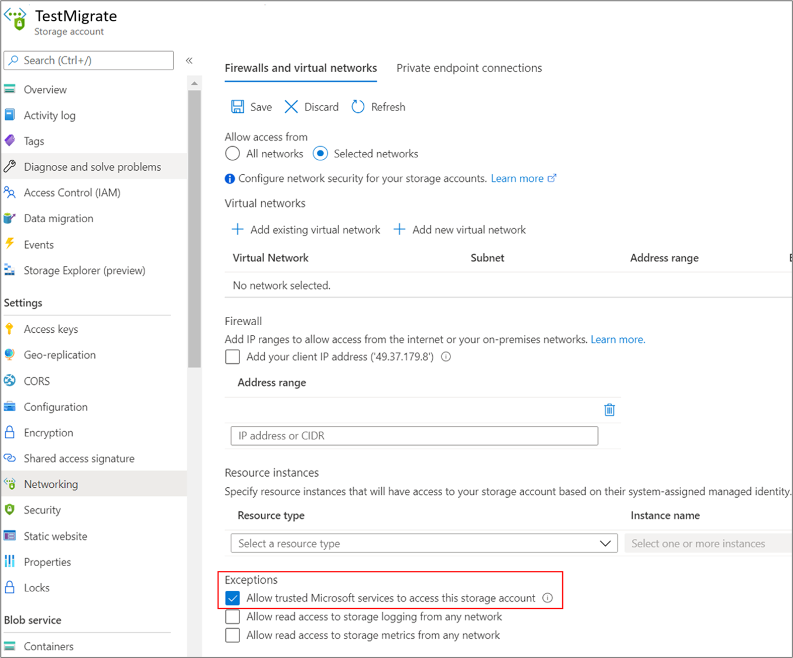

# Migrate servers to Azure by using Private Link

The following sections describe the steps required to use Azure Migrate with [private endpoints](../private-link/private-endpoint-overview.md) for migrations by using ExpressRoute private peering or VPN connections.

This article shows a proof-of-concept deployment path for agent-based replications to migrate your [VMware VMs](./tutorial-migrate-vmware-agent.md), [Hyper-V VMs](./tutorial-migrate-physical-virtual-machines.md), [physical servers](./tutorial-migrate-physical-virtual-machines.md), [VMs running on AWS](./tutorial-migrate-aws-virtual-machines.md), [VMs running on GCP](./tutorial-migrate-gcp-virtual-machines.md), or VMs running on a different virtualization provider by using Azure private endpoints. You can use a similar approach for performing [agentless Hyper-V migrations](./tutorial-migrate-hyper-v.md) by using Private Link.

>[!Note]
>[Agentless VMware migrations](./tutorial-assess-physical.md) require internet access or connectivity via ExpressRoute Microsoft peering.

### Set up a replication appliance for migration

The following diagram illustrates the agent-based replication workflow with private endpoints by using the Azure Migrate: Server Migration tool.

The tool uses a replication appliance to replicate your servers to Azure. Learn more about how to [prepare and set up a machine for the replication appliance](./tutorial-migrate-physical-virtual-machines.md#prepare-a-machine-for-the-replication-appliance).

After you set up the replication appliance, follow these steps to create the required resources for migration.

1. In **Discover machines** > **Are your machines virtualized?**, select **Not virtualized/Other**.
1. In **Target region**, select and confirm the Azure region to which you want to migrate the machines.
1. Select **Create resources** to create the required Azure resources. Don't close the page during the creation of resources.
    - This step creates a Recovery Services vault in the background and enables a managed identity for the vault. A Recovery Services vault is an entity that contains the replication information of servers and is used to trigger replication operations.
    - If the Azure Migrate project has private endpoint connectivity, a private endpoint is created for the Recovery Services vault. This step adds five fully qualified domain names (FQDNs) to the private endpoint, one for each microservice linked to the Recovery Services vault.
    - The five domain names are formatted in this pattern:   _{Vault-ID}-asr-pod01-{type}-.{target-geo-code}_.privatelink.siterecovery.windowsazure.com
    - By default, Azure Migrate automatically creates a private DNS zone and adds DNS A records for the Recovery Services vault microservices. The private DNS is then linked to the private endpoint virtual network.

1. Before you register the replication appliance, ensure that the vault's private link FQDNs are reachable from the machine that hosts the replication appliance. Additional DNS configuration may be required for the on-premises replication appliance to resolve the private link FQDNs to their private IP addresses. Learn more about [how to verify network connectivity](./troubleshoot-network-connectivity.md#verify-dns-resolution).

1. After you verify the connectivity, download the appliance setup and key file, run the installation process, and register the appliance to Azure Migrate. Learn more about how to [set up the replication appliance](./tutorial-migrate-physical-virtual-machines.md#set-up-the-replication-appliance). After you set up the replication appliance, follow these instructions to [install the mobility service](./tutorial-migrate-physical-virtual-machines.md#install-the-mobility-service) on the machines you want to migrate.

### Replicate servers to Azure by using Private Link

Follow [these steps](./tutorial-migrate-physical-virtual-machines.md#replicate-machines) to select servers for replication.

In **Replicate** > **Target settings** > **Cache/Replication storage account**, use the dropdown list to select a storage account to replicate over a private link.

If your Azure Migrate project has private endpoint connectivity, you must [grant permissions to the Recovery Services vault managed identity](#grant-access-permissions-to-the-recovery-services-vault) to access the storage account required by Azure Migrate.

To enable replications over a private link, [create a private endpoint for the storage account](#create-a-private-endpoint-for-the-storage-account-optional).

#### Grant access permissions to the Recovery Services vault

You must grant the permissions to the Recovery Services vault for authenticated access to the cache/replication storage account.

To identify the Recovery Services vault created by Azure Migrate and grant the required permissions, follow these steps.

**Identify the Recovery Services vault and the managed identity object ID**

You can find the details of the Recovery Services vault on the Azure Migrate: Server Migration **Properties** page.

1. Go to the **Azure Migrate** hub, and on the **Azure Migrate: Server Migration** tile, select **Overview**.

    

1. In the left pane, select **Properties**. Make a note of the Recovery Services vault name and managed identity ID. The vault will have **Private endpoint** as the **Connectivity type** and **Other** as the **Replication type**. You'll need this information when you provide access to the vault.

    

**Permissions to access the storage account**

 To the managed identity of the vault, you must grant the following role permissions on the storage account required for replication. In this case, you must create the storage account in advance.

>[!Note]
> When you migrate Hyper-V VMs to Azure by using Private Link, you must grant access to both the replication storage account and the cache storage account.

The role permissions for the Azure Resource Manager vary depending on the type of storage account.

|**Storage account type** | **Role permissions**|
|--- | ---|
|Standard type | [Contributor](../role-based-access-control/built-in-roles.md#contributor) [Storage Blob Data Contributor](../role-based-access-control/built-in-roles.md#storage-blob-data-contributor)|
|Premium type | [Contributor](../role-based-access-control/built-in-roles.md#contributor) [Storage Blob Data Owner](../role-based-access-control/built-in-roles.md#storage-blob-data-owner)

1. Go to the replication/cache storage account selected for replication. In the left pane, select **Access control (IAM)**.

1. Select **+ Add**, and select **Add role assignment**.

   

1. On the **Add role assignment** page in the **Role** box, select the appropriate role from the permissions list previously mentioned. Enter the name of the vault noted previously, and select **Save**.

    

1. In addition to these permissions, you must also allow access to Microsoft trusted services. If your network access is restricted to selected networks, on the **Networking** tab in the **Exceptions** section, select **Allow trusted Microsoft services to access this storage account**.

   

### Create a private endpoint for the storage account (optional)

To replicate by using ExpressRoute with private peering, [create a private endpoint](../private-link/tutorial-private-endpoint-storage-portal.md#create-storage-account-with-a-private-endpoint) for the cache/replication storage accounts (target subresource: _blob_).

>[!Note]
> You can create private endpoints only on a general-purpose v2 storage account. For pricing information, see [Azure Page Blobs pricing](https://azure.microsoft.com/pricing/details/storage/page-blobs/) and [Azure Private Link pricing](https://azure.microsoft.com/pricing/details/private-link/).

Create the private endpoint for the storage account in the same virtual network as the Azure Migrate project private endpoint or another virtual network connected to this network.

Select **Yes**, and integrate with a private DNS zone. The private DNS zone helps in routing the connections from the virtual network to the storage account over a private link. Selecting **Yes** automatically links the DNS zone to the virtual network. It also adds the DNS records for the resolution of new IPs and FQDNs that are created. Learn more about [private DNS zones](../dns/private-dns-overview.md).

If the user who created the private endpoint is also the storage account owner, the private endpoint creation will be auto-approved. Otherwise, the owner of the storage account must approve the private endpoint for use. To approve or reject a requested private endpoint connection, on the storage account page under **Networking**, go to **Private endpoint connections**.

Review the status of the private endpoint connection state before you continue.

After you've created the private endpoint, use the dropdown list in **Replicate** > **Target settings** > **Cache storage account** to select the storage account for replicating over a private link.

Ensure that the on-premises replication appliance has network connectivity to the storage account on its private endpoint. Learn more about how to verify [network connectivity](./troubleshoot-network-connectivity.md).

>[!Note]
> For Hyper-V VM migrations to Azure, if the replication storage account is of _Premium_ type, you must select another storage account of _Standard_ type for the cache storage account. In this case, you must create private endpoints for both the replication and cache storage account.

Next, follow the instructions to [review and start replication](./tutorial-migrate-physical-virtual-machines.md#replicate-machines) and [perform migrations](./tutorial-migrate-physical-virtual-machines.md#run-a-test-migration).

