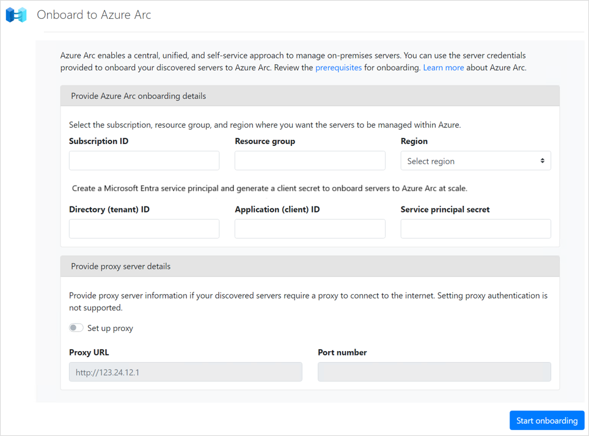

# Onboard on-premises servers in VMware virtual environment to Azure Arc   

This article describes how to onboard on-premises VMware VMs to Azure Arc for Azure Management using the Azure Migrate: Discovery and assessment tool. 

Azure Arc allows you to manage your hybrid IT estate with a single pane of glass by extending the Azure management experience to your on-premises servers that are not ideal candidates for migration. [Learn more](../azure-arc/servers/overview.md) about Azure Arc. 

## Before you get started

- [Review the requirements](./tutorial-discover-vmware.md#prerequisites) to discover servers running in VMware environment with Azure Migrate: Discovery and assessment tool.  
- Prepare [VMware vCenter](./tutorial-discover-vmware.md#prepare-vmware) for usage and review the [VMware requirements](migrate-support-matrix-vmware.md#vmware-requirements) to perform software inventory. Software inventory must be complete to start onboarding discovered servers to Azure Arc.   
- Review [application discovery requirements](migrate-support-matrix-vmware.md#software-inventory-requirements) before initiating software inventory on servers. Windows servers must have PowerShell version 3.0 or later installed. 
- Verify the prerequisites to allow remote connections to the inventory of discovered servers for onboarding them to Azure Arc. 
    1. Allow inbound remote connections to the discovered servers 
        - _For Windows:_ Inbound connection on WinRM port 5985 (HTTP). On all the target Windows servers, run “winrm qc” command to enable the WS-Management protocol on the local computer. 
        - _For Linux:_ On all target Linux servers, allow inbound connections on port 22 (SSH).
        - You can also add the IP addresses of the remote machines (discovered servers) to the WinRM TrustedHosts list on the appliance. 
    2. The Azure Migrate appliance should have a network line of sight to the target servers. 
- Be sure to verify the [prerequisites for Azure Arc](../azure-arc/servers/prerequisites.md) and review the following considerations:
    - Onboarding to Azure Arc can only be initiated after the vCenter Server discovery and software inventory is completed. It may take up to 6 hours for software inventory to complete after it is turned on.
    -  The [Azure Arc Hybrid Connected Machine agent](../azure-arc/servers/learn/quick-enable-hybrid-vm.md) will be installed on the discovered servers during the Arc onboarding process. Make sure you provide credentials with administrator permissions on the servers to install and configure the agent. On Linux, provide the root account, and on Windows, provide an account that is a member of the Local Administrators group. 
    - Verify that the servers are running [a supported operating system](../azure-arc/servers/prerequisites.md#supported-operating-systems).
    - Ensure that the Azure account is granted assignment to the [required Azure roles](../azure-arc/servers/prerequisites.md#required-permissions).
    - Make sure [the required URLs](../azure-arc/servers/network-requirements.md#urls) are not blocked if the discovered servers connect through a firewall or proxy server to communicate over the Internet.
    - Review the [regions supported](../azure-arc/servers/overview.md#supported-regions) for Azure Arc. 
    - Azure Arc-enabled servers support up to 5,000 machine instances in a resource group.

## Set up the Azure Migrate project  

1. Before you start, prepare the [Azure user Account](./tutorial-discover-vmware.md#prepare-an-azure-user-account) and verify you have the [required roles](./create-manage-projects.md#verify-permissions) in the subscription to create resources required by Azure Migrate. 
2. [Use this article](./create-manage-projects.md) to set up a new Azure Migrate project with the Azure Migrate: Discovery and assessment tool added to it.  

    > [!Note]
    > You can also use an existing Migrate project and onboard the discovered servers inventory to Azure Arc. To do so, launch the appliance configuration manager from your appliance server and make sure the services are updated to their latest versions. [Learn more](./migrate-appliance.md#appliance-upgrades)     Next, [follow these instructions](#onboard-to-azure-arc) to onboard your servers.  

## Deploy and register the Azure Migrate appliance 

Azure Migrate: Discovery and assessment use a lightweight Azure Migrate appliance. The appliance performs server discovery and sends server configuration and performance metadata to Azure Migrate. 

Before you set up the appliance, 

1. [Review](migrate-appliance.md#appliance---vmware) the requirements for deploying the Azure Migrate appliance.
2. Review the Azure URLs that the appliance will need to access in the [public](migrate-appliance.md#public-cloud-urls) and [government clouds](migrate-appliance.md#government-cloud-urls). 
3. Note the [port access requirements](migrate-support-matrix-vmware.md#port-access-requirements) for the appliance. 

Next,

- Follow this article to [set up the Azure Migrate appliance](./tutorial-discover-vmware.md#set-up-the-appliance) to start vCenter Server discovery. To deploy the appliance, you can download and import an OVA template into VMware to create a server running in your vCenter Server.  
- After deploying the appliance, you need to register it with the project before you initiate the discovery. Follow [these instructions](./tutorial-discover-vmware.md#set-up-prerequisites-and-register-the-appliance) to register the appliance. 

## Configure the appliance and start discovery  

Use [this article](./tutorial-discover-vmware.md#start-continuous-discovery) to configure the Azure Migrate appliance and kick off the vCenter Server discovery. 

As you configure the appliance for discovery, you need to specify the  details in the appliance configuration manager:

- The details of the vCenter Server to which you want to connect.  
- vCenter Server credentials scoped to discover the servers in your VMware environment. 
- Server credentials with Administrator permissions. Onboarding to Azure Arc requires credentials with Administrator permissions on the server to install and configure the Azure Arc Hybrid Connect Machine agent. [Learn more](add-server-credentials.md) about how to provide credentials and how we handle them.

After the discovery has been successfully completed, it takes around 15 minutes for discovered servers to appear in the portal.

## Onboard to Azure Arc

>[!Important]
>Software inventory must be completed before onboarding your discovered servers to Azure Arc. 

Once the vCenter Server discovery has been completed, software inventory (discovery of installed applications) will be automatically initiated. During software inventory, the server credentials provided will be iterated and validated against the discovered servers. You can start onboarding after the software inventory has been completed and the credentials have been mapped. It may take up to 6 hours for software inventory to complete after it is turned on.  
1. Navigate to the **Onboard to Azure Arc** panel. 

    

2. Provide the **subscription** and **resource group** where you want the servers to be managed within Azure.

3. In the **Region** drop-down list, select the Azure region to store the servers' metadata.

4. Provide the **Azure Active Directory service principal** details for onboarding at scale. Review this article to [create a service principal using the Azure portal or Azure PowerShell.](../azure-arc/servers/onboard-service-principal.md#create-a-service-principal-for-onboarding-at-scale)  

    The following inputs are required:
    - **Directory (tenant) ID** - The [unique identifier (GUID)](../active-directory/develop/howto-create-service-principal-portal.md#sign-in-to-the-application) that represents your dedicated instance of Azure AD. 
    - **Application (client) ID** - The [unique identifier (GUID)](../active-directory/develop/howto-create-service-principal-portal.md#sign-in-to-the-application) that represents the application ID of the service principal.
    - **Service principal secret (application secret)** - The [client secret](../active-directory/develop/howto-create-service-principal-portal.md#option-2-create-a-new-application-secret) for password-based authentication. 
    
5. _Optional_: Provide the **proxy server IP address** or the name and **port number** if your discovered servers require a proxy server to connect to the Internet. Enter the value in the format `http://<proxyURL>:<proxyport>`. This proxy server used by the discovered servers can be different from the proxy server required by the appliance server  to connect to the Internet (provided in the prerequisites section in the appliance configuration manager).   

    > [!Note]
    > Setting proxy authentication us not supported. 

6. Select **Start Onboarding** to initiate the Azure Arc onboarding process. The onboarding process will take some time. Once the onboarding has been completed, you will be presented  with the completion status and a detailed onboarding status report.    

    

    > [!Note]
    > If your login expires, select **Login again**. This will open a modal with the device code. Select **Copy code & Login** to copy the device code and open an Azure Login prompt in a new browser tab. If it doesn't appear, make sure you've disabled the pop-up blocker in the browser.

7. Once the onboarding has completed, navigate to the [Azure Arc home page](https://portal.azure.com/#blade/Microsoft_Azure_HybridCompute/AzureArcCenterBlade/servers) to view and manage your onboarded servers.   

8. View the detailed onboarding report to understand the onboarding status of your servers and take appropriate actions. 

> [!Note]
> The Azure Migrate appliance will initiate WinRM sessions to execute the Azure Arc onboarding script. Ensure that there are no settings restricting access to the WinRM service on the target servers.    

## Next steps 

- For more information and error details, review the detailed onboarding report. Resolve errors, if any, to successfully onboard the servers. 
- You can select **Start Onboarding** to rerun the Azure Arc onboarding process. The onboarding will be attempted for any newly discovered servers and servers that could not be onboarded successfully in the previous run.   

## Troubleshooting Azure Arc onboarding errors

If you receive an error when onboarding to Azure Arc using the Azure Migrate appliance, the following section can help identify the probable cause and suggested steps to resolve your problem. 

If you don't see the error code listed below or if the error code starts with **_AZCM_**, refer to [this guide for troubleshooting Azure Arc](../azure-arc/servers/troubleshoot-agent-onboard.md).

### Error 60001 - UnableToConnectToPhysicalServer  

**Possible causes**  
Either the [prerequisites](./migrate-support-matrix-physical.md) to connect to the server have not been met or there are network issues in connecting to the server, for instance some proxy settings.

**Recommended actions**   
- Ensure that the server meets the [prerequisites](#before-you-get-started) and [port access requirements](./migrate-support-matrix-physical.md). 
- Add the IP addresses of the remote machines (discovered servers) to the WinRM TrustedHosts list on the Azure Migrate appliance, and retry the operation. This is to allow remote inbound connections on servers - _Windows:_ WinRM port 5985 (HTTP) and _Linux:_ SSH port 22 (TCP).
- Ensure that you have chosen the correct authentication method on the appliance to connect to the server. 
   > [!Note] 
   > Azure Migrate supports both password-based and SSH key based authentication for Linux servers.
- If the issue persists, submit a Microsoft support case, providing the appliance machine ID (available in the footer of the appliance configuration manager).     
   

### Error 60002 - InvalidServerCredentials  

**Possible causes**  
Unable to connect to server. Either you have provided incorrect credentials on the appliance or the credentials previously provided have expired.

**Recommended actions**  
- Ensure that you have provided the correct credentials for the server on the appliance. You can check that by trying to connect to the server using those credentials.
- If the credentials added are incorrect or have expired, edit the credentials on the appliance and revalidate the added servers. If the validation succeeds, the issue is resolved.
- If the issue persists, submit a Microsoft support case, providing the appliance machine ID (available in the footer of the appliance configuration manager).

### Error 60005 - SSHOperationTimeout  

**Possible causes**  
- The operation took longer than expected either due to network latency issues or due to the lack of latest updates on the server. 

**Recommended actions**  
- Ensure that the impacted server has the latest kernel and OS updates installed.
- Ensure that there is no network latency between the appliance and the server. It is recommended to have the appliance and source server on the same domain to avoid latency issues.
- Connect to the impacted server from the appliance and run the commands [documented here](./troubleshoot-appliance.md) to check if they return null or empty data.
- If the issue persists, submit a Microsoft support case providing the appliance machine ID (available in the footer of the appliance configuration manager).  

### Error 60108 - SoftwareInventoryCredentialNotAssociated  

**Possible causes**  
- No credentials were found to be associated with the server.

**Recommended actions**  
- Software inventory must be complete to start onboarding discovered servers to Azure Arc. [Learn more](./how-to-discover-applications.md#add-credentials-and-initiate-discovery)
- Ensure that the credentials provided on the appliance configuration manager are valid and the server is accessible using the credentials.
- Go back to the appliance configuration manager to either provide another set of credentials or edit an existing one.  

### Error 60109 - ArcOsNotSupported  

**Possible causes**  
- The server hosts an unsupported operating system for Azure Arc onboarding.

**Recommended actions**  
- [Review the supported operating systems](../azure-arc/servers/prerequisites.md#supported-operating-systems) for Azure Arc. 
 
### Error 10002 - ScriptExecutionTimedOutOnVm  

**Possible causes**  
- The onboarding task did not complete in time. Then execution took longer than expected. 

**Recommended actions**  
- The issue should automatically resolve in some time. If the issue persists, contact Microsoft Support.  
 
### Error 50000 - AccessDenied 

**Possible causes**  
- The operation could not be completed due to forbidden access on the server. The user account provided on the appliance to access the server does not have the required permissions or the credentials are incorrect. WinRM error code: 0x80070005

**Recommended actions**  
- Validate the possible causes and retry the operation. If the issue persists, contact support.

### Error 960/951/60009/60078 - NullResult/UnhandledException/ServerUnknownError/UnhandledError

**Possible causes**  
- The operation failed due to an internal error. 

**Recommended actions**  
- Retry the operation after some time. If the issue persists, contact support and provide the appliance machine ID (available in the **footer** of the appliance configuration manager).
