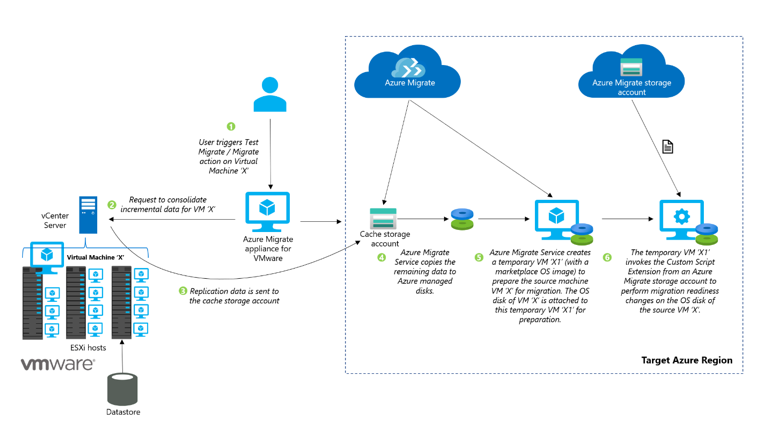
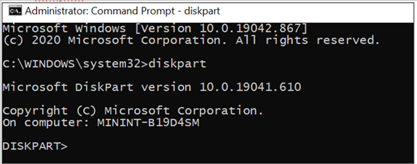
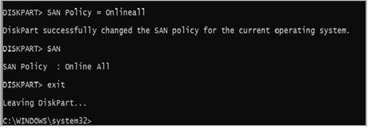
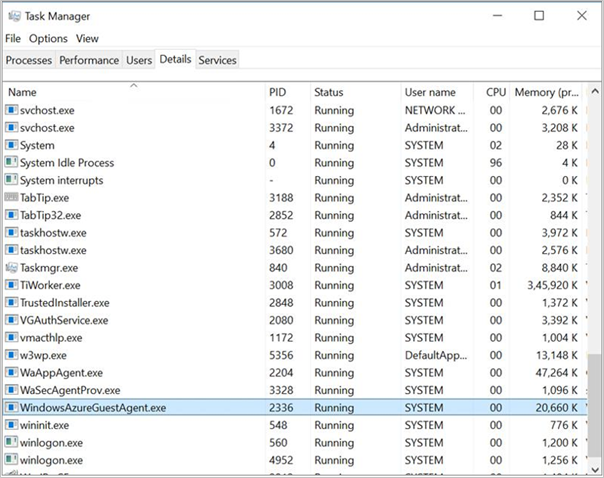

# Prepare for VMware agentless migration

This article provides an overview of the changes performed when you [migrate VMware VMs to Azure via the agentless migration](./tutorial-migrate-vmware.md) method using the Migration and modernization tool.

Before you migrate your on-premises VM to Azure, you may require a few changes to make the VM ready for Azure. These changes are important to ensure that the migrated VM can boot successfully in Azure and connectivity to the Azure VM can be established-.
Azure Migrate automatically handles these configuration changes for the following operating system versions for both Linux and Windows. This process is called *Hydration*.

**Operating system versions supported for hydration**

- Windows Server 2008 or later
- Red Hat Enterprise Linux 9.x, 8.x, 7.9, 7.8, 7.7, 7.6, 7.5, 7.4, 7.0, 6.x
- CentOS 9.x (Release and Stream), 8.x (Release and Stream), 7.9, 7.7, 7.6, 7.5, 7.4, 6.x
- SUSE Linux Enterprise Server 15 SP4, 15 SP3, 15 SP2, 15 SP1, 15 SP0, 12, 11 SP4, 11 SP3
- Ubuntu 22.04, 21.04, 20.04, 19.04, 19.10, 18.04LTS, 16.04LTS, 14.04LTS
- Kali Linux (2016, 2017, 2018, 2019, 2020, 2021, 2022)
- Debian 11, 10, 9, 8, 7 
- Oracle Linux 9, 8, 7.7-CI, 7.7, 6

You can also use this article to manually prepare the VMs for migration to Azure for operating systems versions not listed above. At a high level, these changes include:

- Validate the presence of the required drivers
- Enable the serial console
- Configure network settings
- Install the VM guest agent

## Hydration process

You have to make some changes to the VMs configuration before the migration to ensure that the migrated VMs function properly on Azure. Azure Migrate handles these configuration changes via the *hydration* process. The hydration process is only performed for the versions of Azure supported operating systems given above. Before you migrate, you may need to perform the required changes manually for other operating system versions that aren't listed above. If the VM is migrated without the required changes, the VM may not boot, or you may not have connectivity to the migrated VM. The following diagram shows you that Azure Migrate performs the hydration process.

 [](./media/concepts-prepare-vmware-agentless-migration/hydration-process-expanded.png#lightbox)

When a user triggers *Test Migrate* or *Migrate*, Azure Migrate performs the hydration process to prepare the on-premises VM for migration to Azure.
To set up the hydration process, Azure Migrate creates a temporary Azure VM and attaches the disks of the source VM to perform changes to make the source VM ready for Azure. The temporary Azure VM is an intermediate VM created during the migration process before the final migrated VM is created. The temporary VM will be created with a similar OS type (Windows/Linux) using one of the marketplace OS images. If the on-premises VM is running Windows, the operating system disk of the on-premises VM will be attached as a data disk to the temporary VM for performing changes. If it's a Linux server, all the disks attached to the on-premises VM will be attached as data disks to the temporary Azure VM.

Azure Migrate will create the network interface, a new virtual network, subnet, and a network security group (NSG) to host the temporary VM. These resources are created in the customer's subscription. If there are conflicting policies that prevent the creation of the network artifacts, Azure Migrate will attempt to create the temporary Azure VM in the virtual network and subnet provided as part of the replication target settings options.

After the virtual machine is created, Azure Migrate will invoke the [Custom Script Extension](../virtual-machines/extensions/custom-script-windows.md) on the temporary VM using the Azure Virtual Machine REST API. The Custom Script Extension utility will execute a preparation script containing the required configuration for Azure readiness on the on-premises VM disks attached to the temporary Azure VM. The preparation script is downloaded from an Azure Migrate owned storage account. The network security group rules of the virtual network will be configured to permit the temporary Azure VM to access the Azure Migrate storage account for invoking the script.

 

## Changes performed during the hydration process

The preparation script executes the following changes based on the OS type of the source VM to be migrated. You can also use this section as a guide to manually prepare the VMs for migration for operating systems versions not supported for hydration.

### Changes performed on Windows servers

1. **Discover and prepare the Windows OS volume**

   Before performing relevant configuration changes, the preparation script will validate if the correct OS disk was selected for migration. The preparation script will look through all the attached volumes visible to the system and look for the SYSTEM registry hive file path to find the source OS volume.

   The following actions are performed in this step:
   - Mounts each partition on the OS disk attached to the temporary VM.

   - Looks for \Windows\System32\Config\System registry files after mounting the partition.
   - If the files aren't found, the partition is unmounted, and the search continues for the correct partition.
   - If the files aren't present on any of the partitions, it could indicate that an incorrect OS disk was selected, or the OS disk is corrupted. Azure Migrate will fail the migration process with an appropriate error.

   >[!NOTE]
   >This step isn't relevant if you’re manually preparing the servers for migration.

1. **Make boot and connectivity related changes**

   After the source OS volume files are detected, the preparation script will load the SYSTEM registry hive into the registry editor of the temporary Azure VM and perform the following changes to ensure VM boot up and connectivity. You need to configure these settings manually if the OS version isn't supported for hydration.

   1. **Validate the presence of the required drivers**
      
      Ensure if the required drivers are installed and are set to load at **boot start**. These Windows drivers allow the server to communicate with the hardware and other connected devices.

      - IntelIde.sys
      - Atapi
      - Storfit
      - Storvsc
      - VMbus

   1. **Set storage area network (SAN) policy to Online All**

      This ensures that the Windows volumes in the Azure VM use the same drive letter assignments as the on-premises VM. By default, Azure VMs are assigned drive D: to use as temporary storage. This drive assignment causes all other attached storage drive assignments to increment by one letter. To prevent this automatic assignment, and to ensure that Azure assigns the next free drive letter to its temporary volume, set the storage area network (SAN) policy to Online All.

      To manually configure this setting:

      - On the on-premises server, open the command prompt with elevated privileges and enter **diskpart**.

        

      - Enter SAN. If the drive letter of the guest operating system isn't maintained, Offline All or Offline Shared is returned.

      - At the DISKPART prompt, enter SAN Policy=OnlineAll. This setting ensures that disks are brought online, and that you can read and write to both disks.

        

1. **Set the DHCP start type**

   The preparation script will also set the DHCP service start type as Automatic. This will enable the migrated VM to obtain an IP address and establish connectivity post-migration. Make sure the DHCP service is configured, and the status is running.

    

   To edit the DHCP startup settings manually, run the following example in Windows PowerShell:

   ```powershell
   Get-Service -Name Dhcp
   Where-Object StartType -ne Automatic
   Set-Service -StartupType Automatic
   ```

1. **Disable VMware Tools**

   Make “VMware Tools” service start-type to disabled if it exists as they aren't required for the VM in Azure.

   >[!NOTE]                        
   >To connect to Windows Server 2003 VMs, Hyper-V Integration Services must be installed on the Azure VM. Windows Server 2003 machines don't have this installed by default. See this [article](./prepare-windows-server-2003-migration.md) to install and prepare for migration.

1. **Install the Windows Azure Guest Agent**

    Azure Migrate will attempt to install the Microsoft Azure Virtual Machine Agent (VM Agent), a secure, lightweight process that manages virtual machine (VM) interaction with the Azure Fabric Controller. The VM Agent has a primary role in enabling and executing Azure virtual machine extensions that enable post-deployment configuration of VM, such as installing and configuring software. Azure Migrate automatically installs the Windows VM agent on Windows Server 2008 R2 and higher versions.

    The Windows VM agent can be manually installed with a Windows installer package. To manually install the Windows VM Agent, [download the VM Agent installer](https://go.microsoft.com/fwlink/?LinkID=394789). You can also search for a specific version in the [GitHub Windows IaaS VM Agent releases](https://github.com/Azure/WindowsVMAgent/releases). The VM Agent is supported on Windows Server 2008 (64 bit) and later.

    To check if the Azure VM Agent was successfully installed, open Task Manager, select the **Details** tab, and look for the process name *WindowsAzureGuestAgent.exe*. The presence of this process indicates that the VM agent is installed. You can also use [PowerShell to detect the VM agent.](../virtual-machines/extensions/agent-windows.md#powershell)

    

    After the aforementioned changes are performed, the system partition will be unloaded. The VM is now ready for migration.
    [Learn more about the changes for Windows servers.](../virtual-machines/windows/prepare-for-upload-vhd-image.md)

### Changes performed on Linux servers

1. **Discover and mount Linux OS partitions**  

   Before performing relevant configuration changes, the preparation script will validate if the correct OS disk was selected for migration. The script will collect information on all partitions, their UUIDs, and mount points. The script will look through all these visible partitions to locate the /boot and /root partitions.

   The following actions are performed in this step:

   - Discover /root partition:
     - Mount each visible partition and look for etc/fstab.
      - If the fstab files aren't found, the partition is unmounted, and the search continues for the correct partition.
      - If the fstab files are found, read the fstab content to identify the root device and mount it as the base mount point.
   - Discover /boot and other system partitions:
     - Use fstab content to determine if /boot is a separate partition. If it’s a separate partition, then obtain the boot partition device name from the fstab content or look for the partition, which has the boot flag.
     - The script will proceed to discover and mount /boot, and other necessary partitions on “/mnt/azure_sms_root” to build the root filesystem tree required for chroot jail. Other necessary partitions include: /boot/grub/menu.lst, /boot/grub/grub.conf, /boot/grub2/grub.cfg, /boot/grub/grub.cfg, /boot/efi (for UEFI boot), /var, /lib, /etc, /usr, and others.

1. **Discover OS Version**

   Once the root partition is discovered, the script will use the following files to determine the Linux Operating System distribution and version.

   - RHEL/CentOS: etc/redhat-release
   - OL: etc/oracle-release
   - SLES: etc/SuSE-release
   - Ubuntu: etc/lsb-release
   - Debian: etc/debian_version

1. **Install Hyper-V Linux Integration Services and regenerate kernel image**  

   The next step is to inspect the kernel image and rebuild the Linux init image so, that it contains the necessary Hyper-V drivers (**hv_vmbus, hv_storvsc, hv_netvsc**) on the initial ramdisk. Rebuilding the init image ensures that the VM will boot in Azure.

   Azure runs on the Hyper-V hypervisor. So, Linux requires certain kernel modules to run in Azure. To prepare your Linux image, you need to rebuild the initrd so that at least the hv_vmbus and hv_storvsc kernel modules are available on the initial ramdisk. The mechanism for rebuilding the initrd or initramfs image may vary depending on the distribution. Consult your distribution's documentation or support for the proper procedure. Here's one example for rebuilding the initrd by using the mkinitrd utility:

   1. Find the list of kernels installed on the system (/lib/modules)
   1. For each module, inspect if the Hyper-V drivers are already included.
   1. If any of these drivers are missing, add the required drivers and regenerate the image for the corresponding kernel version.

      >[!NOTE]
      >This step may not apply to Ubuntu and Debian VMs as the Hyper-V drivers are built-in by default. [Learn more about the changes.](../virtual-machines/linux/create-upload-generic.md#install-kernel-modules-without-hyper-v)

      An illustrative example for rebuilding initrd

      - Back up the existing initrd image
      
       ```bash
        cd /boot
        sudo cp initrd-`uname -r`.img  initrd-`uname -r`.img.bak
       ```

      - Rebuild the initrd with the hv_vmbus and hv_storvsc kernel modules:

       ```bash
          sudo mkinitrd --preload=hv_storvsc --preload=hv_vmbus -v -f initrd-`uname -r`.img `uname -r`
       ```
   Most new versions of Linux distributions have this included by default. If not included, install manually for all versions except those called out, using the aforementioned steps.

1. **Enable Azure Serial Console logging**

   The script will then make changes to enable Azure Serial Console logging. Enabling console logging helps with troubleshooting issues on the Azure VM. Learn more about Azure Serial Console for Linux [Azure Serial Console for Linux - Virtual Machines | Microsoft Docs](/troubleshoot/azure/virtual-machines/serial-console-linux).

   Modify the kernel boot line in GRUB or GRUB2 to include the following parameters, so that all console messages are sent to the first serial port. These messages can assist Azure support with debugging any issues.

   ```config
    console=ttyS0,115200n8 earlyprintk=ttyS0,115200 rootdelay=300
   ```

   We also recommend removing the following parameters if they exist.

   ```config
   rhgb quiet crashkernel=auto
   ```
    [Refer to this article](../virtual-machines/linux/create-upload-generic.md#general-linux-system-requirements) for specific changes.

1. **Network changes for connectivity**

   Based on the OS Version, the script will perform the required network changes for connectivity to the migrated VM. The changes include:

   1. Move (or remove) the udev rules to avoid generating static rules for the Ethernet interface. These rules cause problems when you clone a virtual machine in Azure.

      An illustrative example for RedHat servers

      ```bash
         sudo ln -s /dev/null /etc/udev/rules.d/75-persistent-net-generator.rules
         sudo rm -f /etc/udev/rules.d/70-persistent-net.rules
      ```

   1. Remove Network Manager if necessary. Network Manager can interfere with the Azure Linux agent for a few OS versions. It's recommended to make these changes for servers running RedHat and Ubuntu distributions.

   1. Uninstall this package by running the following command:
    
      An illustrative example for RedHat servers

      ```bash
         sudo rpm -e --nodeps NetworkManager
      ```

   1. Backup existing NIC settings and create eth0 NIC configuration file with DHCP settings. To do this, the script will create or edit the /etc/sysconfig/network-scripts/ifcfg-eth0 file, and add the following text:

      An illustrative example for RedHat servers

      ```config
         DEVICE=eth0
         ONBOOT=yes
         BOOTPROTO=dhcp
         TYPE=Ethernet
         USERCTL=no
         PEERDNS=yes
         IPV6INIT=no
         PERSISTENT_DHCLIENT=yes
         NM_CONTROLLED=yes
      ```

   1. Reset etc/sysconfig/network file as follows:

      An illustrative example for RedHat servers

      ```config
         NETWORKING=yes
         HOSTNAME=localhost.localdomain
      ```

1. **Fstab validation**

    Azure Migrate will validate the entries of the fstab file and replace fstab entries with persistent volume identifiers, UUIDs wherever needed. This ensures the drive/partition name remains constant no matter the system it's attached to.

   - If the device name is a standard device name (say /dev/sdb1), then:
     - If it’s a root or boot partition, then it's replaced with UUID.
     - If the partition coexists with either the root or boot partition as standard partitions on the same disk, then it's replaced with UUID.
   - If the device name is UUID/LABEL/LV, then no changes will be done.
   - If it’s a network device (nfs, cifs, smbfs, and etc), then the script will comment the entry. To access it, you can uncomment the same and reboot your Azure VM.

1. **Install the Linux Azure Guest Agent**

    Azure Migrate will attempt to install the Microsoft Azure Linux Agent (waagent), a secure, lightweight process that manages Linux & FreeBSD provisioning, and VM interaction with the Azure Fabric Controller.  [Learn more](../virtual-machines/extensions/agent-linux.md) about the functionality enabled for Linux and FreeBSD IaaS deployments via the Linux agent.

    Review the list of [required packages](../virtual-machines/extensions/agent-linux.md#requirements) to install Linux VM agent. Azure Migrate installs the Linux VM agent automatically for RHEL 8.x/7.x/6.x, CentOS 8.x/7.x/6.x, Ubuntu 14.04/16.04/18.04/19.04/19.10/20.04, SUSE 15 SP0/15 SP1/12, Debian 9/8/7, and Oracle 7 when using the agentless method of VMware migration. Follow these instructions to [install the Linux Agent manually](../virtual-machines/extensions/agent-linux.md#installation) for other OS versions.

    You can use the command to verify the service status of the Azure Linux Agent to make sure it's running. The service name might be **walinuxagent** or **waagent**.
    Once the hydration changes are done, the script will unmount all the partitions mounted, deactivate volume groups, and then flush the devices.

   ```bash
      sudo vgchange -an <vg-name>
      sudo lockdev –flushbufs <disk-device-name>
   ```

   [Learn more on the changes for Linux servers.](../virtual-machines/linux/create-upload-generic.md)

### Clean up the temporary VM

After the necessary changes are performed, Azure Migrate will spin down the temporary VM and free the attached OS disks (and data disks). This marks the end of the *hydration process*.     

After this, the modified OS disk and the data disks that contain the replicated data are cloned. A new virtual machine is created in the target region, virtual network, and subnet, and the cloned disks are attached to the virtual machine. This marks the completion of the migration process.

## Learn more

- [Prepare on-premises machines for migration to Azure.](./prepare-for-migration.md)
