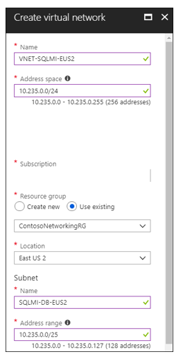
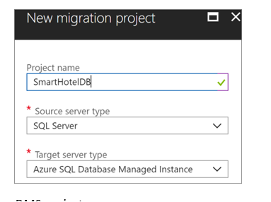

# Rehost: Migrate an on-premises app to Azure VMs and SQL Managed Instance

This is the second article in a series that shows how the fictional organization Contoso are moving their on-premises infrastructure to the Azure cloud. [Learn more](https://docs.microsoft.com/azure/migrate/migrate-scenarios-overview) about the series.

In the [first article](https://docs.microsoft.com/azure/migrate/migrate-scenarios-assessment) in the series, Contoso ran an assessment of their on-premises resources, in preparation for migration. They assessed their VMs running their SmartHotel app with the Azure Migrate service, and their SQL Server database for the app with the Azure Database Migration Assistant. 

Now they're ready to migrate the assessed on-premises resources. In this article, Contoso will migrate their on-premises VMs to Azure VMs using the Azure Site Recovery service, and migrate their on-premises SQL Server database to an Azure SQL Managed Instance.

If you'd like to use the sample app used in this article, you can download it from [github](https://github.com/Microsoft/SmartHotel360).

## Business drivers

The IT Leadership team has worked closely with their business partners to understand what the business wants to achieve with this migration:

- **Address business growth**: Contoso is growing and as a result there is pressure on their on-premises systems and infrastructure.
- **Increase efficiency**: Contoso needs to remove unnecessary procedures, and streamline processes for their developers and users.  The business needs IT to be fast and not waste time or money, thus delivering faster on customer requirements.
- Increase agility**:  Contoso IT needs to be more responsive to the needs of the business. It must be able to react faster than the changes in the marketplace, to enable the success in a global economy.  It mustn't get in the way, or become a business blocker.
- **Scale**: As the business grows successfully, Contoso IT must provide systems that are able to grow at the same pace.

## Migration goals

The Contoso cloud team has pinned down goals for this migration. These goals are used to determine the best migration method:

- After migration, the app in the cloud should have the same performance capabilities as it does today in their on-premises VMWare environment.  Moving to the cloud doesn't mean that app performance is less critical.
- Contoso doesn’t want to invest in this app.  It is critical and important to the business, but in its current form they simply want to move it as is to the cloud.
- Database administrative tasks should be minimized after the app is migrated.
- Contoso doesn't want to use an Azure SQL Database for this app, and and is looking for alternatives.

## Proposed architecture

In this scenario:

- Contoso is a fictious name representing a typical enterprise organization. Contoso wants to assess and migrate their two-tier on-premises travel app.
- Contoso has an on-premises datacenter (contoso-datacenter), with an on-premises domain controller (**contosodc1**).
- The internal travel app is tiered across two VMs, WEBVM and SQLVM, and located on VMware ESXi host (**contosohost1.contoso.com**).
- The VMware environment is managed by vCenter Server (**vcenter.contoso.com**) running on a VM.
- They'll migrate the app database (SmartHotelDB) to an Azure SQL Managed instance.
- They'll migrate the on-premises VMware VMs to an Azure VM.
- The on-premises VMs in the Contoso datacenter will be decommissioned after the migration is done.

 

### Azure services

**Service** | **Description** | **Cost**
--- | --- | ---
[Database Management Service](https://docs.microsoft.com/azure/dms/dms-overview) | DMS enables seamless migrations from multiple database sources to Azure data platforms, with minimal downtime. | Learn about [supported regions](https://docs.microsoft.com/azure/dms/dms-overview#regional-availability) for DMS, and get [pricing details](https://azure.microsoft.com/pricing/details/database-migration/).
[Azure SQL Managed instance](https://docs.microsoft.com/azure/sql-database/sql-database-managed-instance) | Managed Instance is a managed database service that represents a fully-managed SQL Server Instance in the Azure cloud. It shares the same code with the latest version of SQL Server Database Engine and has the latest features, performance improvements, and security patches. | Using Azure SQL Database Managed Instances running in Azure incur charges based on capacity. [Learn more](https://azure.microsoft.com/pricing/details/sql-database/managed/). 
[Azure Site Recovery](https://docs.microsoft.com/azure/site-recovery/) | The service orchestrates and manages migration and disaster recovery for Azure VMs, and on-premises VMs and physical servers.  | During replication to Azure, Azure Storage charges are incurred.  Azure VMs are created, and incur charges, when failover occurs. [Learn more](https://azure.microsoft.com/pricing/details/site-recovery/) about charges and pricing.

 

## Migration process

Contoso will migrate both their web and data tiers of the SmartHotel application to Azure.

1. The data tier will be migrated using the Data Migration Service (DMS).  DMS will connect to the on-premises SQL Server VM across a site-to-site VPN connection between the Contoso datacenter and Azure, and then migrate the database.

     

2. The web tier will be migrated using a lift-and-shift migration with Azure Site Recovery. This will entail preparing the on-premises VMware environment, setting up and enabling replication, and migrating the VMs by failing them over to Azure.

      

## Prerequisites

If you want to run this scenario, here's what you should have.

Requirements | Details
--- | ---
**Enrol in preview** | You need to be enrolled in the SQL Managed Instance Limited Public Preview. You need an Azure subscription in order to [sign up](https://portal.azure.com#create/Microsoft.SQLManagedInstance). Sign-up can take a few days to complete so make sure you do it before you start to deploy this scenario.
**Azure subscription** | You should have already created a subscription when  you performed the assessment in the first article in this series. If you don't have an Azure subscription, create a [free account](https://azure.microsoft.com/pricing/free-trial/).   If you create a free account, you're the administrator of your subscription and can perform all actions.   If you use an existing subscription and you're not the administrator, you need to work with the admin to assign you Owner or Contributor permissions.   If you need more granular permissions, review [this article](../site-recovery/site-recovery-role-based-linked-access-control.md). 
**Site recovery (on-premises)** | Your on-premises vCenter server should be running version 5.5, 6.0, or 6.5   An ESXi host running version 5.5, 6.0 or 6.5   One or more VMware VMs running on the ESXi host.   VMs must meet [Azure requirements](https://docs.microsoft.com/azure/site-recovery/vmware-physical-azure-support-matrix#azure-vm-requirements).   Supported [network](https://docs.microsoft.com/azure/site-recovery/vmware-physical-azure-support-matrix#network) and [storage](https://docs.microsoft.com/azure/site-recovery/vmware-physical-azure-support-matrix#storage) configuration.
**DMS** | For DMS you need a [compatible on-premises VPN device](https://docs.microsoft.com/azure/vpn-gateway/vpn-gateway-about-vpn-devices).   You must be able to configure the on-premises VPN device. It must have an externally facing public IPv4 address, and the address can't be located behind a NAT device.   Make sure you have access to your on-premises SQL Server database.   The Windows Firewall should be able to access the source database engine. [Learn more](https://docs.microsoft.com/sql/database-engine/configure-windows/configure-a-windows-firewall-for-database-engine-access).   If there's a firewall in front of your database machine, add rules to allow access to the database, and to files via SMB port 445.   The credentials used to connect to the source SQL Server and target Managed Instance must be members of the sysadmin server role.   You need a network share in your on-premises database that DMS can use to back up the source database.   Make sure that the service account running the source SQL Server instance has write privileges on the network share.   Make a note of a Windows user (and password) that has full control privilege on the network share. The Azure Database Migration Service impersonates these user credentials to upload backup files to the Azure storage container.   The SQL Server Express installation process sets the TCP/IP protocol to **Disabled** by default. Make sure that it's enabled.

## Scenario steps

Here's what we're going to do for this migration to succeed:

> [!div class="checklist"]
> * **Step 1: Set up a SQL Azure Managed Instance**: You need a pre-created managed instance to which the on-premises SQL Server database will migrate.
> * **Step 2: Prepare DMS**: You register the Database Migration provider, create an instance, and then create a DMS project. You'll also need to set up SA URI for DMS. A shared access signature (SAS) Uniform Resource Identifier (URI) provides delegated access to resources in your storage account, so that you can grant limited permissions to storage objects. Set up a SAS URI so that the DMS can access the storage account container to which the service uploads the SQL Server back-up files.
> * **Step 3: Prepare Azure for Site Recovery**: You create an Azure storage account to hold replicated data, and create a Recovery Services vault.
> * **Step 4: Prepare on-premises VMware for Site Recovery**: You prepare accounts for VM discovery and agent installation, and prepare to connect to Azure VMs after failover.
> * **Step 5: Replicate VMs**: You configure the Site Recovery source and target environment, set up a replication policy, and start replicating VMs to Azure storage.
> * **Step 6: Migrate the database with DMS**: Run a database migration.
> * **Step 7: Migrate the VMs with Site Recovery**: Run a test failover to make sure everything's working, and then run a full failover to migrate the VMs to Azure.

## Step 1: Prepare an Azure SQL Managed Instance

### Set up a virtual network for the managed instance

For this scenario you will need to create another virtual network that's dedicated to the Azure SQL Managed Instance.  Note the following requirements:

- To create the managed instance you need a dedicated subnet.
- The subnet must be empty and not contain any other cloud service, and it mustn't be a gateway subnet. After the managed instance is created, you mustn't add resources to the subnet.
- The subnet mustn't have an NSG associated with it.
- The subnet must have a User Route Table (UDR) with 0.0.0.0/0 Next Hop Internet as the only route assigned to it. 
- Optional custom DNS: If custom DNS is specified on the VNet, Azure's recursive resolvers IP address (such as 168.63.129.16) must be added to the list. [Learn more](https://docs.microsoft.com/azure/sql-database/sql-database-managed-instance-custom-dns).
- The subnet mustn't have a service endpoint (storage or SQL) associated with it. Service endpoints should be disabled on the virtual network.
- The subnet must have minimum of 16 IP addresses. [Learn more](https://docs.microsoft.com/azure/sql-database/sql-database-managed-instance-vnet-configuration#determine-the-size-of-subnet-for-managed-instances) about sizing the managed instance subnet.

1. Contoso creates a new VNet (VNET-SQLMI-EU2) in the primary East US 2 region.
2. The VNet is added to the ContosoNetworkingRG resource group.
3. Contoso assigns an address space of 10.235.0.0/24, ensuring that the range doesn't overlap with any other networks in the Contoso enterprise.
4. They add two subnets to the network: SQLMI-DS-EUS2 and SQLMI-SAW-EUS2.
5. Service endpoints should be disable on the network.

    

6. After the VNet and subnets are deployed, Contoso peer VNET-SQLMI-EUS2 with the hub VNet for the East US 2 region (VNET-HUB-EUS2), and with the production network (VNET-PROD-EUS2).

    

7. In addition, Contoso change their DNS settings. In this scenario, DNS first points to Azure domain controllers (CONTOSODC3 and CONTOSODC4.
    - The DCs are located in the East US 2 production network (VNET-PROD-EUS2), in the subnet for DCs (PROD-DC-EUS2).
    - CONTOSODC3 address: 10.245.42.4
    - CONTOSODC4 address: 10.245.42.5
    - Azure DNS resolver: 168.63.129.16

     

**Need more help?**

- [Get an overview][SQL Managed Instances](https://docs.microsoft.com/azure/sql-database/sql-database-managed-instance) of SQL Managed Instances.
- [Learn about](https://docs.microsoft.com/azure/sql-database/sql-database-managed-instance-vnet-configuration#create-a-new-virtual-network-for-managed-instances) about creating a VNet for SQL Managed Instance.
- [Learn about](https://docs.microsoft.com/azure/virtual-network/virtual-network-manage-peering) setting up peering.
- [Learn about](https://docs.microsoft.com/azure/active-directory-domain-services/active-directory-ds-getting-started-dns) updating Azure AD DNS settings.

### Set up routing

You need a route table that will allow Managed Instance to communicate with the Azure Management Service. This is required because Managed Instance is placed in your private VNet. If it can't communicate with Azure service that manages it it will became inaccessible.

- The route table contains a set of rules, called routes, that specifies how packets sent from Managed Instance should be routed in the virtual network.
- The route table is associated to subnets in which Managed Instances are deployed, and each packet leaving a subnet is handled based on the associated route table.
- A subnet can only be associated to a single route table.
- There are no additional charges for creating route tables in Microsoft Azure.

1. Contoso need to create a user-defined route table, and associate it with the SQLMI-DB-EUS2 subnet ( in the VNET-SQLMI-EUS2 network). The route table will be created in the resource group ContosoNetworkingRG.

    

2. After the route table (MIRouteTable)is deployed, Contoso need to add a route to it, with an address prefix of 0.0.0.0/0, and **Next hop type** set to **Internet**.

    
    
3. Then, then need to apply the route table to the managed instance subnet (SQLMI-DB-EUS2), in the VNET-SQLMI-EUS2 VNet.

    
    
**Need more help?**

[Learn about](https://docs.microsoft.com/azure/sql-database/sql-database-managed-instance-create-tutorial-portal#create-new-route-table-and-a-route) setting up routes for a managed instance.

### Create a managed instance

Now, Contoso can provision a SQL Database Managed Instance.

1. Contoso will deploy a Managed Instance in the ContosoRG resource group, in the primary East US 2 region. The primary region is used for VMs that aren't related to the Contoso Azure infrastructure.
2. For the Managed Instance, they select a pricing tier, and size the compute and storage. [Learn more](https://azure.microsoft.com/pricing/details/sql-database/managed/) about pricing.

    

3. After the Managed Instance deployment finishes, two new resources appear in the ContosoRG resource group: Virtual Cluster for the Managed Instances, and the SQL Managed Instance. Both are in the East US 2 region.

**Need more help?**

[Learn about](https://docs.microsoft.com/azure/sql-database/sql-database-managed-instance-create-tutorial-portal) provisioning a Managed Instance.

## Step 2: Prepare DMS

1. To prepare DMS Contoso first register the Database Migration provider, under their subscription.
    

2. Contoso then get an SAAS URI so that DMS can access the storage account container, to upload the back-up files that are used to migrate databases to Azure SQL Database Managed Instance. 

    

3. Finally, they create a DMS instance. 

    

4. Contoso place the DMS instance in the PROD-DC-EUS2 subnet of the VNET-PROD-DC-EUS2 VNet.
    - They place it there because it must be in a VNet that can access the on-premises SQL Server VM via a VPN gateway.
    - The VNET-PROD-EUS2 is peered to VNET-HUB-EUS2, and is allowed to use remote gateways.  This ensures that DMS will be able to communicate as required.

    

**Need more help?**
[Learn about](https://docs.microsoft.com/azure/dms/quickstart-create-data-migration-service-portal) setting up DMS.

## Step 3: Prepare Azure for the Site Recovery service

There are a number of elements you need in Azure for the Site Recovery service:

- Site Recovery needs a VNet. You fail over resources to this VNet.
- Site Recovery needs an Azure storage account to hold replicated data. Azure VMs are created using the data, when failover occurs.
- To use the Site Recovery service, you need a Recovery Services vault in Azure.

1. Contoso are planning to migrate their web tier VM (WEBVM) to Azure using Site Recovery. They're going to replicate it to the East US 2 region. Since the VM is a web frontend to the SmartHotel app, after failover the VM in Azure will be located in the production network (VNET-PROD-EUS2) and subnet (PROD-FE-EUS2), in the primary East US 2 region.
2. Contoso create an Azure storage acount (contosovmsacc20180528). They're using a general purpose account, with standard storage, and LRS replication.

    

3. With the network and storage account in place, Contoso now create a vault (ContosoMigrationVault), and place it in the ContosoFailoverRG resource group, in the primary East US 2 region.

    

**Need more help?**

[Learn about](https://docs.microsoft.com/azure/site-recovery/tutorial-prepare-azure) setting up Azure for Site Recovery.

## Step 4: Prepare on-premises VMware for Site Recovery

To prepare VMware for Site Recovery, here's what you need to do:

- Prepare an account on the vCenter server or vSphere ESXi host, to automate VM discovery.
- Prepare an account for automatic installation of the Mobility service on VMware VMs
- Prepare on-premises VMs if you want to connect to Azure VMs after failover.

### Prepare an account for automatic discovery

Site Recovery needs access to VMware servers to:

- Automatically discover VMs. At least a read-only account is required.
- Orchestrate replication, failover, and failback. You need an account that can run operations such as creating and removing disks, and turning on VMs.

1. Contoso creates a role at the vCenter level.
2. Contoso then assigns that role the required permissions.

**Need more help?**

[Learn about](https://docs.microsoft.com/azure/site-recovery/vmware-azure-tutorial-prepare-on-premises#prepare-an-account-for-automatic-discovery) creating and assigning a role for automatic discovery.

### Prepare an account for Mobility service installation

The Mobility service must be installed on the VM you want to replicate.

- Site Recovery can do an automatic push installation of this component when you enable replication for the VM.
- For automatic push installation, you need to prepare an account that Site Recovery will use to access the VM.
- You specify this account when you set up replication in the Azure console.
- You need a domain or local account with permissions to install on the VM.

**Need more help**

[Learn about](https://docs.microsoft.com/azure/site-recovery/vmware-azure-tutorial-prepare-on-premises#prepare-an-account-for-mobility-service-installation) creating an account for push installation of the Mobility service.

### Prepare to connect to Azure VMs after failover

After failover to Azure, Contoso want to be able to connect to the replicated VMs in Azure. To do this, there's a couple of things they need to do on the on-premises VM, before they run the migration: 

1. For access over the internet, they need enable RDP on the on-premises VM before failover, and ensure that TCP and UDP rules are added for the **Public** profile, and that RDP is allowed in **Windows Firewall** > **Allowed Apps** for all profiles.
2. For access over their site-to-site VPN, they need to enable RDP on the on-premises machine, and allow RDP in the **Windows Firewall** -> **Allowed apps and features** for **Domain and Private** networks.
3. They should set the operating system's SAN policy on the on-premises VM to **OnlineAll**.

In addition, when they run a failover they need to check the following:

- There should be no Windows updates pending on the VM when triggering a failover. If there are, they won't be able to log in to the virtual machine until the update completes.
1. After failover, they should check **Boot diagnostics** to view a screenshot of the VM. If this doesn't work, they should check that the VM is running and review these [troubleshooting tips](http://social.technet.microsoft.com/wiki/contents/articles/31666.troubleshooting-remote-desktop-connection-after-failover-using-asr.aspx).

## Step 5: Replicate the on-premises VMs to Azure with Site Recovery

Before they can run a migration to Azure, Contoso need to set up replication, and enable replication for their on-premises VM.

### Set up replication

1. In the vault, they need to specify that they're replicating a VMware VM to Azure.

    
2. To continue, they need to confirm that they have completed deployment planning, by selecting **Yes, I have done it**.
3. Now they need to configure their source environment. To do this they need to deploy single, highly available, on-premises VM machine to host on-premises Site Recovery components. Components include the configuration server, and the process server.

    - The configuration server coordinates communications between on-premises and Azure and manages data replication.
    - The process server acts as a replication gateway. It receives replication data; optimizes it with caching, compression, and encryption; and sends it to Azure storage.
    - The process server also installs Mobility Service on VMs you want to replicate and performs automatic discovery of on-premises VMware VMs.

4. To set up the configuration server as a highly available VMWare VM, they do the following:
    
    - Add a configuration server in the vault, and download a prepared Open Virtualization Format (OVF) template.

        

    - Import the template into VMware to create the VM, and deploy the VM.

        

 4. Now, Contoso needs to register the configuration server in the vault. When they turn on the VM for the first time, it boots up into a Windows Server 2016 installation experience. They accept the license agreement, and enter an administrator password.
3. After the installation finishes, they sign in to the VM as the administrator. At first-time sign in, the Azure Site Recovery Configuration Tool starts.
    - In the tool, they specify a name to use for registering the configuration server in the vault.
    - The tool checks that the VM can connect to Azure. After the connection is established, select **Sign in** to sign in to your Azure subscription. The credentials must have access to the vault in which you want to register the configuration server.

        [Register configuration server](./media/rehost-vm-sql-managed-instance/config-server-register2.png)

    - The tool performs some configuration tasks and then reboots. They sign in to the machine again, and the configuration server management wizard starts automatically.
4. In the Configuration Server Management wizard, they configure the server settings:
    - They select the NIC to receive replication traffic. This setting can't be changed after it's configured.
    - They select the subscription, resource group, and vault in which to register the configuration server.
         

    - They download and install MySQL Server, and VMWare PowerCLI. Then they validate the server settings.

5. After settings are validated, they specify the FQDN or IP address of the vCenter server or vSphere host, on which the VM is located. They leave the default port, and specify a friendly name for the vCenter server in Azure.
6. They need to specify the account that they created earlier, so that Site Recovery can automatically discover VMware VMs that are available for replication. 
7. They then specify the credentials that are used to automatically install Mobility Service on machines, when replication is enabled. For Windows machines, the account needs local administrator privileges on the machines you want to replicate. 

    

7. After registration finishes, in the Azure portal, Contoso double checks that the configuration server and VMware server are listed on the **Source** page in the vault. Discovery can take 15 minutes or more. 
8. Site Recovery then connects to VMware servers using the specified settings and discovers VMs. 
9. Now Contoso needs to specify their target replication environment. Site Recovery checks that there's a Azure storage account and network in the specified target.
10. After the source and target are set up, Contoso is ready to create a replication policy (ContosoMigrationPolicy),  and associate it with the configuration server. They use the default settings:
    - **RPO threshold**: Default of 60 minutes. This value defines how often recovery points are created. An alert is generated if continuous replication exceeds this limit.
    - **Recovery point retention**. Default of 24 hours. This value specifies how long the retention window is for each recovery point. Replicated VMs can be recovered to any point in a window.
    - **App-consistent snapshot frequency**. Default of one hour. This value specifies the frequency at which application-consistent snapshots are created.
 
        

5. The policy is automatically associated with the configuration server. 

    

**Need more help?**

- You can read a full walkthrough of all these steps in [Set up disaster recovery for on-premises VMware VMs](https://docs.microsoft.com/azure/site-recovery/vmware-azure-tutorial).
- Detailed instructions are available to help you [set up the source environment](https://docs.microsoft.com/azure/site-recovery/vmware-azure-set-up-source), [deploy the configuration server](https://docs.microsoft.com/azure/site-recovery/vmware-azure-deploy-configuration-server), and [configure replication settings](https://docs.microsoft.com/azure/site-recovery/vmware-azure-set-up-replication).

### Enable replication

Now Contoso can start replicating the WebVM.

1. Contoso selects source for replication, including the configuration server, the vCenter server on which the WebVM is located, and the subnet in which the Azure VM will be located after failover.

    

2. Now, they specify the target settings, including the resource group in which the Azure VM will be located after failover, the storage account in which replicated data will be stored, and the Azure network/subnet in which the Azure VM will be located when it's created after failover. 

     

3. Contoso selects the WebVM for replication.Site Recovery installs the Mobility Service on each VM when you enable replication for it. 

    

4. Contoso checks that the correct replication policy is selected, and enables replication for WEBVM. They track replication progress in **Jobs**. After the **Finalize Protection** job runs, the machine is ready for failover.

**Need more help?**

You can read a full walkthrough of all these steps in [Enable replication](https://docs.microsoft.com/azure/site-recovery/vmware-azure-enable-replication).

## Step 6: Migrate the database with DMS

1. Contoso create a DMS project. They specify the source server type as SQL Server, and the target as Azure SQL Database Managed Instance.

    

2. After creating the project, they can migrate the database
    - They specify the source VM on which the on-premises database is located, and credentials to access it.

        

    - They select the database to migrate.
    - 
         

    - As a target, they select the Managed Instance in Azure, and access credentials.

         

2. Then, they run the migration with the following settings:
    - They source and target credentials.
    - The database to migrate.
    - The network share they created on the on-premises VM. DMS takes source backups to this share. Remember that the service account running the source SQL Server instance must have write privileges on this share.
    - The sAS URI that provides the DMS with access to your storage account container to which the service uploads the backup files, and which is used for migration to Azure SQL Database Managed Instance. 
3. They save the migration, and run it. In **Overview** they monitor the migration status. After migration completes, they verify that the target databases exist on the managed instance.

## Step 7: Migrate the VM with Site Recovery

Contoso run a quick test failover, and then migrate the VM.

### Run a test failover

Before migrating WEBVM, Contoso run a test failover to make sure that everything's working as expected. 

1. Contoso runs a test failover, to the latest available point in time (Latest processed).
2. When the test failover runs, the following happens:

    - A prerequisites check runs to make sure all of the conditions required for migration are in place.
    - Failover processes the data, so that an Azure VM can be created. If select the latest recovery point, a recovery point is created from the data.
    - An Azure VM is created using the data processed in the previous step.
3. After the failover finishes, the replica Azure VM appears in the Azure portal. Contoso checks that everything is working properly. The VM is the appropriate size,  it's connected to the right network, and it's running. 
4. After verifying the test failover, Contoso clean up the failover, and record and save any observations. 

### Migrate the VM

1. After verifying that the test failover worked as expected, Contoso create a recovery plan for migration. They add WEBVM to the plan.
2. Then, they run a failover on the plan. They select the latest recovery point, and specify that Site Recovery should try to shut down the on-premises VM before triggering the failover.
3. After the failover, Contoso verify that the Azure VM appears as expected in the Azure portal.

    

### Run a failover

1. In **Recovery Plans**, click the plan > **Failover**.
2. In **Failover** > **Recovery Point**, select the latest recovery point.
3. The encryption key setting isn't relevant for this scenario.
4. Select **Shut down machine before beginning failover**. Site Recovery will attempt to do a shutdown of source virtual machines before triggering the failover. Failover continues even if shutdown fails. You can follow the failover progress on the **Jobs** page.

    

5. After the failover, they check that the Azure VM appears in Azure as expected.

    

6. After verifying the VM in Azure, they complete the migration to finish the migration process, stop replication for the VM, and stop Site Recovery billing for the VM.

    

### Update the connection string

As the final step in the migration process, Contoso update the connection string of the application to point to the migrated database running on their SQL MI.

1. In the Azure portal them find the connection string by clicking **Settings** > **Connection Strings**.

      

2. They update the string with the user name and password of the SQL MI.
3. After the string is configured, they replace the current connection string in the web.config file of their application.
4. After updating the file and saving it, they restart IIS on WEBVM. They do this using the IISRESET /RESTART from a cmd prompt.
5. After IIS has been restarted, the application is now be using the database running on the SQL MI.
6. At this point Contoso can shut down the SQLVM machine on-premises, and the migration is complete.

## Step 8: Clean up after migration

TBD

## Conclusion

In this scenario we've:

> [!div class="checklist"]
> * Migrated our on-premises database to an Azure SQL Managed Instance with DMS.
> * Migrated our on-premises VMs to Azure VMs, with the Azure Site Recovery service.

## Next steps