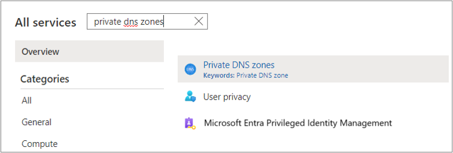
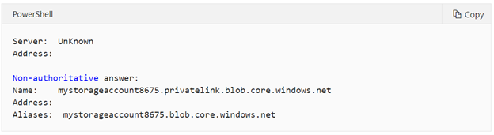

# Replicate data over ExpressRoute for Azure Migrate projects with public endpoint connectivity

In this article, you'll learn how to configure the [Migration and modernization](./migrate-services-overview.md#migration-and-modernization-tool) tool to replicate data over an Azure ExpressRoute circuit while you migrate servers to Azure. This document is to be referenced if you want to use ExpressRoute for your replications when using an Azure Migrate project with public endpoint connectivity. To use private endpoint support, create a new Azure Migrate project with private endpoint connectivity. See [Using Azure Migrate with private endpoints](./how-to-use-azure-migrate-with-private-endpoints.md).

## Understand Azure ExpressRoute circuits

An ExpressRoute circuit connects your on-premises infrastructure to Microsoft through a connectivity provider. You can configure ExpressRoute circuits to use private peering, Microsoft peering, or both. To learn more about the peering options with ExpressRoute, see [ExpressRoute circuits and peering](../expressroute/expressroute-circuit-peerings.md#peeringcompare).

The Migration and modernization tool helps you migrate on-premises servers and servers from other clouds to Azure Virtual Machines. The tool sets up an ongoing replication stream to replicate data from the servers to be migrated to managed disks in your Azure subscription. When you're ready to migrate the servers, the replicated data in Azure is used to migrate the servers.

You can configure the data replicated from your on-premises servers to be sent to your Azure subscription over the internet or an ExpressRoute connection. Data sent over the internet uses a secure encrypted connection. If you have many servers to migrate, using ExpressRoute for replication can help you migrate  more efficiently by using the provisioned bandwidth available with your ExpressRoute circuit.

In this article, you'll learn how to replicate data by using:
> [!div class="checklist"]
>
> * An ExpressRoute circuit with private peering.
> * An ExpressRoute circuit with Microsoft peering.

> [!Important]
> This document is to be referenced if you want to use ExpressRoute for your replications when using an Azure Migrate project with public endpoint connectivity. 
> To use private endpoint support end-to-end, create a new Azure Migrate project with private endpoint connectivity. See [Using Azure Migrate with private endpoints](./how-to-use-azure-migrate-with-private-endpoints.md).

## Replicate data by using an ExpressRoute circuit with private peering

In the agentless method for migrating VMware virtual machines to Azure, the Azure Migrate appliance first uploads replication data to a storage account (cache storage account) in your subscription. Azure Migrate then moves the replicated data from the cache storage account to replica-managed disks in your subscription.

To use a private peering circuit for replication, you'll create and attach a private endpoint to the cache storage account. Private endpoints use one or more private IP addresses from your virtual network, which effectively brings the storage account into your Azure virtual network. The private endpoint allows the Azure Migrate appliance to connect to the cache storage account by using ExpressRoute private peering. Data can then be transferred directly on the private IP address.  

> [!Important]
> - In addition to replication data, the Azure Migrate appliance communicates with the Azure Migrate service for its control plane activities. These activities include orchestrating replication. Control plane communication between the Azure Migrate appliance and the Azure Migrate service continues to happen over the internet on the Azure Migrate service's public endpoint.
> - The private endpoint of the storage account should be accessible from the network where the Azure Migrate appliance is deployed.
> - DNS must be configured to resolve DNS queries by the Azure Migrate appliance for the cache storage account's blob service endpoint to the private IP address of the private endpoint attached to the cache storage account.
> - The cache storage account must be accessible on its public endpoint. Azure Migrate uses the cache storage account's public endpoint to move data from the storage account to replica-managed disks.

### Prerequisites

You need the following permissions on the resource group and virtual network where the private endpoint will be created.

Use case | Permissions
--- | --- 
 Create and manage private endpoints. | Microsoft.Network/privateEndpoint/write/action Microsoft.Network/privateEndpoint/read/action 
|Attach a private endpoint to a virtual network or subnet. This permission is required on the virtual network where the private endpoint will be created.| Microsoft.Network/virtualNetworks/subnet/join/action   Microsoft.Network/virtualNetworks/join/action
|Link the private endpoint to a storage account.  | Microsoft.Microsoft.Storage/storageAccounts/privateEndpointConnectionApproval/action   Microsoft.Microsoft.Storage/storageAccounts/privateEndpointConnections/read
|Create a network interface and join it to a network security group. | Microsoft.Network/networkInterfaces/read   Microsoft.Network/networkInterfaces/subnets/write   Microsoft.Network/networkInterfaces/subnets/read  Microsoft.Network/networkSecurityGroups/join/action (optional)
Create and manage private DNS zones.| Private DNS Zone Contributor role   _Or_   Microsoft.Network/privateDnsZones/A/*   Microsoft.Network/privateDnsZones/write Microsoft.Network/privateDnsZones/read   Microsoft.Network/privateEndpoints/privateDnsZoneGroups/write   Microsoft.Network/privateEndpoints/privateDnsZoneGroups/read   Microsoft.Network/privateDnsZones/virtualNetworkLinks/write   Microsoft.Network/privateDnsZones/virtualNetworkLinks/read   Microsoft.Network/virtualNetworks/join/action 

### Identify the cache storage account

 Azure Migrate automatically creates a cache storage account when you configure replication (using the Azure portal experience) for a virtual machine for the first time in an Azure Migrate project. The storage account is created in the same subscription and resource group where you created the Azure Migrate project.

To create and locate the storage account:

1. Use the Azure portal to replicate one or more virtual machines in the Azure Migrate project.
1. Go to the resource group of the Azure Migrate project.
1. Locate the cache storage account by identifying the prefix **lsa** in the storage account name.

   

> [!Tip]
> If you have more than one storage account with the prefix **lsa** in your resource group, you can verify the storage account by navigating to the replication settings and target configuration menu for any of the replicating VMs in the project.
>
> 

### Upgrade the cache storage account to general-purpose v2

You can create private endpoints only on a general-purpose v2 storage account. If the cache storage account isn't a general-purpose v2 storage account, upgrade it.

1. Go to your storage account.
1. Select **Configuration**.
1. Under **Account kind**, select **Upgrade**.
1. Under **Confirm upgrade**, enter the name of your account.
1. Select **Upgrade** at the bottom of the page.

    

### Create a private endpoint for the storage account

1. Go to your storage account, select **Networking** from the left menu, and select the **Private endpoint connections** tab.
1. Select **+ Private endpoint**.

    1. In the **Create a private endpoint** window, select the **Subscription** and **Resource group**. Enter a name for your private endpoint, and select the storage account region.
     
       

    1. On the **Resource** tab, enter the **Subscription name** that the storage account is in. Select **Microsoft.Storage/storageAccounts** as the **Resource type**. In **Resource**, enter the name of the general-purpose v2 type replication storage account. Select **blob** as the **Target sub-resource**.
     
       

    1. On the **Configuration** tab, select the **Virtual network** and **Subnet** for the storage account's private endpoint.

       > [!Note]
       > The virtual network must contain the ExpressRoute gateway endpoint or be connected to the virtual network with the ExpressRoute gateway.

       In the **Private DNS integration** section, select **Yes** and integrate with a private DNS zone. Selecting **Yes** automatically links the DNS zone to the selected virtual network. It also adds the DNS records that are required for DNS resolution of new IPs and fully qualified domain names (FQDNs) created for the private endpoint. Learn more about [private DNS zones](../dns/private-dns-overview.md).

       

    1. You can also add **Tags** for your private endpoint.

    1. After you're finished entering details, select the **Review + create** tab. After the validation completes, select **Create** to create the private endpoint.

> [!Note]
> If the user who created the private endpoint is also the owner of the storage account, the private endpoint will be autoapproved. Otherwise, the owner must approve the private endpoint for use.

#### Create private DNS zones and add DNS records manually (optional)

If you didn't select the option to integrate with a private DNS zone at the time of the private endpoint creation, you need to manually create a private DNS zone.

> [!Note]
> If you selected **Yes** to integrate with a private DNS zone, you can skip this section.

To manually create a private DNS zone:

1. Select **Private DNS zones**.

    

    1. On the **Private DNS zones** page, select **+ Add** to create a new zone.
    1. On the **Create private DNS zone** page, fill in the required details. Enter the name of the private DNS zone as **_privatelink_.blob.core.windows.net**.
    1. On the **Review + create** tab, review and create the DNS zone.

1. Link the private DNS zone to your virtual network. 
   The private DNS zone you created must be linked to the virtual network that the private endpoint is attached to.

    1. Go to the private DNS zone created in the previous step, and go to virtual network links on the left side of the page. Select **+ Add**.
    1. Fill in the required details. The **Subscription** and **Virtual network** fields must be filled with the corresponding details of the virtual network where your private endpoint is attached. The other fields can be left as is.

1. The next step is to add DNS records to the DNS zone. Add an entry for the storage account's FQDN in your private DNS zone.

    1. Go to your private DNS zone, and go to the **Overview** section on the left side of the page. Select **+ Record** to start adding records.
    1. On the **Add record set** page, add an entry for the FQDN and private IP as an A type record.

> [!Important]
> You might require additional DNS settings to resolve the private IP address of the storage account's private endpoint from the source environment. To understand the DNS configuration needed, see [Azure private endpoint DNS configuration](../private-link/private-endpoint-dns-integration.md#on-premises-workloads-using-a-dns-forwarder).  

### Verify network connectivity to the storage account

To validate the private link connection, perform a DNS resolution of the cache storage account resource endpoint from the on-premises VM hosting the Azure Migrate appliance and ensure that it resolves to a private IP address.

An illustrative example for DNS resolution of the cache storage account. 

- Enter nslookup _storageaccountname_.blob.core.windows.net. Replace \<storage-account-name\> with the name of the cache storage account created by Azure Migrate.  

    You'll receive a message like this:  

   

- A private IP address of 10.1.0.5 is returned for the storage account. This address should belong to the private endpoint of the storage account. 

If the DNS resolution is incorrect, follow these steps:  

- **Tip:** You can manually update your source environment DNS records by editing the DNS hosts file on your on-premises appliance with the storage account FQDN link, _storageaccountname_.blob.core.windows.net, and the associated private IP address. This option is recommended only for testing. 
- If you use a custom DNS, review your custom DNS settings, and validate that the DNS configuration is correct. For guidance, see [private endpoint overview: DNS configuration](../private-link/private-endpoint-overview.md#dns-configuration). 
- If you use Azure-provided DNS servers, use this guide as a reference for further troubleshooting [for further troubleshooting.](./troubleshoot-network-connectivity.md#validate-the-private-dns-zone)   

### Configure proxy bypass rules on the Azure Migrate appliance (for ExpressRoute private peering connectivity) 
For proxy bypass, you can add a proxy bypass rule for the cache storage account as follows 
- _storageaccountname_.blob.core.windows.net.

> [!Important]
>  Do not bypass *.blob.core.windows.net as Azure Migrate makes use of another storage account, which needs internet access. This storage account, gateway storage account, is only used to store state information about the VMs being replicated. You can locate the gateway storage account by identifying the prefix _**gwsa**_ in the storage account name in the Azure Migrate project resource group. 

## Replicate data by using an ExpressRoute circuit with Microsoft peering

You can use Microsoft peering or an existing public peering domain (deprecated for new ExpressRoute connections) to route your replication traffic through an ExpressRoute circuit.

Even with replication data going over the Microsoft peered circuit, you still need internet connectivity from the on-premises site for control plane traffic and other URLs that aren't reachable over ExpressRoute. The replication appliance or Hyper-V host needs access to the URLs to orchestrate the replication process. Review the URL requirements based on the migration scenario, either [VMware agentless migrations](./migrate-appliance.md#public-cloud-urls) or [agent-based migrations](./migrate-replication-appliance.md). 

 For replication data transfer over Microsoft peering, configure route filters to advertise routes for the Azure Storage endpoints. This would be the regional BGP communities for the target Azure region (region for migration). To route control plane traffic over Microsoft peering, configure route filters to advertise routes for other public endpoints as required.  

- Regional BGP community for the source Azure region (Azure Migrate Project region)
- Regional BGP community for the target Azure region (region for migration)
- BGP community for Microsoft Entra ID (12076:5060)

Learn more about [route filters](../expressroute/how-to-routefilter-portal.md) and the list of [BGP communities for ExpressRoute](../expressroute/expressroute-routing.md#bgp).

### Proxy configuration for ExpressRoute Microsoft peering

If the appliance uses a proxy for internet connectivity, you may need to configure proxy bypass for certain URLs to route them via the Microsoft peering circuit. 

#### Configure proxy bypass rules for ExpressRoute Microsoft peering on the Azure Migrate appliance (for VMware agentless migrations)

1. Sign in via Remote Desktop to the Azure Migrate appliance.
2.  Open the file *C:/ProgramData/MicrosoftAzure/Config/appliance.json* by using Notepad.
3. In the file, change the line that says `"EnableProxyBypassList": "false"` to `"EnableProxyBypassList": "true"`. Save the changes, and restart the appliance.
4. After you restart, when you open the appliance configuration manager, you'll see the proxy bypass option in the web app UI. 
5. For replication traffic, you can configure a proxy bypass rule for “.*.blob.core.windows.net”. You can configure proxy bypass rules for other control plane endpoints as required. These endpoints include: 

    - .*.vault.azure.net
    - .*.servicebus.windows.net
    - .*.discoverysrv.windowsazure.com
    - .*.migration.windowsazure.com
    - .*.hypervrecoverymanager.windowsazure.com

> [!Note]
> Following URLs are not accessible over ExpressRoute and require Internet connectivity: *.portal.azure.com, *.windows.net, *.msftauth.net, *.msauth.net, *.microsoft.com, *.live.com, *.office.com, *.microsoftonline.com, *.microsoftonline-p.com, *.microsoftazuread-sso.com, management.azure.com, *.services.visualstudio.com (optional), aka.ms/* (optional), download.microsoft.com/download.

#### Configure proxy bypass rules ExpressRoute Microsoft peering on the replication appliance (for agent-based migrations)

To configure the proxy bypass list on the configuration server and process servers:

1. Download the [PsExec tool](/sysinternals/downloads/psexec) to access system user context.
2. Open Internet Explorer in system user context by running the following command line: `psexec -s -i "%programfiles%\Internet Explorer\iexplore.exe"`.
3. Add proxy settings in Internet Explorer.
4. For replication traffic, you can configure a proxy bypass rule for ".*.blob.core.windows.net". You can configure proxy bypass rules for other control plane endpoints as required. These endpoints include: 

    - .*.backup.windowsazure.com
    - .*.hypervrecoverymanager.windowsazure.com

The bypass rules for the Azure Storage endpoint will ensure that the replication traffic can flow through ExpressRoute while the control plane communication can go through the proxy for the internet. 

> [!Note]
> Following URLs are not accessible over ExpressRoute and require Internet connectivity: *.portal.azure.com, *.windows.net, *.msftauth.net, *.msauth.net, *.microsoft.com, *.live.com, *.office.com, *.microsoftonline.com, *.microsoftonline-p.com, *.microsoftazuread-sso.com, management.azure.com, *.services.visualstudio.com (optional), aka.ms/* (optional), download.microsoft.com/download, dev.mysql.com.

## Next steps

See the following articles to learn more about:

- [ExpressRoute circuits](../expressroute/expressroute-circuit-peerings.md)
- [ExpressRoute routing domains](../expressroute/expressroute-circuit-peerings.md#peeringcompare)
- [Private endpoints](../private-link/private-endpoint-overview.md)
