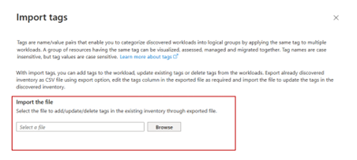

# Tagging in Azure Migrate

In any cloud transformation journey, a comprehensive current-state analysis of the IT landscape—including infrastructure, workloads, applications, and dependencies—is essential. Azure Migrate's new tagging feature enhances this analysis by enabling customers to group and visualize related resources based on specific properties. Tags, such as environment, department, or criticality, allow customers to create meaningful groupings known as **tags** to manage resources throughout their migration journey and beyond.

## Key benefits

- **Enhanced resource grouping and organization:** By tagging resources with relevant attributes, customers can easily categorize, track, and manage their assets. For example, resources tagged by department (for example, HR or Finance) can be collectively managed and analyzed, improving oversight and streamlining operations.

- **Improved visibility and control:** Customers gain an organized view of how resources interrelate, supporting better management of resources that share a common purpose, application, or organizational unit.

- **Resource management and governance:** Tags enable easy filtering and sorting of resources, allowing IT administrators to quickly find and manage assets. Tags also support governance practices, helping enforce consistent management practices and resource tracking.

- **Simplified migration planning:** Tags can be used as selection filters when customers create their reports – business cases and assessments.

## Tagging use cases

- **Department-Based Grouping:** Tagging resources by department (for example, Finance and Marketing) helps allocate resources appropriately and track department-specific assets.

- **Environment and Criticality Identification:** Tags such as Production, Development, or High-Criticality simplify the management of environments and critical workloads.

- **Application and Purpose Grouping:** Tags can identify resources tied to a specific application or service, making it easier to assess the impact of changes or migrations.

## Add tags to workloads

1.	Select the workload(s) that you intend to tag from the inventory.

   

2.	Select **Tags** > **Add and edit tags**.
    
    

3.	Assign a tag by adding the key and value details.

    

## View tags 

Choose the workload for which you wish to view the tags assigned.

## Filter using tags

1.	Select **Add filter** button beside the search bar.

2.	Select the tag key that you want to filter with.

3.	Select the value(s) for the tag that you want to filter with.

## Import tags

1.	Select **Tags > Import tags**.
    
    

2.	Choose the file with the tags that you want to import.
    
    

