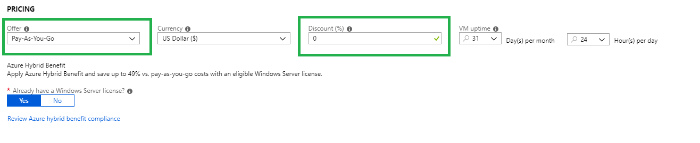

# Azure Migrate - Frequently Asked Questions (FAQ)

This article includes frequently asked questions about Azure Migrate. If you have any further queries after reading this article, post them on the [Azure Migrate forum](https://aka.ms/AzureMigrateForum).

## General

### Which Azure geographies are supported by Azure Migrate?
Azure Migrate currently supports a number of geographies in which an Azure Migrate project can be created. Even though you can only create projects in these geographies, you can still assess your machines for other target locations. The project geography is only used to store the discovered metadata.

**Geography** | **Metadata storage location**
Azure Government | US Gov Virginia
Asia | Southeast Asia or East Asia
Europe | South Europe or West Europe
United Kingdom | UK South or UK West
United States | Central US or West US 2

### How is Azure Migrate different from Azure Site Recovery?

Azure Migrate provides tools that help you to discover, assess, and migrate machines and workloads to Azure. [Azure Site Recovery](https://docs.microsoft.com/azure/site-recovery/migrate-tutorial-on-premises-azure) is a disaster recovery solution. Both services share some components.

## Azure Migrate appliance (VMware/physical servers)

### How does the Azure Migrate appliance connect to Azure?

The connection can be over the internet, or you can use ExpressRoute with public peering.

### What network connectivity requirements are needed for Azure Migrate Server Assessment and Migration

For the URLs and ports needed for Azure Migrate to communicate with Azure, review the [VMWare](migrate-support-matrix-vmware.md) and [Hyper-V](migrate-support-matrix-hyper-v.md) support matrices.

### Can I harden the appliance VMware VM I set up with the OVA template?

Additional components (for example anti-virus) can be added into the OVA template, as long as the communication and firewall rules required for the Azure Migrate appliance re left as is.   

### To harden the Azure Migrate appliance, what are the recommended Antivirus (AV) exclusions?

You need to exclude the following folders from scanning on the appliance:

- Folder containing binaries for the Azure Migrate Service. Exclude all sub-folders.
- %ProgramFiles%\ProfilerService  
- Azure Migrate Web Application. Exclude all sub-folders.
- %SystemDrive%\inetpub\wwwroot
- The local cache for database and log files. The Azure Migrate service needs read/write access to this folder.
  - %SystemDrive%\Profiler

### What data is collected by Azure Migrate?

The Azure Migrate appliance collects metadata for on-premises VMs, including:

**Configuration data of the VM**
- VM display name (on vCenter)
- VM inventory path (host/cluster/folder in vCenter)
- IP address
- MAC address
- Operating system
- Number of cores, disks, NICs
- Memory size, Disk sizes

**Performance data of the VM**
- CPU usage
- Memory usage
- For each disk attached to the VM:
  - Disk read throughput
  - Disk writes throughput
  - Disk read operations per sec
  - Disk writes operations per sec
- For each network adapter attached to the VM:
  - Network in
  - Network out

Tn addition, if you deploy dependency mapping, the dependency mapping agents collect information that includes machine FQDN, operating system, IP address, MAC address, processes running inside the VM, and incoming/outgoing TCP connections for the VM. This discovery is optional only used if you enable dependency mapping for discovery.

### Is there any performance impact on the analyzed ESXi host environment?

With continuous profiling of performance data, the Azure Migrate appliance profiles on-premises machines to measure VM performance data. This has almost zero performance impact on the ESXi hosts, as well as on the vCenter Server.

### Where is the collected data stored and for how long?

The data collected by the Azure Migrate appliance is stored in the Azure location that you specify when creating the migration project. The data is securely stored in a Microsoft subscription, and is deleted when you delete the Azure Migrate project.

For dependency visualization, if you install agents on the VMs, the data collected by the dependency agents is stored in the US, in a Log Analytics workspace created in the Azure subscription. This data is deleted when you delete the Log Analytics workspace in your subscription. [Learn more](concepts-dependency-visualization.md).

### What is the volume of data uploaded by Azure Migrate during continuous profiling?

The volume of data sent to Azure Migrate varies based on several parameters. To give an indicative number, an Azure Migrate project with 10 machines (each with one disk and one NIC), sends around 50 MB per day. This is an approximate value, that changes based on the number of data points for the NICs and disks (the data sent is non-linear if the number of machines, NICs or disks increase).

### Is the data encrypted at-rest and in-transit?

Yes for both. The metadata is securely sent to the Azure Migrate service over the internet, via https. The metadata is stored in a [Cosmos DB](https://docs.microsoft.com/azure/cosmos-db/database-encryption-at-rest), and in [Azure blob storage](https://docs.microsoft.com/azure/storage/common/storage-service-encryption) in a Microsoft subscription, and is encrypted at-rest.

The data collected by the dependency agents is also encrypted in transit (secure HTTPS), and is stored in a Log Analytics workspace in the user subscription. It is also encrypted at-rest.

### How does the Azure Migrate appliance communicate with the vCenter Server and the Azure Migrate service?

The appliance connects to the vCenter Server (port 443) using the credentials provided when you set up the appliance. It queries the vCenter Server using VMware PowerCLI, to collect metadata about the VMs managed by vCenter Server. It collects both configuration data about VMs (cores, memory, disks, NIC etc.), as well as performance history of each VM for the last month. The collected metadata is then sent to the Azure Migrate Server Assessment (over the internet via HTTPS) for assessment. 

### Can I connect the same appliance to multiple vCenter servers?

Yes, a single Azure Migrate appliance can be used to discover multiple vCenter Servers, but not concurrently. You need to run discoveries one after another.

### Is the OVA template used by Site Recovery integrated with the OVA used by Azure Migrate?

Currently there is no integration. The .OVA template in Site Recovery is used to set up a Site Recovery configuration server for VMware VM/physical server replication. The .OVA used by Azure Migrate is used to discover VMware VMs managed by a vCenter server, for the purposes of assessment and migration.

### I changed my machine size. Can I rerun an assessment?
The Azure Migrate appliance continuously collects information about the on-premises environment. However, an assessment is a point-in-time snapshot of on-premises VMs. If you change the settings on a VM you want to assess, use the 'Recalculate' option to update the assessment with the latest changes.

### How can I discover a multi-tenant environment in Azure Migrate?

For VMware, if you have an environment that is shared across tenants, and you don't want to discover the VMs of one tenant in another tenant's subscription, create vCenter Server credentials with access only to those VMs that you want to discover. Then use the credentials when kicking off discovery in the Azure Migrate appliance.

For Hyper-V, the discovery uses Hyper-V host credentials, if the VMs share the same Hyper-V host, there's currently no way to separate the discovery.  

### How many VMs can be discovered using a single migration appliance?

You can discover up to 10,000 VMware VMs and up to 5,000 Hyper-V VMs using a single migration appliance.  If you have more machines in your on-premises environment, learn how to scale [Hyper-V](scale-hyper-v-assessment.md) and [VMware](scale-vmware-assessment.md) assessment.

## Azure Migrate: Server Assessment

### Does Azure Migrate: Server Assessment support assessment of physical servers?

No, Azure Migrate currently doesn't support assessment of physical servers. 

### Does Azure Migrate need vCenter Server to discover a VMware environment?

Yes, Azure Migrate needs vCenter Server to discover a VMware environment. It doesn't support discovery of ESXi hosts that aren't managed by vCenter Server.

### What's the difference between using Azure Migrate: Server Assessment and the Map Toolkit?

Azure Migrate: Server Assessment provides migration assessment to help with migration readiness, and evaluation of workloads for migration into Azure. [Microsoft Assessment and Planning (MAP) Toolkit](https://www.microsoft.com/download/details.aspx?id=7826) has other functionalities, such as migration planning for newer versions of Windows client and server operating systems, and software usage tracking. For those scenarios, continue to use the MAP Toolkit.

### How is Azure Migrate: Server Assessment different from Azure Site Recovery Deployment Planner?

Azure Migrate: Server Assessment is a migration planning tool. Azure Site Recovery Deployment Planner is a disaster recovery planning tool.

- **Migration from VMware/Hyper-V to Azure**: If you intend to migrate your on-premises servers to Azure, use the Azure Migrate: Server Assessment tool for migration planning. The tool assesses on-premises workloads and provides guidance, insights, and mechanisms to assist you in migrating to Azure. Once you are ready with your migration plan, you can use tools such as Azure Migrate: Server Migration, to migrate the machines to Azure.
- **Disaster Recovery from VMware/Hyper-V to Azure**: For disaster recovery to Azure using Site Recovery, use the Site Recovery Deployment Planner for disaster recovery planning. Site Recovery Deployment Planner does a deep, Site Recovery-specific assessment of your on-premises environment. It provides recommendations needed by Site Recovery for successful disaster operations such as replication, and failover of VMs. 

### Does Azure Migrate support Enterprise Agreement (EA)-based cost estimation?

Azure Migrate currently doesn't support cost estimation for [Enterprise Agreement offer](https://azure.microsoft.com/offers/enterprise-agreement-support/). The workaround is to specify Pay-As-You-Go as the offer, and manually specify the discount percentage (applicable to the subscription) in the 'Discount' field of the assessment properties.

  

### What's the difference between as-on-premises sizing and performance-based sizing?

- In as on-premises sizing, Azure Migrate doesn't consider VM performance data. It sizes the VMs based on the on-premises configuration. - In performance-based sizing, sizing is based on utilization data.
- For example, if an on-premises VM has 4 cores and 8 GB memory with 50% CPU utilization and 50% memory utilization, as on-premises sizing recommends an Azure VM SKU with 4 cores and 8GB memory. Performance-based sizing, however, recommends a VM SKU of 2 cores and 4 GB, because the utilization percentage is considered.
- Similarly, disk sizing depends on two assessment properties - sizing criterion and storage type.
= If the sizing criterion is performance-based and storage type is automatic, the IOPS and throughput values of the disk are considered when identifying the target disk type (Standard or Premium).
- If the sizing criterion is performance-based and the storage type is premium, a premium disk is recommended. The premium disk SKU is selected based on the size of the on-premises disk. The same logic is used to do disk sizing when the sizing criterion is as on-premises sizing, and the storage type is standard or premium.

### What impact does performance history and percentile utilization have on the size recommendations?

These properties are only applicable for performance-based sizing.

- Azure Migrate collects performance history of on-premises machines, and uses it to recommend the VM size and disk type in Azure.
- The appliance continuously profiles the on-premises environment to gather real-time utilization data every 20 seconds. The appliance rolls up the 20-second samples, and creates a single data point for every 15 minutes. To create the single data point, the appliance selects the peak value from all the 20-second samples, and sends it to Azure.
- When you create an assessment in Azure (based on the performance duration and performance history percentile value), Azure Migrate calculates the effective utilization value, and uses it for sizing.
- For example, if you set the performance duration to be  one day, and the percentile value to 95 percentile, Azure Migrate uses the 15 minute sample points sent by collector for the last day, sorts them in ascending order, and picks the 95th percentile value as the effective utilization.
- The 95th percentile value ensures that you are ignoring any outliers which could occur if you use the 99th percentile. If you want to pick the peak usage for the period and do not want to miss any outliers, you should select the 99th percentile.

### What is dependency visualization?

Dependency visualization enables you to assess groups of VMs for migration with greater confidence. It cross-checks machine dependencies before you run an assessment. Dependency visualization helps ensure that nothing is left behind, and avoid unexpected outages when you migrate to Azure. Azure Migrate leverages the Service Map solution in Azure Monitor logs, to enable dependency visualization.

> [!NOTE]
> The dependency visualization functionality is not available in Azure Government.

### Do I need to pay to use the dependency visualization feature?

No. [Learn more](https://azure.microsoft.com/pricing/details/azure-migrate/) about Azure Migrate pricing.

### Do I need to install anything for dependency visualization?

To use dependency visualization, you need to download and install agents on each on-premises machine that you want to evaluate.

- [Microsoft Monitoring agent(MMA)](https://docs.microsoft.com/azure/log-analytics/log-analytics-agent-windows) needs to be installed on each machine.
- The [Dependency agent](https://docs.microsoft.com/azure/monitoring/monitoring-service-map-configure) needs to be installed on each machine.
- In addition, if you have machines with no internet connectivity, you need to download and install Log Analytics gateway on them.

You don't need these agents unless you're using dependency visualization.

### Can I use an existing workspace for dependency visualization?

Yes, you can attach an existing workspace to the migration project, and leverage it for dependency visualization. [Learn more](concepts-dependency-visualization.md#how-does-it-work).

### Can I export the dependency visualization report?

No, the dependency visualization can't be exported. However, since Azure Migrate uses Service Map for dependency visualization, you can use the [Service Map REST APIs](https://docs.microsoft.com/rest/api/servicemap/machines/listconnections) to get the dependencies in a json format.

### How can I automate the installation of Microsoft Monitoring Agent (MMA) and dependency agent?

[Use this script](https://docs.microsoft.com/azure/monitoring/monitoring-service-map-configure#installation-script-examples) for installation of the agents. [Follow these instructions](https://docs.microsoft.com/azure/azure-monitor/platform/log-analytics-agent#install-and-configure-agent) to install MMA using the command line or automation. For
MMA, leverage [this script](https://gallery.technet.microsoft.com/scriptcenter/Install-OMS-Agent-with-2c9c99ab).

In addition to scripts, you can use deployment tools like System Center Configuration Manager, [Intigua](https://www.intigua.com/getting-started-intigua-for-azure-migration) etc. to deploy the agents.

### What operating systems are supported by MMA?

- [Review](https://docs.microsoft.com/azure/log-analytics/log-analytics-concept-hybrid#supported-windows-operating-systems) the list of Windows operating systems supported by MMA.
- [Review]https://docs.microsoft.com/azure/log-analytics/log-analytics-concept-hybrid#supported-linux-operating-systems) the list of Linux operating systems supported by MMA.

### What are the operating systems supported by the Dependency agent?

[Review](https://docs.microsoft.com/azure/monitoring/monitoring-service-map-configure#supported-windows-operating-systems) the Windows operating systems supported by the Dependency agent.
[Review](https://docs.microsoft.com/azure/monitoring/monitoring-service-map-configure#supported-linux-operating-systems) the list of Linux operating systems supported by the Dependency agent.

### Can I visualize dependencies in Azure Migrate for more than an hour?
No, you can visualize dependencies for up to an hour. You can go back to a particular date in the history, up to the last month, but the maximum duration for visualization is an hour. For example, you can use the time duration in the dependency map to view dependencies for yesterday, but can only view it for a one-hour window. However, you can use Azure Monitor logs to [query dependency data](https://docs.microsoft.com/azure/migrate/how-to-create-group-machine-dependencies) over a longer duration.

### Is dependency visualization supported for groups with more than ten VMs?
You can [visualize dependencies for groups](https://docs.microsoft.com/azure/migrate/how-to-create-group-dependencies) with up to ten VMs. If you have a group with more than ten VMs, we recommend you to split the group in to smaller groups, and then visualize the dependencies.

## Azure Migrate: Server Migration

### How is Azure Migrate: Server Migration different from Azure Site Recovery?

Azure Migrate: Server Migration leverages Site Recovery's replication engine for agent-based migration of servers to Azure.
## Next steps
Read the [Azure Migrate overview](migrate-services-overview.md)
