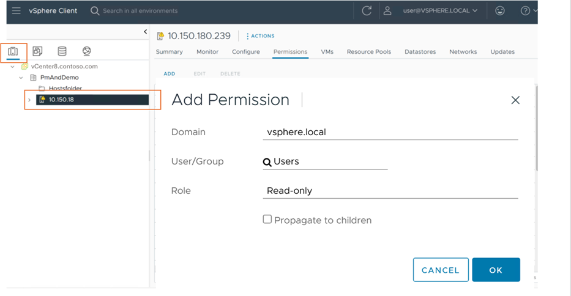

# Scoped discovery of VMware VMs

This article describes how to limit the discovery scope for servers in a VMware vSphere environment for assessment and agentless migration.

## Before you start

If you haven't set up a vCenter Server user account that Azure Migrate uses for discovery, do that now for [assessment](tutorial-discover-vmware.md#prepare-vmware) or [agentless migration](migrate-support-matrix-vmware-migration.md#agentless-migration).

### Assign permissions and roles for scoped discovery and assessment

1.	To discover specific VMs, assign **read-only and guest operations** permissions to the individual VMs on the vCenter user account. To discover all VMs from a folder, assign read permissions at the folder level and select **Propagate to Children**. 
2.	Grant **read-only and guest operations** permissions to all the parent objects that host the virtual machines, including host, cluster, hosts folder, clusters folder, up to the data center. *You don't need to propagate the permissions to all child objects*.
3.	From the vSphere client, verify that the read permissions are applied to the parent objects both from **Hosts and Clusters** view and from **VMs and Templates** view. The following screenshot shows how to assign permissions in the vSphere client.

	

4.	The role-based access control setup ensures that the corresponding vCenter user account has access to only tenant-specific servers.

### Assigned roles and permissions for agentless migration

1. On the appliance vCenter Server account you're using for migration, apply a user-defined role that has the [permissions needed](migrate-support-matrix-vmware-migration.md#vmware-vsphere-requirements-agentless) to all parent objects that host servers you want to discover and migrate.
2. You can name the role with something that's easier to identify. For example, *Azure_Migrate*.

## Related content

[Set up the appliance](how-to-set-up-appliance-vmware.md)
