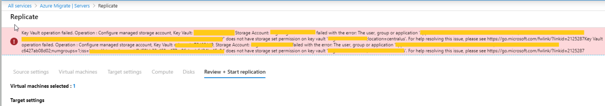

# Troubleshooting replication issues in agentless VMware VM migration

This article describes some common issues and specific errors you might encounter when you replicate on-premises VMware VMs using the Azure Migrate: Server Migration agentless method.

When you replicate a VMware virtual machine using the agentless replication method, data from the virtual machine&#39;s disks (vmdks) are replicated to replica managed disks in your Azure subscription. When replication starts for a VM, an initial replication cycle occurs in which full copies of the disks are replicated. After initial replication completes, incremental replication cycles are scheduled periodically to transfer any changes that have occurred since the previous replication cycle.

You may occasionally see replication cycles failing for a VM. These failures can happen due to reasons ranging from issues in on-premises network configuration to issues at the Azure Migrate Cloud Service backend. In this article, we will:

 - Show you how you can monitor replication status and resolve errors.
 - List some of the commonly occurring replication errors and suggest additional steps to remediate them.

## Monitor replication status using the Azure portal

Use the following steps to monitor the replication status for your virtual machines:

  1. Go to the Servers page in Azure Migrate on the Azure portal.
  2. Navigate to the "Replicating machines" page by clicking on "Replicating servers" in the Server Migration tile.
  3. You'll see a list of replicating servers along with additional information such as status, health, last sync time, etc. The health column indicates the current replication health of the VM. A 'Critical' or 'Warning' value in the health column typically indicates that the previous replication cycle for the VM failed. To get more details, right-click on the VM, and select "Error Details." The Error Details page contains information on the error and additional details on how to troubleshoot. You'll also see a "Recent Events" link that can be used to navigate to the events page for the VM.
  4. Click "Recent Events" to see the previous replication cycle failures for the VM. In the events page, look for the most recent event of type "Replication cycle failed" or "Replication cycle failed for disk" for the VM.
  5. Click on the event to understand the possible causes of the error and recommended remediation steps. Use the information provided to troubleshoot and remediate the error.
    
## Common Replication Errors

This section describes some of the common errors, and how you can troubleshoot them.

## Key Vault operation failed error when trying to replicate VMs

**Error:** “Key Vault operation failed. Operation : Configure managed storage account, Key Vault: Key-vault-name, Storage Account: storage account name failed with the error:”

**Error:** “Key Vault operation failed. Operation : Generate shared access signature definition, Key Vault: Key-vault-name, Storage Account: storage account name failed with the error:”

This error typically occurs because the User Access Policy for the Key Vault doesn't give the currently logged in user the necessary permissions to configure storage accounts to be Key Vault managed. To check for user access policy on the key vault, go to the Key vault page on the portal for the Key vault and select Access policies 

When the portal creates the key vault it also adds a user access policy granting the currently logged in user permissions to configure storage accounts to be Key Vault managed. This can fail for two reasons

- The logged in user is a remote principal on the customers Azure tenant (CSP subscription - and the logged in user is the partner admin). The workaround in this case is to delete the key vault, log out from the portal, and then log in with a user account from the customers tenant (not a remote principal) and retry the operation. The CSP partner will typically have a user account in the customers Azure Active Directory tenant that they can use. If not they can create a new user account for themselves in the customers Azure Active Directory tenant, log in to the portal as the new user and then retry the replicate operation. The account used must have either Owner or Contributor+User Access Administrator permissions granted to the account on the resource group (Migrate project resource group)

- The other case where this may happen is when one user (user1) attempted to setup replication initially and encountered a failure, but the key vault has already been created (and user access policy appropriately assigned to this user). Now at a later point a different user (user2) tries to setup replication, but the Configure Managed Storage Account or Generate SAS definition operation fails as there is no user access policy corresponding to user2 in the key vault.

**Resolution**: To workaround this issue create a user access policy for user2 in the keyvault granting user2 permission to configure managed storage account and generate SAS definitions. User2 can do this from Azure PowerShell using the below cmdlets:

$userPrincipalId = $(Get-AzureRmADUser -UserPrincipalName "user2_email_address").Id

Set-AzureRmKeyVaultAccessPolicy -VaultName "keyvaultname" -ObjectId $userPrincipalId -PermissionsToStorage get, list, delete, set, update, regeneratekey, getsas, listsas, deletesas, setsas, recover, backup, restore, purge

## DisposeArtefactsTimedOut

**Error ID:** 181008

**Error Message:** VM: VMName. Error: Encountered timeout event 'DisposeArtefactsTimeout' in the state &'['Gateway.Service.StateMachine.SnapshotReplication.SnapshotReplicationEngine+WaitingForArtefactsDisposalPreCycle' ('WaitingForArtefactsDisposalPreCycle')]'.

**Possible Causes:**

The component trying to replicate data to Azure is either down or not responding. The possible causes include:

- The gateway service running in the Azure Migrate appliance is down.
- The gateway service is experiencing connectivity issues to Service Bus/Event hub/Appliance Storage account.

**Identifying the exact cause for DisposeArtefactsTimedOut and the corresponding resolution:**

1. Ensure that the Azure Migrate appliance is up and running.
2. Check if the gateway service is running on the appliance:
   1.  Log in to the Azure Migrate appliance using remote desktop and do the following.

   2.  Open the Microsoft services MMC snap-in (run > services.msc), and check if the "Microsoft Azure Gateway Service" is running. If the service is stopped or not running, start the service. Alternatively, you can open command prompt or PowerShell and do: "Net Start asrgwy"

3. Check for connectivity issues between Azure Migrate appliance and Appliance Storage Account: 

    Run the following command after downloading azcopy in the Azure Migrate appliance:
    
    _azcopy bench https://[account].blob.core.windows.net/[container]?SAS_
    
    **Steps to run the performance benchmark test:**
    
      1. [Download](../storage/common/storage-use-azcopy-v10.md) azcopy
        
      2. Look for the appliance Storage Account in the Resource Group. The Storage Account has a name that resembles migrategwsa\*\*\*\*\*\*\*\*\*\*. This is the value of parameter [account] in the above command.
        
      3. Search for your storage account in the Azure portal. Ensure that the subscription you use to search is the same subscription (target subscription) in which the storage account is created. Go to Containers in the Blob Service section. Click on +Container and create a Container. Leave Public Access Level to default selected value.
        
      4. Go to Shared Access Signature under Settings. Select Container in "Allowed Resource Type." Click on Generate SAS and connection string. Copy the SAS value.
        
      5. Execute the above command in Command Prompt by replacing account, container, SAS with the values obtained in steps 2, 3, and 4 respectively.
        
      Alternatively, [download](https://go.microsoft.com/fwlink/?linkid=2138967) the Azure Storage Explore on to the appliance and try to upload 10 blobs of ~64 MB into the storage accounts. If there is no issue, the upload should be successful.
        
    **Resolution:** If this test fails, there&#39;s a networking issue. Engage your local networking team to check connectivity issues. Typically, there can be some firewall settings that are causing the failures.
    
4.  Check for connectivity issues between Azure Migrate appliance and Service Bus:

    This test checks if the Azure Migrate appliance can communicate to the Azure Migrate Cloud Service backend. The appliance communicates to the service backend through Service Bus and Event Hub message queues. To validate connectivity from the appliance to the Service Bus, [download](https://go.microsoft.com/fwlink/?linkid=2139104) the Service Bus Explorer, try to connect to the appliance Service Bus and perform send message/receive message. If there is no issue, this should be successful.

    **Steps to run the test:**

    1. Copy the connection string from the Service Bus that got created in the Migrate Project
    2. Open the Service Bus Explorer
    3. Go to File then Connect
    4. Paste the connection string and click Connect
    5. This will open Service Bus Name Space
    6. Select Snapshot Manager in the topic. Right click on Snapshot Manager, select "Receive Messages" > select "peek", and click OK
    7. If the connection is successful, you will see "[x] messages received" on the console output. If the connection is not successful, you'll see a message stating that the connection failed
    
    **Resolution:** If this test fails, there's a networking issue. Engage your local networking team to check connectivity issues. Typically, there can be some firewall settings that are causing the failures.

5. Connectivity issues between Azure Migrate appliance and Azure Key Vault:

    This test checks for connectivity issues between the Azure Migrate appliance and the Azure Key Vault. The Key Vault is used to manage Storage Account access used for replication.
    
    **Steps to check connectivity:**
    
    1. Fetch the Key Vault URI from the list of resources in the Resource Group corresponding to Azure Migrate Project.
    
    1. Open PowerShell in the Azure Migrate appliance and run the following command:
    
    _test-netconnection Key Vault URI -P 443_
    
    This command will attempt a TCP connection and will return an output.
    
     - In the output, check the field "_TcpTestSucceeded_". If the value is "_True_", there is no connectivity issue between the Azure Migrate Appliance and the Azure Key Vault. If the value is "False", there is a connectivity issue.
    
    **Resolution:** If this test fails, there's a connectivity issue between the Azure Migrate appliance and the Azure Key Vault. Engage your local networking team to check connectivity issues. Typically, there can be some firewall settings that are causing the failures.
    
## DiskUploadTimedOut

**Error ID:** 1011

**Error Message:** The upload of data for disk DiskPath, DiskId of virtual machine VMName; VMId did not complete within the expected time.

This error typically indicates either that the Azure Migrate appliance performing the replication is unable to connect to the Azure Cloud Services, or that replication is progressing slowly causing the replication cycle to time out.

The possible causes include:

- The Azure Migrate appliance is down.
- The replication gateway service on the appliance is not running.
- The replication gateway service is experiencing connectivity issues to one of the following Azure service components that are used for replication: Service Bus/Event Hub/Azure cache Storage Account/Azure Key Vault.
- The gateway service is being throttled at the vCenter level while trying to read the disk.

**Identifying the root cause and resolving the issue:**

1. Ensure that the Azure Migrate appliance is up and running.
2. Check if the gateway service is running on the appliance:
   1.  Log in to the Azure Migrate appliance using remote desktop and do the following.

   2.  Open the Microsoft services MMC snap-in (run > services.msc), and check if the  "Microsoft Azure Gateway Service"  is running. If the service is stopped or not running, start the service. Alternatively, you can open command prompt or PowerShell and do: "Net Start asrgwy".

3. **Check for connectivity issues between Azure Migrate appliance and cache Storage Account:** 

    Run the following command after downloading azcopy in the Azure Migrate appliance:
    
    _azcopy bench https://[account].blob.core.windows.net/[container]?SAS_
    
    **Steps to run the performance benchmark test:**
    
      1. [Download](../storage/common/storage-use-azcopy-v10.md) azcopy
        
      2. Look for the Appliance Storage Account in the Resource Group. The Storage Account has a name that resembles migratelsa\*\*\*\*\*\*\*\*\*\*. This is the value of parameter [account] in the above command.
        
      3. Search for your storage account in the Azure portal. Ensure that the subscription you use to search is the same subscription (target subscription) in which the storage account is created. Go to Containers in the Blob Service section. Click on +Container and create a Container. Leave Public Access Level to default selected value.
        
      4. Go to Shared Access Signature under Settings. Select Container in "Allowed Resource Type." Click on Generate SAS and connection string. Copy the SAS value.
        
      5. Execute the above command in Command Prompt by replacing account, container, SAS with the values obtained in steps 2, 3, and 4 respectively.
        
      Alternatively, [download](https://go.microsoft.com/fwlink/?linkid=2138967) the Azure Storage Explore on to the appliance and try to upload 10 blobs of ~64 MB into the storage accounts. If there is no issue, the upload should be successful.
        
    **Resolution:** If this test fails, there&#39;s a networking issue. Engage your local networking team to check connectivity issues. Typically, there can be some firewall settings that are causing the failures.
                
4.  **Connectivity issues between Azure Migrate appliance and Azure Service Bus:**

    This test will check whether the Azure Migrate appliance can communicate to the Azure Migrate Cloud Service backend. The appliance communicates to the service backend through Service Bus and Event Hub message queues. To validate connectivity from the appliance to the Service Bus, [download](https://go.microsoft.com/fwlink/?linkid=2139104) the Service Bus Explorer, try to connect to the appliance Service Bus and perform send message/receive message. If there is no issue, this should be successful.

    **Steps to run the test:**
    
    1. Copy the connection string from the Service Bus that got created in the Resource Group corresponding to Azure Migrate Project
    
    1. Open Service Bus Explorer
    
    1. Go to File > Connect
    
    1. Paste the connection string you copied in step 1, and click Connect
    
    1. This will open Service Bus namespace.
    
    1. Select Snapshot Manager in the topic in namespace. Right click on Snapshot Manager, select "Receive Messages" > select "peek", and click OK.
    
    If the connection is successful, you will see "[x] messages received" on the console output. If the connection is not successful, you'll see a message stating that the connection failed.
    
    **Resolution:** If this test fails, there's a connectivity issue between the Azure Migrate appliance and Service Bus. Engage your local networking team to check these connectivity issues. Typically, there can be some firewall settings that are causing the failures.
    
 5. **Connectivity issues between Azure Migrate appliance and Azure Key Vault:**

    This test checks for connectivity issues between the Azure Migrate appliance and the Azure Key Vault. The Key Vault is used to manage Storage Account access used for replication.
    
    **Steps to check connectivity:**
    
    1. Fetch the Key Vault URI from the list of resources in the Resource Group corresponding to Azure Migrate Project.
    
    1. Open PowerShell in the Azure Migrate appliance and run the following command:
    
    _test-netconnection Key Vault URI -P 443_
    
    This command will attempt a TCP connection and will return an output.
    
    1. In the output, check the field "_TcpTestSucceeded_". If the value is "_True_", there is no connectivity issue between the Azure Migrate Appliance and the Azure Key Vault. If the value is "False", there is a connectivity issue.
    
    **Resolution:** If this test fails, there's a connectivity issue between the Azure Migrate appliance and the Azure Key Vault. Engage your local networking team to check connectivity issues. Typically, there can be some firewall settings that are causing the failures.
    
## Encountered an error while trying to fetch changed blocks

Error Message: 'Encountered an error while trying to fetch change blocks'

The agentless replication method uses VMware's changed block tracking technology (CBT) to replicate data to Azure. CBT lets Server Migration tool track and replicate only the blocks that have changed since the last replication cycle. This error occurs if changed block tracking for a replicating virtual machine is reset or if the changed block tracking file is corrupt.

This error can be resolved in the following two ways:

- If you had opted for "Automatically repair replication" by selecting "Yes" when you triggered replication of VM, the tool will try to repair it for you. Right click on the VM, and select "Repair Replication."
- If you did not opt for "Automatically repair replication" or the above step did not work for you, then stop replication for the virtual machine, [reset changed block tracking](https://go.microsoft.com/fwlink/?linkid=2139203) on the virtual machine, and then reconfigure replication.

One such known issue that may cause a CBT reset of virtual machine on VMware vSphere 5.5 is described in [VMware KB 2048201: Changed Block Tracking](https://go.microsoft.com/fwlink/?linkid=2138888) is reset after a storage vMotion operation in vSphere 5.x . If you are on VMware vSphere 5.5 ensure that you apply the updates described in this KB.

Alternatively, you can [reset VMware changed block tracking on a virtual machine using VMware PowerCLI.

## An internal error occurred

Sometimes you may hit an error that occurs due to issues in the VMware environment/API. We have identified the following set of errors as VMware environment-related errors. These errors have a fixed format.

_Error Message: An internal error occurred. [Error message]_

For example: Error Message: An internal error occurred. [An Invalid snapshot configuration was detected].

The following section lists some of the commonly seen VMware errors and how you can mitigate them.

### Error Message: An internal error occurred. [Server Refused Connection]

The issue is a known VMware issue and occurs in VDDK 6.7. You need to stop the gateway service running in the Azure Migrate appliance, [download an update from VMware KB](https://go.microsoft.com/fwlink/?linkid=2138889), and restart the gateway service.

Steps to stop gateway service:

1. Press Windows + R, open services.msc. Click on "Microsoft Azure Gateway Service", and stop it.
2. Alternatively, you can open command prompt or PowerShell and do: Net Stop asrgwy. Ensure you wait until you get the message that service is no longer running.

Steps to start gateway service:

1. Press Windows + R, open services.msc. Right click on "Microsoft Azure Gateway Service", and start it.
2. Alternatively, you can open command prompt or PowerShell and do: Net Start asrgwy.

### Error Message: An internal error occurred. ['An Invalid snapshot configuration was detected.']

If you have a virtual machine with multiple disks, you may encounter this error if you remove a disk from the virtual machine. To remediate this problem, refer to the steps in [this VMware article](https://go.microsoft.com/fwlink/?linkid=2138890).

### Error Message: An internal error occurred. [Generate Snapshot Hung]

This issue occurs when snapshot generation stops responding. When this issue occurs, you can see create snapshot task stops at 95% or 99%. Refer to this [VMware KB](https://go.microsoft.com/fwlink/?linkid=2138969) to overcome this issue.

### Error Message: An internal error occurred. [Failed to consolidate the disks on VM _[Reasons]_]

When we consolidate disks at the end of replication cycle, the operation fails. Follow the instructions in the [VMware KB](https://go.microsoft.com/fwlink/?linkid=2138970) by selecting the appropriate _Reason_ to resolve the issue.

The following errors occur when VMware snapshot-related operations – create, delete, or consolidate disks fail. Follow the guidance in the next section to remediate the errors:

### Error Message: An internal error occurred. [Another task is already in progress]

This issue occurs when there are conflicting virtual machine tasks running in the background, or when a task within the vCenter Server times out. Follow the resolution provided in the following [VMware KB](https://go.microsoft.com/fwlink/?linkid=2138891).

### Error Message: An internal error occurred. [Operation not allowed in current state]

This issue occurs when vCenter Server management agents stop working. To resolve this issue, refer to the resolution in the following [VMware KB](https://go.microsoft.com/fwlink/?linkid=2138971).

### Error Message: An internal error occurred. [Snapshot Disk size invalid]

This is a known VMware issue in which the disk size indicated by snapshot becomes zero. Follow the resolution given in the [VMware KB](https://go.microsoft.com/fwlink/?linkid=2138972).

### Error Message: An internal error occurred. [Memory allocation failed. Out of memory.]

This happens when the NFC host buffer is out of memory. To resolve this issue, you need to move the VM (compute vMotion) to a different host, which has free resources.

## Next Steps

Continue VM replication, and perform [test migration](./tutorial-migrate-vmware.md#run-a-test-migration).