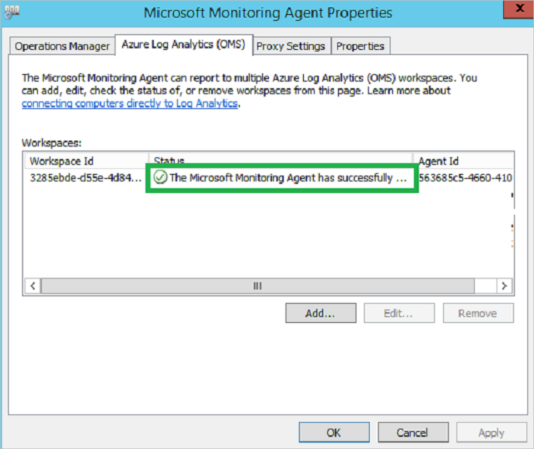

# Troubleshoot dependency visualization

This article helps you troubleshoot issues with agent-based and agentless dependency analysis, which is _only available for VMware servers_. [Learn more](concepts-dependency-visualization.md) about the types of dependency visualization supported in Azure Migrate.

## Visualize dependencies for >1 hour with agentless dependency analysis

With agentless dependency analysis, you can visualize dependencies or export them in a map for a duration of up to 30 days.

## Visualize dependencies for >10 servers with agentless dependency analysis

Azure Migrate offers a Power BI template that you can use to visualize network connections of many servers at once, and filter by process and server. [Learn more](how-to-create-group-machine-dependencies-agentless.md#visualize-network-connections-in-power-bi) about how to visualize the dependencies for many servers together.

## Dependencies export CSV shows "Unknown process" with agentless dependency analysis
In agentless dependency analysis, the process names are captured on a best-effort basis. In certain scenarios, although the source and destination server names and the destination port are captured, it isn't feasible to determine the process names at both ends of the dependency. In such cases, the process is marked as "Unknown process."

## Unable to export dependency data in a CSV due to the error "403: This request is not authorized to perform this operation"
If your Azure Migrate project has private endpoint connectivity, the request to export dependency data should be initiated from a client connected to the Azure virtual network over a private network. To resolve this error, open the Azure portal in your on-premises network or on your appliance server and try exporting again.

## Export the dependency analysis errors

You can export all the errors and remediations for agentless dependency analysis from the portal by selecting **Export notifications**. The exported CSV file also contains additional information like the timestamp at which the error was encountered and if it was an error in validation or discovery of dependency data.

:::image type="content" source="./media/troubleshoot-dependencies/export-notifications.png" alt-text="Screenshot of Export notifications screen.":::

## Common agentless dependency analysis errors

Azure Migrate supports agentless dependency analysis by using Azure Migrate: Discovery and assessment. [Learn more](how-to-create-group-machine-dependencies-agentless.md) about how to perform agentless dependency analysis.

For VMware VMs, agentless dependency analysis is performed by connecting to the servers via the vCenter Server using the VMware APIs. For Hyper-V VMs and physical servers, agentless dependency analysis is performed by directly connecting to Windows servers using PowerShell remoting on port 5985 (HTTP) and to Linux servers using SSH connectivity on port 22 (TCP).

The table below summarizes all errors encountered when gathering dependency data through VMware APIs or by directly connecting to servers:

> [!Note]
> The same errors can also be encountered with software inventory because it follows the same methodology as agentless dependency analysis to collect the required data.

| **Error** | **Cause** | **Action** |
|--|--|--|
| **60001**:UnableToConnectToPhysicalServer | Either the [prerequisites](./migrate-support-matrix-physical.md) to connect to the server have not been met or there are network issues in connecting to the server, for instance some proxy settings.| - Ensure that the server meets the prerequisites and [port access requirements](./migrate-support-matrix-physical.md). <br/> - Add the IP addresses of the remote machines (discovered servers) to the WinRM TrustedHosts list on the Azure Migrate appliance, and retry the operation. This is to allow remote inbound connections on servers - _Windows:_ WinRM port 5985 (HTTP) and _Linux:_ SSH port 22 (TCP). <br/>- Ensure that you have chosen the correct authentication method on the appliance to connect to the server. <br/> - If the issue persists, submit a Microsoft support case, providing the appliance machine ID (available in the footer of the appliance configuration manager).|
| **60002**:InvalidServerCredentials| Unable to connect to server. Either you have provided incorrect credentials on the appliance or the credentials previously provided have expired.| - Ensure that you have provided the correct credentials for the server on the appliance. You can check that by trying to connect to the server using those credentials.<br/> - If the credentials added are incorrect or have expired, edit the credentials on the appliance and revalidate the added servers. If the validation succeeds, the issue is resolved.<br/> - If the issue persists, submit a Microsoft support case, providing the appliance machine ID (available in the footer of the appliance configuration manager).|
| **60005**:SSHOperationTimeout | The operation took longer than expected either due to network latency issues or due to the lack of latest updates on the server.| - Ensure that the impacted server has the latest kernel and OS updates installed.<br/>- Ensure that there is no network latency between the appliance and the server. It is recommended to have the appliance and source server on the same domain to avoid latency issues.<br/> - Connect to the impacted server from the appliance and run the commands [documented here](./troubleshoot-appliance.md) to check if they return null or empty data.<br/>- If the issue persists, submit a Microsoft support case providing the appliance machine ID (available in the footer of the appliance configuration manager). |
| **9000**: VMware tools status on the server can't be detected. | VMware tools might not be installed on the server or the installed version is corrupted. | Ensure that VMware tools later than version 10.2.1 are installed and running on the server. |
| **9001**: VMware tools aren't installed on the server. | VMware tools might not be installed on the server or the installed version is corrupted. | Ensure that VMware tools later than version 10.2.1 are installed and running on the server. |
| **9002**: VMware tools aren't running on the server. | VMware tools might not be installed on the server or the installed version is corrupted. | Ensure that VMware tools later than version 10.2.0 are installed and running on the server. |
| **9003**: Operation system type running on the server isn't supported. | Operating system running on the server isn't Windows or Linux. | Only Windows and Linux OS types are supported. If the server is indeed running Windows or Linux OS, check the operating system type specified in vCenter Server. |
| **9004**: Server isn't in a running state. | Server is in a powered-off state. | Ensure that the server is in a running state. |
| **9005**: Operation system type running on the server isn't supported. | Operating system running on the server isn't Windows or Linux. | Only Windows and Linux OS types are supported. The \<FetchedParameter> operating system isn't supported currently. |
| **9006**: The URL needed to download the discovery metadata file from the server is empty. | This issue could be transient because of the discovery agent on the appliance not working as expected. | The issue should automatically resolve in the next cycle within 24 hours. If the issue persists, submit a Microsoft support case. |
| **9007**: The process that runs the script to collect the metadata isn't found in the server. | This issue could be transient because of the discovery agent on the appliance not working as expected. | The issue should automatically resolve in the next cycle within 24 hours. If the issue persists, submit a Microsoft support case. |
| **9008**: The status of the process running on the server to collect the metadata can't be retrieved. | This issue could be transient because of an internal error. | The issue should automatically resolve in the next cycle within 24 hours. If the issue persists, submit a Microsoft support case. |
| **9009**: Windows User Account Control (UAC) prevents the execution of discovery operations on the server. | Windows UAC settings restrict the discovery of installed applications from the server. | On the affected server, lower the level of the **User Account Control** settings on the Control Panel. |
| **9010**: The server is powered off. | The server is in a powered-off state. | Ensure that the server is in a powered-on state. |
| **9011**: The file containing the discovered metadata can't be found on the server. | This issue could be transient because of an internal error. | The issue should automatically resolve in the next cycle within 24 hours. If the issue persists, submit a Microsoft support case. |
| **9012**: The file containing the discovered metadata on the server is empty. | This issue could be transient because of an internal error. | The issue should automatically resolve in the next cycle within 24 hours. If the issue persists, submit a Microsoft support case. |
| **9013**: A new temporary user profile is created on logging in to the server each time. | A new temporary user profile is created on logging in to the server each time. | Submit a Microsoft support case to help troubleshoot this issue. |
| **9014**: Unable to retrieve the file containing the discovered metadata because of an error encountered on the ESXi host. Error code: %ErrorCode; Details: %ErrorMessage | Encountered an error on the ESXi host \<HostName>. Error code: %ErrorCode; Details: %ErrorMessage. | Ensure that port 443 is open on the ESXi host on which the server is running.<br/><br/> [Learn more](troubleshoot-dependencies.md#error-9014-httpgetrequesttoretrievefilefailed) on how to remediate the issue.|
| **9015**: The vCenter Server user account provided for server discovery doesn't have guest operations privileges enabled. | The required privileges of guest operations haven't been enabled on the vCenter Server user account. | Ensure that the vCenter Server user account has privileges enabled for **Virtual Machines** > **Guest Operations** to interact with the server and pull the required data. <br/><br/> [Learn more](tutorial-discover-vmware.md#prepare-vmware) on how to set up the vCenter Server account with required privileges. |
| **9016**: Unable to discover the metadata because the guest operations agent on the server is outdated. | Either the VMware tools aren't installed on the server or the installed version isn't up to date. | Ensure that the VMware tools are installed and running and up to date on the server. The VMware Tools version must be version 10.2.1 or later. |
| **9017**: The file containing the discovered metadata can't be found on the server. | This could be a transient issue because of an internal error. | Submit a Microsoft support case to help troubleshoot this issue. |
| **9018**: PowerShell isn't installed on the server. | PowerShell can't be found on the server. | Ensure that PowerShell version 2.0 or later is installed on the server. <br/><br/> [Learn more](troubleshoot-dependencies.md#error-9018-powershellnotfound) about how to remediate the issue.|
| **9019**: Unable to discover the metadata because of guest operation failures on the server. | VMware guest operations failed on the server. The issue was encountered when trying the following credentials on the server: \<FriendlyNameOfCredentials>. | Ensure that the server credentials on the appliance are valid and the username in the credentials is in the user principal name (UPN) format. (Find the friendly name of the credentials tried by Azure Migrate in the possible causes.) |
| **9020**: Unable to create the file required to contain the discovered metadata on the server. | The role associated to the credentials provided on the appliance or a group policy on-premises is restricting the creation of the file in the required folder. The issue was encountered when trying the following credentials on the server: \<FriendlyNameOfCredentials>. | 1. Check if the credentials provided on the appliance have created file permission on the folder \<folder path/folder name> in the server. <br/>2. If the credentials provided on the appliance don't have the required permissions, either provide another set of credentials or edit an existing one. (Find the friendly name of the credentials tried by Azure Migrate in the possible causes.) |
| **9021**: Unable to create the file required to contain the discovered metadata at the right path on the server. | VMware tools are reporting an incorrect file path to create the file. | Ensure that VMware tools later than version 10.2.0 are installed and running on the server. |
| **9022**: The access is denied to run the Get-WmiObject cmdlet on the server. | The role associated to the credentials provided on the appliance or a group policy on-premises is restricting access to the WMI object. The issue was encountered when trying the following credentials on the server: \<FriendlyNameOfCredentials>. | 1. Check if the credentials provided on the appliance have created file administrator privileges and have WMI enabled. <br/>2. If the credentials provided on the appliance don't have the required permissions, either provide another set of credentials or edit an existing one. (Find the friendly name of the credentials tried by Azure Migrate in the possible causes.)<br/><br/> [Learn more](troubleshoot-dependencies.md#error-9022-getwmiobjectaccessdenied) on how to remediate the issue.|
| **9023**: Unable to run PowerShell because the %SystemRoot% environment variable value is empty. | The value of the %SystemRoot% environment variable is empty for the server. | 1. Check if the environment variable is returning an empty value by running echo %systemroot% command on the affected server. <br/>2. If issue persists, submit a Microsoft support case. |
| **9024**: Unable to perform discovery as the %TEMP% environment variable value is empty. | The value of %TEMP% environment variable is empty for the server. | 1. Check if the environment variable is returning an empty value by running the echo %temp% command on the affected server. <br/>2. If the issue persists, submit a Microsoft support case. |
| **9025**: Unable to perform discovery because PowerShell is corrupted on the server. | PowerShell is corrupted on the server. | Reinstall PowerShell and verify that it's running on the affected server. |
| **9026**: Unable to run guest operations on the server. | The current state of the server doesn't allow the guest operations to run. | 1. Ensure that the affected server is up and running.<br/>2. If the issue persists, submit a Microsoft support case. |
| **9027**: Unable to discover the metadata because the guest operations agent isn't running on the server. | Unable to contact the guest operations agent on the server. | Ensure that VMware tools later than version 10.2.0 are installed and running on the server. |
| **9028**: Unable to create the file required to contain the discovered metadata because of insufficient storage on the server. | There's a lack of sufficient storage space on the server disk. | Ensure that enough space is available on the disk storage of the affected server. |
| **9029**: The credentials provided on the appliance don't have access permissions to run PowerShell. | The credentials on the appliance don't have access permissions to run PowerShell. The issue was encountered when trying the following credentials on the server: \<FriendlyNameOfCredentials>. | 1. Ensure that the credentials on the appliance can access PowerShell on the server.<br/>2. If the credentials on the appliance don't have the required access, either provide another set of credentials or edit an existing one. (Find the friendly name of the credentials tried by Azure Migrate in the possible causes.) |
| **9030**: Unable to gather the discovered metadata because the ESXi host where the server is hosted is in a disconnected state. | The ESXi host on which the server is residing is in a disconnected state. | Ensure that the ESXi host running the server is in a connected state. |
| **9031**: Unable to gather the discovered metadata because the ESXi host where the server is hosted isn't responding. | The ESXi host on which the server is residing is in an invalid state. | Ensure that the ESXi host running the server is in a running and connected state. |
| **9032**: Unable to discover because of an internal error. | The issue encountered is because of an internal error. | Follow the steps on [this website](troubleshoot-dependencies.md#error-9032-invalidrequest) to remediate the issue. If the issue persists, open a Microsoft support case. |
| **9033**: Unable to discover because the username of the credentials provided on the appliance for the server has invalid characters. | The credentials on the appliance contain invalid characters in the username. The issue was encountered when trying the following credentials on the server: \<FriendlyNameOfCredentials>. | Ensure that the credentials on the appliance don't have any invalid characters in the username. You can go back to the appliance configuration manager to edit the credentials. (Find the friendly name of the credentials tried by Azure Migrate in the possible causes.) |
| **9034**: Unable to discover because the username of the credentials provided on the appliance for the server isn't in the UPN format. | The credentials on the appliance don't have the username in the UPN format. The issue was encountered when trying the following credentials on the server: \<FriendlyNameOfCredentials>. | Ensure that the credentials on the appliance have their username in the UPN format. You can go back to the appliance configuration manager to edit the credentials. (Find the friendly name of the credentials tried by Azure Migrate in the possible causes.) |
| **9035**: Unable to discover because the PowerShell language mode isn't set correctly. | The PowerShell language mode isn't set to **Full language**. | Ensure that the PowerShell language mode is set to **Full language**. |
| **9036**: Unable to discover because the username of the credentials provided on the appliance for the server isn't in the UPN format. | The credentials on the appliance don't have the username in the UPN format. The issue was encountered when trying the following credentials on the server: \<FriendlyNameOfCredentials>. | Ensure that the credentials on the appliance have their username in the UPN format. You can go back to the appliance configuration manager to edit the credentials. (Find the friendly name of the credentials tried by Azure Migrate in the possible causes.) |
| **9037**: The metadata collection is temporarily paused because of high response time from the server. | The server is taking too long to respond. | The issue should automatically resolve in the next cycle within 24 hours. If the issue persists, submit a Microsoft support case. |
| **10000**: The operation system type running on the server isn't supported. | The operating system running on the server isn't Windows or Linux. | Only Windows and Linux OS types are supported. \<GuestOSName> operating system isn't supported currently. |
| **10001**: The script required to gather discovery metadata isn't found on the server. | The script required to perform discovery might have been deleted or removed from the expected location. | Submit a Microsoft support case to help troubleshoot this issue. |
| **10002**: The discovery operations timed out on the server. | This issue could be transient because the discovery agent on the appliance isn't working as expected. | The issue should automatically resolve in the next cycle within 24 hours. If it isn't resolved, follow the steps on [this website](troubleshoot-dependencies.md#error-10002-scriptexecutiontimedoutonvm) to remediate the issue. If the issue  persists, open a Microsoft support case.|
| **10003**: The process executing the discovery operations exited with an error. | The process executing the discovery operations exited abruptly because of an error.| The issue should automatically resolve in the next cycle within 24 hours. If the issue persists, submit a Microsoft support case. |
| **10004**: Credentials aren't provided on the appliance for the server OS type. | The credentials for the server OS type weren't added on the appliance. | 1. Ensure that you add the credentials for the OS type of the affected server on the appliance.<br/> 2. You can now add multiple server credentials on the appliance. |
| **10005**: Credentials provided on the appliance for the server are invalid. | The credentials provided on the appliance aren't valid. The issue was encountered when trying the following credentials on the server: \<FriendlyNameOfCredentials>. | 1. Ensure that the credentials provided on the appliance are valid and the server is accessible by using the credentials.<br/> 2. You can now add multiple server credentials on the appliance.<br/> 3. Go back to the appliance configuration manager to either provide another set of credentials or edit an existing one. (Find the friendly name of the credentials tried by Azure Migrate in the possible causes.) <br/><br/> [Learn more](troubleshoot-dependencies.md#error-10005-guestcredentialnotvalid) about how to remediate the issue.|
| **10006**: The operation system type running on the server isn't supported. | The operating system running on the server isn't Windows or Linux. | Only Windows and Linux OS types are supported. \<GuestOSName> operating system isn't supported currently. |
| **10007**: Unable to process the discovered metadata from the server. | An error occurred when parsing the contents of the file containing the discovered metadata. | Submit a Microsoft support case to help troubleshoot this issue. |
| **10008**: Unable to create the file required to contain the discovered metadata on the server. | The role associated to the credentials provided on the appliance or a group policy on-premises is restricting the creation of file in the required folder. The issue was encountered when trying the following credentials on the server: \<FriendlyNameOfCredentials>. | 1. Check if the credentials provided on the appliance have created file permission on the folder \<folder path/folder name> in the server.<br/>2. If the credentials provided on the appliance don't have the required permissions, either provide another set of credentials or edit an existing one. (Find the friendly name of the credentials tried by Azure Migrate in the possible causes.) |
| **10009**: Unable to write the discovered metadata in the file on the server. | The role associated to the credentials provided on the appliance or a group policy on-premises is restricting writing in the file on the server. The issue was encountered when trying the following credentials on the server: \<FriendlyNameOfCredentials>. | 1. Check if the credentials provided on the appliance have write file permission on the folder \<folder path/folder name> in the server.<br/>2. If the credentials provided on the appliance don't have the required permissions, either provide another set of credentials or edit an existing one. (Find the friendly name of the credentials tried by Azure Migrate in the possible causes.) |
| **10010**: Unable to discover because the command- %CommandName; required to collect some metadata is missing on the server. | The package containing the command %CommandName; isn't installed on the server. | Ensure that the package that contains the command %CommandName; is installed on the server. |
| **10011**: The credentials provided on the appliance were used to log in and log out for an interactive session. | The interactive login and logout forces the registry keys to be unloaded in the profile of the account being used. This condition makes the keys unavailable for future use. | Use the resolution methods documented on [this website](/sharepoint/troubleshoot/administration/800703fa-illegal-operation-error#resolutionus/sharepoint/troubleshoot/administration/800703fa-illegal-operation-error). |
| **10012**: Credentials haven't been provided on the appliance for the server. | Either no credentials have been provided for the server or you've provided domain credentials with an incorrect domain name on the appliance. [Learn more](troubleshoot-dependencies.md#error-10012-credentialnotprovided) about the cause of this error. | 1. Ensure that the credentials are provided on the appliance for the server and the server is accessible by using the credentials. <br/>2. You can now add multiple credentials on the appliance for servers. Go back to the appliance configuration manager to provide credentials for the server.|


## Error 970: DependencyMapInsufficientPrivilegesException

### Cause
The error usually appears for Linux servers when you haven't provided credentials with the required privileges on the appliance.

### Remediation
You have two options:

- Ensure that you've provided a root user account.
- Ensure that an account has these permissions on /bin/netstat and /bin/ls files:
   - CAP_DAC_READ_SEARCH
   - CAP_SYS_PTRACE

To check if the user account provided on the appliance has the required privileges:

1. Log in to the server where you encountered this error with the same user account as mentioned in the error message.
1. Run the following commands in Azure Shell. You'll get errors if you don't have the required privileges for agentless dependency analysis.

   ````
   ps -o pid,cmd | grep -v ]$
   netstat -atnp | awk '{print $4,$5,$7}'
   ````
1. Set the required permissions on /bin/netstat and /bin/ls files by running the following commands:

   ````
   sudo setcap CAP_DAC_READ_SEARCH,CAP_SYS_PTRACE=ep /bin/ls
   sudo setcap CAP_DAC_READ_SEARCH,CAP_SYS_PTRACE=ep /bin/netstat
   ````
1. You can validate if the preceding commands assigned the required permissions to the user account or not.

   ````
   getcap /usr/bin/ls
   getcap /usr/bin/netstat
   ````
1. Rerun the commands provided in step 2 to get a successful output.


## Error 9014: HTTPGetRequestToRetrieveFileFailed

### Cause
The issue happens when the VMware discovery agent in appliance tries to download the output file containing dependency data from the server file system through the ESXi host on which the server is hosted.

### Remediation
- You can test TCP connectivity to the ESXi host _(name provided in the error message)_ on port 443 (required to be open on ESXi hosts to pull dependency data) from the appliance. Open PowerShell on the appliance server and run the following command:
    ````
    Test -NetConnection -ComputeName <Ip address of the ESXi host> -Port 443
    ````

- If the command returns successful connectivity, go to the **Azure Migrate project** > **Discovery and assessment** > **Overview** > **Manage** > **Appliances**, select the appliance name, and select **Refresh services**.

## Error 9018: PowerShellNotFound

### Cause
The error usually appears for servers running Windows Server 2008 or lower.

### Remediation
Install Windows PowerShell 5.1 at this location on the server. Following the instructios in [Install and Configure WMF 5.1](/previous-versions/powershell/scripting/windows-powershell/install/installing-windows-powershell) about how to install PowerShell in Windows Server.


After you install the required PowerShell version, verify if the error was resolved by following the steps on [this website](troubleshoot-dependencies.md#mitigation-verification).

## Error 9022: GetWMIObjectAccessDenied

### Remediation
Make sure that the user account provided in the appliance has access to the WMI namespace and subnamespaces. To set the access:

1. Go to the server that's reporting this error.
1. Search and select **Run** from the **Start** menu. In the **Run** dialog, enter **wmimgmt.msc** in the **Open** text box, and select **Enter**.
1. The wmimgmt console opens where you can find **WMI Control (Local)** in the left pane. Right-click it, and select **Properties** from the menu.
1. In the **WMI Control (Local) Properties** dialog, select the **Securities** tab.
1. On the **Securities** tab, select **Security** to open the **Security for ROOT** dialog.
1. Select **Advanced** to open the **Advanced Security Settings for Root** dialog.
1. Select **Add** to open the **Permission Entry for Root** dialog.
1. Click **Select a principal** to open the **Select Users, Computers, Service Accounts, or Groups** dialog.
1. Select the usernames or groups you want to grant access to the WMI, and select **OK**.
1. Ensure you grant execute permissions, and select **This namespace and subnamespaces** in the **Applies to** dropdown list.
1. Select **Apply** to save the settings and close all dialogs.

After you get the required access, verify if the error was resolved by following the steps on [this website](troubleshoot-dependencies.md#mitigation-verification).

## Error 9032: InvalidRequest

### Cause
There can be multiple reasons for this issue. One reason is when the username provided (server credentials) on the appliance configuration manager has invalid XML characters. Invalid characters cause an error in parsing the SOAP request.

### Remediation
- Make sure the username of the server credentials doesn't have invalid XML characters and is in the username@domain.com format. This format is popularly known as the UPN format.
- After you edit the credentials on the appliance, verify if the error was resolved by following the steps on [this website](troubleshoot-dependencies.md#mitigation-verification).


## Error 10002: ScriptExecutionTimedOutOnVm

### Cause
- This error occurs when the server is slow or unresponsive and the script executed to pull the dependency data starts timing out.
- After the discovery agent encounters this error on the server, the appliance doesn't attempt agentless dependency analysis on the server thereafter to avoid overloading the unresponsive server.
- You'll continue to see the error until you check the issue with the server and restart the discovery service.

### Remediation
1. Log in to the server that's encountering this error.
1. Run the following commands on PowerShell:
   ````
   Get-WMIObject win32_operatingsystem;
   Get-WindowsFeature  | Where-Object {$_.InstallState -eq 'Installed' -or ($_.InstallState -eq $null -and $_.Installed -eq 'True')};
   Get-WmiObject Win32_Process;
   netstat -ano -p tcp | select -Skip 4;
   ````
1. If commands output the result in a few seconds, go to the **Azure Migrate project** > **Discovery and assessment** > **Overview** > **Manage** > **Appliances**, select the appliance name, and select **Refresh services** to restart the discovery service.
1. If the commands are timing out without giving any output, you need to:

   - Figure out which processes are consuming high CPU or memory on the server.
   - Try to provide more cores or memory to that server and run the commands again.

## Error 10005: GuestCredentialNotValid

### Remediation
- Ensure the validity of credentials _(friendly name provided in the error)_ by selecting **Revalidate credentials** on the appliance configuration manager.
- Ensure that you can log in to the affected server by using the same credential provided in the appliance.
- You can try using another user account (for the same domain, in case the server is domain joined) for that server instead of the administrator account.
- The issue can happen when Global Catalog <-> Domain Controller communication is broken. Check for this problem by creating a new user account in the domain controller and providing the same in the appliance. You might also need to restart the domain controller.
- After you take the remediation steps, verify if the error was resolved by following the steps on [this website](troubleshoot-dependencies.md#mitigation-verification).

## Error 10012: CredentialNotProvided

### Cause
This error occurs when you've provided a domain credential with the wrong domain name on the appliance configuration manager. For example, if you've provided domain credentials with the username user@abc.com but provided the domain name as def.com, those credentials won't be attempted if the server is connected to def.com and you'll get this error message.

### Remediation
- Go to the appliance configuration manager to add a server credential or edit an existing one as explained in the cause.
- After you take the remediation steps, verify if the error was resolved by following the steps on [this website](troubleshoot-dependencies.md#mitigation-verification).

## Mitigation verification

After you use the mitigation steps for the preceding errors, verify if the mitigation worked by running a few PowerCLI commands from the appliance server. If the commands succeed, it means that the issue is resolved. Otherwise, check and follow the remediation steps again.

### For VMware VMs _(using VMware pipe)_
1. Run the following commands to set up PowerCLI on the appliance server:
   ````
   Install-Module -Name VMware.PowerCLI -AllowClobber
   Set-PowerCLIConfiguration -InvalidCertificateAction Ignore
   ````
1. Connect to the vCenter server from the appliance by providing the vCenter server IP address in the command and credentials in the prompt:
   ````
   Connect-VIServer -Server <IPAddress of vCenter Server>
   ````
1. Connect to the target server from the appliance by providing the server name and server credentials, as provided on the appliance:
   ````
   $vm = get-VM <VMName>
   $credential = Get-Credential
   ````
1. For agentless dependency analysis, run the following commands to see if you get a successful output.

      - For Windows servers:

          ````
          Invoke-VMScript -VM $vm -ScriptText "powershell.exe 'Get-WmiObject Win32_Process'" -GuestCredential $credential

          Invoke-VMScript -VM $vm -ScriptText "powershell.exe 'netstat -ano -p tcp'" -GuestCredential $credential
          ````
      - For Linux servers:
          ````
          Invoke-VMScript -VM $vm -ScriptText "ps -o pid,cmd | grep -v ]$" -GuestCredential $credential

          Invoke-VMScript -VM $vm -ScriptText "netstat -atnp | awk '{print $4,$5,$7}'" -GuestCredential $credential
          ````

### For Hyper-V VMs and physical servers _(using direct connect pipe)_
For Windows servers:

1. Connect to Windows server by running the command:
   ````
   $Server = New-PSSession –ComputerName <IPAddress of Server> -Credential <user_name>
   ````
   and input the server credentials in the prompt.

2. Run the following commands to validate for agentless dependency analysis to see if you get a successful output:
   ````
   Invoke-Command -Session $Server -ScriptBlock {Get-WmiObject Win32_Process}
   Invoke-Command -Session $Server -ScriptBlock {netstat -ano -p tcp}
   ````

For Linux servers:

1. Install the OpenSSH client
   ````
   Add-WindowsCapability -Online -Name OpenSSH.Client~~~~0.0.1.0
   ````
2. Install the OpenSSH server
   ````
   Add-WindowsCapability -Online -Name OpenSSH.Server~~~~0.0.1.0
   ````
3. Start and configure OpenSSH Server
   ````
   Start-Service sshd
   Set-Service -Name sshd -StartupType 'Automatic'
   ````
4. Connect to OpenSSH Server
   ````
   ssh username@servername
   ````
5. Run the following commands to validate for agentless dependency analysis to see if you get a successful output:
   ````
   ps -o pid,cmd | grep -v ]$
   netstat -atnp | awk '{print $4,$5,$7}'
   ````

After you verify that the mitigation worked, go to the **Azure Migrate project** > **Discovery and assessment** > **Overview** > **Manage** > **Appliances**, select the appliance name, and select **Refresh services** to start a fresh discovery cycle.

## My Log Analytics workspace isn't listed when you try to configure the workspace in Azure Migrate for agent-based dependency analysis
Azure Migrate currently supports creation of OMS workspace in East US, Southeast Asia, and West Europe regions. If the workspace is created outside of Azure Migrate in any other region, it currently can't be associated with a project.

## Agent-based dependency visualization in Azure Government

Agent-based dependency analysis isn't supported in Azure Government. Use agentless dependency analysis, which is _only available for VMware servers_.

## Agent-based dependencies don't show after agent installation

After you've installed the dependency visualization agents on on-premises VMs, Azure Migrate typically takes 15 to 30 minutes to display the dependencies in the portal. If you've waited for more than 30 minutes, make sure that the Microsoft Monitoring Agent (MMA) can connect to the Log Analytics workspace.

For Windows VMs:
1. In the Control Panel, start MMA.
1. In **Microsoft Monitoring Agent properties** > **Azure Log Analytics (OMS)**, make sure that the **Status** for the workspace is green.
1. If the status isn't green, try removing the workspace and adding it again to MMA.

    

For Linux VMs, make sure that the installation commands for MMA and the dependency agent succeeded. Refer to more troubleshooting guidance on [this website](/previous-versions/azure/azure-monitor/vm/service-map#post-installation-issues).

## Supported operating systems for agent-based dependency analysis

- **MMS agent**: The supported [Windows](../azure-monitor/agents/agents-overview.md#supported-operating-systems) and [Linux](../azure-monitor/agents/agents-overview.md#supported-operating-systems) operating systems.
- **Dependency agent**: The supported [Windows and Linux](../azure-monitor/vm/vminsights-enable-overview.md#supported-operating-systems) operating systems.

## Visualize dependencies for >1 hour with agent-based dependency analysis

With agent-based dependency analysis, although Azure Migrate allows you to go back to a particular date in the last month, the maximum duration for which you can visualize the dependencies is one hour. For example, you can use the time duration functionality in the dependency map to view dependencies for yesterday, but you can view them for a one-hour period only. You can use Azure Monitor logs to [query the dependency data](./how-to-create-group-machine-dependencies.md) over a longer duration.

## Visualize dependencies for >10 servers with agent-based dependency analysis

In Azure Migrate, with agent-based dependency analysis, you can [visualize dependencies for groups](./how-to-create-a-group.md#refine-a-group-with-dependency-mapping) with up to 10 VMs. For larger groups, split the VMs into smaller groups to visualize dependencies.

## Servers show "Install agent" for agent-based dependency analysis

After you migrate servers with dependency visualization enabled to Azure, servers might show the **Install agent** action instead of **View dependencies** because of the following behavior:

- After migration to Azure, on-premises servers are turned off and equivalent VMs are spun up in Azure. These servers acquire a different MAC address.
- Servers might also have a different IP address, based on whether you've retained the on-premises IP address or not.
- If both MAC and IP addresses are different from on-premises, Azure Migrate doesn't associate the on-premises servers with any Service Map dependency data. In this case, it shows the option to install the agent rather than to view dependencies.
- After a test migration to Azure, on-premises servers remain turned on as expected. Equivalent servers spun up in Azure acquire different MAC addresses and might acquire different IP addresses. Unless you block outgoing Azure Monitor log traffic from these servers, Azure Migrate won't associate the on-premises servers with any Service Map dependency data. In this case, it shows the option to install agents rather than to view dependencies.

## Capture network traffic

To collect network traffic logs:

1. Sign in to the [Azure portal](https://portal.azure.com).
1. Select F12 to start Developer Tools. If needed, clear the **Clear entries on navigation** setting.
1. Select the **Network** tab, and start capturing network traffic:
   - In Chrome, select **Preserve log**. The recording should start automatically. A red circle indicates that traffic is being captured. If the red circle doesn't appear, select the black circle to start.
   - In Microsoft Edge and Internet Explorer, the recording should start automatically. If it doesn't, select the green play button.
1. Try to reproduce the error.
1. After you encounter the error while recording, stop recording, and save a copy of the recorded activity:
   - In Chrome, right-click and select **Save as HAR with content**. This action compresses and exports the logs as an HTTP Archive (har) file.
   - In Microsoft Edge or Internet Explorer, select the **Export captured traffic** option. This action compresses and exports the log.
1. Select the **Console** tab to check for any warnings or errors. To save the console log:
   - In Chrome, right-click anywhere in the console log. Select **Save as** to export, and zip the log.
   - In Microsoft Edge or Internet Explorer, right-click the errors and select **Copy all**.
1. Close Developer Tools.


## Next steps

[Create](how-to-create-assessment.md) or [customize](how-to-modify-assessment.md) an assessment.
