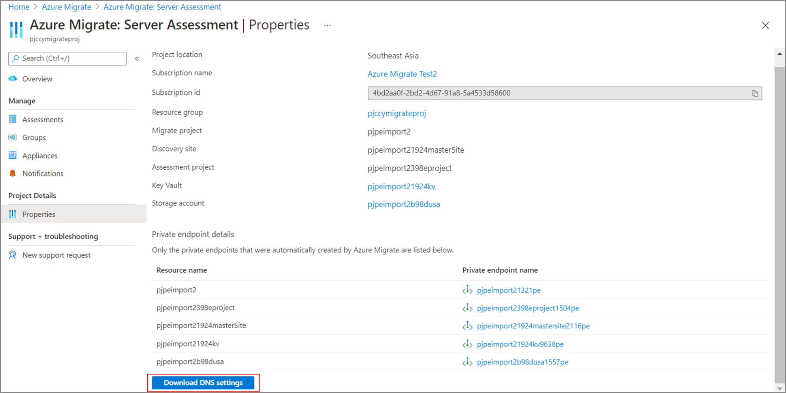
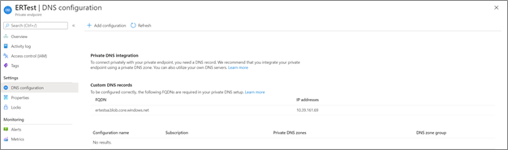
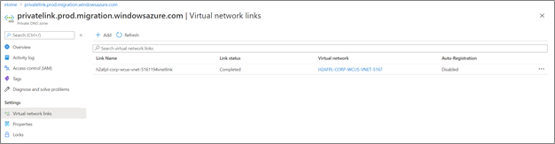
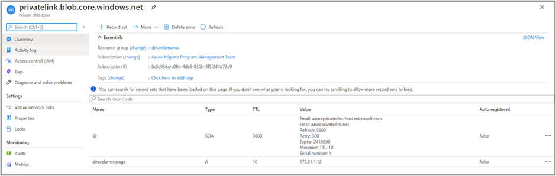
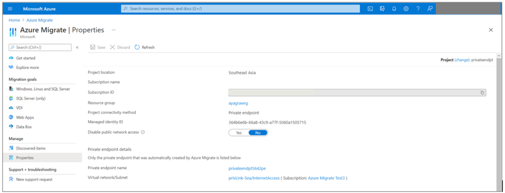
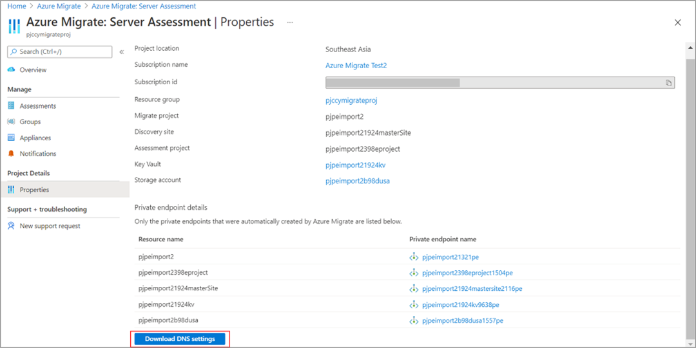
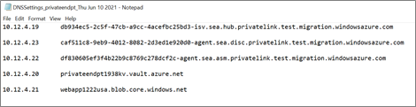
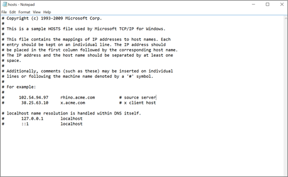
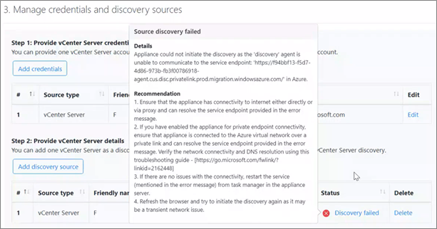

# Troubleshoot network connectivity
This article helps you troubleshoot network connectivity issues using Azure Migrate with private endpoints.

## Validate private endpoints configuration

Make sure the private endpoint is an approved state.  

1. Go to **Azure Migrate**: **Discovery and Assessment** and **Migration and modernization** properties page.

2. The properties page contains the list of private endpoints and private link FQDNs that were automatically created by Azure Migrate.  

3. Select the private endpoint you want to diagnose.  
   a. Validate that the connection state is Approved.           
   b. If the connection is in a Pending state, you need to get it  approved.                         
   c. You may also navigate to the private endpoint resource and review if the virtual network matches the Migrate project private endpoint virtual network.                                                        

      :::image type="content" source="./media/how-to-use-azure-migrate-with-private-endpoints/private-endpoint-connection.png" alt-text="Screenshot of View Private Endpoint connection.":::


## Validate the data flow through the private endpoints
Review the data flow metrics to verify the traffic flow through private endpoints. Select the private endpoint in the Azure Migrate: Server Assessment and Migration and modernization Properties page. This will redirect to the private endpoint overview section in Azure Private Link Center. In the left menu, select **Metrics** to view the _Data Bytes In_ and _Data Bytes Out_ information to view the traffic flow.

## Verify DNS resolution

The on-premises appliance (or replication provider) will access the Azure Migrate resources using their fully qualified private link domain names (FQDNs). You may require additional DNS settings to resolve the private IP address of the private endpoints from the source environment. [See this article](../private-link/private-endpoint-dns.md#on-premises-workloads-using-a-dns-forwarder) to understand the DNS configuration scenarios that can help troubleshoot any network connectivity issues.  

To validate the private link connection, perform a DNS resolution of the Azure Migrate resource endpoints (private link resource FQDNs) from the on-premises server hosting the Migrate appliance and ensure that it resolves to a private IP address. 

**To obtain the private endpoint details to verify DNS resolution:**

1. The private endpoint details and private link resource FQDNs' information is available in the Discovery and Assessment and Migration and modernization properties pages. Select **Download DNS settings** to view the list. Note, only the private endpoints that were automatically created by Azure Migrate are listed below. 

      

      [](./media/how-to-use-azure-migrate-with-private-endpoints/azure-migrate-server-migration-properties-expanded.png#lightbox) 

2. If you have created a private endpoint for the storage account(s) for replicating over a private network, you can obtain the private link FQDN and IP address as illustrated below. 

  - Go to the **Storage account** > **Networking** > **Private endpoint connections** and select the private endpoint created. 

      :::image type="content" source="./media/troubleshoot-network-connectivity/private-endpoint.png" alt-text="Screenshot of the Private Endpoint connections.":::

  - Go to **Settings** > **DNS configuration** to obtain the storage account FQDN and private IP address.    

      :::image type="content" source="./media/troubleshoot-network-connectivity/private-link-info.png" alt-text="Screenshot showing the Private Link F Q D N information.":::

An illustrative example for DNS resolution of the storage account private link FQDN.  

-  Enter ```nslookup <storage-account-name>_.blob.core.windows.net.```  Replace ```<storage-account-name>``` with the name of the storage account used for Azure Migrate.  

    You'll receive a message like this:  

   :::image type="content" source="./media/how-to-use-azure-migrate-with-private-endpoints/dns-resolution-example.png" alt-text="Screenshot showing a D N S resolution example.":::

-  A private IP address of 10.1.0.5 is returned for the storage account. This address belongs to the private endpoint virtual network subnet.   

You can verify the DNS resolution for other Azure Migrate artifacts using a similar approach.   

If the DNS resolution is incorrect, follow these steps:  

**Recommended**: Manually update your source environment DNS records by editing the DNS hosts file on your on-premises appliance with the private link resource FQDNs and their associated private IP addresses.
- If you use a custom DNS, review your custom DNS settings, and validate that the DNS configuration is correct. For guidance, see [private endpoint overview: DNS configuration](../private-link/private-endpoint-overview.md#dns-configuration).
- If you use Azure-provided DNS servers, refer to the below section for further troubleshooting.  

> [!Tip]
> For testing, you can manually update your source environment DNS records by editing the DNS hosts file on your on-premises appliance with the private link resource FQDNs and their associated private IP addresses. <br/>  


## Validate the Private DNS Zone   
If the DNS resolution is not working as described in the previous section, there might be an issue with your Private DNS Zone.  

### Confirm that the required Private DNS Zone resource exists  
By default, Azure Migrate also creates a private DNS zone corresponding to the *privatelink* subdomain for each resource type. The private DNS zone will be created in the same Azure resource group as the private endpoint resource group. The Azure resource group should contain private DNS zone resources with the following format:
-  privatelink.vaultcore.azure.net for the key vault
-  privatelink.blob.core.windows.net for the storage account
-  privatelink.siterecovery.windowsazure.com for the recovery services vault (for Hyper-V and agent-based replications)
-  privatelink.prod.migration.windowsazure.com - migrate project, assessment project, and discovery site.   

Azure Migrate automatically creates the private DNS zone (except for the cache/replication storage account selected by the user). You can locate the linked private DNS zone by navigating to the private endpoint page and selecting DNS configurations. Here, you should see the private DNS zone under the private DNS integration section.

[](./media/how-to-use-azure-migrate-with-private-endpoints/dns-configuration-expanded.png#lightbox)

If the DNS zone is not present (as shown below), [create a new Private DNS Zone resource.](../dns/private-dns-getstarted-portal.md)  

[](./media/how-to-use-azure-migrate-with-private-endpoints/create-dns-zone-expanded.png#lightbox)

### Confirm that the Private DNS Zone is linked to the virtual network  
The private DNS zone should be linked to the virtual network that contains the private endpoint for the DNS query to resolve the private IP address of the resource endpoint. If the private DNS zone is not linked to the correct Virtual Network, any DNS resolution from that virtual network will ignore the private DNS zone.   

Navigate to the private DNS zone resource in the Azure portal and select the virtual network links from the left menu. You should see the virtual networks linked.

[](./media/how-to-use-azure-migrate-with-private-endpoints/virtual-network-links-expanded.png#lightbox)

This will show a list of links, each with the name of a virtual network in your subscription. The virtual network that contains the Private Endpoint resource must be listed here. Else, [follow this article](../dns/private-dns-getstarted-portal.md#link-the-virtual-network) to link the private DNS zone to a virtual network.    

Once the private DNS zone is linked to the virtual network, DNS requests originating from the virtual network will look for DNS records in the private DNS zone. This is required for correct address resolution to the virtual network where the private endpoint was created.   

### Confirm that the private DNS zone contains the right A records

Go to the private DNS zone you want to troubleshoot. The Overview page shows all DNS records for that private DNS zone. Verify that a DNS A record exists for the resource. The value of the A record (the IP address) must be the resources’ private IP address. If you find the A record with the wrong IP address, you must remove the wrong IP address and add a new one. It's recommended that you remove the entire A record and add a new one, and do a DNS flush on the on-premises source appliance.   

An illustrative example for the storage account DNS A record in the private DNS zone:

      

An illustrative example for the Recovery Services vault microservices DNS A records in the private DNS zone:

   [](./media/how-to-use-azure-migrate-with-private-endpoints/rsv-a-records-expanded.png#lightbox)  

>[!Note]
> When you remove or modify an A record, the machine may still resolve to the old IP address because the TTL (Time To Live) value might not have expired yet.  

### Items that may affect private link connectivity  

This is a non-exhaustive list of items that can be found in advanced or complex scenarios:

-  Firewall settings, either the Azure Firewall connected to the Virtual network or a custom firewall solution deploying in the appliance machine.  
-  Network peering, which may impact which DNS servers are used and how traffic is routed.  
-  Custom gateway (NAT) solutions may impact how traffic is routed, including traffic from DNS queries.

For more information, review the [troubleshooting guide for Private Endpoint connectivity problems.](../private-link/troubleshoot-private-endpoint-connectivity.md)  

## Common issues while using Azure Migrate with private endpoints
In this section, we will list some of the commonly occurring issues and suggest do-it-yourself troubleshooting steps to remediate the problem.

### Appliance registration fails with the error ForbiddenToAccessKeyVault
Azure Key Vault create or update operation failed for <_KeyVaultName_> due to the error <_ErrorMessage_>

#### Possible causes:
This issue can occur if the Azure account being used to register the appliance doesn’t have the required permissions or the Azure Migrate appliance cannot access the Key Vault.

#### Remediation:

**Steps to troubleshoot Key Vault access issues:**
1. Make sure the Azure user account used to register the appliance has at least Contributor permissions on the subscription.
1. Ensure that the user trying to register the appliance has access to the Key Vault and has an access policy assigned in the Key Vault>Access Policy section. [Learn more](../key-vault/general/assign-access-policy-portal.md)
-  [Learn more](./migrate-appliance.md#appliance---vmware) about the required Azure roles and permissions.

**Steps to troubleshoot connectivity issues to the Key Vault:**
If you have enabled the appliance for private endpoint connectivity, use the following steps to troubleshoot network connectivity issues:
-  Ensure that the appliance is either hosted in the same virtual network or is connected to the target Azure virtual network (where the Key Vault private endpoint has been created) over a private link. The Key Vault private endpoint will be created in the virtual network selected during the project creation experience. You can verify the virtual network details in the **Azure Migrate > Properties** page.
     

-  Ensure that the appliance has network connectivity to the Key Vault over a private link. To validate the private link connectivity, perform a DNS resolution of the Key Vault resource endpoint from the on-premises server hosting the appliance and ensure that it resolves to a private IP address.
-  Go to **Azure Migrate: Discovery and assessment> Properties** to find the details of private endpoints for resources like the Key Vault created during the key generation step.  

        
-  Select **Download DNS settings** to download the DNS mappings.

        

-  Open the command line and run the following nslookup command to verify network connectivity to the Key Vault URL mentioned in the DNS settings file.   

    ```console
    nslookup <your-key-vault-name>.vault.azure.net
    ```

    If you run the ns lookup command to resolve the IP address of a key vault over a public endpoint, you will see a result that looks like this:

    ```console
    c:\ >nslookup <your-key-vault-name>.vault.azure.net

    Non-authoritative answer:
    Name:    
    Address:  (public IP address)
    Aliases:  <your-key-vault-name>.vault.azure.net
    ```

    If you run the ns lookup command to resolve the IP address of a key vault over a private endpoint, you will see a result that looks like this:

    ```console
    c:\ >nslookup your_vault_name.vault.azure.net

    Non-authoritative answer:
    Name:    
    Address:  10.12.4.20 (private IP address)
    Aliases:  <your-key-vault-name>.vault.azure.net
              <your-key-vault-name>.privatelink.vaultcore.azure.net
    ```

    The nslookup command should resolve to a private IP address as mentioned above. The private IP address should match the one listed in the DNS settings file.

If the DNS resolution is incorrect, follow these steps:

1. Manually update the source environment DNS records by editing the DNS hosts file on the on-premises appliance with the DNS mappings and the associated private IP addresses. This option is recommended for testing.

      

1. If you use a custom DNS server, review your custom DNS settings, and validate that the DNS configuration is correct. For guidance, see 
      [private endpoint overview: DNS configuration](../private-link/private-endpoint-overview.md#dns-configuration).

1. **Proxy server considerations**: If the appliance uses a proxy server for outbound connectivity, you may need to validate your network settings and configurations to ensure the private link URLs are reachable and can be routed as expected.

    - If the proxy server is for internet connectivity, you may need to add traffic forwarders or rules to bypass the proxy server for the private link FQDNs. [Learn more](./discover-and-assess-using-private-endpoints.md#set-up-prerequisites) on how to add proxy bypass rules.
    - Alternatively, if the proxy server is for all outbound traffic, make sure the proxy server can resolve the private link FQDNs to their respective private IP addresses. For a quick workaround, you can manually update the DNS records on the proxy server with the DNS mappings and the associated private IP addresses, as shown above. This option is recommended for testing.

1. If the issue still persists, [refer to this section](#validate-the-private-dns-zone) for further troubleshooting.

After you’ve verified the connectivity, retry the registration process.

### Start Discovery fails with the error AgentNotConnected
The appliance could not initiate discovery as the on-premises agent is unable to communicate to the Azure Migrate service endpoint: <_URLname_> in Azure.

     

#### Possible causes:
This issue can occur if the appliance is unable to reach the service endpoint(s) mentioned in the error message.

#### Remediation:
Ensure that the appliance has connectivity either directly or via proxy and can resolve the service endpoint provided in the error message.  

If you have enabled the appliance for private endpoint connectivity, ensure that the appliance is connected to the Azure virtual network over a private link and can resolve the service endpoint(s) provided in the error message.

**Steps to troubleshoot private link connectivity issues to Azure Migrate service endpoints:**

If you have enabled the appliance for private endpoint connectivity, use the following steps to troubleshoot network connectivity issues:

-  Ensure that the appliance is either hosted in the same virtual network or is connected to the target Azure virtual network (where the private endpoints have been created) over a private link. Private endpoints for the Azure Migrate services are created in the virtual network selected during the project creation experience. You can verify the virtual network details in the **Azure Migrate > Properties** page.

         

-  Ensure that the appliance has network connectivity to the service endpoint URLs and other URLs, mentioned in the error message, over a private link connection. To validate private link connectivity, perform a DNS resolution of the URLs from the on-premises server hosting the appliance and ensure that it resolves to private IP addresses.
-  Go to **Azure Migrate: Discovery and assessment> Properties** to find the details of private endpoints for the service endpoints created during the key generation step. 

        

- Select **Download DNS settings** to download the DNS mappings.

      

|**DNS mappings containing Private endpoint URLs**  | **Details** |
|--- | ---|
|*.disc.privatelink.prod.migration.windowsazure.com | Azure Migrate Discovery service endpoint
|*.asm.privatelink.prod.migration.windowsazure.com  | Azure Migrate Assessment service endpoint  
|*.hub.privatelink.prod.migration.windowsazure.com  | Azure Migrate hub endpoint to receive data from other Microsoft or external [independent software vendor (ISV)](./migrate-services-overview.md#isv-integration) offerings
|*.privatelink.siterecovery.windowsazure.com | Azure Site Recovery service endpoint to orchestrate replications
|*.vault.azure.net | Key Vault endpoint
|*.blob.core.windows.net | Storage account endpoint for dependency and performance data  

In addition to the URLs above, the appliance needs access to the following URLs over Internet, directly or via proxy.

| **Other public cloud URLs <br> (Public endpoint URLs)** | **Details** |
|--- | ---|
|*.portal.azure.com | Navigate to the Azure portal
|*.windows.net <br/> *.msftauth.net <br/> *.msauth.net <br/> *.microsoft.com <br/> *.live.com <br/> *.office.com <br/> *.microsoftonline.com <br/> *.microsoftonline-p.com <br/> | Used for access control and identity management by Azure Active Directory
|management.azure.com | For triggering Azure Resource Manager deployments
|*.services.visualstudio.com (optional) | Upload appliance logs used for internal monitoring.
|aka.ms/* (optional) | Allow access to *also know as* links; used to download and install the latest updates for appliance services
|download.microsoft.com/download | Allow downloads from Microsoft download center    

-  Open the command line and run the following nslookup command to verify privatelink connectivity to the URLs listed in the DNS settings file. Repeat this step for all URLs in the DNS settings file.

    _**Illustration**: verifying private link connectivity to the discovery service endpoint_

    ```console
    nslookup 04b8c9c73f3d477e966c8d00f352889c-agent.cus.disc.privatelink.prod.migration.windowsazure.com
    ```
    If the request can reach the discovery service endpoint over a private endpoint, you will see a result that looks like this:

    ```console
    nslookup 04b8c9c73f3d477e966c8d00f352889c-agent.cus.disc.privatelink.prod.migration.windowsazure.com

    Non-authoritative answer:
    Name:    
    Address:  10.12.4.23 (private IP address)
    Aliases:  04b8c9c73f3d477e966c8d00f352889c-agent.cus.disc.privatelink.prod.migration.windowsazure.com
              prod.cus.discoverysrv.windowsazure.com
    ```

    The nslookup command should resolve to a private IP address as mentioned above. The private IP address should match the one listed in the DNS settings file.

If the DNS resolution is incorrect, follow these steps:

1. Manually update the source environment DNS records by editing the DNS hosts file on the on-premises appliance with the DNS mappings and the associated private IP addresses. This option is recommended for testing.

      

1. If you use a custom DNS server, review your custom DNS settings, and validate that the DNS configuration is correct. For guidance, see [private endpoint overview: DNS configuration](../private-link/private-endpoint-overview.md#dns-configuration).

1. **Proxy server considerations**: If the appliance uses a proxy server for outbound connectivity, you may need to validate your network settings and configurations to ensure the private link URLs are reachable and can be routed as expected.

    - If the proxy server is for internet connectivity, you may need to add traffic forwarders or rules to bypass the proxy server for the private link FQDNs. [Learn more](./discover-and-assess-using-private-endpoints.md#set-up-prerequisites) on how to add proxy bypass rules.
    - Alternatively, if the proxy server is for all outbound traffic, make sure the proxy server can resolve the private link FQDNs to their respective private IP addresses. For a quick workaround, you can manually update the DNS records on the proxy server with the DNS mappings and the associated private IP addresses, as shown above. This option is recommended for testing.

1. If the issue still persists, [refer to this section](#validate-the-private-dns-zone) for further troubleshooting.

After you’ve verified the connectivity, retry the discovery process.

### Import/export request fails with the error "403: This request is not authorized to perform this operation" 

The export/import/download report request fails with the error *"403: This request is not authorized to perform this operation"* for projects with private endpoint connectivity.

#### Possible causes: 
This error may occur if the export/import/download request was not initiated from an authorized network. This can happen if the import/export/download request was initiated from a client that is not connected to the Azure Migrate service (Azure virtual network) over a private network. 

#### Remediation
**Option 1** *(recommended)*:
  
To resolve this error, retry the import/export/download operation from a client residing in a virtual network that is connected to Azure over a private link. You can open the Azure portal in your on-premises network or your appliance VM and retry the operation. 

**Option 2**:

The import/export/download request makes a connection to a storage account for uploading/downloading reports. You can also change the networking settings of the storage account used for the import/export/download operation and allow access to the storage account via other networks (public networks).  

To set up the storage account for public endpoint connectivity,

1. **Locate the storage account**: The storage account name is available on the Azure Migrate: Discovery and Assessment properties page. The storage account name will have the suffix *usa*. 

      :::image type="content" source="./media/how-to-use-azure-migrate-with-private-endpoints/server-assessment-properties.png" alt-text="Snapshot of download D N S settings."::: 

2. Navigate to the storage account and edit the storage account networking properties to allow access from all/other networks. 

    :::image type="content" source="./media/how-to-use-azure-migrate-with-private-endpoints/networking-firewall-virtual-networks.png" alt-text="Snapshot of storage account networking properties.":::

3. Alternatively, you can limit the access to selected networks and add the public IP address of the client from where you're trying to access the Azure portal.  

      :::image type="content" source="./media/how-to-use-azure-migrate-with-private-endpoints/networking-firewall.png" alt-text="Snapshot of add the public I P address of the client.":::

### Using private endpoints for replication requires the Azure Migrate appliance services to be running on the following versions

#### Possible causes:
This issue can occur if the services running on the appliance are not running on their latest version. The DRA agent orchestrates server replication, and coordinates communication between replicated servers and Azure. The gateway agent sends replicated data to Azure.

>[!Note]
> This error is only applicable for agentless VMware VM migrations. 

#### Remediation:

1. Validate that the services running on the appliance are updated to the latest versions.

    To do so, launch the appliance configuration manager from your appliance server and select **View appliance services** from the **Setup prerequisites** panel. The appliance and its components are automatically updated. If not, follow the instructions to update the appliance services manually. 

    :::image type="content" source="./media/troubleshoot-network-connectivity/view-appliance-services.png" alt-text="Snapshot of View appliance services.":::

### Failed to save configuration: 504 gateway timeout

#### Possible causes:
This issue can occur if the Azure Migrate appliance cannot reach the service endpoint provided in the error message.

#### Remediation:

To validate the private link connection, perform a DNS resolution of the Azure Migrate service endpoints (private link resource FQDNs) from the on-premises server hosting the Migrate appliance and ensure that they resolve to private IP addresses.

**To obtain the private endpoint details to verify DNS resolution:**

The private endpoint details and private link resource FQDN information are available in the Discovery and Assessment and Migration and modernization properties pages. Select **Download DNS settings** on both the properties pages to view the full list. 

Next, refer to [this guidance](#verify-dns-resolution) to verify the DNS resolution.
