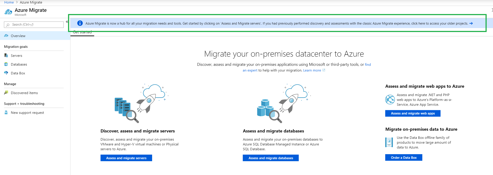
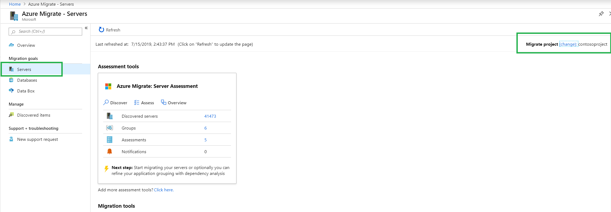
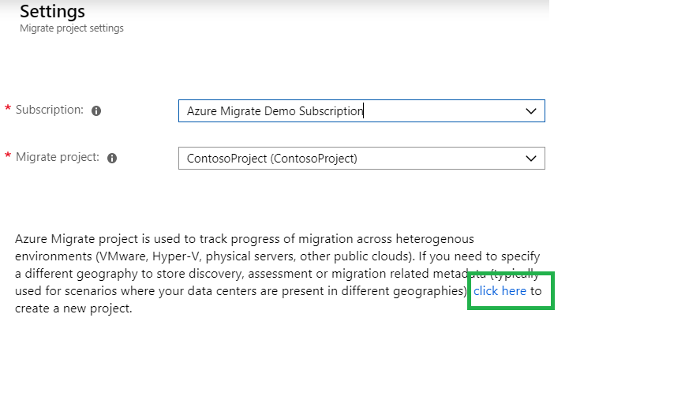
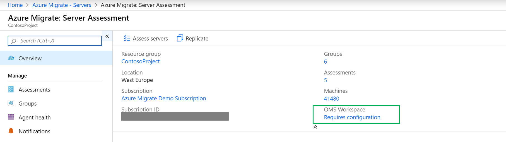

# Troubleshoot Azure Migrate

[Azure Migrate](migrate-services-overview.md) provides a hub of tools for assessment and migration, as well as third-party independent software vendor (ISV) offerings. This article helps you troubleshoot errors with Azure Migrate, Azure Migrate Server Assessment, and Azure Migrate Server Migration.

## Azure Migrate project issues

### I can't find my existing Azure Migrate project.

There are [two versions](https://docs.microsoft.com/azure/migrate/migrate-services-overview#azure-migrate-versions) of Azure Migrate. Depending on the version in which you created the project, use one of the following methods:

* If you're looking for a project created with the previous version (old experience) of Azure Migrate,  follow these steps to find the project:

    1. Go to the [Azure portal](https://portal.azure.com), and search for **Azure Migrate**.
    2. On the Azure Migrate dashboard, you'll see a banner that mentions accessing older projects. You'll see this banner only if you have created a project with the old experience. Select the banner.

       

    3. You'll now see the list of existing projects that were created with the previous version of Azure Migrate.

* If you're looking for a project created with the current version (new experience), follow these steps to find the project:

    1. Go to the [Azure portal](https://portal.azure.com), and search for **Azure Migrate**.
    2. On the Azure Migrate dashboard, go to the **Servers** page in the left pane, and select **change** in the upper-right corner.

       

    3. Select the appropriate subscription and Azure Migrate project.

### How do I create a second Azure Migrate project?

Follow these steps to create a new Azure Migrate project:

1. Go to the [Azure portal](https://portal.azure.com), and search for **Azure Migrate**.
2. On the Azure Migrate dashboard, go to the **Servers** page in the left pane, and select **change** in the upper-right corner.

   

3. To create a new project, select **click here**.

   

### Which Azure geographies does Azure Migrate support?

See the lists for [VMware](https://docs.microsoft.com/azure/migrate/migrate-support-matrix-vmware#azure-migrate-projects) and for [Hyper-V](https://docs.microsoft.com/azure/migrate/migrate-support-matrix-hyper-v#azure-migrate-projects).

### How do I delete Azure Migrate projects and associated Log Analytics workspaces?

When you delete an Azure Migrate project, the migration project *and* the metadata about discovered machines are deleted. However, if you have attached a Log Analytics workspace to the Server Assessment tool, the Log Analytics workspace isn't automatically deleted. (The same Log Analytics workspace can be used for multiple use cases.) If you want to also delete the Log Analytics workspace, you must do that manually:

1. Browse to the Log Analytics workspace attached to the project.
     * If you haven't deleted the migration project yet, you can find the link to the workspace from the Server Assessment overview page in the Essentials section.

       

     * If you already deleted the migration project, select **Resource Groups** in the left pane of the Azure portal. Go to the resource group in which the workspace was created and then browse to it.
2. Follow the instructions in [Delete an Azure Log Analytics workspace with the Azure portal](https://docs.microsoft.com/azure/azure-monitor/platform/delete-workspace).

### Migration project creation failed with a "Requests must contain user identity headers" error.

This issue can occur for users who don't have access to the Azure Active Directory (Azure AD) tenant of the organization. When a user is added to an Azure AD tenant for the first time, the user receives an email invitation to join the tenant. Users must accept the invitation to get successfully added to the tenant. If you can't see the email, contact a user who already has access to the tenant and ask them to resend the invitation to you by using the steps specified in [Resend invitations to guest users](https://docs.microsoft.com/azure/active-directory/b2b/add-users-administrator#resend-invitations-to-guest-users).

After the invitation email is received, you must open the email and select the link to accept the invitation. Then, you must sign out of the Azure portal and sign in again. (Refreshing the browser will not work.) You can then start creating the migration project.

## Appliance issues

### Deployment of an Azure Migrate appliance for VMware failed with a "The provided manifest file is invalid: Invalid OVF manifest entry" error.

1. Verify that the Azure Migrate appliance OVA file is downloaded correctly by checking its hash value. For guidance, see [Prepare VMware VMs for assessment and migration to Azure](https://docs.microsoft.com/azure/migrate/tutorial-assessment-vmware). If the hash value doesn't match, download the OVA file again and retry the deployment.
2. If deployment still fails and if you're using the VMware vSphere client to deploy the OVF file, try deploying it through the vSphere web client. If deployment still fails, try using a different web browser.
3. If you're using the vSphere web client and trying to deploy it on vCenter Server 6.5 or 6.7, try to deploy the OVA directly on the ESXi host by following these steps:
   - Connect to the ESXi host directly (instead of vCenter Server) by using the web client (https://<*host IP Address*>/ui).
   - Go to **Home** > **Inventory**.
   - Select **File** > **Deploy OVF template**. Browse to the OVA and complete the deployment.
4. If deployment still fails, contact Azure Migrate support.

### The appliance can't connect to the internet.

This behavior can occur when the machine you're using is behind a proxy. Make sure you provide the authorization credentials if the proxy needs them.
If you're using any URL-based firewall proxy to control outbound connectivity, be sure to add these required URLs to an allow list:

- [Server assessment for VMware](https://docs.microsoft.com/azure/migrate/migrate-support-matrix-vmware#assessment-url-access-requirements)
- [Server assessment for Hyper-V](https://docs.microsoft.com/azure/migrate/migrate-support-matrix-hyper-v#assessment-appliance-url-access)
- [Server migration for VMware (agentless)](https://docs.microsoft.com/azure/migrate/migrate-support-matrix-vmware#agentless-migration-url-access-requirements)
- [Server migration for VMware (agent-based)](https://docs.microsoft.com/azure/migrate/migrate-support-matrix-vmware#replication-appliance-url-access)
- [Server migration for Hyper-V](https://docs.microsoft.com/azure/migrate/migrate-support-matrix-hyper-v#migration-hyper-v-host-url-access)

If you're using an intercepting proxy to connect to the internet, you must import the proxy certificate onto the appliance VM. You can import the proxy certificate by following the steps in [Azure Migrate appliance](https://docs.microsoft.com/azure/migrate/concepts-collector).

### Error 802: Date and time synchronization error.

The server clock might be out of synchronization with the current time by more than five minutes. Change the clock time on the collector VM to match the current time, as follows:

1. Open an admin command prompt on the VM.
2. To check the time zone, run **w32tm /tz**.
3. To synchronize the time, run **w32tm /resync**.

###  Connection failed. Error: UnableToConnectToServer.

You might be unable to connect to vCenter Server *Servername*.com:9443. The error details indicate that there's no endpoint listening at https://*servername*.com:9443/sdk that could accept the message.

In this situation, check whether you're running the latest version of the collector appliance. If you're not, upgrade the appliance to the [latest version](https://docs.microsoft.com/azure/migrate/concepts-collector).

If the issue still occurs in the latest version, the collector machine might be unable to resolve the specified vCenter Server name, or the specified port might be wrong. By default, if the port is not specified, the collector will try to connect to port number 443.

1. Ping *Servername*.com from the collector machine.
2. If step 1 fails, try to connect to the vCenter server by using the IP address.
3. Identify the correct port number to connect to the vCenter.
4. Verify that the vCenter server is up and running.

### The appliance might not be registered successfully to the Azure Migrate project (Error ID: 60052).

This error occurs if the Azure account used to register the appliance has insufficient permissions. Make sure that the Azure user account used to register the appliance has at least Contributor permissions on the subscription. [Learn more](https://docs.microsoft.com/azure/migrate/migrate-appliance#appliance-deployment-requirements) about the required Azure roles and permissions.

### The appliance might not be registered successfully to the Azure Migrate project (Error ID: 60039).

The Azure Migrate project selected to register the appliance might not be found. In this situation, registration fails. Go to the Azure portal and check whether the project exists in your resource group. If the project doesn't exist, create a new Azure Migrate project in your resource group and register the appliance again. [Learn more](https://docs.microsoft.com/azure/migrate/how-to-add-tool-first-time#create-a-project-and-add-a-tool) about creating a new Azure Migrate project.

### An Azure Key Vault management operation failed (Error ID: 60030, 60031).

Make sure the Azure user account used to register the appliance has at least Contributor permissions on the subscription. Also, make sure the account has access to the key vault specified in the error message, and then retry the operation. If the issue persists, contact Microsoft support. [Learn more](https://docs.microsoft.com/azure/migrate/migrate-appliance#appliance-deployment-requirements) about the required Azure roles and permissions.

### Discovery couldn't be initiated because of an error. The operation failed for the specified list of hosts or clusters (Error ID: 60028).

Discovery couldn't be started on the hosts listed in the error because of a problem in accessing or retrieving VM information. The rest of the hosts were successfully added. Add the hosts listed in the error again by using the **Add host** option. If there's a validation error, review the remediation guidance to fix the errors, and then try the **Save and start discovery** option again.

### An Azure AD operation failed. The error occurred while creating or updating the Azure AD application (Error ID: 60025).

This error is encountered when the Azure user account used to initiate the discovery is different from the account used to register the appliance. You can do one of the following:
1. Ensure that the user account initiating the discovery is same as the one used to register the appliance.
1. Provide AAD Application access permissions to the other user account for which the discovery operation is failing.
1. Delete the Resource Group previously created for Azure Migrate project and create another Resource Group to start again.

[Learn more](https://docs.microsoft.com/azure/migrate/migrate-appliance#appliance-deployment-requirements) about AAD application permissions.

## Discovery issues

### I started discovery but don't see the discovered VMs on the Azure portal. The **Server Assessment** and **Server Migration** tiles show a status of "Discovery in progress."
After you start discovery from the appliance, allow some time for the discovered machines to show up on the Azure portal. It takes around 15 minutes for a VMware discovery, and around 2 minutes per added host for a Hyper-V discovery. If you continue to see "Discovery in progress" even after these waiting periods, select **Refresh** on the **Servers** tab. This should show the count of the discovered servers in the Server Assessment and Server Migration tiles.

### I'm using an appliance that continuously discovers my on-premises environment, but the VMs that are deleted in my on-premises environment are still shown in the portal.

It takes up to 30 minutes for the discovery data gathered by the appliance to be reflected in the portal. If you don't see up-to-date information even after 30 minutes, refresh the data by following these steps:

1. Go to **Servers** > **Azure Migrate Server Assessment**, and select **Overview**.
2. Under **Manage**, select **Agent Health**
3. Select **Refresh agent**. You'll see this option below the list of agents.
4. Wait for the refresh operation to complete. You should now see up-to-date information on your VMs.

### I don't see the latest information on the on-premise VMs on the portal.

It takes up to 30 minutes for the discovery data gathered by the appliance to be reflected on the portal. If you don't see up-to-date information even after 30 minutes, refresh the data by following these steps:

1. Go to **Servers** > **Azure Migrate Server Assessment**, and select **Overview**.
2. Under **Manage**, select **Agent Health**
3. Select **Refresh agent**. You'll see this option below the list of agents.
4. Wait for the refresh operation to complete. You should now see up-to-date information on your VMs.

### Can't connect to a host or cluster because the server name can't be resolved. WinRM error code: 0x803381B9 (Error ID: 50004).
This error occurs if the Azure DNS service for the appliance can't resolve the cluster or host name you provided. If you see this error on the cluster, try providing the fully qualified domain name (FQDN) of the cluster.

You might also see this error for hosts in a cluster. In this case, the appliance can connect to the cluster, but the cluster returns host names that aren't FQDNs.

To resolve this error, update the hosts file on the appliance by adding a mapping of the IP address and host names:
1. Open Notepad as administrator. Then, open the C:\Windows\System32\Drivers\etc\hosts file.
2. Add the IP address and host name in a row. Repeat for each host or cluster where you see this error.
3. Save and close the hosts file.
4. You can check whether the appliance can connect to the hosts by using the appliance management app. After 30 minutes, you should be able to see the latest information for these hosts on the Azure portal.

## Assessment issues

### Azure readiness issues

Issue | Remediation
--- | ---
Unsupported boot type | Azure doesn't support VMs with an EFI boot type. We recommend that you convert the boot type to BIOS before you run a migration.   You can use Azure Migrate Server Migration to handle the migration of such VMs. It will convert the boot type of the VM to BIOS during the migration.
Conditionally supported Windows OS | The OS has passed its end-of-support date and needs a Custom Support Agreement (CSA) for [support in Azure](https://aka.ms/WSosstatement). Consider upgrading the OS before you migrate to Azure.
Unsupported Windows OS | Azure supports only [selected Windows OS versions](https://aka.ms/WSosstatement). Consider upgrading the OS of the machine before you migrate to Azure.
Conditionally endorsed Linux OS | Azure endorses only [selected Linux OS versions](../virtual-machines/linux/endorsed-distros.md). Consider upgrading the OS of the machine before you migrate to Azure.
Unendorsed Linux OS | The machine might start in Azure, but Azure provides no OS support. Consider upgrading the OS to an [endorsed Linux version](../virtual-machines/linux/endorsed-distros.md) before you migrate to Azure.
Unknown operating system | The operating system of the VM was specified as "Other" in vCenter Server. This behavior blocks Azure Migrate from verifying the Azure readiness of the VM. Make sure the OS of the machine is [supported](https://aka.ms/azureoslist) by Azure before you migrate the machine.
Unsupported OS bitness | VMs with a 32-bit OS might boot in Azure, but we recommended that you upgrade the OS of the VM to 64-bit before you migrate to Azure.
Requires a Microsoft Visual Studio subscription | The machine is running a Windows client OS, which is supported only through a Visual Studio subscription.
VM not found for the required storage performance | The storage performance (input/output operations per second [IOPS] and throughput) required for the machine exceeds Azure VM support. Reduce storage requirements for the machine before migration.
VM not found for the required network performance | The network performance (in/out) required for the machine exceeds Azure VM support. Reduce the networking requirements for the machine.
VM not found in the specified location | Use a different target location before migration.
One or more unsuitable disks | One or more disks attached to the VM don't meet Azure requirements. Azure Migrate: Server Assessment currently does not support Ultra SSD disks and assesses the disks based on the disk limits for premium managed disks (32 TB).  For each disk attached to the VM, make sure that the size of the disk is < 64 TB (supported by Ultra SSD disks), if not, reduce the disk size before you migrate to Azure or use multiple disks in Azure and [stripe them together](https://docs.microsoft.com/azure/virtual-machines/windows/premium-storage-performance#disk-striping) to get higher storage limits. Make sure that the performance (IOPS and throughput) needed by each disk is supported by Azure [managed virtual machine disks](https://docs.microsoft.com/azure/azure-subscription-service-limits#storage-limits).
One or more unsuitable network adapters. | Remove unused network adapters from the machine before migration.
Disk count exceeds limit | Remove unused disks from the machine before migration.
Disk size exceeds limit | Azure Migrate: Server Assessment currently does not support Ultra SSD disks and assesses the disks based on premium disk limits (32 TB). However, Azure supports disks with up to 64 TB size (supported by Ultra SSD disks). Shrink disks to less than 64 TB before migration or use multiple disks in Azure and [stripe them together](https://docs.microsoft.com/azure/virtual-machines/windows/premium-storage-performance#disk-striping) to get higher storage limits.
Disk unavailable in the specified location | Make sure the disk is in your target location before you migrate.
Disk unavailable for the specified redundancy | The disk should use the redundancy storage type defined in the assessment settings (LRS by default).
Could not determine disk suitability because of an internal error | Try creating a new assessment for the group.
VM with required cores and memory not found | Azure couldn't find a suitable VM type. Reduce the memory and number of cores of the on-premises machine before you migrate.
Could not determine VM suitability because of an internal error | Try creating a new assessment for the group.
Could not determine suitability for one or more disks because of an internal error | Try creating a new assessment for the group.
Could not determine suitability for one or more network adapters because of an internal error | Try creating a new assessment for the group.

### I can't specify Enterprise Agreement (EA) as an Azure offer in the assessment properties.
Azure Migrate Server Assessment doesn't currently support Enterprise Agreement (EA)-based pricing. To work around this limitation, use **Pay-As-You-Go** as the Azure offer and use the **Discount** property to specify any custom discount that you receive. [Learn more about how you can customize an assessment](https://aka.ms/migrate/selfhelp/eapricing).

### Why does Server Assessment mark my Linux VMs "Conditionally ready"?
There's a known gap in Server Assessment that prevents it from detecting the minor version of the Linux OS installed on the on-premises VMs (for example, for RHEL 6.10, currently Server Assessment detects only RHEL 6 as the OS version). Because Azure endorses only specific versions of Linux, the Linux VMs are currently marked as conditionally ready in Server Assessment. You can determine whether the Linux OS running on the on-premises VM is endorsed in Azure by reviewing the [Azure Linux support documentation.](https://aka.ms/migrate/selfhost/azureendorseddistros). After you've verified the endorsed distribution, you can ignore this warning.

### Why does the VM SKU recommended by Server Assessment have more cores and more memory than what's allocated on-premises?
The VM SKU recommendation in Server Assessment depends on the assessment properties. You can create two kinds of assessments in Server Assessment: *Performance-based* and *As on-premises*. For performance-based assessments, Server Assessment considers the utilization data of the on-premises VMs (CPU, memory, disk, and network utilization) to determine the right target VM SKU for your on-premises VMs. Additionally, for performance-based sizing, the comfort factor is considered in determining effective utilization. For on-premises sizing, performance data is not considered, and a target SKU is recommended based on what is allocated on-premises.

For example, let's say there's an on-premises VM with 4 cores and 8 GB of memory with 50% CPU utilization and 50% memory utilization, and a comfort factor of 1.3 is specified in the assessment. If the sizing criteria of the assessment is **As on-premises**, an Azure VM SKU with 4 cores and 8 gigabytes (GB) of memory is recommended.

However, assume the sizing criteria is performance-based. Based on effective CPU and memory utilization (50% of 4 cores * 1.3 = 2.6 cores and 50% of 8-GB memory * 1.3 = 5.3-GB memory), the cheapest VM SKU of four cores (nearest supported core count) and 8 GB of memory (nearest supported memory size) would be recommended. [Learn more about how Server Assessment performs sizing.](https://docs.microsoft.com/azure/migrate/concepts-assessment-calculation#sizing).

### Why is the disk SKU recommended by Server Assessment bigger than what's allocated on-premises?
Disk sizing in Server Assessment depends on two assessment properties: sizing criteria and storage type. If the sizing criteria is **Performance-based** and the storage type is set to **Automatic**, the IOPS and throughput values of the disk are considered to identify the target disk type (Standard HDD, Standard SSD, or Premium disks). A disk SKU from the disk type is then recommended, and this recommendation considers the size requirements of the on-premises disk. If the sizing criteria is **Performance-based**, and the storage type is **Premium**, a premium disk SKU in Azure is recommended based on the IOPS, throughput, and size requirements of the on-premises disk. The same logic is used to perform disk sizing when the sizing criteria is **As on-premises** and the storage type is **Standard HDD**, **Standard SSD**, or **Premium**.

For example, if you have an on-premises disk with 32 GB of memory, but the aggregated read and write IOPS for the disk is 800 IOPS, Server Assessment will recommend a premium disk type (because of the higher IOPS requirements) and then recommend a disk SKU that can support the required IOPS and size. The nearest match in this example would be P15 (256 GB, 1100 IOPS). Even though the size required by the on-premises disk was 32 GB, Server Assessment recommends a larger disk because of the high IOPS requirement of the on-premises disk.

### Why does my assessment report indicate "PercentageOfCoresUtilizedMissing" or "PercentageOfMemoryUtilizedMissing" for some VMs?
These issues are reported when the Azure Migrate appliance can't collect performance data for the on-premises VMs. This behavior can happen if the VMs are turned off for the duration when you're creating the assessment (last one day/one week/one month). The appliance can't collect performance data for a VM when it's turned off. If only the memory counters are missing and you're trying to assess Hyper-V VMs, check whether you have dynamic memory enabled on these VMs. There's a known issue in which an Azure Migrate appliance can't collect memory utilization data for VMs that don't have dynamic memory enabled. This issue affects only Hyper-V VMs, not VMware VMs. If any of the performance counters are missing, Azure Migrate Server Assessment falls back to the allocated cores and memory, and it recommends a corresponding VM size.

### Is the OS license cost of the VM included in the compute cost estimated by Server Assessment?
Server Assessment currently considers the OS license cost only for Windows machines. OS license costs for Linux machines aren't currently considered.

### What impact do performance history and percentile utilization have on the size recommendations?
These properties apply only to performance-based sizing. Server Assessment continuously collects performance data of on-premises machines and uses it to recommend the VM SKU and disk SKU in Azure. This performance data is collected by Server Assessment as follows:
- The Azure Migrate appliance continuously profiles the on-premises environment to gather real-time utilization data every 20 seconds for VMware VMs and every 30 seconds for Hyper-V VMs.
- The appliance rolls up the 20-second and 30-second samples to create a single data point for every 10 minutes. To create the single data point, the appliance selects the peak value from all the 20-second and 30-second samples, and then sends it to Azure.
- When you create an assessment in Server Assessment, based on the performance duration and performance history percentile value, the representative utilization value is identified. For example, if the performance history is one week and percentile utilization is 95th, Azure Migrate sorts all the 10-minute sample points for the last one week in ascending order and then selects the 95th percentile as the representative value.
The 95th percentile value makes sure that you ignore any outliers, which might be included if you pick the 99th percentile. If you want to pick the peak usage for the period and don't want to miss any outliers, you should select the 99th percentile for percentile utilization.

## Dependency visualization issues

### I can't find the dependency visualization functionality for Azure Government projects.

Azure Migrate depends on Service Map for the dependency visualization functionality. Because Service Map is currently unavailable in Azure Government, this functionality is not available in Azure Government.

### I installed the Microsoft Monitoring Agent (MMA) and the dependency agent on my on-premises VMs, but the dependencies are now showing up in the Azure Migrate portal.

After you've installed the agents, Azure Migrate typically takes 15-30 minutes to display the dependencies in the portal. If you've waited for more than 30 minutes, make sure that MMA can talk to the OMS workspace by following these steps.

For Windows VM:
1. Go to Control Panel and start Microsoft Monitoring Agent.
2. On the **Azure Log Analytics (OMS)** tab in the **Microsoft Monitoring Agent properties** dialog box, make sure that the **Status** for the workspace is green.
3. If the status is not green, try removing the workspace and adding it again to MMA.

      

For Linux VM, make sure that the installation commands for MMA and dependency agent succeeded.

### What operating systems does MMA support?

 [Here's a list of Windows operating systems supported by MMA](https://docs.microsoft.com/azure/log-analytics/log-analytics-concept-hybrid#supported-windows-operating-systems).
And [here's a list of Linux operating systems supported by MMA](https://docs.microsoft.com/azure/log-analytics/log-analytics-concept-hybrid#supported-linux-operating-systems).

### What operating systems does the dependency agent support?

[Here's a list of Windows operating systems supported by the dependency agent](https://docs.microsoft.com/azure/monitoring/monitoring-service-map-configure#supported-windows-operating-systems). And [here's a list of Linux operating systems supported by the dependency agent](https://docs.microsoft.com/azure/monitoring/monitoring-service-map-configure#supported-linux-operating-systems).

### I can't visualize dependencies in Azure Migrate for more than a one-hour duration.
In Azure Migrate, you can visualize dependencies for up to a one-hour duration. Although Azure Migrate allows you to go back to a particular date in the last month, the maximum duration for which you can visualize the dependencies is one hour.

For example, you can use the time duration functionality in the dependency map to view dependencies for yesterday, but you can view them for only a one-hour period. However, you can use Azure Monitor logs to [query the dependency data](https://docs.microsoft.com/azure/migrate/how-to-create-group-machine-dependencies) over a longer duration.

### I can't visualize dependencies for groups that have more than 10 VMs.
You can [visualize dependencies for groups](https://docs.microsoft.com/azure/migrate/how-to-create-group-dependencies) that have up to 10 VMs, if you have a group with more than 10 VMs, we recommend that you split the group into smaller groups and visualize the dependencies.

### I installed agents and used the dependency visualization to create groups. Now, post-failover, the machines show "Install agent" action instead of "View dependencies."
* After a planned or unplanned failover, on-premises machines are turned off and equivalent machines are spun up in Azure. These machines acquire a different MAC address. They might acquire a different IP address based on whether or not the user chose to retain an on-premises IP address.

  If both MAC and IP addresses differ, Azure Migrate doesn't associate the on-premises machines with any Service Map dependency data. Instead, it asks the user to install agents instead of viewing dependencies.
* Post-test failover, the on-premises machines remain turned on as expected. Equivalent machines spun up in Azure acquire different MAC address and might acquire different IP addresses. Unless the user blocks outgoing Azure Monitor log traffic from these machines, Azure Migrate doesn't associate the on-premises machines with any Service Map dependency data and asks users to install agents instead of viewing dependencies.

## Collect Azure portal logs

**How do I collect Azure portal network traffic logs?**

1. Open the browser, go [to the portal](https://portal.azure.com), and sign in.
2. Press F12 to start Developer Tools. If needed, clear the  **Clear entries on navigation** setting.
3. Select the **Network** tab, and start capturing network traffic:
   - In Chrome, select **Preserve log**. The recording should start automatically. A red circle indicates that traffic is being captured. If the red circle doesn't appear, select the black circle to start.
   - In Microsoft Edge and Internet Explorer, recording should start automatically. If it doesn't, select the green play button.
4. Try to reproduce the error.
5. After you've encountered the error while recording, stop recording, and save a copy of the recorded activity:
   - In Chrome, right-click and select **Save as HAR with content**. This action compresses and exports the logs as a .har file.
   - In Microsoft Edge or Internet Explorer, select the **Export captured traffic** option. This action compresses and exports the log.
6. Select the **Console** tab to check for any warnings or errors. To save the console log:
   - In Chrome, right-click anywhere in the console log. Select **Save as**, to export, and zip the log.
   - In Microsoft Edge or Internet Explorer, right-click the errors and select **Copy all**.
7. Close Developer Tools.
