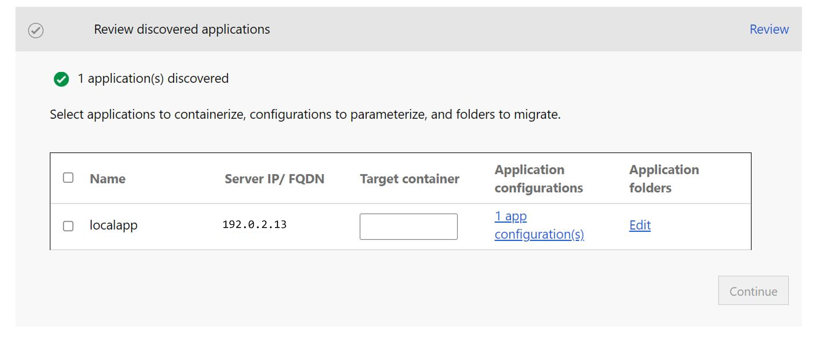

# ASP.NET app containerization and migration to Azure Kubernetes Service

In this article, you'll learn how to containerize ASP.NET applications and migrate them to [Azure Kubernetes Service (AKS)](https://azure.microsoft.com/services/kubernetes-service/) using the Azure Migrate: App Containerization tool. The containerization process doesn’t require access to your codebase and provides an easy way to containerize existing applications. The tool works by using the running state of the applications on a server to determine the application components and helps you package them in a container image. The containerized application can then be deployed on Azure Kubernetes Service (AKS).

The Azure Migrate: App Containerization tool currently supports:

- Containerizing ASP.NET apps and deploying them on Windows containers on Azure Kubernetes Service.
- Containerizing ASP.NET apps and deploying them on Windows containers on Azure App Service. [Learn more](./tutorial-app-containerization-aspnet-app-service.md).
- Containerizing Java Web apps on Apache Tomcat (on Linux servers) and deploying them on Linux containers on AKS. [Learn more](./tutorial-app-containerization-java-kubernetes.md).
- Containerizing Java Web apps on Apache Tomcat (on Linux servers) and deploying them on Linux containers on App Service. [Learn more](./tutorial-app-containerization-java-app-service.md).

The Azure Migrate: App Containerization tool helps you to:

- **Discover your application**: The tool remotely connects to the application servers running your ASP.NET application and discovers the application components. The tool creates a Dockerfile that can be used to create a container image for the application.
- **Build the container image**: You can inspect and further customize the Dockerfile as per your application requirements and use that to build your application container image. The application container image is pushed to an Azure Container Registry you specify.
- **Deploy to Azure Kubernetes Service**:  The tool then generates the Kubernetes resource definition YAML files needed to deploy the containerized application to your Azure Kubernetes Service cluster. You can customize the YAML files and use them to deploy the application on AKS.

> [!NOTE]
> The Azure Migrate: App Containerization tool helps you discover specific application types (ASP.NET and Java web apps on Apache Tomcat) and their components on an application server. To discover servers and the inventory of apps, roles, and features running on on-premises machines, use Azure Migrate: Discovery and assessment capability. [Learn more](./tutorial-discover-vmware.md)

While all applications won't benefit from a straight shift to containers without significant rearchitecting, some of the benefits of moving existing apps to containers without rewriting include:

- **Improved infrastructure utilization** - With containers, multiple applications can share resources and be hosted on the same infrastructure. This can help you consolidate infrastructure and improve utilization.
- **Simplified management** - By hosting your applications on a modern managed platform like AKS and App Service, you can simplify your management practices. You can achieve this by retiring or reducing the infrastructure maintenance and management processes that you'd traditionally perform with owned infrastructure.
- **Application portability** - With increased adoption and standardization of container specification formats and platforms, application portability is no longer a concern.
- **Adopt modern management with DevOps** - Helps you adopt and standardize on modern practices for management and security and transition to DevOps.


In this tutorial, you'll learn how to:

> [!div class="checklist"]
> * Set up an Azure account.
> * Install the Azure Migrate: App Containerization tool.
> * Discover your ASP.NET application.
> * Build the container image.
> * Deploy the containerized application on AKS.

> [!NOTE]
> Tutorials show you the simplest deployment path for a scenario so that you can quickly set up a proof-of-concept. Tutorials use default options where possible, and don't show all possible settings and paths.

## Prerequisites

Before you begin this tutorial, you should:

**Requirement** | **Details**
--- | ---
**Identify a machine to install the tool** | A Windows machine to install and run the Azure Migrate: App Containerization tool. The Windows machine could be a server (Windows Server 2016 or later) or client (Windows 10) operating system, meaning that the tool can run on your desktop as well. <br/><br/> The Windows machine running the tool should have network connectivity to the servers/virtual machines hosting the ASP.NET applications to be containerized.<br/><br/> Ensure that 6-GB space is available on the Windows machine running the Azure Migrate: App Containerization tool for storing application artifacts. <br/><br/> The Windows machine should have internet access, directly or via a proxy. <br/> <br/>Install the Microsoft Web Deploy tool on the machine running the App Containerization helper tool and application server if not already installed. You can download the tool from [here](https://aka.ms/webdeploy3.6).
**Application servers** | Enable PowerShell remoting on the application servers: Sign in to the application server and follow [these](/powershell/module/microsoft.powershell.core/enable-psremoting) instructions to turn on PowerShell remoting. <br/><br/> Ensure that PowerShell 5.1 is installed on the application server. Follow the instruction [here](/powershell/scripting/windows-powershell/wmf/setup/install-configure) to download and install PowerShell 5.1 on the application server. <br/><br/> Install the Microsoft Web Deploy tool on the machine running the App Containerization helper tool and application server if not already installed. You can download the tool from [here](https://aka.ms/webdeploy3.6).
**ASP.NET application** | The tool currently supports:<br/> - ASP.NET applications using Microsoft .NET framework 3.5 or later. <br/>- Application servers running Windows Server 2012 R2 or later (application servers should be running PowerShell version 5.1). <br/>- Applications running on Internet Information Services (IIS) 7.5 or later. <br/><br/> The tool currently doesn't support: <br/>- Applications requiring Windows authentication (The App Containerization tool currently doesn't support gMSA). <br/>- Applications that depend on other Windows services hosted outside IIS.


## Prepare an Azure user account

If you don't have an Azure subscription, create a [free account](https://azure.microsoft.com/pricing/free-trial/) before you begin.

Once your subscription is set up, you need an Azure user account with:
- Owner permissions on the Azure subscription.
- Permissions to register Azure Active Directory apps.

If you just created a free Azure account, you're the owner of your subscription. If you're not the subscription owner, work with the owner to assign the permissions as follows:

1. In the Azure portal, search for "subscriptions", and under **Services**, select **Subscriptions**.

    

1. In the **Subscriptions** page, select the subscription in which you want to create an Azure Migrate project.

1. Select **Access control (IAM)**.

1. Select **Add** > **Add role assignment** to open the **Add role assignment** page.

1. Assign the following role. For detailed steps, see [Assigning Azure roles using the Azure portal](../role-based-access-control/role-assignments-portal.md).

    | **Setting** | **Value** |
    | --- | --- |
    | Role | Owner |
    | Assign access to | User |
    | Members | azmigrateuser (in this example) |

    

1. Your Azure account also needs **permissions to register Azure Active Directory apps.**

1. In Azure portal, navigate to **Azure Active Directory** > **Users** > **User Settings**.

1. In **User settings**, verify that Azure AD users can register applications (set to **Yes** by default).

      

1. In case the 'App registrations' settings is set to 'No', request the tenant/global admin to assign the required permission. Alternately, the tenant/global admin can assign the **Application Developer** role to an account to allow the registration of Azure Active Directory App. [Learn more](../active-directory/fundamentals/active-directory-users-assign-role-azure-portal.md).

## Download and install Azure Migrate: App Containerization tool

1. [Download](https://go.microsoft.com/fwlink/?linkid=2134571) the Azure Migrate: App Containerization installer on a Windows machine.
2. Launch PowerShell in administrator mode and change the PowerShell directory to the folder containing the installer.
3. Run the installation script using the command

   ```powershell
   .\AppContainerizationInstaller.ps1
   ```

## Launch the App Containerization tool

1. Open a browser on any machine that can connect to the Windows machine running the App Containerization tool, and open the tool URL: **https://*machine name or IP address*: 44369**.

   Alternately, you can open the app from the desktop by selecting the app shortcut.

2. If you see a warning stating that says your connection isn’t private, select **Advanced** and choose to proceed to the website. This warning appears as the web interface uses a self-signed TLS/SSL certificate.
3. In the **Sign in** screen, use the local administrator account on the machine to sign in.
4. Select **ASP.NET web apps** as the type of application you want to containerize.
5. To specify target Azure service, select **Containers on Azure Kubernetes Service**.

    

### Complete tool prerequisites
1. Accept the **license terms**, and read the third-party information.
6. In the tool web app > **Set up prerequisites**, do the following steps:
   - **Connectivity**: The tool checks that the Windows machine has internet access. If the machine uses a proxy:
     - Select **Set up proxy** to specify the proxy address (in the form IP address or FQDN) and listening port.
     - Specify credentials if the proxy needs authentication.
     - Only HTTP proxy is supported.
     - If you've added proxy details or disabled the proxy and/or authentication, select **Save** to trigger connectivity check again.
   - **Install updates**: The tool will automatically check for latest updates and install them. You can also manually install the latest version of the tool from [here](https://go.microsoft.com/fwlink/?linkid=2134571).
   - **Install Microsoft Web Deploy tool**: The tool will check that the Microsoft Web Deploy tool is installed on the Windows machine running the Azure Migrate: App Containerization tool.
   - **Enable PowerShell remoting**: The tool will inform you to ensure that PowerShell remoting is enabled on the application servers running the ASP.NET applications to be containerized.


## Sign in to Azure

1. Select **Sign in** to sign in to your Azure account.
1. You'll need a device code to authenticate with Azure. Selecting on **Sign in** will open a modal with the device code.
2. Select **Copy code & sign in** to copy the device code and open an Azure sign in prompt in a new browser tab. If it doesn't appear, make sure you've disabled the pop-up blocker in the browser.

    

1. On the new tab, paste the device code and complete the sign in using your Azure account credentials. You can close the browser tab after sign in is complete and return to the App Containerization tool screen.
1. Select the **Azure tenant** that you want to use.
1. Specify the **Azure subscription** that you want to use.

## Discover ASP.NET applications

The App Containerization helper tool connects remotely to the application servers using the provided credentials and attempts to discover ASP.NET applications hosted on the application servers.

1. Specify the **IP address/FQDN and the credentials** of the server running the ASP.NET application that should be used to remotely connect to the server for application discovery.
    - The credentials provided must be for a local administrator (Windows) on the application server.
    - For domain accounts (the user must be an administrator on the application server), prefix the username with the domain name in the format *<domain\username>*.
    - You can run application discovery for upto five servers at a time.

2. Select **Validate** to verify that the application server is reachable from the machine running the tool and that the credentials are valid. Upon successful validation, the status column will show the status as **Mapped**.  

    

3. Select **Continue** to start application discovery on the selected application servers.

4. Upon successful completion of application discovery, you can select the list of applications to containerize.

    


4. Use the checkbox to select the applications to containerize.
5. **Specify container name**: Specify a name for the target container for each selected application. The container name should be specified as <*name:tag*> where the tag is used for container image. For example, you can specify the target container name as *appname:v1*.   

### Parameterize application configurations
Parameterizing the configuration makes it available as a deployment time parameter. This allows you to configure this setting while deploying the application as opposed to having it hard-coded to a specific value in the container image. For example, this option is useful for parameters like database connection strings.
1. Select **app configurations** to review detected configurations.
2. Select the checkbox to parameterize the detected application configurations.
3. Select **Apply** after selecting the configurations to parameterize.

   

### Externalize file system dependencies

 You can add other folders that your application uses. Specify if they should be part of the container image or are to be externalized through persistent volumes on Azure file share. Using persistent volumes works great for stateful applications that store state outside the container or have other static content stored on the file system. [Learn more](../aks/concepts-storage.md).

1. Select **Edit** under App Folders to review the detected application folders. The detected application folders have been identified as mandatory artifacts needed by the application and will be copied into the container image.
2. Select **Add folders** and specify the folder paths to be added.
3. To add multiple folders to the same volume, provide comma (`,`) separated values.
4. Select **Persistent Volume** as the storage option if you want the folders to be stored outside the container on a Persistent Volume.
5. Select **Save** after reviewing the application folders.
   

6. Select **Continue** to proceed to the container image build phase.

## Build container image

> [!Important]
> If you're using AKS 1.23+, edit the scripts as shown below before building the docker image, to ensure a seamless migration. 
>
> Change the script below
>
>```powershell
> # Run entrypoint script.
> COPY ./Entryscript.ps1 c:/Entryscript.ps1
> ENTRYPOINT powershell c:/Entryscript.ps1
> ``` 
> to 
>
> ```powershell
> # Run entrypoint script. 
> COPY ["./Entryscript.ps1", "c:/Entryscript.ps1"]
> ENTRYPOINT ["powershell", "c:/Entryscript.ps1"]
> ```

To build a container image, follow these steps:

1. **Select Azure Container Registry**: Use the dropdown to select an [Azure Container Registry](../container-registry/index.yml) that will be used to build and store the container images for the apps. You can use an existing Azure Container Registry or choose to create a new one using the Create new registry option.

    


2. **Review the Dockerfile**: The Dockerfile needed to build the container images for each selected application is generated at the beginning of the build step. Select **Review** to review the Dockerfile. You can also add any necessary customizations to the Dockerfile in the review step and save the changes before starting the build process.

3. **Trigger build process**: Select the applications to build images for and select **Build**. Selecting build will start the container image build for each application. The tool keeps monitoring the build status continuously and will let you proceed to the next step upon successful completion of the build.

4. **Track build status**: You can also monitor progress of the build step by selecting the **Build in Progress** link under the status column. The link takes a couple of minutes to be active after you've triggered the build process.  

5. Once the build is completed, select **Continue** to specify deployment settings.

    

## Deploy the containerized app on AKS

Once the container image is built, the next step is to deploy the application as a container on [Azure Kubernetes Service (AKS)](https://azure.microsoft.com/services/kubernetes-service/).

1. **Select the Azure Kubernetes Service Cluster**: Specify the AKS cluster that the application should be deployed to.

     - The selected AKS cluster must have a Windows node pool.
     - The cluster must be configured to allow pulling of images from the Azure Container Registry that was selected to store the images.
         - Run the following command in Azure CLI to attach the AKS cluster to the ACR.
           ``` Azure CLI
           az aks update -n <cluster-name> -g <cluster-resource-group> --attach-acr <acr-name>
           ```  
     - If you don’t have an AKS cluster or would like to create a new AKS cluster to deploy the application to, you can choose to create on from the tool by selecting **Create new AKS cluster**.      
          - The AKS cluster created using the tool will be created with a Windows node pool. The cluster will be configured to allow it to pull images from the Azure Container Registry that was created earlier (if create new registry option was chosen).
     - Select **Continue** after selecting the AKS cluster.
2. **Specify secret store**: If you had opted to parameterize application configurations, then specify the secret store to be used for the application. You can choose Azure Key Vault or App Service application settings for managing your application secrets. [Learn more](../app-service/configure-common.md#configure-connection-strings)

     - If you've selected App Service application settings for managing secrets, then select **Continue**.
     - If you'd like to use an Azure Key Vault for managing your application secrets, then specify the Azure Key Vault that you'd want to use.     
         - If you don’t have an Azure Key Vault or would like to create a new Key Vault, you can choose to create on from the tool by selecting **Create new Azure Key Vault**.
         - The tool will automatically assign the necessary permissions for managing secrets through the Key Vault.

3. **Specify Azure file share**: If you had added more folders and selected the Persistent Volume option, then specify the Azure file share that should be used by Azure Migrate: App Containerization tool during the deployment process. The tool will create new directories in this Azure file share to copy over the application folders that are configured for Persistent Volume storage. Once the application deployment is complete, the tool will clean up the Azure file share by deleting the directories it had created.

     - If you don't have an Azure file share or would like to create a new Azure file share, you can choose to create on from the tool by selecting **Create new Storage Account and file share**.  

4. **Application deployment configuration**: Once you've completed the steps above, you'll need to specify the deployment configuration for the application. Select **Configure** to customize the deployment for the application. In the configure step you can provide the following customizations:
     - **Prefix string**: Specify a prefix string to use in the name for all resources that are created for the containerized application in the AKS cluster.
     - **SSL certificate**: If your application requires an https site binding, specify the PFX file that contains the certificate to be used for the binding. The PFX file shouldn't be password protected and the original site shouldn't have multiple bindings.
     - **Replica Sets**: Specify the number of application instances (pods) that should run inside the containers.
     - **Load balancer type**: Select *External* if the containerized application should be reachable from public networks.
     - **Application Configuration**: For any application configurations that were parameterized, provide the values to use for the current deployment.
     - **Storage**: For any application folders that were configured for Persistent Volume storage, specify whether the volume should be shared across application instances or should be initialized individually with each instance in the container. By default, all application folders on Persistent Volumes are configured as shared.  
     - Select **Apply** to save the deployment configuration.
     - Select **Continue** to deploy the application.

    

4. **Deploy the application**: Once the deployment configuration for the application is saved, the tool will generate the Kubernetes deployment YAML for the application.
     - Select **Review** to review and customize the Kubernetes deployment YAML for the applications.
     - Select the application to deploy.
     - Select **Deploy** to start deployments for the selected applications

         

     - Once the application is deployed, you can select the *Deployment status* column to track the resources that were deployed for the application.

## Download generated artifacts

All artifacts that are used to build and deploy the application into AKS, including the Dockerfile and Kubernetes YAML specification files, are stored on the machine running the tool. The artifacts are located at *C:\ProgramData\Microsoft Azure Migrate App Containerization*.

A single folder is created for each application server. You can view and download all intermediate artifacts used in the containerization process by navigating to this folder. The folder, corresponding to the application server, will be cleaned up at the start of each run of the tool for a particular server.

## Troubleshoot issues

To troubleshoot any issues with the tool, you can look at the log files on the Windows machine running the App Containerization tool. Tool log files are located at *C:\ProgramData\Microsoft Azure Migrate App Containerization\Logs* folder.

## Next steps

- Containerizing ASP.NET web apps and deploying them on Windows containers on App Service. [Learn more](./tutorial-app-containerization-aspnet-app-service.md).
- Containerizing Java web apps on Apache Tomcat (on Linux servers) and deploying them on Linux containers on AKS. [Learn more](./tutorial-app-containerization-java-kubernetes.md).
- Containerizing Java web apps on Apache Tomcat (on Linux servers) and deploying them on Linux containers on App Service. [Learn more](./tutorial-app-containerization-java-app-service.md).