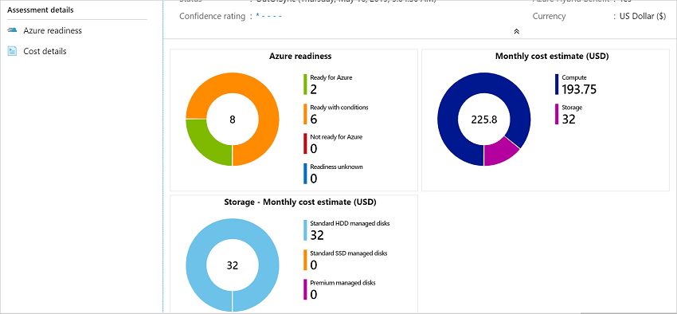

# Tutorial: Assess Hyper-V VMs for migration to Azure

As part of your migration journey to Azure, you assess your on-premises workloads to measure cloud readiness, identify risks, and estimate costs and complexity.

This article shows you how to assess discovered servers from your Hyper-V environment for migration to Azure, using the Azure Migrate: Discovery and assessment tool.

In this tutorial, you learn how to:
> [!div class="checklist"]
- Run an assessment.
- Analyze an assessment.

> [!NOTE]
> Tutorials show the quickest path for trying out a scenario, and use default options where possible. 

If you don't have an Azure subscription, create a [free account](https://azure.microsoft.com/pricing/free-trial/) before you begin.

## Prerequisites

- Before you follow this tutorial to assess your servers for migration to Azure VMs, make sure you've discovered the servers you want to assess:
    - To discover servers using the Azure Migrate appliance, [follow this tutorial](tutorial-discover-hyper-v.md). 
    - To discover servers using an imported CSV file, [follow this tutorial](tutorial-discover-import.md).

## Decide which assessment to run

Decide whether you want to run an assessment using sizing criteria based on server configuration data/metadata that's collected as-is on-premises, or on dynamic performance data.

**Assessment** | **Details** | **Recommendation**
--- | --- | ---
**As-is on-premises** | Assess based on server configuration data/metadata.  | Recommended Azure VM size is based on the on-premises VM size.   The recommended Azure disk type is based on what you select in the storage type setting in the assessment.
**Performance-based** | Assess based on collected dynamic performance data. | Recommended Azure VM size is based on CPU and memory utilization data.   The recommended disk type is based on the IOPS and throughput of the on-premises disks.

## Run an assessment

Run an assessment as follows:

1. On the **Get started** page > **Servers, databases and web apps**, select **Assess and migrate servers**.

   

2. In **Azure Migrate: Discovery and assessment**, select **Assess** > **Azure VM**.

    

3. In **Assess servers** > **Assessment type**, select **Azure VM**.
4. In **Discovery source**:

    - If you discovered servers using the appliance, select **Servers discovered from Azure Migrate appliance**.
    - If you discovered servers using an imported CSV file, select **Imported servers**. 
    
1. Select **Edit** to review the assessment properties.

    :::image type="content" source="./media/tutorial-assess-vmware-azure-vm/assessment-name.png" alt-text="Location of the Edit button to review assessment properties":::

1. In **Assessment settings**, set the necessary values or retain the default values:

   **Section** | **Setting** | **Details**
   | --- | --- | ---
   Target and pricing settings | **Target location** | The Azure region to which you want to migrate. Azure SQL configuration and cost recommendations are based on the location that you specify.
   Target and pricing settings | **Environment type** | The environment for the SQL deployments to apply pricing applicable to Production or Dev/Test.
   Target and pricing settings | **Offer/Licensing program** |The Azure offer if you're enrolled. Currently, the field is Pay-as-you-go by default, which gives you retail Azure prices.   You can avail additional discount by applying reserved capacity and Azure Hybrid Benefit on top of Pay-as-you-go offer. You can apply Azure Hybrid Benefit on top of Pay-as-you-go offer and Dev/Test environment. The assessment doesn't support applying Reserved Capacity on top of Pay-as-you-go offer and Dev/Test environment.  If the offer is set to *Pay-as-you-go* and Reserved capacity is set to *No reserved instances*, the monthly cost estimates are calculated by multiplying the number of hours chosen in the VM uptime field with the hourly price of the recommended SKU.
   Target and pricing settings | **Savings options - Azure SQL MI and DB (PaaS)** | Specify the reserved capacity savings option that you want the assessment to consider, to help optimize your Azure compute cost.    [Azure reservations](../cost-management-billing/reservations/save-compute-costs-reservations.md) (1 year or 3 year reserved) are a good option for the most consistently running resources.   When you select 'None', the Azure compute cost is based on the Pay as you go rate or based on actual usage.   You need to select pay-as-you-go in offer/licensing program to be able to use Reserved Instances. When you select any savings option other than 'None', the 'Discount (%)' and "VM uptime" settings aren't applicable. The monthly cost estimates are calculated by multiplying 744 hours with the hourly price of the recommended SKU.
   Target and pricing settings | **Savings options - SQL Server on Azure VM (IaaS)** | Specify the savings option that you want the assessment to consider, to help optimize your Azure compute cost.    [Azure reservations](../cost-management-billing/reservations/save-compute-costs-reservations.md) (1 year or 3 year reserved) are a good option for the most consistently running resources.   [Azure Savings Plan](../cost-management-billing/savings-plan/savings-plan-compute-overview.md) (1 year or 3 year savings plan) provide additional flexibility and automated cost optimization. Ideally post migration, you could use Azure reservation and savings plan at the same time (reservation is consumed first), but in the Azure Migrate assessments, you can only see cost estimates of 1 savings option at a time.    When you select 'None', the Azure compute cost is based on the Pay as you go rate or based on actual usage.   You need to select pay-as-you-go in offer/licensing program to be able to use Reserved Instances or Azure Savings Plan. When you select any savings option other than 'None', the 'Discount (%)' and "VM uptime" settings aren't applicable. The monthly cost estimates are calculated by multiplying 744 hours in the VM uptime field with the hourly price of the recommended SKU.
   Target and pricing settings | **Currency** | The billing currency for your account.
   Target and pricing settings | **Discount (%)** | Any subscription-specific discounts you receive on top of the Azure offer. The default setting is 0%.
   Target and pricing settings | **VM uptime** | Specify the duration (days per month/hour per day) that servers/VMs run. This is useful for computing cost estimates for SQL Server on Azure VM where you're aware that Azure VMs might not run continuously.   Cost estimates for servers where recommended target is *SQL Server on Azure VM* are based on the duration specified. Default is 31 days per month/24 hours per day.
   Target and pricing settings | **Azure Hybrid Benefit** | Specify whether you already have a Windows Server and/or SQL Server license. Azure Hybrid Benefit is a licensing benefit that helps you to significantly reduce the costs of running your workloads in the cloud. It works by letting you use your on-premises Software Assurance-enabled Windows Server and SQL Server licenses on Azure. For example, if you have a SQL Server license and they're covered with active Software Assurance of SQL Server Subscriptions, you can apply for the Azure Hybrid Benefit when you bring licenses to Azure.
   Assessment criteria | **Sizing criteria** | Set to *Performance-based* by default, which means Azure Migrate collects performance metrics pertaining to SQL instances and the databases managed by it to recommend an optimal-sized SQL Server on Azure VM and/or Azure SQL Database and/or Azure SQL Managed Instance configuration. 
   Assessment criteria | **Performance history** | Indicate the data duration on which you want to base the assessment. (Default is one day)
   Assessment criteria | **Percentile utilization** | Indicate the percentile value you want to use for the performance sample. (Default is 95th percentile)
   Assessment criteria | **Comfort factor** | Indicate the buffer you want to use during assessment. This accounts for issues like seasonal usage, short performance history, and likely increases in future usage. For example, consider a comfort factor of 2 for effective utilization of 2 Cores. In this case, the assessment considers the effective cores as 4 cores. Similarly, for the same comfort factor and an effective utilization of 8-GB memory, the assessment considers effective memory as 16 GB.
   Assessment criteria | **Optimization preference** | Specify the preference for the recommended assessment report. Selecting **Minimize cost** would result in the Recommended assessment report recommending those deployment types that have least migration issues and are most cost effective, whereas selecting **Modernize to PaaS** would result in Recommended assessment report recommending PaaS(Azure SQL MI or DB) deployment types over IaaS Azure(VMs), wherever the SQL Server instance is ready for migration to PaaS irrespective of cost.
   Azure SQL Managed Instance sizing | **Service Tier** | Choose the most appropriate service tier option to accommodate your business needs for migration to Azure SQL Managed Instance:  Select *Recommended* if you want Azure Migrate to recommend the best suited service tier for your servers. This can be General purpose or Business critical.  Select *General Purpose* if you want an Azure SQL configuration designed for budget-oriented workloads.  Select *Business Critical* if you want an Azure SQL configuration designed for low-latency workloads with high resiliency to failures and fast failovers.
   Azure SQL Managed Instance sizing | **Instance type** | Defaulted to *Single instance*.
   Azure SQL Managed Instance sizing | **Pricing Tier** | Defaulted to *Standard*.
   SQL Server on Azure VM sizing | **VM series** | Specify the Azure VM series you want to consider for *SQL Server on Azure VM* sizing. Based on the configuration and performance requirements of your SQL Server or SQL Server instance, the assessment recommends a VM size from the selected list of VM series.  You can edit settings as needed. For example, if you don't want to include D-series VM, you can exclude D-series from this list.  As Azure SQL assessments intend to give the best performance for your SQL workloads, the VM series list only has VMs that are optimized for running your SQL Server on Azure Virtual Machines (VMs). [Learn more](/azure/azure-sql/virtual-machines/windows/performance-guidelines-best-practices-checklist?preserve-view=true&view=azuresql#vm-size).
   SQL Server on Azure VM sizing | **Storage Type** | Defaulted to *Recommended*, which means the assessment recommends the best suited Azure Managed Disk based on the chosen environment type, on-premises disk size, IOPS and throughput.
   Azure SQL Database sizing | **Service Tier** | Choose the most appropriate service tier option to accommodate your business needs for migration to Azure SQL Database:  Select **Recommended** if you want Azure Migrate to recommend the best suited service tier for your servers. This can be General purpose or Business critical.  Select **General Purpose** if you want an Azure SQL configuration designed for budget-oriented workloads.  Select **Business Critical** if you want an Azure SQL configuration designed for low-latency workloads with high resiliency to failures and fast failovers.
   Azure SQL Database sizing | **Instance type** | Defaulted to *Single database*.
   Azure SQL Database sizing | **Purchase model** | Defaulted to *vCore*.
   Azure SQL Database sizing | **Compute tier** | Defaulted to *Provisioned*.
   High availability and disaster recovery properties | **Disaster recovery region** | Defaulted to the [cross-region replication pair](../reliability/cross-region-replication-azure.md#azure-cross-region-replication-pairings-for-all-geographies) of the Target Location. In the unlikely event that the chosen Target Location doesn't yet have such a pair, the specified Target Location itself is chosen as the default disaster recovery region.
   High availability and disaster recovery properties | **Multi-subnet intent** | Defaulted to Disaster recovery.    Select **Disaster recovery** if you want asynchronous data replication where some replication delays are tolerable. This allows higher durability using geo-redundancy. In the event of failover, data that hasn't yet been replicated may be lost.    Select **High availability** if you desire the data replication to be synchronous and no data loss due to replication delay is allowable. This setting allows assessment to leverage built-in high availability options in Azure SQL Databases and Azure SQL Managed Instances, and availability zones and zone-redundancy in Azure Virtual Machines to provide higher availability. In the event of failover, no data is lost.  
   High availability and disaster recovery properties | **Internet Access** | Defaulted to Available.   Select **Available** if you allow outbound internet access from Azure VMs. This allows the use of [Cloud Witness](/azure/azure-sql/virtual-machines/windows/hadr-cluster-quorum-configure-how-to#cloud-witness) which is the recommended approach for Windows Server Failover Clusters in Azure Virtual Machines.    Select **Not available** if the Azure VMs have no outbound internet access. This requires the use of a Shared Disk as a witness for Windows Server Failover Clusters in Azure Virtual Machines. 
   High availability and disaster recovery properties | **Async commit mode intent** | Defaulted to Disaster recovery.    Select **Disaster recovery** if you're using asynchronous commit availability mode to enable higher durability for the data without affecting performance. In the event of failover, data that hasn't yet been replicated may be lost.    Select **High availability** if you're using asynchronous commit data availability mode to improve availability and scale out read traffic. This setting allows assessment to leverage built-in high availability features in Azure SQL Databases, Azure SQL Managed Instances, and Azure Virtual Machines to provide higher availability and scale out.
1. Select **Save** if you make changes.

1. In **Assess Servers**, select **Next**.

1. In **Select servers to assess** > **Assessment name**, specify a name for the assessment. 

1. In **Select or create a group**, select **Create New** and specify a group name. 
   
1. Select the appliance, and select the VMs you want to add to the group. Then select **Next**.

1. In **Review + create assessment**, review the assessment details, and select **Create Assessment** to create the group and run the assessment.

1. After the assessment is created, view it in **Servers, databases and web apps** > **Azure Migrate: Discovery and assessment** > **Assessments**.

1. Select **Export assessment**, to download it as an Excel file.
    
    > [!NOTE]
    > For performance-based assessments, we recommend that you wait at least a day after starting discovery before you create an assessment. This provides time to collect performance data with higher confidence. Ideally, after you start discovery, wait for the performance duration you specify (day/week/month) for a high-confidence rating.

## Review an assessment

An assessment describes:

- **Azure readiness**: Whether VMs are suitable for migration to Azure.
- **Monthly cost estimation**: The estimated monthly compute and storage costs for running the VMs in Azure.
- **Monthly storage cost estimation**: Estimated costs for disk storage after migration.

To view an assessment:

1. In **Servers, databases and web apps** > **Azure Migrate: Discovery and assessment**, select the number next to **Assessments**.
2. In **Assessments**, select an assessment to open it. As an example (estimations and costs, for example,  only): 

    

3. Review the assessment summary. You can also edit the assessment properties, or recalculate the assessment.
 
 
### Review readiness

1. Select **Azure readiness**.
2. In **Azure readiness**, review the VM status:
    - **Ready for Azure**: Used when Azure Migrate recommends a VM size and cost estimates, for VMs in the assessment.
    - **Ready with conditions**: Shows issues and suggested remediation.
    - **Not ready for Azure**: Shows issues and suggested remediation.
    - **Readiness unknown**: Used when Azure Migrate can't assess readiness, because of data availability issues.

3. Select an **Azure readiness** status. You can view VM readiness details. You can also drill down to see VM details, including compute, storage, and network settings.

### Review cost estimates

The assessment summary shows the estimated compute and storage cost of running VMs in Azure. 

1. Review the monthly total costs. Costs are aggregated for all VMs in the assessed group.

    - Cost estimates are based on the size recommendations for a machine, its disks, and its properties.
    - Estimated monthly costs for compute and storage are shown.
    - The cost estimation is for running the on-premises VMs on Azure VMs. The estimation doesn't consider PaaS or SaaS costs.

2. Review monthly storage costs. The view shows the aggregated storage costs for the assessed group, split over different types of storage disks. 
3. You can drill down to see cost details for specific VMs.

### Review confidence rating

Azure Migrate assigns a confidence rating to performance-based assessments. Rating is from one star (lowest) to five stars (highest).

The confidence rating helps you estimate the reliability of  size recommendations in the assessment. The rating is based on the availability of data points needed to compute the assessment.

> [!NOTE]
> Confidence ratings aren't assigned if you create an assessment based on a CSV file.

Confidence ratings are as follows.

**Data point availability** | **Confidence rating**
--- | ---
0%-20% | 1 star
21%-40% | 2 stars
41%-60% | 3 stars
61%-80% | 4 stars
81%-100% | 5 stars

[Learn more](concepts-assessment-calculation.md#confidence-ratings-performance-based) about confidence ratings.

## Next steps

- Find server dependencies using [dependency mapping](concepts-dependency-visualization.md).
- Set up [agent-based](how-to-create-group-machine-dependencies.md) dependency mapping.
