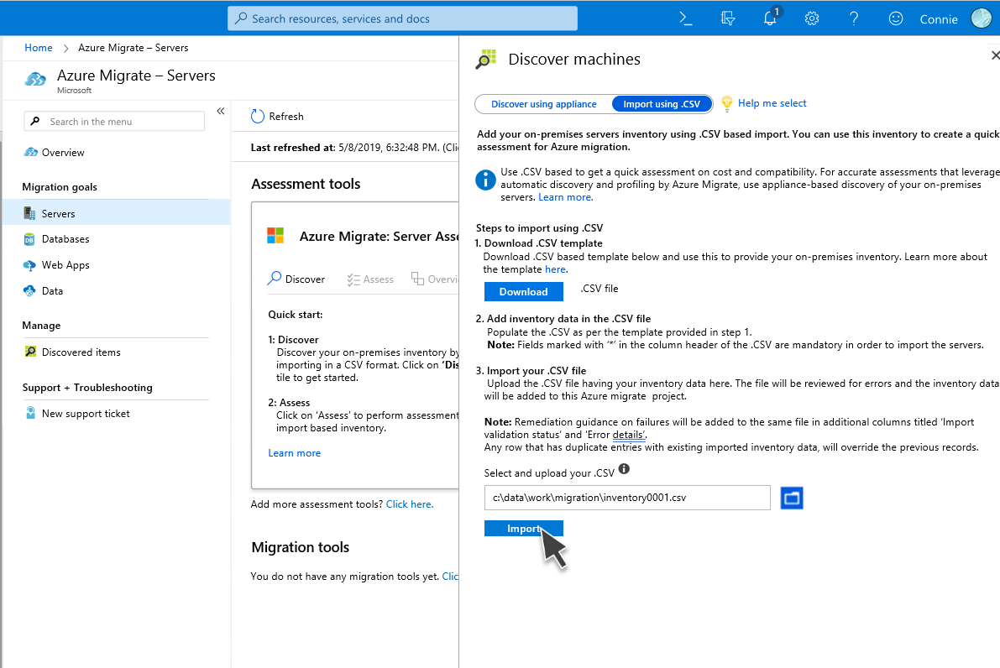
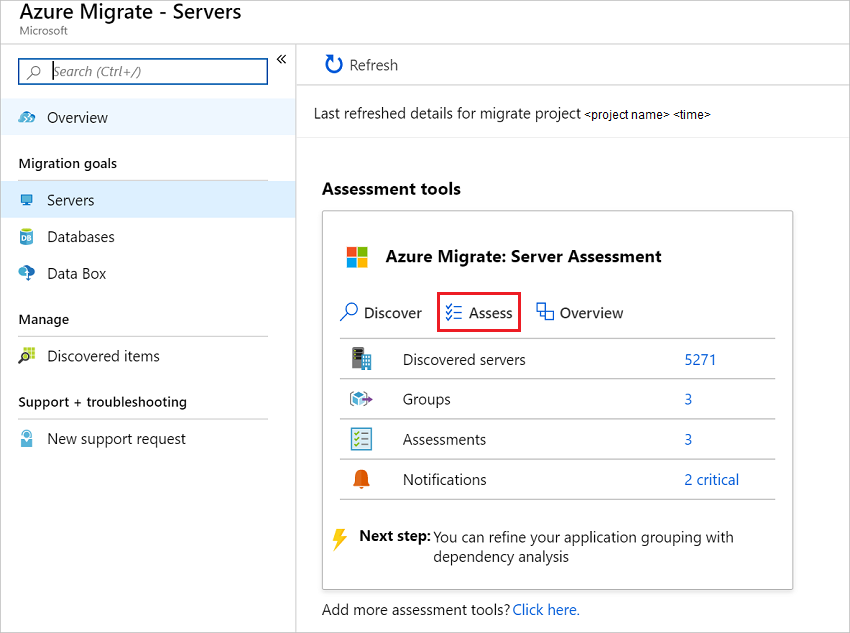
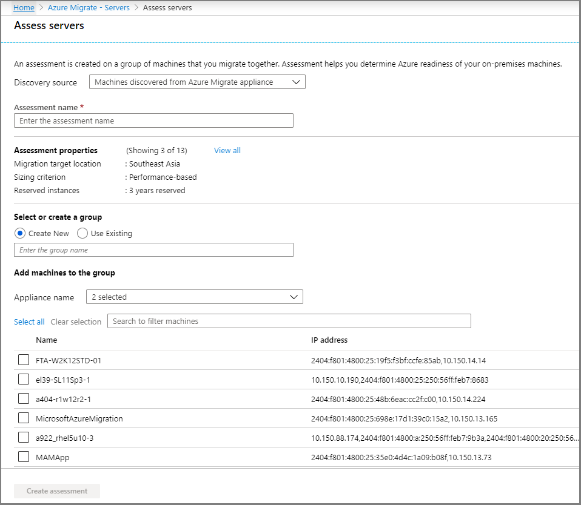

# Assess servers by using imported data

This article explains how to assess on-premises servers with the [Azure Migrate: Server Assessment](migrate-services-overview.md#azure-migrate-server-assessment-tool) tool, by importing server metadata in comma-separated values (CSV) format. This assessment method doesn't require you to set up the Azure Migrate appliance to create an assessment. It's useful if:

- You want to create a quick, initial assessment before you deploy the appliance.
- You can't deploy the Azure Migrate appliance in your organization.
- You can't share credentials that allow access to on-premises servers.
- Security constraints prevent you from gathering and sending data collected by the appliance to Azure. You can control the data you share in an imported file. Also, much of the data (for example, providing IP addresses) is optional.

## Before you start

Be aware of these points:

- You can add up to a maximum of 20,000 servers in a single CSV file.
- You can add up to 20,000 servers in an Azure Migrate project by using CSV.
- You can upload server information to Server Assessment multiple times by using CSV.
- Gathering application information is useful in evaluating your on-premises environment for migration. However, Server Assessment doesn't currently perform application-level assessment or take applications into account when creating an assessment.

In this tutorial, you learn how to:
> [!div class="checklist"]
> * Set up an Azure Migrate project.
> * Fill in a CSV file with server information.
> * Import the file to add server information into Server Assessment.
> * Create and review an assessment.

> [!NOTE]
> Tutorials show you the simplest deployment path for a scenario, so that you can quickly set up a proof of concept. Tutorials use default options where possible, and don't show all possible settings and paths. For detailed instructions, review the How-to guides.

If you don't have an Azure subscription, create a [free account](https://azure.microsoft.com/pricing/free-trial/) before you begin.

## Set Azure permissions for Azure Migrate

Your Azure account needs permissions to create an Azure Migrate project.

1. In the Azure portal, open the subscription, and select **Access control (IAM)**.
2. In **Check access**, find the relevant account, and then select it to view permissions.
3. Make sure you have **Contributor** or **Owner** permissions.
    - If you just created a free Azure account, you're the owner of your subscription.
    - If you're not the subscription owner, work with the owner to assign the role.

## Set up an Azure Migrate project

To set up a new Azure Migrate project:

1. In the Azure portal, in **All services**, search for **Azure Migrate**.
2. Under **Services**, select **Azure Migrate**.
3. In **Overview**, under **Discover, assess and migrate servers**, select **Assess and migrate servers**.

    

4. In **Getting started**, select **Add tool(s)**.
5. In **Migrate project**, select your Azure subscription, and create a resource group if you don't have one.
6. In **PROJECT DETAILS**, specify the project name and the geography in which you want to create the project. For more information:

    - Review the supported geographies for [public](migrate-support-matrix.md#supported-geographies-public-cloud) and [government clouds](migrate-support-matrix.md#supported-geographies-azure-government).
    - You can select any target region when you run a migration.

    

7. Select **Next**.
8. In **Select assessment tool**, select **Azure Migrate: Server Assessment** > **Next**.

    

9. In **Select migration tool**, select **Skip adding a migration tool for now** > **Next**.
10. In **Review + add tools**, review the settings, and then select **Add tools**.
11. Wait a few minutes for the Azure Migrate project to deploy. You'll then be taken to the project page. If you don't see the project, you can access it from **Servers** in the Azure Migrate dashboard.

## Prepare the CSV

Download the CSV template and add server information to it.

### Download the template

1. In **Migration Goals** > **Servers** > **Azure Migrate: Server Assessment**, select **Discover**.
2. In **Discover machines**, select **Import using CSV**.
3. Select **Download** to download the CSV template. Alternatively, you can [download it directly](https://go.microsoft.com/fwlink/?linkid=2109031).

    

### Add server information

Gather server data and add it to the CSV file.

- To gather data, you can export it from tools you use for on-premises server management, such as VMware vSphere or your configuration-management database (CMDB).
- To review sample data, download our [example file](https://go.microsoft.com/fwlink/?linkid=2108405).

The following table summarizes the file fields to fill in:

**Field name** | **Mandatory** | **Details**
--- | --- | ---
**Server name** | Yes | We recommend specifying the fully qualified domain name (FQDN).
**IP address** | No | Server address.
**Cores** | Yes | Number of processor cores allocated to the server.
**Memory** | Yes | Total RAM, in MB, allocated to the server.
**OS name** | Yes | Server operating system.   Operating system names that match or contain the names in [this](#supported-operating-system-names) list are recognized by the assessment.
**OS version** | No | Server operating system version.
**OS architecture** | No | Server OS architecture   Valid values are: x64, x86, amd64, 32-bit or 64-bit
**Number of disks** | No | Not needed if individual disk details are provided.
**Disk 1 size**  | No | Maximum size of disk, in GB. You can add details for more disks by [adding columns](#add-multiple-disks) in the template. You can add up to eight disks.
**Disk 1 read ops** | No | Disk read operations per second.
**Disk 1 write ops** | No | Disk write operations per second.
**Disk 1 read throughput** | No | Data read from the disk per second, in MB per second.
**Disk 1 write throughput** | No | Data written to disk per second, in MB per second.
**CPU utilization percentage** | No | Percentage of CPU used.
**Memory utilization percentage** | No | Percentage of RAM used.
**Total disks read ops** | No | Disk-read operations per second.
**Total disks write ops** | No | Disk-write operations per second.
**Total disks read throughput** | No | Data read from the disk, in MB per second.
**Total disks write throughput** | No | Data written to disk, in MB per second.
**Network In throughput** | No | Data received by the server, in MB per second.
**Network Out throughput** | No | Data transmitted by the server, in MB per second.
**Firmware type** | No | Server firmware. Values can be "BIOS" or "UEFI".
**MAC address**| No | Server MAC address.

### Add operating systems

Assessment recognizes specific operating system names. Any name you specify must exactly match one of the strings in the [supported names list](#supported-operating-system-names).

### Add multiple disks

The template provides default fields for the first disk. You can add similar columns for up to eight disks.

For example, to specify all fields for a second disk, add these columns:

- Disk 2 size
- Disk 2 read ops
- Disk 2 write ops
- Disk 2 read throughput
- Disk 2 write throughput

## Import the server information

After adding information to the CSV template, import the servers into Server Assessment.

1. In Azure Migrate, in **Discover machines**, go to the completed template.
2. Select **Import**.
3. The import status is shown.
    - If warnings appear in the status, you can either fix them or continue without addressing them.
    - To improve assessment accuracy, improve the server information as suggested in warnings.
    - To view and fix warnings, select **Download warning details .CSV**. This operation downloads the CSV with warnings included. Review the warnings and fix issues as needed.
    - If errors appear in the status so that the import status is **Failed**, you must fix those errors before you can continue with the import:
        1. Download the CSV, which now includes error details.
        1. Review and address the errors as necessary. 
        1. Upload the modified file again.
4. When the import status is **Completed**, the server information has been imported.

## Update server information

You can update the information for a server by importing the data for the server again with the same **Server name**. You can't modify the **Server name** field. Deleting servers is currently not supported.

## Verify servers in the portal

To verify that the servers appear in the Azure portal after discovery:

1. Open the Azure Migrate dashboard.
2. On the **Azure Migrate - Servers** > **Azure Migrate: Server Assessment** page, select the icon that displays the count for **Discovered servers**.
3. Select the **Import based** tab.

## Set up and run an assessment

You can create two types of assessments by using Server Assessment.

**Assessment type** | **Details** | **Data**
--- | --- | ---
**Performance-based** | Assessments based on performance-data values specified. | **Recommended VM size**: Based on CPU and memory usage data.   **Recommended disk type (standard or premium managed disk)**: Based on the input/output per second (IOPS) and throughput of the on-premises disks.
**As on-premises** | Assessments based on on-premises sizing. | **Recommended VM size**: Based on the server size specified.   **Recommended disk type**: Based on the storage-type setting you select for the assessment.

To run an assessment:

1. Review the [best practices](best-practices-assessment.md) for creating assessments.
2. In the **Servers** tab, in the **Azure Migrate: Server Assessment** tile, select **Assess**.

    

3. In **Assess servers**, specify a name for the assessment.
4. In **Discovery source**, select **Machines added via import to Azure Migrate**.
5. Select **View all** to review the assessment properties.

    

6. In **Select or create a group**, select **Create New**, and specify a group name. A group gathers one or more VMs together for assessment.
7. In **Add machines to the group**, select servers to add to the group.
8. Select **Create assessment** to create the group, and then run the assessment.

    

9. After the assessment is created, view it in **Servers** > **Azure Migrate: Server Assessment** > **Assessments**.
10. Select **Export assessment** to download it as a Microsoft Excel file.

## Review an assessment

An assessment describes:

- **Azure readiness**: Whether servers are suitable for migration to Azure.
- **Monthly cost estimation**: Estimated monthly compute and storage costs for running the servers in Azure.
- **Monthly storage cost estimation**: Estimated costs for disk storage after migration.

### View an assessment

1. In **Migration goals** > **Servers**, select **Assessments** in **Azure Migrate: Server Assessment**.
2. In **Assessments**, select an assessment to open it.

    

### Review Azure readiness

1. In **Azure readiness**, determine whether the servers are ready for migration to Azure.
2. Review the status:
    - **Ready for Azure**: Azure Migrate recommends a VM size and cost estimates for VMs in the assessment.
    - **Ready with conditions**: Shows problems and suggested remediation.
    - **Not ready for Azure**: Shows problems and suggested remediation.
    - **Readiness unknown**: Azure Migrate can't assess readiness, due to data-availability issues.

3. Select an **Azure readiness** status. You can view server-readiness details and drill down to see server details, including compute, storage, and network settings.

### Review cost details

This view shows the estimated compute and storage cost of running VMs in Azure. You can:

- Review the monthly compute and storage costs. Costs are aggregated for all servers in the assessed group.

    - Cost estimates are based on the size recommendations for a machine, and its disks and properties.
    - Estimated monthly costs for compute and storage are shown.
    - The cost estimate is for running the on-premises servers as infrastructure-as-a-service (IaaS) VMs. Server Assessment doesn't consider platform-as-a-service (PaaS) or software-as-a-service (SaaS) costs.

- Review monthly storage-cost estimates. This view shows aggregated storage costs for the assessed group, split among different types of storage disks.
- Drill down to see details for specific VMs.

> [!NOTE]
> Confidence ratings are not assigned to assessments of servers imported into Server Assessment by using CSV.

## Supported operating system names

Operating system names provided in the CSV must match or contain the names in this list. This is necessary for the names specified to be recognized as valid by the assessment.

<!-- BEGIN A - H -->

:::row:::
   :::column span="2":::
      **A - H**
   :::column-end:::
:::row-end:::
:::row:::
   :::column span="":::
      Apple Mac OS X 10
   :::column-end:::
   :::column span="":::
      Asianux 3 
      Asianux 4 
      Asianux 5
   :::column-end:::
:::row-end:::
:::row:::
   :::column span="":::
      CentOS 
      CentOS 4/5
   :::column-end:::
   :::column span="":::
      CoreOS Linux
   :::column-end:::
:::row-end:::
:::row:::
   :::column span="":::
      Debian GNU/Linux 4 
      Debian GNU/Linux 5 
      Debian GNU/Linux 6 
      Debian GNU/Linux 7 
      Debian GNU/Linux 8
   :::column-end:::
   :::column span="":::
      FreeBSD
   :::column-end:::
:::row-end:::

<!-- BEGIN I - R -->

:::row:::
   :::column span="2":::
      **I - R**
   :::column-end:::
:::row-end:::
:::row:::
   :::column span="":::
      IBM OS/2
   :::column-end:::
   :::column span="":::
      MS-DOS
   :::column-end:::
:::row-end:::
:::row:::
   :::column span="":::
      Novell NetWare 5 
      Novell NetWare 6
   :::column-end:::
   :::column span="":::
      Oracle Linux 
       Oracle Linux 4/5 
      Oracle Solaris 10 
       Oracle Solaris 11
   :::column-end:::
:::row-end:::
:::row:::
   :::column span="":::
      Red Hat Enterprise Linux 2 
      Red Hat Enterprise Linux 3 
      Red Hat Enterprise Linux 4 
      Red Hat Enterprise Linux 5 
      Red Hat Enterprise Linux 6 
      Red Hat Enterprise Linux 7 
      Red Hat Fedora
   :::column-end:::
:::row-end:::

<!-- BEGIN S - T -->

:::row:::
   :::column span="2":::
      **S - T**
   :::column-end:::
:::row-end:::
:::row:::
   :::column span="":::
      SCO OpenServer 5 
      SCO OpenServer 6 
      SCO UnixWare 7
   :::column-end:::
   :::column span="":::
      Serenity Systems eComStation 1 
      Serenity Systems eComStation 2
   :::column-end:::
:::row-end:::
:::row:::
   :::column span="":::
      Sun Microsystems Solaris 8 
      Sun Microsystems Solaris 9
   :::column-end:::
   :::column span="":::
      SUSE Linux Enterprise 10 
      SUSE Linux Enterprise 11 
      SUSE Linux Enterprise 12 
      SUSE Linux Enterprise 8/9 
      SUSE Linux Enterprise 11 
      SUSE openSUSE
   :::column-end:::
:::row-end:::

<!-- BEGIN U - Z -->
:::row:::
   :::column span="2":::
      **U - Z**
   :::column-end:::
:::row-end:::
:::row:::
   :::column span="":::
      Ubuntu Linux
   :::column-end:::
   :::column span="":::
      VMware ESXi 4 
      VMware ESXi 5 
      VMware ESXi 6
   :::column-end:::
:::row-end:::
:::row:::
   :::column span="":::
      Windows 10 
      Windows 2000 
      Windows 3 
      Windows 7 
      Windows 8 
      Windows 95 
      Windows 98 
      Windows NT 
      Windows Server (R) 2008 
      Windows Server 2003
   :::column-end:::
   :::column span="":::
      Windows Server 2008 
      Windows Server 2008 R2 
      Windows Server 2012 
      Windows Server 2012 R2 
      Windows Server 2016 
      Windows Server 2019 
      Windows Server Threshold 
      Windows Vista 
      Windows Web Server 2008 R2 
      Windows XP Professional
   :::column-end:::
:::row-end:::

## Next steps

In this tutorial, you:

> [!div class="checklist"]
> * Imported servers into Azure Migrate: Server Assessment by using CSV.
> * Created and reviewed an assessment.

Now, [deploy an appliance](./migrate-appliance.md) for more accurate assessments, and gather servers together into groups for deeper assessment by using [dependency analysis](./concepts-dependency-visualization.md).
