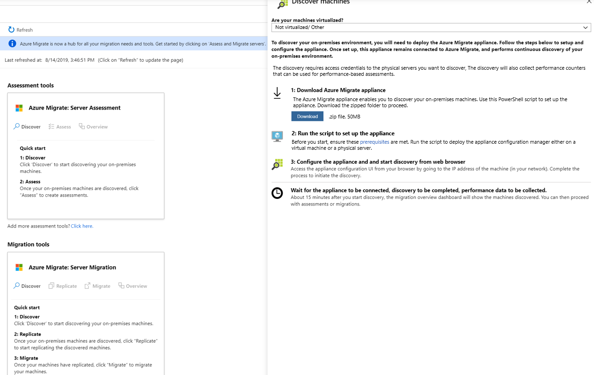

# Assess physical servers with Azure Migrate:Server Assessment

This article shows you how to assess on-premises physical servers, using the Azure Migrate:Server Assessment tool.

[Azure Migrate](migrate-services-overview.md) provides a hub of tools that help you to discover, assess, and migrate apps, infrastructure, and workloads to Microsoft Azure. The hub includes Azure Migrate tools, and third-party independent software vendor (ISV) offerings.

This tutorial is the second in a series that demonstrates how to assess and migrate physical servers to Azure. In this tutorial, you learn how to:
> [!div class="checklist"]
> * Set up an Azure Migrate project.
> * Set up an Azure Migrate appliance that runs on-premises to assess physical servers.
> * Start continuous discovery of on-premises physical servers. The appliance sends configuration and performance data for discovered servers to Azure.
> * Group discovered servers, and assess the server group.
> * Review the assessment.

> [!NOTE]
> Tutorials show you the simplest deployment path for a scenario so that you can quickly set up a proof-of-concept. Tutorials use default options where possible, and don't show all possible settings and paths. For detailed instructions, review the How-to articles.

If you don't have an Azure subscription, create a [free account](https://azure.microsoft.com/pricing/free-trial/) before you begin.


## Prerequisites

- [Complete](tutorial-prepare-physical.md) the first tutorial in this series. If you don't, the instructions in this tutorial won't work.
- Here's what you should have done in the first tutorial:
    - [Set up Azure permissions](tutorial-prepare-physical.md) for Azure Migrate.
    - [Prepare physical servers](tutorial-prepare-physical.md#prepare-for-physical-server-assessment) for assessment. Appliance requirements should be verified. You should also have an account set up for physical server discovery. Required ports should be available, and you should be aware of the URLs needed for access to Azure.


## Set up an Azure Migrate project

Set up a new Azure Migrate project as follows.

1. In the Azure portal > **All services**, search for **Azure Migrate**.
2. Under **Services**, select **Azure Migrate**.
3. In **Overview**, under **Discover, assess and migrate servers**, click **Assess and migrate servers**.

    

4. In **Getting started**, click **Add tools**.
5. In **Migrate project**, select your Azure subscription, and create a resource group if you don't have one.  
6. In **Project Details**, specify the project name, and the geography in which you want to create the project. Review supported geographies for [public](migrate-support-matrix.md#supported-geographies-public-cloud) and [government clouds](migrate-support-matrix.md#supported-geographies-azure-government).

    - The project geography is used only to store the metadata gathered from on-premises servers.
    - You can select any target region when you run a migration.

    


7. Click **Next**.
8. In **Select assessment tool**, select **Azure Migrate: Server Assessment** > **Next**.

    

9. In **Select migration tool**, select **Skip adding a migration tool for now** > **Next**.
10. In **Review + add tools**, review the settings, and click **Add tools**.
11. Wait a few minutes for the Azure Migrate project to deploy. You'll be taken to the project page. If you don't see the project, you can access it from **Servers** in the Azure Migrate dashboard.


## Set up the appliance

Azure Migrate: Server Assessment runs a lightweight appliance.

- This appliance performs physical server discovery and sends server metadata and performance data to Azure Migrate Server Assessment.
- To set up the appliance you:
    - Download a zipped file with Azure Migrate installer script from the Azure portal.
    - Extract the contents from the zipped file. Launch the PowerShell console with administrative privileges.
    - Execute the PowerShell script to launch the appliance web application.
    - Configure the appliance for the first time, and register it with the Azure Migrate project.
- You can set up multiple appliances for a single Azure Migrate project. Across all appliances, you can discover any number of physical servers. A maximum of 250 servers can be discovered per appliance.

### Download the installer script

Download the zipped file for the appliance.

1. In **Migration Goals** > **Servers** > **Azure Migrate: Server Assessment**, click **Discover**.
2. In **Discover machines** > **Are your machines virtualized?**, click **Not virtualized/Other**.
3. Click **Download** to download the zipped file.

    


### Verify security

Check that the zipped file is secure, before you deploy it.

1. On the machine to which you downloaded the file, open an administrator command window.
2. Run the following command to generate the hash for the zipped file:
    - ```C:\>CertUtil -HashFile <file_location> [Hashing Algorithm]```
    - Example usage for public cloud: ```C:\>CertUtil -HashFile C:\Users\administrator\Desktop\AzureMigrateInstaller.zip SHA256 ```
    - Example usage for government cloud: ```  C:\>CertUtil -HashFile C:\Users\administrator\Desktop\AzureMigrateInstaller-Server-USGov.zip MD5 ```
3.  Verify the latest appliance versions and hash values:
    - For the public cloud:

        **Scenario** | **Download*** | **Hash value**
        --- | --- | ---
        Physical (63.1 MB) | [Latest version](https://go.microsoft.com/fwlink/?linkid=2105112) | 0a27adf13cc5755e4b23df0c05732c6ac08d1fe8850567cb57c9906fbc3b85a0

    - For Azure Government:

        **Scenario** | **Download*** | **Hash value**
        --- | --- | ---
        Physical (63.1 MB) | [Latest version](https://go.microsoft.com/fwlink/?linkid=2120100&clcid=0x409) | 93dfef131026e70acdfad2769cd208ff745ab96a96f013cdf3f9e1e61c9b37e1

### Run the Azure Migrate installer script

The installer script does the following:

- Installs agents and a web application for physical server discovery and assessment.
- Install Windows roles, including Windows Activation Service, IIS, and PowerShell ISE.
- Download and installs an IIS rewritable module. [Learn more](https://www.microsoft.com/download/details.aspx?id=7435).
- Updates a registry key (HKLM) with persistent setting details for Azure Migrate.
- Creates the following files under the path:
    - **Config Files**: %Programdata%\Microsoft Azure\Config
    - **Log Files**: %Programdata%\Microsoft Azure\Logs

Run the script as follows:

1. Extract the zipped file to a folder on the server that will host the appliance.  Make sure you don't run the script on a machine on an existing Azure Migrate appliance.
2. Launch PowerShell on the above server with administrative (elevated) privilege.
3. Change the PowerShell directory to the folder where the contents have been extracted from the downloaded zipped file.
4. Run the script named **AzureMigrateInstaller.ps1** by running the following command:

    - For the public cloud: ``` PS C:\Users\administrator\Desktop\AzureMigrateInstaller> AzureMigrateInstaller.ps1 ```
    - For Azure Government: ``` PS C:\Users\Administrators\Desktop\AzureMigrateInstaller-Server-USGov>AzureMigrateInstaller.ps1 ```

    The script will launch the appliance web application when it finishes successfully.

If you come across any issues, you can access the script logs at C:\ProgramData\Microsoft Azure\Logs\AzureMigrateScenarioInstaller_<em>Timestamp</em>.log for troubleshooting.

### Verify appliance access to Azure

Make sure that the appliance can connect to Azure URLs for [public](migrate-appliance.md#public-cloud-urls) and [government](migrate-appliance.md#government-cloud-urls) clouds.


### Configure the appliance

Set up the appliance for the first time.

1. Open a browser on any machine that can connect to the appliance, and open the URL of the appliance web app: **https://*appliance name or IP address*: 44368**.

   Alternately, you can open the app from the desktop by clicking the app shortcut.
2. In the web app > **Set up prerequisites**, do the following:
    - **License**: Accept the license terms, and read the third-party information.
    - **Connectivity**: The app checks that the server has internet access. If the server uses a proxy:
        - Click **Proxy settings**, and specify the proxy address and listening port, in the form http://ProxyIPAddress or http://ProxyFQDN.
        - Specify credentials if the proxy needs authentication.
        - Only HTTP proxy is supported.
    - **Time sync**: Time is verified. The time on the appliance should be in sync with internet time for server discovery to work properly.
    - **Install updates**: Azure Migrate Server Assessment checks that the appliance has the latest updates installed.

### Register the appliance with Azure Migrate

1. Click **Log In**. If it doesn't appear, make sure you've disabled the pop-up blocker in the browser.
2. On the new tab, sign in using your Azure credentials.
    - Sign in with your username and password.
    - Sign in with a PIN isn't supported.
3. After successfully signing in, go back to the web app.
4. Select the subscription in which the Azure Migrate project was created. Then select the project.
5. Specify a name for the appliance. The name should be alphanumeric with 14 characters or less.
6. Click **Register**.


## Start continuous discovery

Now, connect from the appliance to the physical servers to be discovered, and start the discovery.

1. Click **Add Credentials** to specify the account credentials that the appliance will use to discover servers.  
2. Specify the **Operating System**,  a friendly name for the credentials, and the username and password. Then click **Add**.
You can add one set of credentials each for Windows and Linux servers.
4. Click **Add server**, and specify server details- FQDN/IP address and friendly name of credentials (one entry per row) to connect to the server.
3. Click **Validate**. After validation, the list of servers that can be discovered is shown.
    - If validation fails for a server, review the error by hovering over the icon in the **Status** column. Fix issues, and validate again.
    - To remove a server, select > **Delete**.
4. After validation, click **Save and start discovery** to start the discovery process.

This starts discovery. It takes around 1.5 minutes per server for metadata of discovered server to appear in the Azure portal.

### Verify servers in the portal

After discovery, you can verify that the servers appear in the Azure portal.

1. Open the Azure Migrate dashboard.
2. In **Azure Migrate - Servers** > **Azure Migrate: Server Assessment** page, click the icon that displays the count for **Discovered servers**.

## Set up an assessment

There are two types of assessments you can create using Azure Migrate: Server Assessment.

**Assessment** | **Details** | **Data**
--- | --- | ---
**Performance-based** | Assessments based on collected performance data | **Recommended VM size**: Based on CPU and memory utilization data.<br/><br/> **Recommended disk type (standard or premium managed disk)**: Based on the IOPS and throughput of the on-premises disks.
**As on-premises** | Assessments based on on-premises sizing. | **Recommended VM size**: Based on the on-premises server size<br/><br> **Recommended disk type**: Based on the storage type setting you select for the assessment.


### Run an assessment

Run an assessment as follows:

1. Review the [best practices](best-practices-assessment.md) for creating assessments.
2. In the **Servers** tab, in **Azure Migrate: Server Assessment** tile, click **Assess**.

    

2. In **Assess servers**, specify a name for the assessment.
3. Click **View all** to review the assessment properties.

    

3. In **Select or create a group**, select **Create New**, and specify a group name. A group gathers one or more servers together for assessment.
4. In **Add machines to the group**, select servers to add to the group.
5. Click **Create Assessment** to create the group, and run the assessment.

    

6. After the assessment is created, view it in **Servers** > **Azure Migrate: Server Assessment** > **Assessments**.
7. Click **Export assessment**, to download it as an Excel file.


## Review an assessment

An assessment describes:

- **Azure readiness**: Whether servers are suitable for migration to Azure.
- **Monthly cost estimation**: The estimated monthly compute and storage costs for running the servers in Azure.
- **Monthly storage cost estimation**: Estimated costs for disk storage after migration.

### View an assessment

1. In **Migration goals** >  **Servers**, click **Assessments** in **Azure Migrate: Server Assessment**.
2. In **Assessments**, click on an assessment to open it.

    

### Review Azure readiness

1. In **Azure readiness**, verify whether the servers are ready for migration to Azure.
2. Review the status:
    - **Ready for Azure**: Azure Migrate recommends a VM size and cost estimates for VMs in the assessment.
    - **Ready with conditions**: Shows issues and suggested remediation.
    - **Not ready for Azure**: Shows issues and suggested remediation.
    - **Readiness unknown**: Used when Azure Migrate can't assess readiness, due to data availability issues.

2. Click on an **Azure readiness** status. You can view server readiness details, and drill down to see server details, including compute, storage, and network settings.


### Review cost details

This view shows the estimated compute and storage cost of running VMs in Azure.

1. Review the monthly compute and storage costs. Costs are aggregated for all servers in the assessed group.

    - Cost estimates are based on the size recommendations for a machine, and its disks and properties.
    - Estimated monthly costs for compute and storage are shown.
    - The cost estimation is for running the on-premises servers as IaaS VMs. Azure Migrate Server Assessment doesn't consider PaaS or SaaS costs.

2. You can review monthly storage cost estimates. This view shows aggregated storage costs for the assessed group, split over different types of storage disks.
3. You can drill down to see details for specific servers.


### Review confidence rating

When you run performance-based assessments, a confidence rating is assigned to the assessment.


- A rating from 1-star (lowest) to 5-star (highest) is awarded.
- The confidence rating helps you estimate the reliability of the size recommendations provided by the assessment.
- The confidence rating is based on the availability of data points needed to compute the assessment.

Confidence ratings for an assessment are as follows.

**Data point availability** | **Confidence rating**
--- | ---
0%-20% | 1 Star
21%-40% | 2 Star
41%-60% | 3 Star
61%-80% | 4 Star
81%-100% | 5 Star

[Learn more](best-practices-assessment.md#best-practices-for-confidence-ratings) about best practices for confidence ratings.


## Next steps

In this tutorial, you:

> [!div class="checklist"]
> * Set up an Azure Migrate appliance
> * Created and reviewed an assessment

Continue to the third tutorial in the series, to learn how to migrate physical servers to Azure with Azure Migrate: Server Migration.

> [!div class="nextstepaction"]
> [Migrate physical servers](./tutorial-migrate-physical-virtual-machines.md)
