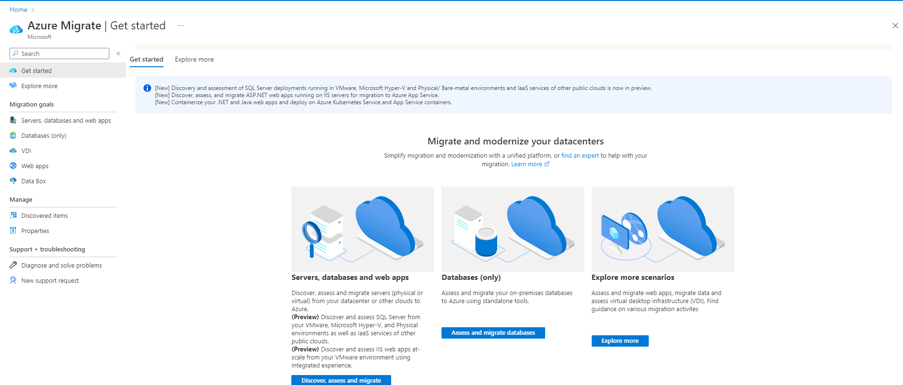
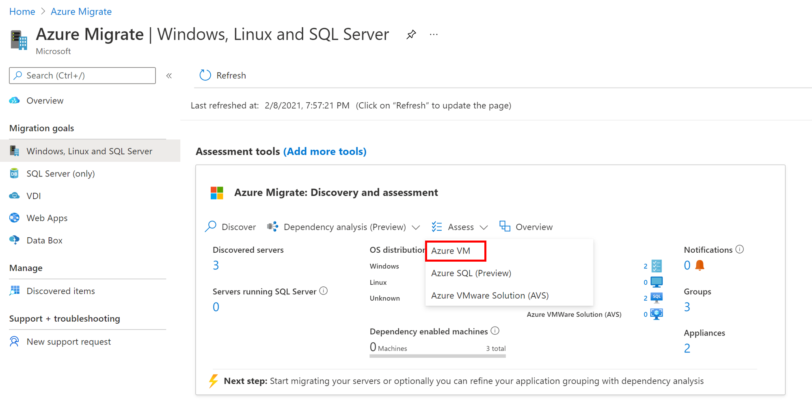

# Tutorial: Assess physical servers for migration to Azure

As part of your migration journey to Azure, you assess your on-premises workloads to measure cloud readiness, identify risks, and estimate costs and complexity.

This article shows you how to assess on-premises physical servers for migration to Azure, using the Azure Migrate: Discovery and assessment tool.

In this tutorial, you learn how to:
> [!div class="checklist"]
- Run an assessment based on server metadata and configuration information.
- Run an assessment based on performance data.

> [!NOTE]
> Tutorials show the quickest path for trying out a scenario, and use default options where possible. 

If you don't have an Azure subscription, create a [free account](https://azure.microsoft.com/pricing/free-trial/) before you begin.

## Prerequisites

- Before you follow this tutorial to assess your servers for migration to Azure VMs, make sure you've discovered the servers you want to assess:
    - To discover servers using the Azure Migrate appliance, [follow this tutorial](tutorial-discover-physical.md). 
    - To discover servers using an imported CSV file, [follow this tutorial](tutorial-discover-import.md).
- Make sure physical servers you want to assess aren't running Windows Server 2003, or SUSE Linux. Assessment isn't supported for these servers.

## Decide which assessment to run

Decide whether you want to run an assessment using sizing criteria based on server configuration data/metadata that's collected as-is on-premises, or on dynamic performance data.

**Assessment** | **Details** | **Recommendation**
--- | --- | ---
**As-is on-premises** | Assess based on server configuration data/metadata.  | Recommended Azure VM size is based on the on-premises VM size.   The recommended Azure disk type is based on what you select in the storage type setting in the assessment.
**Performance-based** | Assess based on collected dynamic performance data. | Recommended Azure VM size is based on CPU and memory utilization data.   The recommended disk type is based on the IOPS and throughput of the on-premises disks.

## Run an assessment

Run an assessment as follows:

1. 1. On the **Get started** page > **Servers, databases and web apps**, select **Discover, assess and migrate**.

   

2. In **Azure Migrate: Discovery and assessment**, select **Assess** > **Azure VM**.

    

3. In **Assess servers** > **Assessment type**, select **Azure VM**.
4. In **Discovery source**:

    - If you discovered servers using the appliance, select **Servers discovered from Azure Migrate appliance**.
    - If you discovered servers using an imported CSV file, select **Imported servers**. 
    
1. Select **Edit** to review the assessment properties.

    :::image type="content" source="./media/tutorial-assess-vmware-azure-vm/assessment-name.png" alt-text="Location of the edit button to review assessment properties":::

1. In **Assessment properties** > **Target Properties**:
   - In **Target location**, specify the Azure region to which you want to migrate.
   - Size and cost recommendations are based on the location that you specify. Once you change the target location from default, you will be prompted to specify **Reserved Instances** and **VM series**.
   - In Azure Government, you can target assessments in [these regions](migrate-support-matrix.md#azure-government).
   - In **Storage type**,
     - If you want to use performance-based data in the assessment, select **Automatic** for Azure Migrate to recommend a storage type, based on disk IOPS and throughput.
     - Alternatively, select the storage type you want to use for VM when you migrate it.
   - In **Savings options (compute)**, specify the savings option that you want the assessment to consider, helping to optimize your Azure compute cost. 
     - [Azure reservations](../cost-management-billing/reservations/save-compute-costs-reservations.md) (1 year or 3 year reserved) are a good option for the most consistently running resources.
     - [Azure Savings Plan](../cost-management-billing/savings-plan/savings-plan-compute-overview.md) (1 year or 3 year savings plan) provide additional flexibility and automated cost optimization. Ideally post migration, you could use Azure reservation and savings plan at the same time (reservation will be consumed first), but in the Azure Migrate assessments, you can only see cost estimates of 1 savings option at a time. 
     - When you select 'None', the Azure compute cost is based on the Pay as you go rate or based on actual usage.
     - You need to select pay-as-you-go in offer/licensing program to be able to use Reserved Instances or Azure Savings Plan. When you select any savings option other than 'None', the 'Discount (%)' and 'VM uptime' properties are not applicable.
1. In **VM Size**:
   - In **Sizing criterion**, select if you want to base the assessment on server configuration data/metadata, or on performance-based data. If you use performance data:
     - In **Performance history**, indicate the data duration on which you want to base the assessment.
     - In **Percentile utilization**, specify the percentile value you want to use for the performance sample. 
   - In **VM Series**, specify the Azure VM series you want to consider.
     - If you're using performance-based assessment, Azure Migrate suggests a value for you.
     - Tweak settings as needed. For example, if you don't have a production environment that needs A-series VMs in Azure, you can exclude A-series from the list of series.
   - In **Comfort factor**, indicate the buffer you want to use during assessment. This accounts for issues like seasonal usage, short performance history, and likely increases in future usage. For example, if you use a comfort factor of two:
     
     **Component** | **Effective utilization** | **Add comfort factor (2.0)**
     --- | --- | ---
      Cores | 2  | 4
      Memory | 8 GB | 16 GB

1. In **Pricing**:
   - In **Offer**, specify the [Azure offer](https://azure.microsoft.com/support/legal/offer-details/) if you're enrolled. The assessment estimates the cost for that offer.
   - In **Currency**, select the billing currency for your account.
   - In **Discount (%)**, add any subscription-specific discounts you receive on top of the Azure offer. The default setting is 0%.
   - In **VM Uptime**, specify the duration (days per month/hour per day) that VMs will run.
     - This is useful for Azure VMs that won't run continuously.
     - Cost estimates are based on the duration specified.
    - Default is 31 days per month/24 hours per day.
   - In **EA Subscription**, specify whether to take an Enterprise Agreement (EA) subscription discount into account for cost estimation. 
   - In **Azure Hybrid Benefit**, specify whether you already have a Windows Server license. If you do and they're covered with active Software Assurance of Windows Server Subscriptions, you can apply for the [Azure Hybrid Benefit](https://azure.microsoft.com/pricing/hybrid-use-benefit/) when you bring licenses to Azure.

1. Select **Save** if you make changes.

1. In **Assess Servers**, select **Next**.

1. In **Select servers to assess** > **Assessment name**, specify a name for the assessment. 

1. In **Select or create a group**, select **Create New** and specify a group name.   

1. Select the appliance, and select the VMs you want to add to the group. Then select **Next**.

1. In **Review + create assessment**, review the assessment details, and select **Create Assessment** to create the group and run the assessment.

1. After the assessment is created, view it in **Servers** > **Azure Migrate: Discovery and assessment** > **Assessments**.

1. Select **Export assessment**, to download it as an Excel file.
    
    > [!NOTE]
    > For performance-based assessments, we recommend that you wait at least a day after starting discovery before you create an assessment. This provides time to collect performance data with higher confidence. Ideally, after you start discovery, wait for the performance duration you specify (day/week/month) for a high-confidence rating.

## Review an assessment

An assessment describes:

- **Azure readiness**: Whether VMs are suitable for migration to Azure.
- **Monthly cost estimation**: The estimated monthly compute and storage costs for running the VMs in Azure.
- **Monthly storage cost estimation**: Estimated costs for disk storage after migration.

To view an assessment:

1. In **Servers, databases and web apps** > **Azure Migrate: Discovery and assessment**, select the number next to **Assessments**.
2. In **Assessments**, select an assessment to open it. As an example (estimations and costs for example only): 

    

3. Review the assessment summary. You can also edit the assessment properties, or recalculate the assessment.
 
 
### Review readiness

1. Select **Azure readiness**.
2. In **Azure readiness**, review the VM status:
    - **Ready for Azure**: Used when Azure Migrate recommends a VM size and cost estimates, for VMs in the assessment.
    - **Ready with conditions**: Shows issues and suggested remediation.
    - **Not ready for Azure**: Shows issues and suggested remediation.
    - **Readiness unknown**: Used when Azure Migrate can't assess readiness, because of data availability issues.

3. Select an **Azure readiness** status. You can view VM readiness details. You can also drill down to see VM details, including compute, storage, and network settings.

### Review cost estimates

The assessment summary shows the estimated compute and storage cost of running VMs in Azure. 

1. Review the monthly total costs. Costs are aggregated for all VMs in the assessed group.

    - Cost estimates are based on the size recommendations for a server, its disks, and its properties.
    - Estimated monthly costs for compute and storage are shown.
    - The cost estimation is for running the on-premises VMs on Azure VMs. The estimation doesn't consider PaaS or SaaS costs.

2. Review monthly storage costs. The view shows the aggregated storage costs for the assessed group, split over different types of storage disks. 
3. You can drill down to see cost details for specific VMs.

### Review confidence rating

Azure Migrate assigns a confidence rating to performance-based assessments. Rating is from one star (lowest) to five stars (highest).

The confidence rating helps you estimate the reliability of  size recommendations in the assessment. The rating is based on the availability of data points needed to compute the assessment.

> [!NOTE]
> Confidence ratings aren't assigned if you create an assessment based on a CSV file.

Confidence ratings are as follows.

**Data point availability** | **Confidence rating**
--- | ---
0%-20% | 1 star
21%-40% | 2 stars
41%-60% | 3 stars
61%-80% | 4 stars
81%-100% | 5 stars

[Learn more](concepts-assessment-calculation.md#confidence-ratings-performance-based) about confidence ratings.

## Next steps

- Find server dependencies using [dependency mapping](concepts-dependency-visualization.md).
- Set up [agent-based](how-to-create-group-machine-dependencies.md) dependency mapping.
