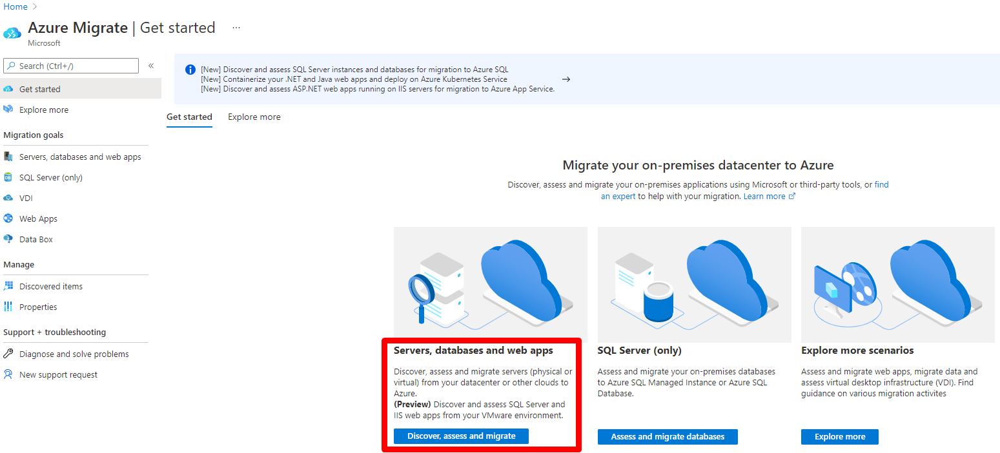

# Tutorial: Assess Spring Boot apps for migration to Azure Spring Apps

As part of your migration journey to Azure, you assess your on-premises workloads to measure cloud readiness, identify risks, and estimate costs and complexity. This article shows you how to assess discovered Spring Boot web apps in preparation for migration to Azure Spring Apps, using the Azure Migrate: Discovery and assessment tool. 

In this tutorial, you learn how to:

> [!div class="checklist"]
> * Run an assessment based on web apps configuration data.
> * Review an assessment.

> [!NOTE]
> Tutorials show the quickest path for trying out a scenario, and use default options where possible. 

## Prerequisites

- If you don't have an Azure subscription, create a [free account](https://azure.microsoft.com/pricing/free-trial/) before you begin.
- Before you follow this tutorial to assess your web apps for migration to Azure Spring Apps, make sure you've discovered the web apps you want to assess using the Azure Migrate appliance, [follow this tutorial](tutorial-discover-vmware.md)
- If you want to try out this feature in an existing project, ensure that you have completed the [prerequisites](how-to-discover-sql-existing-project.md) in this article.

## Run an assessment

Run an assessment as follows:

1. On the **Overview** page > **Servers, databases and web apps**, select **Discover, assess and migrate**.

    

2. On **Azure Migrate: Discovery and assessment**, select **Assess** and choose the assessment type as **Web apps on Azure**.

    

3. In **Create assessment**, you will be able to see the assessment type pre-selected as **Web apps on Azure** and the discovery source defaulted to **Servers discovered from Azure Migrate appliance**. Select the **Scenario** as **Spring Boot to Azure Apps**. 

4. Select **Edit** to review the assessment properties.

     

5. Here's what's included in the assessment properties:

    **Property** | **Details**
    --- | ---
    **Target location** | The Azure region to which you want to migrate. Azure Spring Apps configuration and cost recommendations are based on the location that you specify.
    **Environment Type** | 

    - In **Savings options (compute)**, specify the savings option that you want the assessment to consider to help optimize your Azure compute cost. 
        - [Azure reservations](../cost-management-billing/reservations/save-compute-costs-reservations.md) (1 year or 3 year reserved) are a good option for the most consistently running resources.
        - [Azure Savings Plan](../cost-management-billing/savings-plan/savings-plan-compute-overview.md) (1 year or 3 year savings plan) provide additional flexibility and automated cost optimization. Ideally post migration, you could use Azure reservation and savings plan at the same time (reservation will be consumed first), but in the Azure Migrate assessments, you can only see cost estimates of 1 savings option at a time. 
        - When you select *None*, the Azure compute cost is based on the Pay as you go rate or based on actual usage.
        - You need to select pay-as-you-go in offer/licensing program to be able to use Reserved Instances or Azure Savings Plan. When you select any savings option other than 'None', the 'Discount (%)' setting is not applicable.
        
        **Option** | **Description**
        ----- | -----
        **Offer** | The [Azure offer](https://azure.microsoft.com/support/legal/offer-details/) in which you're enrolled. The assessment estimates the cost for that offer.
        **Currency** | The billing currency for your account.
        **Discount (%)** | Any subscription-specific discounts you receive on top of the Azure offer. The default setting is 0%.
        **EA subscription** | Specifies that an Enterprise Agreement (EA) subscription is used for cost estimation. Takes into account the discount applicable to the subscription.    Retain the default settings for reserved instances and discount (%) properties.
        **Tier** | Specifies the level or grade to be used for assessment. Only Standard Tier is currently supported.

1. Select **Save** if you made any changes.
1. In **Create assessment**, select **Next**.
1. In **Select servers to assess** > **Assessment name**, specify a name for the assessment.
1. In **Select or create a group**, select **Create New** and specify a group name.
1. Select the appliance and select the servers that you want to add to the group. Select **Next**.
1. In **Review + create assessment**, review the assessment details, and select **Create Assessment** to create the group and run the assessment.
1. After the assessment is created, go to **Servers, databases and web apps** > **Azure Migrate: Discovery and assessment**. Refresh the tile data by selecting the **Refresh** option on top of the tile. Wait for the data to refresh.

    

1. Select the number next to **Web apps on Azure** in the **Assessment** section. 

1. Select the assessment name, which you wish to view.

## Review an assessment

**To view an assessment**:

1. In **Servers, databases and web apps** > **Azure Migrate: Discovery and assessment**, select the number next to the Web apps on Azure assessment. 
2. Select the assessment name, which you wish to view. 

   The Overview screen contains 3 sections: Essentials, Assessed entities, and Migration scenario. 

     **Essentials**

      **Field** | **Description**
      ----- | -----
      **Group** | 
      **Status** | 
      **Discovery source** |
      **Target location** | 
      **Currency** | 

  

   **Assessed entities**

   This section displays the number of servers selected for the assessments, number of Spring Boot runtime in the selected servers, and the number of distinct Sprint Boot app instances that were assessed. 

   **Migration scenario**

   This section provides a pictorial representation of the number of apps that are ready, ready with conditions, and not ready. In addition, it also lists the number of apps ready to migrate and the estimated cost for the migration.  

3. Review the assessment summary. You can also edit the assessment properties or recalculate the assessment.

#### Azure Spring Apps readiness

This indicates the distribution of the assessed web apps. You can drill down to understand the details around migration issues/warnings that you can remediate before migration. [Learn More](concepts-azure-webapps-assessment-calculation.md).

### Review readiness

1. In Assessments, select the name of the assessment that you want to view. 

    

1. Select Azure Spring Apps to view more details about each app and instances. Review the Azure Spring Apps readiness column in the table for the assessed web apps:  
    1. If there are no compatibility issues found, the readiness is marked as **Ready** for the target deployment type.
    1. If there are non-critical compatibility issues, such as degraded or unsupported features that do not block the migration to a specific target deployment type, the readiness is marked as **Ready with conditions** (hyperlinked) with **warning** details and recommended remediation guidance.
    1. If there are any compatibility issues that may block the migration to a specific target deployment type, the readiness is marked as **Not ready** with **issue** details and recommended remediation guidance.
    1. If the discovery is still in progress or there are any discovery issues for a web app, the readiness is marked as **Unknown** as the assessment could not compute the readiness for that web app.
1. Review the recommended SKU for the web apps, which is determined as per the matrix below:

    **Readiness** | **Determine size estimate** | **Determine cost estimates**
    --- | --- | ---
    Ready  | Yes | Yes
    Ready with conditions  | Yes  | Yes
    Not ready  | No | No
    Unknown  | No | No

### Review cost estimates

The assessment summary shows the estimated monthly costs for hosting you web apps. One or more apps can be configured to run on the same computing resources. 

