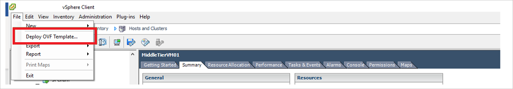
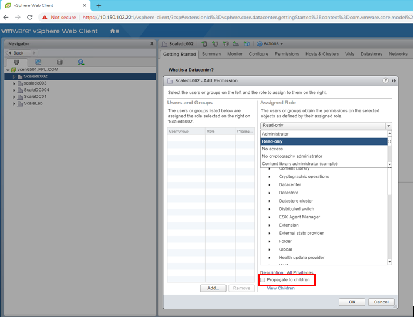
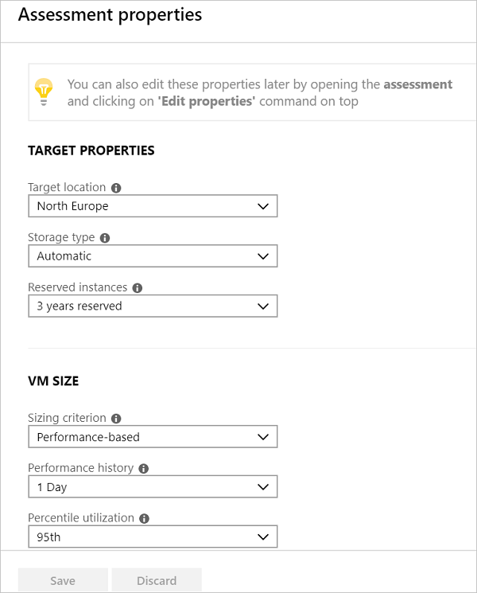
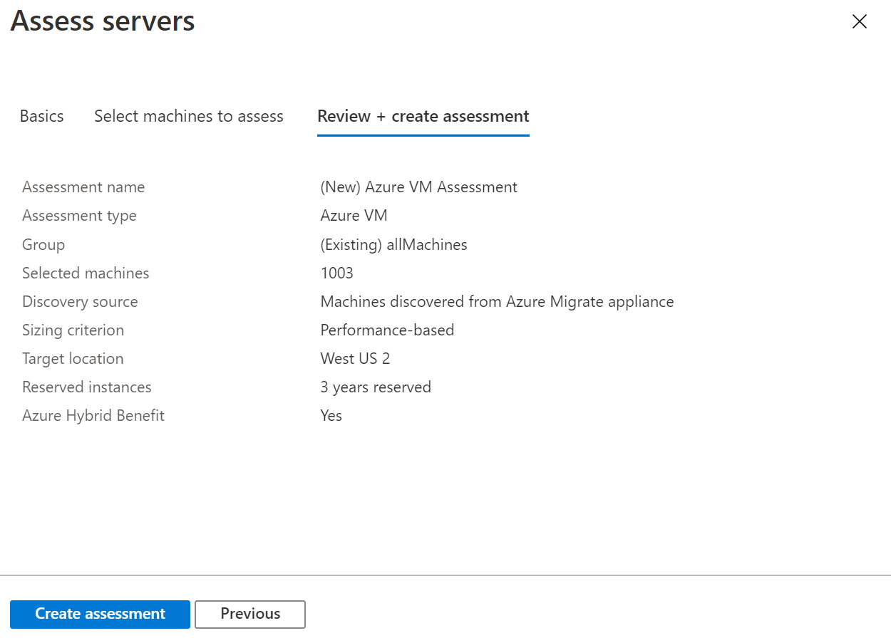
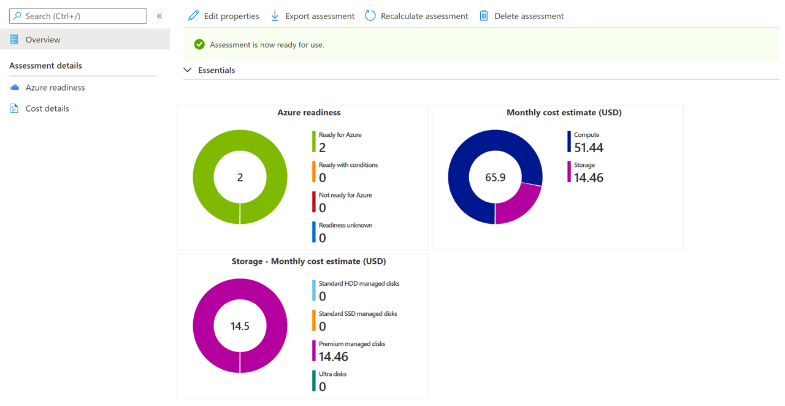

# Assess VMware VMs by using Azure Migrate Server Assessment

This article shows you how to assess on-premises VMware virtual machines (VMs) by using the Server Assessment tool in Azure Migrate.

[Azure Migrate](migrate-services-overview.md) provides a hub of tools that help you to discover, assess, and migrate apps, infrastructure, and workloads to Microsoft Azure. The hub includes Azure Migrate tools and independent software vendor (ISV) offerings from Microsoft partners.

This tutorial is the second in a series that demonstrates how to assess and migrate VMware VMs to Azure. In this tutorial, you learn how to:
> [!div class="checklist"]
> * Set up an Azure Migrate project.
> * Set up an Azure Migrate appliance that runs on-premises to assess VMs.
> * Start continuous discovery of on-premises VMs. The appliance sends configuration and performance data for discovered VMs to Azure.
> * Group discovered VMs, and assess the VM group.
> * Review the assessment.

> [!NOTE]
> Tutorials show you the simplest deployment path for a scenario so that you can quickly set up a proof-of-concept. Tutorials use default options where possible, and don't show all possible settings and paths. For detailed instructions, review the how-to articles.

If you don't have an Azure subscription, create a [free account](https://azure.microsoft.com/pricing/free-trial/) before you begin.

## Prerequisites

[Complete the first tutorial](tutorial-prepare-vmware.md) in this series. If you don't, the instructions in this tutorial won't work.

Here's what you should have done in the first tutorial:

- [Set up Azure permissions](tutorial-prepare-vmware.md#prepare-azure) for Azure Migrate.
- [Prepare VMware](tutorial-prepare-vmware.md#prepare-for-vmware-vm-assessment) for assessment:
   - [Verify](migrate-support-matrix-vmware.md#vmware-requirements) VMware settings.
   - Set up permissions in VMware, to create a VMware VM with an OVA template.
   - Set up an [account for VM discovery](migrate-support-matrix-vmware.md#vmware-requirements). 
   - Make [required ports](migrate-support-matrix-vmware.md#port-access) available.
   - Be aware of the [URLs needed](migrate-replication-appliance.md#url-access) for access to Azure.

## Set up an Azure Migrate project

Set up a new Azure Migrate project as follows:

1. In the Azure portal > **All services**, search for **Azure Migrate**.
1. Under **Services**, select **Azure Migrate**.
1. In **Overview**, under **Discover, assess and migrate servers**, select **Assess and migrate servers**.

   

1. In **Getting started**, select **Add tools**.
1. In **Migrate project**, select your Azure subscription, and create a resource group if you don't have one.     
1. In **Project Details**, specify the project name and the geography in which you want to create the project. Asia, Europe, United Kingdom, and United States are supported.

   The project geography is used only to store the metadata gathered from on-premises VMs. You can select any target region when you run a migration.

   

1. Select **Next**.
1. In **Select assessment tool**, select **Azure Migrate: Server Assessment** > **Next**.

   

1. In **Select migration tool**, select **Skip adding a migration tool for now** > **Next**.
1. In **Review + add tools**, review the settings, and select **Add tools**.
1. Wait a few minutes for the Azure Migrate project to deploy. You'll be taken to the project page. If you don't see the project, you can access it from **Servers** in the Azure Migrate dashboard.

## Set up the appliance VM

Azure Migrate Server Assessment runs a lightweight VMware VM appliance. This appliance performs VM discovery and gathers VM metadata and performance data.

To set up the appliance, you:

- Download an OVA template file, and import it to vCenter Server.
- Create the appliance, and check that it can connect to Azure Migrate Server Assessment.
- Configure the appliance for the first time, and register it with the Azure Migrate project.

You can set up multiple appliances for a single Azure Migrate project. Across all appliances, Server Assessment supports discovery of up to 35,000 VMs. It can discover a maximum of 10,000 servers per appliance.

### Download the OVA template

1. In **Migration Goals** > **Servers** > **Azure Migrate: Server Assessment**, select **Discover**.
1. In **Discover machines** > **Are your machines virtualized?**, select **Yes, with VMWare vSphere hypervisor**.
1. Select **Download** to download the OVA template file.

   

### Verify security

Check that the OVA file is secure, before you deploy it:

1. On the machine to which you downloaded the file, open an administrator command window.
1. Run the following command to generate the hash for the OVA file:
  
   ```C:\>CertUtil -HashFile <file_location> [Hashing Algorithm]```
   
   Example usage: ```C:\>CertUtil -HashFile C:\AzureMigrate\AzureMigrate.ova SHA256```

For version 2.19.07.30, the generated hash should match these values:

**Algorithm** | **Hash value**
--- | ---
MD5 | c06ac2a2c0f870d3b274a0b7a73b78b1
SHA256 | 4ce4faa3a78189a09a26bfa5b817c7afcf5b555eb46999c2fad9d2ebc808540c

### Create the appliance VM

Import the downloaded file, and create a VM:

1. In the vSphere Client console, select **File** > **Deploy OVF Template**.

   

1. In the Deploy OVF Template Wizard > **Source**, specify the location of the OVA file.
1. In **Name** and **Location**, specify a friendly name for the VM. Select the inventory object in which the VM will be hosted.
1. In **Host/Cluster**, specify the host or cluster on which the VM will run.
1. In **Storage**, specify the storage destination for the VM.
1. In **Disk Format**, specify the disk type and size.
1. In **Network Mapping**, specify the network to which the VM will connect. The network needs internet connectivity to send metadata to Azure Migrate Server Assessment.
1. Review and confirm the settings, and then select **Finish**.

### Verify appliance access to Azure

Make sure that the appliance VM can connect to [Azure URLs](migrate-appliance.md#url-access).

### Configure the appliance

Set up the appliance by using the following steps:

1. In the vSphere Client console, right-click the VM, and then select **Open Console**.
1. Provide the language, time zone, and password for the appliance.
1. Open a browser on any machine that can connect to the VM, and open the URL of the appliance web app: **https://*appliance name or IP address*: 44368**.

   Alternately, you can open the app from the appliance desktop by selecting the app shortcut.
1. In the web app > **Set up prerequisites**, do the following:
   - **License**: Accept the license terms, and read the third-party information.
   - **Connectivity**: The app checks that the VM has internet access. If the VM uses a proxy:
     - Select **Proxy settings**, and specify the proxy address and listening port in the form http://ProxyIPAddress or http://ProxyFQDN.
     - Specify credentials if the proxy needs authentication.
     - Note that only HTTP proxy is supported.
   - **Time sync**: The time on the appliance should be in sync with internet time for discovery to work properly.
   - **Install updates**: The appliance ensures that the latest updates are installed.
   - **Install VDDK**: The appliance checks that VMWare vSphere Virtual Disk Development Kit (VDDK) is installed. If it isn't installed, download VDDK 6.7 from VMware, and extract the downloaded zip contents to the specified location on the appliance.

     Azure Migrate Server Migration uses the VDDK to replicate machines during migration to Azure.       

### Register the appliance with Azure Migrate

1. Select **Log In**. If it doesn't appear, make sure you've disabled the pop-up blocker in the browser.
1. On the new tab, sign in by using your Azure username and password.
   
   Sign-in with a PIN isn't supported.
1. After you successfully sign in, go back to the web app.
1. Select the subscription in which the Azure Migrate project was created, and then select the project.
1. Specify a name for the appliance. The name should be alphanumeric with 14 characters or fewer.
1. Select **Register**.

## Start continuous discovery

The appliance needs to connect to vCenter Server to discover the configuration and performance data of the VMs.

### Specify vCenter Server details
1. In **Specify vCenter Server details**, specify the name (FQDN) or IP address of the vCenter Server instance. You can leave the default port or specify a custom port on which vCenter Server listens.
1. In **User name** and **Password**, specify the vCenter Server account credentials that the appliance will use to discover VMs on the vCenter Server instance. 

   Make sure that the account has the [required permissions for discovery](migrate-support-matrix-vmware.md#vmware-requirements). You can [scope the discovery](tutorial-assess-vmware.md#set-the-scope-of-discovery) by limiting access to the vCenter account.
1. Select **Validate connection** to make sure that the appliance can connect to vCenter Server.

### Specify VM credentials
For discovery of applications, roles, and features, and for visualizing dependencies of the VMs, you can provide VM credentials that have access to the VMware VMs. You can add one credential for Windows VMs and one credential for Linux VMs. [Learn more](https://docs.microsoft.com/azure/migrate/migrate-support-matrix-vmware#assessment-vcenter-server-permissions) about the necessary access permissions.

> [!NOTE]
> This input is optional, but you need it if you want to enable application discovery and agentless dependency visualization.

1. In **Discover applications and dependencies on VMs**, select **Add credentials**.
1. Make a selection for **Operating System**.
1. Provide a friendly name for the credential.
1. In **Username** and **Password**, specify an account that has at least guest access on the VMs.
1. Select **Add**.

After you've specified the vCenter Server instance and the VM credentials (optional), select **Save and start discovery** to start discovery of the on-premises environment.

It takes around 15 minutes for metadata of discovered VMs to appear in the portal. Discovery of installed applications, roles, and features takes some time. The duration depends on the number of VMs being discovered. For 500 VMs, it takes approximately 1 hour for the application inventory to appear in the Azure Migrate portal.

### Set the scope of discovery

Discovery can be scoped by limiting access of the vCenter account that's used for discovery. You can set the scope to vCenter Server datacenters, clusters, a folder of clusters, hosts, a folder of hosts, or individual VMs.

To set the scope, perform the following procedures.

#### 1. Create a vCenter user account
1.	Log in to vSphere Web Client as the vCenter Server administrator.
1.	Select **Administration** > **SSO users and Groups**, and then select the **Users** tab.
1.	Select the **New User** icon.
1.	Fill in the required information to create a new user, and then select **OK**.

#### 2. Define a new role with required permission
This procedure is required for agentless server migration.
1.	Log in to vSphere Web Client as the vCenter Server administrator.
1.	Browse to **Administration** > **Role Manager**.
1.	Select your vCenter Server instance from the drop-down menu.
1.	Select **Create role**.
1.	Enter a name for the new role (such as <em>Azure_Migrate</em>).
1.	Assign [permissions](https://docs.microsoft.com/azure/migrate/migrate-support-matrix-vmware#agentless-migration-vcenter-server-permissions) to the newly defined role.
1.	Select **OK**.

#### 3. Assign permissions on vCenter objects

There are two approaches for assigning permissions on inventory objects in vCenter to the vCenter user account with a role assigned to it.

For Server Assessment, you must apply the **Read-only** role to the vCenter user account for all the parent objects where the VMs to be discovered are hosted. All parent objects will be included: host, folder of hosts, cluster, and folder of clusters in the hierarchy up to the datacenter. These permissions will be propagated to child objects in the hierarchy.

Similarly for Server Migration, you must apply a user-defined role with [permissions](https://docs.microsoft.com/azure/migrate/migrate-support-matrix-vmware#agentless-migration-vcenter-server-permissions) to the vCenter user account for all the parent objects where the VMs to be migrated are hosted. This role can be named <em> Azure _Migrate</em>.



The alternative approach is to assign the user account and role at the datacenter level and propagate them to the child objects. Then give the account a **No access** role for every object (such as a VM) that you don't want to discover/migrate. 

This alternative configuration is cumbersome. It exposes accidental access controls, because every new child object is also automatically granted access that's inherited from the parent. So we recommend that you use the first approach.

> [!NOTE]
> Currently, Server Assessment can't discover VMs if the vCenter account has access granted at the vCenter VM folder level. If you want to scope your discovery by VM folders, you can do so by using the following procedure. It ensures that the vCenter account has read-only access assigned at a VM level.
>
> 1. Assign read-only permissions on all the VMs in the VM folders to which you want to scope the discovery.
> 1. Grant read-only access to all the parent objects where the VMs are hosted. All parent objects (host, folder of hosts, cluster, folder of clusters) in the hierarchy up to the datacenter will be included. You don't need to propagate the permissions to all child objects.
> 1. Use the credentials for discovery by selecting the datacenter as **Collection Scope**. The role-based access control that's set up ensures that the corresponding vCenter user will have access to only tenant-specific VMs.
>
> Note that folders of hosts and clusters are supported.

### Verify VMs in the portal

After discovery, you can verify that the VMs appear in the Azure portal:

1. Open the Azure Migrate dashboard.
1. In **Azure Migrate - Servers** > **Azure Migrate: Server Assessment**, select the icon that displays the count for **Discovered servers**.

## Set up an assessment

You can create two types of assessments by using Azure Migrate Server Assessment:

**Assessment** | **Details** | **Data**
--- | --- | ---
**Performance-based** | Assessments based on collected performance data | **Recommended VM size**: Based on CPU and memory utilization data.<br/><br/> **Recommended disk type (standard or premium managed disk)**: Based on the IOPS and throughput of the on-premises disks.
**As on-premises** | Assessments based on on-premises sizing | **Recommended VM size**: Based on the on-premises VM size.<br/><br> **Recommended disk type**: Based on the storage type setting that you select for the assessment.

## Run an assessment

Run an assessment as follows:

1. Review the [best practices](best-practices-assessment.md) for creating assessments.
1. On the **Servers** tab, in the **Azure Migrate: Server Assessment** tile, select **Assess**.

   

1. In **Assess servers**, specify a name for the assessment.
1. Select **View all**, and then review the assessment properties.

   

1. In **Select or create a group**, select **Create New**, and specify a group name. A group gathers one or more VMs together for assessment.
1. In **Add machines to the group**, select VMs to add to the group.
1. Select **Create Assessment** to create the group and run the assessment.

   

1. After the assessment is created, view it in **Servers** > **Azure Migrate: Server Assessment** > **Assessments**.
1. Select **Export assessment** to download it as an Excel file.

## Review an assessment

An assessment describes:

- **Azure readiness**: Whether VMs are suitable for migration to Azure.
- **Monthly cost estimation**: The estimated monthly compute and storage costs for running the VMs in Azure.
- **Monthly storage cost estimation**: Estimated costs for disk storage after migration.

To view an assessment:

1. In **Migration goals** > **Servers**, select **Assessments** in **Azure Migrate: Server Assessment**.
1. In **Assessments**, select an assessment to open it.

   

### Review Azure readiness

1. In **Azure readiness**, verify whether VMs are ready for migration to Azure.
1. Review the VM status:
    - **Ready for Azure**: Used when Azure Migrate recommends a VM size and cost estimates for VMs in the assessment.
    - **Ready with conditions**: Shows issues and suggested remediation.
    - **Not ready for Azure**: Shows issues and suggested remediation.
    - **Readiness unknown**: Used when Azure Migrate can't assess readiness because of data availability issues.

1. Select an **Azure readiness** status. You can view VM readiness details. You can also drill down to see VM details, including compute, storage, and network settings.

### Review cost details

The assessment summary shows the estimated compute and storage cost of running VMs in Azure. Costs are aggregated for all VMs in the assessed group. You can drill down to see cost details for specific VMs.

> [!NOTE]
> Cost estimates are based on the size recommendations for a machine, its disks, and its properties. Estimates are for running the on-premises VMs as IaaS VMs. Azure Migrate Server Assessment doesn't consider PaaS or SaaS costs.

The aggregated storage costs for the assessed group are split over different types of storage disks. 

### Review confidence rating

Azure Migrate Server Assessment assigns a confidence rating to a performance-based assessment, from 1 star (lowest) to 5 stars (highest).


The confidence rating helps you estimate the reliability of the assessment's size recommendations. The rating is based on the availability of data points needed to compute the assessment:

**Data point availability** | **Confidence rating**
--- | ---
0%-20% | 1 star
21%-40% | 2 stars
41%-60% | 3 stars
61%-80% | 4 stars
81%-100% | 5 stars

[Learn about best practices](best-practices-assessment.md#best-practices-for-confidence-ratings) for confidence ratings.

## Next steps

In this tutorial, you set up an Azure Migrate appliance. You also created and reviewed an assessment.

To learn how to migrate VMware VMs to Azure by using Azure Migrate Server Migration, continue to the third tutorial in the series:

> [!div class="nextstepaction"]
> [Migrate VMware VMs](./tutorial-migrate-vmware.md)
