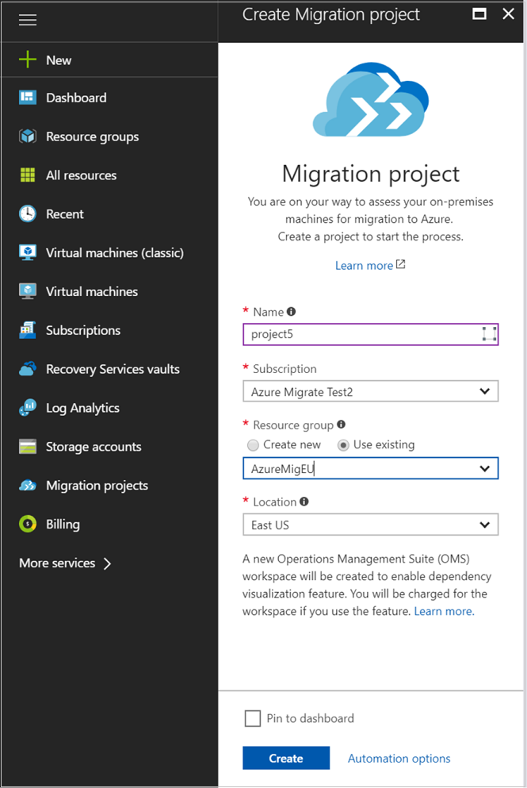
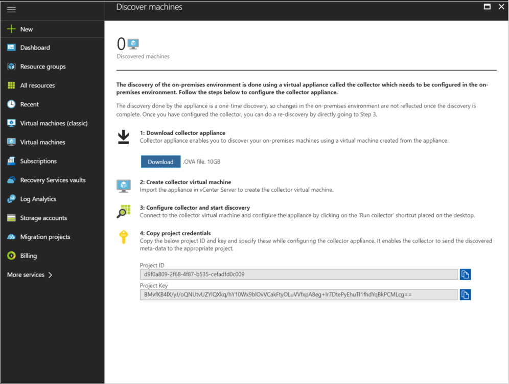
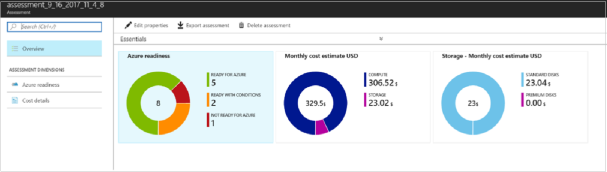
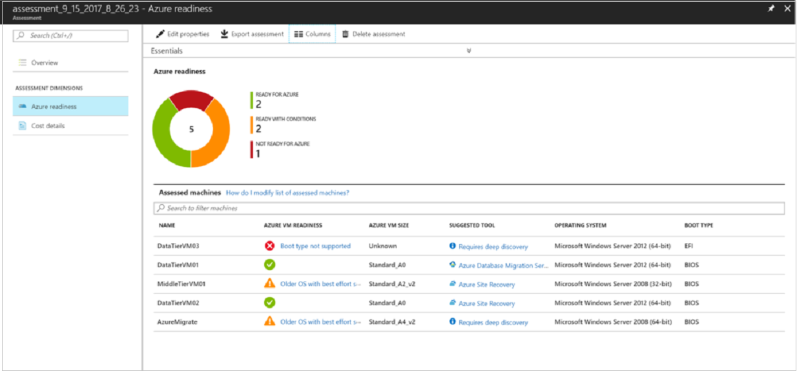
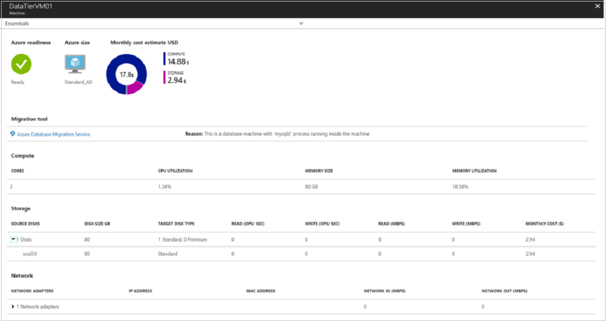

# Discover and assess on-premises VMware VMs for migration to Azure

The [Azure Migrate](migrate-overview.md) services assesses on-premises workloads for migration to Azure.

In this tutorial, you learn how to:

> [!div class="checklist"]
> * Create an account that Azure Migrate uses to discover on-premises VMs
> * Create an Azure Migrate project.
> * Set up an on-premises collector virtual machine (VM), to discover on-premises VMware VMs for assessment.
> * Group VMs and create an assessment.

If you don't have an Azure subscription, create a [free account](https://azure.microsoft.com/pricing/free-trial/) before you begin.

## Prerequisites

- **VMware**: The VMs that you plan to migrate must be managed by vCenter Server running version 5.5, 6.0, 6.5, or 6.7. Additionally, you need one ESXi host running version 5.5 or higher to deploy the collector VM.
- **vCenter Server account**: You need a read-only account to access the vCenter Server. Azure Migrate uses this account to discover the on-premises VMs.
- **Permissions**: On the vCenter Server, you need permissions to create a VM by importing a file in .OVA format.

## Create an account for VM discovery

Azure Migrate needs access to VMware servers to automatically discover VMs for assessment. Create a VMware account with the following properties. You specify this account during Azure Migrate setup.

- User type: At least a read-only user
- Permissions: Data Center object –> Propagate to Child Object, role=Read-only
- Details: User assigned at datacenter level, and has access to all the objects in the datacenter.
- To restrict access, assign the No access role with the Propagate to child object, to the child objects (vSphere hosts, datastores, VMs, and networks).


## Sign in to the Azure portal

Sign in to the [Azure portal](https://portal.azure.com).

## Create a project

1. In the Azure portal, click **Create a resource**.
2. Search for **Azure Migrate**, and select the service **Azure Migrate** in the search results. Then click **Create**.
3. Specify a project name, and the Azure subscription for the project.
4. Create a new resource group.
5. Specify the geography in which you want to create the project, then click **Create**. You can only create an Azure Migrate project in the following geographies. However, you can still plan your migration for any target Azure location. The geography specified for the project is only used to store the metadata gathered from on-premises VMs.

**Geography** | **Storage location**
--- | ---
Azure Government | US Gov Virginia
Asia | Southeast Asia
Europe | North Europe or West Europe
Unites States | East US or West Central US




## Download the collector appliance

Azure Migrate creates an on-premises VM known as the collector appliance. This VM discovers on-premises VMware VMs, and sends metadata about them to the Azure Migrate service. To set up the collector appliance, you download an .OVA file, and import it to the on-premises vCenter server to create the VM.

1. In the Azure Migrate project, click **Getting Started** > **Discover & Assess** > **Discover Machines**.
2. In **Discover machines**, click **Download** to download the appliance.

    The Azure Migrate appliance communicates with vCenter Server and continuously profiles the on-premises environment to gather real-time utilization data for each VM. It collects peak counters for each metric (CPU utilization, memory utilization etc.). This model does not depend on the statistics settings of vCenter Server for performance data collection. You can stop the continuous profiling anytime from the appliance.

    > [!NOTE]
    > The one-time discovery appliance is now deprecated as this method relied on vCenter Server's statistics settings for performance data point availability and collected average performance counters which resulted in under-sizing of VMs for migration to Azure.

    **Quick assessments:** With the continuous discovery appliance, once the discovery is complete (takes couple of hours depending on the number of VMs), you can immediately create assessments. Since the performance data collection starts when you kick off discovery, if you are looking for quick assessments, you should select the sizing criterion in the assessment as *as on-premises*. For performance-based assessments, it is advised to wait for at least a day after kicking off discovery to get reliable size recommendations.

    The appliance only collects performance data continuously, it does not detect any configuration change in the on-premises environment (that is, VM addition, deletion, disk addition etc.). If there is a configuration change in the on-premises environment, you can do the following to reflect the changes in the portal:

    - Addition of items (VMs, disks, cores etc.): To reflect these changes in the Azure portal, you can stop the discovery from the appliance and then start it again. This will ensure that the changes are updated in the Azure Migrate project.

    - Deletion of VMs: Due to the way the appliance is designed, deletion of VMs is not reflected even if you stop and start the discovery. This is because data from subsequent discoveries are appended to older discoveries and not overridden. In this case, you can simply ignore the VM in the portal, by removing it from your group and recalculating the assessment.


3. In **Copy project credentials**, copy the project ID and key. You need these when you configure the collector.

    

### Verify the collector appliance

Check that the .OVA file is secure, before you deploy it.

1. On the machine to which you downloaded the file, open an administrator command window.
2. Run the following command to generate the hash for the OVA:
    - ```C:\>CertUtil -HashFile <file_location> [Hashing Algorithm]```
    - Example usage: ```C:\>CertUtil -HashFile C:\AzureMigrate\AzureMigrate.ova SHA256```
3. The generated hash should match these settings.

#### Continuous discovery

  For OVA version 1.0.10.11

  **Algorithm** | **Hash value**
    --- | ---
    MD5 | 5f6b199d8272428ccfa23543b0b5f600
    SHA1 | daa530de6e8674a66a728885a7feb3b0a2e8ccb0
    SHA256 | 85da50a21a7a6ca684418a87ccc1dd4f8aab30152c438a17b216ec401ebb3a21

  For OVA version 1.0.10.9

  **Algorithm** | **Hash value**
  --- | ---
  MD5 | 169f6449cc1955f1514059a4c30d138b
  SHA1 | f8d0a1d40c46bbbf78cd0caa594d979f1b587c8f
  SHA256 | d68fe7d94be3127eb35dd80fc5ebc60434c8571dcd0e114b87587f24d6b4ee4d

  For OVA version 1.0.10.4

  **Algorithm** | **Hash value**
  --- | ---
  MD5 | 2ca5b1b93ee0675ca794dd3fd216e13d
  SHA1 | 8c46a52b18d36e91daeae62f412f5cb2a8198ee5
  SHA256 | 3b3dec0f995b3dd3c6ba218d436be003a687710abab9fcd17d4bdc90a11276be


#### One-time discovery (deprecated now)

This model is now deprecated, support for existing appliances will be provided.

  For OVA version 1.0.9.15

  **Algorithm** | **Hash value**
  --- | ---
  MD5 | e9ef16b0c837638c506b5fc0ef75ebfa
  SHA1 | 37b4b1e92b3c6ac2782ff5258450df6686c89864
  SHA256 | 8a86fc17f69b69968eb20a5c4c288c194cdcffb4ee6568d85ae5ba96835559ba

  For OVA version 1.0.9.14

  **Algorithm** | **Hash value**
  --- | ---
  MD5 | 6d8446c0eeba3de3ecc9bc3713f9c8bd
  SHA1 | e9f5bdfdd1a746c11910ed917511b5d91b9f939f
  SHA256 | 7f7636d0959379502dfbda19b8e3f47f3a4744ee9453fc9ce548e6682a66f13c

  For OVA version 1.0.9.12

  **Algorithm** | **Hash value**
  --- | ---
  MD5 | d0363e5d1b377a8eb08843cf034ac28a
  SHA1 | df4a0ada64bfa59c37acf521d15dcabe7f3f716b
  SHA256 | f677b6c255e3d4d529315a31b5947edfe46f45e4eb4dbc8019d68d1d1b337c2e

## Create the collector VM

Import the downloaded file to the vCenter Server.

1. In the vSphere Client console, click **File** > **Deploy OVF Template**.

    

2. In the Deploy OVF Template Wizard > **Source**, specify the location of the .ova file.
3. In **Name** and **Location**, specify a friendly name for the collector VM, and the inventory object in which the VM
will be hosted.
5. In **Host/Cluster**, specify the host or cluster on which the collector VM will run.
7. In storage, specify the storage destination for the collector VM.
8. In **Disk Format**, specify the disk type and size.
9. In **Network Mapping**, specify the network to which the collector VM will connect. The network needs internet connectivity, to send metadata to Azure.
10. Review and confirm the settings, then click **Finish**.

## Run the collector to discover VMs

1. In the vSphere Client console, right-click the VM > **Open Console**.
2. Provide the language, time zone, and password preferences for the appliance.
3. On the desktop, click the **Run collector** shortcut.
4. Click **Check for updates** in the top bar of the collector UI and verify that the collector is running on the latest version. If not, you can choose to download the latest upgrade package from the link and update the collector.
5. In the Azure Migrate Collector, open **Set up prerequisites**.
   - Select the Azure cloud to which you plan to migrate (Azure Global or Azure Government).
   - Accept the license terms, and read the third-party information.
   - The collector checks that the VM has internet access.
   - If the VM accesses the internet via a proxy, click **Proxy settings**, and specify the proxy address and listening port. Specify credentials if the proxy needs authentication. [Learn more](https://docs.microsoft.com/azure/migrate/concepts-collector#collector-prerequisites) about the internet connectivity requirements and the [list of URLs](https://docs.microsoft.com/azure/migrate/concepts-collector) that the collector accesses.

     > [!NOTE]
     > The proxy address needs to be entered in the form http:\//ProxyIPAddress or http:\//ProxyFQDN. Only HTTP proxy is supported. If you have an intercepting proxy, the internet connection might initially fail if you have not imported the proxy certificate; [learn more](https://docs.microsoft.com/azure/migrate/concepts-collector) on how you can fix this by importing the proxy certificate as a trusted certificate on the collector VM.

   - The collector checks that the collector service is running. The service is installed by default on the collector VM.
   - Download and install VMware PowerCLI.

6. In **Specify vCenter Server details**, do the following:
    - Specify the name (FQDN) or IP address of the vCenter server.
    - In **User name** and **Password**, specify the read-only account credentials that the collector will use to discover VMs on the vCenter server.
    - In **Collection scope**, select a scope for VM discovery. The collector can only discover VMs within the specified scope. Scope can be set to a specific folder, datacenter, or cluster. It shouldn't contain more than 1500 VMs. [Learn more](how-to-scale-assessment.md) about how you can discover a larger environment.

       > [!NOTE]
       > **Collection scope** lists only folders of hosts and clusters. Folders of VMs cannot be directly selected as collection scope. However, you can discover by using a vCenter account that has access to the individual VMs. [Learn more](https://docs.microsoft.com/azure/migrate/how-to-scale-assessment#set-up-permissions) about how to scope to a folder of VMs.

7. In **Specify migration project**, specify the Azure Migrate project ID and key that you copied from the portal. If didn't copy them, open the Azure portal from the collector VM. In the project **Overview** page, click **Discover Machines**, and copy the values.  
8. In **View collection progress**, monitor discovery status. [Learn more](https://docs.microsoft.com/azure/migrate/concepts-collector) about what data is collected by the Azure Migrate collector.

> [!NOTE]
> The collector only supports "English (United States)" as the operating system language and the collector interface language.
> If you change the settings on a machine you want to assess, trigger discover again before you run the assessment. In the collector, use the **Start collection again** option to do this. After the collection is done, select the **Recalculate** option for the assessment in the portal, to get updated assessment results.


### Verify VMs in the portal

The collector appliance will continuously profile the on-premises environment and will keep sending the performance data at an hour interval. You can view the machines in the portal after an hour of kicking off the discovery.

1. In the migration project, click **Manage** > **Machines**.
2. Check that the VMs you want to discover appear in the portal.


## Create and view an assessment

After VMs are discovered in the portal, you group them and create assessments. You can immediately create as on-premises assessments once the VMs are discovered in the portal. It is recommended to wait for at least a day before creating any performance-based assessments to get reliable size recommendations.

1. In the project **Overview** page, click **+Create assessment**.
2. Click **View all** to review the assessment properties.
3. Create the group, and specify a group name.
4. Select the machines that you want to add to the group.
5. Click **Create Assessment**, to create the group and the assessment.
6. After the assessment is created, view it in **Overview** > **Dashboard**.
7. Click **Export assessment**, to download it as an Excel file.

> [!NOTE]
> It is strongly recommended to wait for at least a day, after starting discovery, before creating an assessment. If you would like to update an existing assessment with the latest performance data, you can use the **Recalculate** command on the assessment to update it.

### Assessment details

An assessment includes information about whether the on-premises VMs are compatible for Azure, what would be the right VM size for running the VM in Azure and the estimated monthly Azure costs.



#### Azure readiness

The Azure readiness view in the assessment shows the readiness status of each VM. Depending on the properties of the VM, each VM can be marked as:
- Ready for Azure
- Conditionally ready for Azure
- Not ready for Azure
- Readiness unknown

For VMs that are ready, Azure Migrate recommends a VM size in Azure. The size recommendation done by Azure Migrate depends on the sizing criterion specified in the assessment properties. If the sizing criterion is performance-based sizing, the size recommendation is done by considering the performance history of the VMs (CPU and memory) and disks (IOPS and throughput). If the sizing criterion is 'as on-premises', Azure Migrate does not consider the performance data for the VM and disks. The recommendation for the VM size in Azure is done by looking at the size of the VM on-premises and the disk sizing is done based on the Storage type specified in the assessment properties (default is premium disks). [Learn more](concepts-assessment-calculation.md) about how sizing is done in Azure Migrate.

For VMs that aren't ready or conditionally ready for Azure, Azure Migrate explains the readiness issues, and provides remediation steps.

The VMs for which Azure Migrate cannot identify Azure readiness (due to data unavailability) are marked as readiness unknown.

In addition to Azure readiness and sizing, Azure Migrate also suggests tools that you can use for the migrating the VM. This requires a deeper discovery of on the on-premises environment. [Learn more](how-to-get-migration-tool.md) about how you can do a deeper discovery by installing agents on the on-premises machines. If the agents are not installed on the on-premises machines, lift and shift migration is suggested using [Azure Site Recovery](https://docs.microsoft.com/azure/site-recovery/site-recovery-overview). If the agents are installed on the on-premises machine, Azure Migrate looks at the processes running inside the machine and identifies whether the machine is a database machine or not. If the machine is a database machine, [Azure Database Migration Service](https://docs.microsoft.com/azure/dms/dms-overview) is suggested, else Azure Site Recovery is suggested as the migration tool.

    

#### Monthly cost estimate

This view shows the total compute and storage cost of running the VMs in Azure along with the details for each machine. Cost estimates are calculated considering the size recommendations done by Azure Migrate for a machine, its disks, and the assessment properties.

> [!NOTE]
> The cost estimation provided by Azure Migrate is for running the on-premises VMs as Azure Infrastructure as a service (IaaS) VMs. Azure Migrate does not consider any Platform as a service (PaaS) or Software as a service (SaaS) costs.

Estimated monthly costs for compute and storage are aggregated for all VMs in the group.



#### Confidence rating

Each performance-based assessment in Azure Migrate is associated with a confidence rating that ranges from 1 star to 5 star (1 star being the lowest and 5 star being the highest). The confidence rating is assigned to an assessment based on the availability of data points needed to compute the assessment. The confidence rating of an assessment helps you estimate the reliability of the size recommendations provided by Azure Migrate. Confidence rating is not applicable to "as-is" on-premises assessments.

For performance-based sizing, Azure Migrate needs the utilization data for CPU, memory of the VM. Additionally, for every disk attached to the VM, it needs the disk IOPS and throughput data. Similarly for each network adapter attached to a VM, Azure Migrate needs the network in/out to do performance-based sizing. If any of the above utilization numbers are not available in vCenter Server, the size recommendation done by Azure Migrate may not be reliable. Depending on the percentage of data points available, the confidence rating for the assessment is provided as below:

   **Availability of data points** | **Confidence rating**
   --- | ---
   0%-20% | 1 Star
   21%-40% | 2 Star
   41%-60% | 3 Star
   61%-80% | 4 Star
   81%-100% | 5 Star

An assessment may not have all the data points available due to one of the following reasons:

- You did not profile your environment for the duration for which you are creating the assessment. For example, if you are creating the assessment with performance duration set to 1 day, you need to wait for at least a day after you start the discovery for all the data points to get collected.

- Few VMs were shut down during the period for which the assessment is calculated. If any VMs were powered off for some duration, we will not be able to collect the performance data for that period.

- Few VMs were created in between the period for which the assessment is calculated. For example, if you are creating an assessment for the performance history of last one month, but few VMs were created in the environment only a week ago. In such cases, the performance history of the new VMs will not be there for the entire duration.

> [!NOTE]
> If the confidence rating of any assessment is below 5 Stars, wait for at least a day for the appliance to profile the environment and then *Recalculate* the assessment. If the preceding cannot be done , performance-based sizing may not be reliable and it is recommended to switch to *as on-premises sizing* by changing the assessment properties.

## Next steps

- [Learn](how-to-modify-assessment.md) how to customize an assessment based on your requirements.
- Learn how to create high-confidence assessment groups using [machine dependency mapping](how-to-create-group-machine-dependencies.md)
- [Learn more](concepts-assessment-calculation.md) about how assessments are calculated.
- [Learn](how-to-scale-assessment.md) how to discover and assess a large VMware environment.
- [Learn more](resources-faq.md) about the FAQs on Azure Migrate
